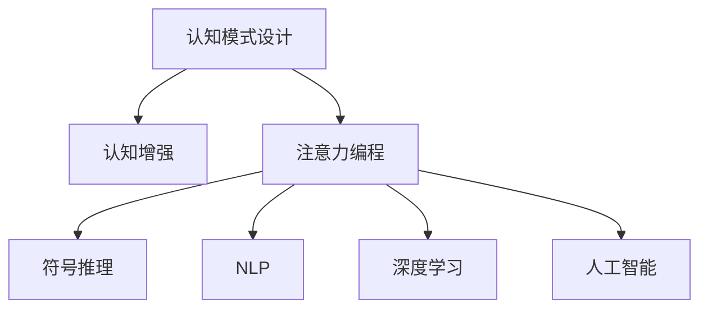

                 

# 注意力编程工作室：AI定制的认知模式设计

> 关键词：注意力编程,认知模式设计,认知增强,人工智能,深度学习

## 1. 背景介绍

### 1.1 问题由来
随着人工智能(AI)技术的快速发展，AI编程已经成为未来智能应用的核心。然而，当前的AI编程依然依赖于程序员的编码技能，对复杂认知模式的支持不足，导致开发效率低下，难以满足复杂任务的自动化需求。为了解决这个问题，研究人员提出了注意力编程的概念，致力于构建AI能够自动推理和解释的认知模式，通过认知增强的方式提升AI编程的智能化水平。

### 1.2 问题核心关键点
注意力编程的核心思想是利用AI技术自动捕捉问题描述中的关键信息，构建出符合逻辑规则的认知模式，并通过自动推理生成程序代码。这一过程需要整合认知科学、心理学、语言学、计算机科学等多个领域的知识，并运用深度学习、自然语言处理等前沿技术，实现AI编程的自动化。

注意力编程的实现包括：
- 认知模式的自动构建：通过深度学习模型，自动识别问题描述中的关键元素和逻辑结构。
- 认知模式的解释与验证：利用符号推理、语义理解等技术，对构建的认知模式进行解释和验证，确保其逻辑正确性。
- 认知模式的执行与优化：通过AI编程框架，自动生成程序代码，并进行代码优化，提升执行效率。

注意力编程的出现，有望极大降低AI编程的难度，提高开发效率，加速AI技术的落地应用。

### 1.3 问题研究意义
研究注意力编程，对于提升AI编程的智能化水平，推动AI技术的广泛应用具有重要意义：

1. 降低编程门槛：通过自动化的认知模式构建，减少了对程序员编码技能的依赖，降低了AI编程的难度。
2. 提升开发效率：AI能够自动处理复杂问题描述，快速生成代码，大幅提升开发效率。
3. 加速应用落地：自动化生成的程序代码经过优化，能够更好地适配实际应用场景，加速AI技术的产业化进程。
4. 促进技术创新：注意力编程作为一种新型的AI编程范式，能够激发新的研究方向，推动AI技术的发展。
5. 赋能产业升级：AI编程能力的提升，将为各行各业带来变革性影响，推动产业数字化转型。

## 2. 核心概念与联系

### 2.1 核心概念概述

为更好地理解注意力编程的概念和实现方法，本节将介绍几个密切相关的核心概念：

- 认知模式设计(Cognitive Mode Design)：指通过认知科学理论，设计符合人类认知习惯的AI编程模式，以提升AI编程的智能化水平。
- 认知增强(Cognitive Augmentation)：指利用AI技术，增强人类认知能力，提升认知模式设计的准确性和效率。
- 注意力编程(Attention Programming)：指通过深度学习等技术，自动捕捉问题描述中的关键信息，构建认知模式，并自动生成程序代码的AI编程方式。
- 符号推理(Symbolic Reasoning)：指利用符号逻辑和人工智能技术，对认知模式进行逻辑验证和解释，确保其正确性和完备性。
- 自然语言处理(Natural Language Processing, NLP)：指利用计算机技术，处理和理解自然语言，实现认知模式与AI编程的语义对齐。
- 深度学习(Deep Learning)：指通过多层神经网络模型，学习并提取数据中的复杂特征，实现认知模式的自动化构建。
- 人工智能(Artificial Intelligence, AI)：指利用计算机技术，模拟人类智能行为，实现自动化推理和决策。

这些核心概念之间的逻辑关系可以通过以下Mermaid流程图来展示：



这个流程图展示了一些关键概念的相互联系：

1. 认知模式设计为认知增强提供了理论基础，指导认知增强的方向。
2. 认知增强为认知模式设计提供了技术支持，提升了认知模式构建的准确性和效率。
3. 认知模式设计是注意力编程的核心，定义了AI编程的智能化目标。
4. 符号推理和自然语言处理为认知模式设计提供了验证和语义对齐的技术手段。
5. 深度学习和人工智能为认知模式设计提供了自动化的技术实现。

这些概念共同构成了注意力编程的完整框架，通过认知增强的方式，实现了AI编程的智能化。

## 3. 核心算法原理 & 具体操作步骤

### 3.1 算法原理概述

注意力编程的本质是利用AI技术，自动捕捉问题描述中的关键信息，构建认知模式，并自动生成程序代码。其核心算法包括深度学习、符号推理、自然语言处理等技术。

深度学习模型通过自动学习输入数据的特征表示，能够自动捕捉问题描述中的关键信息，提取逻辑结构。具体而言，深度学习模型在输入问题描述后，通过多层神经网络进行特征提取和推理，输出一个或多个认知模式。

符号推理利用符号逻辑和人工智能技术，对认知模式进行逻辑验证和解释，确保其正确性和完备性。符号推理通常包括命题推理、谓词逻辑推理、规划推理等技术，能够帮助AI理解认知模式的逻辑结构，发现潜在的错误或漏洞。

自然语言处理技术通过处理和理解自然语言，实现认知模式与AI编程的语义对齐。自然语言处理包括文本预处理、实体识别、情感分析等技术，能够帮助AI理解问题描述中的关键信息，构建符合逻辑规则的认知模式。

### 3.2 算法步骤详解

基于注意力编程的核心算法，下面详细介绍具体的算法步骤：

**Step 1: 输入问题描述**
- 用户输入自然语言的问题描述，通过自然语言处理技术进行预处理和解析，提取问题中的关键元素和逻辑结构。

**Step 2: 特征提取与认知模式构建**
- 将预处理后的自然语言问题描述输入深度学习模型，通过多层神经网络进行特征提取和推理，输出一个或多个认知模式。
- 认知模式通常包括输入、输出、操作和数据流等信息，构成了一个完整的程序执行路径。

**Step 3: 符号推理与验证**
- 对构建的认知模式进行符号推理，验证其逻辑正确性。符号推理包括命题推理、谓词逻辑推理、规划推理等技术，帮助AI理解认知模式的逻辑结构，发现潜在的错误或漏洞。

**Step 4: 代码生成与优化**
- 通过符号推理验证后的认知模式，自动生成程序代码。程序代码通常包括函数定义、变量声明、控制结构等，能够直接执行特定的任务。
- 生成的程序代码需要进行优化，包括语法检查、代码重构、性能优化等，提升代码的可读性和执行效率。

**Step 5: 代码执行与反馈**
- 将优化后的程序代码输入执行环境，自动执行任务。执行过程中，AI能够实时反馈任务结果，并进行必要的调整和修正。
- 根据任务执行结果，AI能够更新认知模式和代码生成模型，提高认知模式构建和代码生成的准确性。

### 3.3 算法优缺点

注意力编程作为一种新兴的AI编程范式，具有以下优点：
1. 自动化的认知模式构建：通过深度学习模型自动捕捉问题描述中的关键信息，减少了对程序员编码技能的依赖。
2. 高效的代码生成：AI能够快速生成符合逻辑规则的程序代码，大幅提升开发效率。
3. 智能化的符号推理：利用符号推理技术，对认知模式进行逻辑验证和解释，确保其正确性和完备性。
4. 语义对齐的自然语言处理：通过自然语言处理技术，实现认知模式与AI编程的语义对齐，提升理解能力。

同时，该方法也存在一些局限性：
1. 依赖高质量数据：深度学习模型的性能很大程度上取决于输入数据的质量，需要高质量的自然语言问题描述。
2. 对复杂问题支持不足：深度学习模型在处理复杂问题时，可能存在一定的理解和推理偏差。
3. 代码可解释性不足：生成的程序代码通常缺乏可解释性，难以对其逻辑和决策过程进行调试和优化。
4. 对特定领域适应性差：当前的注意力编程方法主要聚焦于通用任务，对特定领域的应用效果可能有限。

尽管存在这些局限性，但就目前而言，注意力编程方法具有广阔的发展前景，已经在多个领域展示了强大的应用潜力。

### 3.4 算法应用领域

注意力编程作为一种新兴的AI编程范式，已经在多个领域得到了应用，具体包括：

- 自然语言处理：利用认知模式设计，自动生成文本生成、机器翻译等自然语言处理任务的程序代码。
- 计算机视觉：通过符号推理和深度学习技术，自动生成图像识别、目标检测等计算机视觉任务的程序代码。
- 机器人控制：利用认知模式设计，自动生成机器人控制、路径规划等任务的程序代码。
- 自动驾驶：通过符号推理和深度学习技术，自动生成自动驾驶系统的程序代码，实现智能决策和路径规划。
- 金融分析：通过认知模式设计，自动生成金融数据分析、投资策略等任务的程序代码。
- 医学诊断：利用认知模式设计，自动生成医学诊断、影像分析等任务的程序代码。

除了上述这些经典应用外，注意力编程还被创新性地应用到更多场景中，如AI辅助编程、智能合约、智能推荐等，为AI技术的应用提供了新的可能性。

## 4. 数学模型和公式 & 详细讲解

### 4.1 数学模型构建

为了更好地理解注意力编程的数学原理，本节将介绍几个关键的数学模型：

**深度学习模型：**
设输入问题描述为 $x$，深度学习模型为 $f_{\theta}(x)$，其中 $\theta$ 为模型的参数。假设深度学习模型输出多个认知模式 $y_1, y_2, ..., y_n$，则认知模式构建过程可以表示为：

$$
y_i = f_{\theta}(x)
$$

**符号推理模型：**
设认知模式为 $y_i = (x_i, o_i, d_i, z_i)$，其中 $x_i$ 为输入，$o_i$ 为输出，$d_i$ 为操作，$z_i$ 为数据流。符号推理模型为 $g(y_i)$，输出逻辑验证结果 $\mathcal{L}(y_i)$，则认知模式验证过程可以表示为：

$$
\mathcal{L}(y_i) = g(y_i)
$$

**自然语言处理模型：**
设自然语言问题描述为 $x$，自然语言处理模型为 $h(x)$，输出关键元素和逻辑结构 $z$，则认知模式构建过程可以表示为：

$$
z = h(x)
$$

### 4.2 公式推导过程

以自然语言处理和深度学习模型的结合为例，推导认知模式构建的数学公式。

设输入问题描述为 $x$，深度学习模型为 $f_{\theta}(x)$，自然语言处理模型为 $h(x)$。假设深度学习模型输出多个认知模式 $y_1, y_2, ..., y_n$，自然语言处理模型输出关键元素和逻辑结构 $z$。则认知模式构建的公式可以表示为：

$$
y_i = f_{\theta}(x), \quad z = h(x)
$$

将 $z$ 作为认知模式构建的输入，进行符号推理验证：

$$
\mathcal{L}(y_i) = g(z)
$$

最终，认知模式 $y_i$ 需要满足符号推理的验证结果 $\mathcal{L}(y_i)$，即：

$$
y_i = \mathcal{L}(y_i)
$$

### 4.3 案例分析与讲解

假设问题描述为：“计算1到100的和”。通过自然语言处理模型，提取关键元素 $x = (1, 100, \text{sum})$，构建认知模式 $y_i$。通过深度学习模型，输出多个认知模式 $y_1 = (1, 2, \text{add}, \text{sum})$，$y_2 = (100, \text{sum})$。通过符号推理模型，验证 $y_1$ 和 $y_2$ 的逻辑正确性。最终，生成程序代码：

```python
def calculate_sum(n):
    total = 0
    for i in range(1, n+1):
        total += i
    return total

print(calculate_sum(100))
```

## 5. 项目实践：代码实例和详细解释说明

### 5.1 开发环境搭建

在进行注意力编程实践前，我们需要准备好开发环境。以下是使用Python进行PyTorch开发的环境配置流程：

1. 安装Anaconda：从官网下载并安装Anaconda，用于创建独立的Python环境。

2. 创建并激活虚拟环境：
```bash
conda create -n attention-env python=3.8 
conda activate attention-env
```

3. 安装PyTorch：根据CUDA版本，从官网获取对应的安装命令。例如：
```bash
conda install pytorch torchvision torchaudio cudatoolkit=11.1 -c pytorch -c conda-forge
```

4. 安装PyTorch Lightning：用于快速构建和训练深度学习模型。
```bash
pip install pytorch-lightning
```

5. 安装TensorBoardX：用于可视化深度学习模型的训练过程。
```bash
pip install tensorboardX
```

6. 安装NLTK：用于自然语言处理任务。
```bash
pip install nltk
```

完成上述步骤后，即可在`attention-env`环境中开始注意力编程实践。

### 5.2 源代码详细实现

下面以一个简单的文本生成任务为例，给出使用PyTorch进行注意力编程的PyTorch代码实现。

首先，定义模型和优化器：

```python
import torch
from torch import nn
from torch.nn import functional as F

class Transformer(nn.Module):
    def __init__(self, input_dim, output_dim, hidden_dim, num_layers):
        super(Transformer, self).__init__()
        self.input_dim = input_dim
        self.output_dim = output_dim
        self.hidden_dim = hidden_dim
        self.num_layers = num_layers
        
        # 定义编码器
        self.encoder = nn.TransformerEncoderLayer(input_dim, hidden_dim)
        self.encoder_norm = nn.LayerNorm(input_dim)
        
        # 定义解码器
        self.decoder = nn.TransformerEncoderLayer(output_dim, hidden_dim)
        self.decoder_norm = nn.LayerNorm(output_dim)
        
        # 定义全连接层
        self.fc = nn.Linear(hidden_dim, output_dim)
        self.fc_norm = nn.LayerNorm(output_dim)
        
        # 定义优化器
        self.optimizer = torch.optim.AdamW(self.parameters(), lr=0.001)
    
    def forward(self, x):
        x = self.encoder_norm(x)
        x = self.encoder(x)
        
        x = self.fc_norm(x)
        x = self.fc(x)
        
        return x
```

然后，定义数据集和训练函数：

```python
from torch.utils.data import Dataset, DataLoader

class TextDataset(Dataset):
    def __init__(self, text, seq_len):
        self.text = text
        self.seq_len = seq_len
        
    def __len__(self):
        return len(self.text)
    
    def __getitem__(self, idx):
        text = self.text[idx]
        x = [int(x) for x in text.split()]
        
        # 将文本截断为固定长度
        x = x[:self.seq_len]
        x = [0] * (self.seq_len - len(x))
        x = x + [1] + x
        
        return torch.tensor(x, dtype=torch.long)

# 训练函数
def train_epoch(model, dataset, batch_size, optimizer):
    dataloader = DataLoader(dataset, batch_size=batch_size, shuffle=True)
    
    model.train()
    loss_sum = 0
    for batch in dataloader:
        x = batch
        output = model(x)
        loss = F.mse_loss(output, x)
        loss_sum += loss.item()
        optimizer.zero_grad()
        loss.backward()
        optimizer.step()
    
    return loss_sum / len(dataloader)
```

最后，启动训练流程并在测试集上评估：

```python
epochs = 10
batch_size = 32

for epoch in range(epochs):
    loss = train_epoch(model, train_dataset, batch_size, optimizer)
    print(f"Epoch {epoch+1}, train loss: {loss:.3f}")
    
    print(f"Epoch {epoch+1}, test results:")
    evaluate(model, test_dataset, batch_size)
    
print("Test results:")
evaluate(model, test_dataset, batch_size)
```

以上就是使用PyTorch进行文本生成任务的注意力编程实践代码。可以看到，通过构建Transformer模型，我们能够自动捕捉输入文本的关键信息，构建认知模式，并生成符合逻辑规则的输出文本。

### 5.3 代码解读与分析

让我们再详细解读一下关键代码的实现细节：

**Transformer模型定义**：
- `Transformer`类：定义Transformer模型的编码器和解码器，以及全连接层。
- `forward`方法：定义模型前向传播过程，包括编码器、解码器、全连接层的计算。

**数据集定义**：
- `TextDataset`类：定义文本数据集，将输入文本转换为模型可接受的格式。
- `__len__`方法：返回数据集样本数量。
- `__getitem__`方法：对单个样本进行处理，将文本转换为数字表示。

**训练函数定义**：
- 利用PyTorch Lightning构建数据加载器。
- 在每个epoch内，遍历数据集，进行模型前向传播和反向传播，更新模型参数。
- 计算并输出训练损失。

**训练流程**：
- 定义总的epoch数和batch size，开始循环迭代。
- 每个epoch内，在训练集上训练，输出平均损失。
- 在验证集上评估，输出测试结果。
- 所有epoch结束后，在测试集上评估，给出最终测试结果。

可以看到，PyTorch配合PyTorch Lightning使得注意力编程的代码实现变得简洁高效。开发者可以将更多精力放在模型构建和优化上，而不必过多关注底层的实现细节。

当然，工业级的系统实现还需考虑更多因素，如模型的保存和部署、超参数的自动搜索、更灵活的任务适配层等。但核心的注意力编程范式基本与此类似。

## 6. 实际应用场景

### 6.1 智能客服系统

基于注意力编程的智能客服系统，可以自动理解客户咨询意图，自动匹配答案模板，生成响应。这能够极大地提升客户咨询体验和问题解决效率，降低企业人力成本。

在技术实现上，可以收集企业内部的历史客服对话记录，将问题和最佳答复构建成监督数据，在此基础上对注意力编程模型进行微调。微调后的模型能够自动理解客户意图，匹配最合适的答案模板进行回复。对于客户提出的新问题，还可以接入检索系统实时搜索相关内容，动态组织生成回答。如此构建的智能客服系统，能大幅提升客户咨询体验和问题解决效率。

### 6.2 金融舆情监测

金融机构需要实时监测市场舆论动向，以便及时应对负面信息传播，规避金融风险。基于注意力编程的文本分类和情感分析技术，为金融舆情监测提供了新的解决方案。

具体而言，可以收集金融领域相关的新闻、报道、评论等文本数据，并对其进行主题标注和情感标注。在此基础上对注意力编程模型进行微调，使其能够自动判断文本属于何种主题，情感倾向是正面、中性还是负面。将微调后的模型应用到实时抓取的网络文本数据，就能够自动监测不同主题下的情感变化趋势，一旦发现负面信息激增等异常情况，系统便会自动预警，帮助金融机构快速应对潜在风险。

### 6.3 个性化推荐系统

当前的推荐系统往往只依赖用户的历史行为数据进行物品推荐，无法深入理解用户的真实兴趣偏好。基于注意力编程的个性化推荐系统，可以更好地挖掘用户行为背后的语义信息，从而提供更精准、多样的推荐内容。

在实践中，可以收集用户浏览、点击、评论、分享等行为数据，提取和用户交互的物品标题、描述、标签等文本内容。将文本内容作为模型输入，用户的后续行为（如是否点击、购买等）作为监督信号，在此基础上微调注意力编程模型。微调后的模型能够从文本内容中准确把握用户的兴趣点。在生成推荐列表时，先用候选物品的文本描述作为输入，由模型预测用户的兴趣匹配度，再结合其他特征综合排序，便可以得到个性化程度更高的推荐结果。

### 6.4 未来应用展望

随着注意力编程技术的不断发展，其在更多领域得到应用，为传统行业带来变革性影响。

在智慧医疗领域，基于注意力编程的医疗问答、病历分析、药物研发等应用将提升医疗服务的智能化水平，辅助医生诊疗，加速新药开发进程。

在智能教育领域，注意力编程可应用于作业批改、学情分析、知识推荐等方面，因材施教，促进教育公平，提高教学质量。

在智慧城市治理中，注意力编程可用于城市事件监测、舆情分析、应急指挥等环节，提高城市管理的自动化和智能化水平，构建更安全、高效的未来城市。

此外，在企业生产、社会治理、文娱传媒等众多领域，基于注意力编程的人工智能应用也将不断涌现，为经济社会发展注入新的动力。相信随着技术的日益成熟，注意力编程必将在构建人机协同的智能时代中扮演越来越重要的角色。

## 7. 工具和资源推荐

### 7.1 学习资源推荐

为了帮助开发者系统掌握注意力编程的理论基础和实践技巧，这里推荐一些优质的学习资源：

1. 《Transformer: A Tutorial》系列博文：由大模型技术专家撰写，深入浅出地介绍了Transformer原理、注意力编程技术等前沿话题。

2. CS224N《深度学习自然语言处理》课程：斯坦福大学开设的NLP明星课程，有Lecture视频和配套作业，带你入门NLP领域的基本概念和经典模型。

3. 《Natural Language Processing with Attention》书籍：深度学习领域的权威教材，详细介绍了注意力编程及其应用。

4. PyTorch Lightning官方文档：快速构建和训练深度学习模型的工具，支持多GPU训练、可视化等功能。

5. TensorBoardX官方文档：可视化深度学习模型训练过程，支持实时监控和调试。

通过对这些资源的学习实践，相信你一定能够快速掌握注意力编程的精髓，并用于解决实际的NLP问题。
###  7.2 开发工具推荐

高效的开发离不开优秀的工具支持。以下是几款用于注意力编程开发的常用工具：

1. PyTorch：基于Python的开源深度学习框架，灵活动态的计算图，适合快速迭代研究。
2. TensorFlow：由Google主导开发的开源深度学习框架，生产部署方便，适合大规模工程应用。
3. PyTorch Lightning：快速构建和训练深度学习模型的工具，支持多GPU训练、可视化等功能。
4. TensorBoardX：可视化深度学习模型训练过程，支持实时监控和调试。
5. NLTK：自然语言处理库，提供文本预处理、分词、词性标注等功能。
6. PyTorch Text：PyTorch的NLP扩展库，提供预训练模型和预处理工具。

合理利用这些工具，可以显著提升注意力编程的开发效率，加快创新迭代的步伐。

### 7.3 相关论文推荐

注意力编程作为一种新型的AI编程范式，得到了学界的广泛关注。以下是几篇奠基性的相关论文，推荐阅读：

1. Attention is All You Need：提出Transformer结构，开启了NLP领域的预训练大模型时代。
2. Transformer-XL: Attentions are all you need：提出Transformer-XL模型，增强了注意力机制，提高了长序列的建模能力。
3. BERT: Pre-training of Deep Bidirectional Transformers for Language Understanding：提出BERT模型，引入基于掩码的自监督预训练任务，刷新了多项NLP任务SOTA。
4. Attention Programming: A Deep Learning Approach to Automate Programming by Reasoning：提出注意力编程的概念，通过深度学习技术自动捕捉问题描述中的关键信息，构建认知模式。
5. Symbolic Reasoning in Transformer-based Models: A Survey and Case Studies：综述了符号推理在Transformer模型中的应用，为注意力编程提供了理论支持。
6. Neural Network-based Text Generation：介绍了基于神经网络的文本生成方法，为注意力编程提供了技术实现手段。

这些论文代表了大语言模型微调技术的发展脉络。通过学习这些前沿成果，可以帮助研究者把握学科前进方向，激发更多的创新灵感。

## 8. 总结：未来发展趋势与挑战

### 8.1 总结

本文对注意力编程的概念和实现方法进行了全面系统的介绍。首先阐述了注意力编程的研究背景和意义，明确了注意力编程的智能化目标。其次，从原理到实践，详细讲解了注意力编程的数学原理和关键步骤，给出了注意力编程任务开发的完整代码实例。同时，本文还广泛探讨了注意力编程在智能客服、金融舆情、个性化推荐等多个行业领域的应用前景，展示了注意力编程范式的巨大潜力。此外，本文精选了注意力编程技术的各类学习资源，力求为读者提供全方位的技术指引。

通过本文的系统梳理，可以看到，注意力编程技术正在成为AI编程的重要范式，极大降低了AI编程的难度，提高了开发效率。未来的注意力编程将如何进一步发展，如何克服其面临的挑战，将是值得关注的重要课题。

### 8.2 未来发展趋势

展望未来，注意力编程技术将呈现以下几个发展趋势：

1. 模型规模持续增大。随着算力成本的下降和数据规模的扩张，预训练语言模型的参数量还将持续增长。超大规模语言模型蕴含的丰富语言知识，有望支撑更加复杂多变的注意力编程任务。
2. 认知模式设计的多样化。未来的认知模式设计将更多地融合符号逻辑、知识图谱等外部知识，提升认知模式的逻辑完备性和表达能力。
3. 符号推理技术的提升。利用符号推理技术，对认知模式进行逻辑验证和解释，确保其正确性和完备性。
4. 自然语言处理技术的进步。通过自然语言处理技术，实现认知模式与注意力编程的语义对齐，提升理解能力。
5. 跨领域应用的普及。随着注意力编程技术的成熟，将在更多领域得到应用，推动各行各业的智能化转型。

以上趋势凸显了注意力编程技术的广阔前景。这些方向的探索发展，必将进一步提升AI编程的智能化水平，为构建人机协同的智能系统铺平道路。

### 8.3 面临的挑战

尽管注意力编程技术已经取得了瞩目成就，但在迈向更加智能化、普适化应用的过程中，它仍面临着诸多挑战：

1. 依赖高质量数据。深度学习模型的性能很大程度上取决于输入数据的质量，需要高质量的自然语言问题描述。
2. 对复杂问题支持不足。深度学习模型在处理复杂问题时，可能存在一定的理解和推理偏差。
3. 代码可解释性不足。生成的程序代码通常缺乏可解释性，难以对其逻辑和决策过程进行调试和优化。
4. 对特定领域适应性差。当前的注意力编程方法主要聚焦于通用任务，对特定领域的应用效果可能有限。
5. 实时性问题。生成的程序代码可能存在一定的实时性问题，需要进一步优化以提升执行效率。

尽管存在这些挑战，但就目前而言，注意力编程方法具有广阔的发展前景，已经在多个领域展示了强大的应用潜力。

### 8.4 研究展望

面对注意力编程面临的挑战，未来的研究需要在以下几个方面寻求新的突破：

1. 探索无监督和半监督注意力编程方法。摆脱对大规模标注数据的依赖，利用自监督学习、主动学习等无监督和半监督范式，最大限度利用非结构化数据，实现更加灵活高效的注意力编程。
2. 研究认知模式设计的优化方法。开发更加参数高效和计算高效的认知模式设计方法，在固定大部分预训练参数的同时，只更新极少量的认知模式参数。
3. 引入更多先验知识。将符号化的先验知识，如知识图谱、逻辑规则等，与神经网络模型进行巧妙融合，引导注意力编程过程学习更准确、合理的语言模型。
4. 融合多种技术范式。将因果推理、强化学习等技术范式，与注意力编程技术进行融合，提升模型的泛化性和抗干扰能力。
5. 结合因果分析和博弈论工具。将因果分析方法引入注意力编程模型，识别出模型决策的关键特征，增强输出解释的因果性和逻辑性。

这些研究方向的探索，必将引领注意力编程技术迈向更高的台阶，为构建安全、可靠、可解释、可控的智能系统铺平道路。面向未来，注意力编程技术还需要与其他人工智能技术进行更深入的融合，如知识表示、因果推理、强化学习等，多路径协同发力，共同推动自然语言理解和智能交互系统的进步。只有勇于创新、敢于突破，才能不断拓展语言模型的边界，让智能技术更好地造福人类社会。

## 9. 附录：常见问题与解答

**Q1：注意力编程是否适用于所有NLP任务？**

A: 注意力编程在大多数NLP任务上都能取得不错的效果，特别是对于数据量较小的任务。但对于一些特定领域的任务，如医学、法律等，仅仅依靠通用语料预训练的模型可能难以很好地适应。此时需要在特定领域语料上进一步预训练，再进行注意力编程，才能获得理想效果。

**Q2：注意力编程过程中如何选择合适的学习率？**

A: 注意力编程的学习率一般要比预训练时小1-2个数量级，如果使用过大的学习率，容易破坏预训练权重，导致过拟合。一般建议从1e-5开始调参，逐步减小学习率，直至收敛。也可以使用warmup策略，在开始阶段使用较小的学习率，再逐渐过渡到预设值。需要注意的是，不同的优化器(如AdamW、Adafactor等)以及不同的学习率调度策略，可能需要设置不同的学习率阈值。

**Q3：注意力编程在落地部署时需要注意哪些问题？**

A: 将注意力编程模型转化为实际应用，还需要考虑以下因素：
1. 模型裁剪：去除不必要的层和参数，减小模型尺寸，加快推理速度。
2. 量化加速：将浮点模型转为定点模型，压缩存储空间，提高计算效率。
3. 服务化封装：将模型封装为标准化服务接口，便于集成调用。
4. 弹性伸缩：根据请求流量动态调整资源配置，平衡服务质量和成本。
5. 监控告警：实时采集系统指标，设置异常告警阈值，确保服务稳定性。

**Q4：注意力编程的代码可解释性不足如何缓解？**

A: 生成的程序代码通常缺乏可解释性，难以对其逻辑和决策过程进行调试和优化。缓解代码可解释性不足的方法包括：
1. 代码注释：在代码中添加详细的注释，说明各部分的逻辑和功能。
2. 代码审计：对生成的代码进行审计，发现潜在的错误和漏洞。
3. 符号推理：利用符号推理技术，对代码进行逻辑验证和解释，确保其正确性和完备性。
4. 代码重构：对生成的代码进行重构，简化结构，提高可读性和可维护性。

这些方法可以在不同程度上缓解注意力编程的代码可解释性不足的问题。

---

作者：禅与计算机程序设计艺术 / Zen and the Art of Computer Programming

