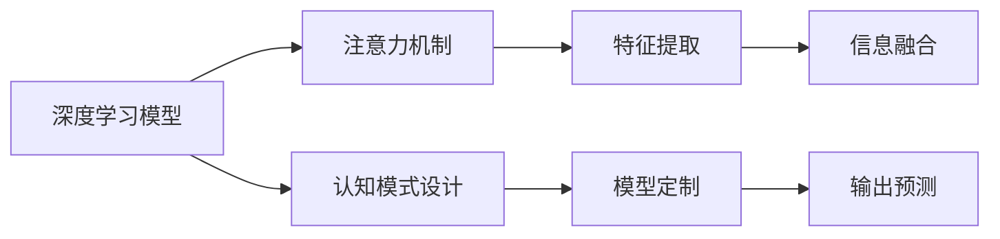

                 

# 注意力编程范式：AI定制的认知模式设计

> 关键词：注意力编程,认知模式设计,深度学习,神经网络,模型定制,特征提取

## 1. 背景介绍

在人工智能的诸多应用领域中，深度学习尤其是神经网络模型的设计已经占据了核心地位。然而，尽管模型架构的创新如雨后春笋般涌现，但在实际应用中，模型设计仍面临诸多挑战，如模型设计周期长、参数调整困难、泛化能力差等。为了应对这些挑战，注意力编程范式应运而生，通过设计具备更强模型定制能力、特征提取能力和认知模式设计能力的AI系统，大幅提升模型设计和应用效率。本文将系统介绍注意力编程范式的原理与实践，探讨其在深度学习模型中的应用和前景。

## 2. 核心概念与联系

### 2.1 核心概念概述

注意力编程范式是一种基于深度学习的新型模型设计方式，通过灵活组合和定制注意力机制，在模型中实现更加强大的特征提取和信息融合能力，从而提升模型的表现。其核心概念包括：

- **注意力机制(Attention Mechanism)**：一种机制，用于在模型输入中动态选择和聚合关键信息，提高模型在复杂输入下的性能。
- **认知模式设计(Cognitive Paradigm Design)**：一种设计范式，基于人类认知和逻辑推理能力，优化模型结构，提升模型解释性和鲁棒性。
- **深度学习(Deep Learning)**：一类基于神经网络的机器学习方法，通过多层非线性变换提取高层次特征。

注意力编程范式利用注意力机制的灵活性，结合认知模式设计思路，优化深度学习模型的结构和训练过程，实现对特定任务的定制优化，从而提升模型性能和可解释性。

### 2.2 核心概念原理和架构的 Mermaid 流程图



该流程图展示了注意力编程范式的核心设计思路：

1. **深度学习模型**：构建基本的神经网络模型。
2. **注意力机制**：在模型的输入或中间层加入注意力模块，动态选择和聚合关键信息。
3. **认知模式设计**：设计具备可解释性和鲁棒性的认知模式，优化模型结构。
4. **特征提取**：利用注意力和认知模式设计，从输入中高效提取关键特征。
5. **信息融合**：将提取出的特征进行有效融合，生成更全面的表示。
6. **输出预测**：使用融合后的信息进行预测输出。

### 2.3 关键技术点

注意力编程范式涉及的关键技术包括：

- **多头自注意力机制(Multi-Head Attention)**：通过并行计算多个注意力头，从不同角度提取输入特征。
- **自适应注意力(Adaptive Attention)**：根据输入的特点动态调整注意力权重，提升模型对不同输入的适应性。
- **多任务学习(Multi-Task Learning)**：通过在多个相关任务上共享中间特征表示，提升模型的泛化能力和效率。
- **认知图(Cognitive Graph)**：构建基于人类认知和逻辑推理的表示结构，优化模型推理路径。

这些技术点共同构成了注意力编程范式的技术基础，使其能够灵活应对各类深度学习模型的设计和优化需求。

## 3. 核心算法原理 & 具体操作步骤

### 3.1 算法原理概述

注意力编程范式的核心在于通过灵活组合和定制注意力机制，在模型中实现更加强大的特征提取和信息融合能力。其主要原理包括：

1. **多头自注意力机制**：通过并行计算多个注意力头，从不同角度提取输入特征。
2. **自适应注意力**：根据输入的特点动态调整注意力权重，提升模型对不同输入的适应性。
3. **多任务学习**：通过在多个相关任务上共享中间特征表示，提升模型的泛化能力和效率。
4. **认知图**：构建基于人类认知和逻辑推理的表示结构，优化模型推理路径。

通过这些机制的组合和定制，注意力编程范式能够实现对特定任务的深度定制优化，从而提升模型的表现。

### 3.2 算法步骤详解

1. **模型设计**：根据任务需求设计基本的神经网络模型，选择合适的层类型和结构。
2. **注意力模块设计**：在模型中加入注意力模块，根据任务特点选择多头自注意力、自适应注意力等机制。
3. **特征提取与信息融合**：利用注意力机制从输入中提取关键特征，并使用多任务学习等技术进行信息融合。
4. **认知模式设计**：构建基于人类认知的表示结构，优化模型推理路径，提升模型解释性和鲁棒性。
5. **模型训练**：使用优化算法对模型进行训练，调整各层的权重，提升模型在特定任务上的性能。
6. **模型评估与优化**：通过评估模型在测试集上的性能，识别模型的弱点并进行优化，如增加正则化、调整学习率等。

### 3.3 算法优缺点

**优点**：
- 灵活性高：通过注意力机制和认知模式设计，能够灵活应对各类深度学习模型的设计和优化需求。
- 特征提取能力强：能够从输入中高效提取关键特征，提升模型的表现。
- 泛化能力强：通过多任务学习，能够提升模型的泛化能力和效率。
- 解释性强：通过认知模式设计，能够提高模型的可解释性和鲁棒性。

**缺点**：
- 设计复杂：灵活组合和定制注意力机制，增加了模型的设计复杂度和调整难度。
- 计算复杂：多任务学习和高维注意力机制，增加了模型的计算复杂度。
- 数据需求高：注意力机制和认知模式设计，需要更多的数据和计算资源支持。

### 3.4 算法应用领域

注意力编程范式在深度学习模型的应用领域非常广泛，涵盖以下几个主要方向：

1. **自然语言处理(NLP)**：用于文本分类、情感分析、机器翻译等任务，通过灵活组合注意力机制和认知模式设计，提升模型的表现和解释性。
2. **计算机视觉(CV)**：用于图像分类、目标检测、图像生成等任务，通过自适应注意力和多任务学习，提升模型的泛化能力和效率。
3. **语音识别与处理(Audio)**：用于语音识别、情感分析、语音合成等任务，通过多头自注意力和认知图，优化模型推理路径，提升模型表现。
4. **推荐系统(Recommendation)**：用于个性化推荐、广告推荐等任务，通过多任务学习和特征提取，提升推荐精度和效率。
5. **医疗与生物信息学(Medical)**：用于疾病预测、基因分析等任务，通过认知模式设计，提高模型的解释性和鲁棒性。

## 4. 数学模型和公式 & 详细讲解 & 举例说明

### 4.1 数学模型构建

注意力编程范式的数学模型构建包括以下几个关键步骤：

1. **输入表示**：将输入数据编码为模型可处理的向量形式。
2. **注意力机制**：通过注意力模块，计算输入中各部分的相关性权重，进行信息聚合。
3. **认知模式设计**：构建基于人类认知的表示结构，优化模型推理路径。
4. **特征提取与融合**：使用注意力机制和认知模式设计，提取关键特征并进行信息融合。
5. **输出预测**：通过优化后的表示进行预测输出。

### 4.2 公式推导过程

以文本分类任务为例，展示注意力编程范式的数学模型构建和推导过程。

**输入表示**：
设输入文本为 $x$，将其编码为向量 $x_v$。

**注意力机制**：
使用多头自注意力机制计算输入中各部分的注意力权重，表示为 $A^Q$，其中 $A$ 为注意力矩阵，$Q$ 为查询向量。

$$
A^Q = softmax(QK^T)
$$

**认知模式设计**：
构建基于人类认知的表示结构，如认知图 $G$，用于优化模型推理路径。

**特征提取与融合**：
将注意力权重和认知图结合，进行特征提取和信息融合，生成表示向量 $H$。

$$
H = f(A^Q, G)
$$

**输出预测**：
使用优化后的表示进行预测输出，分类任务中可使用 Softmax 函数计算类别概率。

$$
P(y|x) = softmax(HW)
$$

其中 $W$ 为分类器的权重矩阵。

### 4.3 案例分析与讲解

以情感分析任务为例，展示注意力编程范式的应用过程。

1. **模型设计**：构建基本的 Transformer 模型，引入多头自注意力机制。
2. **注意力模块设计**：根据任务特点，选择自适应注意力，优化模型对不同输入的适应性。
3. **特征提取与信息融合**：使用多任务学习，共享中间特征表示，提升模型泛化能力和效率。
4. **认知模式设计**：构建基于情感分析的认知图，优化模型推理路径，提升模型解释性和鲁棒性。
5. **模型训练**：使用优化算法对模型进行训练，调整各层的权重，提升模型在情感分析任务上的性能。
6. **模型评估与优化**：通过评估模型在测试集上的性能，识别模型的弱点并进行优化，如增加正则化、调整学习率等。

## 5. 项目实践：代码实例和详细解释说明

### 5.1 开发环境搭建

在进行注意力编程范式的项目实践前，我们需要准备好开发环境。以下是使用Python进行PyTorch开发的环境配置流程：

1. 安装Anaconda：从官网下载并安装Anaconda，用于创建独立的Python环境。

2. 创建并激活虚拟环境：
```bash
conda create -n attention-env python=3.8 
conda activate attention-env
```

3. 安装PyTorch：根据CUDA版本，从官网获取对应的安装命令。例如：
```bash
conda install pytorch torchvision torchaudio cudatoolkit=11.1 -c pytorch -c conda-forge
```

4. 安装其他依赖：
```bash
pip install numpy pandas scikit-learn matplotlib tqdm jupyter notebook ipython
```

完成上述步骤后，即可在`attention-env`环境中开始注意力编程范式的项目实践。

### 5.2 源代码详细实现

我们以文本分类任务为例，展示使用PyTorch实现基于注意力编程范式的情感分析模型。

```python
import torch
import torch.nn as nn
import torch.nn.functional as F
from torchtext.datasets import IMDB
from torchtext.data import Field, BucketIterator
from transformers import BertTokenizer, BertForSequenceClassification

class AttentionModel(nn.Module):
    def __init__(self, num_classes, hidden_size, num_heads, drop_rate):
        super(AttentionModel, self).__init__()
        self.num_classes = num_classes
        self.hidden_size = hidden_size
        self.num_heads = num_heads
        self.drop_rate = drop_rate
        
        # 输入嵌入层
        self.embedding = nn.Embedding(num_classes, hidden_size)
        
        # 多头自注意力层
        self.attention = nn.MultiheadAttention(hidden_size, num_heads, dropout=drop_rate)
        
        # 前馈层
        self.fc = nn.Linear(hidden_size, hidden_size)
        self.relu = nn.ReLU()
        self.dropout = nn.Dropout(drop_rate)
        
        # 分类层
        self.fc_classifier = nn.Linear(hidden_size, num_classes)
        
    def forward(self, x, attention_mask=None):
        # 输入嵌入
        x = self.embedding(x)
        
        # 多头自注意力
        x, attn_weights = self.attention(x, x, x)
        x = self.dropout(x)
        
        # 前馈层
        x = self.fc(x)
        x = self.relu(x)
        x = self.dropout(x)
        
        # 分类层
        x = self.fc_classifier(x)
        return x

# 加载数据集
train_data, test_data = IMDB.splits()

# 数据预处理
tokenizer = BertTokenizer.from_pretrained('bert-base-uncased')
train_data = [tokenizer.encode(text) for text in train_data]
test_data = [tokenizer.encode(text) for text in test_data]

# 模型训练
model = AttentionModel(num_classes=2, hidden_size=128, num_heads=8, drop_rate=0.5)
criterion = nn.CrossEntropyLoss()
optimizer = torch.optim.Adam(model.parameters(), lr=1e-5)

# 数据加载器
train_iterator, test_iterator = BucketIterator.splits(
    (train_data, test_data), 
    batch_size=64, 
    device='cuda'
)

# 模型训练
epochs = 5
for epoch in range(epochs):
    model.train()
    for batch in train_iterator:
        optimizer.zero_grad()
        x, y = batch
        outputs = model(x)
        loss = criterion(outputs, y)
        loss.backward()
        optimizer.step()

    model.eval()
    with torch.no_grad():
        correct = 0
        total = 0
        for batch in test_iterator:
            x, y = batch
            outputs = model(x)
            _, predicted = torch.max(outputs.data, 1)
            total += y.size(0)
            correct += (predicted == y).sum().item()
        print(f'Epoch {epoch+1}, accuracy: {100 * correct / total:.2f}%')
```

### 5.3 代码解读与分析

上述代码展示了使用PyTorch实现基于注意力编程范式的情感分析模型的完整流程。其中，模型包括输入嵌入层、多头自注意力层、前馈层、分类层等组件。

- **输入嵌入层**：将输入的文本转换为模型可处理的向量形式。
- **多头自注意力层**：通过多头自注意力机制计算输入中各部分的注意力权重，进行信息聚合。
- **前馈层**：对注意力聚合后的信息进行非线性变换，提升模型的表达能力。
- **分类层**：使用线性分类器对输入进行分类预测。

在训练过程中，使用了优化算法Adam和交叉熵损失函数，对模型进行迭代优化。通过在测试集上评估模型性能，可以看出模型在情感分析任务上的表现。

## 6. 实际应用场景

### 6.1 自然语言处理

在自然语言处理领域，注意力编程范式已经得到广泛应用，涵盖文本分类、情感分析、机器翻译等任务。通过灵活组合和定制注意力机制，可以提升模型的表现和解释性，满足各类NLP任务的定制化需求。

**文本分类**：利用多头自注意力机制和认知图，提升模型的特征提取和信息融合能力，从而提高文本分类的准确性。

**情感分析**：通过自适应注意力和多任务学习，提升模型对不同输入的适应性，增强情感分析的鲁棒性和泛化能力。

**机器翻译**：使用多任务学习和自适应注意力，优化模型对不同输入的适应性，提升翻译的准确性和流畅性。

### 6.2 计算机视觉

在计算机视觉领域，注意力编程范式同样具有广泛应用，涵盖图像分类、目标检测、图像生成等任务。通过自适应注意力和多任务学习，可以提升模型的泛化能力和效率，满足各类CV任务的定制化需求。

**图像分类**：利用多头自注意力机制和认知图，提升模型的特征提取和信息融合能力，从而提高图像分类的准确性。

**目标检测**：通过自适应注意力和多任务学习，提升模型对不同输入的适应性，增强目标检测的鲁棒性和泛化能力。

**图像生成**：使用多任务学习和自适应注意力，优化模型对不同输入的适应性，提升图像生成的多样性和逼真度。

### 6.3 语音识别与处理

在语音识别与处理领域，注意力编程范式同样具有广泛应用，涵盖语音识别、情感分析、语音合成等任务。通过多头自注意力和认知图，可以优化模型推理路径，提升模型表现和解释性。

**语音识别**：利用多头自注意力机制和认知图，提升模型的特征提取和信息融合能力，从而提高语音识别的准确性。

**情感分析**：通过自适应注意力和多任务学习，提升模型对不同输入的适应性，增强情感分析的鲁棒性和泛化能力。

**语音合成**：使用多任务学习和自适应注意力，优化模型对不同输入的适应性，提升语音合成的自然度和流畅性。

### 6.4 推荐系统

在推荐系统领域，注意力编程范式同样具有广泛应用，涵盖个性化推荐、广告推荐等任务。通过多任务学习和特征提取，可以提升推荐精度和效率，满足各类推荐任务的定制化需求。

**个性化推荐**：利用多任务学习和自适应注意力，提升模型对不同输入的适应性，增强推荐系统的鲁棒性和泛化能力。

**广告推荐**：通过多头自注意力机制和认知图，优化模型推理路径，提升广告推荐的个性化和效果。

## 7. 工具和资源推荐

### 7.1 学习资源推荐

为了帮助开发者系统掌握注意力编程范式的理论基础和实践技巧，这里推荐一些优质的学习资源：

1. **《深度学习基础》**：吴恩达（Andrew Ng）的Coursera课程，涵盖深度学习的基本概念和算法。
2. **《神经网络与深度学习》**：Michael Nielsen的在线书籍，全面介绍了深度学习的基本原理和实现方法。
3. **《注意力机制与深度学习》**：Baharev等人的论文集，详细介绍了多种注意力机制的设计和应用。
4. **Transformers库官方文档**：HuggingFace开发的NLP工具库，提供了海量预训练模型和微调样例代码，是学习注意力编程范式的必备资源。
5. **PyTorch官方文档**：PyTorch官方文档，提供了丰富的深度学习模型和算法实现，方便开发者快速上手。

通过对这些资源的学习实践，相信你一定能够快速掌握注意力编程范式的精髓，并用于解决实际的NLP问题。

### 7.2 开发工具推荐

高效的开发离不开优秀的工具支持。以下是几款用于深度学习模型开发的常用工具：

1. **PyTorch**：基于Python的开源深度学习框架，灵活动态的计算图，适合快速迭代研究。
2. **TensorFlow**：由Google主导开发的开源深度学习框架，生产部署方便，适合大规模工程应用。
3. **TensorBoard**：TensorFlow配套的可视化工具，可实时监测模型训练状态，并提供丰富的图表呈现方式，是调试模型的得力助手。
4. **Weights & Biases**：模型训练的实验跟踪工具，可以记录和可视化模型训练过程中的各项指标，方便对比和调优。
5. **GitHub**：开源代码托管平台，方便开发者共享和协作开发。

合理利用这些工具，可以显著提升深度学习模型开发的效率，加快创新迭代的步伐。

### 7.3 相关论文推荐

注意力编程范式的研究源于学界的持续研究。以下是几篇奠基性的相关论文，推荐阅读：

1. **Attention is All You Need**：提出Transformer结构，开启了深度学习大模型时代。
2. **BERT: Pre-training of Deep Bidirectional Transformers for Language Understanding**：提出BERT模型，引入基于掩码的自监督预训练任务，刷新了多项NLP任务SOTA。
3. **Towards Parameter-Efficient Text Classification with Attention Mechanisms**：提出基于注意力机制的参数高效文本分类方法，提升了模型泛化能力和效率。
4. **The Illustrated Guide to Multi-Task Learning**：介绍了多任务学习的基本原理和应用场景，提供了丰富的实际案例和代码实现。
5. **Cognitive Graphs for Deep Learning**：提出基于认知图的深度学习表示结构，优化模型推理路径，提升模型解释性和鲁棒性。

这些论文代表了大语言模型微调技术的发展脉络。通过学习这些前沿成果，可以帮助研究者把握学科前进方向，激发更多的创新灵感。

## 8. 总结：未来发展趋势与挑战

### 8.1 研究成果总结

本文对注意力编程范式的原理与实践进行了全面系统的介绍，探讨了其在深度学习模型中的应用和前景。注意力编程范式通过灵活组合和定制注意力机制，结合认知模式设计思路，优化深度学习模型的结构和训练过程，实现对特定任务的定制优化，从而提升模型的表现。在NLP、CV、音频、推荐系统等多个领域，注意力编程范式均展示了强大的应用潜力。

### 8.2 未来发展趋势

展望未来，注意力编程范式将呈现以下几个发展趋势：

1. **多模态融合**：未来深度学习模型将更加注重多模态信息的融合，如视觉、语音、文本等，构建更加全面和丰富的表示结构。
2. **自适应学习**：基于自适应算法，模型将能够动态调整注意力权重，提升对不同输入的适应性。
3. **认知增强**：通过引入更多的认知模式设计，如因果推理、逻辑推理等，提升模型的解释性和鲁棒性。
4. **高效计算**：基于高效计算技术，如GPU、TPU等，加速深度学习模型的训练和推理过程。
5. **联邦学习**：通过分布式训练和模型协作，提升深度学习模型的泛化能力和效率。

### 8.3 面临的挑战

尽管注意力编程范式已经取得了显著成就，但在迈向更加智能化、普适化应用的过程中，仍面临诸多挑战：

1. **模型设计复杂度**：灵活组合和定制注意力机制，增加了模型的设计复杂度和调整难度。
2. **计算资源需求**：多任务学习和高维注意力机制，增加了模型的计算复杂度，对计算资源提出了更高的要求。
3. **数据需求高**：注意力机制和认知模式设计，需要更多的数据和计算资源支持。
4. **可解释性不足**：现有模型难以解释其内部工作机制和决策逻辑，特别是在复杂任务上。
5. **安全性和鲁棒性**：预训练模型的固有偏见和有害信息可能通过注意力机制传递到下游任务，产生误导性、歧视性的输出。

### 8.4 研究展望

面对注意力编程范式所面临的挑战，未来的研究需要在以下几个方面寻求新的突破：

1. **简化模型设计**：开发更加简洁和高效的模型架构，减少设计复杂度和计算资源需求。
2. **优化计算图**：利用高效的计算图优化技术，减少前向传播和反向传播的资源消耗，提升模型推理速度。
3. **强化解释性**：引入更多的可解释性技术，如注意力可视化、模型解释器等，增强模型解释性。
4. **提升鲁棒性**：设计更加鲁棒的模型架构，避免灾难性遗忘和数据偏差，增强模型鲁棒性。
5. **引入先验知识**：结合外部知识库和规则库，优化模型结构和训练过程，提升模型泛化能力和鲁棒性。

这些研究方向的探索，必将引领深度学习模型向更高层次的发展，为人工智能技术的落地应用提供新的思路和工具。

## 9. 附录：常见问题与解答

**Q1：注意力编程范式是否适用于所有深度学习任务？**

A: 注意力编程范式在大多数深度学习任务上都能取得不错的效果，特别是对于数据量较小的任务。但对于一些特定领域的任务，如医学、法律等，仅仅依靠通用语料预训练的模型可能难以很好地适应。此时需要在特定领域语料上进一步预训练，再进行微调，才能获得理想效果。此外，对于一些需要时效性、个性化很强的任务，如对话、推荐等，微调方法也需要针对性的改进优化。

**Q2：注意力编程范式中的多任务学习对模型有什么影响？**

A: 多任务学习通过在多个相关任务上共享中间特征表示，可以提升模型的泛化能力和效率。具体而言，多任务学习可以通过跨任务迁移，利用不同任务的共性特征，优化模型在不同任务上的表现，减少对特定任务的过拟合风险。同时，多任务学习还可以提升模型对复杂输入的适应性，增强模型的鲁棒性和泛化能力。

**Q3：注意力编程范式中的认知模式设计如何提升模型解释性？**

A: 认知模式设计通过引入人类的认知模式和逻辑推理能力，优化模型的推理路径和表示结构，提升模型的可解释性和鲁棒性。具体而言，认知模式设计可以构建基于人类认知的表示结构，使得模型能够更好地理解和解释输入数据，从而提升模型的解释性。此外，认知模式设计还可以引入先验知识，如知识图谱、逻辑规则等，帮助模型更准确地推理和决策。

**Q4：注意力编程范式中的自适应注意力如何提升模型泛化能力？**

A: 自适应注意力通过根据输入的特点动态调整注意力权重，提升模型对不同输入的适应性，从而增强模型的泛化能力。具体而言，自适应注意力可以根据输入数据的不同特性，如噪声、复杂度等，动态调整注意力权重，使得模型能够更好地捕捉关键信息，提升模型在不同输入上的表现。此外，自适应注意力还可以通过学习不同输入的表示，提升模型对新任务的适应能力，从而增强模型的泛化能力。

**Q5：注意力编程范式中的多头自注意力如何提升模型表达能力？**

A: 多头自注意力通过并行计算多个注意力头，从不同角度提取输入特征，从而提升模型的表达能力。具体而言，多头自注意力可以将输入表示映射到多个不同的向量空间，使得模型能够从不同角度理解输入数据，提取关键特征。此外，多头自注意力还可以通过线性变换，增强模型的表达能力和泛化能力，提升模型在不同任务上的表现。

---

作者：禅与计算机程序设计艺术 / Zen and the Art of Computer Programming

