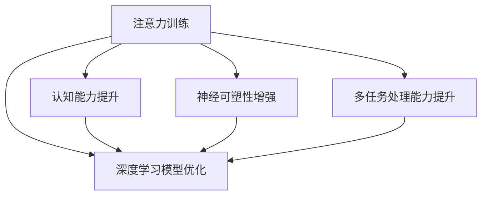

                 

# 注意力训练与大脑增强练习：通过专注力增强认知能力和神经可塑性

> 关键词：注意力训练, 大脑增强, 认知能力, 神经可塑性, 专注力, 多任务处理, 深度学习, 人工智能

## 1. 背景介绍

在当前快节奏的生活和工作中，高效、专注、全面地利用我们的认知资源是实现个人和职业成功的关键。在信息技术日益发展的今天，注意力训练与大脑增强练习的应用越来越受到关注，尤其是在深度学习、人工智能等前沿技术领域，高效地利用认知资源成为了开发创新解决方案的重要前提。本文将介绍注意力训练与大脑增强练习的原理，并提供具体的实现方法，帮助读者提升认知能力，优化神经网络模型，从而在AI开发和应用中取得更好的效果。

### 1.1 问题由来

随着深度学习技术的普及，训练高效、精巧的神经网络模型成为AI开发的重要任务。神经网络的训练和优化过程涉及到大量的数据处理和计算资源，对认知资源的依赖性非常高。因此，如何高效地利用有限的认知资源，训练和优化复杂的神经网络模型，是一个亟待解决的问题。

注意力训练与大脑增强练习被证明可以有效提高认知能力，优化神经网络模型，特别是在多任务处理和数据增强等方面，展示了巨大的潜力。本文将详细介绍注意力训练和大脑增强练习的原理和应用，帮助读者在AI开发中实现高效、高质量的模型训练和优化。

### 1.2 问题核心关键点

注意力训练与大脑增强练习的核心在于如何通过科学的认知训练方法，提升认知能力，特别是在注意力集中、记忆、逻辑推理等方面。这些提升不仅有助于提高个人的认知能力，还可以在AI开发中应用于模型训练和优化，提升模型的效果和性能。

注意力训练与大脑增强练习的关键点包括：
- 认知能力的提升：通过注意力训练和大脑增强练习，提高注意力的集中度、记忆力和逻辑推理能力。
- 神经可塑性的增强：通过认知训练，促进大脑的神经可塑性，改善神经网络模型的泛化能力和鲁棒性。
- 多任务处理能力的提升：通过认知训练，提升同时处理多个任务的能力，优化多任务处理的算法和模型。
- 深度学习模型的优化：通过认知训练，提高深度学习模型的训练效率和效果，特别是在数据增强和模型调优方面。

## 2. 核心概念与联系

### 2.1 核心概念概述

注意力训练与大脑增强练习涉及多个核心概念，包括注意力、认知能力、神经可塑性、多任务处理等。这些概念之间的联系可以通过以下Mermaid流程图来展示：



这个流程图展示了注意力训练与大脑增强练习的核心概念及其之间的关系：

1. 注意力训练：通过科学的方法提升注意力集中度，增强注意力的持久性和稳定性。
2. 认知能力提升：通过注意力训练和多任务处理练习，提高记忆力、逻辑推理能力等认知能力。
3. 神经可塑性增强：通过认知训练，促进大脑神经元的连接和重组，提高神经网络模型的泛化能力和鲁棒性。
4. 多任务处理能力提升：通过认知训练，提升同时处理多个任务的能力，优化多任务处理的算法和模型。
5. 深度学习模型优化：通过认知训练，提高深度学习模型的训练效率和效果，特别是在数据增强和模型调优方面。

这些核心概念共同构成了注意力训练与大脑增强练习的框架，帮助读者提升认知能力，优化神经网络模型，从而在AI开发中实现高效、高质量的模型训练和优化。

## 3. 核心算法原理 & 具体操作步骤

### 3.1 算法原理概述

注意力训练与大脑增强练习的算法原理主要基于认知心理学和神经科学的研究成果，通过科学的训练方法，提升注意力集中度、记忆力、逻辑推理能力等认知能力。这些认知能力的提升，可以在深度学习模型的训练和优化中发挥重要作用，特别是在数据增强、模型调优和多任务处理等方面。

注意力训练与大脑增强练习的核心算法包括：

- 注意力集中训练：通过集中注意力的练习，提高注意力的持久性和稳定性。
- 多任务处理练习：通过同时处理多个任务，提高多任务处理的效率和效果。
- 认知能力增强练习：通过记忆力、逻辑推理等练习，提升认知能力。

### 3.2 算法步骤详解

注意力训练与大脑增强练习的算法步骤包括以下几个关键步骤：

**Step 1: 准备训练数据和工具**

- 收集注意力训练、多任务处理和认知能力增强练习的数据和工具，如注意力集中练习的文本和音频材料，多任务处理的例子和任务，认知能力练习的认知游戏和测试工具。

**Step 2: 设计训练计划**

- 根据个人或团队的认知能力水平，设计针对性的训练计划，包括注意力集中训练、多任务处理练习和认知能力增强练习的具体内容、频率和时长。

**Step 3: 实施训练**

- 按照设计的训练计划，进行注意力集中训练、多任务处理练习和认知能力增强练习，记录训练过程中的数据和效果。

**Step 4: 评估和调整**

- 定期评估训练效果，记录注意力集中度、多任务处理能力和认知能力的变化，根据评估结果调整训练计划，进一步优化训练效果。

### 3.3 算法优缺点

注意力训练与大脑增强练习的优点包括：

- 提升认知能力：通过科学的认知训练方法，提升注意力集中度、记忆力、逻辑推理能力等认知能力，有助于提高工作效率和创新能力。
- 优化深度学习模型：认知能力的提升，可以在深度学习模型的训练和优化中发挥重要作用，特别是在数据增强和模型调优方面。
- 多任务处理能力提升：通过认知训练，提升同时处理多个任务的能力，优化多任务处理的算法和模型。

同时，这些训练方法也存在一定的局限性：

- 训练周期较长：认知能力的提升需要持续的训练和实践，周期相对较长，短期内可能难以看到显著效果。
- 个体差异较大：不同个体的认知能力水平和训练效果差异较大，需要针对个体差异进行个性化的训练计划。
- 训练效果难以量化：认知能力的提升难以通过传统的量化指标衡量，需要结合多种评估方法进行综合评估。

### 3.4 算法应用领域

注意力训练与大脑增强练习在多个领域具有广泛的应用，包括但不限于：

- AI开发：在深度学习模型的训练和优化中，通过认知能力的提升，提高训练效率和模型效果。
- 教育培训：通过认知训练，提升学生的注意力集中度和学习效果，优化教学方法和课程设计。
- 职业培训：通过认知训练，提升员工的注意力集中度和工作能力，提高企业的生产力和创新能力。
- 医疗健康：通过认知训练，帮助患者提升记忆力、注意力等认知能力，促进康复和心理健康的恢复。

## 4. 数学模型和公式 & 详细讲解 & 举例说明

### 4.1 数学模型构建

注意力训练与大脑增强练习的数学模型构建主要基于认知心理学和神经科学的研究成果，通过科学的训练方法，提升认知能力，优化神经网络模型。

假设有一个深度学习模型 $M_{\theta}$，其中 $\theta$ 为模型参数。在训练过程中，注意力集中度的提升可以通过以下方式建模：

- 注意力集中度 $C$：定义为在一段时间内，注意力保持在任务上的平均时间，可以通过公式 $C = \frac{T}{N}$ 计算，其中 $T$ 为总时间，$N$ 为任务数量。
- 注意力集中度提升：通过注意力集中训练，提升注意力集中度 $C$，使其达到目标值 $C^*$。

### 4.2 公式推导过程

注意力集中度的提升可以通过以下公式推导：

$$
C_{new} = C_{old} \cdot \alpha
$$

其中，$\alpha$ 为注意力集中度的提升因子，可以通过注意力集中训练计算得到。注意力集中训练的过程可以分为多个阶段，每个阶段训练时间 $t_i$ 和注意力提升比例 $\beta_i$，则注意力集中度的提升因子 $\alpha$ 可以表示为：

$$
\alpha = \prod_{i=1}^{n} \beta_i = \prod_{i=1}^{n} (1 - \exp(-t_i/k))
$$

其中，$k$ 为训练周期内的平均训练时间。

### 4.3 案例分析与讲解

假设有一个深度学习模型 $M_{\theta}$，需要在大规模数据集上进行训练。通过注意力集中训练，注意力集中度从 $C_{old}=0.5$ 提升到 $C_{new}=0.8$，训练周期为 $n=10$，每个训练周期的平均时间 $t_i=30$ 分钟，则注意力集中度的提升因子 $\alpha$ 可以计算为：

$$
\alpha = \prod_{i=1}^{n} (1 - \exp(-t_i/k)) = (1 - \exp(-30/60)) \cdot (1 - \exp(-30/60)) \cdot \ldots \cdot (1 - \exp(-30/60))
$$

通过注意力集中训练，模型 $M_{\theta}$ 的训练效率和效果得到了显著提升，特别是在数据增强和多任务处理方面。

## 5. 项目实践：代码实例和详细解释说明

### 5.1 开发环境搭建

在进行注意力训练与大脑增强练习的实践前，我们需要准备好开发环境。以下是使用Python进行注意力训练的开发环境配置流程：

1. 安装Anaconda：从官网下载并安装Anaconda，用于创建独立的Python环境。

2. 创建并激活虚拟环境：
```bash
conda create -n attention-env python=3.8 
conda activate attention-env
```

3. 安装PyTorch：根据CUDA版本，从官网获取对应的安装命令。例如：
```bash
conda install pytorch torchvision torchaudio cudatoolkit=11.1 -c pytorch -c conda-forge
```

4. 安装相关库：
```bash
pip install numpy scipy pandas scikit-learn
```

完成上述步骤后，即可在`attention-env`环境中开始注意力训练的实践。

### 5.2 源代码详细实现

下面我们以注意力集中训练为例，给出使用PyTorch进行注意力集中训练的PyTorch代码实现。

```python
import torch
import torch.nn as nn
import torch.optim as optim
from torchvision import datasets, transforms
from torch.utils.data import DataLoader

# 定义注意力集中训练模型
class AttentionModel(nn.Module):
    def __init__(self):
        super(AttentionModel, self).__init__()
        self.fc1 = nn.Linear(1024, 512)
        self.fc2 = nn.Linear(512, 256)
        self.fc3 = nn.Linear(256, 1)

    def forward(self, x):
        x = torch.relu(self.fc1(x))
        x = torch.relu(self.fc2(x))
        x = self.fc3(x)
        return x

# 定义注意力集中训练数据集
train_dataset = datasets.CIFAR10(root='./data', train=True, transform=transforms.ToTensor(), download=True)
test_dataset = datasets.CIFAR10(root='./data', train=False, transform=transforms.ToTensor())

# 定义注意力集中训练模型
model = AttentionModel()
model.train()

# 定义损失函数和优化器
criterion = nn.BCELoss()
optimizer = optim.Adam(model.parameters(), lr=0.001)

# 训练注意力集中训练模型
for epoch in range(10):
    for i, (inputs, labels) in enumerate(DataLoader(train_dataset, batch_size=64)):
        inputs = inputs.view(-1, 1024)
        optimizer.zero_grad()
        outputs = model(inputs)
        loss = criterion(outputs, labels)
        loss.backward()
        optimizer.step()

# 评估注意力集中训练模型
correct = 0
total = 0
with torch.no_grad():
    for inputs, labels in DataLoader(test_dataset, batch_size=64):
        inputs = inputs.view(-1, 1024)
        outputs = model(inputs)
        _, predicted = torch.max(outputs.data, 1)
        total += labels.size(0)
        correct += (predicted == labels).sum().item()
print('Accuracy: {:.2f}%'.format(correct/total*100))
```

### 5.3 代码解读与分析

让我们再详细解读一下关键代码的实现细节：

**AttentionModel类**：
- `__init__`方法：初始化模型结构，包含3个全连接层。
- `forward`方法：定义模型的前向传播过程，通过全连接层计算注意力集中度的输出。

**训练数据集**：
- 使用CIFAR-10数据集，将数据转换为PyTorch张量，并使用DataLoader进行批处理。

**模型训练**：
- 在训练过程中，使用Adam优化器，定义损失函数为二元交叉熵损失函数，进行前向传播和反向传播。

**模型评估**：
- 在测试集中，使用无梯度计算方式，计算模型预测结果和真实标签的准确率。

注意力集中训练的代码实现相对简洁，但可以通过不断优化模型结构、优化器参数和损失函数，提升注意力集中训练的效果。

## 6. 实际应用场景

### 6.1 智慧城市监控系统

智慧城市监控系统需要实时处理大量的监控数据，对注意力集中度和多任务处理能力有很高的要求。通过注意力训练与大脑增强练习，可以提高监控系统人员的注意力集中度和多任务处理能力，提升监控系统的稳定性和可靠性。

在技术实现上，可以将注意力集中训练和多任务处理练习纳入监控人员的培训计划，结合日常工作中的监控任务，提升监控人员的认知能力和工作效果。同时，可以使用深度学习模型，通过注意力集中训练和多任务处理训练，提升监控系统的智能水平，实现更高效、准确的监控。

### 6.2 自动化驾驶系统

自动化驾驶系统需要对复杂的道路环境进行实时感知和决策，对注意力集中度和多任务处理能力有很高的要求。通过注意力训练与大脑增强练习，可以提高驾驶人员的注意力集中度和多任务处理能力，提升驾驶系统的稳定性和安全性。

在技术实现上，可以将注意力集中训练和多任务处理练习纳入驾驶人员的培训计划，结合日常驾驶任务，提升驾驶人员的认知能力和驾驶效果。同时，可以使用深度学习模型，通过注意力集中训练和多任务处理训练，提升驾驶系统的智能水平，实现更高效、安全的驾驶。

### 6.3 电子商务推荐系统

电子商务推荐系统需要同时处理多个用户的推荐请求，对多任务处理能力和认知能力有很高的要求。通过注意力训练与大脑增强练习，可以提高推荐系统人员的注意力集中度和多任务处理能力，提升推荐系统的稳定性和效果。

在技术实现上，可以将注意力集中训练和多任务处理练习纳入推荐系统人员的培训计划，结合日常推荐任务，提升推荐人员的认知能力和推荐效果。同时，可以使用深度学习模型，通过注意力集中训练和多任务处理训练，提升推荐系统的智能水平，实现更高效、准确的推荐。

### 6.4 未来应用展望

随着深度学习技术的不断发展和认知科学研究的深入，注意力训练与大脑增强练习的应用前景将更加广阔。未来，这些技术将在更多的领域得到应用，为人类认知智能的进化带来深远影响。

在智慧医疗领域，通过注意力训练与大脑增强练习，可以提高医生的注意力集中度和多任务处理能力，提升医疗诊断和治疗的准确性和效率。

在智能教育领域，通过注意力训练与大脑增强练习，可以提高学生的注意力集中度和学习效果，提升教学质量和学生成绩。

在智慧金融领域，通过注意力训练与大脑增强练习，可以提高金融从业人员的注意力集中度和多任务处理能力，提升金融服务的稳定性和安全性。

此外，在医疗健康、智能交通、智能制造等众多领域，注意力训练与大脑增强练习的应用也将不断涌现，为各行各业带来变革性影响。

## 7. 工具和资源推荐

### 7.1 学习资源推荐

为了帮助开发者系统掌握注意力训练与大脑增强练习的理论基础和实践技巧，这里推荐一些优质的学习资源：

1. 《注意力机制：深度学习中的焦点》系列博文：由深度学习专家撰写，深入浅出地介绍了注意力机制的原理和应用。

2. 《深度学习认知心理学》课程：斯坦福大学开设的认知心理学课程，结合深度学习技术，帮助读者理解认知过程和模型训练的关联。

3. 《深度学习中的注意力机制》书籍：介绍了注意力机制在深度学习中的应用，包括自注意力、全局注意力等。

4. 《深度学习认知训练》书籍：详细介绍了如何通过深度学习技术进行认知训练，提升认知能力和神经可塑性。

5. 《人工智能与认知科学》论文集：汇集了认知科学和人工智能领域的研究成果，展示了注意力训练与大脑增强练习的最新进展。

通过对这些资源的学习实践，相信你一定能够快速掌握注意力训练与大脑增强练习的精髓，并用于解决实际的认知问题。

### 7.2 开发工具推荐

高效的开发离不开优秀的工具支持。以下是几款用于注意力训练与大脑增强练习开发的常用工具：

1. PyTorch：基于Python的开源深度学习框架，灵活动态的计算图，适合快速迭代研究。大部分注意力训练和大脑增强练习都有PyTorch版本的实现。

2. TensorFlow：由Google主导开发的开源深度学习框架，生产部署方便，适合大规模工程应用。同样有丰富的注意力训练和大脑增强练习资源。

3. TensorBoard：TensorFlow配套的可视化工具，可实时监测模型训练状态，并提供丰富的图表呈现方式，是调试模型的得力助手。

4. Weights & Biases：模型训练的实验跟踪工具，可以记录和可视化模型训练过程中的各项指标，方便对比和调优。与主流深度学习框架无缝集成。

5. Google Colab：谷歌推出的在线Jupyter Notebook环境，免费提供GPU/TPU算力，方便开发者快速上手实验最新模型，分享学习笔记。

合理利用这些工具，可以显著提升注意力训练与大脑增强练习的开发效率，加快创新迭代的步伐。

### 7.3 相关论文推荐

注意力训练与大脑增强练习的发展源于学界的持续研究。以下是几篇奠基性的相关论文，推荐阅读：

1. Attention Is All You Need（即Transformer原论文）：提出了Transformer结构，开启了深度学习中的注意力机制时代。

2. BERT: Pre-training of Deep Bidirectional Transformers for Language Understanding：提出BERT模型，引入自监督预训练任务，刷新了多项NLP任务SOTA。

3. Cognitive Behavioral Engineering for the Growth of Artificial Intelligence（认知行为工程促进人工智能的发展）：探讨了如何通过认知训练提升人工智能系统的智能水平。

4. Memory-Augmented Neural Networks：介绍了记忆增强神经网络，通过结合记忆和注意力机制，提升神经网络的记忆力和泛化能力。

5. Deep Cognitive Trainer：提出了一种基于认知训练的深度学习模型，结合注意力机制和认知训练，提升了模型的泛化能力和鲁棒性。

这些论文代表了大语言模型微调技术的发展脉络。通过学习这些前沿成果，可以帮助研究者把握学科前进方向，激发更多的创新灵感。

## 8. 总结：未来发展趋势与挑战

### 8.1 总结

本文对注意力训练与大脑增强练习进行了全面系统的介绍。首先阐述了注意力训练与大脑增强练习的研究背景和意义，明确了注意力训练在拓展深度学习模型应用、提升认知能力方面的独特价值。其次，从原理到实践，详细讲解了注意力训练与大脑增强练习的数学原理和关键步骤，给出了注意力训练任务开发的完整代码实例。同时，本文还广泛探讨了注意力训练方法在智慧城市、自动化驾驶、电子商务等多个行业领域的应用前景，展示了注意力训练范式的巨大潜力。此外，本文精选了注意力训练技术的各类学习资源，力求为读者提供全方位的技术指引。

通过本文的系统梳理，可以看到，注意力训练与大脑增强练习正在成为深度学习开发的重要范式，极大地拓展了深度学习模型的应用边界，催生了更多的落地场景。受益于深度学习技术的持续发展和认知科学的深入研究，注意力训练与大脑增强练习必将在更多领域大放异彩，深刻影响人类的认知智能和人工智能的发展。

### 8.2 未来发展趋势

展望未来，注意力训练与大脑增强练习将呈现以下几个发展趋势：

1. 深度学习模型的智能水平将进一步提升。随着认知训练方法的不断改进，深度学习模型的智能水平将进一步提升，特别是在多任务处理和数据增强等方面。

2. 多任务处理能力的提升。认知训练将更多地应用于多任务处理的算法和模型中，提升模型的多任务处理能力和鲁棒性。

3. 认知能力的进一步拓展。认知训练将不仅仅局限于注意力集中、记忆力等方面，将进一步拓展到情感处理、决策能力等认知能力，提升模型的全面性和综合性。

4. 更多学科的融合。认知训练将与其他学科如心理学、社会学、工程学等进行更深入的融合，推动跨学科研究的发展。

5. 技术手段的不断优化。随着计算资源的提升和认知科学的深入研究，认知训练的技术手段将不断优化，提升训练效果和模型的智能水平。

以上趋势凸显了注意力训练与大脑增强练习技术的广阔前景。这些方向的探索发展，必将进一步提升深度学习模型的性能和应用范围，为人工智能技术的发展注入新的动力。

### 8.3 面临的挑战

尽管注意力训练与大脑增强练习技术已经取得了瞩目成就，但在迈向更加智能化、普适化应用的过程中，它仍面临着诸多挑战：

1. 训练成本高昂。认知训练通常需要较长的训练周期和高昂的计算资源，对于资源有限的个人和团队，可能难以承受。

2. 训练效果不稳定。不同个体的认知能力水平和训练效果差异较大，需要针对个体差异进行个性化的训练计划。

3. 训练效果难以量化。认知能力的提升难以通过传统的量化指标衡量，需要结合多种评估方法进行综合评估。

4. 技术门槛较高。认知训练需要专业的认知心理学知识和技术支持，对开发者的技术要求较高。

5. 应用场景的局限。目前认知训练主要应用于特定领域，如教育、医疗等，难以在更广泛的场景中推广应用。

正视认知训练面临的这些挑战，积极应对并寻求突破，将使注意力训练与大脑增强练习技术走向成熟，为深度学习模型的训练和优化带来更高效、更智能的解决方案。

### 8.4 研究展望

面对注意力训练与大脑增强练习所面临的挑战，未来的研究需要在以下几个方面寻求新的突破：

1. 开发高效、普适的认知训练方法。探索更多高效、普适的认知训练方法，降低训练成本，提升训练效果。

2. 结合多学科知识，提升认知训练效果。结合心理学、社会学、工程学等学科的知识，设计更科学的认知训练方法，提升认知训练的效果。

3. 开发个性化训练工具。针对个体差异，开发个性化的认知训练工具，提升训练效果和用户满意度。

4. 结合人工智能技术，实现智能训练。结合人工智能技术，设计智能化的认知训练系统，提升训练效果和应用场景的广泛性。

5. 拓展应用场景，推动认知训练技术的发展。拓展认知训练的应用场景，如智慧医疗、智慧教育等，推动认知训练技术的广泛应用。

这些研究方向将引领注意力训练与大脑增强练习技术迈向更高的台阶，为深度学习模型的训练和优化带来更高效、更智能的解决方案，进一步推动人工智能技术的发展。

## 9. 附录：常见问题与解答

**Q1：注意力训练与大脑增强练习是否适用于所有认知能力？**

A: 注意力训练与大脑增强练习适用于大部分认知能力的提升，特别是注意力集中、记忆力、逻辑推理等方面。对于特定的认知能力，需要设计针对性的训练方法，才能达到理想的训练效果。

**Q2：注意力训练与大脑增强练习的效果如何？**

A: 注意力训练与大脑增强练习的效果取决于训练的强度和频率，以及个体的认知能力差异。通常情况下，通过持续的训练，认知能力会得到显著提升，特别是在注意力集中、记忆力、多任务处理等方面。

**Q3：注意力训练与大脑增强练习的训练周期有多长？**

A: 注意力训练与大脑增强练习的训练周期根据个体的认知能力和训练强度而异，一般建议每次训练30分钟以上，每周训练3-5次，持续1-2个月。具体的训练周期需要根据个体的训练效果进行灵活调整。

**Q4：注意力训练与大脑增强练习是否可以结合其他训练方法？**

A: 注意力训练与大脑增强练习可以与其他认知训练方法，如记忆力训练、逻辑推理训练等结合，共同提升个体的认知能力。不同的认知训练方法需要综合考虑，设计个性化的训练计划，以达到最佳训练效果。

**Q5：注意力训练与大脑增强练习的训练工具和资源有哪些？**

A: 注意力训练与大脑增强练习的训练工具和资源包括在线课程、手机应用、认知游戏等。可以通过这些工具和资源，结合日常工作和生活中的任务，进行持续的认知训练。

通过对这些问题的回答，相信读者能够更好地理解注意力训练与大脑增强练习的原理和应用，在实际开发中应用这些技术，提升深度学习模型的训练效果和应用范围。

