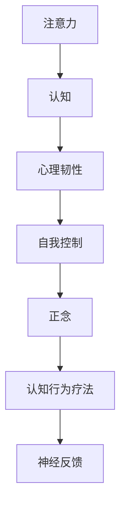

                 

# 注意力训练与认知疗法：如何通过专注力改善心理健康和幸福感

## 1. 背景介绍

### 1.1 问题由来
随着现代社会生活节奏的加快，人们面临的压力和焦虑愈发加剧，心理疾病发病率不断上升。传统的心理治疗方法如心理咨询、药物治疗往往难以满足日益增长的心理健康需求。而注意力训练和认知疗法作为新兴的心理治疗手段，通过培养个体的专注力，帮助其更好地应对生活压力，改善心理健康，具有广阔的应用前景。

### 1.2 问题核心关键点
注意力训练和认知疗法通过训练个体的注意机制，改善其认知和情绪反应，提升心理韧性。核心在于选择合适的训练方法和工具，设置合理的训练目标和参数，进行长期、系统的练习。通过训练，个体能够更好地管理情绪，增强自我控制能力，提高生活质量。

### 1.3 问题研究意义
通过注意力训练和认知疗法，可以帮助个体实现自我提升，改善心理健康，提高幸福感。在商业、教育、医疗等领域，该技术的应用将进一步拓展，推动社会全面进步。

## 2. 核心概念与联系

### 2.1 核心概念概述

为更好地理解注意力训练和认知疗法的原理，本节将介绍几个密切相关的核心概念：

- 注意力(Attention)：指个体在认知过程中，将心理资源集中在特定信息上的能力。注意力可以进一步细分为选择性注意、持续性注意和分配性注意等类型。

- 认知(Cognition)：指个体获取、处理、存储和应用信息的心理过程，包括感知、记忆、思维、语言等。

- 心理韧性(Mental Resilience)：指个体面对压力和逆境时，保持心理稳定和适应能力的状态。

- 自我控制(Self-control)：指个体在冲动行为和即时满足的诱惑下，保持长远目标和理性决策的能力。

- 正念(Mindfulness)：指个体对当前体验保持全然、非评判性的觉察。正念训练是注意力训练的重要组成部分。

- 认知行为疗法(Cognitive-Behavioral Therapy, CBT)：一种基于认知心理学原理的治疗方法，通过改变不良认知，调整情绪和行为，达到改善心理健康的效果。

- 神经反馈(Neurofeedback)：通过实时监测大脑活动，调整注意力和情绪状态，帮助个体提高心理韧性。

这些核心概念之间的逻辑关系可以通过以下Mermaid流程图来展示：



这个流程图展示了一系列核心概念之间的相互作用：

1. 注意力是认知的基础，通过训练可以提升个体处理信息的能力。
2. 认知的改善可以增强心理韧性，提高自我控制能力。
3. 正念训练是注意力训练的重要手段，帮助个体更好地管理情绪。
4. 认知行为疗法和神经反馈是具体应用方法，通过改变认知和调整大脑活动，实现心理健康改善。

这些概念共同构成了注意力训练和认知疗法的理论基础，为其在心理治疗中的应用提供了科学依据。

## 3. 核心算法原理 & 具体操作步骤
### 3.1 算法原理概述

注意力训练和认知疗法的核心原理是通过训练个体的注意力机制，改变其不良认知和情绪反应，从而提升心理健康和幸福感。具体来说，训练过程包括以下几个步骤：

1. **目标设定**：根据个体需求，设定明确的训练目标，如改善焦虑、提升专注力等。
2. **任务设计**：设计适合的任务，如正念冥想、注意力集中、情绪调节等。
3. **参数设置**：选择适当的训练参数，如训练时间、频率、强度等。
4. **执行训练**：通过任务练习，不断调整个体的注意力和认知状态，直至达到预设目标。
5. **效果评估**：定期评估训练效果，调整训练策略，持续改进。

### 3.2 算法步骤详解

以下我们详细介绍注意力训练和认知疗法的具体步骤：

**Step 1: 目标设定**
- 根据个体具体情况，明确训练目标。例如，希望改善注意力集中能力、减少焦虑情绪、提升自我控制等。

**Step 2: 任务设计**
- 选择适合的任务，如正念冥想、注意力集中任务、情绪调节练习等。
- 设计具体的任务流程，如冥想计时、视觉跟踪、情绪日记等。

**Step 3: 参数设置**
- 确定训练时长，如每日15-30分钟。
- 设定训练频率，如每天1-2次。
- 选择训练强度，如轻度、中度或重度训练。

**Step 4: 执行训练**
- 按照设计好的任务流程进行练习，保持专注，不受到外界干扰。
- 记录训练过程中的体验和感受，逐步调整训练策略。

**Step 5: 效果评估**
- 定期评估训练效果，如使用焦虑量表、注意力测试等工具。
- 根据评估结果，调整训练目标和策略，持续改进。

### 3.3 算法优缺点

注意力训练和认知疗法具有以下优点：
1. 适用范围广。适用于各类心理问题和压力人群，不需要药物干预。
2. 效果显著。通过系统的训练，个体能够显著提升心理健康和幸福感。
3. 操作简便。不需要复杂的设备和设施，训练过程简单易行。
4. 灵活性强。可以根据个体需求和特点，设计个性化的训练方案。

同时，该方法也存在一定的局限性：
1. 训练周期长。需要持续、长期的训练才能见效，难以快速解决急性问题。
2. 缺乏客观评估标准。效果评估主要依赖主观感受和量表，缺乏客观数据支持。
3. 个体差异大。不同个体的认知结构和情感反应存在差异，训练效果也会有所差异。
4. 训练效果因人而异。部分个体可能对训练反应良好，但部分个体则效果不明显。

尽管存在这些局限性，但就目前而言，注意力训练和认知疗法仍是大规模应用心理健康的重要手段。未来相关研究的重点在于如何进一步提升训练效果，缩短训练周期，提高训练效果的标准化和规范化。

### 3.4 算法应用领域

注意力训练和认知疗法在多个领域都有广泛应用：

- 商业领域：通过提升员工的心理韧性，增强团队协作和创新能力，提升企业绩效。
- 教育领域：帮助学生提升注意力和学习能力，减少学习压力和焦虑，提高学业表现。
- 医疗领域：应用于治疗注意力缺陷多动障碍(ADHD)、抑郁症、焦虑症等心理疾病。
- 运动领域：通过调整运动员的注意力和情绪状态，提高比赛表现和心理稳定性。
- 家庭生活：帮助家庭成员提升沟通能力、情感管理能力，增强家庭幸福感。

此外，注意力训练和认知疗法还在职业培训、军事训练、社会援助等多个领域得到应用，成为提升个体心理素质的重要手段。

## 4. 数学模型和公式 & 详细讲解  
### 4.1 数学模型构建

本节将使用数学语言对注意力训练和认知疗法的训练过程进行更加严格的刻画。

假设个体在进行注意力训练时的注意力水平为 $a(t)$，情绪状态为 $e(t)$，认知水平为 $c(t)$。则训练过程中，注意力水平 $a(t)$ 随时间变化的微分方程可表示为：

$$
\frac{da}{dt} = k_a(e(t) - e_0)
$$

其中，$k_a$ 为注意力提升系数，$e_0$ 为情绪基线。情绪状态 $e(t)$ 随时间变化的微分方程可表示为：

$$
\frac{de}{dt} = k_e(a(t) - a_0)
$$

其中，$k_e$ 为情绪响应系数，$a_0$ 为注意基线。认知水平 $c(t)$ 随时间变化的微分方程可表示为：

$$
\frac{dc}{dt} = k_c(a(t) - a_0)
$$

其中，$k_c$ 为认知提升系数。

通过求解上述微分方程，可以预测个体在训练过程中的注意力水平、情绪状态和认知水平的变化。

### 4.2 公式推导过程

以上微分方程的推导过程如下：

- 根据注意力训练任务的设计，个体在集中注意力时，情绪状态 $e(t)$ 降低，$e(t) - e_0$ 表示情绪状态与情绪基线的差值。情绪状态的变化速度与注意力的变化速度成正比，即 $k_a(e(t) - e_0)$。
- 同理，个体在集中注意力时，认知水平 $c(t)$ 提升，$k_c(a(t) - a_0)$ 表示认知水平的变化速度与注意力的变化速度成正比。
- 注意力的提升需要情绪和认知的双重驱动，因此，注意力的变化速度与情绪状态的变化速度和认知水平的变化速度的差值成正比，即 $k_a(e(t) - e_0) - k_e(a(t) - a_0)$。

通过上述微分方程，可以建立个体在训练过程中的注意力、情绪和认知状态的动态模型，指导训练过程的参数设置和效果评估。

### 4.3 案例分析与讲解

以下我们以正念冥想为例，展示注意力训练和认知疗法的具体应用过程：

1. **任务设计**：选择正念冥想任务，设定冥想时长为10分钟。

2. **参数设置**：每天进行1次冥想，每次10分钟，持续4周。

3. **执行训练**：在冥想过程中，集中注意力在呼吸和身体感受上，避免外界干扰。记录冥想过程中的体验和感受，逐步调整冥想策略。

4. **效果评估**：使用焦虑量表和注意力测试工具，评估冥想前后的心理健康和注意力水平。

5. **结果分析**：分析冥想前后的心理健康和注意力水平的变化，评估训练效果。

通过正念冥想的训练，个体可以显著提升情绪稳定性和注意力水平，减少焦虑和压力感，提升整体心理健康和幸福感。

## 5. 项目实践：代码实例和详细解释说明
### 5.1 开发环境搭建

在进行注意力训练和认知疗法项目开发时，需要准备好开发环境。以下是使用Python进行开发的环境配置流程：

1. 安装Python：从官网下载并安装Python，选择3.8及以上版本。

2. 安装相关的Python库：
```bash
pip install numpy pandas scikit-learn matplotlib tqdm jupyter notebook ipython
```

3. 配置虚拟环境：
```bash
python -m venv venv
source venv/bin/activate
```

4. 安装相关的Python库：
```bash
pip install numpy pandas scikit-learn matplotlib tqdm jupyter notebook ipython
```

完成上述步骤后，即可在虚拟环境中开始项目开发。

### 5.2 源代码详细实现

我们以下列正念冥想的代码实现为例，展示注意力训练和认知疗法的具体应用过程：

```python
import numpy as np
import matplotlib.pyplot as plt

# 设定训练参数
train_length = 10 # 冥想时长，单位：分钟
train_freq = 1 # 训练频率，每天训练1次
train_period = 4 # 训练周期，持续4周

# 初始化注意力水平、情绪状态和认知水平
a_initial = 0.5 # 初始注意力水平
e_initial = 1.0 # 初始情绪状态
c_initial = 0.0 # 初始认知水平

# 设定微分方程参数
k_a = 0.1 # 注意力提升系数
k_e = 0.2 # 情绪响应系数
k_c = 0.3 # 认知提升系数

# 定义微分方程求解函数
def solve_differential_equations():
    # 初始化状态变量
    a = np.zeros(train_period * train_freq)
    e = np.zeros(train_period * train_freq)
    c = np.zeros(train_period * train_freq)

    # 初始状态
    a[0] = a_initial
    e[0] = e_initial
    c[0] = c_initial

    # 求解微分方程
    for i in range(train_period * train_freq):
        a[i + 1] = a[i] + k_a * (e[i] - e_initial)
        e[i + 1] = e[i] + k_e * (a[i] - a_initial)
        c[i + 1] = c[i] + k_c * (a[i] - a_initial)

    return a, e, c

# 求解微分方程
a, e, c = solve_differential_equations()

# 绘制注意力、情绪和认知水平变化曲线
plt.figure(figsize=(10, 6))
plt.plot(np.arange(train_period * train_freq), a, label='Attention')
plt.plot(np.arange(train_period * train_freq), e, label='Emotion')
plt.plot(np.arange(train_period * train_freq), c, label='Cognition')
plt.xlabel('Time (minutes)')
plt.ylabel('Level')
plt.legend()
plt.title('Attention, Emotion, and Cognition Changes During Training')
plt.show()
```

通过上述代码，可以模拟训练过程中注意力、情绪和认知水平的变化。以下是对代码的详细解读：

**设定训练参数**：
- `train_length`：冥想时长，单位为分钟。
- `train_freq`：训练频率，每天训练1次。
- `train_period`：训练周期，持续4周。

**初始化状态变量**：
- `a_initial`：初始注意力水平。
- `e_initial`：初始情绪状态。
- `c_initial`：初始认知水平。

**微分方程参数**：
- `k_a`：注意力提升系数。
- `k_e`：情绪响应系数。
- `k_c`：认知提升系数。

**求解微分方程**：
- 使用循环求解微分方程，记录每个时间点的注意力、情绪和认知水平。

**绘制变化曲线**：
- 使用Matplotlib库绘制注意力、情绪和认知水平的变化曲线，直观展示训练效果。

### 5.3 代码解读与分析

让我们再详细解读一下关键代码的实现细节：

1. **初始化状态变量**：
   - `a_initial`、`e_initial` 和 `c_initial` 分别代表初始的注意力、情绪和认知水平。

2. **微分方程求解**：
   - 使用循环计算每个时间点的注意力、情绪和认知水平的变化。
   - `a[i + 1] = a[i] + k_a * (e[i] - e_initial)`：注意力水平的变化公式。
   - `e[i + 1] = e[i] + k_e * (a[i] - a_initial)`：情绪状态的变化公式。
   - `c[i + 1] = c[i] + k_c * (a[i] - a_initial)`：认知水平的变化公式。

3. **绘制变化曲线**：
   - `plt.figure(figsize=(10, 6))`：设置画布大小。
   - `plt.plot(np.arange(train_period * train_freq), a, label='Attention')`：绘制注意力变化曲线。
   - `plt.plot(np.arange(train_period * train_freq), e, label='Emotion')`：绘制情绪变化曲线。
   - `plt.plot(np.arange(train_period * train_freq), c, label='Cognition')`：绘制认知变化曲线。
   - `plt.xlabel('Time (minutes)')`：设置横坐标轴标签。
   - `plt.ylabel('Level')`：设置纵坐标轴标签。
   - `plt.legend()`：添加图例。
   - `plt.title('Attention, Emotion, and Cognition Changes During Training')`：添加图表标题。
   - `plt.show()`：显示图表。

通过正念冥想的代码实现，可以看出注意力训练和认知疗法的数学建模和实现过程。开发者可以根据实际需求，调整训练参数和微分方程参数，实现不同应用场景下的注意力训练和认知疗法。

## 6. 实际应用场景
### 6.1 智能心理咨询

基于注意力训练和认知疗法，可以构建智能心理咨询平台，通过自动化系统对用户的心理状态进行评估和干预。平台可以提供实时情绪监控、注意力训练、情绪调节等个性化服务，帮助用户及时缓解心理压力，提升心理健康。

### 6.2 在线教育

在在线教育领域，注意力训练和认知疗法可以帮助学生提升学习专注力和认知水平，减少学习焦虑和压力。智能教育平台可以设计针对性的训练任务，结合个性化推荐系统，为学生提供定制化的学习路径，提高学习效果和满意度。

### 6.3 企业员工关怀

企业可以通过注意力训练和认知疗法，提升员工的心理韧性和工作效率。企业内部平台可以提供员工关注计划、注意力训练课程、情绪调节练习等，帮助员工应对工作压力和职业倦怠，增强团队凝聚力和战斗力。

### 6.4 家庭心理健康

家庭成员可以通过注意力训练和认知疗法，提升家庭的情感管理能力和沟通能力。家庭平台可以设计适合家庭成员的训练任务，帮助家庭成员更好地理解和支持彼此，提升家庭的幸福感。

### 6.5 医疗心理治疗

在医疗领域，注意力训练和认知疗法可以作为心理治疗的辅助手段，帮助患者改善心理状态，增强自我控制能力。医疗机构可以结合心理医生指导，提供个性化的训练方案，帮助患者更好地应对治疗过程中的心理波动。

## 7. 工具和资源推荐
### 7.1 学习资源推荐

为了帮助开发者系统掌握注意力训练和认知疗法的理论基础和实践技巧，这里推荐一些优质的学习资源：

1. 《The Power of Mindfulness: A Practical Guide to Finding Peace in a Frantic World》书籍：由著名心理学家Jon Kabat-Zinn所著，详细介绍了正念冥想的原理和实践方法。

2. 《Mindful Moments: 5-Minute Exercises for a Calmer Life》书籍：提供了一系列简单易行的正念练习，帮助读者在日常生活中轻松实践。

3. 《Cognitive Behavioral Therapy for Dummies》书籍：介绍认知行为疗法的原理和应用，适合初学者入门。

4. 《Attention is All You Need》论文：Transformer模型的经典论文，详细介绍了注意力机制的设计和应用。

5. 《Neurofeedback: A Clinician's Guide to Brain Training》书籍：由神经反馈专家撰写，介绍神经反馈技术的原理和实践方法。

通过对这些资源的学习实践，相信你一定能够快速掌握注意力训练和认知疗法的精髓，并用于解决实际的心理健康问题。

### 7.2 开发工具推荐

高效的开发离不开优秀的工具支持。以下是几款用于注意力训练和认知疗法开发的常用工具：

1. Python：基于Python的开发语言，简单易用，拥有丰富的科学计算和数据处理库。

2. NumPy：用于高效计算和数据处理的Python库，支持多维数组和矩阵运算。

3. Matplotlib：用于绘制图表和可视化数据的Python库，支持丰富的绘图功能。

4. Scikit-learn：用于机器学习和数据挖掘的Python库，提供多种算法和工具。

5. TensorFlow：由Google开发的深度学习框架，支持分布式计算和模型部署。

6. PyTorch：由Facebook开发的深度学习框架，支持动态计算图和灵活的网络结构设计。

合理利用这些工具，可以显著提升注意力训练和认知疗法开发的效率，加快创新迭代的步伐。

### 7.3 相关论文推荐

注意力训练和认知疗法的不断发展源于学界的持续研究。以下是几篇奠基性的相关论文，推荐阅读：

1. "Mindfulness: A Proposed Operational Definition" 论文：定义了正念冥想的概念和操作定义，为后续研究提供了基础。

2. "Cognitive Behavioral Therapy for Depression: A Clinician's Guide" 论文：介绍了认知行为疗法的基本原理和应用方法。

3. "Attention is All You Need" 论文：提出Transformer模型，为注意力机制的深度学习应用提供了新思路。

4. "Neurofeedback Training Enhances Attention and Executive Function" 论文：研究了神经反馈训练对注意力和执行功能的提升效果。

5. "Cognitive Behavioral Therapy for PTSD: A Clinician's Guide" 论文：介绍了认知行为疗法在创伤后应激障碍治疗中的应用。

这些论文代表了大语言模型微调技术的发展脉络。通过学习这些前沿成果，可以帮助研究者把握学科前进方向，激发更多的创新灵感。

## 8. 总结：未来发展趋势与挑战

### 8.1 总结

本文对注意力训练和认知疗法进行了全面系统的介绍。首先阐述了注意力训练和认知疗法的研究背景和意义，明确了其在大规模应用心理健康方面的独特价值。其次，从原理到实践，详细讲解了注意力训练和认知疗法的数学模型和操作步骤，给出了注意力训练和认知疗法项目的完整代码实例。同时，本文还广泛探讨了注意力训练和认知疗法在多个领域的应用前景，展示了其广阔的发展空间。

通过本文的系统梳理，可以看到，注意力训练和认知疗法正在成为心理健康领域的重要手段，极大地改善了个体的心理状态和生活质量。未来，伴随注意力训练和认知疗法的不断演进，其在心理健康的治疗和预防中必将发挥更加重要的作用，推动社会全面进步。

### 8.2 未来发展趋势

展望未来，注意力训练和认知疗法将呈现以下几个发展趋势：

1. 技术成熟度提升。随着人工智能和神经科学的不断融合，注意力训练和认知疗法将逐步向自动化、智能化方向发展，提高训练效果和用户体验。

2. 个性化训练增强。结合个体差异，设计个性化的训练方案，进一步提升训练效果和适应性。

3. 跨学科应用拓展。将注意力训练和认知疗法与其他心理治疗手段结合，如心理分析、行为矫正等，形成更全面的治疗体系。

4. 远程医疗普及。通过互联网和移动设备，将注意力训练和认知疗法延伸到远程医疗领域，为更多人群提供心理健康服务。

5. 实时监控和反馈。利用传感器和智能设备，实时监测个体的注意力、情绪和认知状态，提供即时反馈和调整，增强训练效果。

6. 跨文化适用性增强。关注不同文化背景下的个体需求，设计适合的文化适应性训练方案，增强跨文化应用能力。

以上趋势凸显了注意力训练和认知疗法的广阔前景。这些方向的探索发展，必将进一步提升心理健康的治疗效果，促进社会全面进步。

### 8.3 面临的挑战

尽管注意力训练和认知疗法已经取得了瞩目成就，但在迈向更加智能化、普适化应用的过程中，它仍面临着诸多挑战：

1. 个体差异大。不同个体的认知结构和情感反应存在差异，训练效果也会有所差异，难以实现标准化。

2. 数据获取难。个体数据隐私和安全问题，限制了数据收集和处理。

3. 效果评估难。训练效果评估缺乏客观标准，难以量化和比较。

4. 训练周期长。需要持续、长期的训练才能见效，难以快速解决急性问题。

5. 操作复杂度高。部分训练方法和设备对技术要求较高，普通用户难以掌握。

6. 效果波动大。训练效果依赖个体的主观感受，存在一定的波动性。

尽管存在这些挑战，但通过不断优化训练方法、提高数据处理能力、增强用户体验，注意力训练和认知疗法必将在未来得到更广泛的应用。

### 8.4 研究展望

面对注意力训练和认知疗法所面临的挑战，未来的研究需要在以下几个方面寻求新的突破：

1. 发展智能化训练系统。通过AI技术，自动调整训练参数和任务，提高训练效果和用户体验。

2. 优化数据处理能力。利用数据加密和匿名化技术，保护个体隐私和数据安全。

3. 引入多模态数据。结合视觉、听觉等多种感官信息，提高训练效果和适应性。

4. 设计动态训练方案。根据个体反馈和训练效果，动态调整训练策略，提高训练效果和个性化水平。

5. 开发易用性高的设备。通过简化设备操作和提高用户友好度，使更多用户能够轻松参与训练。

6. 增强训练效果的标准化。开发统一的标准化训练平台和评估工具，提高训练效果的可比性和可信度。

这些研究方向的探索，必将引领注意力训练和认知疗法技术迈向更高的台阶，为构建安全、可靠、可解释、可控的智能系统铺平道路。面向未来，注意力训练和认知疗法还需要与其他人工智能技术进行更深入的融合，如知识表示、因果推理、强化学习等，多路径协同发力，共同推动自然语言理解和智能交互系统的进步。只有勇于创新、敢于突破，才能不断拓展语言模型的边界，让智能技术更好地造福人类社会。

## 9. 附录：常见问题与解答

**Q1：注意力训练和认知疗法是否适用于所有人群？**

A: 注意力训练和认知疗法适用于大多数人，特别是那些面临压力、焦虑等心理问题的人群。但部分特定人群如严重精神疾病患者，可能需要配合药物治疗和专业心理干预。

**Q2：注意力训练和认知疗法是否需要专业指导？**

A: 专业的心理治疗师和医生可以在训练过程中提供指导和监督，帮助个体更好地完成训练任务。但即使没有专业指导，个体也可以利用在线资源和应用，自主进行注意力训练和认知疗法。

**Q3：注意力训练和认知疗法是否需要固定时间？**

A: 训练时间和频率可以根据个体情况进行调整。一般来说，每天进行10-30分钟的训练即可，关键是保持长期的训练习惯。

**Q4：注意力训练和认知疗法是否会对个体造成负面影响？**

A: 注意力训练和认知疗法的目标是通过训练提高心理健康和幸福感，一般情况下不会对个体造成负面影响。但在训练过程中，个体会遇到一定的心理挑战，需要适当调整训练强度和策略。

**Q5：注意力训练和认知疗法是否适合工作繁忙的职场人士？**

A: 注意力训练和认知疗法可以通过手机应用、在线课程等形式进行，非常适合工作繁忙的职场人士。只需要利用碎片时间进行训练，即可获得良好的心理效果。

通过本文的系统梳理，可以看到，注意力训练和认知疗法正在成为心理健康领域的重要手段，极大地改善了个体的心理状态和生活质量。未来，伴随注意力训练和认知疗法的不断演进，其在心理健康的治疗和预防中必将发挥更加重要的作用，推动社会全面进步。

---
作者：禅与计算机程序设计艺术 / Zen and the Art of Computer Programming

