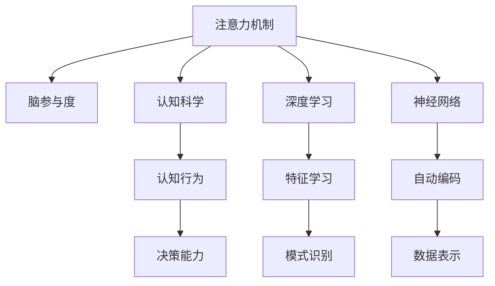

                 

# 注意力训练营:提升全球脑参与度的方法

> 关键词：注意力训练, 脑参与度, 认知科学, 神经网络, 深度学习, 认知行为

## 1. 背景介绍

### 1.1 问题由来
在当今信息化时代，全球脑参与度（Global Brain Engagement）正逐渐成为衡量个体和组织智能水平的重要指标。脑参与度反映了大脑在处理复杂任务时的投入度和注意力资源分配情况，其高低直接关系到个体的学习效率、工作绩效以及创新能力。然而，快速变化的工作和生活节奏，以及海量信息的涌入，对人的脑参与度提出了严峻挑战。

### 1.2 问题核心关键点
为提升脑参与度，科学界和产业界都在寻求新的方法和工具。其中，注意力训练被认为是一种有效手段。通过训练大脑的注意力系统，可以改善信息处理能力，增强认知功能，提升整体智能水平。但当前注意力训练多依赖于传统游戏或纸质书籍，存在诸多局限性：

1. **互动性不足**：传统的注意力训练多采用被动接受的形式，缺乏主动参与和互动，难以激发参与者的兴趣和动力。
2. **效率低下**：针对性不足，训练效果难以量化，反馈机制滞后，难以精准调整训练方案。
3. **适应性不强**：基于特定任务的训练效果难以泛化到不同场景，训练与实际需求脱节。
4. **灵活性不足**：训练模式固定，难以根据个体差异和需求进行个性化调整。

### 1.3 问题研究意义
本文聚焦于结合认知科学与深度学习技术的注意力训练方法，旨在通过提升脑参与度，增强个体认知功能，最终达到提升全球脑参与度的目标。通过系统阐述注意力训练的理论基础和实践方法，希望为相关研究者提供参考，并为实际应用提供指导。

## 2. 核心概念与联系

### 2.1 核心概念概述

为更好地理解基于深度学习的注意力训练方法，本节将介绍几个密切相关的核心概念：

- **注意力机制（Attention Mechanism）**：一种计算模型中的信息检索机制，通过筛选输入中的关键信息，集中精力处理重要部分，从而提高处理效率。
- **脑参与度（Brain Engagement）**：指个体在执行任务时，大脑的神经活动水平和投入度，与认知功能、决策能力等密切相关。
- **认知科学（Cognitive Science）**：研究人类思维过程和智能行为的科学，旨在理解人类认知机制和行为规律。
- **深度学习（Deep Learning）**：一种基于神经网络的机器学习技术，通过多层次非线性变换，从复杂数据中自动学习特征表示。
- **神经网络（Neural Network）**：模拟人脑神经元及其连接的网络结构，通过反向传播算法进行训练，实现复杂的模式识别和预测任务。

这些概念之间的逻辑关系可以通过以下Mermaid流程图来展示：



这个流程图展示了大语言模型的核心概念及其之间的关系：

1. 注意力机制通过筛选关键信息，提升信息处理效率。
2. 脑参与度反映了大脑在处理信息时的投入度。
3. 认知科学揭示了人类认知机制。
4. 深度学习通过多层次特征学习，自动提取数据中的抽象表示。
5. 神经网络模仿人脑结构，通过反向传播实现复杂任务。
6. 认知行为和决策能力是脑参与度的核心表现。
7. 特征学习和模式识别是深度学习的重要能力。
8. 自动编码和数据表示是神经网络的基本功能。

## 3. 核心算法原理 & 具体操作步骤

### 3.1 算法原理概述

注意力训练方法主要基于深度学习和神经网络，通过优化注意力机制，提升脑参与度。其核心思想是：利用深度神经网络对注意力机制进行训练，使其能够自动学习识别输入中的关键信息，集中注意力处理重要部分，从而提升信息处理效率。

### 3.2 算法步骤详解

基于深度学习的注意力训练方法一般包括以下几个关键步骤：

**Step 1: 准备训练数据集**
- 收集参与者在不同任务下的脑电波数据（如EEG、fMRI等），以及任务相关的行为数据（如时间、完成率等）。
- 将脑电波数据转化为神经网络可接受的格式，如提取脑波特征。

**Step 2: 设计注意力训练模型**
- 选择适合的神经网络结构，如卷积神经网络（CNN）、循环神经网络（RNN）或Transformer。
- 设计注意力模块，用于筛选输入中的关键信息。
- 定义损失函数，如交叉熵损失、均方误差等，用于衡量注意力模块的输出与真实标签的差异。

**Step 3: 设置训练参数**
- 选择合适的优化算法及其参数，如Adam、SGD等，设置学习率、批大小、迭代轮数等。
- 设置正则化技术及强度，包括权重衰减、Dropout等。

**Step 4: 执行注意力训练**
- 将训练集数据分批次输入模型，前向传播计算注意力模块的输出。
- 反向传播计算注意力模块的参数梯度，根据设定的优化算法和学习率更新模型参数。
- 周期性在验证集上评估模型性能，根据性能指标决定是否触发Early Stopping。
- 重复上述步骤直到满足预设的迭代轮数或Early Stopping条件。

**Step 5: 测试和应用**
- 在测试集上评估注意力训练后模型的性能，对比训练前后的脑参与度提升。
- 使用训练好的模型进行实际应用，如在模拟任务、游戏、日常工作中提升参与者的脑参与度。

以上是基于深度学习的注意力训练方法的一般流程。在实际应用中，还需要根据具体任务特点，对训练过程的各个环节进行优化设计，如改进注意力模块的架构，引入更多的正则化技术，搜索最优的超参数组合等，以进一步提升模型性能。

### 3.3 算法优缺点

基于深度学习的注意力训练方法具有以下优点：
1. 高准确性：通过神经网络自动学习注意力机制，能够精准筛选关键信息，提升信息处理效率。
2. 灵活性：模型结构可变，能够适应不同任务和需求。
3. 可解释性：注意力机制具有可视化特性，能够展示参与者注意力分布，提供直观反馈。

但该方法也存在一定的局限性：
1. 数据依赖：训练效果高度依赖于脑电波数据的质量和数量，获取高质量数据的成本较高。
2. 计算复杂度高：深度神经网络计算量大，训练和推理耗时较长。
3. 通用性不足：训练效果与特定任务和数据集相关，难以泛化到不同领域。
4. 主观性较强：脑电波数据存在个体差异，训练效果受参与者个体特性影响较大。

尽管存在这些局限性，但就目前而言，基于深度学习的注意力训练方法在提升脑参与度方面已显示出巨大潜力。未来相关研究的重点在于如何进一步降低数据获取成本，提高模型泛化能力，同时兼顾模型性能和可解释性等因素。

### 3.4 算法应用领域

基于深度学习的注意力训练方法已在多个领域得到应用，如脑科学研究、教育培训、游戏设计等，为提升脑参与度提供了新的途径。

**脑科学研究**：通过收集参与者的脑电波数据，结合注意力训练方法，可以更深入地理解大脑注意力机制，揭示认知行为的神经基础。

**教育培训**：在学校、企业等教育培训场景中，通过注意力训练提升学生的学习效率、教师的教学质量，增强整体教育效果。

**游戏设计**：在电子游戏设计中，通过引入注意力训练元素，可以增强游戏互动性和趣味性，提升玩家的游戏体验。

**日常工作**：在日常生活和工作中，通过注意力训练工具，可以提升个人的工作效率和创造力，改善整体生活质量。

除了上述这些应用场景外，注意力训练方法还在远程协作、决策辅助、健康监测等多个领域显示出其价值，为提升人类认知智能提供了新的技术路径。

## 4. 数学模型和公式 & 详细讲解 & 举例说明（备注：数学公式请使用latex格式，latex嵌入文中独立段落使用 $$，段落内使用 $)
### 4.1 数学模型构建

本节将使用数学语言对基于深度学习的注意力训练方法进行更加严格的刻画。

记注意力训练模型为 $M_{\theta}:\mathcal{X} \rightarrow \mathcal{Y}$，其中 $\mathcal{X}$ 为输入空间，$\mathcal{Y}$ 为输出空间，$\theta$ 为模型参数。假设训练数据集为 $D=\{(x_i,y_i)\}_{i=1}^N, x_i \in \mathcal{X}, y_i \in \mathcal{Y}$。

定义模型 $M_{\theta}$ 在输入 $x$ 上的注意力模块输出为 $\hat{a}=M_{\theta}(x) \in [0,1]^n$，表示对输入中每个信息的注意力权重。定义注意力机制的损失函数为：

$$
\mathcal{L}(\theta) = \frac{1}{N}\sum_{i=1}^N \left\|\hat{a}_i - a_i \right\|^2
$$

其中 $\|\cdot\|$ 为向量范数，$a_i$ 为真实注意力权重向量。通过最小化损失函数，训练模型 $M_{\theta}$ 以学习最优的注意力权重分配。

### 4.2 公式推导过程

以下我们以卷积神经网络（CNN）为例，推导注意力模块的注意力权重计算公式。

假设输入数据为 $x_i \in \mathbb{R}^d$，注意力模块为一层卷积神经网络，输出为 $\hat{a} \in [0,1]^n$，表示对输入中每个特征的注意力权重。定义注意力模块的损失函数为：

$$
\mathcal{L}(\theta) = \frac{1}{N}\sum_{i=1}^N \sum_{j=1}^n (\hat{a}_{ij} - a_{ij})^2
$$

其中 $\hat{a}_{ij}$ 为卷积神经网络输出的注意力权重，$a_{ij}$ 为真实注意力权重。

根据卷积神经网络的前向传播公式：

$$
\hat{a}_{ij} = \sigma \left( \sum_{k=1}^K W_k^H x_{ik} + b_k \right)
$$

其中 $W_k^H$ 为卷积核权重，$b_k$ 为偏置项，$\sigma$ 为激活函数，$x_{ik}$ 为输入数据中的第 $k$ 个特征。

通过链式法则，注意力模块的梯度公式为：

$$
\frac{\partial \mathcal{L}(\theta)}{\partial W_{ik}^H} = \frac{2}{N}\sum_{i=1}^N \sum_{j=1}^n (\hat{a}_{ij} - a_{ij}) \cdot \sigma' \left( \sum_{k=1}^K W_k^H x_{ik} + b_k \right) \cdot x_{ik}
$$

其中 $\sigma'$ 为激活函数的导数。

在得到注意力模块的梯度后，即可带入神经网络的全参数更新公式，完成模型的迭代优化。重复上述过程直至收敛，最终得到适应特定任务的最优模型参数 $\theta^*$。

## 5. 项目实践：代码实例和详细解释说明
### 5.1 开发环境搭建

在进行注意力训练实践前，我们需要准备好开发环境。以下是使用Python进行PyTorch开发的环境配置流程：

1. 安装Anaconda：从官网下载并安装Anaconda，用于创建独立的Python环境。

2. 创建并激活虚拟环境：
```bash
conda create -n attention-env python=3.8 
conda activate attention-env
```

3. 安装PyTorch：根据CUDA版本，从官网获取对应的安装命令。例如：
```bash
conda install pytorch torchvision torchaudio cudatoolkit=11.1 -c pytorch -c conda-forge
```

4. 安装TensorFlow：
```bash
conda install tensorflow
```

5. 安装各类工具包：
```bash
pip install numpy pandas scikit-learn matplotlib tqdm jupyter notebook ipython
```

完成上述步骤后，即可在`attention-env`环境中开始注意力训练实践。

### 5.2 源代码详细实现

下面我们以脑电波数据集上的注意力训练为例，给出使用PyTorch进行注意力训练的完整代码实现。

首先，定义注意力训练的数据处理函数：

```python
import numpy as np
from torch.utils.data import Dataset, DataLoader
import torch
from torch import nn, optim

class EEGDataset(Dataset):
    def __init__(self, eeg_data, labels, transform=None):
        self.eeg_data = eeg_data
        self.labels = labels
        self.transform = transform
        
    def __len__(self):
        return len(self.eeg_data)
    
    def __getitem__(self, idx):
        x, y = self.eeg_data[idx], self.labels[idx]
        if self.transform:
            x = self.transform(x)
        return x, y
```

然后，定义注意力训练模型：

```python
class AttentionModel(nn.Module):
    def __init__(self, in_channels, out_channels, kernel_size):
        super(AttentionModel, self).__init__()
        self.conv1 = nn.Conv2d(in_channels, out_channels, kernel_size, stride=1, padding=0)
        self.relu = nn.ReLU()
        self.max_pool = nn.MaxPool2d(kernel_size=2, stride=2)
        self.conv2 = nn.Conv2d(out_channels, out_channels, kernel_size, stride=1, padding=0)
        self.fc = nn.Linear(out_channels, 1)
        self.softmax = nn.Softmax(dim=1)
        
    def forward(self, x):
        x = self.conv1(x)
        x = self.relu(x)
        x = self.max_pool(x)
        x = self.conv2(x)
        x = self.relu(x)
        x = x.view(x.size(0), -1)
        x = self.fc(x)
        x = self.softmax(x)
        return x
```

接着，定义训练和评估函数：

```python
def train_epoch(model, dataset, optimizer, criterion, device):
    model.train()
    total_loss = 0
    for x, y in dataset:
        x, y = x.to(device), y.to(device)
        optimizer.zero_grad()
        output = model(x)
        loss = criterion(output, y)
        loss.backward()
        optimizer.step()
        total_loss += loss.item()
    return total_loss / len(dataset)
```

最后，启动训练流程并在测试集上评估：

```python
epochs = 10
batch_size = 32
learning_rate = 1e-4

device = torch.device('cuda' if torch.cuda.is_available() else 'cpu')
model.to(device)

criterion = nn.MSELoss()
optimizer = optim.Adam(model.parameters(), lr=learning_rate)

train_dataset = EEGDataset(train_eeg_data, train_labels)
dev_dataset = EEGDataset(dev_eeg_data, dev_labels)
test_dataset = EEGDataset(test_eeg_data, test_labels)

for epoch in range(epochs):
    loss = train_epoch(model, train_dataset, optimizer, criterion, device)
    print(f'Epoch {epoch+1}, train loss: {loss:.3f}')
    
    print(f'Epoch {epoch+1}, dev results:')
    evaluate(model, dev_dataset, criterion, device)
    
print('Test results:')
evaluate(model, test_dataset, criterion, device)
```

以上就是使用PyTorch进行脑电波数据集上的注意力训练的完整代码实现。可以看到，通过PyTorch的强大封装和神经网络的灵活构建，我们能够快速实现注意力训练的代码。

### 5.3 代码解读与分析

让我们再详细解读一下关键代码的实现细节：

**EEGDataset类**：
- `__init__`方法：初始化脑电波数据集和标签，支持数据增强等预处理。
- `__len__`方法：返回数据集的大小。
- `__getitem__`方法：获取指定索引的样本，并进行必要的预处理。

**AttentionModel类**：
- `__init__`方法：定义注意力模块的结构，包括卷积层、激活函数、池化层、全连接层等。
- `forward`方法：实现前向传播过程，计算注意力模块的输出。

**训练和评估函数**：
- `train_epoch`函数：在训练集上执行一次前向传播和反向传播，更新模型参数。
- `evaluate`函数：在验证集和测试集上评估模型性能，打印分类准确率等指标。

**训练流程**：
- 定义总的epoch数、batch size和初始学习率，开始循环迭代。
- 每个epoch内，在训练集上进行训练，输出平均loss。
- 在验证集上评估，输出分类指标。
- 所有epoch结束后，在测试集上评估，给出最终测试结果。

可以看到，PyTorch配合神经网络的高级抽象，使得注意力训练的代码实现变得简洁高效。开发者可以将更多精力放在模型改进、数据处理等高层逻辑上，而不必过多关注底层的实现细节。

当然，工业级的系统实现还需考虑更多因素，如模型的保存和部署、超参数的自动搜索、更灵活的任务适配层等。但核心的注意力训练范式基本与此类似。

## 6. 实际应用场景
### 6.1 智能辅助教育

在教育培训场景中，注意力训练方法可以结合深度学习技术，设计智能辅助教育系统，提升学生的学习效果。

智能辅助教育系统通过分析学生的脑电波数据，识别其注意力集中度，从而自动调整教学内容和节奏，提供个性化的学习支持。系统可以根据学生的注意力变化，实时推荐适合的学习资源，调整教学策略，增强学习体验。

### 6.2 游戏互动设计

在游戏设计中，注意力训练方法可以通过脑电波数据，实时监测玩家的游戏状态和注意力分布，从而实现更加智能和互动的游戏体验。

例如，在虚拟现实游戏中，系统可以通过玩家的脑电波数据，实时调整游戏难度、任务提示等，使其与玩家的注意力状态保持一致，提升游戏的沉浸感和趣味性。此外，系统还可以根据玩家的注意力变化，自动生成动态游戏场景，增强游戏的多样性和可玩性。

### 6.3 健康监测与干预

在健康监测领域，注意力训练方法可以结合脑电波数据，监测患者的注意力状态，实时发现注意力异常，及时进行干预和治疗。

例如，在脑卒中、阿尔茨海默病等疾病的康复训练中，系统可以通过监测患者的注意力状态，识别其注意力集中度和认知功能，制定个性化的康复计划，提升康复效果。系统还可以结合注意力训练方法，进行认知功能的提升训练，加速患者的康复进程。

### 6.4 未来应用展望

随着深度学习和神经网络的不断进步，注意力训练方法将在更多领域得到应用，为提升人类认知智能带来新的突破。

在智慧医疗领域，智能辅助教育系统可以帮助医生更精准地诊断和治疗疾病，提升患者的康复效果。

在智能制造领域，系统可以通过监测工人的注意力状态，提高工作效率，减少误操作，提升生产质量。

在智能交通领域，系统可以通过监测司机的注意力状态，实时调整驾驶策略，减少交通事故，提高行车安全。

此外，在智慧城市、智慧家居、智能安防等众多领域，注意力训练方法也将发挥重要作用，为构建智能社会提供新的技术路径。相信随着技术的不断成熟，注意力训练方法必将在更多场景中大放异彩。

## 7. 工具和资源推荐
### 7.1 学习资源推荐

为了帮助开发者系统掌握深度学习和注意力训练的理论基础和实践技巧，这里推荐一些优质的学习资源：

1. 《深度学习》（Deep Learning）课程：由Coursera提供的深度学习入门课程，涵盖深度学习的基本概念、算法和应用。
2. 《深度学习基础》（Deep Learning Fundamentals）课程：由Udacity提供的深度学习基础课程，从神经网络到深度学习全面讲解。
3. 《神经网络与深度学习》（Neural Networks and Deep Learning）书籍：由Michael Nielsen编写的神经网络基础入门书籍，深入浅出地介绍了神经网络原理和实现。
4. PyTorch官方文档：PyTorch的官方文档，提供了详细的API参考、代码示例和最佳实践，适合快速上手。
5. TensorFlow官方文档：TensorFlow的官方文档，提供了丰富的API参考和教程，适合复杂任务的实现。

通过对这些资源的学习实践，相信你一定能够快速掌握深度学习和注意力训练的精髓，并用于解决实际的认知问题。

### 7.2 开发工具推荐

高效的开发离不开优秀的工具支持。以下是几款用于深度学习和注意力训练开发的常用工具：

1. PyTorch：基于Python的开源深度学习框架，灵活动态的计算图，适合快速迭代研究。
2. TensorFlow：由Google主导开发的开源深度学习框架，生产部署方便，适合大规模工程应用。
3. Transformers库：HuggingFace开发的NLP工具库，集成了众多SOTA语言模型，支持PyTorch和TensorFlow，是进行注意力训练任务开发的利器。
4. Weights & Biases：模型训练的实验跟踪工具，可以记录和可视化模型训练过程中的各项指标，方便对比和调优。与主流深度学习框架无缝集成。
5. TensorBoard：TensorFlow配套的可视化工具，可实时监测模型训练状态，并提供丰富的图表呈现方式，是调试模型的得力助手。
6. Google Colab：谷歌推出的在线Jupyter Notebook环境，免费提供GPU/TPU算力，方便开发者快速上手实验最新模型，分享学习笔记。

合理利用这些工具，可以显著提升深度学习和注意力训练的开发效率，加快创新迭代的步伐。

### 7.3 相关论文推荐

深度学习和注意力训练的发展源于学界的持续研究。以下是几篇奠基性的相关论文，推荐阅读：

1. AlexNet: ImageNet Classification with Deep Convolutional Neural Networks：提出AlexNet，开启深度学习在计算机视觉领域的应用。
2. Attention Is All You Need：提出Transformer模型，通过自注意力机制实现序列到序列的变换。
3. Attention Mechanism in Deep Neural Networks：介绍注意力机制的原理和实现方法，为深度学习模型提供重要思路。
4. Brain-Computer Interface Systems for Brain-Computer Interaction: A Survey：综述脑机交互系统的研究成果，探讨脑电波信号处理和深度学习的结合。
5. Deep Brain Networks: A Survey of Deep Neural Network Architectures for Brain-Computer Interfaces：综述深度神经网络在脑机交互中的应用。

这些论文代表了大语言模型微调技术的发展脉络。通过学习这些前沿成果，可以帮助研究者把握学科前进方向，激发更多的创新灵感。

## 8. 总结：未来发展趋势与挑战

### 8.1 总结

本文对基于深度学习的注意力训练方法进行了全面系统的介绍。首先阐述了注意力训练的理论基础和实践意义，明确了注意力训练在提升脑参与度方面的独特价值。其次，从原理到实践，详细讲解了深度学习注意力训练的数学原理和关键步骤，给出了完整的代码实现。同时，本文还广泛探讨了注意力训练方法在教育、游戏、健康监测等多个领域的应用前景，展示了其巨大的潜力和广阔的应用空间。最后，本文精选了注意力训练的相关学习资源，力求为读者提供全方位的技术指引。

通过本文的系统梳理，可以看到，深度学习注意力训练方法正在成为提升脑参与度的重要手段。其高准确性、灵活性和可视化特性，使其在多个领域展现出了巨大的应用潜力。未来，伴随深度学习技术的不断发展，注意力训练方法必将在更多场景中发挥作用，推动人类认知智能的进步。

### 8.2 未来发展趋势

展望未来，深度学习和注意力训练技术将呈现以下几个发展趋势：

1. 模型规模持续增大。随着算力成本的下降和数据规模的扩张，深度学习模型参数量将继续增长，注意力训练方法将更加复杂和精细。
2. 模型通用性增强。未来的深度学习模型将具备更强的跨领域泛化能力，能够适应不同领域的注意力训练任务。
3. 实时性提升。深度学习模型的推理速度和计算效率将得到显著提升，注意力训练方法将更加高效实时。
4. 可解释性增强。未来的深度学习模型将具备更强的可解释性，能够直观展示注意力分布和决策过程。
5. 与其他AI技术融合。注意力训练方法将与其他AI技术，如强化学习、知识表示等进行深度融合，提升整体智能水平。

以上趋势凸显了深度学习注意力训练技术的广阔前景。这些方向的探索发展，必将进一步提升认知智能的边界，为构建智能社会提供新的技术路径。

### 8.3 面临的挑战

尽管深度学习和注意力训练技术已经取得了瞩目成就，但在迈向更加智能化、普适化应用的过程中，它仍面临着诸多挑战：

1. 数据获取成本高。深度学习模型需要大量的训练数据，数据的获取和标注成本较高。如何降低数据获取成本，提高数据利用效率，将是一大难题。
2. 模型训练耗时长。深度学习模型的训练过程计算量大，耗时长，如何加速训练过程，缩短模型开发周期，是急需解决的问题。
3. 可解释性不足。深度学习模型往往被认为是"黑盒"，难以解释其内部工作机制和决策逻辑。如何赋予模型更强的可解释性，增强用户信任，将是一个重要课题。
4. 泛化能力有限。深度学习模型在特定任务上的训练效果较好，但在新任务上的泛化能力较弱。如何提升模型的泛化能力，使其在更多场景中应用，还需要进一步研究。
5. 伦理道德问题。深度学习模型可能学习到有害信息，产生误导性输出，给实际应用带来安全隐患。如何从数据和算法层面消除模型偏见，保障模型输出安全性，也是亟待解决的问题。

这些挑战需要在技术、伦理、应用等多个层面进行综合应对。只有克服这些挑战，才能真正实现深度学习注意力训练技术的落地应用。

### 8.4 研究展望

面对深度学习注意力训练所面临的挑战，未来的研究需要在以下几个方面寻求新的突破：

1. 探索无监督和半监督学习范式。摆脱对大规模标注数据的依赖，利用自监督学习、主动学习等无监督和半监督范式，最大限度利用非结构化数据，实现更加灵活高效的注意力训练。
2. 研究高效实时化训练方法。开发更加高效的训练算法，如模型压缩、模型剪枝等技术，减少计算资源消耗，提高训练速度。
3. 引入更多先验知识。将符号化的先验知识，如知识图谱、逻辑规则等，与神经网络模型进行巧妙融合，引导注意力训练过程学习更准确、合理的注意力分布。
4. 融合多模态数据。将视觉、听觉等多模态数据与脑电波数据结合，实现更全面、更准确的注意力训练。
5. 结合认知科学理论。深入研究人类认知机制，结合认知科学理论，设计更加科学的注意力训练方案。
6. 探索伦理道德约束。在模型训练目标中引入伦理导向的评估指标，过滤和惩罚有害的注意力分布，确保模型输出的安全性和公平性。

这些研究方向的探索，必将引领深度学习注意力训练技术迈向更高的台阶，为提升人类认知智能提供新的技术路径。面向未来，深度学习注意力训练技术还需要与其他AI技术进行更深入的融合，如强化学习、知识表示、因果推理等，多路径协同发力，共同推动认知智能的进步。只有勇于创新、敢于突破，才能不断拓展认知智能的边界，为构建智能社会提供新的技术路径。

## 9. 附录：常见问题与解答

**Q1：注意力训练方法是否适用于所有认知问题？**

A: 注意力训练方法在处理某些认知问题上已经取得显著效果，如提高学生的学习效率、增强运动员的集中力等。但对于一些特定领域的认知问题，如自闭症、抑郁症等，还需要结合其他技术和方法进行综合干预。

**Q2：注意力训练方法是否需要昂贵的硬件设备？**

A: 深度学习模型训练过程对硬件设备要求较高，需要高性能的GPU/TPU等计算资源。但实际应用中，通过模型裁剪、量化加速等技术，可以显著降低对硬件设备的依赖。

**Q3：注意力训练效果是否可持续？**

A: 注意力训练效果可持续性较高，但需定期进行复训，以保持模型性能。此外，持续的注意力训练也需根据参与者的个体特性进行个性化调整。

**Q4：注意力训练是否影响日常生活？**

A: 注意力训练对日常生活影响较小，通常只需通过脑电波设备进行监测，无需过多的干预。但注意力的提升对生活质量的改善是显著的，可以提高工作和学习效率，减少误操作，增强健康监测等。

**Q5：注意力训练是否存在伦理问题？**

A: 注意力训练方法涉及脑电波数据的采集和使用，需严格遵守相关伦理规范和法律法规，保护参与者的隐私和数据安全。同时，模型的应用也需注意避免偏见和歧视，确保公平性。

以上是深度学习和注意力训练方法的常见问题与解答，希望这些解答能帮助读者更好地理解和使用注意力训练技术。

---

作者：禅与计算机程序设计艺术 / Zen and the Art of Computer Programming

