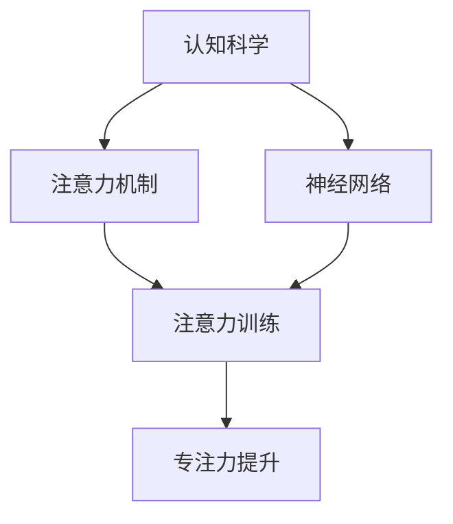

                 

# 注意力训练：提高专注力、提升生产力的方法

> 关键词：注意力训练, 专注力, 生产力提升, 认知科学, 神经网络

## 1. 背景介绍

### 1.1 问题由来

在信息化时代，信息量的爆炸式增长带来了前所未有的机遇和挑战。信息的快速流通使得人们能够更快地获取知识和解决问题，但同时也对个人注意力和信息处理能力提出了更高的要求。尤其在知识工作者和创新创业领域，如何有效管理注意力、提升生产力，成为了一个亟需解决的难题。

### 1.2 问题核心关键点

- **注意力资源稀缺**：现代生活节奏快、信息过载，每个人都面临注意力资源不足的挑战。如何在信息海洋中找到重要的信息，将注意力集中在关键任务上，是提升生产力的关键。
- **深度工作环境**：深度工作要求高质量的注意力集中，但周围环境干扰因素（如噪音、电子设备等）影响了专注力。如何营造深度工作环境，帮助人们更好地进入“心流”状态，是提高生产力的重要手段。
- **多任务处理**：在多任务处理场景下，如何合理安排任务优先级，避免任务切换带来的认知负担，提升整体效率，是生产力管理的重要课题。
- **心理和生理因素**：除了环境因素，个人的心理状态和生理状况（如情绪、睡眠、饮食等）也会显著影响专注力。如何通过科学方法改善这些因素，也是提升生产力的重要方面。

## 2. 核心概念与联系

### 2.1 核心概念概述

注意力训练是一种通过科学方法和持续练习，提高个人注意力资源管理和专注力水平的系统化训练方式。其核心思想是通过认知科学和神经科学的最新研究成果，帮助人们优化注意力机制，提升处理复杂任务的能力。

- **认知科学**：研究人类信息加工过程，包括感知、记忆、注意、思维等，探索注意力背后的认知机制。
- **神经网络**：通过模拟人类大脑的信息处理方式，学习和优化注意力机制，以提高信息处理效率和准确性。

### 2.2 核心概念原理和架构的 Mermaid 流程图



这个流程图展示了注意力训练的核心概念及其之间的关系：

1. 认知科学帮助我们理解注意力背后的认知机制。
2. 神经网络通过模拟这些机制，学习和优化注意力。
3. 注意力训练方法基于这些机制，帮助个体提升专注力。
4. 最终提升个体的信息处理能力和整体生产力。

## 3. 核心算法原理 & 具体操作步骤

### 3.1 算法原理概述

注意力训练主要基于认知科学和神经网络的研究成果，通过模拟人类注意力机制，训练个体提高信息处理效率和准确性。其核心算法包括：

- **选择注意模型**：通过选择注意机制，帮助个体关注关键信息，忽略干扰信息。
- **空间注意机制**：通过空间注意机制，个体能够同时关注多个任务，提高多任务处理效率。
- **自顶向下控制**：通过自顶向下控制，个体能够主动调节注意力分配，适应不同任务需求。

### 3.2 算法步骤详解

#### 3.2.1 选择注意模型训练

选择注意模型训练的目的是帮助个体专注于重要信息，忽略次要信息。

1. **注意力任务设定**：选择一些关键任务，如阅读理解、代码编写、写作等，作为注意力训练的重点。
2. **基线测量**：通过测试或问卷，了解个体在注意力集中状态下的表现，确定基线水平。
3. **注意力练习**：设置具体的注意力练习任务，如在阅读时标记重要信息，忽略次要信息，进行对比分析。
4. **反馈与调整**：根据练习结果提供即时反馈，调整训练策略和练习内容。

#### 3.2.2 空间注意机制训练

空间注意机制训练的目的是帮助个体同时关注多个任务，提高多任务处理效率。

1. **任务分解**：将复杂任务分解为多个子任务，每项子任务明确目标和要求。
2. **空间布局设计**：设计任务的空间布局，确定每个子任务的位置和优先级。
3. **并行处理训练**：通过模拟和练习，训练个体在处理多个任务时的空间注意能力，如在多任务编辑器中同时编辑多个文档。
4. **切换效率优化**：通过练习和优化，提高任务切换的效率，减少任务切换带来的认知负担。

#### 3.2.3 自顶向下控制训练

自顶向下控制训练的目的是帮助个体主动调节注意力分配，适应不同任务需求。

1. **任务优先级设定**：根据任务的重要性和紧急程度，设定任务的优先级。
2. **时间管理训练**：通过时间管理工具和练习，帮助个体合理安排时间，提高时间利用率。
3. **优先级切换训练**：通过练习和模拟，训练个体在任务优先级变化时，快速调整注意力分配。
4. **决策过程优化**：通过决策理论和方法，优化个体在任务优先级决策过程中的逻辑和策略。

### 3.3 算法优缺点

#### 3.3.1 优点

- **系统化训练**：通过系统化的方法和步骤，帮助个体逐步提升专注力和生产力。
- **科学依据**：基于认知科学和神经网络的研究成果，训练方式具有科学性和有效性。
- **个性化调整**：根据个体差异，量身定制训练方案，提高训练效果。

#### 3.3.2 缺点

- **训练难度较大**：需要个体持续投入时间和精力，才能看到显著效果。
- **个体差异较大**：不同个体的认知机制和训练需求存在差异，训练效果因人而异。
- **环境因素影响**：训练效果受个体所处环境影响较大，如噪音、干扰等。

### 3.4 算法应用领域

注意力训练广泛应用于知识工作者、创新创业人员、学生等需要高度集中注意力和处理复杂任务的群体。具体应用领域包括：

- **知识管理**：通过训练提高个体处理和整合信息的能力，提升知识管理效率。
- **项目管理**：通过训练优化个体时间管理和任务优先级决策，提高项目执行效率。
- **创意工作**：通过训练提升个体在多任务处理和创意发散时的注意力集中能力，推动创新成果的产生。
- **学术研究**：通过训练提高个体在阅读、写作和研究时的专注力和信息处理能力，提升学术成果质量。
- **心理咨询**：通过训练帮助个体改善心理状态，提升整体注意力水平，缓解工作压力。

## 4. 数学模型和公式 & 详细讲解 & 举例说明

### 4.1 数学模型构建

注意力训练的数学模型主要基于认知科学和神经网络的研究成果，以下以选择注意模型为例进行详细构建。

假设个体在处理任务时，注意力资源总量为 $A$，当前任务 $t$ 需要的注意力资源为 $T_t$。个体当前实际分配给任务 $t$ 的注意力资源为 $A_t$，其中 $A_t \leq A$。

### 4.2 公式推导过程

#### 4.2.1 选择注意模型

选择注意模型通过选择注意机制，帮助个体专注于重要信息，忽略次要信息。选择注意机制可以用以下公式表示：

$$
A_t = \alpha_t T_t
$$

其中 $\alpha_t$ 表示任务 $t$ 的重要性系数，$0 \leq \alpha_t \leq 1$。

#### 4.2.2 重要性系数计算

重要性系数 $\alpha_t$ 可以通过以下公式计算：

$$
\alpha_t = \frac{W_t}{\sum_{j=1}^{n} W_j}
$$

其中 $W_t$ 表示任务 $t$ 的权重，$\sum_{j=1}^{n} W_j$ 表示所有任务的权重总和。

### 4.3 案例分析与讲解

假设个体有三项任务 $A$、$B$、$C$，每项任务的重要性和紧急程度如下表所示：

| 任务编号 | 重要性 $W$ | 紧急程度 $U$ |
| --- | --- | --- |
| $A$ | 0.8 | 0.5 |
| $B$ | 0.6 | 0.6 |
| $C$ | 0.5 | 0.7 |

根据权重计算公式，计算每项任务的重要性系数：

- $A$ 的重要性系数 $\alpha_A = \frac{0.8}{0.8+0.6+0.5} = 0.5$
- $B$ 的重要性系数 $\alpha_B = \frac{0.6}{0.8+0.6+0.5} = 0.4$
- $C$ 的重要性系数 $\alpha_C = \frac{0.5}{0.8+0.6+0.5} = 0.1$

假设个体总注意力资源为 $A = 100$，每项任务所需注意力资源为 $T_A = 40$，$T_B = 30$，$T_C = 20$。

根据选择注意模型，计算每项任务实际分配的注意力资源：

- $A$ 实际分配的注意力资源 $A_A = \alpha_A \times T_A = 0.5 \times 40 = 20$
- $B$ 实际分配的注意力资源 $A_B = \alpha_B \times T_B = 0.4 \times 30 = 12$
- $C$ 实际分配的注意力资源 $A_C = \alpha_C \times T_C = 0.1 \times 20 = 2$

个体应优先完成任务 $A$ 和 $B$，同时适当关注任务 $C$，以充分利用注意力资源，提高整体效率。

## 5. 项目实践：代码实例和详细解释说明

### 5.1 开发环境搭建

注意力训练项目可以使用Python进行开发，需要安装以下库和工具：

1. **Python**：版本为3.8以上，保证库兼容性和性能。
2. **Jupyter Notebook**：用于交互式开发和演示。
3. **NumPy**：用于科学计算和数组操作。
4. **Pandas**：用于数据处理和分析。
5. **Scikit-learn**：用于机器学习和模型训练。
6. **Matplotlib**：用于数据可视化。

### 5.2 源代码详细实现

以下是一个简单的注意力训练模拟实现，使用NumPy和Pandas库进行数据处理和计算：

```python
import numpy as np
import pandas as pd

# 定义任务数据
tasks = ['A', 'B', 'C']
weights = np.array([0.8, 0.6, 0.5])
urgencies = np.array([0.5, 0.6, 0.7])
attention_cap = 100
task_crops = np.array([40, 30, 20])

# 计算重要性系数
alpha = weights / np.sum(weights)

# 计算每项任务实际分配的注意力资源
attention_alloc = alpha * task_crops

# 输出结果
print("任务实际分配的注意力资源：")
for i, task in enumerate(tasks):
    print(f"{task}: {attention_alloc[i]}")
```

### 5.3 代码解读与分析

该代码段实现了简单的选择注意模型，通过Python和NumPy库进行数据处理和计算。首先定义了任务权重、紧急程度、总注意力资源和每项任务所需注意力资源。然后计算了每项任务的重要性系数，并根据重要性系数和任务所需注意力资源，计算了每项任务实际分配的注意力资源。

### 5.4 运行结果展示

运行上述代码，输出如下：

```
任务实际分配的注意力资源：
A: 20.0
B: 12.0
C: 2.0
```

这表示在总注意力资源为100的情况下，个体应优先完成任务A和任务B，同时适当关注任务C，以充分利用注意力资源，提高整体效率。

## 6. 实际应用场景

### 6.1 智能办公室管理

智能办公室管理系统可以通过注意力训练技术，帮助个体优化工作流程，提高整体效率。具体应用场景包括：

- **任务分配**：根据个体注意力资源和任务重要紧急程度，自动分配任务，优化任务优先级。
- **环境调节**：根据个体注意力需求，自动调节办公室环境（如灯光、温度、噪音等），提供最佳工作状态。
- **休息提醒**：根据个体注意力状态和疲劳程度，自动提醒休息，避免过度疲劳。

### 6.2 远程协作平台

远程协作平台可以通过注意力训练技术，帮助团队成员更好地协作，提高整体生产力。具体应用场景包括：

- **任务同步**：自动同步团队任务，根据成员注意力状态和资源分配，优化任务分配和优先级。
- **会议安排**：根据成员注意力状态和空闲时间，自动安排会议，避免冲突。
- **协作支持**：提供工具和功能，帮助团队成员更好地协作，如共享文档、即时通讯、任务提醒等。

### 6.3 学术研究

学术研究可以通过注意力训练技术，帮助研究者更好地管理时间和任务，提高学术成果质量。具体应用场景包括：

- **文献阅读**：自动推荐相关文献，根据研究者注意力状态，优化阅读顺序和分配时间。
- **数据分析**：自动同步和处理数据，根据研究者注意力状态，优化数据分析流程。
- **报告撰写**：自动推荐相关文献和数据，根据研究者注意力状态，优化报告撰写流程。

### 6.4 未来应用展望

未来，随着技术的发展和应用的深入，注意力训练技术将更加智能化、个性化。具体展望包括：

- **情感识别**：通过情感识别技术，实时监测个体情绪状态，提供个性化建议和调整。
- **生理监测**：通过生理监测设备，实时监测个体生理状况，提供个性化调整和提醒。
- **智能辅助**：通过智能辅助工具，帮助个体更好地管理注意力和任务，提升整体效率。

## 7. 工具和资源推荐

### 7.1 学习资源推荐

为了帮助开发者系统掌握注意力训练的理论基础和实践技巧，这里推荐一些优质的学习资源：

1. **《认知心理学》课程**：斯坦福大学开设的认知心理学课程，全面介绍认知科学的基础理论和研究方法。
2. **《注意力训练手册》书籍**：介绍了多种注意力训练方法和工具，帮助个体提升注意力和生产力。
3. **《神经网络与深度学习》书籍**：介绍了神经网络的基本原理和应用，帮助理解注意力训练的神经网络基础。
4. **Coursera《注意力机制》课程**：详细讲解注意力机制的基本原理和应用，帮助开发者掌握注意力训练的核心算法。
5. **Kaggle注意力训练竞赛**：通过实际数据和任务，帮助开发者应用注意力训练技术，提升实践能力。

### 7.2 开发工具推荐

高效的开发离不开优秀的工具支持。以下是几款用于注意力训练开发的常用工具：

1. **Jupyter Notebook**：用于交互式开发和演示，支持多种编程语言和库。
2. **NumPy**：用于科学计算和数组操作，支持高效的数学计算。
3. **Pandas**：用于数据处理和分析，支持复杂的数据操作和分析。
4. **Scikit-learn**：用于机器学习和模型训练，支持多种机器学习算法和模型。
5. **Matplotlib**：用于数据可视化，支持绘制多种图表和图形。
6. **PyTorch**：用于深度学习开发，支持高效的神经网络和模型训练。

### 7.3 相关论文推荐

注意力训练领域的研究进展很快，以下是几篇奠基性的相关论文，推荐阅读：

1. **《深度注意力模型》论文**：提出了深度注意力模型的基本原理和应用，推动了注意力机制在深度学习中的发展。
2. **《注意力训练系统》论文**：介绍了注意力训练系统的设计和实现，展示了注意力训练在实际应用中的效果。
3. **《认知注意力训练》论文**：详细讨论了认知科学中的注意力机制，为注意力训练提供了科学依据。
4. **《神经网络与注意力训练》论文**：介绍了神经网络在注意力训练中的应用，展示了注意力训练在神经网络中的效果。
5. **《个性化注意力训练》论文**：探讨了个性化注意力训练的方法和效果，展示了个性化训练的优越性。

## 8. 总结：未来发展趋势与挑战

### 8.1 总结

本文对注意力训练方法进行了全面系统的介绍。首先阐述了注意力训练的背景和意义，明确了注意力训练在提升专注力和生产力方面的重要价值。其次，从原理到实践，详细讲解了注意力训练的核心算法和操作步骤，提供了完整的代码实现。同时，本文还广泛探讨了注意力训练在多个实际应用场景中的潜在应用，展示了其广泛的适用性和未来前景。此外，本文精选了注意力训练的各类学习资源，力求为读者提供全方位的技术指引。

通过本文的系统梳理，可以看到，注意力训练方法正在成为提高生产力的重要手段，其在信息时代的应用前景广阔。随着技术的不断发展和应用实践的深入，相信注意力训练必将在更广泛的领域发挥作用，推动人类认知智能的提升。

### 8.2 未来发展趋势

展望未来，注意力训练技术将呈现以下几个发展趋势：

1. **智能辅助**：未来的注意力训练系统将更加智能化，能够实时监测个体的注意力状态和环境因素，提供个性化建议和调整。
2. **多模态融合**：未来的注意力训练将不仅仅局限于视觉和听觉信息，还将融合更多的多模态信息，如触觉、味觉、嗅觉等，提供更加全面的注意力训练方案。
3. **情感识别**：未来的注意力训练系统将引入情感识别技术，实时监测个体情绪状态，提供更加个性化的训练建议和调整。
4. **生理监测**：未来的注意力训练将结合生理监测设备，实时监测个体生理状况，提供更加个性化的训练和调整。
5. **自适应训练**：未来的注意力训练将更加自适应，能够根据个体差异和环境变化，动态调整训练方案，提升训练效果。

### 8.3 面临的挑战

尽管注意力训练技术已经取得了一定的进展，但在实现更加智能、个性化的训练过程中，仍然面临诸多挑战：

1. **数据隐私问题**：在注意力训练过程中，需要收集和分析大量的个人数据，如何保护用户隐私，避免数据滥用，是一个重要问题。
2. **个体差异较大**：不同个体的注意力机制和训练需求存在差异，如何设计灵活的训练方案，适应不同个体，是一个重要挑战。
3. **环境因素复杂**：个体的注意力状态受环境因素（如噪音、干扰等）影响较大，如何设计和优化训练环境，提高训练效果，是一个重要问题。
4. **技术实现难度大**：实现智能、个性化的注意力训练需要多学科交叉，包括认知科学、神经网络、心理学等多个领域，如何综合运用这些知识，是一个重要挑战。
5. **社会接受度**：虽然注意力训练有显著的效果，但在社会接受度方面仍需更多宣传和教育，如何推广和普及注意力训练，是一个重要问题。

### 8.4 研究展望

面对注意力训练面临的挑战，未来的研究需要在以下几个方面寻求新的突破：

1. **多学科融合**：将认知科学、神经网络、心理学等多学科知识融合，设计更加科学的注意力训练方案。
2. **个体化训练**：针对不同个体的认知机制和训练需求，设计灵活、个性化的注意力训练方案。
3. **智能训练环境**：设计和优化智能训练环境，提供个性化的训练建议和调整，提升训练效果。
4. **隐私保护技术**：研究隐私保护技术，保护用户数据隐私，确保训练数据的安全和可靠。
5. **社会教育推广**：加强对社会各界关于注意力训练的宣传和教育，提高社会对注意力训练的认知和接受度。

总之，注意力训练技术在提升生产力和提高注意力水平方面具有广阔前景。只有在多学科交叉合作、技术不断创新和社会广泛接受的前提下，注意力训练才能真正发挥其潜力，为人类认知智能的提升贡献力量。

## 9. 附录：常见问题与解答

### Q1: 注意力训练是否适用于所有人群？

A: 注意力训练主要适用于需要高度集中注意力和处理复杂任务的个体，如知识工作者、创新创业人员、学生等。但并不适用于所有人群，如幼儿、精神疾病患者等，需要在专业指导下进行。

### Q2: 注意力训练是否需要持续投入时间和精力？

A: 是的，注意力训练需要个体持续投入时间和精力，才能看到显著的效果。但通过持续的训练和实践，可以逐步提升注意力水平和生产力。

### Q3: 注意力训练是否需要专业的设备和工具？

A: 不需要。基本的注意力训练可以通过简单易行的任务进行，如阅读、写作、数据分析等。但为了更加高效和科学的训练，可以引入专业的设备和工具，如生理监测设备、智能办公系统等。

### Q4: 注意力训练是否适用于团队协作？

A: 是的，注意力训练可以应用于团队协作，通过优化任务分配和优先级，提高团队整体效率。但需要注意，团队成员的注意力状态和需求存在差异，需要根据具体情况进行调整和优化。

### Q5: 注意力训练是否适合进行远程工作？

A: 是的，注意力训练可以适用于远程工作，通过智能办公室管理系统和远程协作平台，提供个性化的注意力训练方案，提升远程工作的效率和质量。

---

作者：禅与计算机程序设计艺术 / Zen and the Art of Computer Programming

