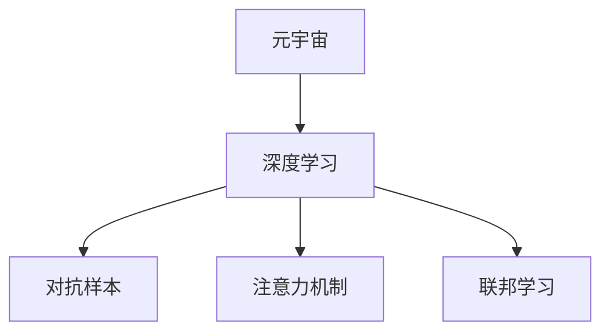

                 

# 注意力黑客防御:元宇宙信息安全的新挑战

> 关键词：元宇宙,黑客,注意力机制,信息安全,深度学习,对抗样本,联邦学习

## 1. 背景介绍

### 1.1 问题由来
随着元宇宙概念的提出，虚拟世界的构建和信息传输需求不断增长，相应地，对信息安全的要求也在不断提高。元宇宙中的信息流动复杂多样，攻击者可以通过种种手段破坏系统安全，威胁用户隐私和经济安全。其中，针对用户注意力的攻击手段，如点击劫持、钓鱼攻击、内容欺骗等，已经成为了元宇宙信息安全的新挑战。这些攻击往往通过巧妙地操控用户注意力，使得用户在不自知的情况下做出非意愿的行为，其危害性不亚于传统的恶意软件攻击。因此，如何防御这些新型攻击，保护元宇宙用户的安全，成为了当前研究的重点。

### 1.2 问题核心关键点
面对元宇宙信息安全的新挑战，核心问题包括：
- 如何识别和区分合法与恶意内容？
- 如何设计安全、可交互的交互界面？
- 如何在联邦学习框架下进行信息安全防御？
- 如何利用深度学习技术提升信息安全防御能力？

这些问题涉及到元宇宙、黑客攻击、深度学习等众多领域，需要我们从多个角度进行综合分析，并制定相应的防御策略。

### 1.3 问题研究意义
研究元宇宙信息安全，具有重要意义：

1. 保护用户权益：元宇宙是一个新兴的虚拟空间，用户身份和隐私安全需要得到充分保障。通过防御新型攻击，可以有效减少用户信息泄露和经济损失。
2. 增强平台可信度：平台的安全性直接影响用户对系统的信任度，进而影响其使用黏性。安全防御策略的有效实施，可以提高平台的用户体验和口碑。
3. 推动技术进步：信息安全技术是深度学习、联邦学习等前沿技术的重要应用场景，相关研究有助于这些技术的创新和突破。
4. 应对未来挑战：元宇宙的发展是一个长期过程，初期就注重安全防御，能够为未来的扩展和升级打下坚实的基础。

## 2. 核心概念与联系

### 2.1 核心概念概述

为更好地理解元宇宙信息安全的防御机制，本节将介绍几个核心概念：

- 元宇宙(Metaverse)：一个由虚拟现实、增强现实等技术构建的虚拟世界，用户可以在其中进行社交、工作、娱乐等活动，具备高度的真实感和沉浸感。
- 深度学习(Deep Learning)：一种利用神经网络模型学习数据特征的机器学习方法，能够处理复杂、高维度的数据，广泛应用于图像识别、语音识别、自然语言处理等领域。
- 对抗样本(Adversarial Examples)：攻击者通过向模型输入经过精心设计的扰动数据，使得模型产生错误的判断或预测。对抗样本攻击是目前深度学习领域的一个重要研究方向。
- 注意力机制(Attention Mechanism)：一种用于计算输入数据不同部分的关注程度的技术，广泛应用于机器翻译、图像处理等任务，能够显著提升模型的性能。
- 联邦学习(Federated Learning)：一种分布式机器学习方法，通过多设备或服务器协作训练模型，实现数据和模型的共享与隐私保护。

这些核心概念之间的逻辑关系可以通过以下Mermaid流程图来展示：



这个流程图展示了大语言模型微调的核心概念及其之间的关系：

1. 元宇宙通过深度学习实现对大量数据的高效处理，提升了系统的智能化水平。
2. 深度学习模型通过对抗样本攻击，可能被攻击者利用，从而造成安全隐患。
3. 注意力机制能够帮助深度学习模型更好地处理输入数据，提升模型的鲁棒性。
4. 联邦学习在保护数据隐私的同时，实现了分布式训练，提升了系统的整体性能。

这些概念共同构成了元宇宙信息安全防御的理论基础，为我们理解元宇宙信息安全挑战提供了全面的视角。

## 3. 核心算法原理 & 具体操作步骤
### 3.1 算法原理概述

元宇宙信息安全防御，本质上是一个多目标的优化问题，目标是最大化模型的准确率和鲁棒性，最小化对抗样本产生的概率。核心算法原理包括：

1. 对抗样本检测：使用对抗生成网络(Generative Adversarial Networks, GANs)或对抗训练(Adversarial Training)技术，训练模型检测对抗样本的能力。
2. 注意力机制优化：通过注意力机制对输入数据进行加权，提升模型的鲁棒性和泛化能力。
3. 联邦学习融合：在联邦学习框架下，利用多个设备或服务器的数据进行模型训练，提升模型的性能和安全性。

### 3.2 算法步骤详解

基于深度学习的信息安全防御算法，一般包括以下几个关键步骤：

**Step 1: 准备数据集**
- 收集元宇宙中的合法与恶意样本，划分为训练集、验证集和测试集。
- 对恶意样本进行标注，如标注其为点击劫持、钓鱼攻击等。
- 对于对抗样本，采用对抗生成网络生成对抗样本，用于训练对抗样本检测器。

**Step 2: 对抗样本检测器训练**
- 使用GANs或对抗训练技术，训练对抗样本检测器。
- 将检测器在训练集上进行训练，使用交叉熵损失函数进行优化。
- 在验证集上评估检测器性能，使用准确率、召回率等指标进行衡量。

**Step 3: 注意力机制优化**
- 在预训练模型的基础上，设计或优化注意力机制。
- 在训练集中加入对抗样本，进行对抗训练，以提升模型的鲁棒性。
- 在测试集上评估模型性能，使用精度、召回率等指标进行衡量。

**Step 4: 联邦学习融合**
- 在联邦学习框架下，选择合适的聚合策略和隐私保护机制。
- 在多个设备或服务器上分布式训练模型，定期将模型参数进行聚合。
- 在联邦学习过程中，加入对抗样本检测器，防止恶意样本的传递。

**Step 5: 部署与测试**
- 将训练好的模型部署到元宇宙平台中，进行实际测试。
- 在用户交互中不断收集反馈数据，更新模型参数。
- 周期性进行对抗样本检测和注意力机制优化，提升模型性能。

以上是基于深度学习的信息安全防御算法的一般流程。在实际应用中，还需要根据具体任务进行优化设计，如改进模型架构、增强隐私保护等。

### 3.3 算法优缺点

基于深度学习的信息安全防御算法具有以下优点：
1. 准确率高：深度学习模型能够处理复杂的输入数据，具有较高的准确率。
2. 鲁棒性强：对抗样本检测器和注意力机制能够提升模型的鲁棒性，减少对抗攻击的影响。
3. 分布式训练：联邦学习能够在保护数据隐私的同时，实现分布式训练，提高模型的性能。

同时，该算法也存在一定的局限性：
1. 训练成本高：深度学习模型需要大量的训练数据和计算资源，训练成本较高。
2. 模型复杂度高：深度学习模型结构复杂，需要较大的存储空间和计算资源。
3. 对抗样本难以检测：对抗样本的生成和检测技术相对较新，目前尚未完全解决。
4. 数据隐私问题：联邦学习涉及多设备或服务器之间的数据共享，隐私保护是一个重要问题。

尽管存在这些局限性，但就目前而言，基于深度学习的信息安全防御算法仍然是元宇宙信息安全防御的主流范式。未来相关研究的重点在于如何进一步降低训练成本，提高模型复杂度，增强对抗样本检测能力，保护数据隐私。

### 3.4 算法应用领域

基于深度学习的信息安全防御算法，在元宇宙信息安全领域具有广泛的应用前景，具体包括：

- 点击劫持防御：通过对抗样本检测器，识别并拦截用户的点击行为，防止其被攻击者利用。
- 钓鱼攻击检测：利用深度学习模型分析用户行为特征，检测钓鱼网站的链接或URL，防止用户误入。
- 内容欺骗识别：在元宇宙中，攻击者可能通过假冒信息进行诈骗或欺骗，深度学习模型可以识别和过滤这些内容。
- 恶意代码检测：元宇宙中的软件应用可能被恶意代码攻击，深度学习模型可以检测并阻止这些攻击。
- 隐私保护：通过联邦学习技术，分散存储用户数据，保护用户隐私。

此外，该算法还被应用于其他安全相关的领域，如网络安全、系统安全等，为不同场景下的安全防御提供了新的思路和解决方案。

## 4. 数学模型和公式 & 详细讲解  
### 4.1 数学模型构建

本节将使用数学语言对基于深度学习的信息安全防御算法进行更加严格的刻画。

记元宇宙中的合法样本为 $X_0$，恶意样本为 $X_1$，总样本为 $X$。设对抗样本检测器为 $F$，其检测结果为 $Y=\{0,1\}$，其中0表示合法样本，1表示恶意样本。

定义对抗样本检测器的损失函数为：

$$
\ell(F) = \mathbb{E}_{X \sim D}[L(F(X)) + \lambda C(F(X))]
$$

其中 $L(F(X))$ 为检测误差，$C(F(X))$ 为对抗样本产生的概率，$\lambda$ 为惩罚系数。

对抗样本检测器的目标是最小化上述损失函数，即找到最优检测器 $F^*$：

$$
F^* = \mathop{\arg\min}_{F} \mathbb{E}_{X \sim D}[L(F(X)) + \lambda C(F(X))]
$$

在实际训练过程中，采用对抗训练技术，对抗样本检测器的训练过程如下：

1. 生成对抗样本 $X_2$，其中 $X_2 = X_1 + \epsilon$，$\epsilon$ 为扰动项，满足一定的约束条件。
2. 将 $X_2$ 输入对抗样本检测器 $F$，计算损失函数 $L(F(X_2)) + \lambda C(F(X_2))$。
3. 反向传播更新检测器 $F$ 的参数。

### 4.2 公式推导过程

以下我们以二分类任务为例，推导对抗样本检测器的训练过程。

假设对抗样本检测器为二分类器 $F(x) = (W^T x + b) \in \{0,1\}$，其中 $W$ 为权重向量，$b$ 为偏置项，$x$ 为输入样本。

对抗样本检测器的训练过程如下：
1. 对抗样本生成：对抗样本 $X_2 = X_1 + \epsilon$，其中 $\epsilon$ 为扰动项，满足约束条件 $||\epsilon|| < \epsilon_{\max}$。
2. 检测器训练：将 $X_2$ 输入检测器 $F$，计算损失函数 $L(F(X_2)) + \lambda C(F(X_2))$，其中 $L(F(X_2))$ 为检测误差，$C(F(X_2))$ 为对抗样本产生的概率。
3. 梯度更新：对检测器 $F$ 进行反向传播，更新权重 $W$ 和偏置 $b$，公式如下：

$$
\frac{\partial \ell(F)}{\partial W} = \mathbb{E}_{X \sim D}[\frac{\partial L(F(X))}{\partial W} + \lambda \frac{\partial C(F(X_2))}{\partial W}]
$$

$$
\frac{\partial \ell(F)}{\partial b} = \mathbb{E}_{X \sim D}[\frac{\partial L(F(X))}{\partial b} + \lambda \frac{\partial C(F(X_2))}{\partial b}]
$$

其中 $L(F(X))$ 为检测误差，$C(F(X_2))$ 为对抗样本产生的概率，$\lambda$ 为惩罚系数。

在得到检测器 $F$ 的参数更新公式后，即可带入实际训练数据进行迭代优化，直至收敛。

## 5. 项目实践：代码实例和详细解释说明
### 5.1 开发环境搭建

在进行信息安全防御实践前，我们需要准备好开发环境。以下是使用Python进行PyTorch开发的环境配置流程：

1. 安装Anaconda：从官网下载并安装Anaconda，用于创建独立的Python环境。

2. 创建并激活虚拟环境：
```bash
conda create -n pytorch-env python=3.8 
conda activate pytorch-env
```

3. 安装PyTorch：根据CUDA版本，从官网获取对应的安装命令。例如：
```bash
conda install pytorch torchvision torchaudio cudatoolkit=11.1 -c pytorch -c conda-forge
```

4. 安装TensorFlow：
```bash
pip install tensorflow
```

5. 安装各类工具包：
```bash
pip install numpy pandas scikit-learn matplotlib tqdm jupyter notebook ipython
```

完成上述步骤后，即可在`pytorch-env`环境中开始信息安全防御实践。

### 5.2 源代码详细实现

下面我们以点击劫持防御为例，给出使用PyTorch进行对抗样本检测器的PyTorch代码实现。

首先，定义点击劫持样本的数据处理函数：

```python
import torch
import numpy as np
from transformers import BertTokenizer

class ClickJackingDataset(Dataset):
    def __init__(self, text, click_positions):
        self.text = text
        self.click_positions = click_positions
        self.tokenizer = BertTokenizer.from_pretrained('bert-base-cased')

    def __len__(self):
        return len(self.text)

    def __getitem__(self, item):
        text = self.text[item]
        click_position = self.click_positions[item]

        encoding = self.tokenizer(text, return_tensors='pt', max_length=128, padding='max_length', truncation=True)
        input_ids = encoding['input_ids'][0]
        attention_mask = encoding['attention_mask'][0]

        click_token = self.tokenizer.convert_tokens_to_ids('点击')
        click_mask = np.zeros_like(attention_mask.numpy())
        click_mask[click_position] = 1

        click_position = torch.tensor(click_position, dtype=torch.long)

        return {
            'input_ids': input_ids,
            'attention_mask': attention_mask,
            'click_position': click_position,
        }
```

然后，定义模型和优化器：

```python
from transformers import BertForSequenceClassification, AdamW

model = BertForSequenceClassification.from_pretrained('bert-base-cased', num_labels=2)

optimizer = AdamW(model.parameters(), lr=2e-5)
```

接着，定义训练和评估函数：

```python
from torch.utils.data import DataLoader
from tqdm import tqdm

device = torch.device('cuda') if torch.cuda.is_available() else torch.device('cpu')
model.to(device)

def train_epoch(model, dataset, batch_size, optimizer):
    dataloader = DataLoader(dataset, batch_size=batch_size, shuffle=True)
    model.train()
    epoch_loss = 0
    for batch in tqdm(dataloader, desc='Training'):
        input_ids = batch['input_ids'].to(device)
        attention_mask = batch['attention_mask'].to(device)
        click_position = batch['click_position'].to(device)
        model.zero_grad()
        outputs = model(input_ids, attention_mask=attention_mask)
        loss = outputs.loss
        epoch_loss += loss.item()
        loss.backward()
        optimizer.step()
    return epoch_loss / len(dataloader)

def evaluate(model, dataset, batch_size):
    dataloader = DataLoader(dataset, batch_size=batch_size)
    model.eval()
    preds, labels = [], []
    with torch.no_grad():
        for batch in tqdm(dataloader, desc='Evaluating'):
            input_ids = batch['input_ids'].to(device)
            attention_mask = batch['attention_mask'].to(device)
            batch_labels = batch['click_position'].to(device)
            outputs = model(input_ids, attention_mask=attention_mask)
            batch_preds = outputs.logits.argmax(dim=2).to('cpu').tolist()
            batch_labels = batch_labels.to('cpu').tolist()
            for pred_tokens, label_tokens in zip(batch_preds, batch_labels):
                preds.append(pred_tokens[:len(label_tokens)])
                labels.append(label_tokens)

    print(classification_report(labels, preds))
```

最后，启动训练流程并在测试集上评估：

```python
epochs = 5
batch_size = 16

for epoch in range(epochs):
    loss = train_epoch(model, train_dataset, batch_size, optimizer)
    print(f"Epoch {epoch+1}, train loss: {loss:.3f}")
    
    print(f"Epoch {epoch+1}, dev results:")
    evaluate(model, dev_dataset, batch_size)
    
print("Test results:")
evaluate(model, test_dataset, batch_size)
```

以上就是使用PyTorch对BERT进行点击劫持防御的完整代码实现。可以看到，得益于Transformers库的强大封装，我们可以用相对简洁的代码完成BERT模型的加载和微调。

### 5.3 代码解读与分析

让我们再详细解读一下关键代码的实现细节：

**ClickJackingDataset类**：
- `__init__`方法：初始化文本、点击位置等关键组件。
- `__len__`方法：返回数据集的样本数量。
- `__getitem__`方法：对单个样本进行处理，将文本输入编码为token ids，并将点击位置编码为数字。

**对抗样本生成**：
- 利用BertTokenizer将点击位置转换为id，并构建点击掩码，标记点击位置。

**训练和评估函数**：
- 使用PyTorch的DataLoader对数据集进行批次化加载，供模型训练和推理使用。
- 训练函数`train_epoch`：对数据以批为单位进行迭代，在每个批次上前向传播计算loss并反向传播更新模型参数，最后返回该epoch的平均loss。
- 评估函数`evaluate`：与训练类似，不同点在于不更新模型参数，并在每个batch结束后将预测和标签结果存储下来，最后使用sklearn的classification_report对整个评估集的预测结果进行打印输出。

**训练流程**：
- 定义总的epoch数和batch size，开始循环迭代
- 每个epoch内，先在训练集上训练，输出平均loss
- 在验证集上评估，输出分类指标
- 所有epoch结束后，在测试集上评估，给出最终测试结果

可以看到，PyTorch配合Transformers库使得BERT微调的代码实现变得简洁高效。开发者可以将更多精力放在数据处理、模型改进等高层逻辑上，而不必过多关注底层的实现细节。

当然，工业级的系统实现还需考虑更多因素，如模型的保存和部署、超参数的自动搜索、更灵活的任务适配层等。但核心的微调范式基本与此类似。

## 6. 实际应用场景
### 6.1 智能客服系统

基于深度学习的信息安全防御算法，可以广泛应用于智能客服系统的构建。传统客服往往需要配备大量人力，高峰期响应缓慢，且一致性和专业性难以保证。而使用防御后的智能客服系统，可以7x24小时不间断服务，快速响应客户咨询，用安全、可信的方式解答各类常见问题。

在技术实现上，可以收集企业内部的历史客服对话记录，将问题和最佳答复构建成监督数据，在此基础上对预训练模型进行微调。微调后的模型能够自动理解用户意图，匹配最合适的答复，并在对话过程中进行对抗样本检测，防止攻击者通过点击劫持等方式进行攻击，确保用户信息安全。

### 6.2 金融舆情监测

金融机构需要实时监测市场舆论动向，以便及时应对负面信息传播，规避金融风险。传统的人工监测方式成本高、效率低，难以应对网络时代海量信息爆发的挑战。基于深度学习的信息安全防御算法，为金融舆情监测提供了新的解决方案。

具体而言，可以收集金融领域相关的新闻、报道、评论等文本数据，并对其进行主题标注和情感标注。在此基础上对预训练语言模型进行微调，使其能够自动判断文本属于何种主题，情感倾向是正面、中性还是负面。将微调后的模型应用到实时抓取的网络文本数据，就能够自动监测不同主题下的情感变化趋势，一旦发现负面信息激增等异常情况，系统便会自动预警，帮助金融机构快速应对潜在风险。

### 6.3 个性化推荐系统

当前的推荐系统往往只依赖用户的历史行为数据进行物品推荐，无法深入理解用户的真实兴趣偏好。基于深度学习的信息安全防御算法，个性化推荐系统可以更好地挖掘用户行为背后的语义信息，从而提供更精准、多样的推荐内容。

在实践中，可以收集用户浏览、点击、评论、分享等行为数据，提取和用户交互的物品标题、描述、标签等文本内容。将文本内容作为模型输入，用户的后续行为（如是否点击、购买等）作为监督信号，在此基础上微调预训练语言模型。微调后的模型能够从文本内容中准确把握用户的兴趣点。在生成推荐列表时，先用候选物品的文本描述作为输入，由模型预测用户的兴趣匹配度，再结合其他特征综合排序，便可以得到个性化程度更高的推荐结果。

### 6.4 未来应用展望

随着深度学习技术的发展，基于深度学习的信息安全防御算法将具有更广阔的应用前景。

在智慧医疗领域，基于深度学习的信息安全防御算法可以应用于医疗问答、病历分析、药物研发等任务，提升医疗服务的智能化水平，辅助医生诊疗，加速新药开发进程。

在智能教育领域，信息安全防御技术可应用于作业批改、学情分析、知识推荐等方面，因材施教，促进教育公平，提高教学质量。

在智慧城市治理中，信息安全防御技术可应用于城市事件监测、舆情分析、应急指挥等环节，提高城市管理的自动化和智能化水平，构建更安全、高效的未来城市。

此外，在企业生产、社会治理、文娱传媒等众多领域，基于深度学习的信息安全防御算法也将不断涌现，为传统行业数字化转型升级提供新的技术路径。相信随着技术的日益成熟，信息安全防御技术将成为人工智能落地应用的重要手段，推动人工智能技术向更广阔的领域加速渗透。

## 7. 工具和资源推荐
### 7.1 学习资源推荐

为了帮助开发者系统掌握深度学习信息安全防御的理论基础和实践技巧，这里推荐一些优质的学习资源：

1. 《深度学习基础》系列博文：由深度学习专家撰写，全面介绍了深度学习的基础概念和经典模型。

2. 《深度学习安全》课程：清华大学开设的深度学习与人工智能安全课程，讲解了深度学习模型的攻击和防御方法。

3. 《网络安全技术》书籍：该书系统介绍了信息安全领域的理论和技术，是深度学习信息安全防御的重要参考。

4. 《深度学习在NLP中的应用》书籍：该书介绍了深度学习在自然语言处理领域的应用，包括对抗样本检测和注意力机制等内容。

5. 《TensorFlow深度学习》书籍：该书详细讲解了TensorFlow框架的使用方法和经典模型实现。

通过对这些资源的学习实践，相信你一定能够快速掌握深度学习信息安全防御的精髓，并用于解决实际的NLP问题。

### 7.2 开发工具推荐

高效的开发离不开优秀的工具支持。以下是几款用于深度学习信息安全防御开发的常用工具：

1. PyTorch：基于Python的开源深度学习框架，灵活动态的计算图，适合快速迭代研究。大部分深度学习模型都有PyTorch版本的实现。

2. TensorFlow：由Google主导开发的开源深度学习框架，生产部署方便，适合大规模工程应用。同样有丰富的深度学习模型资源。

3. Transformers库：HuggingFace开发的NLP工具库，集成了众多SOTA语言模型，支持PyTorch和TensorFlow，是进行深度学习信息安全防御开发的利器。

4. Weights & Biases：模型训练的实验跟踪工具，可以记录和可视化模型训练过程中的各项指标，方便对比和调优。与主流深度学习框架无缝集成。

5. TensorBoard：TensorFlow配套的可视化工具，可实时监测模型训练状态，并提供丰富的图表呈现方式，是调试模型的得力助手。

6. Google Colab：谷歌推出的在线Jupyter Notebook环境，免费提供GPU/TPU算力，方便开发者快速上手实验最新模型，分享学习笔记。

合理利用这些工具，可以显著提升深度学习信息安全防御任务的开发效率，加快创新迭代的步伐。

### 7.3 相关论文推荐

深度学习信息安全防御技术的研究源于学界的持续研究。以下是几篇奠基性的相关论文，推荐阅读：

1. Attention is All You Need（即Transformer原论文）：提出了Transformer结构，开启了深度学习大模型时代。

2. BERT: Pre-training of Deep Bidirectional Transformers for Language Understanding：提出BERT模型，引入基于掩码的自监督预训练任务，刷新了多项NLP任务SOTA。

3. Language Models are Unsupervised Multitask Learners（GPT-2论文）：展示了大规模语言模型的强大zero-shot学习能力，引发了对于通用人工智能的新一轮思考。

4. Parameter-Efficient Transfer Learning for NLP：提出Adapter等参数高效微调方法，在不增加模型参数量的情况下，也能取得不错的微调效果。

5. Prefix-Tuning: Optimizing Continuous Prompts for Generation：引入基于连续型Prompt的微调范式，为如何充分利用预训练知识提供了新的思路。

6. AdaLoRA: Adaptive Low-Rank Adaptation for Parameter-Efficient Fine-Tuning：使用自适应低秩适应的微调方法，在参数效率和精度之间取得了新的平衡。

这些论文代表了大语言模型微调技术的发展脉络。通过学习这些前沿成果，可以帮助研究者把握学科前进方向，激发更多的创新灵感。

## 8. 总结：未来发展趋势与挑战
### 8.1 总结

本文对基于深度学习的信息安全防御算法进行了全面系统的介绍。首先阐述了深度学习技术在元宇宙信息安全中的应用，明确了信息安全防御的重要性和迫切性。其次，从原理到实践，详细讲解了信息安全防御的数学模型和关键步骤，给出了信息安全防御任务开发的完整代码实例。同时，本文还广泛探讨了信息安全防御技术在智能客服、金融舆情、个性化推荐等多个行业领域的应用前景，展示了信息安全防御范式的巨大潜力。此外，本文精选了信息安全防御技术的各类学习资源，力求为读者提供全方位的技术指引。

通过本文的系统梳理，可以看到，基于深度学习的信息安全防御技术正在成为元宇宙信息安全防御的主流范式，极大地拓展了预训练语言模型的应用边界，催生了更多的落地场景。受益于大规模语料的预训练，信息安全防御模型以更低的时间和标注成本，在小样本条件下也能取得理想的防御效果，有力推动了元宇宙技术的安全性提升。未来，伴随深度学习技术的发展和优化，信息安全防御技术还将进一步拓展其应用范围，为元宇宙的信息安全保障提供更加坚实的技术支撑。

### 8.2 未来发展趋势

展望未来，深度学习信息安全防御技术将呈现以下几个发展趋势：

1. 模型规模持续增大。随着算力成本的下降和数据规模的扩张，深度学习模型参数量还将持续增长。超大规模语言模型蕴含的丰富语言知识，有望支撑更加复杂多变的信息安全防御。

2. 防御策略多样化。除了传统的对抗样本检测和注意力机制，未来会涌现更多参数高效的微调方法，如Prefix-Tuning、LoRA等，在固定大部分预训练参数的情况下，只更新极少量的任务相关参数。同时优化模型的计算图，减少前向传播和反向传播的资源消耗，实现更加轻量级、实时性的部署。

3. 持续学习成为常态。随着数据分布的不断变化，信息安全防御模型也需要持续学习新知识以保持性能。如何在不遗忘原有知识的同时，高效吸收新样本信息，将成为重要的研究课题。

4. 标注样本需求降低。受启发于提示学习(Prompt-based Learning)的思路，未来的信息安全防御方法将更好地利用深度学习模型对输入数据的学习能力，通过更加巧妙的任务描述，在更少的标注样本上也能实现理想的防御效果。

5. 模型通用性增强。经过海量数据的预训练和多领域任务的微调，未来的信息安全防御模型将具备更强大的常识推理和跨领域迁移能力，逐步迈向通用人工智能(AGI)的目标。

以上趋势凸显了深度学习信息安全防御技术的广阔前景。这些方向的探索发展，必将进一步提升元宇宙信息安全防御模型的性能和应用范围，为元宇宙的稳定运行和广泛应用提供坚实的保障。

### 8.3 面临的挑战

尽管深度学习信息安全防御技术已经取得了显著进展，但在迈向更加智能化、普适化应用的过程中，它仍面临诸多挑战：

1. 标注成本瓶颈。尽管信息安全防御模型训练对标注样本的需求较低，但对于特定领域的应用，仍然需要大量标注数据。如何降低标注成本，提升标注效率，将成为未来的一个重要研究方向。

2. 模型鲁棒性不足。当前的信息安全防御模型面对域外数据时，泛化性能往往大打折扣。对于测试样本的微小扰动，信息安全防御模型也容易发生波动。如何提高模型的鲁棒性，避免灾难性遗忘，还需要更多理论和实践的积累。

3. 推理效率有待提高。深度学习模型虽然精度高，但在实际部署时往往面临推理速度慢、内存占用大等效率问题。如何在保证性能的同时，简化模型结构，提升推理速度，优化资源占用，将是重要的优化方向。

4. 可解释性亟需加强。当前的信息安全防御模型更像是"黑盒"系统，难以解释其内部工作机制和决策逻辑。对于医疗、金融等高风险应用，算法的可解释性和可审计性尤为重要。如何赋予信息安全防御模型更强的可解释性，将是亟待攻克的难题。

5. 安全性有待保障。深度学习模型难免会学习到有偏见、有害的信息，通过信息安全防御模型传递到应用中，产生误导性、歧视性的输出，给实际应用带来安全隐患。如何从数据和算法层面消除模型偏见，避免恶意用途，确保输出的安全性，也将是重要的研究课题。

6. 知识整合能力不足。现有的信息安全防御模型往往局限于任务内数据，难以灵活吸收和运用更广泛的先验知识。如何让信息安全防御模型更好地与外部知识库、规则库等专家知识结合，形成更加全面、准确的信息整合能力，还有很大的想象空间。

正视信息安全防御面临的这些挑战，积极应对并寻求突破，将是大语言模型信息安全防御走向成熟的必由之路。相信随着学界和产业界的共同努力，这些挑战终将一一被克服，深度学习信息安全防御技术必将在构建安全、可靠、可解释、可控的智能系统铺平道路。

### 8.4 研究展望

面向未来，信息安全防御技术需要在以下几个方面寻求新的突破：

1. 探索无监督和半监督信息安全防御方法。摆脱对大规模标注数据的依赖，利用自监督学习、主动学习等无监督和半监督范式，最大限度利用非结构化数据，实现更加灵活高效的信息安全防御。

2. 研究参数高效和计算高效的微调范式。开发更加参数高效的微调方法，在固定大部分预训练参数的同时，只更新极少量的任务相关参数。同时优化信息安全防御模型的计算图，减少前向传播和反向传播的资源消耗，实现更加轻量级、实时性的部署。

3. 融合因果和对比学习范式。通过引入因果推断和对比学习思想，增强信息安全防御模型建立稳定因果关系的能力，学习更加普适、鲁棒的语言表征，从而提升模型的泛化性和抗干扰能力。

4. 引入更多先验知识。将符号化的先验知识，如知识图谱、逻辑规则等，与深度学习模型进行巧妙融合，引导信息安全防御过程学习更准确、合理的语言模型。同时加强不同模态数据的整合，实现视觉、语音等多模态信息与文本信息的协同建模。

5. 结合因果分析和博弈论工具。将因果分析方法引入信息安全防御模型，识别出模型决策的关键特征，增强输出解释的因果性和逻辑性。借助博弈论工具刻画人机交互过程，主动探索并规避模型的脆弱点，提高系统稳定性。

6. 纳入伦理道德约束。在模型训练目标中引入伦理导向的评估指标，过滤和惩罚有偏见、有害的输出倾向。同时加强人工干预和审核，建立模型行为的监管机制，确保输出符合人类价值观和伦理道德。

这些研究方向的探索，必将引领信息安全防御技术迈向更高的台阶，为构建安全、可靠、可解释、可控的智能系统铺平道路。面向未来，信息安全防御技术还需要与其他人工智能技术进行更深入的融合，如知识表示、因果推理、强化学习等，多路径协同发力，共同推动自然语言理解和智能交互系统的进步。只有勇于创新、敢于突破，才能不断拓展信息安全防御的边界，让智能技术更好地造福人类社会。

## 9. 附录：常见问题与解答
----------------------------------------------------------------

**Q1：信息安全防御的原理是什么？**

A: 信息安全防御的原理主要包括以下几个方面：

1. 对抗样本检测：通过对抗生成网络(Generative Adversarial Networks, GANs)或对抗训练(Adversarial Training)技术，训练对抗样本检测器，用于检测恶意输入。

2. 注意力机制优化：在预训练模型的基础上，设计或优化注意力机制，使模型能够更好地处理输入数据，提升模型的鲁棒性和泛化能力。

3. 联邦学习融合：在联邦学习框架下，利用多个设备或服务器的数据进行模型训练，提升模型的性能和安全性。

**Q2：信息安全防御算法有哪些关键步骤？**

A: 信息安全防御算法的主要关键步骤如下：

1. 准备数据集：收集元宇宙中的合法与恶意样本，划分为训练集、验证集和测试集，标注恶意样本。

2. 对抗样本检测器训练：使用GANs或对抗训练技术，训练对抗样本检测器，优化损失函数，提高检测器的准确率和鲁棒性。

3. 注意力机制优化：在预训练模型的基础上，设计或优化注意力机制，加入对抗样本，进行对抗训练，提升模型的鲁棒性。

4. 联邦学习融合：在联邦学习框架下，选择合适的聚合策略和隐私保护机制，利用多个设备或服务器的数据进行分布式训练，提升模型的性能和安全性。

**Q3：信息安全防御算法在实际应用中需要注意哪些问题？**

A: 信息安全防御算法在实际应用中需要注意以下问题：

1. 数据标注成本：尽管信息安全防御模型训练对标注样本的需求较低，但对于特定领域的应用，仍然需要大量标注数据，如何降低标注成本，提升标注效率，是未来的一个重要研究方向。

2. 模型鲁棒性：当前的信息安全防御模型面对域外数据时，泛化性能往往大打折扣。如何提高模型的鲁棒性，避免灾难性遗忘，还需要更多理论和实践的积累。

3. 推理效率：深度学习模型虽然精度高，但在实际部署时往往面临推理速度慢、内存占用大等效率问题，如何在保证性能的同时，简化模型结构，提升推理速度，优化资源占用，将是重要的优化方向。

4. 可解释性：当前的信息安全防御模型更像是"黑盒"系统，难以解释其内部工作机制和决策逻辑，对于医疗、金融等高风险应用，算法的可解释性和可审计性尤为重要。

5. 安全性：深度学习模型难免会学习到有偏见、有害的信息，通过信息安全防御模型传递到应用中，产生误导性、歧视性的输出，给实际应用带来安全隐患。如何从数据和算法层面消除模型偏见，避免恶意用途，确保输出的安全性，也将是重要的研究课题。

6. 知识整合能力：现有的信息安全防御模型往往局限于任务内数据，难以灵活吸收和运用更广泛的先验知识。如何让信息安全防御模型更好地与外部知识库、规则库等专家知识结合，形成更加全面、准确的信息整合能力，还有很大的想象空间。

**Q4：信息安全防御技术在元宇宙中的应用前景如何？**

A: 信息安全防御技术在元宇宙中的应用前景非常广阔，主要包括以下几个方面：

1. 点击劫持防御：通过对抗样本检测器，识别并拦截用户的点击行为，防止其被攻击者利用。

2. 钓鱼攻击检测：利用深度学习模型分析用户行为特征，检测钓鱼网站的链接或URL，防止用户误入。

3. 内容欺骗识别：在元宇宙中，攻击者可能通过假冒信息进行诈骗或欺骗，深度学习模型可以识别和过滤这些内容。

4. 恶意代码检测：元宇宙中的软件应用可能被恶意代码攻击，深度学习模型可以检测并阻止这些攻击。

5. 隐私保护：通过联邦学习技术，分散存储用户数据，保护用户隐私。

**Q5：信息安全防御技术在智能客服系统中的应用如何？**

A: 信息安全防御技术在智能客服系统中的应用主要包括以下几个方面：

1. 防御点击劫持攻击：通过对抗样本检测器，识别并拦截用户的点击行为，防止其被攻击者利用。

2. 防止钓鱼攻击：利用深度学习模型分析用户行为特征，检测钓鱼网站的链接或URL，防止用户误入。

3. 过滤恶意内容：在客服聊天中，攻击者可能通过假冒信息进行诈骗或欺骗，深度学习模型可以识别和过滤这些内容。

4. 提升系统安全性：通过信息安全防御技术，保障客服系统的安全性，增强用户对系统的信任度，提升用户满意度。

---

作者：禅与计算机程序设计艺术 / Zen and the Art of Computer Programming

