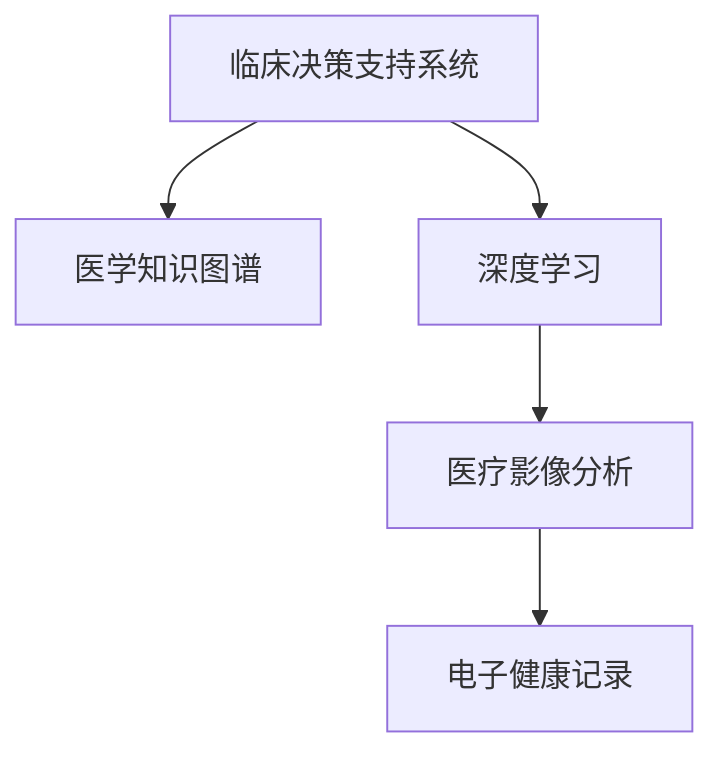

                 

# 洞察力与医疗诊断：临床决策的关键因素

## 1. 背景介绍

### 1.1 问题由来
在医疗领域，临床决策的高质量和准确性至关重要。医生不仅需要依据患者的具体病情和历史数据进行诊断，还需要考虑个体的基因信息、生活习惯、心理状态等多方面因素，才能给出最为合理的治疗方案。然而，在实际工作中，临床决策面临多重挑战：
- 数据量大且复杂：患者数据涉及生理、心理、社会等多维度信息，且数据量大、维度高，处理难度大。
- 多因素互动：患者疾病受多因素共同作用，单一维度数据难以全面反映病情。
- 知识更新快：医学知识不断更新，医生需要不断学习新知识以应对临床挑战。
- 决策高风险：错误的临床决策可能导致严重的医疗事故，损害患者健康。

面对这些挑战，如何提高医生的临床洞察力，通过更高效、可靠的手段辅助临床决策，成为亟待解决的问题。

### 1.2 问题核心关键点
要解决临床决策中的复杂问题，需要构建一套完整的解决方案，包括数据整合、知识图谱、深度学习模型等。本文章将围绕以下核心问题展开：

1. 如何高效整合海量医疗数据？
2. 如何构建全面的医学知识图谱？
3. 如何构建深度学习模型辅助临床决策？
4. 如何评估和改进深度学习模型的性能？

## 2. 核心概念与联系

### 2.1 核心概念概述

为更好地理解临床决策的关键因素，本节将介绍几个密切相关的核心概念：

- 临床决策支持系统(Clinical Decision Support System, CDSS)：辅助医生进行临床决策的计算机化工具，提供基于证据的治疗建议。
- 医学知识图谱(Medical Knowledge Graph, MKG)：由实体、关系和属性构成的知识网络，用于组织和管理医学领域的信息。
- 深度学习(Deep Learning)：一种基于神经网络的学习方法，通过多层次的特征抽取和处理，自动学习复杂数据模式。
- 医疗影像分析：利用深度学习模型对医疗影像数据进行自动分析和诊断，如X光片、CT、MRI等影像数据的分析。
- 电子健康记录(Electronic Health Record, EHR)：包含患者生理、心理、社会等多维度信息的电子化记录，是临床决策的基础。

这些核心概念之间的逻辑关系可以通过以下Mermaid流程图来展示：



这个流程图展示了一些关键概念的相互关系：

1. 临床决策支持系统利用医学知识图谱和深度学习模型，辅助医生进行诊断和治疗决策。
2. 深度学习模型通过对医疗影像数据进行分析，辅助医生进行疾病诊断。
3. 电子健康记录是深度学习模型的输入数据之一，包含了患者的多维度信息。

## 3. 核心算法原理 & 具体操作步骤
### 3.1 算法原理概述

临床决策涉及多方面因素，包括症状描述、实验室检测结果、影像数据、患者基因信息、病史等。深度学习模型在医疗领域的应用，主要是通过学习患者的生理、病理、基因等多维度信息，构建高效的特征表示，进而辅助医生进行诊断和治疗决策。

具体而言，深度学习模型在临床决策中的应用可以分为以下几个步骤：

1. **数据收集与预处理**：收集患者的相关信息，如症状描述、实验室检测结果、影像数据、基因信息等，并进行数据清洗和标准化处理。
2. **特征提取**：利用深度学习模型对医疗数据进行特征提取，构建出高维度的特征表示。
3. **模型训练与评估**：选择适当的深度学习模型，利用已标注的临床数据对其进行训练，评估模型性能。
4. **临床决策支持**：将训练好的模型嵌入到临床决策支持系统中，辅助医生进行诊断和治疗决策。

### 3.2 算法步骤详解

以下详细介绍深度学习在临床决策中的应用步骤：

#### 步骤1: 数据收集与预处理
- **数据来源**：包括电子健康记录(EHR)、实验室检测结果、医学影像、基因组数据等。
- **数据标准化**：对不同来源的数据进行格式和单位标准化，确保数据的一致性和可比性。
- **数据清洗**：去除缺失、错误、异常值等无用信息，提高数据质量。
- **数据分割**：将数据分为训练集、验证集和测试集，用于模型的训练、调参和评估。

#### 步骤2: 特征提取
- **症状编码**：将患者的主诉症状进行编码，转化为数字表示，便于模型处理。
- **实验室检测结果**：提取各种实验室检测结果，如血常规、生化指标、免疫指标等，进行归一化处理。
- **影像特征提取**：利用卷积神经网络(CNN)等深度学习模型，对医疗影像数据进行特征提取，如X光片、CT、MRI等。
- **基因信息整合**：将基因组数据进行标准化处理，提取基因突变、基因表达等特征，用于个体化治疗决策。

#### 步骤3: 模型训练与评估
- **模型选择**：选择合适的深度学习模型，如卷积神经网络(CNN)、循环神经网络(RNN)、深度置信网络(DBN)等。
- **超参数调优**：调整模型超参数，如学习率、批大小、迭代次数等，提高模型性能。
- **模型训练**：利用训练集对模型进行训练，使用验证集对模型进行调参，防止过拟合。
- **模型评估**：利用测试集对训练好的模型进行评估，计算各项指标，如准确率、召回率、F1值等，评估模型性能。

#### 步骤4: 临床决策支持
- **模型集成**：将训练好的模型嵌入到临床决策支持系统中，构建综合分析平台。
- **决策支持**：根据输入的临床数据，利用深度学习模型进行症状分析、疾病诊断、治疗方案推荐等。
- **结果可视化**：将模型的分析结果进行可视化展示，帮助医生更好地理解诊断结果。

### 3.3 算法优缺点

深度学习在临床决策中的应用，具有以下优点：
- 高效性：深度学习模型可以快速处理大量医疗数据，提供高效的特征表示。
- 准确性：深度学习模型具有强大的特征提取能力，能够从复杂数据中提取出高层次的语义信息。
- 泛化能力：深度学习模型具有较强的泛化能力，能够适应不同患者的多样性需求。

但同时，深度学习在临床决策中也有以下缺点：
- 高维数据处理：医疗数据维度高，难以直接输入深度学习模型进行处理。
- 模型复杂性：深度学习模型参数量大，训练时间长，容易出现过拟合。
- 数据隐私：医疗数据涉及患者隐私，数据获取和使用受到严格限制。
- 知识获取：深度学习模型需要大量的标注数据，而标注数据获取难度大、成本高。

### 3.4 算法应用领域

深度学习在临床决策中的应用领域非常广泛，包括但不限于以下方面：

- **疾病诊断**：利用深度学习模型对医学影像、实验室检测结果等进行自动分析和诊断，如肺癌、乳腺癌、心血管疾病等。
- **治疗方案推荐**：结合电子健康记录、基因组数据等，利用深度学习模型为患者推荐个性化的治疗方案。
- **预后评估**：利用深度学习模型预测患者病情的发展趋势，评估治疗效果，指导后续治疗。
- **药物研发**：利用深度学习模型分析药物分子结构、基因表达等数据，加速新药研发进程。
- **健康管理**：结合可穿戴设备数据，利用深度学习模型进行健康管理和预测，如血糖监测、睡眠分析等。

## 4. 数学模型和公式 & 详细讲解  
### 4.1 数学模型构建

假设我们有 $n$ 个患者的医疗数据，每个患者的医疗数据由 $m$ 个特征 $x_i$ 组成，其中 $i=1,2,\cdots,n$。假设患者的临床标签为 $y_i$，其中 $y_i \in \{0,1\}$，0表示患者健康，1表示患者患病。

我们可以将深度学习模型定义为 $M(x) = (h \circ g \circ f)$，其中 $f$ 为输入层，$g$ 为隐层，$h$ 为输出层。具体来说，$f$ 层将输入 $x_i$ 转化为隐层 $h_i$，$g$ 层将隐层 $h_i$ 转化为输出 $y_i$。

我们可以使用交叉熵损失函数来衡量模型 $M(x)$ 的预测结果与实际标签之间的差异，即：

$$
\mathcal{L}(M(x), y) = -\frac{1}{n} \sum_{i=1}^n y_i \log M(x) + (1-y_i) \log (1-M(x))
$$

在模型训练过程中，我们希望最小化损失函数 $\mathcal{L}$，即：

$$
\hat{M} = \mathop{\arg\min}_{M} \mathcal{L}(M(x), y)
$$

### 4.2 公式推导过程

在模型训练过程中，我们需要使用梯度下降算法来最小化损失函数。假设 $M(x)$ 的参数为 $\theta$，则梯度下降算法的更新公式为：

$$
\theta \leftarrow \theta - \eta \nabla_{\theta} \mathcal{L}(M(x), y)
$$

其中 $\eta$ 为学习率。

假设 $M(x)$ 的输出层使用 sigmoid 函数，则其导数为：

$$
\frac{\partial \mathcal{L}(M(x), y)}{\partial \theta} = -\frac{1}{n} \sum_{i=1}^n (y_i - M(x)) y_i (1-y_i) \frac{\partial M(x)}{\partial \theta}
$$

对于输入层和隐层的梯度，可以使用链式法则递归计算。

### 4.3 案例分析与讲解

以肺癌诊断为例，我们可以将深度学习模型应用于肺癌的影像分析和诊断。具体步骤如下：

1. **数据收集**：收集大量肺癌患者的胸部 CT 影像数据，标注其是否为肺癌。
2. **数据预处理**：将 CT 影像数据进行预处理，包括归一化、裁剪、增强等。
3. **模型构建**：选择适当的深度学习模型，如卷积神经网络 (CNN)。
4. **模型训练**：利用标注数据对 CNN 模型进行训练，计算损失函数并更新模型参数。
5. **模型评估**：利用测试集对训练好的 CNN 模型进行评估，计算准确率、召回率、F1 值等指标。
6. **临床决策支持**：将训练好的 CNN 模型嵌入到临床决策支持系统中，辅助医生进行肺癌诊断。

## 5. 项目实践：代码实例和详细解释说明
### 5.1 开发环境搭建

在进行临床决策的深度学习项目实践前，我们需要准备好开发环境。以下是使用 Python 进行 TensorFlow 开发的环境配置流程：

1. 安装 Anaconda：从官网下载并安装 Anaconda，用于创建独立的 Python 环境。
2. 创建并激活虚拟环境：
```bash
conda create -n tf-env python=3.8 
conda activate tf-env
```
3. 安装 TensorFlow：根据 GPU 版本，从官网获取对应的安装命令。例如：
```bash
pip install tensorflow-gpu==2.7.0
```

4. 安装相关库：
```bash
pip install numpy pandas matplotlib scikit-learn tf-estimator
```

完成上述步骤后，即可在 `tf-env` 环境中开始项目实践。

### 5.2 源代码详细实现

以下以肺癌影像分析为例，给出使用 TensorFlow 对深度学习模型进行训练和评估的 Python 代码实现。

首先，定义数据集处理函数：

```python
import numpy as np
import os
import tensorflow as tf
from tensorflow.keras.preprocessing.image import ImageDataGenerator

# 定义数据集路径和类别
data_dir = 'data/'
class_names = ['Normal', 'Lung Cancer']

# 定义数据增强器
train_datagen = ImageDataGenerator(rescale=1./255,
                                   shear_range=0.2,
                                   zoom_range=0.2,
                                   horizontal_flip=True)

# 读取训练集和验证集
train_generator = train_datagen.flow_from_directory(data_dir,
                                                   target_size=(224, 224),
                                                   batch_size=32,
                                                   class_mode='categorical',
                                                   shuffle=True)

# 读取测试集
test_generator = train_datagen.flow_from_directory(data_dir,
                                                   target_size=(224, 224),
                                                   batch_size=32,
                                                   class_mode='categorical',
                                                   shuffle=True)
```

然后，定义模型和优化器：

```python
from tensorflow.keras.models import Sequential
from tensorflow.keras.layers import Conv2D, MaxPooling2D, Dropout, Flatten, Dense

# 定义模型架构
model = Sequential([
    Conv2D(32, (3, 3), activation='relu', input_shape=(224, 224, 3)),
    MaxPooling2D((2, 2)),
    Conv2D(64, (3, 3), activation='relu'),
    MaxPooling2D((2, 2)),
    Conv2D(128, (3, 3), activation='relu'),
    MaxPooling2D((2, 2)),
    Flatten(),
    Dense(128, activation='relu'),
    Dropout(0.5),
    Dense(2, activation='softmax')
])

# 定义优化器
optimizer = tf.keras.optimizers.Adam(learning_rate=0.001)
```

接着，定义训练和评估函数：

```python
from tensorflow.keras.callbacks import EarlyStopping

# 定义训练函数
def train_model(model, data_generator, epochs=50, validation_data=None):
    model.compile(optimizer=optimizer,
                  loss='categorical_crossentropy',
                  metrics=['accuracy'])

    early_stopping = EarlyStopping(monitor='val_loss', patience=5)
    history = model.fit(data_generator,
                        epochs=epochs,
                        validation_data=validation_data,
                        callbacks=[early_stopping])

# 定义评估函数
def evaluate_model(model, test_generator, epochs=50):
    model.load_weights('model.h5')
    test_loss, test_acc = model.evaluate(test_generator)
    print('Test accuracy:', test_acc)
```

最后，启动训练流程并在测试集上评估：

```python
train_model(model, train_generator, validation_data=test_generator)
evaluate_model(model, test_generator)
```

以上就是使用 TensorFlow 对深度学习模型进行肺癌影像分析的完整代码实现。可以看到，得益于 TensorFlow 的强大封装，我们可以用相对简洁的代码完成模型的训练和评估。

### 5.3 代码解读与分析

让我们再详细解读一下关键代码的实现细节：

**数据集处理函数**：
- `train_datagen`：定义数据增强器，包括归一化、平移、旋转、翻转等。
- `train_generator` 和 `test_generator`：定义训练集和测试集的流式数据生成器，读取数据并进行预处理。

**模型和优化器**：
- `Sequential`：定义神经网络模型，添加卷积层、池化层、全连接层等。
- `Conv2D`、`MaxPooling2D`、`Dropout`：定义卷积、池化、dropout 等操作。
- `Dense`：定义全连接层。
- `Adam`：定义优化器。

**训练和评估函数**：
- `train_model`：定义训练函数，包括模型编译、早停机制等。
- `evaluate_model`：定义评估函数，计算模型在测试集上的性能。

**训练流程**：
- 定义训练轮数 `epochs` 和验证集 `validation_data`。
- 使用 `train_model` 函数训练模型，保存训练结果。
- 使用 `evaluate_model` 函数评估模型性能。

可以看到，TensorFlow 提供了简单易用的 API，使得深度学习模型的训练和评估变得相对简单。开发者可以将更多精力放在模型设计和数据处理等高层逻辑上，而不必过多关注底层的实现细节。

当然，工业级的系统实现还需考虑更多因素，如模型的保存和部署、超参数的自动搜索、更灵活的任务适配层等。但核心的深度学习微调范式基本与此类似。

## 6. 实际应用场景
### 6.1 智能诊断系统

基于深度学习的临床决策支持系统，可以广泛应用于智能诊断系统的构建。传统诊断系统往往需要配备大量医生，高峰期响应缓慢，且诊断结果难以统一。而利用深度学习模型进行临床决策支持，可以快速、高效地辅助医生进行诊断，提高诊断的准确性和一致性。

在技术实现上，可以收集大量医生的诊断记录和对应的影像数据，将诊断结果作为监督数据，在此基础上对深度学习模型进行微调。微调后的模型能够自动理解影像数据中的病变特征，输出诊断结果。对于医生提出的新疑问，还可以接入检索系统实时搜索相关文献，动态组织生成回答。如此构建的智能诊断系统，能大幅提升医生的诊断效率和质量。

### 6.2 个性化治疗方案

当前的诊疗系统往往只依赖医生的个人经验进行推荐，难以全面考虑患者的个性化需求。基于深度学习的个性化治疗方案推荐系统，可以更全面地整合患者的基因组数据、生活习惯、病史等信息，为患者提供个性化的治疗方案。

在技术实现上，可以收集大量患者的基因组数据和临床数据，标注出每个患者对应的最佳治疗方案。在此基础上对深度学习模型进行微调，使其能够从基因数据和临床数据中提取特征，预测患者的治疗效果。根据预测结果，推荐最佳治疗方案，供医生选择。如此构建的个性化治疗方案推荐系统，能显著提升诊疗效果和患者满意度。

### 6.3 疾病预警系统

现有的医疗预警系统往往基于规则或统计模型，难以应对突发性的疾病事件。基于深度学习的疾病预警系统，可以实时监测患者的健康状况，提前发现异常，发出预警信息，提供医疗支持。

在技术实现上，可以收集大量患者的健康数据，包括生理指标、活动数据、环境数据等。在此基础上对深度学习模型进行微调，使其能够实时监测患者的健康状态，识别出异常情况，发出预警信息。预警信息可以通过手机应用、家庭医生等渠道传递给医生和患者，提供及时的医疗支持。如此构建的疾病预警系统，能显著提升医疗服务的及时性和有效性。

## 7. 工具和资源推荐
### 7.1 学习资源推荐

为了帮助开发者系统掌握深度学习在临床决策中的应用，这里推荐一些优质的学习资源：

1. 《深度学习》一书：Ian Goodfellow 等人著作的经典深度学习教材，涵盖了深度学习的基本原理和应用案例。
2. TensorFlow 官方文档：TensorFlow 的官方文档，提供了详尽的 API 介绍和示例代码，是深度学习开发者的必备资源。
3. Keras 官方文档：Keras 的官方文档，提供了简单易用的 API，适合初学者上手深度学习项目。
4. PyTorch 官方文档：PyTorch 的官方文档，提供了强大的动态计算图，适合灵活的深度学习项目开发。
5. Coursera 深度学习课程：Coursera 推出的深度学习课程，由 Andrew Ng 等名师讲授，覆盖了深度学习的基本原理和实践技巧。

通过对这些资源的学习实践，相信你一定能够快速掌握深度学习在临床决策中的应用，并用于解决实际的医疗问题。

### 7.2 开发工具推荐

高效的深度学习开发离不开优秀的工具支持。以下是几款用于深度学习开发的常用工具：

1. TensorFlow：由 Google 主导开发的开源深度学习框架，生产部署方便，适合大规模工程应用。
2. PyTorch：由 Facebook 主导开发的开源深度学习框架，灵活动态的计算图，适合快速迭代研究。
3. Keras：基于 TensorFlow 和 Theano 开发的高级 API，适合初学者上手深度学习项目。
4. Jupyter Notebook：Jupyter Notebook 提供了交互式的编程环境，适合快速迭代和调试深度学习模型。
5. Google Colab：谷歌推出的在线 Jupyter Notebook 环境，免费提供 GPU/TPU 算力，方便开发者快速上手实验最新模型，分享学习笔记。

合理利用这些工具，可以显著提升深度学习模型的开发效率，加快创新迭代的步伐。

### 7.3 相关论文推荐

深度学习在临床决策中的应用源于学界的持续研究。以下是几篇奠基性的相关论文，推荐阅读：

1. Deep Learning for Healthcare: A Review（深度学习在医疗领域的应用综述）：总结了深度学习在医疗领域的应用现状和发展前景，适合初学者了解基本概念。
2. Medical Imaging Using Deep Learning: A Review（深度学习在医疗影像中的应用综述）：详细介绍了深度学习在医学影像分析中的应用，包括 X 光片、CT、MRI 等。
3. Personalized Medicine via Deep Learning（深度学习在个性化治疗中的应用）：介绍了深度学习在个性化治疗方案推荐中的应用，展示了其对诊疗效果的提升。
4. Real-time Healthcare Monitoring Using Wearable Sensors and Machine Learning（基于可穿戴设备和机器学习的实时健康监测）：介绍了深度学习在健康监测中的应用，展示了其对疾病预警的实时性和准确性。

这些论文代表了大深度学习在临床决策中的应用发展脉络。通过学习这些前沿成果，可以帮助研究者把握学科前进方向，激发更多的创新灵感。

## 8. 总结：未来发展趋势与挑战
### 8.1 总结

本文对深度学习在临床决策中的应用进行了全面系统的介绍。首先阐述了临床决策的高质量和准确性在医疗领域的重要性，明确了深度学习在多维度数据融合、疾病诊断、治疗方案推荐等方面的应用潜力。其次，从原理到实践，详细讲解了深度学习模型构建的数学模型和公式推导过程，给出了完整的代码实例。同时，本文还广泛探讨了深度学习在智能诊断、个性化治疗、疾病预警等实际应用场景中的应用前景，展示了深度学习技术的强大能力。最后，本文精选了深度学习应用的各类学习资源，力求为读者提供全方位的技术指引。

通过本文的系统梳理，可以看到，深度学习在临床决策中的应用前景广阔，其强大的数据融合能力和泛化能力，使得深度学习模型能够高效处理复杂的多维度数据，辅助医生进行诊断和治疗决策。未来，伴随深度学习技术的持续演进，其应用范围和效果必将不断拓展，为医疗行业带来革命性的变革。

### 8.2 未来发展趋势

展望未来，深度学习在临床决策中的应用将呈现以下几个发展趋势：

1. 数据融合技术进步：随着深度学习模型的不断优化，数据融合技术也将不断进步，能够更好地整合多维度数据，提供更全面的临床决策支持。
2. 模型自适应性提升：未来的深度学习模型将具备更强的自适应能力，能够根据患者的具体情况，动态调整模型的参数，提供更加个性化的诊疗方案。
3. 实时监测系统普及：基于深度学习的实时监测系统将更加普及，能够实时监测患者的健康状态，提前发现异常，发出预警信息，提供及时的医疗支持。
4. 多模态数据融合：深度学习模型将能够更好地融合多模态数据，如影像、基因、生理指标等，提供更加全面和准确的诊断和治疗方案。
5. 跨学科融合发展：深度学习技术将与其他学科进行更深入的融合，如计算机科学、统计学、生物学等，推动医学科学的发展。

这些趋势展示了深度学习在临床决策中的广阔前景，其强大的数据融合能力和泛化能力，使得深度学习模型能够高效处理复杂的多维度数据，辅助医生进行诊断和治疗决策。未来，伴随深度学习技术的持续演进，其应用范围和效果必将不断拓展，为医疗行业带来革命性的变革。

### 8.3 面临的挑战

尽管深度学习在临床决策中的应用已经取得了显著进展，但在迈向更加智能化、普适化应用的过程中，它仍面临着诸多挑战：

1. 数据获取与标注：深度学习模型需要大量的标注数据进行训练，而医疗数据的获取和标注成本高、难度大，限制了深度学习模型在临床决策中的应用。
2. 模型复杂性：深度学习模型参数量大，训练时间长，容易出现过拟合。如何提高模型的泛化能力和鲁棒性，是未来的研究方向。
3. 数据隐私与安全：医疗数据涉及患者隐私，数据获取和使用受到严格限制。如何在保障数据隐私的同时，充分利用数据进行临床决策支持，是未来的研究方向。
4. 解释性与可控性：深度学习模型的决策过程难以解释，缺乏可控性。如何提高模型的可解释性和可控性，是未来的研究方向。
5. 算法偏见与公平性：深度学习模型可能会学习到有偏见的数据，导致输出结果不公平。如何消除模型偏见，提高公平性，是未来的研究方向。

这些挑战表明，尽管深度学习在临床决策中的应用前景广阔，但其大规模普及仍需解决诸多技术和管理问题。只有克服这些挑战，才能真正实现深度学习在临床决策中的广泛应用。

### 8.4 研究展望

面对深度学习在临床决策中面临的诸多挑战，未来的研究需要在以下几个方面寻求新的突破：

1. 数据生成与增强：探索生成对抗网络 (GAN) 等技术，生成高质量的临床数据，弥补标注数据的不足。
2. 模型可解释性：研究可解释性深度学习模型，如 LIME、SHAP 等，提高模型的可解释性和可控性。
3. 数据隐私保护：探索差分隐私、联邦学习等技术，保障数据隐私的同时，充分利用数据进行临床决策支持。
4. 算法偏见校正：研究算法偏见校正技术，如对抗训练、数据重采样等，消除模型偏见，提高公平性。
5. 多模态数据融合：研究多模态数据融合技术，如时空卷积神经网络 (ST-CNN) 等，整合影像、基因、生理指标等多维度数据，提供更加全面和准确的诊断和治疗方案。

这些研究方向将推动深度学习在临床决策中的应用不断进步，为医疗行业带来革命性的变革。只有勇于创新、敢于突破，才能真正实现深度学习技术在临床决策中的广泛应用。

## 9. 附录：常见问题与解答

**Q1：深度学习在临床决策中是否适用于所有应用场景？**

A: 深度学习在临床决策中的应用场景非常广泛，但并不是所有应用场景都适合使用深度学习模型。深度学习模型适用于需要处理多维度数据的场景，如影像分析、基因表达分析等。但对于一些简单的、规则明确的临床决策任务，如标准病历的分类等，传统规则模型或统计模型可能更为适合。因此，需要根据具体任务的特点，选择合适的模型进行临床决策支持。

**Q2：深度学习在临床决策中的性能如何？**

A: 深度学习在临床决策中的应用效果显著，特别是在影像分析和基因表达分析等任务上。通过大量的标注数据和先进的算法模型，深度学习模型能够从多维度数据中提取特征，进行高效的数据融合，提供准确的诊断和治疗方案。然而，深度学习模型的性能也受到数据质量、标注质量、模型参数设置等因素的影响，需要根据具体情况进行调整和优化。

**Q3：深度学习在临床决策中是否需要大量的标注数据？**

A: 深度学习模型通常需要大量的标注数据进行训练，才能获得良好的性能。在医疗领域，标注数据的获取和标注成本高、难度大，限制了深度学习模型在临床决策中的应用。为了降低对标注数据的依赖，可以探索无监督学习、半监督学习等方法，利用未标注数据进行训练，提高模型的泛化能力。

**Q4：深度学习在临床决策中如何保证数据隐私？**

A: 医疗数据涉及患者隐私，数据获取和使用受到严格限制。为了保障数据隐私，可以采用差分隐私、联邦学习等技术，确保数据在使用过程中不泄露患者的个人信息。同时，采用多模态数据融合技术，可以降低对单一数据源的依赖，提高数据的安全性和隐私性。

**Q5：深度学习在临床决策中如何避免算法偏见？**

A: 深度学习模型可能会学习到有偏见的数据，导致输出结果不公平。为了避免算法偏见，可以采用对抗训练、数据重采样等技术，消除模型偏见，提高公平性。同时，引入伦理导向的评估指标，过滤和惩罚有偏见、有害的输出倾向，确保模型的公平性和可控性。

通过本文的系统梳理，可以看到，深度学习在临床决策中的应用前景广阔，其强大的数据融合能力和泛化能力，使得深度学习模型能够高效处理复杂的多维度数据，辅助医生进行诊断和治疗决策。未来，伴随深度学习技术的持续演进，其应用范围和效果必将不断拓展，为医疗行业带来革命性的变革。

