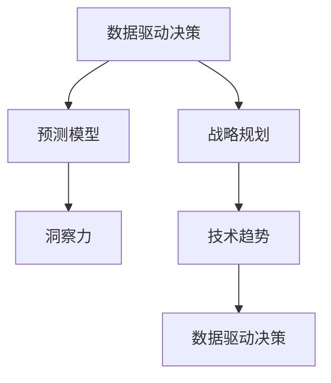

                 

# 洞察力与战略规划：预见未来的能力

> 关键词：未来技术趋势，战略规划，数据驱动决策，预测模型，数据分析

## 1. 背景介绍

### 1.1 问题由来
在21世纪数字化时代，信息流量的爆炸性增长和技术的快速发展给企业带来了前所未有的机遇和挑战。如何利用大数据、人工智能等前沿技术，从海量数据中提取有价值的信息，预见未来的发展趋势，制定有效的战略规划，成为了企业高层决策者和数据分析师关注的焦点。

### 1.2 问题核心关键点
预见未来能力的重要性体现在：

- 在快速变化的市场环境中，企业需要及时调整战略，以应对竞争压力和消费者需求的变化。
- 数据驱动决策要求企业能够高效地从大量数据中提取洞见，支持高层决策。
- 技术创新不断涌现，企业需要及时掌握新技术趋势，以保持竞争力。
- 在商业智能(BI)和机器学习(ML)的推动下，企业能够构建智能化的预测模型，优化运营流程。
- 预见未来能力不仅限于预测未来事件，还包括了解消费者行为、优化供应链管理、提高营销效率等方面。

### 1.3 问题研究意义
通过对未来技术趋势的洞察和战略规划，企业可以：

- 抓住市场机遇，提前布局，赢得竞争优势。
- 优化资源配置，提升运营效率，降低成本。
- 了解消费者需求，提高客户满意度，增强品牌忠诚度。
- 应对技术变革，保持企业动态，持续创新。
- 预测行业发展，制定适应性强的战略，确保可持续发展。

## 2. 核心概念与联系

### 2.1 核心概念概述

为更好地理解预见未来的能力，本节将介绍几个密切相关的核心概念：

- **数据驱动决策**：以数据为基础的决策方式，通过分析历史数据和实时数据，做出客观、科学的决策。
- **预测模型**：利用历史数据和统计学方法，构建模型预测未来趋势或事件的概率分布。
- **战略规划**：企业根据内外环境的变化，制定中长期发展计划，指导未来行动。
- **洞察力**：通过数据分析和可视化，发现数据中隐藏的趋势、关联和异常，为企业决策提供支持。
- **技术趋势**：包括前沿科技的发展方向、应用场景和潜在影响。

这些概念之间的逻辑关系可以通过以下Mermaid流程图来展示：



这个流程图展示了大数据、预测模型、战略规划、洞察力和技术趋势之间的相互作用关系：

1. **数据驱动决策**：基于数据进行决策，是预测模型的输入和基础。
2. **预测模型**：通过数据分析，构建模型预测未来，是洞察力的工具。
3. **战略规划**：基于洞察力和技术趋势，制定中长期计划，指导决策和行动。
4. **洞察力**：从数据中提取洞见，支撑决策和模型构建。
5. **技术趋势**：影响洞察力和模型的构建方向，提供技术支撑。

## 3. 核心算法原理 & 具体操作步骤
### 3.1 算法原理概述

预见未来的能力主要基于以下几个算法原理：

- **数据收集与清洗**：从多个数据源收集数据，并进行去重、清洗和预处理。
- **特征提取与选择**：从原始数据中提取有意义的特征，并进行特征选择，提高模型性能。
- **统计建模与训练**：基于统计学原理构建预测模型，并使用历史数据进行训练。
- **模型评估与优化**：通过交叉验证、误差分析等方法评估模型性能，并优化模型参数。
- **战略制定与调整**：根据模型预测和洞察力，制定企业战略，并根据市场变化进行调整。

### 3.2 算法步骤详解

预见未来能力的实现步骤包括：

1. **数据准备**：收集并清洗数据，确保数据质量。
2. **特征工程**：设计并选择特征，提高模型性能。
3. **模型选择与训练**：选择合适的模型，使用历史数据进行训练。
4. **模型评估与调优**：通过交叉验证和误差分析评估模型性能，并调整模型参数。
5. **洞察力提取**：利用模型预测和数据可视化工具，提取洞察力。
6. **战略规划**：根据洞察力和市场趋势，制定中长期战略。
7. **战略实施与反馈**：执行战略，并根据反馈进行调整。

### 3.3 算法优缺点

数据驱动决策和预测模型的优点包括：

- 能够利用大规模数据，提供客观、科学的决策支持。
- 通过预测模型，可以提前应对市场变化，赢得先机。
- 能够识别数据中的趋势和关联，指导企业运营。

同时，这些方法也存在一些缺点：

- 数据收集和处理成本高，需要专业数据科学家支持。
- 模型构建复杂，需要较高的技术门槛。
- 预测模型存在误差，可能产生误导性决策。
- 战略调整需要灵活性，需要快速响应市场变化。

### 3.4 算法应用领域

预见未来能力在多个领域都有广泛应用，包括：

- **市场营销**：预测消费者行为和市场需求，制定精准营销策略。
- **供应链管理**：预测市场供应和需求，优化库存管理，提高供应链效率。
- **金融分析**：预测市场波动和投资趋势，指导投资决策。
- **人力资源**：预测人才需求和市场趋势，优化招聘和人才管理。
- **产品开发**：预测产品市场需求和技术趋势，指导产品设计和创新。

## 4. 数学模型和公式 & 详细讲解 & 举例说明

### 4.1 数学模型构建

构建预见未来能力的数学模型需要考虑以下几个方面：

- **自回归模型**：用于预测时间序列数据，如ARIMA模型。
- **回归模型**：用于预测数值型目标变量，如线性回归、岭回归等。
- **分类模型**：用于预测分类目标，如逻辑回归、随机森林等。
- **聚类模型**：用于发现数据中的分组，如K-Means、层次聚类等。

### 4.2 公式推导过程

以线性回归模型为例，公式推导如下：

$$
y = \beta_0 + \beta_1x_1 + \beta_2x_2 + \ldots + \beta_nx_n + \epsilon
$$

其中，$y$ 为预测值，$\beta_0$ 为截距，$\beta_1, \beta_2, \ldots, \beta_n$ 为自变量系数，$x_1, x_2, \ldots, x_n$ 为自变量，$\epsilon$ 为误差项。

### 4.3 案例分析与讲解

假设我们有一个电子商务网站，需要预测未来一周的产品销量。可以收集历史销量数据，使用线性回归模型进行训练和预测。具体步骤如下：

1. **数据准备**：收集过去一年的每日销量数据。
2. **特征工程**：选择相关特征，如时间（年、月、日）、季节性因素、促销活动等。
3. **模型选择与训练**：选择线性回归模型，使用历史数据进行训练。
4. **模型评估与调优**：使用交叉验证评估模型性能，调整自变量系数。
5. **洞察力提取**：根据模型预测，提取销量趋势、季节性规律等洞察力。
6. **战略规划**：根据洞察力，制定补货计划、促销策略等。
7. **战略实施与反馈**：执行策略，并根据实际销量进行调整。

## 5. 项目实践：代码实例和详细解释说明
### 5.1 开发环境搭建

在进行预见未来能力的项目实践前，我们需要准备好开发环境。以下是使用Python进行Scikit-learn开发的环境配置流程：

1. 安装Anaconda：从官网下载并安装Anaconda，用于创建独立的Python环境。

2. 创建并激活虚拟环境：
```bash
conda create -n pre-security python=3.8 
conda activate pre-security
```

3. 安装Scikit-learn：
```bash
pip install scikit-learn
```

4. 安装各类工具包：
```bash
pip install numpy pandas matplotlib
```

完成上述步骤后，即可在`pre-security`环境中开始项目实践。

### 5.2 源代码详细实现

下面我们以销售预测为例，给出使用Scikit-learn进行线性回归模型的代码实现。

首先，定义数据处理函数：

```python
import pandas as pd
import numpy as np
from sklearn.model_selection import train_test_split

def preprocess_data(df, target):
    # 数据清洗
    df = df.dropna()
    # 特征工程
    df['day_of_week'] = df['date'].dt.dayofweek
    df['month'] = df['date'].dt.month
    df['year'] = df['date'].dt.year
    # 标准化处理
    features = ['day_of_week', 'month', 'year']
    X = (df[features] - df[features].mean()) / df[features].std()
    y = df[target]
    return X, y
```

然后，定义模型和优化器：

```python
from sklearn.linear_model import LinearRegression

model = LinearRegression()
```

接着，定义训练和评估函数：

```python
from sklearn.metrics import mean_squared_error

def train_model(model, X_train, X_test, y_train, y_test):
    model.fit(X_train, y_train)
    y_pred = model.predict(X_test)
    mse = mean_squared_error(y_test, y_pred)
    return mse

def evaluate_model(model, X_test, y_test):
    y_pred = model.predict(X_test)
    mse = mean_squared_error(y_test, y_pred)
    return mse
```

最后，启动训练流程并在测试集上评估：

```python
X, y = preprocess_data(df, 'sales')
X_train, X_test, y_train, y_test = train_test_split(X, y, test_size=0.2, random_state=42)

mse_train = train_model(model, X_train, X_test, y_train, y_test)
mse_test = evaluate_model(model, X_test, y_test)
print(f'Training MSE: {mse_train:.3f}, Test MSE: {mse_test:.3f}')
```

以上就是使用Scikit-learn进行销售预测的完整代码实现。可以看到，利用Scikit-learn库，我们能够以相对简洁的代码实现线性回归模型的构建和评估。

### 5.3 代码解读与分析

让我们再详细解读一下关键代码的实现细节：

**preprocess_data函数**：
- `__init__`方法：对原始数据进行清洗，生成自变量和目标变量。
- `__getitem__`方法：生成标准化后的特征矩阵。

**train_model函数**：
- 在训练集上拟合线性回归模型，并计算测试集的均方误差。

**evaluate_model函数**：
- 在测试集上评估模型性能，计算均方误差。

**训练流程**：
- 定义总样本数和测试集比例，启动循环迭代
- 在训练集上训练，输出均方误差
- 在测试集上评估，输出均方误差

可以看到，Scikit-learn库使得销售预测的代码实现变得简洁高效。开发者可以将更多精力放在数据处理、模型改进等高层逻辑上，而不必过多关注底层的实现细节。

当然，工业级的系统实现还需考虑更多因素，如模型的保存和部署、超参数的自动搜索、更灵活的任务适配层等。但核心的算法构建基本与此类似。

## 6. 实际应用场景
### 6.1 智能制造

预见未来能力在智能制造中具有重要应用，帮助企业实现生产过程的自动化和智能化。通过分析历史生产数据和设备状态，企业可以预测设备故障、优化生产计划，提高生产效率和产品质量。

具体而言，可以收集历史生产数据、设备状态、工艺参数等数据，构建预测模型，预测设备故障和生产效率。将模型应用到实时监控数据中，能够及时发现异常情况，避免生产线停工，提高生产稳定性。

### 6.2 智慧医疗

预见未来能力在智慧医疗中能够提高医疗诊断的准确性和及时性。通过分析历史病历和患者数据，企业可以预测疾病风险、优化诊疗方案，提高医疗服务的质量和效率。

具体而言，可以收集历史病历、患者数据、基因数据等，构建预测模型，预测疾病风险、诊断结果和疾病发展趋势。将模型应用到实时监测数据中，能够提前发现健康风险，及时干预治疗，提高患者治疗效果。

### 6.3 金融分析

预见未来能力在金融分析中能够预测市场波动和投资趋势，指导投资决策。通过分析历史交易数据和市场数据，企业可以预测市场价格、风险和投资机会。

具体而言，可以收集历史交易数据、市场数据、新闻事件等，构建预测模型，预测市场价格、风险和投资机会。将模型应用到实时市场数据中，能够及时发现投资机会，调整投资组合，优化投资收益。

### 6.4 未来应用展望

随着预见未来能力的不断发展，未来在更多领域得到应用，为传统行业带来变革性影响。

在智慧城市治理中，预见未来能力能够提高城市管理的智能化水平，构建更安全、高效的未来城市。

在教育行业，预见未来能力能够分析学生学习数据，预测学习效果，优化教学方案，提高教育质量。

在智能家居领域，预见未来能力能够预测用户行为，优化家居控制，提升生活便捷性。

此外，在农业、环保、能源等众多领域，预见未来能力也将不断涌现，为各行各业提供决策支持。相信随着技术的日益成熟，预见未来能力必将在构建智慧社会的进程中发挥越来越重要的作用。

## 7. 工具和资源推荐
### 7.1 学习资源推荐

为了帮助开发者系统掌握预见未来的能力，这里推荐一些优质的学习资源：

1. **《数据科学与统计学》课程**：由Coursera开设的统计学和数据科学课程，系统介绍数据处理、统计分析和机器学习的基本概念和方法。
2. **Kaggle平台**：全球最大的数据科学竞赛平台，提供海量数据集和模型竞赛，促进数据科学研究和应用实践。
3. **Python数据科学生态系统**：包含Scikit-learn、Pandas、Matplotlib等库，提供强大的数据处理和可视化功能。
4. **PyTorch和TensorFlow**：主流的深度学习框架，支持复杂的模型构建和训练。
5. **《深度学习》书籍**：Ian Goodfellow所著的经典教材，深入讲解深度学习的基本原理和应用实践。

通过对这些资源的学习实践，相信你一定能够快速掌握预见未来的能力，并用于解决实际的商业问题。
### 7.2 开发工具推荐

高效的开发离不开优秀的工具支持。以下是几款用于预见未来能力开发的常用工具：

1. **Jupyter Notebook**：Python的交互式编程环境，支持代码实时运行和可视化，方便调试和展示结果。
2. **RStudio**：R语言的数据分析和可视化工具，提供强大的统计分析和绘图功能。
3. **Tableau**：商业智能和数据可视化工具，支持复杂的报表设计和数据交互。
4. **Power BI**：微软的商业智能工具，支持大数据分析和可视化，支持企业级部署。
5. **Hadoop和Spark**：大数据处理框架，支持大规模数据处理和分析。

合理利用这些工具，可以显著提升预见未来能力的开发效率，加快创新迭代的步伐。

### 7.3 相关论文推荐

预见未来能力的研究源于学界的持续研究。以下是几篇奠基性的相关论文，推荐阅读：

1. **《统计学习方法》**：李航所著的经典教材，全面介绍了统计学习的基本概念和应用实践。
2. **《机器学习：实战指南》**：Peter Harrington所著的实战指南，详细讲解了机器学习的基本原理和应用案例。
3. **《深度学习》**：Ian Goodfellow所著的经典教材，深入讲解深度学习的基本原理和应用实践。
4. **《Python数据科学手册》**：Jake VanderPlas所著的手册，系统介绍了Python在数据科学中的应用。

这些论文代表了大数据和机器学习技术的发展脉络。通过学习这些前沿成果，可以帮助研究者把握学科前进方向，激发更多的创新灵感。

## 8. 总结：未来发展趋势与挑战
### 8.1 总结

本文对预见未来的能力进行了全面系统的介绍。首先阐述了预见未来能力的研究背景和意义，明确了在快速变化的市场环境中，预见未来能力对企业的重要性。其次，从原理到实践，详细讲解了预见未来能力的算法原理和操作步骤，给出了预见未来能力任务的开发代码实例。同时，本文还广泛探讨了预见未来能力在多个行业领域的应用前景，展示了预见未来能力技术的广阔前景。此外，本文精选了预见未来能力的学习资源，力求为读者提供全方位的技术指引。

通过本文的系统梳理，可以看到，预见未来能力已经成为了企业数据驱动决策的重要工具，极大地提高了企业运营的智能化水平。未来，伴随预见未来能力的不断发展，企业能够更好地应对市场变化，抓住机遇，优化资源配置，提升效率和竞争力。

### 8.2 未来发展趋势

展望未来，预见未来能力将呈现以下几个发展趋势：

1. **数据处理自动化**：利用自动化工具和算法，自动处理和清洗数据，提高数据质量。
2. **模型自适应**：构建自适应模型，根据环境变化动态调整模型参数和结构。
3. **多模态融合**：结合图像、声音、文本等多种数据源，构建多模态预测模型，提高预测准确性。
4. **实时预测**：实现实时数据流处理，支持快速响应市场变化。
5. **联邦学习**：在数据分布不均的情况下，通过联邦学习技术，在本地数据上训练模型，保护数据隐私。
6. **AI与区块链结合**：利用区块链技术，确保数据和模型的透明性和不可篡改性。

以上趋势凸显了预见未来能力的未来发展方向。这些方向的探索发展，必将进一步提升企业的数据驱动决策能力，提高运营效率，增强竞争力。

### 8.3 面临的挑战

尽管预见未来能力已经取得了显著进展，但在迈向更加智能化、普适化应用的过程中，它仍面临诸多挑战：

1. **数据隐私和安全**：在大数据处理中，如何保护用户隐私，防止数据泄露，是一个重要问题。
2. **数据质量**：高质量的数据是预见未来能力的前提，但数据采集和清洗的成本高，且数据质量难以保证。
3. **模型复杂性**：构建复杂模型，需要较高的技术门槛，且模型解释性不足。
4. **模型鲁棒性**：模型在面对新数据和异常情况时，鲁棒性不足，容易出现误判。
5. **资源消耗**：构建和训练复杂的模型，需要大量计算资源，可能超出企业预算。
6. **数据处理延迟**：在实时场景下，数据处理和模型预测需要快速响应，对处理速度要求高。

解决这些挑战，需要从数据治理、模型优化、资源管理、安全保障等多个维度进行综合考虑。

### 8.4 研究展望

预见未来能力的研究方向包括：

1. **多模态数据融合**：结合图像、声音、文本等多种数据源，提高预测模型的准确性。
2. **自适应学习**：利用自适应算法，根据环境变化动态调整模型参数，增强模型的鲁棒性。
3. **联邦学习**：在数据分布不均的情况下，通过联邦学习技术，保护数据隐私，提高模型泛化能力。
4. **模型解释性**：开发可解释性模型，提高模型的透明度和可信度。
5. **数据隐私保护**：利用区块链和分布式技术，确保数据和模型的隐私和安全。
6. **实时预测**：实现实时数据流处理，支持快速响应市场变化。

这些研究方向的探索，将为预见未来能力带来新的突破，推动其在更多领域的应用和落地。

## 9. 附录：常见问题与解答

**Q1：预见未来能力是否适用于所有企业？**

A: 预见未来能力在大部分企业中都能发挥作用，特别是对于数据量较大、业务流程复杂的中大型企业。但对于小微企业，由于数据资源有限，需要权衡成本和收益。

**Q2：构建预见未来能力需要哪些资源？**

A: 构建预见未来能力需要以下资源：
- 高质量的数据源
- 高性能的计算资源（如GPU、TPU）
- 专业的数据科学家和算法工程师
- 先进的数据处理和可视化工具

**Q3：预见未来能力在落地应用时需要注意哪些问题？**

A: 预见未来能力在落地应用时需要注意以下问题：
- 数据隐私和安全：确保数据处理和存储的安全性。
- 数据质量：确保数据准确、完整，避免模型误判。
- 模型鲁棒性：确保模型在面对新数据和异常情况时，鲁棒性强。
- 资源消耗：合理规划计算资源，避免资源浪费。
- 数据处理延迟：确保数据处理和模型预测能够快速响应。

**Q4：预见未来能力如何结合业务需求进行优化？**

A: 预见未来能力结合业务需求进行优化的具体步骤如下：
- 明确业务需求：了解企业的战略目标和运营痛点。
- 数据收集与处理：收集相关数据，并进行清洗和处理。
- 特征工程：选择相关特征，构建预测模型。
- 模型评估与优化：评估模型性能，优化模型参数。
- 洞察力提取：利用模型预测和数据可视化工具，提取洞见。
- 战略规划与调整：根据洞察力和市场趋势，制定战略并根据反馈进行调整。

只有将预见未来能力与企业业务紧密结合，才能真正发挥其价值，提升企业的运营效率和竞争力。

---

作者：禅与计算机程序设计艺术 / Zen and the Art of Computer Programming

