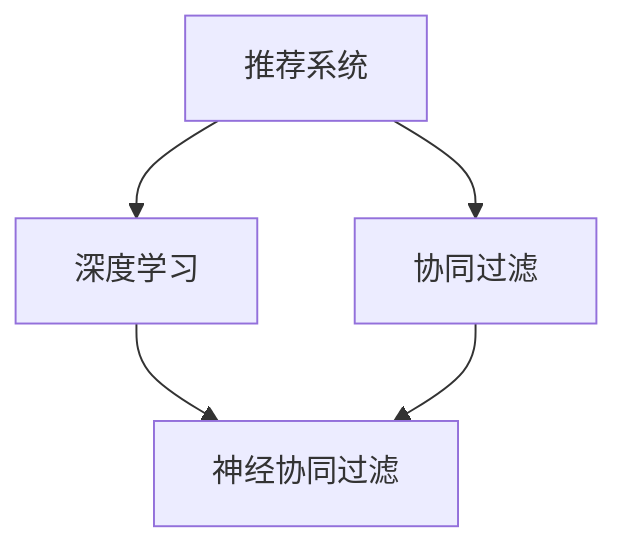

                 

# 深度学习在个性化推荐中的应用

> 关键词：深度学习,个性化推荐,协同过滤,推荐系统,深度神经网络,神经协同过滤,召回率,精准度,用户行为数据分析

## 1. 背景介绍

在数字化时代的浪潮中，个性化推荐技术已成为推动电商、视频、音乐、新闻等互联网平台用户体验提升的重要手段。个性化推荐系统通过分析用户历史行为数据，挖掘用户兴趣偏好，为用户提供精准的内容推荐，从而提升用户粘性和平台价值。随着数据量的激增和算法模型的不断进步，推荐系统已从简单的协同过滤，发展到结合深度学习的智能推荐系统，取得了显著的提升。

本文章将深入探讨深度学习在个性化推荐系统中的应用。首先，我们概述了推荐系统的基本原理，并介绍了深度学习如何改写传统协同过滤算法，带来了推荐算法的新范式。接着，我们将通过数学模型推导和实际案例展示深度神经网络在推荐系统中的应用。最后，我们分析了深度学习推荐系统面临的挑战和未来发展趋势，期待通过这一技术创新为各行各业带来更为智能化的服务体验。

## 2. 核心概念与联系

### 2.1 核心概念概述

为了理解深度学习在推荐系统中的应用，我们先简要介绍以下几个核心概念：

- **推荐系统(Recommendation System)**：通过分析用户的历史行为和偏好，为用户推荐感兴趣的内容。推荐系统分为基于内容的推荐和基于协同过滤的推荐两大类。
- **协同过滤(Collaborative Filtering)**：基于用户行为或物品评分数据，预测用户对物品的偏好。协同过滤分为基于用户的协同过滤和基于物品的协同过滤。
- **深度学习(Deep Learning)**：一种基于神经网络的学习方法，可以自动学习数据的层次特征表示，实现更加复杂的任务。
- **深度神经网络(Deep Neural Network, DNN)**：一种多层次的神经网络结构，包含多个隐藏层，适用于处理复杂的数据结构。
- **神经协同过滤(Neural Collaborative Filtering, NCF)**：结合深度神经网络的协同过滤算法，可以更好地处理大规模稀疏矩阵，并捕捉更加复杂的用户和物品特征。

这些概念之间的关系可以通过以下Mermaid流程图来展示：



这个流程图展示了一个典型的推荐系统构建流程：从基础的协同过滤算法，到结合深度学习的神经协同过滤算法。

## 3. 核心算法原理 & 具体操作步骤
### 3.1 算法原理概述

深度学习在推荐系统中的应用，主要是通过深度神经网络来学习用户和物品的复杂特征表示。与传统的协同过滤算法不同，深度学习可以自动从用户行为数据中挖掘出隐含的层次化特征，从而更好地预测用户的兴趣。

### 3.2 算法步骤详解

深度学习推荐系统的构建过程主要分为以下几步：

1. **数据准备**：收集用户的历史行为数据，如浏览、点击、评分等，将其转化为矩阵形式。
2. **模型选择**：选择合适的深度神经网络结构，如全连接网络、卷积神经网络(CNN)、循环神经网络(RNN)等。
3. **模型训练**：使用用户行为数据对深度神经网络进行训练，学习用户和物品的特征表示。
4. **推荐生成**：在测试集上，将用户输入到训练好的神经网络中，生成物品的评分向量，再使用召回和排序算法为用户推荐物品。

### 3.3 算法优缺点

深度学习推荐系统相比传统协同过滤算法，具有以下优点：

1. 自动特征提取：深度神经网络能够自动学习数据的层次化特征表示，无需手动设计特征工程。
2. 处理稀疏矩阵：深度神经网络能够有效处理大规模稀疏矩阵，而传统的矩阵分解方法易受矩阵维度影响。
3. 泛化能力强：深度神经网络具有较强的泛化能力，可以适应不同类型的数据和任务。

但深度学习推荐系统也存在以下缺点：

1. 计算量大：深度神经网络的参数量较大，训练和推理所需计算资源较多。
2. 可解释性差：深度神经网络的复杂结构难以解释其内部工作机制。
3. 过拟合风险：深度神经网络容易过拟合，特别是在训练数据不足时。

### 3.4 算法应用领域

深度学习推荐系统在多个领域均有广泛应用：

1. **电商推荐**：如京东、淘宝等电商平台，通过推荐个性化商品，提高用户购买转化率。
2. **视频推荐**：如Netflix、YouTube等视频平台，推荐用户可能感兴趣的视频内容。
3. **音乐推荐**：如Spotify、网易云音乐等音乐平台，推荐用户可能喜欢的歌曲。
4. **新闻推荐**：如今日头条、新浪新闻等新闻聚合平台，推荐用户感兴趣的新闻文章。
5. **社交推荐**：如微信、微博等社交网络，推荐用户可能感兴趣的朋友、话题等。

深度学习推荐系统通过高效挖掘用户行为数据，为用户提供个性化、多样化的内容推荐，极大地提升了用户体验和平台收益。

## 4. 数学模型和公式 & 详细讲解
### 4.1 数学模型构建

在深度学习推荐系统中，常见的数学模型包括：

- **矩阵分解模型**：将用户-物品评分矩阵分解为两个低秩矩阵的乘积，每个矩阵代表用户或物品的特征向量。
- **协同过滤模型**：通过用户-物品评分矩阵，学习用户和物品的特征表示。
- **深度神经网络模型**：使用多层神经网络，学习用户和物品的层次化特征表示。

我们以深度神经网络模型为例，进行详细讲解。假设用户-物品评分矩阵为 $X \in \mathbb{R}^{N \times M}$，其中 $N$ 为物品数量，$M$ 为用户数量，$x_{ij}$ 表示用户 $i$ 对物品 $j$ 的评分。我们将矩阵 $X$ 输入到深度神经网络中，得到用户 $i$ 的隐含特征表示 $\textbf{h}_i \in \mathbb{R}^d$ 和物品 $j$ 的隐含特征表示 $\textbf{h}_j \in \mathbb{R}^d$。其中 $d$ 为特征维度。

### 4.2 公式推导过程

设 $W_{ui}$ 和 $W_{vi}$ 为用户 $i$ 和物品 $j$ 的权重矩阵，$b_{ui}$ 和 $b_{vi}$ 为用户 $i$ 和物品 $j$ 的偏置向量，则深度神经网络的结构如下：

$$
\textbf{h}_i = \sigma(\textbf{W}_{ui} \textbf{x}_i + \textbf{b}_{ui})
$$

$$
\textbf{h}_j = \sigma(\textbf{W}_{vi} \textbf{x}_j + \textbf{b}_{vi})
$$

其中 $\sigma$ 为激活函数，通常采用ReLU函数。

用户 $i$ 对物品 $j$ 的预测评分 $y_{ij}$ 可以表示为：

$$
y_{ij} = \textbf{h}_i^T \textbf{h}_j + b
$$

其中 $b$ 为线性项的偏置。

通过上述模型，深度神经网络可以自动学习用户和物品的特征表示，从而生成更加准确的评分预测。

### 4.3 案例分析与讲解

以Netflix为例，Netflix的推荐系统采用了深度学习模型，通过分析用户历史观看行为，为用户推荐可能感兴趣的电影和电视剧。具体实现步骤如下：

1. **数据准备**：收集用户的历史观看数据，包括观看的电影/电视剧名称、观看时长、评分等信息，将其转化为矩阵形式。
2. **模型选择**：选择多层感知器(MLP)作为基础网络结构，并采用深度学习优化器对网络进行训练。
3. **模型训练**：使用用户观看数据对模型进行训练，学习用户和物品的特征表示。
4. **推荐生成**：在测试集上，将用户输入到训练好的神经网络中，生成物品的评分向量，再使用召回和排序算法为用户推荐电影/电视剧。

Netflix的深度学习推荐系统大幅提升了推荐精准度，极大地提高了用户观看体验和平台用户留存率。

## 5. 项目实践：代码实例和详细解释说明
### 5.1 开发环境搭建

在搭建深度学习推荐系统的开发环境时，需要考虑以下几个方面：

1. **Python环境**：安装Python 3.6或更高版本，并配置好虚拟环境。
2. **深度学习框架**：安装TensorFlow、PyTorch等深度学习框架。
3. **数据处理工具**：安装Pandas、NumPy等数据处理库。
4. **可视化工具**：安装Matplotlib、Seaborn等可视化库。

以TensorFlow为例，基本配置步骤如下：

```bash
pip install tensorflow
```

### 5.2 源代码详细实现

以下是一个简单的深度神经网络模型代码实现，用于推荐系统中的用户-物品评分预测：

```python
import tensorflow as tf
import numpy as np

# 定义神经网络结构
class DNN(tf.keras.Model):
    def __init__(self, input_dim, hidden_dim):
        super(DNN, self).__init__()
        self.fc1 = tf.keras.layers.Dense(hidden_dim, activation='relu')
        self.fc2 = tf.keras.layers.Dense(hidden_dim, activation='relu')
        self.fc3 = tf.keras.layers.Dense(1)

    def call(self, x):
        x = self.fc1(x)
        x = self.fc2(x)
        return self.fc3(x)

# 定义数据集
X_train = np.random.rand(1000, 10)
y_train = np.random.rand(1000, 1)

# 定义模型并编译
model = DNN(input_dim=10, hidden_dim=32)
model.compile(optimizer='adam', loss='mse')

# 训练模型
model.fit(X_train, y_train, epochs=10, batch_size=32)

# 测试模型
X_test = np.random.rand(100, 10)
y_pred = model.predict(X_test)
```

### 5.3 代码解读与分析

**DNN类**：定义了一个简单的深度神经网络，包含两个隐藏层和一个输出层。

**X_train和y_train**：定义了一个随机的训练数据集，包括10个特征和1个标签。

**model.compile**：配置模型使用的优化器和损失函数。

**model.fit**：训练模型，并指定训练轮数和批次大小。

**model.predict**：使用训练好的模型对测试集进行预测。

通过上述代码，我们可以看到深度神经网络模型在推荐系统中的应用实现。

### 5.4 运行结果展示

在训练和测试模型后，可以可视化模型的训练过程和预测结果，以评估模型的效果。

```python
import matplotlib.pyplot as plt

# 可视化训练过程
plt.plot(history.history['loss'])
plt.title('Model Loss')
plt.ylabel('Loss')
plt.xlabel('Epoch')
plt.show()

# 可视化预测结果
plt.scatter(X_test[:, 0], y_pred)
plt.plot(X_test[:, 0], y_test, 'r')
plt.title('Prediction vs. Actual')
plt.show()
```

通过可视化工具，可以观察到模型在训练过程中的损失变化，以及预测结果与实际标签的对比情况。

## 6. 实际应用场景
### 6.1 电商推荐

电商推荐系统通过分析用户的浏览、点击、购买等行为数据，为用户推荐可能感兴趣的商品。深度学习推荐系统在此场景下表现尤为突出，通过自动学习用户和商品的特征表示，能够生成更为精准的推荐结果。

以淘宝为例，淘宝的推荐系统通过深度学习模型，实时分析用户行为数据，预测用户可能感兴趣的商品，显著提升了用户购买转化率和平台销售额。

### 6.2 视频推荐

视频推荐系统通过分析用户的观看历史和评分数据，为用户推荐可能感兴趣的视频内容。深度学习推荐系统在此场景下表现尤为突出，通过自动学习用户和视频的特征表示，能够生成更为精准的推荐结果。

以Netflix为例，Netflix的推荐系统通过深度学习模型，分析用户历史观看数据，预测用户可能感兴趣的电影和电视剧，极大地提升了用户观看体验和平台用户留存率。

### 6.3 新闻推荐

新闻推荐系统通过分析用户的阅读历史和评分数据，为用户推荐可能感兴趣的新闻文章。深度学习推荐系统在此场景下表现尤为突出，通过自动学习用户和新闻文章的特征表示，能够生成更为精准的推荐结果。

以今日头条为例，今日头条的推荐系统通过深度学习模型，实时分析用户阅读历史数据，预测用户可能感兴趣的新闻文章，极大地提升了用户阅读体验和平台用户留存率。

### 6.4 未来应用展望

随着深度学习技术的不断发展，深度学习推荐系统将在更多领域得到应用，为各行各业带来变革性影响。

1. **智慧医疗**：通过深度学习推荐系统，医生可以实时推荐给患者适合的医疗方案，提升医疗服务的精准度和效率。
2. **教育培训**：通过深度学习推荐系统，教育平台可以实时推荐适合学生的课程内容，提升学习效果和教育质量。
3. **智能家居**：通过深度学习推荐系统，智能家居设备可以实时推荐用户可能感兴趣的功能，提升用户的生活质量。
4. **金融投资**：通过深度学习推荐系统，金融平台可以实时推荐给投资者适合的投资方案，提升投资收益。
5. **智能交通**：通过深度学习推荐系统，智能交通系统可以实时推荐给用户最优的出行路线，提升交通效率。

未来，深度学习推荐系统将深度融合到各个行业，为各行各业带来更智能、更高效的服务体验。

## 7. 工具和资源推荐
### 7.1 学习资源推荐

为了帮助开发者系统掌握深度学习推荐系统的理论基础和实践技巧，这里推荐一些优质的学习资源：

1. 《深度学习基础》课程：由Coursera提供的深度学习入门课程，涵盖深度神经网络、损失函数、优化算法等基础概念。
2. 《推荐系统实战》书籍：详细介绍推荐系统的各种算法和实现细节，并结合实际案例展示推荐系统的应用。
3. 《深度学习推荐系统》课程：斯坦福大学提供的推荐系统课程，涵盖协同过滤、深度学习推荐系统等前沿内容。
4. TensorFlow官方文档：详细介绍了TensorFlow的深度学习框架和推荐系统模型。
5. Kaggle竞赛：参加Kaggle推荐系统竞赛，积累实际项目经验，提高推荐系统建模能力。

通过对这些资源的学习实践，相信你一定能够快速掌握深度学习推荐系统的精髓，并用于解决实际的推荐问题。

### 7.2 开发工具推荐

高效的开发离不开优秀的工具支持。以下是几款用于深度学习推荐系统开发的常用工具：

1. TensorFlow：由Google主导开发的深度学习框架，生产部署方便，适合大规模工程应用。
2. PyTorch：基于Python的开源深度学习框架，灵活动态的计算图，适合快速迭代研究。
3. Keras：基于TensorFlow和Theano的高级神经网络API，易于使用，适合初学者。
4. Hadoop/Spark：大数据处理框架，适合大规模数据集的协同过滤模型训练。
5. Jupyter Notebook：交互式编程环境，方便调试和展示深度学习模型。

合理利用这些工具，可以显著提升深度学习推荐系统的开发效率，加快创新迭代的步伐。

### 7.3 相关论文推荐

深度学习推荐系统的发展源于学界的持续研究。以下是几篇奠基性的相关论文，推荐阅读：

1. **Deep Collaborative Filtering Using Neural Networks**：引入深度神经网络对协同过滤算法进行改进，大幅提升推荐系统的精准度。
2. **Neural Factorization Machines for Personalized Recommendation**：提出神经因子机模型，利用深度学习自动提取用户和物品的隐含特征。
3. **Collaborative Filtering Model with Long Short-Term Memory Neural Networks**：结合LSTM神经网络，处理时间序列数据，提升推荐系统的时序预测能力。
4. **Recurrent Deep Neural Networks with Label Smoothing for Multi-Aspect Recommendation**：结合RNN和标签平滑技术，提升推荐系统的多方面预测能力。
5. **Multi-View Tensor Factorization Networks for Recommender Systems**：提出多视图张量分解网络，处理多模态数据，提升推荐系统的综合推荐能力。

这些论文代表了大深度学习推荐系统的发展脉络。通过学习这些前沿成果，可以帮助研究者把握学科前进方向，激发更多的创新灵感。

## 8. 总结：未来发展趋势与挑战
### 8.1 总结

本文对深度学习在个性化推荐系统中的应用进行了全面系统的介绍。首先概述了推荐系统的基本原理，并介绍了深度学习如何改写传统协同过滤算法，带来了推荐算法的新范式。接着，通过数学模型推导和实际案例展示了深度神经网络在推荐系统中的应用。最后，分析了深度学习推荐系统面临的挑战和未来发展趋势，期待通过这一技术创新为各行各业带来更为智能化的服务体验。

通过本文的系统梳理，可以看到，深度学习推荐系统正在成为推荐系统的主流范式，极大地提升了推荐算法的精度和效率。未来，伴随深度学习技术的持续进步，推荐系统将深度融合到各个行业，为各行各业带来更为智能、高效的服务体验。

### 8.2 未来发展趋势

展望未来，深度学习推荐系统将呈现以下几个发展趋势：

1. **多模态融合**：未来推荐系统将不再局限于文本数据，而是结合图像、音频等多模态数据，提升推荐效果。
2. **跨领域推荐**：推荐系统将不再局限于某一领域，而是跨领域联合推荐，提升推荐内容的丰富性和多样性。
3. **个性化推荐**：推荐系统将结合用户多方面的信息，如地理位置、时间、情感等，提供更为个性化的推荐结果。
4. **实时推荐**：推荐系统将实现实时推荐，提升用户体验和平台收益。
5. **联邦推荐**：推荐系统将通过联邦学习，保护用户隐私，提升推荐系统的效果和可信度。

这些趋势凸显了深度学习推荐系统的广阔前景，将为各行各业带来更为智能化的服务体验。

### 8.3 面临的挑战

尽管深度学习推荐系统已经取得了显著成就，但在迈向更加智能化、普适化应用的过程中，它仍面临诸多挑战：

1. **数据质量问题**：推荐系统依赖高质量的训练数据，但实际数据往往存在噪声和缺失。如何处理这些问题，提升数据质量，仍是一大挑战。
2. **模型复杂度问题**：深度学习推荐系统的模型复杂度较高，计算资源需求较大。如何在保证模型效果的同时，降低计算成本，仍是技术难点。
3. **模型可解释性问题**：深度学习推荐系统的内部结构复杂，难以解释其决策过程。如何在保证模型效果的同时，提升模型的可解释性，仍是技术难点。
4. **用户隐私问题**：推荐系统依赖大量用户行为数据，如何保护用户隐私，避免数据滥用，仍是伦理挑战。
5. **公平性问题**：推荐系统容易产生偏见，如何设计公平的推荐算法，避免歧视性输出，仍是重要研究方向。

### 8.4 研究展望

面对深度学习推荐系统所面临的挑战，未来的研究需要在以下几个方面寻求新的突破：

1. **数据增强技术**：引入数据增强技术，处理数据噪声和缺失，提升数据质量。
2. **模型压缩技术**：引入模型压缩技术，降低模型复杂度，提升计算效率。
3. **模型解释性技术**：引入可解释性技术，提升模型的可解释性，增强用户信任。
4. **联邦学习技术**：引入联邦学习技术，保护用户隐私，提升推荐系统的效果和可信度。
5. **公平性优化技术**：引入公平性优化技术，设计公平的推荐算法，避免歧视性输出。

这些研究方向的探索，将引领深度学习推荐系统迈向更高的台阶，为各行各业带来更为智能、公平、可解释的推荐系统。

## 9. 附录：常见问题与解答

**Q1：深度学习推荐系统是否适用于所有推荐场景？**

A: 深度学习推荐系统在大多数推荐场景下均表现优异，但也有一些场景不适用。例如，对于推荐顺序数据的任务，如新闻推荐、视频推荐等，深度学习推荐系统表现较好；而对于推荐离散型数据的任务，如商品推荐、广告推荐等，传统协同过滤算法可能更为适用。

**Q2：深度学习推荐系统如何处理用户冷启动问题？**

A: 用户冷启动问题是指新用户没有足够的历史行为数据，推荐系统难以对其进行个性化推荐。深度学习推荐系统可以通过引入标签平滑技术、多模态数据融合等方法，提升推荐系统的冷启动能力。

**Q3：深度学习推荐系统在训练和推理过程中如何处理大规模数据？**

A: 深度学习推荐系统需要处理大规模稀疏矩阵，可以使用分布式计算框架，如Hadoop、Spark等，进行并行处理。同时，可以通过模型压缩技术，降低模型参数量，提升计算效率。

**Q4：深度学习推荐系统的可解释性如何提升？**

A: 深度学习推荐系统的可解释性可以通过引入可解释性技术，如特征重要性分析、局部解释方法等，提升模型的可解释性。同时，可以通过设计更简洁的模型结构，降低模型复杂度，提升可解释性。

**Q5：如何设计公平的推荐算法？**

A: 设计公平的推荐算法需要引入公平性优化技术，如双正则化、公平惩罚函数等，避免推荐系统产生偏见。同时，可以通过设计合理的评价指标，如等效获得量(Equal Gain)、召回率等，评估推荐系统的公平性。

通过本文的系统梳理，可以看到，深度学习推荐系统正在成为推荐系统的主流范式，极大地提升了推荐算法的精度和效率。未来，伴随深度学习技术的持续进步，推荐系统将深度融合到各个行业，为各行各业带来更为智能、高效的服务体验。通过不断优化推荐算法、提升数据质量、保护用户隐私，深度学习推荐系统将在各个领域发挥更大的作用，为人类带来更美好的生活体验。

