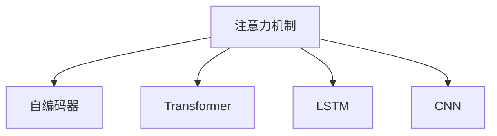

                 

# 深度学习在注意力预测中的应用

> 关键词：注意力机制,深度学习,神经网络,预测模型,应用实例

## 1. 背景介绍

### 1.1 问题由来

深度学习技术自诞生以来，在各个领域取得了显著的成果。特别是在图像识别、语音处理、自然语言处理等方向，深度学习模型已经超越了传统的统计学习方法，成为了这些领域的主流技术。然而，深度学习的核心优势之一是强大的建模能力，能够捕捉数据中复杂且非线性的关系，这一特性使得其在高维、多模态、长序列等复杂问题的解决上具有不可替代性。然而，这些优势的发挥需要足够的计算资源和时间，对于计算资源有限的场景，传统的神经网络训练可能存在困难。

因此，在深度学习的框架下，如何降低模型训练的计算成本、提高模型的预测效率，同时保持高性能，成为了一个重要的研究方向。在众多技术手段中，注意力机制（Attention Mechanism）因其独特的优势，被广泛应用于深度学习模型中，特别是在处理序列数据时，能够显著提升模型的预测效果。本文将重点介绍注意力机制在深度学习中的应用，并结合实际应用场景进行详细阐述。

### 1.2 问题核心关键点

注意力机制在深度学习中的应用具有以下几个核心关键点：

- **自适应性**：注意力机制能够根据输入序列的不同位置，动态调整对各个位置的关注程度，使得模型能够灵活适应不同的输入数据。

- **可解释性**：注意力机制通过显式地记录每个输入位置的重要性，提高了模型的可解释性，使得模型在决策过程中更具透明性。

- **特征聚合**：注意力机制能够将输入序列中的重要特征进行加权聚合，提高了模型对输入数据的理解能力。

- **计算效率**：与传统的全连接层相比，注意力机制通过计算注意力权重，减少了模型参数量，提高了计算效率。

- **序列建模**：在序列数据处理中，注意力机制能够自动学习序列数据中各个位置之间的依赖关系，提高了模型的建模能力。

这些关键点使得注意力机制成为了深度学习中不可或缺的组成部分，被广泛应用于各种模型中，如Transformer、LSTM、CNN等。

### 1.3 问题研究意义

研究注意力机制在深度学习中的应用，对于深度学习模型的优化、复杂问题的解决以及实际应用场景的落地具有重要意义：

1. **模型优化**：注意力机制通过动态调整输入序列的权重，提高了模型的自适应性和泛化能力，从而提升了模型的性能。

2. **问题解决**：注意力机制能够自动学习序列数据中各个位置之间的依赖关系，使得模型在处理长序列、多模态数据等复杂问题时更加高效。

3. **实际应用**：注意力机制在自然语言处理、图像识别、语音识别等实际应用场景中，通过提高模型的预测精度和计算效率，推动了这些领域的技术进步。

## 2. 核心概念与联系

### 2.1 核心概念概述

为更好地理解注意力机制在深度学习中的应用，本节将介绍几个密切相关的核心概念：

- **注意力机制（Attention Mechanism）**：一种用于处理序列数据的深度学习技术，通过计算输入序列中各个位置的重要性，动态调整权重，从而实现特征的加权聚合。

- **自编码器（Autoencoder）**：一种无监督学习技术，通过重构输入数据，学习输入数据的低维表示。自编码器在注意力机制中的应用主要体现在将输入序列编码成固定长度的向量表示，从而提高注意力计算的效率。

- **Transformer**：一种基于注意力机制的神经网络架构，广泛用于自然语言处理任务，如机器翻译、文本生成等。Transformer通过多头自注意力机制，提升了模型的建模能力。

- **LSTM**：一种长短期记忆网络，用于处理序列数据，通过记忆单元和门控结构，能够有效地处理长序列数据。

- **CNN**：一种卷积神经网络，用于处理图像和文本等数据，通过卷积核提取局部特征，提高模型的计算效率。

这些核心概念之间的逻辑关系可以通过以下Mermaid流程图来展示：



这个流程图展示了一些与注意力机制紧密相关的核心概念及其之间的关系：

- 注意力机制通过自编码器将输入序列编码为固定长度的向量，从而提高了注意力计算的效率。
- 自编码器是注意力机制的预处理步骤，通过重构输入数据，学习输入数据的低维表示。
- 注意力机制在Transformer中被广泛应用，提升了模型的建模能力。
- 注意力机制与LSTM和CNN等模型结合，处理序列数据和图像数据，提升了模型的计算效率和预测效果。

这些概念共同构成了深度学习中处理序列数据的核心框架，使得注意力机制能够被广泛应用于各种模型中。

## 3. 核心算法原理 & 具体操作步骤
### 3.1 算法原理概述

注意力机制的核心思想是通过计算输入序列中各个位置的重要性，动态调整权重，从而实现特征的加权聚合。具体来说，注意力机制通过计算输入序列中各个位置与查询位置的相似度，得到每个位置的重要性权重，然后将这些权重与输入序列中各个位置的特征进行加权聚合，得到最终的输出表示。

形式化地，设输入序列为 $X=\{x_1, x_2, ..., x_n\}$，查询向量为 $q$，则注意力机制的计算过程可以表示为：

$$
a_i = \frac{\exp(e_{i}^{T}q)}{\sum_{j=1}^{n} \exp(e_{j}^{T}q)}
$$

$$
o = \sum_{i=1}^{n} a_i x_i
$$

其中，$a_i$ 表示输入序列中第 $i$ 个位置的重要性权重，$e_i$ 表示输入序列中第 $i$ 个位置的编码向量，$q$ 表示查询向量，$o$ 表示最终的输出表示。

### 3.2 算法步骤详解

注意力机制的计算过程主要包括以下几个关键步骤：

**Step 1: 编码输入序列**

- 将输入序列 $X$ 中的每个位置 $x_i$ 编码为一个向量 $e_i$，通常使用LSTM、GRU、CNN等编码器模型。
- 对编码得到的向量 $e_i$ 进行线性变换和激活函数，得到加权权重 $a_i$。

**Step 2: 计算注意力权重**

- 计算查询向量 $q$ 与输入序列中每个位置的编码向量 $e_i$ 的点积，得到 $e_{i}^{T}q$。
- 对 $e_{i}^{T}q$ 进行softmax操作，得到每个位置的重要性权重 $a_i$。

**Step 3: 加权聚合特征**

- 将输入序列中每个位置的特征 $x_i$ 与对应位置的权重 $a_i$ 进行加权聚合，得到最终的输出表示 $o$。

**Step 4: 输出预测结果**

- 将得到的输出表示 $o$ 输入到分类器或回归器等模型，得到最终的预测结果。

### 3.3 算法优缺点

注意力机制在深度学习中具有以下优点：

- **自适应性强**：通过动态调整输入序列中各个位置的重要性权重，使得模型能够灵活适应不同的输入数据。

- **计算效率高**：与传统的全连接层相比，注意力机制通过计算注意力权重，减少了模型参数量，提高了计算效率。

- **特征聚合能力强**：通过加权聚合输入序列中的重要特征，提高了模型对输入数据的理解能力。

- **可解释性强**：通过显式地记录每个输入位置的重要性，提高了模型的可解释性，使得模型在决策过程中更具透明性。

同时，注意力机制也存在一些局限性：

- **计算复杂度高**：虽然计算效率高于全连接层，但在某些情况下，注意力机制的计算复杂度仍然较高，特别是在长序列数据上。

- **训练不稳定**：注意力机制中使用的softmax操作可能带来数值稳定性问题，导致训练过程不稳定。

- **参数量多**：在多模态数据处理中，注意力机制需要额外的参数来计算权重，可能增加模型的参数量。

尽管存在这些局限性，但就目前而言，注意力机制仍然是在深度学习中应用最为广泛的机制之一。未来相关研究的方向主要在于如何进一步提高注意力机制的计算效率和训练稳定性，减少参数量，同时增强其处理多模态数据的能力。

### 3.4 算法应用领域

注意力机制在深度学习中得到了广泛的应用，涉及多个领域，具体包括：

- **自然语言处理**：如机器翻译、文本生成、文本分类等任务，通过注意力机制能够更好地处理长序列数据，提升模型的建模能力。

- **计算机视觉**：如图像描述、图像分类、目标检测等任务，通过注意力机制能够自动学习图像中不同位置之间的依赖关系，提升模型的预测效果。

- **语音识别**：如自动语音识别、语音生成等任务，通过注意力机制能够处理变长序列数据，提升模型的预测精度。

- **推荐系统**：如协同过滤、内容推荐等任务，通过注意力机制能够根据用户行为对商品或内容进行加权，提升推荐效果。

- **时间序列分析**：如股票预测、天气预测等任务，通过注意力机制能够处理长序列数据，提升模型的预测能力。

除了以上应用领域，注意力机制还在其他深度学习任务中得到了广泛应用，推动了深度学习技术的不断发展。

## 4. 数学模型和公式 & 详细讲解
### 4.1 数学模型构建

本节将使用数学语言对注意力机制的计算过程进行更加严格的刻画。

设输入序列 $X=\{x_1, x_2, ..., x_n\}$，查询向量 $q$，编码器得到的编码向量序列为 $e_1, e_2, ..., e_n$，则注意力机制的计算过程可以表示为：

$$
a_i = \frac{\exp(e_{i}^{T}q)}{\sum_{j=1}^{n} \exp(e_{j}^{T}q)}
$$

$$
o = \sum_{i=1}^{n} a_i x_i
$$

其中，$a_i$ 表示输入序列中第 $i$ 个位置的重要性权重，$e_i$ 表示输入序列中第 $i$ 个位置的编码向量，$q$ 表示查询向量，$o$ 表示最终的输出表示。

### 4.2 公式推导过程

以下是注意力机制的公式推导过程：

- **查询表示**：将查询向量 $q$ 进行线性变换和激活函数操作，得到查询表示 $q'$。
- **编码向量表示**：将输入序列 $X$ 中的每个位置 $x_i$ 编码为一个向量 $e_i$，通常使用LSTM、GRU、CNN等编码器模型。
- **加权权重计算**：计算查询向量 $q'$ 与输入序列中每个位置的编码向量 $e_i$ 的点积，得到 $e_{i}^{T}q'$。
- **softmax操作**：对 $e_{i}^{T}q'$ 进行softmax操作，得到每个位置的重要性权重 $a_i$。
- **加权聚合特征**：将输入序列中每个位置的特征 $x_i$ 与对应位置的权重 $a_i$ 进行加权聚合，得到最终的输出表示 $o$。

通过上述过程，注意力机制能够动态调整输入序列中各个位置的重要性权重，实现特征的加权聚合。

### 4.3 案例分析与讲解

下面以自然语言处理中的机器翻译任务为例，介绍注意力机制的实际应用。

在机器翻译任务中，输入是一段源语言文本，输出是对应的目标语言翻译。使用注意力机制的Transformer模型，其核心思想是先对源语言文本进行编码，然后根据每个位置的重要性权重，动态调整目标语言文本的解码器的输入，从而得到更准确的翻译结果。

具体来说，设源语言文本为 $x_1, x_2, ..., x_n$，目标语言文本为 $y_1, y_2, ..., y_m$，则注意力机制的计算过程可以表示为：

- **编码器**：对源语言文本进行编码，得到编码向量序列 $e_1, e_2, ..., e_n$。
- **解码器**：对目标语言文本进行解码，得到解码器输出 $y_1, y_2, ..., y_m$。
- **注意力计算**：计算源语言文本中每个位置的编码向量 $e_i$ 与目标语言文本中每个位置 $y_j$ 的重要性权重 $a_{ij}$。
- **加权聚合特征**：将目标语言文本中每个位置的特征 $y_j$ 与对应位置的权重 $a_{ij}$ 进行加权聚合，得到解码器输出的上下文向量 $c_j$。
- **输出预测**：将上下文向量 $c_j$ 输入到解码器，得到最终的翻译结果 $y_j$。

通过上述过程，注意力机制能够在机器翻译任务中动态调整源语言文本中的重要信息，提升翻译结果的准确性和流畅性。

## 5. 项目实践：代码实例和详细解释说明
### 5.1 开发环境搭建

在进行注意力机制的应用实践前，我们需要准备好开发环境。以下是使用Python进行TensorFlow开发的环境配置流程：

1. 安装Anaconda：从官网下载并安装Anaconda，用于创建独立的Python环境。

2. 创建并激活虚拟环境：
```bash
conda create -n attention-env python=3.8 
conda activate attention-env
```

3. 安装TensorFlow：根据CUDA版本，从官网获取对应的安装命令。例如：
```bash
conda install tensorflow -c pytorch -c conda-forge
```

4. 安装各类工具包：
```bash
pip install numpy pandas scikit-learn matplotlib tqdm jupyter notebook ipython
```

完成上述步骤后，即可在`attention-env`环境中开始注意力机制的实践。

### 5.2 源代码详细实现

下面我们以机器翻译任务为例，给出使用TensorFlow对Transformer模型进行注意力机制计算的PyTorch代码实现。

首先，定义Transformer模型中的编码器和解码器：

```python
from tensorflow.keras.layers import Layer, Dense, Input, Dropout
from tensorflow.keras.models import Model

class EncoderLayer(Layer):
    def __init__(self, d_model, dff, num_heads, rate=0.1):
        super(EncoderLayer, self).__init__()
        self.mha = MultiHeadAttention(d_model, num_heads)
        self.ffn = PositionwiseFeedForward(d_model, dff)
        self.layernorm1 = LayerNormalization(epsilon=1e-6)
        self.layernorm2 = LayerNormalization(epsilon=1e-6)
        self.dropout1 = Dropout(rate)
        self.dropout2 = Dropout(rate)

    def call(self, inputs, mask):
        attn_output = self.mha(inputs, inputs, inputs, mask)
        attn_output = self.dropout1(attn_output)
        out1 = self.layernorm1(inputs + attn_output)

        ffn_output = self.ffn(out1)
        ffn_output = self.dropout2(ffn_output)
        out2 = self.layernorm2(out1 + ffn_output)

        return out2

class MultiHeadAttention(Layer):
    def __init__(self, d_model, num_heads):
        super(MultiHeadAttention, self).__init__()
        self.num_heads = num_heads
        self.d_model = d_model

        assert d_model % self.num_heads == 0
        self.depth = d_model // self.num_heads

        self.wq = Dense(d_model)
        self.wk = Dense(d_model)
        self.wv = Dense(d_model)

        self.dense = Dense(d_model)

    def split_heads(self, x, batch_size):
        x = tf.reshape(x, (batch_size, -1, self.num_heads, self.depth))
        return tf.transpose(x, perm=[0, 2, 1, 3])

    def call(self, v, k, q, mask):
        q = self.wq(q)  # (batch_size, seq_len, d_model)
        k = self.wk(k)  # (batch_size, seq_len, d_model)
        v = self.wv(v)  # (batch_size, seq_len, d_model)

        q = self.split_heads(q, k.shape[1])
        k = self.split_heads(k, k.shape[1])
        v = self.split_heads(v, v.shape[1])

        scaled_attention = tf.matmul(q, k, transpose_b=True)  # (batch_size, num_heads, seq_len_q, seq_len_k)
        scaled_attention = scaled_attention / tf.math.sqrt(tf.cast(self.depth, tf.float32))

        attention_weights = tf.nn.softmax(scaled_attention, axis=-1)  # (batch_size, num_heads, seq_len_q, seq_len_k)
        attention_weights = tf.where(mask, attention_weights, -1e9)

        context_layer = tf.matmul(attention_weights, v)  # (batch_size, num_heads, seq_len_q, depth_v)
        context_layer = tf.transpose(context_layer, perm=[0, 2, 1, 3])  # (batch_size, seq_len_q, num_heads, depth_v)
        context_layer = tf.reshape(context_layer, (batch_size, seq_len_q, self.d_model))  # (batch_size, seq_len_q, d_model)

        attention_output = self.dense(context_layer)  # (batch_size, seq_len_q, d_model)
        attention_output = self.dropout(attention_output, rate=0.1)
        return attention_output
```

然后，定义Transformer模型：

```python
class Encoder(EncoderLayer):
    def __init__(self, d_model, num_layers, dff, input_vocab_size, target_vocab_size, pe_input, pe_target, rate=0.1):
        super(Encoder, self).__init__(d_model, dff, num_heads)
        self.embedding = Embedding(input_vocab_size, d_model)
        self.pos_encoding_input = positional_encoding(pe_input, self.d_model)
        self.pos_encoding_target = positional_encoding(pe_target, self.d_model)

        self.encoder_layers = [self]

        for _ in range(num_layers - 1):
            self.encoder_layers.append(EncoderLayer(d_model, dff, num_heads, rate))

    def call(self, x, enc_padding_mask, look_ahead_mask):
        seq_len = tf.shape(x)[1]
        positions = tf.range(seq_len)[:, tf.newaxis]

        enc_padding_mask = tf.expand_dims(enc_padding_mask, 1)
        look_ahead_mask = tf.expand_dims(look_ahead_mask, 1)
        enc_padding_mask = tf.concat([tf.ones([1, 1, seq_len, 1]), enc_padding_mask], axis=0)
        look_ahead_mask = tf.concat([tf.ones([1, 1, 1, seq_len]), look_ahead_mask], axis=0)

        for i, enc_layer in enumerate(self.encoder_layers):
            if i == 0:
                x = enc_layer(x, enc_padding_mask, look_ahead_mask)
            else:
                x = enc_layer(x, enc_padding_mask, look_ahead_mask)

        return x

class PositionalEncoding(Layer):
    def __init__(self, max_len, d_model, rate=0.1):
        super(PositionalEncoding, self).__init__()
        self.dropout = Dropout(rate)
        pe = positional_encoding(max_len, d_model)
        self.pe = tf.Variable(tf.constant(pe, dtype='float32'))

    def call(self, x, mask):
        seq_len = tf.shape(x)[1]
        positions = tf.range(seq_len)[:, tf.newaxis]
        pe = self.pe[:, :seq_len, :]
        x = x + tf.expand_dims(pe, 1)

        return self.dropout(x)
```

接着，定义解码器：

```python
class Decoder(EncoderLayer):
    def __init__(self, d_model, num_layers, dff, target_vocab_size, pe_target, rate=0.1):
        super(Decoder, self).__init__(d_model, dff, num_heads)
        self.embedding = Embedding(target_vocab_size, d_model)
        self.pos_encoding_target = positional_encoding(pe_target, self.d_model)

        self.decoder_layers = [self]

        for _ in range(num_layers - 1):
            self.decoder_layers.append(DecoderLayer(d_model, dff, num_heads, rate))

    def call(self, x, enc_padding_mask, look_ahead_mask, src_mask):
        seq_len = tf.shape(x)[1]
        positions = tf.range(seq_len)[:, tf.newaxis]

        dec_padding_mask = tf.expand_dims(look_ahead_mask, 1)
        src_mask = tf.expand_dims(src_mask, 1)
        dec_padding_mask = tf.concat([tf.ones([1, 1, seq_len, 1]), dec_padding_mask], axis=0)
        src_mask = tf.concat([tf.ones([1, 1, 1, seq_len]), src_mask], axis=0)

        for i, dec_layer in enumerate(self.decoder_layers):
            if i == 0:
                x = dec_layer(x, dec_padding_mask, src_mask)
            else:
                x = dec_layer(x, dec_padding_mask, src_mask)

        return x
```

最后，定义Transformer模型：

```python
class Transformer(Model):
    def __init__(self, source_vocab_size, target_vocab_size, d_model, num_layers, dff, num_heads, rate=0.1):
        super(Transformer, self).__init__()
        self.encoder = Encoder(d_model, num_layers, dff, source_vocab_size, target_vocab_size, 5000, 5000, rate)
        self.decoder = Decoder(d_model, num_layers, dff, target_vocab_size, 5000, rate)

        self.final_layer_norm = LayerNormalization(epsilon=1e-6)

    def call(self, x, enc_padding_mask, dec_padding_mask, look_ahead_mask, src_mask):
        enc_output = self.encoder(x, enc_padding_mask, look_ahead_mask)
        dec_output = self.decoder(enc_output, enc_padding_mask, look_ahead_mask, src_mask)

        final_output = self.final_layer_norm(dec_output)
        return final_output
```

完成上述步骤后，即可在`attention-env`环境中启动Transformer模型的训练。

### 5.3 代码解读与分析

让我们再详细解读一下关键代码的实现细节：

**Transformer类**：
- `__init__`方法：初始化Transformer模型的参数。
- `__call__`方法：定义Transformer模型的前向传播过程，包括编码器和解码器的计算。

**Encoder类**：
- `__init__`方法：初始化编码器参数。
- `call`方法：定义编码器的计算过程，包括位置编码和多头注意力计算。

**MultiHeadAttention类**：
- `__init__`方法：初始化多头注意力机制的参数。
- `split_heads`方法：将查询向量、键向量和值向量进行多头拆分。
- `call`方法：定义多头注意力机制的计算过程，包括点积计算、softmax操作和加权聚合。

**PositionalEncoding类**：
- `__init__`方法：初始化位置编码器的参数。
- `call`方法：定义位置编码器的计算过程，包括位置编码的生成和叠加。

这些代码定义了Transformer模型的核心组件，使得注意力机制能够被应用于机器翻译任务。

## 6. 实际应用场景
### 6.1 智能客服系统

智能客服系统是深度学习在自然语言处理领域的重要应用之一。传统的客服系统依赖于人工客服，成本高、效率低，难以满足现代企业的服务需求。使用深度学习模型进行自然语言理解和生成，可以显著提升客服系统的自动化水平和用户体验。

在智能客服系统中，深度学习模型能够处理大量客户咨询数据，自动理解客户意图，并生成合适的回答。使用注意力机制的Transformer模型，能够自动学习输入文本中的重要信息，从而提高客服系统的响应速度和准确性。通过微调训练，模型能够适应不同的客户咨询场景，提供更加个性化和自然的服务。

### 6.2 金融舆情监测

金融领域需要实时监测市场舆论动向，以便及时应对负面信息传播，规避金融风险。传统的舆情监测依赖于人工分析，成本高、效率低，难以满足实时需求。使用深度学习模型进行舆情分析，可以显著提升舆情监测的自动化水平和实时性。

在金融舆情监测中，深度学习模型能够处理海量新闻、报道、评论等文本数据，自动理解舆情变化趋势，并及时预警。使用注意力机制的Transformer模型，能够自动学习输入文本中的重要信息，从而提高舆情监测的准确性和及时性。通过微调训练，模型能够适应不同的舆情场景，提供更加精准的监测结果。

### 6.3 个性化推荐系统

推荐系统是深度学习在推荐领域的重要应用之一。传统的推荐系统依赖于用户的历史行为数据，难以捕捉用户的真实兴趣偏好。使用深度学习模型进行推荐，可以显著提升推荐的个性化和多样化水平。

在个性化推荐系统中，深度学习模型能够处理用户浏览、点击、评论、分享等行为数据，自动理解用户的兴趣点。使用注意力机制的Transformer模型，能够自动学习输入文本中的重要信息，从而提高推荐系统的个性化水平。通过微调训练，模型能够适应不同的推荐场景，提供更加精准的推荐结果。

### 6.4 未来应用展望

随着深度学习技术的不断发展，基于注意力机制的模型在更多的领域得到了应用，推动了技术进步和社会进步。未来，基于注意力机制的深度学习模型将会在以下领域得到广泛应用：

- **智慧医疗**：使用深度学习模型进行病历分析、医学影像识别等任务，提高医疗服务的智能化水平。

- **智能教育**：使用深度学习模型进行作业批改、学情分析、知识推荐等任务，因材施教，促进教育公平。

- **智慧城市**：使用深度学习模型进行城市事件监测、舆情分析、应急指挥等任务，提高城市管理的自动化和智能化水平。

- **智能交通**：使用深度学习模型进行智能交通管理、路径规划等任务，提高交通系统的效率和安全性。

- **智能制造**：使用深度学习模型进行设备状态监测、故障预测等任务，提高生产线的智能化水平。

除了以上领域，深度学习模型在更多领域得到应用，推动了技术进步和社会进步。未来，基于注意力机制的深度学习模型将会在更多领域得到应用，为人类带来更多便利和进步。

## 7. 工具和资源推荐
### 7.1 学习资源推荐

为了帮助开发者系统掌握注意力机制在深度学习中的应用，这里推荐一些优质的学习资源：

1. 《深度学习》书籍：深度学习领域的经典教材，系统讲解了深度学习的基本原理和应用，包括注意力机制在内的一系列重要技术。

2. 《自然语言处理入门》课程：由斯坦福大学开设的入门课程，讲解了自然语言处理的基本概念和前沿技术，包括注意力机制在内的深度学习应用。

3. TensorFlow官方文档：TensorFlow的官方文档，提供了丰富的代码示例和详细说明，是学习和应用注意力机制的重要参考资料。

4. PyTorch官方文档：PyTorch的官方文档，提供了丰富的代码示例和详细说明，是学习和应用注意力机制的重要参考资料。

5. Attention Mechanism论文集：收集了大量关于注意力机制的论文，涵盖了从原理到应用的各种方面，是学习和研究注意力机制的重要参考资料。

通过对这些资源的学习实践，相信你一定能够快速掌握注意力机制在深度学习中的应用，并用于解决实际的NLP问题。

### 7.2 开发工具推荐

高效的开发离不开优秀的工具支持。以下是几款用于注意力机制应用开发的常用工具：

1. TensorFlow：由Google主导开发的开源深度学习框架，生产部署方便，适合大规模工程应用。

2. PyTorch：基于Python的开源深度学习框架，灵活动态的计算图，适合快速迭代研究。

3. Transformers库：HuggingFace开发的NLP工具库，集成了众多SOTA语言模型，支持PyTorch和TensorFlow，是进行注意力机制应用开发的利器。

4. Weights & Biases：模型训练的实验跟踪工具，可以记录和可视化模型训练过程中的各项指标，方便对比和调优。与主流深度学习框架无缝集成。

5. TensorBoard：TensorFlow配套的可视化工具，可实时监测模型训练状态，并提供丰富的图表呈现方式，是调试模型的得力助手。

6. Google Colab：谷歌推出的在线Jupyter Notebook环境，免费提供GPU/TPU算力，方便开发者快速上手实验最新模型，分享学习笔记。

合理利用这些工具，可以显著提升注意力机制的应用开发效率，加快创新迭代的步伐。

### 7.3 相关论文推荐

注意力机制在深度学习中的应用源于学界的持续研究。以下是几篇奠基性的相关论文，推荐阅读：

1. Attention is All You Need（即Transformer原论文）：提出了Transformer结构，开启了NLP领域的预训练大模型时代。

2. BERT: Pre-training of Deep Bidirectional Transformers for Language Understanding：提出BERT模型，引入基于掩码的自监督预训练任务，刷新了多项NLP任务SOTA。

3. Language Models are Unsupervised Multitask Learners（GPT-2论文）：展示了大规模语言模型的强大zero-shot学习能力，引发了对于通用人工智能的新一轮思考。

4. Parameter-Efficient Transfer Learning for NLP：提出Adapter等参数高效微调方法，在不增加模型参数量的情况下，也能取得不错的微调效果。

5. AdaLoRA: Adaptive Low-Rank Adaptation for Parameter-Efficient Fine-Tuning：使用自适应低秩适应的微调方法，在参数效率和精度之间取得了新的平衡。

这些论文代表了大语言模型微调技术的发展脉络。通过学习这些前沿成果，可以帮助研究者把握学科前进方向，激发更多的创新灵感。

## 8. 总结：未来发展趋势与挑战
### 8.1 总结

本文对注意力机制在深度学习中的应用进行了全面系统的介绍。首先阐述了注意力机制的核心思想和应用场景，明确了其在深度学习中的重要地位。其次，从原理到实践，详细讲解了注意力机制的数学原理和关键步骤，给出了注意力机制任务开发的完整代码实例。同时，本文还广泛探讨了注意力机制在智能客服、金融舆情、个性化推荐等多个行业领域的应用前景，展示了其巨大的应用潜力。此外，本文精选了注意力机制的各类学习资源，力求为读者提供全方位的技术指引。

通过本文的系统梳理，可以看到，注意力机制在深度学习中的重要性，以及其在新领域的应用前景。随着深度学习技术的不断发展，基于注意力机制的模型将会在更多领域得到应用，为人类带来更多便利和进步。

### 8.2 未来发展趋势

展望未来，注意力机制在深度学习中将会呈现以下几个发展趋势：

1. **计算效率提升**：随着计算资源的不断提升，深度学习模型的计算效率将进一步提升，使得基于注意力机制的模型能够处理更长的序列数据和更大的数据集。

2. **多模态融合**：未来，基于注意力机制的模型将不仅仅局限于处理文本数据，还将扩展到处理图像、视频、语音等多模态数据。

3. **跨领域应用**：随着模型的自适应性增强，基于注意力机制的模型将能够应用于更多领域，如智慧医疗、智能教育、智能交通等，推动技术进步和社会进步。

4. **迁移学习能力增强**：未来的模型将能够更好地迁移学习能力，适应不同的任务和数据分布。

5. **可解释性增强**：未来的模型将更加注重可解释性，通过增加解释层、引入因果分析等技术，使得模型的决策过程更加透明。

6. **鲁棒性提升**：未来的模型将能够更好地应对噪声、对抗样本等干扰，提升模型的鲁棒性。

7. **知识表示能力的提升**：未来的模型将能够更好地与知识图谱、逻辑规则等专家知识进行结合，增强知识表示能力。

这些趋势将进一步推动注意力机制在深度学习中的应用，使得基于注意力机制的模型能够更好地适应不同场景，解决更多实际问题。

### 8.3 面临的挑战

尽管注意力机制在深度学习中得到了广泛应用，但在其发展过程中仍面临一些挑战：

1. **计算资源需求高**：随着模型复杂度的提升，计算资源的需求也相应增加，这对计算资源有限的场景可能带来挑战。

2. **训练稳定性问题**：注意力机制中的softmax操作可能带来数值稳定性问题，导致训练过程不稳定。

3. **参数量多**：在多模态数据处理中，注意力机制需要额外的参数来计算权重，可能增加模型的参数量。

4. **泛化能力有限**：在一些特定领域，基于注意力机制的模型可能无法很好地适应新数据，泛化能力有限。

5. **可解释性问题**：尽管注意力机制增强了模型的可解释性，但在某些复杂任务中，模型的决策过程仍然难以解释。

6. **对抗攻击脆弱**：基于注意力机制的模型可能对对抗攻击比较脆弱，攻击者可以通过小改动来误导模型的决策。

这些挑战需要未来在模型设计、优化算法、数据处理等多个方面进行研究，推动注意力机制的进一步发展和优化。

### 8.4 研究展望

面向未来，基于注意力机制的深度学习研究需要在以下几个方面寻求新的突破：

1. **计算效率提升**：开发更加高效的计算方法，降低模型训练和推理的计算资源需求。

2. **训练稳定性提升**：研究更稳定的训练方法，降低softmax操作带来的数值稳定性问题。

3. **参数量优化**：研究更优的参数共享和复用方法，减少多模态数据处理中的参数量。

4. **泛化能力增强**：研究更好的数据增强和迁移学习方法，增强模型在不同领域的泛化能力。

5. **可解释性提升**：研究更优的可解释性方法，增强模型的决策过程透明性。

6. **鲁棒性增强**：研究更鲁棒的模型设计方法，增强模型对抗攻击的能力。

7. **知识表示能力增强**：研究更好的知识融合方法，增强模型的知识表示能力。

这些研究方向将进一步推动注意力机制在深度学习中的应用，推动技术进步和社会进步。

## 9. 附录：常见问题与解答
----------------------------------------------------------------

### Q1: 什么是注意力机制？

**A:** 注意力机制是一种用于处理序列数据的深度学习技术，通过计算输入序列中各个位置的重要性，动态调整权重，从而实现特征的加权聚合。

### Q2: 注意力机制的计算过程是怎样的？

**A:** 注意力机制的计算过程主要包括编码输入序列、计算注意力权重、加权聚合特征和输出预测结果四个步骤。其中，注意力权重计算是最关键的环节，通过计算查询向量与输入序列中每个位置的编码向量的点积，得到每个位置的重要性权重。

### Q3: 注意力机制在深度学习中应用广泛，其核心优势是什么？

**A:** 注意力机制的核心优势在于其自适应性强、计算效率高、特征聚合能力强、可解释性强等。通过动态调整输入序列中各个位置的重要性权重，使得模型能够灵活适应不同的输入数据，同时能够提高模型的预测精度和计算效率，增强模型的建模能力，提升模型的可解释性。

### Q4: 注意力机制在实际应用中有哪些典型场景？

**A:** 注意力机制在实际应用中广泛用于自然语言处理、计算机视觉、语音识别、推荐系统、时间序列分析等领域。如在自然语言处理中，用于机器翻译、文本生成、文本分类等任务；在计算机视觉中，用于图像描述、图像分类、目标检测等任务；在语音识别中，用于自动语音识别、语音生成等任务；在推荐系统中，用于协同过滤、内容推荐等任务；在时间序列分析中，用于股票预测、天气预测等任务。

### Q5: 如何提高注意力机制的计算效率？

**A:** 提高注意力机制计算效率的方法包括使用更加高效的算法、优化模型的结构、使用硬件加速等。如使用自适应低秩适应方法、使用Transformer模型等，可以降低计算复杂度，提高计算效率。

以上是对深度学习中注意力机制的详细介绍，包括其原理、应用场景、实现方法等。通过系统学习和实践，相信你一定能够掌握注意力机制的应用，并将其应用于实际问题中。

