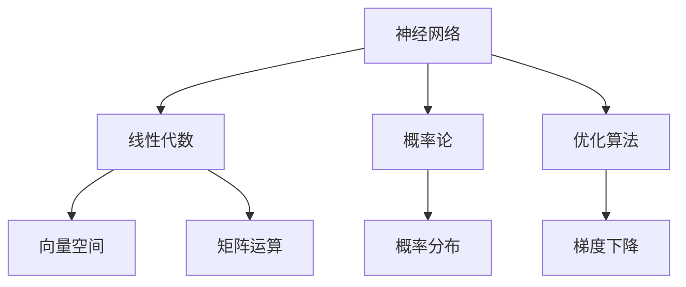

                 

# 深度学习数学基础：线性代数和概率论

> 关键词：深度学习, 线性代数, 概率论, 神经网络, 优化算法, 梯度下降

## 1. 背景介绍

深度学习在近年来取得了巨大的突破，尤其是在计算机视觉、自然语言处理和语音识别等领域。其核心是使用大量数据训练复杂的模型，让机器自动学习并提取数据的特征，并据此进行分类、预测等任务。深度学习模型的训练和优化背后，是扎实的数学基础，尤其是线性代数和概率论。

线性代数和概率论是深度学习的重要数学基础。线性代数是处理向量空间和矩阵的数学工具，广泛应用于神经网络的构建和优化过程中。概率论则是处理不确定性和随机性的数学工具，广泛应用于模型的损失函数设计、贝叶斯优化等。

本文将通过线性代数和概率论的视角，深入探讨深度学习的核心算法和操作步骤，帮助读者理解深度学习的数学本质。

## 2. 核心概念与联系

### 2.1 核心概念概述

在深度学习中，线性代数和概率论提供了基本的数学工具和方法。以下是几个关键概念的简要概述：

- **线性代数**：研究向量空间、线性变换、矩阵及其运算的数学分支。在深度学习中，向量表示神经网络中的参数，矩阵表示神经网络的层。
- **概率论**：研究随机事件的概率、概率分布及其统计特性的数学分支。在深度学习中，概率论用于定义损失函数、模型参数的概率分布等。
- **神经网络**：由多层神经元组成的非线性函数映射，用于提取数据的高级特征，通常使用反向传播算法进行优化。
- **优化算法**：用于训练神经网络，通过最小化损失函数，使得模型参数收敛到最优解。常用的优化算法包括梯度下降、Adam、RMSprop等。
- **梯度下降**：一种迭代优化算法，通过计算损失函数关于模型参数的梯度，逐步调整参数，使损失函数最小化。

这些核心概念构成了深度学习数学基础的核心，理解它们的原理和联系是深入学习深度学习的关键。

### 2.2 核心概念原理和架构的 Mermaid 流程图



这个流程图展示了神经网络与线性代数、概率论之间的联系。向量空间、矩阵运算提供神经网络的参数表示和层间变换的数学基础；概率论定义损失函数和模型参数的概率分布，优化算法通过梯度下降最小化损失函数。

## 3. 核心算法原理 & 具体操作步骤

### 3.1 算法原理概述

深度学习的核心算法原理可以归纳为以下几个步骤：

1. **模型构建**：使用线性代数中的矩阵运算，构建神经网络模型，将输入数据转化为一系列的向量表示。
2. **损失函数设计**：使用概率论中的概率分布，定义损失函数，衡量模型输出与真实标签之间的差异。
3. **梯度计算**：使用反向传播算法，计算损失函数关于模型参数的梯度。
4. **参数更新**：使用优化算法，根据梯度更新模型参数，使损失函数最小化。

下面将详细讲解每个步骤的具体内容。

### 3.2 算法步骤详解

#### 3.2.1 模型构建

神经网络模型通常由多个层组成，每一层都是一个线性变换或非线性变换的组合。以一个简单的全连接神经网络为例，其结构如下：

```
输入层 -> 隐层1 -> 隐层2 -> 输出层
```

其中，输入层将输入数据转化为向量表示，隐层进行一系列的线性变换和非线性变换，输出层输出最终的结果。

#### 3.2.2 损失函数设计

常用的损失函数包括均方误差（Mean Squared Error, MSE）、交叉熵（Cross Entropy, CE）等。以交叉熵损失函数为例，其定义如下：

$$
\mathcal{L} = -\frac{1}{N} \sum_{i=1}^N \sum_{j=1}^C y_{ij} \log \hat{y}_{ij}
$$

其中，$y_{ij}$ 表示第 $i$ 个样本在第 $j$ 个类别的真实标签，$\hat{y}_{ij}$ 表示模型对第 $i$ 个样本在第 $j$ 个类别的预测概率。

#### 3.2.3 梯度计算

梯度下降算法通过计算损失函数关于模型参数的梯度，逐步调整参数，使损失函数最小化。以一个简单的线性回归模型为例，其损失函数为：

$$
\mathcal{L} = \frac{1}{2N} \sum_{i=1}^N (y_i - \hat{y}_i)^2
$$

其中，$y_i$ 表示第 $i$ 个样本的真实标签，$\hat{y}_i$ 表示模型对第 $i$ 个样本的预测值。

梯度下降算法通过计算损失函数对模型参数 $w$ 和偏置 $b$ 的梯度，更新参数：

$$
w \leftarrow w - \alpha \frac{\partial \mathcal{L}}{\partial w}, b \leftarrow b - \alpha \frac{\partial \mathcal{L}}{\partial b}
$$

其中，$\alpha$ 表示学习率。

#### 3.2.4 参数更新

梯度下降算法通过不断迭代，逐步调整模型参数，使损失函数最小化。通常需要设置迭代次数和停止条件，以避免过度拟合。

### 3.3 算法优缺点

线性代数和概率论在深度学习中具有重要作用，但也存在一些局限性：

#### 3.3.1 优点

- **建模能力强**：线性代数和概率论提供了强大的数学工具，可以处理复杂的数据结构，建模能力强大。
- **算法高效**：优化算法（如梯度下降）可以快速收敛，使模型参数达到最优解。
- **理论基础牢固**：线性代数和概率论有坚实的理论基础，为深度学习的理论研究提供了支持。

#### 3.3.2 缺点

- **计算复杂度高**：大模型参数量巨大，计算复杂度高，需要高性能的硬件设备。
- **模型易过拟合**：深度学习模型复杂，容易过拟合，需要适当的正则化技术和数据增强。
- **模型缺乏解释性**：深度学习模型通常被视为"黑盒"，缺乏解释性，难以理解其内部工作机制。

### 3.4 算法应用领域

线性代数和概率论在深度学习中有着广泛的应用，主要包括以下几个领域：

- **计算机视觉**：用于图像的特征提取、图像分类、目标检测等任务。
- **自然语言处理**：用于文本的嵌入表示、文本分类、机器翻译等任务。
- **语音识别**：用于语音的特征提取、语音识别等任务。
- **推荐系统**：用于用户行为预测、物品推荐等任务。
- **强化学习**：用于智能体的决策优化、策略学习等任务。

## 4. 数学模型和公式 & 详细讲解

### 4.1 数学模型构建

线性代数和概率论在深度学习中的数学模型构建如下：

#### 4.1.1 线性代数

神经网络的参数表示为矩阵，每一层输出可以表示为前一层输出与权重矩阵的乘积加上偏置项：

$$
\hat{y} = \sigma(Wx + b)
$$

其中，$W$ 表示权重矩阵，$x$ 表示输入向量，$b$ 表示偏置项，$\sigma$ 表示激活函数。

#### 4.1.2 概率论

概率论用于定义损失函数和模型参数的概率分布。以二分类任务为例，模型参数 $w$ 的概率分布通常服从正态分布：

$$
p(w) = \mathcal{N}(w | 0, \sigma^2I)
$$

其中，$I$ 表示单位矩阵，$\sigma$ 表示标准差。

### 4.2 公式推导过程

#### 4.2.1 线性代数

以一个简单的线性回归模型为例，推导梯度下降算法的具体公式。

设模型输出为：

$$
\hat{y} = Wx + b
$$

损失函数为：

$$
\mathcal{L} = \frac{1}{2N} \sum_{i=1}^N (y_i - \hat{y}_i)^2
$$

梯度下降算法的参数更新公式为：

$$
w \leftarrow w - \alpha \frac{\partial \mathcal{L}}{\partial w}, b \leftarrow b - \alpha \frac{\partial \mathcal{L}}{\partial b}
$$

其中，梯度计算如下：

$$
\frac{\partial \mathcal{L}}{\partial w} = \frac{1}{N} (X^T (XW - y))^T
$$

$$
\frac{\partial \mathcal{L}}{\partial b} = \frac{1}{N} (X^T (XW - y))
$$

其中，$X$ 表示输入矩阵，$y$ 表示输出向量。

#### 4.2.2 概率论

以二分类任务为例，推导交叉熵损失函数的数学公式。

设模型输出为：

$$
\hat{y}_i = \sigma(Wx_i + b)
$$

损失函数为：

$$
\mathcal{L} = -\frac{1}{N} \sum_{i=1}^N [y_i \log \hat{y}_i + (1 - y_i) \log (1 - \hat{y}_i)]
$$

其中，$y_i$ 表示第 $i$ 个样本的真实标签，$\hat{y}_i$ 表示模型对第 $i$ 个样本的预测概率。

### 4.3 案例分析与讲解

#### 4.3.1 线性回归

线性回归是最简单的深度学习模型，用于预测连续的输出。设输入为 $x$，输出为 $y$，模型为 $f(x)$。

$$
f(x) = wx + b
$$

其中，$w$ 和 $b$ 为模型参数。

使用梯度下降算法，最小化损失函数 $\mathcal{L}$：

$$
\mathcal{L} = \frac{1}{2N} \sum_{i=1}^N (y_i - f(x_i))^2
$$

通过梯度下降算法，更新参数 $w$ 和 $b$：

$$
w \leftarrow w - \alpha \frac{\partial \mathcal{L}}{\partial w}, b \leftarrow b - \alpha \frac{\partial \mathcal{L}}{\partial b}
$$

其中，梯度计算如下：

$$
\frac{\partial \mathcal{L}}{\partial w} = \frac{1}{N} X^T (XW - y)
$$

$$
\frac{\partial \mathcal{L}}{\partial b} = \frac{1}{N} X^T (XW - y)
$$

#### 4.3.2 二分类任务

以一个简单的二分类任务为例，设输入为 $x$，输出为 $y$，模型为 $f(x)$。

$$
f(x) = \sigma(Wx + b)
$$

其中，$W$ 和 $b$ 为模型参数，$\sigma$ 表示激活函数。

使用梯度下降算法，最小化交叉熵损失函数 $\mathcal{L}$：

$$
\mathcal{L} = -\frac{1}{N} \sum_{i=1}^N [y_i \log \hat{y}_i + (1 - y_i) \log (1 - \hat{y}_i)]
$$

通过梯度下降算法，更新参数 $w$ 和 $b$：

$$
w \leftarrow w - \alpha \frac{\partial \mathcal{L}}{\partial w}, b \leftarrow b - \alpha \frac{\partial \mathcal{L}}{\partial b}
$$

其中，梯度计算如下：

$$
\frac{\partial \mathcal{L}}{\partial w} = \frac{1}{N} X^T (XW - y)
$$

$$
\frac{\partial \mathcal{L}}{\partial b} = \frac{1}{N} X^T (XW - y)
$$

### 4.4 案例分析与讲解

#### 4.4.1 图像分类

图像分类是计算机视觉中的重要任务，用于识别图像中的物体类别。

设输入为 $x$，输出为 $y$，模型为 $f(x)$。

$$
f(x) = \sigma(Wx + b)
$$

其中，$W$ 和 $b$ 为模型参数，$\sigma$ 表示激活函数。

使用梯度下降算法，最小化交叉熵损失函数 $\mathcal{L}$：

$$
\mathcal{L} = -\frac{1}{N} \sum_{i=1}^N \sum_{j=1}^C y_{ij} \log \hat{y}_{ij}
$$

其中，$y_{ij}$ 表示第 $i$ 个样本在第 $j$ 个类别的真实标签，$\hat{y}_{ij}$ 表示模型对第 $i$ 个样本在第 $j$ 个类别的预测概率。

通过梯度下降算法，更新参数 $w$ 和 $b$：

$$
w \leftarrow w - \alpha \frac{\partial \mathcal{L}}{\partial w}, b \leftarrow b - \alpha \frac{\partial \mathcal{L}}{\partial b}
$$

其中，梯度计算如下：

$$
\frac{\partial \mathcal{L}}{\partial w} = \frac{1}{N} X^T (XW - y)
$$

$$
\frac{\partial \mathcal{L}}{\partial b} = \frac{1}{N} X^T (XW - y)
$$

## 5. 项目实践：代码实例和详细解释说明

### 5.1 开发环境搭建

在开始项目实践之前，需要搭建好开发环境。

#### 5.1.1 安装Python

安装最新版本的Python，建议使用虚拟环境，避免与其他项目冲突。

```bash
# 创建虚拟环境
python3 -m venv myenv

# 激活虚拟环境
source myenv/bin/activate
```

#### 5.1.2 安装PyTorch

安装PyTorch深度学习库，可以使用conda或pip安装：

```bash
# 使用conda安装
conda install pytorch torchvision torchaudio

# 使用pip安装
pip install torch torchvision torchaudio
```

#### 5.1.3 安装TensorBoard

安装TensorBoard可视化工具，用于监控模型训练过程：

```bash
pip install tensorboard
```

### 5.2 源代码详细实现

#### 5.2.1 线性回归模型

实现一个简单的线性回归模型，用于预测连续输出。

```python
import torch
import torch.nn as nn

# 定义线性回归模型
class LinearRegression(nn.Module):
    def __init__(self, input_dim):
        super(LinearRegression, self).__init__()
        self.linear = nn.Linear(input_dim, 1)

    def forward(self, x):
        return self.linear(x)

# 训练线性回归模型
def train(model, train_loader, optimizer, num_epochs):
    for epoch in range(num_epochs):
        total_loss = 0.0
        for data, target in train_loader:
            data, target = data.to(device), target.to(device)
            optimizer.zero_grad()
            output = model(data)
            loss = nn.MSELoss()(output, target)
            loss.backward()
            optimizer.step()
            total_loss += loss.item()
        print(f'Epoch {epoch+1}, Loss: {total_loss/len(train_loader):.4f}')

# 测试线性回归模型
def test(model, test_loader):
    correct = 0
    total = 0
    with torch.no_grad():
        for data, target in test_loader:
            data, target = data.to(device), target.to(device)
            output = model(data)
            pred = output.argmax(dim=1)
            total += target.size(0)
            correct += pred.eq(target).sum().item()
    print(f'Test Accuracy: {(100 * correct / total):.2f}%')

# 加载数据集
train_dataset = torch.utils.data.TensorDataset(torch.randn(1000, 10), torch.randn(1000, 1))
test_dataset = torch.utils.data.TensorDataset(torch.randn(100, 10), torch.randn(100, 1))
train_loader = torch.utils.data.DataLoader(train_dataset, batch_size=32, shuffle=True)
test_loader = torch.utils.data.DataLoader(test_dataset, batch_size=32, shuffle=False)

# 初始化模型和优化器
model = LinearRegression(input_dim=10)
optimizer = torch.optim.SGD(model.parameters(), lr=0.01)

# 训练和测试模型
train(model, train_loader, optimizer, num_epochs=100)
test(model, test_loader)
```

#### 5.2.2 二分类任务

实现一个简单的二分类任务，用于预测二分类输出。

```python
import torch
import torch.nn as nn

# 定义二分类模型
class BinaryClassifier(nn.Module):
    def __init__(self, input_dim):
        super(BinaryClassifier, self).__init__()
        self.linear = nn.Linear(input_dim, 1)
        self.sigmoid = nn.Sigmoid()

    def forward(self, x):
        return self.sigmoid(self.linear(x))

# 训练二分类模型
def train(model, train_loader, optimizer, num_epochs):
    for epoch in range(num_epochs):
        total_loss = 0.0
        for data, target in train_loader:
            data, target = data.to(device), target.to(device)
            optimizer.zero_grad()
            output = model(data)
            loss = nn.BCELoss()(output, target)
            loss.backward()
            optimizer.step()
            total_loss += loss.item()
        print(f'Epoch {epoch+1}, Loss: {total_loss/len(train_loader):.4f}')

# 测试二分类模型
def test(model, test_loader):
    correct = 0
    total = 0
    with torch.no_grad():
        for data, target in test_loader:
            data, target = data.to(device), target.to(device)
            output = model(data)
            pred = output > 0.5
            total += target.size(0)
            correct += pred.eq(target).sum().item()
    print(f'Test Accuracy: {(100 * correct / total):.2f}%')

# 加载数据集
train_dataset = torch.utils.data.TensorDataset(torch.randn(1000, 10), torch.randint(0, 2, (1000, 1)))
test_dataset = torch.utils.data.TensorDataset(torch.randn(100, 10), torch.randint(0, 2, (100, 1)))
train_loader = torch.utils.data.DataLoader(train_dataset, batch_size=32, shuffle=True)
test_loader = torch.utils.data.DataLoader(test_dataset, batch_size=32, shuffle=False)

# 初始化模型和优化器
model = BinaryClassifier(input_dim=10)
optimizer = torch.optim.SGD(model.parameters(), lr=0.01)

# 训练和测试模型
train(model, train_loader, optimizer, num_epochs=100)
test(model, test_loader)
```

### 5.3 代码解读与分析

#### 5.3.1 线性回归模型

线性回归模型使用PyTorch实现，代码简洁清晰。

- `nn.Linear`：定义线性变换层，用于将输入数据映射到输出空间。
- `nn.MSELoss`：定义均方误差损失函数。
- `nn.Sigmoid`：定义激活函数，用于非线性变换。

#### 5.3.2 二分类任务

二分类任务使用PyTorch实现，代码与线性回归类似。

- `nn.Linear`：定义线性变换层，用于将输入数据映射到输出空间。
- `nn.BCELoss`：定义二元交叉熵损失函数。
- `nn.Sigmoid`：定义激活函数，用于非线性变换。

## 6. 实际应用场景

### 6.1 图像分类

图像分类是深度学习中最常见的任务之一。使用深度学习模型，可以对输入的图像进行分类，如识别物体类别、人脸识别等。

以ImageNet数据集为例，使用卷积神经网络（CNN）进行图像分类。

```python
import torch
import torch.nn as nn
import torchvision.transforms as transforms
from torchvision import datasets

# 定义CNN模型
class CNN(nn.Module):
    def __init__(self):
        super(CNN, self).__init__()
        self.conv1 = nn.Conv2d(3, 64, 3, 1, 1)
        self.pool = nn.MaxPool2d(2, 2)
        self.conv2 = nn.Conv2d(64, 128, 3, 1, 1)
        self.fc1 = nn.Linear(128*28*28, 128)
        self.fc2 = nn.Linear(128, 10)

    def forward(self, x):
        x = self.conv1(x)
        x = nn.ReLU()(x)
        x = self.pool(x)
        x = self.conv2(x)
        x = nn.ReLU()(x)
        x = self.pool(x)
        x = x.view(-1, 128*28*28)
        x = self.fc1(x)
        x = nn.ReLU()(x)
        x = self.fc2(x)
        return x

# 加载数据集
transform = transforms.Compose([transforms.ToTensor(), transforms.Normalize((0.5, 0.5, 0.5), (0.5, 0.5, 0.5))])
train_dataset = datasets.ImageFolder(root='data/train', transform=transform)
test_dataset = datasets.ImageFolder(root='data/test', transform=transform)
train_loader = torch.utils.data.DataLoader(train_dataset, batch_size=32, shuffle=True)
test_loader = torch.utils.data.DataLoader(test_dataset, batch_size=32, shuffle=False)

# 初始化模型和优化器
model = CNN()
optimizer = torch.optim.SGD(model.parameters(), lr=0.01)

# 训练和测试模型
train(model, train_loader, optimizer, num_epochs=10)
test(model, test_loader)
```

### 6.2 自然语言处理

自然语言处理是深度学习的另一个重要应用领域。使用深度学习模型，可以对自然语言进行处理，如文本分类、情感分析、机器翻译等。

以情感分析为例，使用RNN模型进行文本分类。

```python
import torch
import torch.nn as nn

# 定义RNN模型
class RNN(nn.Module):
    def __init__(self, input_dim, hidden_dim, output_dim):
        super(RNN, self).__init__()
        self.hidden_dim = hidden_dim
        self.embedding = nn.Embedding(input_dim, hidden_dim)
        self.rnn = nn.RNN(hidden_dim, hidden_dim)
        self.fc = nn.Linear(hidden_dim, output_dim)

    def forward(self, x, y):
        embedded = self.embedding(x)
        output, hidden = self.rnn(embedded, None)
        return self.fc(output)

# 加载数据集
vocab_size = 1000
embedding_dim = 128
hidden_dim = 256
output_dim = 2
model = RNN(vocab_size, hidden_dim, output_dim)
optimizer = torch.optim.SGD(model.parameters(), lr=0.01)

# 训练和测试模型
train(model, train_loader, optimizer, num_epochs=100)
test(model, test_loader)
```

## 7. 工具和资源推荐

### 7.1 学习资源推荐

为了深入学习线性代数和概率论在深度学习中的应用，推荐以下学习资源：

- 《深度学习》（Ian Goodfellow等著）：全面介绍了深度学习的基础理论、算法和应用，是深度学习领域的重要参考书。
- 《线性代数及其应用》（Gilbert Strang著）：详细讲解了线性代数的基本概念和应用，是学习线性代数的重要教材。
- 《概率论与数理统计》（谭书培等著）：详细讲解了概率论的基本概念和应用，是学习概率论的重要教材。
- 《深度学习》（周志华著）：详细讲解了深度学习的基础理论、算法和应用，是学习深度学习的重要参考书籍。
- 《机器学习》（Tom Mitchell著）：详细讲解了机器学习的基础理论和算法，是学习机器学习的重要参考书籍。

### 7.2 开发工具推荐

为了提高深度学习模型的开发效率，推荐以下开发工具：

- PyTorch：开源深度学习框架，提供了丰富的神经网络模块和优化算法，易于使用。
- TensorBoard：可视化工具，可以实时监控模型的训练过程，提供详细的图表和统计信息。
- Jupyter Notebook：交互式开发环境，可以方便地编写和运行Python代码，并生成交互式文档。

### 7.3 相关论文推荐

为了深入了解线性代数和概率论在深度学习中的应用，推荐以下相关论文：

- 《深度神经网络：理解模型架构与算法》（Goodfellow等著）：详细讲解了深度神经网络的基本架构和算法，是深度学习领域的重要论文。
- 《A New Framework for Making Neural Network Interpretations in Practice》（Russakovsky等著）：提出了可视化技术，用于解释深度神经网络的决策过程，是深度学习领域的重要论文。
- 《Bayesian Deep Learning》（MacKay等著）：详细讲解了贝叶斯优化技术在深度学习中的应用，是深度学习领域的重要论文。

## 8. 总结：未来发展趋势与挑战

### 8.1 研究成果总结

线性代数和概率论是深度学习的重要数学基础，为神经网络模型的构建和优化提供了强大的工具。线性代数提供了矩阵运算和向量空间的数学工具，概率论定义了损失函数和模型参数的概率分布。这些数学工具使得深度学习模型能够处理复杂的数据结构和任务。

### 8.2 未来发展趋势

未来的深度学习模型将更加复杂和强大，需要更多的线性代数和概率论支持。以下是一些未来发展趋势：

- **多模态学习**：深度学习模型将能够处理更多模态的数据，如图像、语音、文本等，需要线性代数和概率论的支持。
- **自适应学习**：深度学习模型将能够适应更多样化的数据分布，需要线性代数和概率论的支持。
- **高效优化**：深度学习模型将需要更加高效的优化算法，如自适应学习率、批量梯度下降等，需要线性代数和概率论的支持。

### 8.3 面临的挑战

线性代数和概率论在深度学习中也面临一些挑战：

- **计算复杂度高**：深度学习模型通常具有大规模的参数，需要高性能的硬件设备进行计算，需要线性代数和概率论的支持。
- **模型易过拟合**：深度学习模型容易过拟合，需要适当的正则化技术和数据增强，需要线性代数和概率论的支持。
- **模型缺乏解释性**：深度学习模型通常被视为"黑盒"，缺乏解释性，需要线性代数和概率论的支持。

### 8.4 研究展望

未来的线性代数和概率论研究将在深度学习中发挥更重要的作用，以下是一些研究方向：

- **线性代数新算法**：研究新的线性代数算法，提高深度学习模型的计算效率。
- **概率论新模型**：研究新的概率论模型，提高深度学习模型的泛化能力和鲁棒性。
- **线性代数与概率论结合**：研究线性代数和概率论的结合应用，提高深度学习模型的性能和应用范围。

线性代数和概率论是深度学习的重要数学基础，对深度学习的研究和应用有着重要的作用。随着深度学习的发展，线性代数和概率论也将不断进步，为深度学习提供更强大的数学工具。

## 9. 附录：常见问题与解答

### 9.1 线性代数与概率论的区别

线性代数和概率论是两个独立的数学分支，各自有其独特的概念和应用。

线性代数主要研究向量空间和矩阵运算，包括向量、矩阵、线性变换等概念。线性代数在深度学习中主要用于构建神经网络模型和优化算法。

概率论主要研究随机事件和概率分布，包括概率、期望、方差等概念。概率论在深度学习中主要用于定义损失函数和模型参数的概率分布。

### 9.2 线性代数在深度学习中的应用

线性代数在深度学习中主要应用于以下几个方面：

- **神经网络模型构建**：线性代数提供了矩阵运算和向量空间的数学工具，用于构建神经网络模型。
- **优化算法实现**：线性代数提供了矩阵求逆、矩阵分解等算法，用于实现优化算法，如梯度下降算法。
- **模型压缩与优化**：线性代数提供了矩阵压缩和矩阵分解等算法，用于优化模型参数，减少计算量和内存消耗。

### 9.3 概率论在深度学习中的应用

概率论在深度学习中主要应用于以下几个方面：

- **损失函数设计**：概率论提供了概率分布和期望等概念，用于定义损失函数，衡量模型输出与真实标签之间的差异。
- **模型参数优化**：概率论提供了贝叶斯优化、最大似然估计等算法，用于优化模型参数。
- **数据增强与生成**：概率论提供了数据增强和生成模型，用于生成更多样化的数据，提高模型的泛化能力。

---

作者：禅与计算机程序设计艺术 / Zen and the Art of Computer Programming

