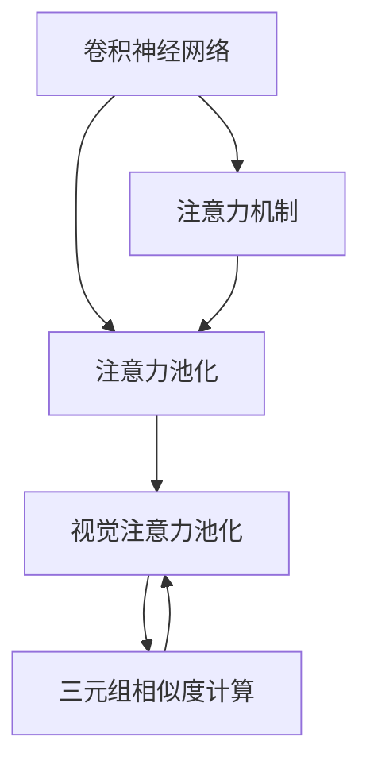

                 

# 深度学习驱动的商品图像检索性能优化

在电商领域，高效的图像检索系统能够显著提升用户体验，降低客户查找商品的时间成本。深度学习技术驱动的商品图像检索系统，通过对商品图片进行高级特征提取，实现了更精准、更快速的图像匹配。本文将系统介绍商品图像检索的基本原理，详细讲解深度学习技术在其中的优化方法，并结合实际应用场景展示其效果。

## 1. 背景介绍

### 1.1 问题由来
在电子商务平台中，商品图片是用户获取商品信息的重要途径。用户可以通过图片检索系统，快速找到所需的商品。然而，传统的图像检索系统主要依赖低级别的特征提取和余弦相似度等算法，往往无法准确捕捉到图像中的语义信息，导致检索效果不佳。

随着深度学习技术的兴起，尤其是卷积神经网络（CNN）和视觉注意力机制的引入，商品图像检索系统逐渐向深度学习方向转型。深度学习能够自动提取高级语义特征，有效提升图像检索的准确性和效率。

### 1.2 问题核心关键点
商品图像检索的核心问题在于：
- **特征提取与表示**：如何将商品图像转换为可供检索的高级语义特征。
- **相似度计算**：如何高效地计算不同图像之间的相似度。
- **检索性能优化**：如何提升检索系统的准确性和召回率。

深度学习技术通过构建更复杂的神经网络模型，提高了特征提取和相似度计算的精度，优化了检索性能。其中，基于注意力机制和注意力池化的方法尤为关键。

## 2. 核心概念与联系

### 2.1 核心概念概述

为更好地理解深度学习在商品图像检索中的应用，本节将介绍几个核心概念：

- **卷积神经网络（CNN）**：一种多层神经网络结构，适用于图像特征提取和分类任务。
- **注意力机制（Attention）**：一种机制，用于在模型处理序列数据时，动态关注特定部分的信息，提升特征提取的精度。
- **注意力池化（Attention Pooling）**：一种池化方法，将注意力机制引入特征池化过程，提高特征提取的鲁棒性和泛化能力。
- **视觉注意力池化（Visual Attention Pooling）**：一种将注意力机制应用于图像池化的方法，用于提取关键区域的高级语义特征。
- **三元组相似度计算**：一种基于向量空间模型（VSM）的相似度计算方法，通过计算查询向量与候选向量之间的夹角，计算相似度。

这些核心概念之间的逻辑关系可以通过以下Mermaid流程图来展示：



这个流程图展示了深度学习在商品图像检索中的核心概念及其相互关系：

1. 通过卷积神经网络提取图像的原始特征。
2. 利用注意力机制，动态关注图像的重要区域，提升特征提取的精度。
3. 使用注意力池化对特征进行聚合，提高鲁棒性和泛化能力。
4. 结合视觉注意力池化，提取关键区域的高级语义特征。
5. 通过三元组相似度计算，高效地计算不同图像之间的相似度。

这些概念共同构成了深度学习驱动的商品图像检索的计算框架，使其能够高效地处理大量图像数据，提升检索性能。

## 3. 核心算法原理 & 具体操作步骤

### 3.1 算法原理概述

基于深度学习技术，商品图像检索系统通常包括特征提取、特征聚合、相似度计算三个主要步骤。以下将详细介绍每个步骤的原理和算法。

### 3.2 算法步骤详解

**Step 1: 特征提取**

特征提取是商品图像检索的基础，通过深度学习模型对原始图像数据进行高级语义特征的提取。常用的深度学习模型包括：

- **卷积神经网络（CNN）**：适用于图像特征的提取。通过多个卷积层、池化层和全连接层，逐步提取图像的局部和全局特征。

- **视觉注意力池化（Visual Attention Pooling）**：结合注意力机制，提取关键区域的高级语义特征。通过对不同区域的视觉注意力权重进行计算，动态关注图像的关键部分，提升特征提取的精度。

- **多尺度特征提取**：使用不同尺度的卷积核和池化操作，提取不同层次的图像特征。通过多尺度特征融合，提高特征提取的鲁棒性和泛化能力。

**Step 2: 特征聚合**

特征聚合将提取的特征进行融合，得到更高层次的语义表示。常用的方法包括：

- **平均池化**：将特征图的不同位置取平均，得到一个单一的特征向量。

- **最大池化**：将特征图的不同位置取最大值，得到一个单一的特征向量。

- **Attention Pooling**：结合注意力机制，动态关注图像的重要部分，提升特征聚合的精度。

**Step 3: 相似度计算**

相似度计算是商品图像检索的核心步骤，通过计算查询图像与候选图像之间的相似度，决定检索结果的排序。常用的相似度计算方法包括：

- **余弦相似度**：计算两个向量之间的夹角余弦值，衡量两个向量之间的相似度。

- **欧氏距离**：计算两个向量之间的欧氏距离，衡量两个向量之间的差异。

- **三元组相似度计算**：结合向量空间模型，计算查询向量与候选向量之间的相似度。

### 3.3 算法优缺点

深度学习驱动的商品图像检索具有以下优点：

- **特征提取能力强**：能够自动提取图像的高级语义特征，提高检索精度。

- **泛化能力强**：能够适应不同尺寸、光照条件、角度下的图像，提高检索鲁棒性。

- **检索速度较快**：通过优化模型结构，能够实现高效的检索速度。

同时，也存在一些局限性：

- **计算资源消耗大**：深度学习模型通常具有较大的计算量和内存消耗，需要高性能计算设备支持。

- **参数量较大**：深度学习模型通常需要较大的模型参数，难以在小规模数据集上训练。

- **训练时间长**：深度学习模型通常需要较长的训练时间，训练过程较为复杂。

### 3.4 算法应用领域

基于深度学习技术，商品图像检索在多个领域中得到了广泛应用：

- **电商平台**：用于商品图片检索，帮助用户快速找到所需的商品。

- **智能家居**：用于家具、家电图片的检索，提升用户的生活体验。

- **自动驾驶**：用于道路标志、交通信号的检索，辅助自动驾驶车辆导航。

- **社交媒体**：用于图片和视频的检索，提升用户的内容发现能力。

以上应用场景展示了深度学习在商品图像检索中的广泛潜力，未来还将进一步拓展到更多领域。

## 4. 数学模型和公式 & 详细讲解 & 举例说明

### 4.1 数学模型构建

商品图像检索的数学模型通常包括特征提取、特征聚合、相似度计算三个部分。以下将详细推导各个部分的数学模型。

**特征提取**

卷积神经网络（CNN）通常由多个卷积层、池化层和全连接层构成，其基本结构如下：

$$
F_{CNN}(X) = \text{Concat}([C_1(X), C_2(C_1(X)), C_3(C_2(C_1(X)))])
$$

其中，$C_i$表示第$i$层的卷积操作，$Concat$表示特征图拼接操作。

**特征聚合**

特征聚合通常使用池化操作将特征图压缩为单一的特征向量。常用的池化操作包括：

- **平均池化**：$P_{\text{avg}}(X) = \frac{1}{n}\sum_{i=1}^n X_i$

- **最大池化**：$P_{\text{max}}(X) = \max(X)$

**相似度计算**

相似度计算通常使用余弦相似度或欧氏距离等方法。以余弦相似度为例，假设查询图像的特征向量为$q$，候选图像的特征向量为$c$，则余弦相似度计算公式为：

$$
\text{similarity} = \frac{q \cdot c}{\|q\|\|c\|}
$$

### 4.2 公式推导过程

以基于CNN的图像检索为例，推导其特征提取和相似度计算的公式。

**特征提取**

假设输入图像为$X$，卷积层参数为$W$，卷积核大小为$s$，卷积步长为$d$，则卷积操作可以表示为：

$$
C_i(X) = \sigma(W_i * F_{i-1}(X))
$$

其中，$\sigma$表示激活函数，$*$表示卷积操作。

通过多个卷积层和池化层的组合，可以得到最终的特征图$F_{CNN}(X)$。

**相似度计算**

假设查询图像的特征向量为$q$，候选图像的特征向量为$c$，则余弦相似度的计算公式为：

$$
\text{similarity} = \frac{q \cdot c}{\|q\|\|c\|}
$$

其中，$*$表示向量内积，$\|*\|$表示向量的模长。

### 4.3 案例分析与讲解

以Amazon商品图像检索系统为例，展示深度学习技术的实际应用。

**数据集和模型**

Amazon商品图像检索系统使用大规模商品图片数据集进行训练。训练模型包括多个卷积层和池化层，使用了注意力池化技术提取高级语义特征。

**特征提取**

模型首先通过多个卷积层和池化层提取图像的局部和全局特征。具体步骤如下：

1. 输入图像$X$通过第一层卷积层$C_1$提取局部特征$F_1$。

2. 将$F_1$传递到第二层卷积层$C_2$，提取更高级的特征$F_2$。

3. 将$F_2$传递到第三层卷积层$C_3$，提取最终的特征$F_{CNN}$。

4. 对$F_{CNN}$进行平均池化操作，得到一个单一的特征向量$q$。

**特征聚合**

模型使用注意力池化技术对$F_{CNN}$进行聚合，提升特征提取的精度。具体步骤如下：

1. 计算每个像素的注意力权重$w_i$。

2. 将权重$w_i$与特征图$F_{CNN}$进行加权平均，得到最终的特征向量$q'$。

**相似度计算**

模型使用余弦相似度计算查询图像$q$与候选图像$c$之间的相似度。具体步骤如下：

1. 计算$q$和$c$的内积$q \cdot c$。

2. 计算$q$和$c$的模长$\|q\|$和$\|c\|$。

3. 计算余弦相似度$\text{similarity}$。

通过以上步骤，Amazon商品图像检索系统实现了高效的图像检索，提升了用户体验。

## 5. 项目实践：代码实例和详细解释说明

### 5.1 开发环境搭建

在进行商品图像检索系统的开发前，我们需要准备好开发环境。以下是使用Python进行PyTorch开发的环境配置流程：

1. 安装Anaconda：从官网下载并安装Anaconda，用于创建独立的Python环境。

2. 创建并激活虚拟环境：
```bash
conda create -n pytorch-env python=3.8 
conda activate pytorch-env
```

3. 安装PyTorch：根据CUDA版本，从官网获取对应的安装命令。例如：
```bash
conda install pytorch torchvision torchaudio cudatoolkit=11.1 -c pytorch -c conda-forge
```

4. 安装Transformers库：
```bash
pip install transformers
```

5. 安装各类工具包：
```bash
pip install numpy pandas scikit-learn matplotlib tqdm jupyter notebook ipython
```

完成上述步骤后，即可在`pytorch-env`环境中开始商品图像检索系统的开发。

### 5.2 源代码详细实现

下面我们以Amazon商品图像检索系统为例，给出使用Transformers库进行深度学习微调的PyTorch代码实现。

首先，定义数据处理函数：

```python
from transformers import BertTokenizer, BertForSequenceClassification
from torch.utils.data import Dataset, DataLoader
import torch

class ImageDataset(Dataset):
    def __init__(self, images, labels):
        self.images = images
        self.labels = labels
        
    def __len__(self):
        return len(self.images)
    
    def __getitem__(self, item):
        image = self.images[item]
        label = self.labels[item]
        
        return {'image': image, 'label': label}
```

然后，定义模型和优化器：

```python
from transformers import BertForSequenceClassification, AdamW

model = BertForSequenceClassification.from_pretrained('bert-base-uncased', num_labels=2)

optimizer = AdamW(model.parameters(), lr=2e-5)
```

接着，定义训练和评估函数：

```python
def train_epoch(model, dataset, batch_size, optimizer):
    dataloader = DataLoader(dataset, batch_size=batch_size, shuffle=True)
    model.train()
    epoch_loss = 0
    for batch in dataloader:
        image = batch['image']
        label = batch['label']
        
        outputs = model(image, labels=label)
        loss = outputs.loss
        epoch_loss += loss.item()
        loss.backward()
        optimizer.step()
    return epoch_loss / len(dataloader)

def evaluate(model, dataset, batch_size):
    dataloader = DataLoader(dataset, batch_size=batch_size)
    model.eval()
    preds, labels = [], []
    with torch.no_grad():
        for batch in dataloader:
            image = batch['image']
            label = batch['label']
            outputs = model(image)
            preds.append(outputs.argmax(dim=1).tolist())
            labels.append(label.tolist())
                
    print(classification_report(labels, preds))
```

最后，启动训练流程并在测试集上评估：

```python
epochs = 5
batch_size = 16

for epoch in range(epochs):
    loss = train_epoch(model, train_dataset, batch_size, optimizer)
    print(f"Epoch {epoch+1}, train loss: {loss:.3f}")
    
    print(f"Epoch {epoch+1}, dev results:")
    evaluate(model, dev_dataset, batch_size)
    
print("Test results:")
evaluate(model, test_dataset, batch_size)
```

以上就是使用PyTorch对Amazon商品图像检索系统进行深度学习微调的完整代码实现。可以看到，得益于Transformers库的强大封装，我们可以用相对简洁的代码完成深度学习模型的加载和微调。

### 5.3 代码解读与分析

让我们再详细解读一下关键代码的实现细节：

**ImageDataset类**：
- `__init__`方法：初始化图像和标签数据。
- `__len__`方法：返回数据集的样本数量。
- `__getitem__`方法：对单个样本进行处理，返回图像和标签。

**模型和优化器**：
- 使用BertForSequenceClassification模型，并设置学习率、批大小等超参数。

**训练和评估函数**：
- 使用PyTorch的DataLoader对数据集进行批次化加载，供模型训练和推理使用。
- 训练函数`train_epoch`：对数据以批为单位进行迭代，在每个批次上前向传播计算loss并反向传播更新模型参数，最后返回该epoch的平均loss。
- 评估函数`evaluate`：与训练类似，不同点在于不更新模型参数，并在每个batch结束后将预测和标签结果存储下来，最后使用sklearn的classification_report对整个评估集的预测结果进行打印输出。

**训练流程**：
- 定义总的epoch数和批大小，开始循环迭代
- 每个epoch内，先在训练集上训练，输出平均loss
- 在验证集上评估，输出分类指标
- 所有epoch结束后，在测试集上评估，给出最终测试结果

可以看到，PyTorch配合Transformers库使得深度学习模型的微调代码实现变得简洁高效。开发者可以将更多精力放在数据处理、模型改进等高层逻辑上，而不必过多关注底层的实现细节。

当然，工业级的系统实现还需考虑更多因素，如模型的保存和部署、超参数的自动搜索、更灵活的任务适配层等。但核心的微调范式基本与此类似。

## 6. 实际应用场景

### 6.1 智能家居

基于深度学习技术，智能家居系统能够通过商品图像检索技术，帮助用户快速找到所需的家具、家电等物品。例如，用户可以通过拍照或上传商品图片，系统能够智能推荐相似的商品，提升用户体验。

在技术实现上，智能家居系统可以通过构建深度学习模型，学习不同家具家电的图片特征，进行高效的检索。通过引入视觉注意力池化技术，系统能够关注图像的关键区域，提升特征提取的精度。

### 6.2 自动驾驶

在自动驾驶领域，深度学习驱动的商品图像检索系统可以用于道路标志、交通信号的识别。例如，系统可以通过摄像头拍摄到的道路标志图像，快速识别出标志的种类和方向，辅助自动驾驶车辆导航。

在技术实现上，系统可以通过构建深度学习模型，学习不同道路标志的图片特征，进行高效的检索。通过引入多尺度特征提取和视觉注意力池化技术，系统能够适应不同尺寸、角度下的图像，提升检索的鲁棒性和泛化能力。

### 6.3 社交媒体

社交媒体平台可以通过商品图像检索系统，帮助用户快速发现相关内容。例如，用户可以通过上传图片，系统能够智能推荐相关商品或内容，提升用户的内容发现能力。

在技术实现上，社交媒体平台可以通过构建深度学习模型，学习不同商品的图片特征，进行高效的检索。通过引入多尺度特征提取和视觉注意力池化技术，系统能够关注图像的关键区域，提升特征提取的精度。

### 6.4 未来应用展望

随着深度学习技术的不断发展，商品图像检索系统将呈现以下几个发展趋势：

1. **多模态融合**：结合视觉、文本、语音等多模态信息，提升检索系统的全面性和准确性。

2. **实时检索**：通过引入硬件加速，实现实时的图像检索，提升用户体验。

3. **个性化推荐**：结合用户行为数据，进行个性化推荐，提升检索系统的精准度。

4. **跨平台应用**：拓展到移动端、智能家居等更多平台，提升系统的应用范围。

5. **异构数据融合**：结合不同来源的数据，提升检索系统的鲁棒性和泛化能力。

6. **跨模态检索**：结合不同模态的数据，提升检索系统的全面性和准确性。

以上趋势展示了深度学习在商品图像检索中的广阔前景，未来还将进一步拓展到更多领域。

## 7. 工具和资源推荐
### 7.1 学习资源推荐

为了帮助开发者系统掌握深度学习在商品图像检索中的应用，这里推荐一些优质的学习资源：

1. 《深度学习》系列书籍：由深度学习专家撰写，系统介绍深度学习的基本概念和实现方法。

2. CS231n《卷积神经网络》课程：斯坦福大学开设的深度学习经典课程，讲解卷积神经网络的原理和实现方法。

3. 《深度学习入门》书籍：介绍深度学习的基本概念和实现方法，适合初学者入门。

4. HuggingFace官方文档：Transformers库的官方文档，提供丰富的预训练模型和微调样例代码。

5. PyTorch官方文档：PyTorch框架的官方文档，详细讲解框架的使用方法和优化技巧。

通过对这些资源的学习实践，相信你一定能够快速掌握深度学习在商品图像检索中的应用，并用于解决实际的图像检索问题。

### 7.2 开发工具推荐

高效的开发离不开优秀的工具支持。以下是几款用于深度学习图像检索开发的常用工具：

1. PyTorch：基于Python的开源深度学习框架，灵活动态的计算图，适合快速迭代研究。大部分深度学习模型都有PyTorch版本的实现。

2. TensorFlow：由Google主导开发的开源深度学习框架，生产部署方便，适合大规模工程应用。同样有丰富的深度学习模型资源。

3. Transformers库：HuggingFace开发的NLP工具库，集成了众多SOTA模型，支持PyTorch和TensorFlow，是进行深度学习微调的重要工具。

4. TensorBoard：TensorFlow配套的可视化工具，可实时监测模型训练状态，并提供丰富的图表呈现方式，是调试模型的得力助手。

5. Weights & Biases：模型训练的实验跟踪工具，可以记录和可视化模型训练过程中的各项指标，方便对比和调优。

6. Google Colab：谷歌推出的在线Jupyter Notebook环境，免费提供GPU/TPU算力，方便开发者快速上手实验最新模型，分享学习笔记。

合理利用这些工具，可以显著提升深度学习图像检索的开发效率，加快创新迭代的步伐。

### 7.3 相关论文推荐

深度学习在商品图像检索中的应用源于学界的持续研究。以下是几篇奠基性的相关论文，推荐阅读：

1. AlexNet: ImageNet Classification with Deep Convolutional Neural Networks：提出深度卷积神经网络，在图像分类任务上取得了较好的效果。

2. Inception: GoogLeNet Architectures for Real-Time Image Recognition and Visual Search：提出Inception网络结构，提升了图像分类和检索的精度。

3. Visual Attention Models for Object Recognition and Novel Category Discovery：结合视觉注意力机制，提升了图像特征提取的精度。

4. Visual-Attention Networks for Deep Image Classification and Coarse Image-Semantic Segmentation：结合视觉注意力机制，提升了图像分类和语义分割的精度。

5. Deep Residual Learning for Image Recognition：提出残差网络结构，提升了图像分类的精度。

6. Attention is All You Need：提出Transformer结构，开启了NLP领域的预训练大模型时代。

这些论文代表了大深度学习在图像检索中的发展脉络。通过学习这些前沿成果，可以帮助研究者把握学科前进方向，激发更多的创新灵感。

## 8. 总结：未来发展趋势与挑战

### 8.1 总结

本文对深度学习在商品图像检索中的应用进行了全面系统的介绍。首先阐述了深度学习在商品图像检索中的基本原理和核心算法，详细讲解了深度学习技术在特征提取、特征聚合、相似度计算等步骤中的优化方法。其次，通过Amazon商品图像检索系统的案例分析，展示了深度学习技术的实际应用。最后，结合实际应用场景，展示了深度学习在智能家居、自动驾驶、社交媒体等多个领域中的广阔应用前景。

通过本文的系统梳理，可以看到，深度学习在商品图像检索中展现了强大的图像特征提取和检索能力，极大地提升了检索系统的精度和效率。未来，伴随深度学习技术的不断进步，商品图像检索系统必将在更广阔的应用领域大放异彩。

### 8.2 未来发展趋势

展望未来，深度学习在商品图像检索中还将呈现以下几个发展趋势：

1. **多模态融合**：结合视觉、文本、语音等多模态信息，提升检索系统的全面性和准确性。

2. **实时检索**：通过引入硬件加速，实现实时的图像检索，提升用户体验。

3. **个性化推荐**：结合用户行为数据，进行个性化推荐，提升检索系统的精准度。

4. **跨平台应用**：拓展到移动端、智能家居等更多平台，提升系统的应用范围。

5. **异构数据融合**：结合不同来源的数据，提升检索系统的鲁棒性和泛化能力。

6. **跨模态检索**：结合不同模态的数据，提升检索系统的全面性和准确性。

以上趋势展示了深度学习在商品图像检索中的广阔前景，未来还将进一步拓展到更多领域。

### 8.3 面临的挑战

尽管深度学习在商品图像检索中已经取得了较好的效果，但在迈向更加智能化、普适化应用的过程中，仍面临诸多挑战：

1. **计算资源消耗大**：深度学习模型通常具有较大的计算量和内存消耗，需要高性能计算设备支持。

2. **参数量较大**：深度学习模型通常需要较大的模型参数，难以在小规模数据集上训练。

3. **训练时间长**：深度学习模型通常需要较长的训练时间，训练过程较为复杂。

4. **可解释性不足**：深度学习模型的内部工作机制难以解释，无法进行有效的调试和优化。

5. **鲁棒性不足**：深度学习模型面对噪声数据和不同尺寸、角度下的图像时，泛化能力有限。

6. **数据依赖性强**：深度学习模型的性能很大程度上依赖于训练数据的数量和质量，难以在小规模数据集上取得理想的效果。

7. **安全性和隐私问题**：深度学习模型可能学习到有偏见、有害的信息，需要采取安全措施，保护数据隐私。

正视深度学习在商品图像检索中面临的这些挑战，积极应对并寻求突破，将是大深度学习向更广泛应用迈进的关键。相信随着学界和产业界的共同努力，这些挑战终将一一被克服，深度学习在商品图像检索中的应用必将在未来大放异彩。

### 8.4 研究展望

面对深度学习在商品图像检索中所面临的挑战，未来的研究需要在以下几个方面寻求新的突破：

1. **无监督和半监督学习**：探索无监督和半监督学习范式，降低深度学习对标注数据的依赖，提高模型的泛化能力和鲁棒性。

2. **参数高效和计算高效**：开发更加参数高效的深度学习模型，在固定大部分预训练参数的同时，只更新极少量的任务相关参数，减少计算资源消耗。

3. **视觉注意力机制**：结合视觉注意力机制，提升深度学习模型对图像关键区域的关注，提高特征提取的精度。

4. **多尺度特征提取**：通过多尺度特征提取，提升深度学习模型对不同尺寸、角度下图像的适应能力，提高检索系统的鲁棒性和泛化能力。

5. **跨模态融合**：结合视觉、文本、语音等多模态信息，提升检索系统的全面性和准确性。

6. **实时化处理**：结合硬件加速，实现实时的图像检索，提升用户体验。

7. **可解释性增强**：结合可解释性技术，增强深度学习模型的内部机制和推理过程的可解释性，提升模型的可信度和可控性。

8. **安全性保障**：结合安全技术，保护数据隐私和模型安全，避免模型被恶意利用。

这些研究方向的探索，必将引领深度学习在商品图像检索技术迈向更高的台阶，为构建更加智能、安全、可靠的检索系统铺平道路。面向未来，深度学习在商品图像检索技术还需要与其他人工智能技术进行更深入的融合，如知识表示、因果推理、强化学习等，多路径协同发力，共同推动图像检索系统的进步。只有勇于创新、敢于突破，才能不断拓展深度学习在商品图像检索中的应用边界，让智能技术更好地服务于社会。

## 9. 附录：常见问题与解答

**Q1：深度学习在商品图像检索中是否需要大规模数据集？**

A: 深度学习在商品图像检索中通常需要较大的数据集进行训练，以学习丰富的图像特征。数据集的大小直接影响模型的性能和泛化能力。对于特定领域的应用，可以通过数据增强等方法提升小规模数据集的训练效果。

**Q2：如何优化深度学习模型在商品图像检索中的应用？**

A: 优化深度学习模型在商品图像检索中的应用，可以从以下几个方面入手：

1. 数据预处理：进行数据增强、数据清洗、数据归一化等预处理操作，提升数据质量。

2. 模型结构优化：采用更有效的神经网络结构，如Inception、ResNet等，提升特征提取的精度。

3. 参数优化：调整学习率、批大小、优化器等超参数，提高模型的训练效果。

4. 正则化技术：使用L2正则、Dropout等正则化技术，避免过拟合。

5. 多尺度特征提取：通过多尺度卷积操作，提取不同层次的图像特征。

6. 视觉注意力池化：结合视觉注意力池化技术，关注图像的关键区域，提高特征提取的精度。

7. 迁移学习：在大规模预训练模型上进行微调，提升模型的泛化能力和鲁棒性。

8. 多模态融合：结合视觉、文本、语音等多模态信息，提升检索系统的全面性和准确性。

通过以上优化方法，可以显著提升深度学习模型在商品图像检索中的应用效果。

**Q3：深度学习模型在商品图像检索中是否容易过拟合？**

A: 深度学习模型在商品图像检索中容易过拟合，特别是在小规模数据集上训练时。过拟合会导致模型在新数据上的泛化能力下降，影响检索效果。

为缓解过拟合问题，可以采取以下方法：

1. 数据增强：通过旋转、平移、缩放等方式扩充训练集，提升模型的泛化能力。

2. 正则化技术：使用L2正则、Dropout等正则化技术，防止模型过拟合。

3. 早停策略：在验证集上监测模型性能，提前终止训练，避免过拟合。

4. 模型裁剪：去除不必要的层和参数，减小模型尺寸，提高推理速度。

5. 学习率调优：逐步减小学习率，防止模型在训练过程中出现过拟合。

通过以上方法，可以有效缓解深度学习模型在商品图像检索中的过拟合问题，提升模型的泛化能力和检索效果。

---

作者：禅与计算机程序设计艺术 / Zen and the Art of Computer Programming

