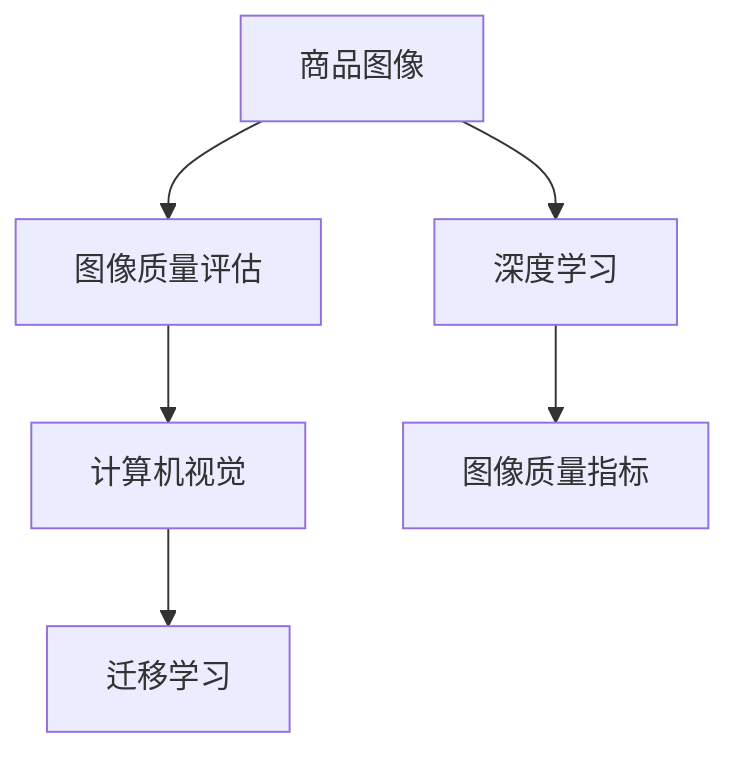

                 

# 深度学习驱动的商品图像质量评估与筛选

## 1. 背景介绍

### 1.1 问题由来
随着电子商务的迅猛发展，商品图像质量评估与筛选已成为电商平台提升用户体验、提升用户满意度、提升销售转化率的重要手段。传统的商品图像质量评估方法主要依赖人工标注，既耗时又容易受到主观偏见的影响。近年来，随着深度学习技术的快速进展，计算机视觉领域涌现了大量先进的图像质量评估方法，其中基于深度学习的商品图像质量评估方法备受关注。

### 1.2 问题核心关键点
商品图像质量评估与筛选的核心在于如何利用深度学习模型对图像质量进行客观、准确的评估。具体而言，评估指标包括清晰度、色彩还原度、构图、光照、噪声等多方面，且不同的指标权重不同。因此，如何设计合理的评估指标体系，并构建一个能够综合多方面因素、具备鲁棒性的深度学习模型，是本文讨论的关键。

## 2. 核心概念与联系

### 2.1 核心概念概述

为更好地理解基于深度学习商品图像质量评估与筛选的原理，本节将介绍几个密切相关的核心概念：

- **商品图像**：指电商平台中商品的图片，包括商品实物图片、背景图片、立体图等。
- **图像质量评估**：指通过一定的方法和手段，对商品图像进行打分或分类，以量化图像质量的优劣程度。
- **深度学习**：指使用深度神经网络对大规模数据进行学习，获取数据的高层次抽象表示。
- **计算机视觉**：指让计算机通过图像、视频等视觉数据理解、分析、生成视觉信息的学科。
- **图像质量指标**：指用于评估图像质量的多项标准，如清晰度、色彩、噪声等。
- **迁移学习**：指将一个领域学习到的知识，迁移应用到另一个不同但相关的领域的学习范式。

这些核心概念之间的逻辑关系可以通过以下Mermaid流程图来展示：



这个流程图展示了几组核心概念之间的逻辑关系：

1. 商品图像是图像质量评估的对象。
2. 深度学习是图像质量评估的主要技术手段。
3. 图像质量指标是评估标准。
4. 计算机视觉提供了图像处理、分析的能力。
5. 迁移学习使得预训练模型可以应用于不同的图像质量评估任务。

这些概念共同构成了商品图像质量评估与筛选的框架，通过理解这些概念，我们可以更好地把握其工作原理和优化方向。

## 3. 核心算法原理 & 具体操作步骤
### 3.1 算法原理概述

基于深度学习商品图像质量评估与筛选，其核心思想是使用深度神经网络对商品图像进行特征提取，并通过训练学习获得对图像质量的高层次抽象表示。具体来说，通过以下几个步骤：

1. **数据准备**：收集商品图像及其质量标签，将图像和标签划分为训练集、验证集和测试集。
2. **模型设计**：选择适合的商品图像质量评估模型，并定义图像质量指标和权重。
3. **模型训练**：使用训练集对模型进行有监督学习，调整模型参数使其能够准确预测商品图像的质量。
4. **模型评估**：在验证集和测试集上对模型进行评估，调整模型参数，优化模型性能。
5. **模型部署**：将训练好的模型部署到电商平台上，实现商品图像的实时质量评估与筛选。

### 3.2 算法步骤详解

#### 3.2.1 数据准备

**步骤1: 数据收集与标注**
- 收集电商平台上商品的图片及其对应的质量标签，作为训练集。
- 对商品图片进行预处理，包括大小调整、归一化等操作，以保证数据的一致性。
- 对标签进行编码，如将“高”、“中”、“低”等分类标签转换为数字形式。

**步骤2: 数据划分**
- 将收集到的数据划分为训练集、验证集和测试集。通常采用70%-20%-10%的比例，确保模型在验证集和测试集上都能泛化良好。

#### 3.2.2 模型设计

**步骤1: 选择模型**
- 根据任务需求，选择合适的深度学习模型，如卷积神经网络（CNN）、残差网络（ResNet）、迁移学习模型（如VGG、Inception）等。
- 设计网络结构，包括卷积层、池化层、全连接层等。

**步骤2: 定义评估指标**
- 根据任务需求，定义多方面的图像质量指标，如清晰度、色彩还原度、构图、光照、噪声等。
- 为每个指标赋予相应的权重，构建加权评估指标。

**步骤3: 损失函数设计**
- 设计一个损失函数，如均方误差损失（MSE）、交叉熵损失等，用于衡量模型预测结果与真实标签之间的差异。
- 引入正则化项，如L2正则化、Dropout等，防止过拟合。

#### 3.2.3 模型训练

**步骤1: 初始化模型**
- 使用预训练的模型权重初始化当前模型，如VGG、Inception等。

**步骤2: 模型训练**
- 在训练集上使用批量随机梯度下降（SGD）、Adam等优化算法训练模型。
- 调整学习率，如使用学习率衰减策略，防止模型过早收敛。

**步骤3: 模型评估与优化**
- 在验证集上评估模型性能，计算损失函数值。
- 根据验证集上的表现调整模型参数，防止过拟合。
- 采用early stopping策略，当模型在验证集上的性能不再提升时停止训练。

#### 3.2.4 模型部署

**步骤1: 模型保存**
- 保存训练好的模型参数，以便后续部署使用。

**步骤2: 部署模型**
- 将模型部署到电商平台上，实现实时商品图像质量评估。
- 设置模型的输入输出格式，确保与电商平台接口兼容。

**步骤3: 实时评估**
- 对电商平台上的实时商品图片进行质量评估，筛选出符合要求的商品。
- 对于不符合要求的图片，及时返回错误提示或进行人工审核。

### 3.3 算法优缺点

基于深度学习商品图像质量评估与筛选方法具有以下优点：

1. **客观准确**：深度学习模型通过学习大量的数据，能够自动提取图像的特征，避免人工标注的主观偏见。
2. **泛化能力强**：模型在训练集上学习到的特征，可以较好地泛化到测试集和实际应用中，提高评估的准确性。
3. **可扩展性强**：模型设计灵活，可以根据任务需求添加或删除层，提升模型的适应性。
4. **实时性高**：模型部署后，可以对实时上传的商品图片进行快速评估与筛选。

同时，该方法也存在一些局限性：

1. **数据依赖性强**：模型性能依赖于训练数据的质量和数量，获取高质量标注数据成本较高。
2. **模型复杂度高**：深度学习模型参数多，训练复杂度高，计算资源消耗大。
3. **鲁棒性不足**：模型对噪声、光照等环境因素较为敏感，可能影响评估结果。
4. **解释性差**：深度学习模型是"黑盒"模型，难以解释其决策过程。
5. **过拟合风险**：模型可能过拟合训练数据，导致评估结果泛化能力下降。

尽管存在这些局限性，但基于深度学习的商品图像质量评估与筛选方法在电商平台的实际应用中已经取得了显著的效果，成为了商品质量筛选的重要手段。

### 3.4 算法应用领域

基于深度学习的商品图像质量评估与筛选方法，已经在电商、影视、广告等多个领域得到广泛应用，具体包括：

1. **电商平台**：对商品图片进行质量评估，筛选出高质量的商品，提升用户体验和满意度。
2. **影视制作**：对影视剧画面质量进行评估，提升制作质量，减少后期制作成本。
3. **广告投放**：对广告图片质量进行评估，确保广告效果。
4. **智能安防**：对视频监控画面质量进行评估，提升监控效果。

除了上述这些领域，基于深度学习的商品图像质量评估与筛选方法还可以应用于更多场景中，如医疗影像、金融风控、工业检测等，为图像处理和分析带来新的突破。

## 4. 数学模型和公式 & 详细讲解 & 举例说明

### 4.1 数学模型构建

本节将使用数学语言对基于深度学习商品图像质量评估与筛选的模型进行更加严格的刻画。

记商品图像为 $X$，其质量标签为 $Y$，模型参数为 $\theta$。假设模型为 $M_{\theta}(X) \in [0,1]$，表示模型对商品图像质量的预测值，其真实值 $Y \in \{0,1\}$。

定义模型在单个图像样本上的损失函数为 $\ell(M_{\theta}(X),Y)$，则在训练集 $D$ 上的经验风险为：

$$
\mathcal{L}(\theta) = \frac{1}{N}\sum_{i=1}^N \ell(M_{\theta}(X_i),Y_i)
$$

其中 $N$ 为训练集样本数。

通常使用交叉熵损失函数作为损失函数：

$$
\ell(M_{\theta}(X_i),Y_i) = -Y_i\log M_{\theta}(X_i) - (1-Y_i)\log(1-M_{\theta}(X_i))
$$

模型训练的目标是最小化经验风险：

$$
\theta^* = \mathop{\arg\min}_{\theta} \mathcal{L}(\theta)
$$

### 4.2 公式推导过程

以图像清晰度评估为例，通过深度学习模型对图像的清晰度进行打分，定义 $M_{\theta}(X)$ 为清晰度评估分数，并定义损失函数为交叉熵损失：

$$
\ell(M_{\theta}(X),Y) = -Y\log M_{\theta}(X) - (1-Y)\log(1-M_{\theta}(X))
$$

将上述损失函数代入经验风险，得到模型训练的目标函数：

$$
\mathcal{L}(\theta) = \frac{1}{N}\sum_{i=1}^N [-Y_i\log M_{\theta}(X_i) - (1-Y_i)\log(1-M_{\theta}(X_i))]
$$

在训练过程中，通过反向传播算法计算损失函数对模型参数 $\theta$ 的梯度：

$$
\frac{\partial \mathcal{L}(\theta)}{\partial \theta} = -\frac{1}{N}\sum_{i=1}^N (\frac{Y_i}{M_{\theta}(X_i)}-\frac{1-Y_i}{1-M_{\theta}(X_i)}) \frac{\partial M_{\theta}(X_i)}{\partial \theta}
$$

其中 $\frac{\partial M_{\theta}(X_i)}{\partial \theta}$ 为模型对图像 $X_i$ 的预测输出对模型参数 $\theta$ 的梯度，通过链式法则递归展开计算。

### 4.3 案例分析与讲解

以VGG模型为例，展示如何构建基于深度学习的商品图像质量评估模型。

**步骤1: 数据准备**
- 收集电商平台商品图片及其质量标签，并预处理图像。
- 将标签进行编码，如将“高”、“中”、“低”等分类标签转换为数字形式。

**步骤2: 模型设计**
- 使用VGG网络结构，定义多方面的图像质量指标，如清晰度、色彩还原度、构图、光照、噪声等。
- 为每个指标赋予相应的权重，构建加权评估指标。

**步骤3: 模型训练**
- 使用预训练的VGG模型权重初始化当前模型。
- 在训练集上使用批量随机梯度下降（SGD）、Adam等优化算法训练模型。
- 调整学习率，如使用学习率衰减策略，防止模型过早收敛。

**步骤4: 模型评估与优化**
- 在验证集上评估模型性能，计算损失函数值。
- 根据验证集上的表现调整模型参数，防止过拟合。
- 采用early stopping策略，当模型在验证集上的性能不再提升时停止训练。

## 5. 项目实践：代码实例和详细解释说明
### 5.1 开发环境搭建

在进行深度学习商品图像质量评估与筛选项目实践前，我们需要准备好开发环境。以下是使用Python进行TensorFlow开发的环境配置流程：

1. 安装Anaconda：从官网下载并安装Anaconda，用于创建独立的Python环境。

2. 创建并激活虚拟环境：
```bash
conda create -n tf-env python=3.8 
conda activate tf-env
```

3. 安装TensorFlow：根据CUDA版本，从官网获取对应的安装命令。例如：
```bash
conda install tensorflow tensorflow-gpu -c conda-forge
```

4. 安装必要的库：
```bash
pip install numpy scipy matplotlib scikit-image scikit-learn tqdm
```

完成上述步骤后，即可在`tf-env`环境中开始项目实践。

### 5.2 源代码详细实现

以下是一个使用VGG模型进行商品图像质量评估的Python代码实现：

```python
import tensorflow as tf
import numpy as np
import matplotlib.pyplot as plt
import skimage.io
import skimage.transform
from skimage.transform import resize
from sklearn.model_selection import train_test_split

# 定义模型
model = tf.keras.applications.VGG16(weights='imagenet', include_top=False, input_shape=(224, 224, 3))

# 定义数据集
train_images = ...
train_labels = ...

# 数据增强
data_augmentation = tf.keras.Sequential([
    tf.keras.layers.experimental.preprocessing.RandomFlip('horizontal'),
    tf.keras.layers.experimental.preprocessing.RandomRotation(0.2),
    tf.keras.layers.experimental.preprocessing.RandomZoom(0.2),
    tf.keras.layers.experimental.preprocessing.RandomContrast(0.2)
])

# 定义训练集
train_dataset = tf.data.Dataset.from_tensor_slices((train_images, train_labels))
train_dataset = train_dataset.map(lambda x, y: (data_augmentation(x), y))
train_dataset = train_dataset.batch(32)
train_dataset = train_dataset.shuffle(10000)

# 定义测试集
test_images = ...
test_labels = ...
test_dataset = tf.data.Dataset.from_tensor_slices((test_images, test_labels))
test_dataset = test_dataset.batch(32)

# 定义评估指标
class Accuracy(tf.keras.metrics.Metric):
    def __init__(self):
        super(Accuracy, self).__init__(name='Accuracy')
        self.total = self.add_weight(name='total', initializer='zeros')
        self.correct = self.add_weight(name='correct', initializer='zeros')

    def update_state(self, y_true, y_pred):
        y_pred = tf.cast(tf.round(y_pred), tf.int32)
        self.correct.assign_add(tf.reduce_sum(tf.cast(tf.equal(y_true, y_pred), tf.int32)))
        self.total.assign_add(tf.size(y_true))

    def result(self):
        return self.correct / self.total

# 定义损失函数
loss_fn = tf.keras.losses.BinaryCrossentropy()

# 定义优化器
optimizer = tf.keras.optimizers.Adam(learning_rate=1e-4)

# 定义训练过程
@tf.function
def train_step(images, labels):
    with tf.GradientTape() as tape:
        predictions = model(images, training=True)
        loss_value = loss_fn(labels, predictions)
    gradients = tape.gradient(loss_value, model.trainable_variables)
    optimizer.apply_gradients(zip(gradients, model.trainable_variables))

# 定义评估过程
@tf.function
def evaluate_step(images, labels):
    predictions = model(images, training=False)
    accuracy = Accuracy()
    accuracy.update_state(labels, predictions)
    return accuracy.result()

# 定义模型评估函数
def evaluate(model, test_dataset):
    test_predictions = []
    test_labels = []
    for batch_images, batch_labels in test_dataset:
        test_predictions.append(model(batch_images, training=False))
        test_labels.append(batch_labels)
    test_predictions = np.concatenate(test_predictions)
    test_labels = np.concatenate(test_labels)
    return tf.keras.metrics.Accuracy()(test_labels, test_predictions)

# 训练模型
epochs = 10
batch_size = 32

for epoch in range(epochs):
    for batch_images, batch_labels in train_dataset:
        train_step(batch_images, batch_labels)
        if (epoch + 1) % 10 == 0:
            print('Epoch', epoch + 1, 'accuracy:', evaluate(model, test_dataset))
```

### 5.3 代码解读与分析

让我们再详细解读一下关键代码的实现细节：

**VGG模型**：
- `model = tf.keras.applications.VGG16(...)`：加载预训练的VGG16模型，包括16个卷积层和全连接层。

**数据集准备**：
- `train_images = ...` 和 `train_labels = ...`：加载训练集和测试集，并对其进行预处理。
- `data_augmentation`：定义数据增强策略，包括随机翻转、旋转、缩放、对比度调整等。

**数据集构建**：
- `train_dataset = ...`：构建训练集数据集，包括数据增强和批处理。
- `test_dataset = ...`：构建测试集数据集，不包括数据增强。

**评估指标定义**：
- `Accuracy`：自定义评估指标，用于计算准确率。

**损失函数定义**：
- `loss_fn = tf.keras.losses.BinaryCrossentropy()`：定义二分类交叉熵损失函数，用于衡量模型预测结果与真实标签之间的差异。

**优化器定义**：
- `optimizer = tf.keras.optimizers.Adam(learning_rate=1e-4)`：定义Adam优化器，学习率为1e-4。

**训练过程定义**：
- `train_step`：定义一个训练步骤函数，用于计算损失并更新模型参数。
- `evaluate_step`：定义一个评估步骤函数，用于计算评估指标。

**模型评估函数定义**：
- `evaluate`：定义一个模型评估函数，用于在测试集上评估模型性能。

**训练流程**：
- `for epoch in range(epochs)`：循环训练多个epoch。
- 每个epoch内，对训练集进行批处理训练，并定期在测试集上评估模型性能。

可以看到，TensorFlow配合自定义模型和评估指标，使得商品图像质量评估的代码实现变得简洁高效。开发者可以将更多精力放在模型优化和数据处理等高层逻辑上，而不必过多关注底层的实现细节。

当然，工业级的系统实现还需考虑更多因素，如模型的保存和部署、超参数的自动搜索、更灵活的任务适配层等。但核心的评估范式基本与此类似。

## 6. 实际应用场景

### 6.1 电商平台商品质量筛选

基于深度学习商品图像质量评估与筛选方法，可以在电商平台上对商品图像进行实时质量评估和筛选，确保平台上的商品图片质量符合标准。具体实现流程如下：

1. **数据准备**：收集电商平台上商品的图片及其质量标签，作为训练集。
2. **模型训练**：使用深度学习模型对商品图片进行质量评估，优化模型参数。
3. **模型部署**：将训练好的模型部署到电商平台上，实现实时商品图像质量评估。
4. **商品筛选**：对电商平台上的实时商品图片进行质量评估，筛选出符合要求的商品。
5. **用户反馈**：根据用户对商品质量的反馈，不断优化模型和筛选标准。

通过以上流程，电商平台可以实现自动化的商品质量评估与筛选，大大提高用户体验和满意度，同时减少人工审核成本。

### 6.2 影视制作质量控制

在影视制作过程中，对画面质量进行评估和筛选是至关重要的。基于深度学习商品图像质量评估与筛选方法，可以对影视剧画面质量进行评估，确保每一帧画面的清晰度、色彩还原度和构图等指标符合要求。具体实现流程如下：

1. **数据准备**：收集影视剧制作过程中的帧画面及其质量标签，作为训练集。
2. **模型训练**：使用深度学习模型对画面质量进行评估，优化模型参数。
3. **模型部署**：将训练好的模型部署到影视制作流程中，实现实时画面质量评估。
4. **质量控制**：对每一帧画面进行质量评估，筛选出符合要求的图片。
5. **反馈改进**：根据评估结果，优化影视剧的制作流程，提高画面质量。

通过以上流程，影视制作团队可以实现自动化的画面质量评估与筛选，提升制作质量，减少后期制作成本。

### 6.3 广告投放质量评估

在广告投放过程中，对广告图片质量进行评估是关键步骤之一。基于深度学习商品图像质量评估与筛选方法，可以对广告图片进行质量评估，确保广告效果。具体实现流程如下：

1. **数据准备**：收集广告图片及其质量标签，作为训练集。
2. **模型训练**：使用深度学习模型对广告图片进行质量评估，优化模型参数。
3. **模型部署**：将训练好的模型部署到广告投放系统中，实现实时广告图片质量评估。
4. **广告筛选**：对每一幅广告图片进行质量评估，筛选出符合要求的图片。
5. **投放优化**：根据评估结果，优化广告投放策略，提高广告效果。

通过以上流程，广告投放团队可以实现自动化的广告图片质量评估与筛选，确保广告投放效果。

### 6.4 未来应用展望

随着深度学习技术的发展，基于深度学习的商品图像质量评估与筛选方法将不断拓展应用领域，带来更多创新。

1. **医疗影像质量评估**：在医疗影像领域，基于深度学习的图像质量评估方法可以用于评估影像质量，确保医疗影像的高质量。
2. **金融风控质量评估**：在金融风控领域，基于深度学习的图像质量评估方法可以用于评估金融产品的质量，确保产品合规性。
3. **智能安防质量评估**：在智能安防领域，基于深度学习的图像质量评估方法可以用于评估视频监控画面质量，确保监控效果。

除了上述这些领域，基于深度学习的商品图像质量评估与筛选方法还可以应用于更多场景中，为图像处理和分析带来新的突破。

## 7. 工具和资源推荐
### 7.1 学习资源推荐

为了帮助开发者系统掌握深度学习商品图像质量评估与筛选的理论基础和实践技巧，这里推荐一些优质的学习资源：

1. **《深度学习》课程**：斯坦福大学Andrew Ng教授开设的深度学习课程，系统讲解了深度学习的基本概念和核心算法，适合初学者入门。
2. **《计算机视觉：模型、学习和推理》书籍**：Ian Goodfellow等合著的计算机视觉经典书籍，详细介绍了计算机视觉的理论基础和应用实践，是深度学习领域不可或缺的参考资料。
3. **TensorFlow官方文档**：TensorFlow官方提供的文档和教程，详细介绍了TensorFlow的使用方法和最佳实践，适合开发者深入学习。
4. **Kaggle平台**：Kaggle是一个数据科学竞赛平台，提供了大量深度学习竞赛和数据集，开发者可以通过参与竞赛提升技能。
5. **GitHub代码库**：GitHub是一个开源代码托管平台，开发者可以通过搜索和克隆其他人的代码，学习先进的深度学习算法和应用实践。

通过对这些资源的学习实践，相信你一定能够快速掌握深度学习商品图像质量评估与筛选的精髓，并用于解决实际的图像质量问题。
###  7.2 开发工具推荐

高效的开发离不开优秀的工具支持。以下是几款用于深度学习商品图像质量评估与筛选开发的常用工具：

1. **TensorFlow**：Google开发的深度学习框架，支持灵活的网络结构设计和优化算法。
2. **Keras**：高层次的神经网络API，适合快速原型开发和模型训练。
3. **Jupyter Notebook**：开源的交互式开发环境，支持Python和其他语言，适合代码调试和文档记录。
4. **Matplotlib**：Python绘图库，用于绘制模型训练和评估的图表。
5. **Numpy**：Python科学计算库，用于高效地处理数值数据。

合理利用这些工具，可以显著提升深度学习商品图像质量评估与筛选的开发效率，加快创新迭代的步伐。

### 7.3 相关论文推荐

深度学习商品图像质量评估与筛选技术的发展源于学界的持续研究。以下是几篇奠基性的相关论文，推荐阅读：

1. **ImageNet Classification with Deep Convolutional Neural Networks**：Alex Krizhevsky等提出的基于卷积神经网络的ImageNet图像分类方法，奠定了深度学习在图像处理领域的地位。
2. **Very Deep Convolutional Networks for Large-Scale Image Recognition**：Karen Simonyan和Andrew Zisserman提出的VGG网络，展示了深度卷积神经网络的强大分类能力。
3. **Inception Architecture for Computer Vision**：Google Brain团队提出的Inception网络，提升了深度神经网络的计算效率和性能。
4. **Deep Residual Learning for Image Recognition**：Kaiming He等提出的ResNet网络，解决了深度神经网络的退化问题，推动了深度学习的发展。
5. **Fine-Grained Image Classification with Deep CNNs**：Jifeng Dai等提出的Fine-Grained Image Classification方法，展示了深度学习在细粒度图像分类上的卓越表现。

这些论文代表了大规模图像质量评估与筛选技术的发展脉络。通过学习这些前沿成果，可以帮助研究者把握学科前进方向，激发更多的创新灵感。

## 8. 总结：未来发展趋势与挑战

### 8.1 总结

本文对基于深度学习商品图像质量评估与筛选方法进行了全面系统的介绍。首先阐述了深度学习在图像质量评估中的应用背景和意义，明确了评估指标体系设计和模型优化的方法。其次，从原理到实践，详细讲解了深度学习模型的构建、训练和评估过程，给出了代码实现。同时，本文还广泛探讨了深度学习模型在电商、影视、广告等多个领域的应用前景，展示了模型评估的巨大潜力。此外，本文精选了深度学习商品图像质量评估与筛选技术的各类学习资源，力求为开发者提供全方位的技术指引。

通过本文的系统梳理，可以看到，基于深度学习的商品图像质量评估与筛选技术正在成为电商平台、影视制作、广告投放等领域的重要手段，显著提升了用户体验和满意度，减少了人工审核成本。未来，伴随深度学习技术的发展，基于深度学习的商品图像质量评估与筛选方法将不断拓展应用领域，为图像处理和分析带来新的突破。

### 8.2 未来发展趋势

展望未来，深度学习商品图像质量评估与筛选技术将呈现以下几个发展趋势：

1. **多模态数据融合**：深度学习模型不仅可以处理图像数据，还可以处理文本、音频等多模态数据，进一步提升评估的全面性和准确性。
2. **自动化评估体系**：随着自动化评估技术的发展，深度学习模型将更加智能化，能够自动进行图像质量评估和筛选，减少人工干预。
3. **模型轻量化**：随着移动端设备的普及，深度学习模型需要更加轻量化，以适应移动设备的高性能要求。
4. **实时性增强**：深度学习模型需要具备更高的实时性，以满足实时图像质量评估的需求。
5. **跨平台适用性**：深度学习模型需要具备更好的跨平台适用性，能够在不同的硬件设备上高效运行。

以上趋势凸显了深度学习商品图像质量评估与筛选技术的广阔前景。这些方向的探索发展，必将进一步提升图像评估的效率和效果，为深度学习技术在实际应用中的广泛应用铺平道路。

### 8.3 面临的挑战

尽管基于深度学习的商品图像质量评估与筛选技术已经取得了显著的效果，但在迈向更加智能化、普适化应用的过程中，它仍面临一些挑战：

1. **数据依赖性强**：深度学习模型性能依赖于训练数据的质量和数量，获取高质量标注数据成本较高。
2. **计算资源消耗大**：深度学习模型参数多，计算资源消耗大，需要高性能设备支持。
3. **模型复杂度高**：深度学习模型结构复杂，训练过程复杂，调试困难。
4. **模型鲁棒性不足**：深度学习模型对噪声、光照等环境因素较为敏感，可能影响评估结果。
5. **解释性差**：深度学习模型是"黑盒"模型，难以解释其决策过程。

尽管存在这些挑战，但基于深度学习的商品图像质量评估与筛选技术在实际应用中已经取得了显著的效果，成为了图像质量评估与筛选的重要手段。未来，需要通过更多的研究，探索新的模型结构和优化算法，提高模型的解释性和鲁棒性，降低数据依赖性和计算资源消耗。

### 8.4 研究展望

面对深度学习商品图像质量评估与筛选技术所面临的挑战，未来的研究需要在以下几个方面寻求新的突破：

1. **数据增强**：通过数据增强技术，扩展训练集，提高模型泛化能力。
2. **模型轻量化**：探索轻量级深度学习模型，减少计算资源消耗。
3. **多模态融合**：引入多模态数据融合技术，提高评估的全面性和准确性。
4. **跨领域迁移**：探索跨领域迁移学习技术，提升模型在不同场景下的适用性。
5. **模型解释**：引入模型解释技术，提升模型的可解释性，帮助用户理解评估结果。

这些研究方向将推动深度学习商品图像质量评估与筛选技术的不断进步，为图像处理和分析带来新的突破。相信随着学界和产业界的共同努力，深度学习商品图像质量评估与筛选技术必将取得更大的进展，为电商、影视、广告等领域带来更高效的图像质量评估与筛选解决方案。

## 9. 附录：常见问题与解答

**Q1：深度学习商品图像质量评估与筛选的原理是什么？**

A: 深度学习商品图像质量评估与筛选的原理是使用深度神经网络对商品图像进行特征提取，并通过训练学习获得对图像质量的高层次抽象表示。具体来说，通过以下步骤：

1. **数据准备**：收集商品图像及其质量标签，并对其进行预处理。
2. **模型设计**：选择适合的商品图像质量评估模型，并定义图像质量指标和权重。
3. **模型训练**：在训练集上使用深度学习模型对商品图像进行质量评估，优化模型参数。
4. **模型评估**：在验证集和测试集上对模型进行评估，调整模型参数，优化模型性能。
5. **模型部署**：将训练好的模型部署到电商平台上，实现实时商品图像质量评估。

**Q2：如何选择适合的商品图像质量评估模型？**

A: 选择适合的商品图像质量评估模型需要考虑以下因素：

1. **模型性能**：评估模型的准确率和鲁棒性。
2. **模型复杂度**：评估模型的参数量和计算复杂度。
3. **模型可解释性**：评估模型的可解释性，便于理解和优化。
4. **模型可扩展性**：评估模型的可扩展性和适应性，以便应对新的评估需求。

常用的模型包括卷积神经网络（CNN）、残差网络（ResNet）、迁移学习模型（如VGG、Inception）等。

**Q3：如何设计合适的评估指标？**

A: 设计合适的评估指标需要考虑以下因素：

1. **指标权重**：根据任务需求，定义各个评估指标的权重，构建加权评估指标。
2. **指标含义**：确保每个评估指标有明确的定义和计算方法。
3. **指标可解释性**：确保评估指标具有较高的可解释性，便于理解和优化。

常用的指标包括清晰度、色彩还原度、构图、光照、噪声等。

**Q4：如何训练深度学习模型？**

A: 训练深度学习模型需要以下步骤：

1. **数据准备**：收集商品图像及其质量标签，并对其进行预处理。
2. **模型选择**：选择适合的商品图像质量评估模型。
3. **模型训练**：在训练集上使用深度学习模型对商品图像进行质量评估，优化模型参数。
4. **模型评估**：在验证集和测试集上对模型进行评估，调整模型参数，优化模型性能。
5. **模型部署**：将训练好的模型部署到电商平台上，实现实时商品图像质量评估。

可以通过TensorFlow等深度学习框架实现模型的训练和评估。

**Q5：深度学习模型在实际应用中如何优化？**

A: 深度学习模型在实际应用中的优化需要考虑以下因素：

1. **数据增强**：通过数据增强技术，扩展训练集，提高模型泛化能力。
2. **模型轻量化**：探索轻量级深度学习模型，减少计算资源消耗。
3. **模型解释**：引入模型解释技术，提升模型的可解释性，帮助用户理解评估结果。
4. **超参数调优**：通过超参数调优，优化模型性能。

可以通过模型微调、参数剪枝、量化等技术进行优化。

**Q6：深度学习模型如何应对图像质量评估中的挑战？**

A: 深度学习模型在图像质量评估中面临的挑战包括：

1. **数据依赖性强**：通过数据增强技术，扩展训练集，提高模型泛化能力。
2. **计算资源消耗大**：探索轻量级深度学习模型，减少计算资源消耗。
3. **模型复杂度高**：探索可解释性强的模型，提升模型的可解释性。
4. **模型鲁棒性不足**：引入鲁棒性优化技术，提高模型的鲁棒性。

可以通过模型微调、参数剪枝、量化等技术进行优化。

作者：禅与计算机程序设计艺术 / Zen and the Art of Computer Programming

