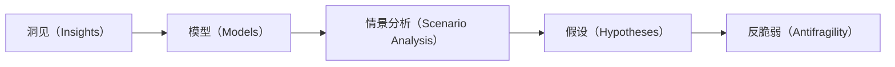

                 

# 深度思考:拉开管理者差距的关键

在快节奏、高竞争的现代商业环境中，优秀的管理者不仅需要具备深厚的技术知识，更需要拥有卓越的深度思考能力。深度思考是管理者从繁杂事务中脱身，洞察业务本质，做出前瞻性决策的重要工具。本文将深入探讨深度思考在管理中的应用，并剖析如何通过深度思考拉开管理者之间的差距。

## 1. 背景介绍

### 1.1 问题由来
深度思考（Deep Thinking）并非新概念，但它的重要性在当今商业环境中尤为凸显。现代企业面临的挑战和机遇远超以往，管理者需要从繁杂的信息和数据中提炼出关键洞见，做出正确决策。深度思考帮助管理者从细节中发现趋势，从纷扰中理清线索，从而在复杂多变的商业环境中始终保持竞争力。

### 1.2 问题核心关键点
深度思考的核心在于：
- **洞见提取**：从海量数据中提取有价值的洞见，指导决策。
- **趋势预测**：预判市场和技术趋势，做出预见性决策。
- **问题解决**：系统性分析问题，找到根本解决方案。
- **风险管理**：评估决策风险，制定预案。
- **创新驱动**：推动组织创新，不断优化业务模式。

深度思考的这些核心能力，是拉开管理者差距的关键所在。

## 2. 核心概念与联系

### 2.1 核心概念概述

深度思考不仅是一种思维方式，更是一种系统化、结构化的分析过程。以下概念构成了深度思考的核心框架：

- **洞见（Insights）**：通过分析数据和信息，提炼出能够指导决策的关键洞见。
- **模型（Models）**：建立模型来模拟和预测趋势，帮助管理者进行决策。
- **情景分析（Scenario Analysis）**：分析不同情景下的可能影响，评估决策风险。
- **假设（Hypotheses）**：基于现有信息提出假设，进行验证和迭代。
- **反脆弱（Antifragility）**：构建反脆弱系统，应对不确定性和风险。

这些概念通过一个简单的Mermaid流程图展示，帮助理解它们之间的联系：



### 2.2 核心概念原理和架构

深度思考的原理基于系统化分析与逻辑推理。它通过以下几个步骤实现：

1. **数据收集**：收集与业务相关的数据和信息。
2. **数据分析**：使用统计学、机器学习等工具分析数据，提取洞见。
3. **模型构建**：根据洞见构建预测模型，模拟未来趋势。
4. **情景模拟**：考虑不同情景下的影响，进行风险评估。
5. **假设验证**：基于现有信息提出假设，进行实验验证。
6. **迭代改进**：根据实验结果调整模型和假设，持续改进。

这种结构化分析框架，确保了深度思考的逻辑性和系统性。

## 3. 核心算法原理 & 具体操作步骤

### 3.1 算法原理概述

深度思考的算法原理主要基于统计学、机器学习和运筹学，旨在通过系统化分析，从复杂的数据中提取洞见和指导决策。其核心在于数据驱动的决策制定，避免了基于直觉或经验的决策偏见。

### 3.2 算法步骤详解

深度思考的算法步骤包括：

1. **数据预处理**：清洗、归一化、分割数据，为分析准备数据集。
2. **特征提取**：使用统计学、机器学习等方法，提取数据的关键特征。
3. **模型训练**：使用监督学习、无监督学习或强化学习等方法，训练预测模型。
4. **情景模拟**：基于模型结果，进行情景分析，评估不同决策的可能影响。
5. **假设验证**：提出假设，设计实验验证假设的正确性。
6. **迭代改进**：根据实验结果调整模型和假设，持续优化决策过程。

### 3.3 算法优缺点

深度思考算法具有以下优点：

- **数据驱动**：决策过程基于数据，避免了人为偏见。
- **系统性**：分析过程系统化，确保逻辑性和全面性。
- **可重复性**：分析过程可重复，便于持续优化。

同时，它也存在一些缺点：

- **数据依赖**：数据质量直接影响分析结果，需要高质量的数据支撑。
- **复杂性**：分析过程复杂，对数据科学和统计学要求较高。
- **资源消耗**：需要较高的计算资源和时间成本。

### 3.4 算法应用领域

深度思考算法在多个领域中得到了广泛应用，包括但不限于：

- **金融分析**：通过分析历史数据，预测市场趋势，制定投资策略。
- **市场营销**：分析消费者行为，识别市场机会，优化营销策略。
- **供应链管理**：预测需求变化，优化库存和物流。
- **人力资源管理**：分析员工绩效数据，优化招聘和培训策略。
- **产品开发**：基于用户反馈和市场数据，指导产品设计和迭代。

## 4. 数学模型和公式 & 详细讲解 & 举例说明

### 4.1 数学模型构建

深度思考的数学模型构建基于统计学和机器学习的基本原理。以下以回归分析模型为例，展示其构建过程：

设有一个数据集 $D = \{(x_i, y_i)\}_{i=1}^N$，其中 $x$ 为输入特征，$y$ 为输出目标。目标是根据历史数据构建一个回归模型，预测新数据点的输出值。

### 4.2 公式推导过程

回归分析模型的目标是最小化预测误差 $e$。设模型为 $f(x;\theta) = \theta_0 + \theta_1 x_1 + \cdots + \theta_p x_p$，其中 $\theta = (\theta_0, \theta_1, \cdots, \theta_p)$ 为模型参数。

最小化预测误差的公式为：

$$
\min_{\theta} \sum_{i=1}^N e_i^2
$$

其中 $e_i = y_i - f(x_i;\theta)$ 为预测误差。

### 4.3 案例分析与讲解

假设有一个电商平台，收集了用户购买数据和产品评价数据，目标是预测新产品的销售额。使用回归分析模型，可以提取用户特征（如年龄、性别、购买历史等），训练预测模型，从而优化新产品的营销策略。

## 5. 项目实践：代码实例和详细解释说明

### 5.1 开发环境搭建

为了实现深度思考的算法，需要准备Python开发环境，并安装必要的库。

1. 安装Anaconda：从官网下载并安装Anaconda，用于创建独立的Python环境。

2. 创建并激活虚拟环境：
```bash
conda create -n pyenv python=3.8 
conda activate pyenv
```

3. 安装必要的库：
```bash
conda install pandas numpy matplotlib scikit-learn seaborn
```

完成环境配置后，即可开始编写深度思考算法代码。

### 5.2 源代码详细实现

以下是一个简单的Python代码示例，展示如何使用Scikit-learn库实现回归分析模型：

```python
import pandas as pd
from sklearn.linear_model import LinearRegression
from sklearn.model_selection import train_test_split
from sklearn.metrics import mean_squared_error

# 加载数据集
data = pd.read_csv('sales_data.csv')

# 数据预处理
X = data[['age', 'gender', 'purchase_history']]
y = data['sales']

# 分割数据集
X_train, X_test, y_train, y_test = train_test_split(X, y, test_size=0.2, random_state=42)

# 构建模型并训练
model = LinearRegression()
model.fit(X_train, y_train)

# 预测并评估
y_pred = model.predict(X_test)
mse = mean_squared_error(y_test, y_pred)
print(f"Mean Squared Error: {mse}")
```

### 5.3 代码解读与分析

**数据预处理**：使用Pandas库对数据进行清洗、归一化和分割。

**模型训练**：使用Scikit-learn库的LinearRegression模型，对训练数据进行回归分析。

**预测评估**：使用均方误差（MSE）评估模型预测性能。

### 5.4 运行结果展示

运行上述代码，输出均方误差，评估模型预测效果。如果误差较小，说明模型拟合效果较好。

## 6. 实际应用场景

深度思考在实际应用中发挥着重要作用，以下是几个典型应用场景：

### 6.1 金融投资

在金融投资中，深度思考用于预测市场趋势，制定投资策略。通过分析历史价格、交易量、新闻等信息，构建预测模型，进行风险评估和收益预测。

### 6.2 市场营销

市场营销中，深度思考用于分析消费者行为，识别市场机会，优化营销策略。通过分析购买数据、浏览记录、社交媒体信息等，构建消费者行为模型，指导广告投放和促销策略。

### 6.3 供应链管理

供应链管理中，深度思考用于优化库存和物流。通过预测需求变化，优化库存水平，减少供应链风险。

### 6.4 人力资源管理

人力资源管理中，深度思考用于优化招聘和培训策略。通过分析员工绩效数据，识别关键因素，制定培训计划和招聘标准。

## 7. 工具和资源推荐

### 7.1 学习资源推荐

为了掌握深度思考的应用，推荐以下学习资源：

1. 《深入浅出统计学》：系统讲解统计学基础知识，适合初学者。

2. 《机器学习实战》：通过实际项目，展示机器学习算法应用。

3. 《数据分析实战》：展示数据分析和数据可视化技巧。

4. 《预测模型应用》：详细介绍回归分析、分类分析等模型构建方法。

5. 在线课程：如Coursera上的“机器学习”课程，Kaggle上的数据分析竞赛，提供实践机会。

### 7.2 开发工具推荐

为了实现深度思考算法，推荐以下开发工具：

1. Python：强大的编程语言，支持大量数据科学和机器学习库。

2. Jupyter Notebook：交互式编程环境，便于数据分析和模型训练。

3. Scikit-learn：Python数据科学库，提供广泛的数据分析和机器学习工具。

4. TensorFlow：Google开发的深度学习框架，支持大规模模型训练。

5. Keras：高层次的深度学习库，易于上手。

### 7.3 相关论文推荐

深度思考的原理和应用在学术界和工业界得到了广泛研究。以下是几篇代表性论文：

1. 《回归分析方法与应用》：系统讲解回归分析的基本原理和应用场景。

2. 《统计学习方法》：介绍统计学习的基本方法和应用。

3. 《深度学习》：深度学习领域的经典教材，涵盖神经网络、深度学习算法等。

4. 《机器学习实战》：通过实际项目，展示机器学习算法应用。

5. 《数据科学与人工智能》：综述数据科学和人工智能领域的最新进展。

## 8. 总结：未来发展趋势与挑战

### 8.1 研究成果总结

深度思考作为现代管理的核心能力，其应用和研究取得了显著进展。通过数据驱动的决策制定，系统化的分析框架，深度思考帮助管理者从海量数据中提炼洞见，做出前瞻性决策。

### 8.2 未来发展趋势

未来，深度思考将进一步融合更多技术，如人工智能、大数据分析、区块链等，提升决策的精确性和可重复性。

### 8.3 面临的挑战

尽管深度思考在管理中的应用前景广阔，但也面临一些挑战：

1. **数据质量**：数据质量直接影响分析结果，需要高质量的数据支撑。
2. **算法复杂性**：深度思考的算法复杂，需要较高的技术门槛。
3. **资源消耗**：模型训练和分析需要较高的计算资源和时间成本。
4. **解释性**：深度思考模型往往缺乏可解释性，难以理解其内部工作机制。

### 8.4 研究展望

未来，深度思考的研究需要关注以下几个方向：

1. **数据治理**：提升数据质量和数据可用性，为深度思考提供坚实基础。

2. **模型可解释性**：提高模型的可解释性，帮助管理者理解和信任模型结果。

3. **自动化**：开发自动化工具，降低技术门槛，提高深度思考应用的普及度。

4. **多学科融合**：深度思考需要与其他学科（如心理学、经济学等）结合，提升决策的全面性和合理性。

## 9. 附录：常见问题与解答

**Q1：如何提升深度思考能力？**

A: 提升深度思考能力需要多方面的努力：

1. **学习基本理论**：掌握统计学、机器学习等基础知识，理解深度思考的原理。

2. **实践项目**：通过实际项目应用深度思考算法，积累经验。

3. **多学科学习**：了解其他学科（如经济学、心理学等）的知识，提升综合分析能力。

4. **持续思考**：培养日常思考和分析的习惯，不断提升思维深度。

**Q2：深度思考与直觉决策的差异是什么？**

A: 深度思考与直觉决策的差异在于：

1. **数据驱动**：深度思考基于数据和逻辑，而非直觉或经验。

2. **系统性**：深度思考采用系统化方法，确保全面性和逻辑性。

3. **可重复性**：深度思考的分析和决策过程可重复，便于持续优化。

4. **风险管理**：深度思考考虑风险，评估不同决策的后果。

**Q3：深度思考是否适用于所有管理决策？**

A: 深度思考适用于复杂度高、数据量大的决策场景，如市场预测、投资策略、产品优化等。对于一些简单的日常决策，直接依靠经验或直觉即可。

---

作者：禅与计算机程序设计艺术 / Zen and the Art of Computer Programming

