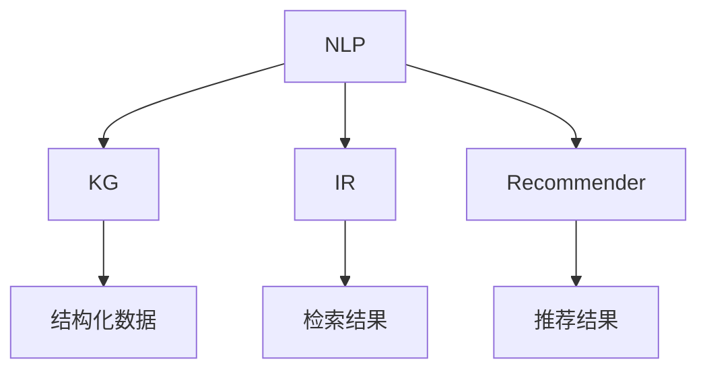

                 

# 激发好奇心：AI搜索的独特优势

> 关键词：AI搜索, 好奇心, 知识图谱, 信息检索, 自然语言处理, 推荐系统

## 1. 背景介绍

### 1.1 问题由来

在信息爆炸的时代，如何从海量数据中找到所需信息，成为了人们日常生活和工作中面临的一项巨大挑战。搜索引擎作为连接用户与信息的主要桥梁，正面临前所未有的需求与挑战。传统的搜索引擎依赖于关键词匹配和链接跳转的逻辑，难以理解用户真正的查询意图。而人工智能（AI）搜索技术的出现，通过自然语言处理、知识图谱、推荐系统等前沿技术，大大提升了信息检索的效率和质量，为好奇心驱动的探索式搜索开辟了新天地。

### 1.2 问题核心关键点

AI搜索技术的核心在于其能够理解用户的查询意图，并自动生成与用户好奇心相关的搜索结果。其关键点包括：

- **自然语言处理（NLP）**：通过理解自然语言，搜索引擎能够更准确地捕捉用户的查询需求。
- **知识图谱（KG）**：构建知识图谱，将结构化数据与自然语言连接，提升查询的深度和广度。
- **推荐系统（Recommender）**：根据用户的历史行为和兴趣，自动推荐相关信息，满足用户的好奇心探索。
- **信息检索（IR）**：提高检索算法，减少噪音，使搜索结果更加精准。

本文将系统介绍AI搜索的核心技术，探讨其在多场景中的应用优势，并展望未来的发展趋势。

## 2. 核心概念与联系

### 2.1 核心概念概述

为了更好地理解AI搜索的核心技术，本节将介绍几个密切相关的核心概念：

- **自然语言处理（NLP）**：利用计算机处理、理解、分析、生成人类语言的技术，是AI搜索技术的基础。
- **知识图谱（KG）**：通过图形化的方式存储和表示实体及其之间的关系，提供结构化数据支持。
- **信息检索（IR）**：从大量文本中检索相关信息的技术，是AI搜索的核心部分。
- **推荐系统（Recommender）**：通过分析用户的历史行为，推荐可能感兴趣的内容，增强用户探索欲望。

这些核心概念之间的逻辑关系可以通过以下Mermaid流程图来展示：



这个流程图展示了自然语言处理、知识图谱、信息检索和推荐系统之间的联系与合作，共同构成了AI搜索的核心技术框架。

## 3. 核心算法原理 & 具体操作步骤

### 3.1 算法原理概述

AI搜索的算法原理基于对用户查询意图的深度理解和多样化的信息源整合。具体流程如下：

1. **自然语言处理（NLP）**：通过分词、词性标注、实体识别等技术，解析用户查询中的语义信息。
2. **知识图谱（KG）**：根据查询意图，从知识图谱中提取相关实体和关系。
3. **信息检索（IR）**：将查询与数据库、网页、文档等资源进行匹配，筛选出最相关的结果。
4. **推荐系统（Recommender）**：基于用户的历史行为和兴趣，推荐更多相关信息，满足用户好奇心。

### 3.2 算法步骤详解

基于上述原理，AI搜索的具体操作步骤如下：

**Step 1: 数据预处理**

- 对用户查询进行分词、去停用词、词性标注、实体识别等预处理操作。
- 将查询转化为标准化的向量表示，便于后续的匹配和检索。

**Step 2: 知识图谱查询**

- 根据用户查询中的关键词，在知识图谱中查找相关的实体和关系。
- 使用基于图神经网络（GNN）等方法，计算查询与知识图谱之间的相似度。

**Step 3: 信息检索**

- 将查询与数据库、网页、文档等进行匹配，计算匹配度。
- 使用倒排索引、BM25等经典算法，减少噪音，提高检索效率。

**Step 4: 结果排序**

- 结合知识图谱和信息检索的结果，进行综合排序。
- 使用机器学习算法（如AdaBoost、RankNet等），优化排序结果，提升用户体验。

**Step 5: 推荐系统**

- 根据用户的历史行为和兴趣，自动推荐相关内容。
- 使用协同过滤、基于内容的推荐、深度学习推荐模型等技术，增强用户探索欲望。

### 3.3 算法优缺点

AI搜索技术具有以下优点：

- **高效精准**：通过多源信息整合和深度语义理解，提供高效、精准的搜索结果。
- **个性化定制**：根据用户兴趣和历史行为，提供个性化推荐，满足用户好奇心。
- **扩展性强**：可扩展至多种场景，如问答系统、文档检索、推荐系统等。

同时，也存在以下缺点：

- **资源消耗大**：需要构建和维护庞大的知识图谱和推荐系统，资源消耗较大。
- **技术复杂度高**：涉及NLP、KG、IR、Recommender等多个技术领域，技术复杂度高。
- **结果可解释性差**：搜索结果和推荐结果的解释性较差，难以满足用户对解释性的需求。

### 3.4 算法应用领域

AI搜索技术已经在多个领域得到广泛应用，如：

- **搜索引擎**：如Google、Bing等，通过NLP、KG、IR等技术，提供精准的信息检索服务。
- **智能问答系统**：如IBM Watson、Microsoft Azure Bot等，通过NLP和KG技术，解答用户问题。
- **文档检索系统**：如ElasticSearch、Solr等，通过IR技术，快速查找相关文档。
- **推荐系统**：如Amazon、Netflix等，通过Recommender技术，提供个性化推荐服务。
- **学术研究**：如PubMed、Google Scholar等，通过KG和IR技术，提供学术资源的检索和推荐。

## 4. 数学模型和公式 & 详细讲解 & 举例说明

### 4.1 数学模型构建

AI搜索的数学模型构建主要涉及以下几个方面：

- **NLP模型**：使用RNN、LSTM、GRU等序列模型，或Transformer等自注意力模型，对用户查询进行语义分析。
- **KG模型**：使用图神经网络（GNN）等模型，对知识图谱进行嵌入和关系计算。
- **IR模型**：使用TF-IDF、BM25、Latent Semantic Analysis（LSA）等算法，对查询和文档进行匹配。
- **Recommender模型**：使用协同过滤、基于内容的推荐、矩阵分解等算法，对用户行为进行分析和推荐。

### 4.2 公式推导过程

以信息检索（IR）为例，常用的BM25算法推导如下：

设查询向量为$q$，文档向量为$d$，则BM25算法的检索得分公式为：

$$
score(d, q) = \sum_{i=1}^k (q.d_i + b * (d_i / df)) * (1 - b + b * (l_i / avg_d + 0.75 * log(n / (df - df + k - 1.2)))
$$

其中，$q.d_i$表示查询向量与文档向量的点积，$b$为平滑参数，$l_i$为文档长度，$df$为文档总数，$n$为检索到的文档总数，$k$为前$k$个最佳文档。

### 4.3 案例分析与讲解

假设用户查询为“最近的苹果新书”，AI搜索的具体步骤为：

1. **NLP处理**：对查询进行分词、去停用词、词性标注、实体识别。
2. **KG查询**：在知识图谱中查找“苹果”相关的实体和关系，如“苹果公司”、“苹果产品”等。
3. **IR检索**：根据查询和知识图谱的信息，检索出“苹果公司”最新的书籍信息。
4. **推荐系统**：根据用户的历史行为，推荐类似主题的书籍，如“科技类新书”、“畅销书排行榜”等。

## 5. 项目实践：代码实例和详细解释说明

### 5.1 开发环境搭建

在进行AI搜索的实践前，我们需要准备好开发环境。以下是使用Python进行TensorFlow开发的环境配置流程：

1. 安装Anaconda：从官网下载并安装Anaconda，用于创建独立的Python环境。
2. 创建并激活虚拟环境：
```bash
conda create -n ai_search_env python=3.8 
conda activate ai_search_env
```
3. 安装TensorFlow：根据CUDA版本，从官网获取对应的安装命令。例如：
```bash
conda install tensorflow
```
4. 安装各类工具包：
```bash
pip install numpy pandas scikit-learn matplotlib tqdm jupyter notebook ipython
```

完成上述步骤后，即可在`ai_search_env`环境中开始AI搜索的实践。

### 5.2 源代码详细实现

这里我们以推荐系统为例，给出使用TensorFlow实现推荐算法的代码实现。

首先，定义推荐系统的输入和输出：

```python
import tensorflow as tf

# 输入数据
user_input = tf.placeholder(tf.int32, shape=[None, 3])
item_input = tf.placeholder(tf.int32, shape=[None, 3])

# 输出数据
output = tf.placeholder(tf.int32, shape=[None, 1])
```

然后，定义推荐模型的结构和损失函数：

```python
# 定义神经网络结构
hidden_size = 128
output_size = 1

with tf.variable_scope('network'):
    user_enc = tf.layers.dense(inputs=user_input, units=hidden_size, activation=tf.nn.relu)
    item_enc = tf.layers.dense(inputs=item_input, units=hidden_size, activation=tf.nn.relu)
    
    # 计算推荐得分
    dot_product = tf.reduce_sum(tf.multiply(user_enc, item_enc), axis=1)
    predicted_score = tf.layers.dense(inputs=tf.expand_dims(dot_product, axis=1), units=output_size, activation=tf.nn.sigmoid)

    # 定义损失函数
    loss = tf.losses.sigmoid_cross_entropy(predicted_score, output)
```

接着，定义模型的优化器和训练流程：

```python
# 定义优化器
optimizer = tf.train.AdamOptimizer(learning_rate=0.001)

# 定义训练流程
with tf.variable_scope('train'):
    train_loss = loss
    train_op = optimizer.minimize(train_loss)

# 定义评估流程
with tf.variable_scope('evaluate'):
    eval_loss = loss
    eval_op = tf.metrics.mean(eval_loss)
```

最后，启动训练流程：

```python
# 初始化变量
init = tf.global_variables_initializer()

# 启动会话
with tf.Session() as sess:
    sess.run(init)

    # 训练模型
    for i in range(1000):
        user_data, item_data, label_data = load_data()  # 加载数据
        sess.run(train_op, feed_dict={user_input: user_data, item_input: item_data, output: label_data})

        if i % 100 == 0:
            train_loss_value = sess.run(train_loss, feed_dict={user_input: user_data, item_input: item_data, output: label_data})
            print(f"Epoch {i+1}, train loss: {train_loss_value:.4f}")
```

以上就是使用TensorFlow实现推荐系统的完整代码实现。可以看到，TensorFlow提供了丰富的API和工具，使得AI搜索的代码实现变得简洁高效。

### 5.3 代码解读与分析

让我们再详细解读一下关键代码的实现细节：

**神经网络结构定义**：
- `user_enc`和`item_enc`表示用户和物品的嵌入层，通过全连接层提取特征。
- `dot_product`计算用户和物品的向量点积，得到推荐得分。
- `predicted_score`通过sigmoid函数将得分映射到[0, 1]区间，表示推荐概率。

**损失函数定义**：
- `loss`使用sigmoid交叉熵损失，衡量预测得分与真实标签之间的差异。

**优化器和训练流程**：
- `optimizer`使用Adam优化器，设定学习率为0.001。
- `train_loss`和`train_op`分别表示训练损失和优化操作，用于最小化损失。

**评估流程**：
- `eval_loss`和`eval_op`分别表示评估损失和计算平均损失的操作，用于评估模型性能。

**训练流程**：
- `load_data()`函数用于加载训练数据，每100个epoch输出一次训练损失。
- `sess.run(train_op, feed_dict={...})`表示在每个epoch中，将数据输入模型进行训练，并输出训练损失。

可以看到，TensorFlow的API使得模型构建和训练变得非常方便，开发者可以更专注于算法实现和模型改进。

## 6. 实际应用场景

### 6.1 搜索引擎

搜索引擎是AI搜索技术的典型应用场景之一。用户通过自然语言查询，获取相关的网页和信息。AI搜索技术通过NLP、KG、IR等技术，提供精准的信息检索服务，大幅提升用户体验。

**应用场景**：
- 用户输入“人工智能最新发展”查询，搜索引擎自动获取相关网页和新闻。
- 通过KG查询，获取人工智能领域的关键实体和关系。
- 使用IR算法，将查询与数据库中的网页进行匹配，提供最相关的搜索结果。

### 6.2 智能问答系统

智能问答系统是AI搜索技术的另一重要应用场景。用户通过自然语言提问，获取自动生成的答案。AI搜索技术通过NLP和KG技术，解答用户问题，提供高精度、个性化的问答服务。

**应用场景**：
- 用户输入“什么是深度学习”，智能问答系统自动解析查询，在KG中查找相关实体和关系。
- 使用NLP技术，生成回答摘要。
- 通过推荐系统，提供相关领域的其他问题供用户探索。

### 6.3 推荐系统

推荐系统是AI搜索技术在商业应用中的重要体现。通过分析用户的历史行为和兴趣，自动推荐相关内容，提升用户满意度。

**应用场景**：
- 用户浏览电商网站，推荐系统根据浏览记录，推荐相似的商品。
- 视频网站根据用户观看历史，推荐相关视频内容。
- 音乐平台根据用户听歌记录，推荐相似的音乐和艺人。

### 6.4 未来应用展望

随着AI搜索技术的不断发展，未来将拓展到更多应用场景，带来更深远的影响：

- **个性化推荐**：通过深度学习等技术，推荐系统将更加智能化、精准化，满足用户个性化需求。
- **多模态搜索**：融合文本、图像、视频等多种数据源，提供更全面的信息检索服务。
- **联邦学习**：通过分布式训练，保护用户隐私的同时，提高模型性能。
- **交互式搜索**：利用自然语言理解和生成技术，提供更自然的交互体验。
- **实时计算**：通过流式数据处理技术，提供实时、动态的搜索结果更新。

## 7. 工具和资源推荐

### 7.1 学习资源推荐

为了帮助开发者系统掌握AI搜索的理论基础和实践技巧，这里推荐一些优质的学习资源：

1. 《深度学习》系列书籍：由Ian Goodfellow等著，系统介绍了深度学习的基本原理和应用。
2. 《信息检索理论与实践》书籍：介绍信息检索算法、评估指标、系统设计等知识点，是了解IR技术的好书。
3. 《推荐系统》系列论文：由Lars A. Billinton等编辑，收录了众多推荐系统领域的经典论文，是学习推荐技术的必备资源。
4. TensorFlow官方文档：提供了丰富的API和工具，帮助开发者快速上手TensorFlow。
5. PyTorch官方文档：提供了丰富的API和工具，帮助开发者快速上手PyTorch。

通过对这些资源的学习实践，相信你一定能够快速掌握AI搜索的精髓，并用于解决实际的搜索问题。

### 7.2 开发工具推荐

高效的开发离不开优秀的工具支持。以下是几款用于AI搜索开发的常用工具：

1. TensorFlow：基于Python的开源深度学习框架，灵活动态的计算图，适合快速迭代研究。
2. PyTorch：基于Python的开源深度学习框架，灵活的动态计算图，适合快速迭代研究。
3. Weights & Biases：模型训练的实验跟踪工具，可以记录和可视化模型训练过程中的各项指标。
4. TensorBoard：TensorFlow配套的可视化工具，实时监测模型训练状态，提供丰富的图表呈现方式。
5. Jupyter Notebook：免费的开源笔记本工具，支持Python、TensorFlow等多种语言，便于代码编写和调试。

合理利用这些工具，可以显著提升AI搜索任务的开发效率，加快创新迭代的步伐。

### 7.3 相关论文推荐

AI搜索技术的发展源于学界的持续研究。以下是几篇奠基性的相关论文，推荐阅读：

1. "Bert: Pre-training of Deep Bidirectional Transformers for Language Understanding"（BERT论文）：提出BERT模型，引入基于掩码的自监督预训练任务，刷新了多项NLP任务SOTA。
2. "Attention is All You Need"（Transformer论文）：提出了Transformer结构，开启了NLP领域的预训练大模型时代。
3. "A Neural Attention Mechanism for Adaptive Spatio-Temporal Filtering"：提出自注意力机制，用于图像和视频数据的处理，拓展了AI搜索的应用场景。
4. "The Recommender Systems Handbook"：详细介绍了推荐系统的理论基础和实践技术，是了解推荐技术的经典书籍。
5. "Deep Learning"：介绍深度学习的基本原理和应用，是了解AI搜索的理论基础的好书。

这些论文代表了大语言模型微调技术的发展脉络。通过学习这些前沿成果，可以帮助研究者把握学科前进方向，激发更多的创新灵感。

## 8. 总结：未来发展趋势与挑战

### 8.1 总结

本文对AI搜索的核心技术进行了全面系统的介绍。首先阐述了AI搜索在信息爆炸时代的重要性，明确了自然语言处理、知识图谱、信息检索和推荐系统等核心技术的作用。其次，从原理到实践，详细讲解了AI搜索的具体操作步骤和应用场景。最后，展望了AI搜索的未来发展趋势，探讨了其面临的挑战。

通过本文的系统梳理，可以看到，AI搜索技术在多场景中的应用优势和潜力，以及未来发展的广阔前景。相信伴随技术的不断演进，AI搜索必将在构建人机协同的智能时代中扮演越来越重要的角色。

### 8.2 未来发展趋势

展望未来，AI搜索技术将呈现以下几个发展趋势：

1. **深度学习的应用**：随着深度学习技术的不断成熟，AI搜索将更多地采用深度神经网络模型，提升信息检索和推荐的效果。
2. **多模态融合**：融合文本、图像、视频等多种数据源，提供更全面、更丰富的信息检索服务。
3. **联邦学习的应用**：通过分布式训练，保护用户隐私的同时，提高模型性能。
4. **实时计算的应用**：通过流式数据处理技术，提供实时、动态的搜索结果更新。
5. **交互式搜索的发展**：利用自然语言理解和生成技术，提供更自然的交互体验。

### 8.3 面临的挑战

尽管AI搜索技术已经取得了瞩目成就，但在迈向更加智能化、普适化应用的过程中，它仍面临着诸多挑战：

1. **数据质量问题**：高质量、多样化的训练数据是AI搜索性能的关键，但获取和维护高质量数据是一个难题。
2. **计算资源消耗**：大规模的深度学习模型和复杂的搜索算法，需要高性能的计算资源支持，存在资源消耗大、成本高的问题。
3. **可解释性不足**：AI搜索结果的解释性较差，难以满足用户对解释性的需求。
4. **隐私保护问题**：用户数据隐私保护是一个重要问题，需要在数据收集和处理过程中确保用户隐私。

### 8.4 研究展望

面对AI搜索面临的挑战，未来的研究需要在以下几个方面寻求新的突破：

1. **数据高效采集和处理**：探索自动化数据采集和处理技术，提高数据质量。
2. **轻量级模型设计**：开发更加轻量级、高效的模型结构，降低计算资源消耗。
3. **可解释性增强**：提高搜索结果和推荐结果的解释性，提升用户满意度。
4. **隐私保护机制**：探索隐私保护机制，确保用户数据安全。

这些研究方向的探索，必将引领AI搜索技术迈向更高的台阶，为构建安全、可靠、可解释、可控的智能系统铺平道路。

## 9. 附录：常见问题与解答

**Q1：AI搜索与传统搜索引擎有何不同？**

A: AI搜索通过自然语言处理、知识图谱、信息检索和推荐系统等技术，能够理解用户查询意图，提供更加精准、个性化的搜索结果。而传统搜索引擎主要依赖关键词匹配，难以理解用户真正的查询意图，搜索结果往往不够相关。

**Q2：AI搜索是否需要大规模标注数据？**

A: AI搜索的训练过程需要大量的标注数据，但与传统的推荐系统相比，AI搜索需要的标注数据量相对较少。因为AI搜索通过语义理解技术，能够从更广泛的文本中提取信息，不需要过多的标注样本。

**Q3：AI搜索的推荐系统是如何工作的？**

A: AI搜索的推荐系统基于用户的历史行为和兴趣，通过协同过滤、基于内容的推荐、深度学习推荐模型等技术，自动推荐相关内容。推荐系统的核心在于构建用户画像和物品特征，通过计算相似度，匹配用户和物品，生成推荐结果。

**Q4：AI搜索在应用过程中面临哪些问题？**

A: AI搜索在应用过程中面临的主要问题包括数据质量、计算资源消耗、可解释性不足和隐私保护等。这些问题需要通过技术创新和工程实践来解决。

**Q5：如何提高AI搜索的性能？**

A: 提高AI搜索性能的主要方法包括：
1. 数据预处理：提高数据质量，确保输入数据的准确性和多样性。
2. 模型优化：选择高效的模型结构和算法，减少计算资源消耗。
3. 特征工程：设计更丰富的特征，提高模型的表达能力。
4. 多模态融合：融合多种数据源，提高检索和推荐的全面性。

这些方法需要根据具体应用场景进行灵活选择和优化，才能提高AI搜索的性能。

---

作者：禅与计算机程序设计艺术 / Zen and the Art of Computer Programming

