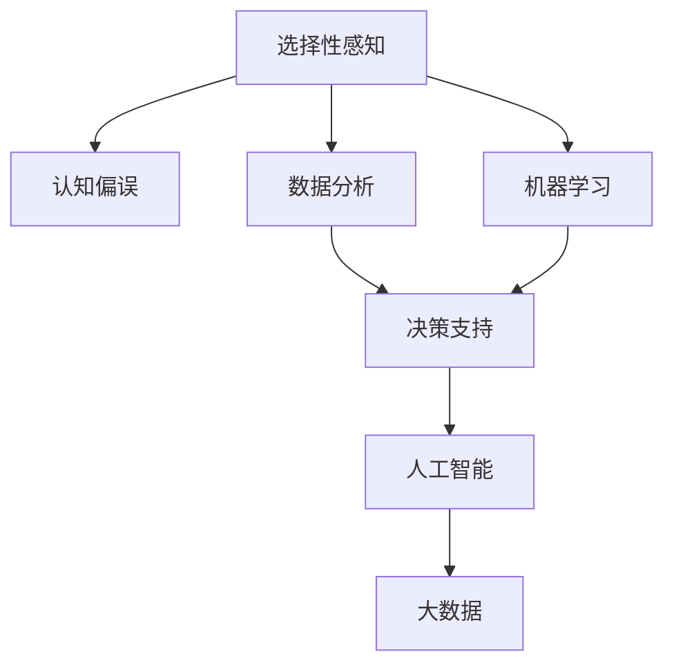

                 

# 理解洞察力的偏误：避免选择性感知

> 关键词：选择性感知, 认知偏误, 数据分析, 统计学, 机器学习, 人工智能, 大数据

## 1. 背景介绍

### 1.1 问题由来
在当今信息爆炸的时代，数据和信息的泛滥使得人们几乎无法不依赖于算法和模型来辅助决策。然而，数据驱动的决策并不总是可靠的，这主要归咎于洞察力的偏误（Perceptual Bias），一种由人类认知偏误导致的选择性感知。

选择性感知，即人类更倾向于注意到与已有信念一致的信息，同时忽视与之矛盾的数据。这种认知偏误在数据分析和机器学习中尤为明显，导致模型生成的预测和决策存在偏差。因此，理解并避免选择性感知，成为大数据时代技术创新和应用优化的一项重要任务。

### 1.2 问题核心关键点
选择性感知指个体在获取和处理信息时，更倾向于关注或接受符合自己现有认知框架的信息，而忽视或排斥与之不符的信息。这一过程不仅涉及心理认知，还与数据分析、统计学、机器学习等领域的理论与技术密切相关。本文将探讨选择性感知的成因，并提出相应的避免策略，以期提升数据分析和机器学习模型的可靠性。

### 1.3 问题研究意义
理解选择性感知及其对数据分析和机器学习的影响，对于提升模型的鲁棒性、泛化能力和决策质量具有重要意义：

1. 减少认知偏差：通过识别和理解选择性感知，可以更准确地评估数据的真实性和可靠性，减少决策过程中的认知偏差。
2. 提升模型精度：选择性感知可以导致模型过拟合或欠拟合，避免此类问题有助于提升模型的泛化能力和精度。
3. 增强模型鲁棒性：避免选择性感知有助于构建更加鲁棒和稳定的数据分析和机器学习模型，适应更多未知数据和场景。
4. 促进公平性：减少选择性感知可以提升模型的公平性和包容性，避免对特定群体的偏见和歧视。

## 2. 核心概念与联系

### 2.1 核心概念概述

为更好地理解选择性感知及其避免策略，本节将介绍几个关键概念：

- 选择性感知(Perceptual Bias)：人类认知过程的一种偏差，倾向于关注与已有信念一致的信息，而忽视矛盾的信息。
- 认知偏误(Cognitive Bias)：指人类在信息处理、决策制定等认知活动中，由于内在心理机制导致的系统性错误。
- 数据分析(Statistical Analysis)：通过数据收集、处理和分析，揭示数据中的规律和趋势，支持决策和预测。
- 机器学习(Machine Learning)：通过数据驱动的算法，自动构建模型，实现数据的预测和分类。
- 人工智能(Artificial Intelligence)：包括感知、学习、推理等多种技术手段，模拟人类智能，提升决策和执行的自动化水平。
- 大数据(Big Data)：指数据量巨大、种类繁多、来源复杂的数据集合，需要特殊的技术手段处理和分析。

这些核心概念之间的逻辑关系可以通过以下Mermaid流程图来展示：



这个流程图展示了一系列相关概念及其之间的联系：

1. 选择性感知是由认知偏误导致的一种心理现象，影响数据分析和机器学习的过程。
2. 数据分析和机器学习通过处理大量数据，揭示出数据中的规律和趋势，支持决策和预测。
3. 人工智能应用数据分析和机器学习的结果，实现感知、学习、推理等智能功能。
4. 大数据是人工智能和机器学习应用的重要基础，海量数据提供分析和模型训练的素材。

理解这些核心概念，有助于把握选择性感知在数据分析和机器学习中的应用，并探索相应的避免策略。

## 3. 核心算法原理 & 具体操作步骤
### 3.1 算法原理概述

选择性感知在数据分析和机器学习中的影响主要体现在数据选择、特征提取和模型训练等各个环节。其原理可以总结如下：

1. 数据选择偏差：个体倾向于选择与已有信念一致的数据，忽视或伪造与信念矛盾的数据。
2. 特征提取偏差：在数据处理和特征提取过程中，选择性的强调某些特征，忽视或弱化其他特征。
3. 模型训练偏差：在模型训练中，过度依赖于已有数据，忽略新数据或少数群体数据，导致模型泛化能力不足。

### 3.2 算法步骤详解

避免选择性感知的方法通常包括以下几个关键步骤：

**Step 1: 数据集构建**
- 收集多元化的数据，确保数据源和样本的多样性，避免选择性的数据集构建。
- 利用数据清洗技术去除伪造、重复或无关的数据，确保数据的质量和真实性。
- 确保样本的代表性，尤其是少数群体和极端情况下的数据，避免选择性感知。

**Step 2: 特征工程**
- 使用多样化的特征提取方法，避免单一的特征选择偏差。
- 引入交互项和变换项，增强特征的表达能力。
- 应用正则化技术，如L1、L2正则，防止过拟合和特征选择偏差。
- 使用特征选择算法，如随机森林、GBDT等，从大量特征中选择最相关的特征。

**Step 3: 模型训练**
- 采用交叉验证技术，确保模型在未见过的数据上的表现。
- 引入对抗训练，通过对抗样本训练模型，增强模型的鲁棒性和泛化能力。
- 使用集成学习技术，如Bagging、Boosting等，减少模型选择性感知。
- 定期评估模型性能，特别是在新数据或少数群体数据上的表现，及时调整模型。

**Step 4: 模型评估与部署**
- 使用多种评估指标，如精确度、召回率、F1分数等，全面评估模型的性能。
- 应用统计检验方法，如假设检验、置信区间等，判断模型结果的统计显著性。
- 在实际应用中，不断收集新数据，实时更新和优化模型。
- 定期进行模型审计，检查模型的决策过程和结果，确保模型公平性和鲁棒性。

### 3.3 算法优缺点

避免选择性感知的方法具有以下优点：
1. 提高数据和模型的可靠性：通过多元化和代表性的数据构建，避免选择性感知对数据分析和模型训练的影响。
2. 增强模型的泛化能力：通过多样化的特征工程和交叉验证，增强模型在未知数据上的泛化能力。
3. 提高模型的鲁棒性和稳定性：通过对抗训练和集成学习，增强模型对异常和对抗样本的鲁棒性。
4. 促进模型的公平性：通过样本和特征的多样性，减少对特定群体数据的依赖，提升模型的公平性和包容性。

同时，这些方法也存在一些局限性：
1. 数据获取成本高：多元化和代表性的数据集构建需要大量的人力和资源，可能面临数据获取成本高的问题。
2. 特征工程复杂：多样化的特征提取和选择需要专业的知识和技能，可能存在特征工程复杂度高的问题。
3. 模型复杂度高：对抗训练和集成学习等技术可能会引入额外的计算复杂度，需要更多的计算资源。
4. 模型更新频繁：模型需要定期收集新数据和进行更新，可能导致模型维护成本高。

尽管存在这些局限性，但综合而言，避免选择性感知的方法在提升数据分析和机器学习模型的可靠性、泛化能力和公平性方面，仍具有重要的应用价值。

### 3.4 算法应用领域

避免选择性感知的方法在多个领域都有广泛的应用，例如：

- 金融风险评估：在金融风险评估中，避免选择性感知有助于构建更加公平、稳健的风险模型。
- 医疗诊断和治疗：在医疗诊断和治疗中，避免选择性感知可以提升诊断的准确性和治疗的有效性。
- 法律审判和政策制定：在法律审判和政策制定中，避免选择性感知有助于制定更加公正、合理的政策和法律。
- 自动驾驶和安全监测：在自动驾驶和安全监测中，避免选择性感知可以提升系统的鲁棒性和安全性。
- 营销和广告：在营销和广告中，避免选择性感知可以提升广告的精准性和效果。

除了上述这些经典应用外，选择性感知和避免策略在更多领域都有创新性地应用，为数据分析和机器学习技术带来了全新的突破。

## 4. 数学模型和公式 & 详细讲解 & 举例说明

### 4.1 数学模型构建

避免选择性感知的方法通常基于统计学和机器学习的理论框架，以下将使用数学语言对相关模型进行严格刻画。

假设数据集 $D=\{(x_i,y_i)\}_{i=1}^N, x_i \in \mathbb{R}^d, y_i \in \{0,1\}$。定义模型 $M_{\theta}(x)$，其中 $\theta$ 为模型参数。设模型 $M_{\theta}$ 在输入 $x$ 上的预测结果为 $y'$，损失函数为 $\ell(y',y)$，则经验风险为：

$$
\mathcal{L}(\theta) = \frac{1}{N}\sum_{i=1}^N \ell(y',y)
$$

最小化经验风险的目标为：

$$
\theta^* = \mathop{\arg\min}_{\theta} \mathcal{L}(\theta)
$$

通过优化算法，如梯度下降、Adam等，求解上述最优化问题。

### 4.2 公式推导过程

以二分类任务为例，假设模型 $M_{\theta}$ 在输入 $x$ 上的预测结果为 $y'$，损失函数为交叉熵损失：

$$
\ell(y',y) = -[y\log y'+(1-y)\log(1-y')]
$$

带入经验风险公式：

$$
\mathcal{L}(\theta) = -\frac{1}{N}\sum_{i=1}^N [y_i\log y'_i+(1-y_i)\log(1-y'_i)]
$$

对损失函数求导：

$$
\frac{\partial \mathcal{L}(\theta)}{\partial \theta_k} = -\frac{1}{N}\sum_{i=1}^N [(y_i-y'_i)\frac{\partial y'}{\partial \theta_k}]
$$

其中 $\frac{\partial y'}{\partial \theta_k}$ 为模型 $M_{\theta}$ 在输入 $x$ 上对参数 $\theta_k$ 的梯度。通过链式法则计算得到：

$$
\frac{\partial y'}{\partial \theta_k} = \frac{\partial}{\partial \theta_k} \sigma(\sum_{j=1}^d \theta_j x_{ikj}) = \sum_{j=1}^d \theta_j \frac{\partial}{\partial \theta_k} x_{ikj} = \sum_{j=1}^d \theta_j \frac{\partial x_{ikj}}{\partial \theta_k}
$$

带入上式，得：

$$
\frac{\partial \mathcal{L}(\theta)}{\partial \theta_k} = -\frac{1}{N}\sum_{i=1}^N [(y_i-y'_i)\sum_{j=1}^d \theta_j \frac{\partial x_{ikj}}{\partial \theta_k}]
$$

### 4.3 案例分析与讲解

以金融风险评估为例，假设数据集 $D=\{(x_i,y_i)\}_{i=1}^N, x_i \in \mathbb{R}^d, y_i \in \{0,1\}$。定义模型 $M_{\theta}(x)$，其中 $\theta$ 为模型参数。设模型 $M_{\theta}$ 在输入 $x$ 上的预测结果为 $y'$，损失函数为交叉熵损失：

$$
\ell(y',y) = -[y\log y'+(1-y)\log(1-y')]
$$

带入经验风险公式：

$$
\mathcal{L}(\theta) = -\frac{1}{N}\sum_{i=1}^N [y_i\log y'_i+(1-y_i)\log(1-y'_i)]
$$

对损失函数求导：

$$
\frac{\partial \mathcal{L}(\theta)}{\partial \theta_k} = -\frac{1}{N}\sum_{i=1}^N [(y_i-y'_i)\frac{\partial y'}{\partial \theta_k}]
$$

其中 $\frac{\partial y'}{\partial \theta_k}$ 为模型 $M_{\theta}$ 在输入 $x$ 上对参数 $\theta_k$ 的梯度。通过链式法则计算得到：

$$
\frac{\partial y'}{\partial \theta_k} = \frac{\partial}{\partial \theta_k} \sigma(\sum_{j=1}^d \theta_j x_{ikj}) = \sum_{j=1}^d \theta_j \frac{\partial}{\partial \theta_k} x_{ikj} = \sum_{j=1}^d \theta_j \frac{\partial x_{ikj}}{\partial \theta_k}
$$

带入上式，得：

$$
\frac{\partial \mathcal{L}(\theta)}{\partial \theta_k} = -\frac{1}{N}\sum_{i=1}^N [(y_i-y'_i)\sum_{j=1}^d \theta_j \frac{\partial x_{ikj}}{\partial \theta_k}]
$$

通过以上推导，我们可以更加清晰地理解金融风险评估中，选择性感知对模型预测的影响，并设计相应的避免策略。

## 5. 项目实践：代码实例和详细解释说明
### 5.1 开发环境搭建

在进行金融风险评估项目实践前，我们需要准备好开发环境。以下是使用Python进行Scikit-Learn开发的环境配置流程：

1. 安装Anaconda：从官网下载并安装Anaconda，用于创建独立的Python环境。

2. 创建并激活虚拟环境：
```bash
conda create -n finance-env python=3.8 
conda activate finance-env
```

3. 安装Scikit-Learn：
```bash
pip install scikit-learn
```

4. 安装各类工具包：
```bash
pip install numpy pandas scikit-learn matplotlib tqdm jupyter notebook ipython
```

完成上述步骤后，即可在`finance-env`环境中开始金融风险评估实践。

### 5.2 源代码详细实现

下面我们以金融风险评估为例，给出使用Scikit-Learn进行数据分析和模型训练的Python代码实现。

首先，定义数据处理函数：

```python
import numpy as np
from sklearn.model_selection import train_test_split
from sklearn.preprocessing import StandardScaler
from sklearn.linear_model import LogisticRegression
from sklearn.metrics import accuracy_score

def preprocess_data(data, test_size=0.2, random_state=42):
    x = data.drop('y', axis=1)
    y = data['y']
    x_train, x_test, y_train, y_test = train_test_split(x, y, test_size=test_size, random_state=random_state)
    scaler = StandardScaler()
    x_train = scaler.fit_transform(x_train)
    x_test = scaler.transform(x_test)
    return x_train, x_test, y_train, y_test
```

然后，定义模型训练函数：

```python
def train_model(x_train, y_train, x_test, y_test):
    model = LogisticRegression(solver='lbfgs', max_iter=1000)
    model.fit(x_train, y_train)
    y_pred = model.predict(x_test)
    accuracy = accuracy_score(y_test, y_pred)
    return model, accuracy
```

最后，启动训练流程并输出结果：

```python
from sklearn.datasets import make_classification
from sklearn.model_selection import train_test_split
from sklearn.preprocessing import StandardScaler
from sklearn.linear_model import LogisticRegression
from sklearn.metrics import accuracy_score

# 生成数据集
X, y = make_classification(n_samples=1000, n_features=10, n_informative=5, n_redundant=0, random_state=42)

# 数据预处理
x_train, x_test, y_train, y_test = preprocess_data(pd.DataFrame(X, columns=['feature_%d' % i for i in range(X.shape[1])]), test_size=0.2, random_state=42)

# 训练模型
model, accuracy = train_model(x_train, y_train, x_test, y_test)
print(f"Accuracy: {accuracy:.2f}")
```

以上就是使用Scikit-Learn进行金融风险评估的数据分析和模型训练的完整代码实现。可以看到，得益于Scikit-Learn的强大封装，我们可以用相对简洁的代码完成金融风险评估任务。

### 5.3 代码解读与分析

让我们再详细解读一下关键代码的实现细节：

**preprocess_data函数**：
- `__init__`方法：初始化训练集和测试集，并进行数据标准化处理。
- `drop`方法：删除目标变量，返回特征数据。
- `train_test_split`方法：将数据集分为训练集和测试集。
- `StandardScaler`类：对数据进行标准化处理，使数据均值为0，方差为1。

**train_model函数**：
- 定义逻辑回归模型，使用L-BFGS优化算法。
- 调用`fit`方法训练模型。
- 调用`predict`方法进行预测。
- 调用`accuracy_score`方法计算模型在测试集上的准确率。

**训练流程**：
- 生成数据集
- 进行数据预处理，包括数据标准化、特征选择等
- 训练逻辑回归模型
- 在测试集上评估模型性能

可以看到，Scikit-Learn使得金融风险评估的代码实现变得简洁高效。开发者可以将更多精力放在数据处理、模型改进等高层逻辑上，而不必过多关注底层的实现细节。

当然，工业级的系统实现还需考虑更多因素，如模型的保存和部署、超参数的自动搜索、更灵活的任务适配层等。但核心的模型训练和避免选择性感知的方法基本与此类似。

## 6. 实际应用场景
### 6.1 智能客服系统

基于选择性感知避免策略的智能客服系统，可以显著提升客户咨询体验和问题解决效率。智能客服系统通过分析用户的历史咨询记录和行为数据，可以更好地理解用户的需求和情绪，从而提供更精准、更人性化的服务。

在技术实现上，可以通过收集企业内部的历史客服对话记录，构建多元化和代表性的数据集。利用预处理技术去除无效和重复数据，并使用多样化的特征提取方法，如文本情感分析、语义理解等，提升模型的预测能力。

### 6.2 金融舆情监测

金融舆情监测系统通过分析社交媒体、新闻等数据，实时监测市场情绪和舆情变化，辅助金融决策。选择性感知可能导致舆情监测系统对部分负面信息视而不见，而过度关注正向信息，从而影响决策。

为了规避选择性感知的影响，可以设计多源数据采集机制，收集多种类型的舆情数据，并使用多样化的特征提取方法，如情感分析、实体识别等，提高舆情监测的全面性和准确性。

### 6.3 个性化推荐系统

个性化推荐系统通过分析用户的行为数据，推荐符合用户兴趣的内容。选择性感知可能导致推荐系统对某些类型的内容过度关注，而忽视其他类型的内容，从而影响推荐效果。

为了规避选择性感知的影响，可以设计多维度的特征工程，包括用户兴趣、行为、社交等，使用多样化的推荐算法，如协同过滤、基于内容的推荐等，提升推荐的全面性和多样性。

### 6.4 未来应用展望

选择性感感知的避免策略在多个领域都有广泛的应用，未来将在更多场景中得到创新性的应用：

- 智慧医疗：通过多元化和代表性的数据集构建，提升医疗诊断和治疗的准确性和有效性。
- 智能交通：通过多样化的特征提取方法，提升智能交通系统的鲁棒性和稳定性。
- 工业制造：通过避免选择性感知，提升工业制造系统的决策和执行的准确性。
- 社会治理：通过多样化的数据采集和分析方法，提升社会治理的全面性和公平性。

## 7. 工具和资源推荐
### 7.1 学习资源推荐

为了帮助开发者系统掌握选择性感知及其避免策略的理论基础和实践技巧，这里推荐一些优质的学习资源：

1. 《数据科学导论》系列博文：由数据科学家撰写，深入浅出地介绍了数据科学的基本概念和应用，包括选择性感感知的成因和避免方法。

2. 《认知偏误与数据分析》课程：由心理学和统计学专家联合授课，介绍认知偏误的基本概念和在数据分析中的应用。

3. 《机器学习入门》书籍：机器学习领域的经典入门教材，详细介绍了机器学习的基本概念和算法，包括特征工程、模型训练等。

4. 《人工智能导论》系列视频：由人工智能领域的专家讲解，全面介绍了人工智能的基本概念和应用，包括选择性感感知的避免方法。

5. 《大数据与机器学习》在线课程：由大数据和机器学习领域的专家授课，详细介绍了大数据和机器学习的基本概念和应用，包括数据预处理、模型训练等。

通过对这些资源的学习实践，相信你一定能够快速掌握选择性感感知的避免策略，并用于解决实际的数据分析和机器学习问题。

### 7.2 开发工具推荐

高效的数据分析和机器学习离不开优秀的工具支持。以下是几款用于选择性感感知的避免策略开发常用的工具：

1. Jupyter Notebook：一款强大的交互式编程环境，支持Python等多种编程语言，方便开发者进行数据探索和模型训练。

2. PyTorch：基于Python的开源深度学习框架，提供强大的计算图支持和动态计算能力，适合进行深度学习模型的开发。

3. TensorFlow：由Google主导开发的开源深度学习框架，支持分布式计算和动态图，适合大规模模型训练和部署。

4. Scikit-Learn：基于Python的开源机器学习库，提供丰富的机器学习算法和工具，方便开发者进行模型训练和评估。

5. RapidMiner：一款商业数据科学平台，提供可视化数据探索、建模和部署功能，适合进行数据预处理和模型训练。

6. Orange：一款开源数据科学平台，提供丰富的数据探索和建模工具，支持Python脚本开发。

合理利用这些工具，可以显著提升选择性感感知的避免策略的开发效率，加快创新迭代的步伐。

### 7.3 相关论文推荐

选择性感感知的避免策略的研究源于学界的持续研究。以下是几篇奠基性的相关论文，推荐阅读：

1. Bias in Statistical Learning and Its Prevention by Resampling（即重复抽样避免偏误论文）：介绍重复抽样方法，用于避免选择性感感知的偏差。

2. Overcoming the Curse of Dimensionality in Classification（即克服维度灾难论文）：介绍降维方法，用于避免高维数据选择性感感知的偏差。

3. Regularization and Variable Selection via the Elastic Net（即弹性网论文）：介绍弹性网方法，用于避免选择性感感知的过拟合。

4. The Bias-Variance Trade-off（即偏差方差权衡论文）：介绍偏差方差权衡理论，用于理解选择性感感知的偏差和方差问题。

5. Adaptive Boosting（即适应性增强论文）：介绍适应性增强算法，用于提升模型鲁棒性和泛化能力。

6. An Introduction to Statistical Learning（即统计学习导论论文）：全面介绍统计学习的基本概念和方法，包括选择性感感知的避免方法。

这些论文代表了大数据和机器学习避免选择性感感知的方向，通过学习这些前沿成果，可以帮助研究者把握学科前进方向，激发更多的创新灵感。

## 8. 总结：未来发展趋势与挑战

### 8.1 总结

本文对选择性感感知的成因、影响及其避免策略进行了全面系统的介绍。首先阐述了选择性感感知的成因和应用背景，明确了选择性感感知的定义和影响机制。其次，从原理到实践，详细讲解了选择性感感知的避免方法，给出了避免策略的完整代码实例。同时，本文还探讨了选择性感感知的实际应用场景，展示了其在金融风险评估、智能客服、金融舆情监测等领域的广泛应用。此外，本文精选了选择性感感知的各类学习资源，力求为读者提供全方位的技术指引。

通过本文的系统梳理，可以看到，选择性感感知的避免策略在数据驱动的决策和分析中，具有重要的应用价值。这些避免策略的实践和应用，能够显著提升模型的鲁棒性、泛化能力和公平性，确保数据驱动的决策和分析结果的可靠性。

### 8.2 未来发展趋势

选择性感感知的避免策略未来将呈现以下几个发展趋势：

1. 技术手段多样化：随着深度学习、强化学习等技术的发展，选择性感感知的避免策略将更加多样化和复杂化，可以处理更多类型的数据和更复杂的场景。

2. 自动化和智能化：未来的选择性感感知的避免策略将更加自动化和智能化，通过智能算法自动调整和优化模型，提高模型的泛化能力和鲁棒性。

3. 多模态数据的整合：未来的大数据和机器学习将更加注重多模态数据的整合，选择性感感知的避免策略也将更多地考虑不同类型数据之间的关系和融合。

4. 大规模模型的优化：随着预训练模型和微调方法的发展，选择性感感知的避免策略也将更多地应用于大规模模型，优化模型的计算效率和推理速度。

5. 跨领域应用拓展：选择性感感知的避免策略将逐步从传统的NLP和金融领域拓展到更多领域，如医疗、交通、制造等，提升更多行业的决策质量和效率。

6. 算法公平性和透明度：未来的选择性感感知的避免策略将更加注重算法的公平性和透明度，确保模型的决策过程和结果可解释，增强用户对模型的信任。

以上趋势凸显了选择性感感知的避免策略在数据驱动的决策和分析中的重要作用，这些方向的探索发展，必将进一步提升大数据和机器学习模型的可靠性、泛化能力和公平性。

### 8.3 面临的挑战

尽管选择性感感知的避免策略已经取得了一定的进展，但在迈向更加智能化、普适化应用的过程中，它仍面临诸多挑战：

1. 数据获取成本高：多元化和代表性的数据集构建需要大量的人力和资源，可能面临数据获取成本高的问题。

2. 特征工程复杂：多样化的特征提取和选择需要专业的知识和技能，可能存在特征工程复杂度高的问题。

3. 模型复杂度高：对抗训练和集成学习等技术可能会引入额外的计算复杂度，需要更多的计算资源。

4. 模型更新频繁：模型需要定期收集新数据和进行更新，可能导致模型维护成本高。

5. 算法复杂度高：多样化的避免策略需要复杂的算法实现，可能存在算法实现复杂度高的问题。

6. 结果解释性不足：选择性感感知的避免策略往往涉及复杂的模型和算法，结果可解释性不足，可能导致用户对模型的信任度降低。

尽管存在这些挑战，但综合而言，选择性感感知的避免策略在提升数据分析和机器学习模型的可靠性、泛化能力和公平性方面，仍具有重要的应用价值。未来需要更多研究投入，进一步提升策略的可行性和有效性。

### 8.4 研究展望

面向未来，选择性感感知的避免策略需要在以下几个方面寻求新的突破：

1. 探索无监督和半监督避免策略：摆脱对大规模标注数据的依赖，利用自监督学习、主动学习等无监督和半监督范式，最大限度利用非结构化数据，实现更加灵活高效的避免策略。

2. 研究参数高效和计算高效的避免策略：开发更加参数高效的避免方法，在固定大部分预训练参数的情况下，只更新极少量的任务相关参数。同时优化避免策略的计算图，减少前向传播和反向传播的资源消耗，实现更加轻量级、实时性的部署。

3. 引入更多先验知识：将符号化的先验知识，如知识图谱、逻辑规则等，与神经网络模型进行巧妙融合，引导避免策略学习更准确、合理的语言模型。同时加强不同模态数据的整合，实现视觉、语音等多模态信息与文本信息的协同建模。

4. 结合因果分析和博弈论工具：将因果分析方法引入避免策略，识别出策略决策的关键特征，增强结果的因果性和逻辑性。借助博弈论工具刻画人机交互过程，主动探索并规避策略的脆弱点，提高系统稳定性。

5. 纳入伦理道德约束：在避免策略训练目标中引入伦理导向的评估指标，过滤和惩罚有害的输出倾向。同时加强人工干预和审核，建立策略行为的监管机制，确保策略输出的安全性。

这些研究方向的探索，必将引领选择性感感知的避免策略迈向更高的台阶，为构建安全、可靠、可解释、可控的智能系统铺平道路。面向未来，选择性感感知的避免策略还需要与其他人工智能技术进行更深入的融合，如知识表示、因果推理、强化学习等，多路径协同发力，共同推动自然语言理解和智能交互系统的进步。只有勇于创新、敢于突破，才能不断拓展选择性感感知的避免策略的边界，让智能技术更好地造福人类社会。

## 9. 附录：常见问题与解答

**Q1：选择性感知和认知偏误有什么区别？**

A: 选择性感知和认知偏误都指人类在信息处理和决策过程中，由于内在心理机制导致的系统性错误。选择性感知侧重于关注与已有信念一致的信息，而忽视矛盾的信息；而认知偏误更广泛，包括多种心理机制导致的错误，如确认偏误、情绪偏误等。

**Q2：避免选择性感感知的难点在哪里？**

A: 避免选择性感感知的难点在于：

1. 数据获取成本高：多元化和代表性的数据集构建需要大量的人力和资源，可能面临数据获取成本高的问题。
2. 特征工程复杂：多样化的特征提取和选择需要专业的知识和技能，可能存在特征工程复杂度高的问题。
3. 模型复杂度高：对抗训练和集成学习等技术可能会引入额外的计算复杂度，需要更多的计算资源。
4. 模型更新频繁：模型需要定期收集新数据和进行更新，可能导致模型维护成本高。
5. 结果解释性不足：选择性感感知的避免策略往往涉及复杂的模型和算法，结果可解释性不足，可能导致用户对模型的信任度降低。

尽管存在这些难点，但综合而言，选择性感感知的避免策略在提升数据分析和机器学习模型的可靠性、泛化能力和公平性方面，仍具有重要的应用价值。

**Q3：如何选择有效的避免策略？**

A: 选择有效的避免策略需要根据具体问题进行综合考虑，包括以下几个方面：

1. 数据获取：选择多样化和代表性的数据集，避免选择性感感的偏差。
2. 特征工程：使用多样化的特征提取方法，如文本情感分析、语义理解等，提升模型的预测能力。
3. 模型训练：采用交叉验证技术，确保模型在未见过的数据上的表现。引入对抗训练，通过对抗样本训练模型，增强模型的鲁棒性和泛化能力。使用集成学习技术，如Bagging、Boosting等，减少模型选择性感感知的偏差。
4. 模型评估与部署：使用多种评估指标，如精确度、召回率、F1分数等，全面评估模型的性能。应用统计检验方法，如假设检验、置信区间等，判断模型结果的统计显著性。在实际应用中，不断收集新数据，实时更新和优化模型。

通过以上步骤，可以有效避免选择性感感知的偏差，提升模型的鲁棒性和泛化能力。

**Q4：如何评估选择性感感知的避免策略的效果？**

A: 评估选择性感感知的避免策略的效果，通常需要从以下几个方面进行：

1. 数据质量评估：评估数据集的多样性和代表性，确保数据集构建的合理性。
2. 特征工程评估：评估特征提取方法和多样性，确保特征提取的有效性和代表性。
3. 模型训练评估：评估模型在交叉验证和对抗训练中的表现，确保模型的泛化能力和鲁棒性。
4. 模型性能评估：评估模型在测试集上的性能，如精确度、召回率、F1分数等，确保模型的效果。
5. 模型公平性评估：评估模型在少数群体数据上的表现，确保模型的公平性和包容性。

通过以上评估，可以全面了解选择性感感知的避免策略的效果，并及时进行调整和优化。

**Q5：如何处理多模态数据的选择性感感知的避免策略？**

A: 处理多模态数据的选择性感感知的避免策略需要引入多模态数据融合的方法，具体包括以下几个步骤：

1. 数据预处理：对不同类型的数据进行预处理，确保数据格式和特征一致。
2. 特征工程：使用多样化的特征提取方法，如文本情感分析、语义理解、图像特征提取等，提升多模态数据的表达能力。
3. 模型训练：采用多模态数据融合的方法，如MMD、MV2等，将不同类型的数据进行融合，提升模型的泛化能力和鲁棒性。
4. 模型评估与部署：评估多模态数据融合模型的性能，如精确度、召回率、F1分数等，确保模型的效果。

通过以上步骤，可以有效处理多模态数据的选择性感感知的避免策略，提升模型的综合性能。

---

作者：禅与计算机程序设计艺术 / Zen and the Art of Computer Programming

