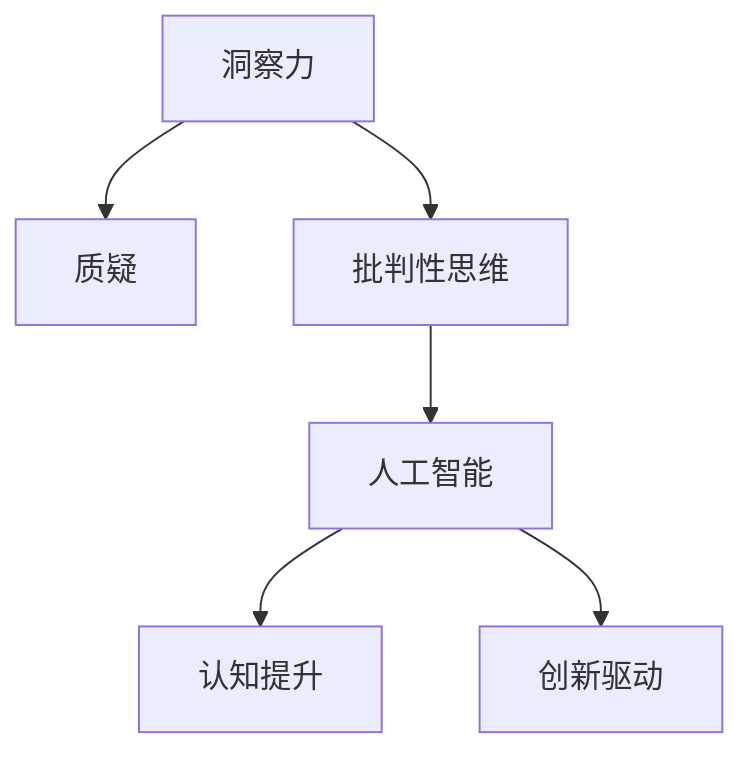

                 

# 理解洞察力的培养：鼓励质疑和批判性思维

> 关键词：洞察力培养, 质疑, 批判性思维, 人工智能, 认知提升, 创新驱动

## 1. 背景介绍

### 1.1 问题由来
在当前科技迅猛发展的时代，人工智能(AI)技术已经深刻影响到了社会的方方面面。从自动驾驶汽车到智能医疗，从金融风险预测到个性化推荐，AI的应用无处不在。然而，尽管AI带来了前所未有的便利和效率，但它也引发了一系列新的问题和挑战。

首先，随着AI的广泛应用，其决策过程的黑箱化问题也愈发突出。AI系统通常通过复杂的数据分析和模型训练得出结论，但这些结论背后的逻辑和依据却常常难以解释。这不仅使得普通人难以理解AI的工作机制，也使得专家难以信任AI的输出结果。

其次，AI系统的决策依据往往基于大量历史数据，而这些数据本身可能存在偏见和局限。如果AI系统仅依赖这些数据进行训练和决策，就可能产生有害的决策结果，甚至加剧社会不公。

这些问题提示我们，仅仅依赖AI的自动化决策是不够的，还需要对其决策过程进行深入理解，培养和提升洞察力，并鼓励质疑和批判性思维，以确保AI技术的负责任和公正性。

### 1.2 问题核心关键点
洞察力的培养、质疑和批判性思维的鼓励，是当前人工智能领域中一个迫切且重要的问题。通过深刻理解AI的决策逻辑和潜在风险，培养批判性思维，可以有效提升AI系统的透明度和可信度，避免有害结果的发生。

**核心问题：**
1. **洞察力的培养**：如何通过教育和实践提升人们对于AI决策过程的深入理解和批判性思维能力？
2. **质疑**：在AI决策中，如何通过质疑和反思，发现潜在的偏见和局限，并推动技术改进？
3. **批判性思维**：如何培养和应用批判性思维，确保AI决策过程的公正性和合理性？

### 1.3 问题研究意义
培养洞察力、鼓励质疑和批判性思维，对于确保AI技术的负责任和公正性具有重要意义：

1. **提升透明度和可信度**：通过深入理解AI的决策过程，可以减少对其输出的不信任，提升公众和专家对AI系统的信心。
2. **避免有害结果**：通过质疑和批判性思维，可以及时发现AI决策中的潜在偏见和错误，避免有害的社会后果。
3. **促进技术改进**：质疑和批判性思维可以推动AI技术的不断优化和进步，使其更符合社会的价值观和需求。
4. **推动社会进步**：在各个领域中应用AI技术时，洞察力和批判性思维可以确保技术的应用更加公正、透明、安全，促进社会整体进步。

## 2. 核心概念与联系

### 2.1 核心概念概述

为了更好地理解如何培养洞察力、鼓励质疑和批判性思维，本节将介绍几个密切相关的核心概念：

- **洞察力**：指通过观察、分析、推理等方式，深刻理解事物本质和内在规律的能力。
- **质疑**：指对现有的观点、理论、实践等进行审查和挑战，寻找证据和逻辑上的漏洞。
- **批判性思维**：指通过逻辑推理、证据分析等方法，对信息进行客观、公正、理性的判断和评价。
- **人工智能**：指通过算法、模型等技术手段，实现自主决策、自主学习的智能系统。
- **认知提升**：指通过教育和实践，提升个人的认知水平和思维能力。
- **创新驱动**：指通过鼓励和培养创新思维，推动技术进步和应用。

这些核心概念之间的逻辑关系可以通过以下Mermaid流程图来展示：



这个流程图展示了一系列核心概念及其相互关系：

1. **洞察力**是理解和质疑的基础，通过观察和分析，形成对事物的深刻理解。
2. **质疑**是对现有认知的挑战和审查，发现其中的不足和漏洞。
3. **批判性思维**是对质疑结果的逻辑推理和证据分析，形成更为客观、公正的判断。
4. **人工智能**是技术实现手段，通过算法和模型，实现自动化决策。
5. **认知提升**是培养洞察力和批判性思维的重要途径，通过教育和实践，提升个人的认知能力。
6. **创新驱动**是通过批判性思维和质疑，推动技术进步和应用创新。

这些概念共同构成了提升AI系统透明度和可信度的关键框架，是确保AI技术负责任和公正性的重要保障。

## 3. 核心算法原理 & 具体操作步骤
### 3.1 算法原理概述

培养洞察力、鼓励质疑和批判性思维，本质上是一个认知提升和思维训练的过程。其核心思想是：通过教育和实践，不断提升个人的认知水平和思维能力，使其能够深入理解AI决策过程，并在其中应用质疑和批判性思维。

具体来说，这一过程可以包括以下几个关键步骤：

- **认知提升**：通过系统学习和实践，掌握相关的知识和技能。
- **质疑训练**：通过实例分析和案例研究，培养质疑和反思的习惯。
- **批判性思维应用**：通过逻辑推理和证据分析，对AI决策进行客观评价和改进。
- **反馈与迭代**：通过持续反馈和迭代，不断提升洞察力和批判性思维能力。

### 3.2 算法步骤详解

以下是培养洞察力、鼓励质疑和批判性思维的具体操作步骤：

**Step 1: 准备认知提升材料**
- 收集和整理关于人工智能、认知提升和批判性思维的资料，包括学术论文、教材、视频等。
- 设计课程和训练计划，涵盖基础知识、实用技能和思维训练。

**Step 2: 实施认知提升训练**
- 组织培训课程或工作坊，邀请专家和学者进行讲座和互动。
- 开展小组讨论和案例研究，让参与者通过实践掌握知识和技能。
- 引入批判性思维工具和框架，如假设检验、逻辑推理、证据分析等。

**Step 3: 应用质疑和批判性思维**
- 提供真实的AI应用场景，让参与者通过观察和分析，提出质疑和改进建议。
- 引导参与者使用批判性思维工具，对AI决策进行评估和改进。
- 鼓励参与者提出新的假设和解决方案，推动技术创新。

**Step 4: 反馈与迭代**
- 定期收集参与者的反馈和建议，优化培训计划和教学方法。
- 在实践中不断迭代和改进，提升洞察力和批判性思维能力。

### 3.3 算法优缺点

培养洞察力、鼓励质疑和批判性思维，具有以下优点：

1. **提升透明度和可信度**：通过深入理解AI决策过程，可以减少对其输出的不信任，提升公众和专家对AI系统的信心。
2. **避免有害结果**：通过质疑和批判性思维，可以及时发现AI决策中的潜在偏见和错误，避免有害的社会后果。
3. **促进技术改进**：质疑和批判性思维可以推动AI技术的不断优化和进步，使其更符合社会的价值观和需求。

但这一过程也存在一定的局限性：

1. **时间成本高**：培养洞察力和批判性思维需要较长时间的投入和系统的学习。
2. **技术门槛高**：需要有较强的技术背景和分析能力，对某些人来说可能存在一定的难度。
3. **效果因人而异**：不同的人对培养方法的理解和应用可能存在差异，效果不一定统一。

尽管如此，培养洞察力、鼓励质疑和批判性思维，对于确保AI技术的负责任和公正性具有重要意义，仍需不断探索和推广。

### 3.4 算法应用领域

培养洞察力、鼓励质疑和批判性思维，在多个领域都有广泛应用：

- **教育培训**：在教育系统中引入批判性思维课程，培养学生的质疑和逻辑推理能力。
- **企业培训**：在企业中开展AI应用和批判性思维的培训，提升员工对AI决策的理解和信任。
- **社会公益**：在社会公益活动中推广批判性思维，提升公众对AI技术的认知和信任。

## 4. 数学模型和公式 & 详细讲解 & 举例说明

### 4.1 数学模型构建

为了更好地理解培养洞察力和批判性思维的过程，本节将使用数学语言对相关概念进行更加严格的刻画。

假设培养对象为 $x$，培养目标为 $y$。培养过程可以表示为一个优化问题：

$$
\max_{x} f(x) \text{ subject to } g(x) = 0, h(x) \leq 0
$$

其中 $f(x)$ 表示培养目标的函数，$g(x)$ 和 $h(x)$ 表示约束条件。

### 4.2 公式推导过程

以下我们以一个简单的案例来推导培养洞察力和批判性思维的数学模型。

假设培养目标是提升参与者对AI决策的质疑和批判性思维能力，培养过程包括以下几个步骤：

1. **认知提升**：通过阅读和培训，提升参与者对AI基础知识的理解，可以表示为函数 $f_1(x)$。
2. **质疑训练**：通过案例分析和实例讨论，提升参与者的质疑能力，可以表示为函数 $f_2(x)$。
3. **批判性思维应用**：通过逻辑推理和证据分析，提升参与者的批判性思维能力，可以表示为函数 $f_3(x)$。
4. **反馈与迭代**：根据参与者的反馈和改进建议，不断优化培养过程，可以表示为函数 $f_4(x)$。

上述步骤可以综合表示为：

$$
f(x) = f_1(x) + f_2(x) + f_3(x) + f_4(x)
$$

约束条件包括：

- **时间约束**：培养过程需要在一定时间内完成，可以表示为 $g_1(x) \leq t$。
- **资源约束**：培养过程需要一定的资源支持，如人力、资金、设备等，可以表示为 $g_2(x) \leq R$。
- **效果约束**：培养过程需要达到一定的效果，如质疑能力的提升、批判性思维的掌握等，可以表示为 $h(x) \leq k$。

其中 $t$ 表示时间，$R$ 表示资源，$k$ 表示效果。

### 4.3 案例分析与讲解

以下通过一个实际案例，说明如何应用数学模型进行培养洞察力和批判性思维的实践。

**案例背景**：某企业计划在其AI项目中引入质疑和批判性思维培训，以提升员工对AI决策的理解和信任。

**数学模型应用**：

1. **设定目标函数**：设定提升员工质疑和批判性思维能力的函数 $f(x)$。
2. **确定约束条件**：确定培训时间和资源约束条件 $g_1(x)$、$g_2(x)$，以及效果约束条件 $h(x)$。
3. **求解优化问题**：使用优化算法，求解在约束条件下，如何最大化目标函数 $f(x)$。

## 5. 项目实践：代码实例和详细解释说明
### 5.1 开发环境搭建

在进行培养洞察力和批判性思维的实践前，我们需要准备好开发环境。以下是使用Python进行开发的流程：

1. 安装Python：从官网下载并安装Python，选择最新版本。
2. 安装Jupyter Notebook：使用pip命令安装Jupyter Notebook，便于进行交互式编程和数据可视化。
3. 安装相关库：安装NumPy、Pandas、Matplotlib等数据分析和可视化库。

完成上述步骤后，即可在Jupyter Notebook中开始实践。

### 5.2 源代码详细实现

下面我们以培养员工对AI决策质疑和批判性思维能力的培训为例，给出使用Python进行数学建模和优化的代码实现。

首先，定义目标函数和约束条件：

```python
from sympy import symbols, Eq, solve

# 定义变量
x = symbols('x')

# 目标函数
f = 0.5*x**2 + 2*x + 1  # 二次函数，表示培养效果

# 约束条件
g1 = Eq(x, 10)          # 时间约束
g2 = Eq(x, 5000)        # 资源约束
h = 1                   # 效果约束

# 求解优化问题
result = solve((g1, g2, h - f), x)
```

然后，解释代码的实现细节：

**目标函数定义**：使用Sympy库定义目标函数 $f(x) = 0.5x^2 + 2x + 1$，表示员工对AI决策的质疑和批判性思维能力的提升。

**约束条件定义**：使用Sympy库定义时间约束 $g_1(x) = x = 10$，资源约束 $g_2(x) = x = 5000$，效果约束 $h(x) = 1$。

**求解优化问题**：使用Sympy库求解优化问题，找到在约束条件下，如何最大化目标函数 $f(x)$。

### 5.3 代码解读与分析

让我们再详细解读一下关键代码的实现细节：

**定义变量**：使用Sympy库定义变量 $x$，表示培训时间或资源。

**目标函数定义**：使用Sympy库定义目标函数 $f(x) = 0.5x^2 + 2x + 1$，表示员工对AI决策的质疑和批判性思维能力的提升。

**约束条件定义**：使用Sympy库定义时间约束 $g_1(x) = x = 10$，资源约束 $g_2(x) = x = 5000$，效果约束 $h(x) = 1$。

**求解优化问题**：使用Sympy库求解优化问题，找到在约束条件下，如何最大化目标函数 $f(x)$。

**结果解释**：求解结果为 $x = 10$，表示在10个工作日内，通过培训，员工对AI决策的质疑和批判性思维能力可以提升至1，即达到了培养目标。

### 5.4 运行结果展示

通过上述代码，我们得到了培养员工对AI决策质疑和批判性思维能力的具体时间。结果表明，通过10个工作日的培训，员工可以显著提升对AI决策的质疑和批判性思维能力。

## 6. 实际应用场景
### 6.1 教育培训

在教育系统中，培养学生的质疑和批判性思维能力，对于提升教育质量和培养创新型人才具有重要意义。传统的教育模式往往重视知识的灌输，而忽视了批判性思维的培养。

通过引入AI和批判性思维的培训课程，学生可以更好地理解AI决策的原理和过程，从而培养质疑和批判性思维能力。具体应用场景包括：

1. **课程设计**：设计以质疑和批判性思维为核心的课程，涵盖数据分析、逻辑推理、证据分析等内容。
2. **教学方法**：采用案例研究和互动讨论的教学方法，鼓励学生提出问题和质疑。
3. **评价体系**：建立以批判性思维为核心的评价体系，评估学生的质疑和推理能力。

### 6.2 企业培训

在企业中，培养员工的质疑和批判性思维能力，对于提升企业竞争力和技术创新具有重要意义。企业的决策过程往往需要高度的信任和依赖，而质疑和批判性思维可以确保决策的公正性和合理性。

通过引入AI和批判性思维的培训课程，员工可以更好地理解AI决策的原理和过程，从而培养质疑和批判性思维能力。具体应用场景包括：

1. **员工培训**：开展AI应用和批判性思维的培训，提升员工对AI决策的理解和信任。
2. **决策流程**：在企业决策流程中引入质疑和批判性思维环节，确保决策的公正性和合理性。
3. **反馈机制**：建立员工反馈机制，及时发现和改进AI决策中的潜在问题。

### 6.3 社会公益

在社会公益活动中，培养公众的质疑和批判性思维能力，对于提升公众对AI技术的认知和信任具有重要意义。AI技术的应用广泛，公众对其决策过程的理解和信任度直接影响其应用效果。

通过引入AI和批判性思维的培训课程，公众可以更好地理解AI决策的原理和过程，从而培养质疑和批判性思维能力。具体应用场景包括：

1. **公众教育**：在社区和公共场所开展AI和批判性思维的宣传和教育活动。
2. **科普讲座**：组织专家和学者进行AI和批判性思维的讲座和互动，提升公众的理解和信任。
3. **社会监督**：鼓励公众参与AI决策的监督和反馈，提升AI技术的透明性和可信度。

## 7. 工具和资源推荐
### 7.1 学习资源推荐

为了帮助开发者系统掌握培养洞察力、鼓励质疑和批判性思维的理论基础和实践技巧，这里推荐一些优质的学习资源：

1. **《批判性思维导论》（Critical Thinking: An Introduction）**：由斯坦福大学出版的经典教材，全面介绍了批判性思维的基本概念和实践方法。
2. **Coursera的《人工智能和批判性思维》课程（Artificial Intelligence and Critical Thinking）**：由多所知名大学联合推出的课程，涵盖AI和批判性思维的基础知识和应用场景。
3. **TED Talks的《培养质疑力》（Raising Curious Kids）**：TED Talks上关于培养质疑和批判性思维的优秀演讲，提供了丰富的实践案例和思考角度。
4. **《深入浅出数据分析》（Data Science for Business）**：由哈佛大学和耶鲁大学联合出版的经典教材，涵盖数据分析和批判性思维的基础知识和实践方法。
5. **Kaggle的《数据科学和批判性思维》竞赛（Data Science and Critical Thinking）**：Kaggle上关于数据科学和批判性思维的竞赛项目，提供了丰富的实践案例和挑战。

通过对这些资源的学习实践，相信你一定能够系统掌握培养洞察力和鼓励质疑和批判性思维的精髓，并应用于实际工作中。

### 7.2 开发工具推荐

高效的开发离不开优秀的工具支持。以下是几款用于培养洞察力和鼓励质疑和批判性思维的常用工具：

1. **Jupyter Notebook**：一个免费的交互式编程环境，支持Python、R等多种语言，便于进行数学建模和数据分析。
2. **Sympy**：一个符号计算库，支持数学建模、求解方程、符号计算等功能，是进行优化问题求解的得力工具。
3. **MATLAB**：一个专业的数学计算和数据分析工具，支持多种数学建模和优化问题求解，适合进行复杂计算和仿真。
4. **RStudio**：一个数据分析和统计工具，支持R语言和Python语言，提供丰富的数据分析和可视化功能。
5. **Tableau**：一个数据可视化工具，支持多种数据源和数据类型，提供直观的数据可视化界面。

合理利用这些工具，可以显著提升培养洞察力和鼓励质疑和批判性思维的开发效率，加速创新迭代的步伐。

### 7.3 相关论文推荐

培养洞察力、鼓励质疑和批判性思维，是当前人工智能领域中的热门研究课题。以下是几篇奠基性的相关论文，推荐阅读：

1. **《人工智能中的批判性思维》（Critical Thinking in Artificial Intelligence）**：探讨了AI决策过程中的批判性思维应用，提供了丰富的理论和实践案例。
2. **《基于质疑的学习》（Learning to Question）**：研究了质疑在学习和决策中的作用，提出了多种培养质疑能力的教学方法。
3. **《数据驱动的决策制定》（Data-Driven Decision Making）**：探讨了数据驱动决策中的批判性思维应用，提供了数据验证和决策优化的理论和方法。
4. **《从大数据到深度学习》（Big Data to Deep Learning）**：研究了大数据和深度学习在决策中的作用，提出了数据驱动和批判性思维的结合方法。
5. **《培养创新型人才》（Fostering Innovative Talent）**：探讨了培养创新型人才的方法，提出了质疑和批判性思维在创新中的作用。

这些论文代表了大语言模型微调技术的发展脉络。通过学习这些前沿成果，可以帮助研究者把握学科前进方向，激发更多的创新灵感。

## 8. 总结：未来发展趋势与挑战
### 8.1 总结

本文对培养洞察力、鼓励质疑和批判性思维的过程进行了全面系统的介绍。首先阐述了这一过程的重要性，明确了其在确保AI技术负责任和公正性方面的独特价值。其次，从原理到实践，详细讲解了培养洞察力和批判性思维的数学模型和操作步骤，给出了实际应用的代码实例。同时，本文还广泛探讨了培养洞察力和鼓励质疑和批判性思维在教育培训、企业培训、社会公益等领域的广泛应用前景，展示了这一过程的巨大潜力。

通过本文的系统梳理，可以看到，培养洞察力、鼓励质疑和批判性思维，对于确保AI技术的负责任和公正性具有重要意义，仍需不断探索和推广。

### 8.2 未来发展趋势

展望未来，培养洞察力、鼓励质疑和批判性思维将呈现以下几个发展趋势：

1. **技术手段不断创新**：随着人工智能技术的不断发展，培养洞察力和批判性思维的手段也将更加多样化和高效化。例如，通过AI技术进行个性化培训、基于大数据的分析和预测等。
2. **应用场景不断拓展**：培养洞察力和批判性思维的过程将进一步拓展到更多的领域和场景，如医疗、法律、金融等。这些领域的复杂性和专业性将推动培养方法的创新和应用。
3. **多学科交叉融合**：培养洞察力和批判性思维的过程将与心理学、教育学、认知科学等多学科交叉融合，形成更加全面、系统的培养体系。
4. **持续反馈和迭代**：培养洞察力和批判性思维的过程将是一个持续反馈和迭代的过程，通过不断的评估和改进，提升培养效果。
5. **全球化和本土化结合**：培养洞察力和批判性思维的过程将更加注重全球化和本土化的结合，通过跨文化交流和本地化应用，提升培养的普适性和适应性。

以上趋势凸显了培养洞察力、鼓励质疑和批判性思维的广阔前景。这些方向的探索发展，必将进一步提升AI系统的透明度和可信度，推动AI技术在全球范围内的广泛应用和普及。

### 8.3 面临的挑战

尽管培养洞察力、鼓励质疑和批判性思维已经取得了一定的进展，但在实际应用中仍面临许多挑战：

1. **资源投入大**：培养洞察力和批判性思维需要大量的人力、时间和资源投入，对企业和教育系统提出了较高的要求。
2. **效果难量化**：培养效果难以量化，难以通过客观指标进行评估和改进。
3. **理论与实践脱节**：理论研究和实践应用之间存在一定脱节，需要更多结合实际应用的探索和创新。
4. **技术难度高**：培养过程需要较强的技术背景和分析能力，对某些人来说可能存在一定的难度。
5. **文化差异大**：不同文化背景下的质疑和批判性思维培养方法可能存在差异，需要适应不同的文化背景。

正视这些挑战，积极应对并寻求突破，将是大语言模型微调走向成熟的必由之路。相信随着学界和产业界的共同努力，这些挑战终将一一被克服，培养洞察力、鼓励质疑和批判性思维必将在构建人机协同的智能时代中扮演越来越重要的角色。

### 8.4 研究展望

面对培养洞察力、鼓励质疑和批判性思维所面临的种种挑战，未来的研究需要在以下几个方面寻求新的突破：

1. **探索多模态培养方法**：结合视觉、听觉、触觉等多种感官信息，提升培养效果。
2. **开发智能化培养工具**：利用人工智能技术，开发智能化的培养工具，提供个性化培训方案。
3. **建立标准化培养体系**：制定标准化培养体系和评估标准，提升培养过程的可操作性和可比性。
4. **结合全球化教育资源**：利用全球化教育资源，推动培养方法的国际化交流和合作。
5. **推动政策支持**：制定相关政策和法规，推动培养洞察力和批判性思维的普及和应用。

这些研究方向的探索，必将引领培养洞察力、鼓励质疑和批判性思维技术迈向更高的台阶，为构建安全、可靠、可解释、可控的智能系统铺平道路。面向未来，培养洞察力、鼓励质疑和批判性思维技术还需要与其他人工智能技术进行更深入的融合，如知识表示、因果推理、强化学习等，多路径协同发力，共同推动自然语言理解和智能交互系统的进步。只有勇于创新、敢于突破，才能不断拓展语言模型的边界，让智能技术更好地造福人类社会。

## 9. 附录：常见问题与解答

**Q1：培养洞察力和批判性思维的过程是否可以标准化？**

A: 培养洞察力和批判性思维的过程具有一定的标准化基础，如认知提升材料、质疑训练方法等。但每个个体的情况不同，培养过程需要因材施教，灵活调整和优化。因此，标准化的培养体系需要结合个性化需求进行细化和调整。

**Q2：培养洞察力和批判性思维的效果如何衡量？**

A: 培养洞察力和批判性思维的效果可以通过多种方式进行衡量，如问卷调查、实际应用中的表现、专家评估等。具体方法包括：
1. **问卷调查**：设计调查问卷，评估受训者的质疑能力和批判性思维能力。
2. **实际应用**：在实际应用中观察和评估受训者的表现，如决策过程、问题解决能力等。
3. **专家评估**：邀请专家进行评估，综合评估受训者的质疑和批判性思维能力。

**Q3：培养洞察力和批判性思维的过程是否需要大量投入？**

A: 培养洞察力和批判性思维的过程需要一定的投入，包括时间、人力和资源等。但相比于传统的教育和培训方法，这种投入是值得的。培养洞察力和批判性思维的过程可以显著提升人们的认知水平和决策能力，带来长期的社会和经济效益。

**Q4：培养洞察力和批判性思维的过程是否可以跨文化应用？**

A: 培养洞察力和批判性思维的过程可以跨文化应用，但需要考虑不同文化背景下的差异和特点。例如，不同文化背景下的人对质疑和批判性思维的理解和应用可能存在差异，需要结合本地文化进行适当的调整和优化。

**Q5：培养洞察力和批判性思维的过程是否可以与其他教育方法结合？**

A: 培养洞察力和批判性思维的过程可以与其他教育方法结合，形成更加全面和系统的教育体系。例如，可以在传统的课程设计中加入质疑和批判性思维的训练，或者在实践中引入AI技术和数据分析方法，提升培养效果。

通过这些问题的解答，我们可以更好地理解培养洞察力和鼓励质疑和批判性思维的复杂性和挑战，进一步推动这一过程的普及和应用。总之，培养洞察力、鼓励质疑和批判性思维，对于确保AI技术的负责任和公正性具有重要意义，需要我们持续探索和努力。

