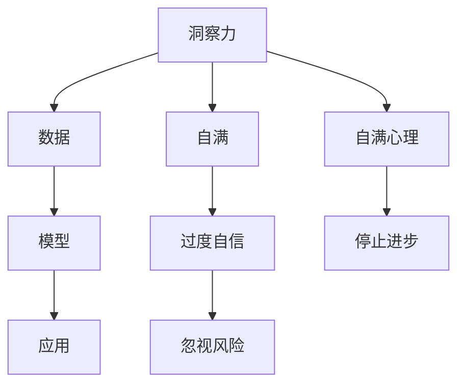

                 

## 1. 背景介绍

### 1.1 问题由来

人类历史上，无数伟大的科学家、思想家和领袖因为过度自信和自满而失去了方向，甚至误入歧途。他们的失败给后人留下深刻的教训：即使在最辉煌的时候，也要保持谦逊和警觉，以免被自满和过分自信所误导。

今天，我们生活在一个充满挑战和不确定性的时代，科技的发展正以前所未有的速度和规模改变着世界。在这个过程中，人工智能（AI）技术的迅猛发展，尤其是深度学习在各个领域的广泛应用，使得人类对于数据和模型的依赖不断加深。然而，AI技术的不断进步并未减少我们的自满和过度自信，反而在某种程度上加剧了这种倾向。

### 1.2 问题核心关键点

对于AI和数据驱动的技术来说，过度自信和自满主要体现在以下几个方面：

1. **数据驱动的假设**：
   - 许多AI模型依赖大量数据进行训练，这使得一些开发者和从业者认为数据可以解决所有问题，忽视了对模型的理解、评估和监控。

2. **模型的泛化能力**：
   - 过度依赖大规模数据训练的模型可能会在数据分布发生变化时失效，导致所谓的“模型过拟合”，即在训练集上表现良好，但在测试集或实际应用中表现不佳。

3. **错误的因果推断**：
   - 许多AI系统依赖数据相关性进行推理，却忽视了因果关系，容易产生错误的结论和决策。

4. **对抗性攻击**：
   - 随着对抗性攻击技术的发展，AI系统在面对经过精心设计的扰动数据时，可能表现出无法接受的脆弱性。

5. **公平性和偏见**：
   - AI模型容易受到训练数据中存在的偏见和偏斜的影响，可能导致系统不公平、偏见歧视等社会问题。

6. **模型的复杂性**：
   - 复杂的模型和大量的参数可能导致“模型过拟合”，使得模型在新数据上的表现不稳定，难以解释。

7. **资源和成本**：
   - 训练和部署大型AI模型需要大量资源，包括计算资源和人力资源，可能导致企业在经济上负担过重。

面对这些挑战，我们需要重新审视和理解AI技术的局限性，特别是在洞察力、模型训练和应用方面。这不仅有助于提升AI技术在实际应用中的表现，还能确保其在社会伦理和公平性上的进步。

## 2. 核心概念与联系

### 2.1 核心概念概述

为了深入探讨这些问题，我们将首先定义几个核心概念：

- **洞察力（Insight）**：洞察力指的是对问题的深入理解，包括对数据、模型和实际应用场景的深刻理解。

- **自满（Overconfidence）**：自满是指对模型的能力或数据的表现过分自信，忽视潜在的风险和挑战。

- **过度自信（Overconfidence in AI）**：过度自信是指对AI系统及其能力的过分信任，可能会忽视模型的不确定性和局限性。

- **自满心理（Complacency）**：自满心理是指过分自信后产生的一种满足感，可能导致停止追求进步和创新。

这些概念之间的联系可以通过以下Mermaid流程图来展示：



这个流程图展示了洞察力在数据、模型和应用中的应用，以及自满和过度自信如何导致忽视风险和停止进步。

## 3. 核心算法原理 & 具体操作步骤

### 3.1 算法原理概述

在AI和数据驱动技术中，洞察力通常依赖于对数据的理解和模型的不确定性评估。然而，这种洞察力可能受到数据质量、模型复杂性和算法假设的限制。以下将详细讨论这些局限性，并提出一些克服这些局限性的策略。

### 3.2 算法步骤详解

1. **数据质量评估**：
   - 数据质量评估是洞察力的基础。使用数据集的多样性和代表性，以及相关性和噪声水平来评估数据集的质量。
   - 常见的方法包括数据集的统计分析、样本分布的可视化以及使用不同的评估指标来检查数据集的代表性。

2. **模型不确定性评估**：
   - 使用模型的不确定性评估，可以帮助我们理解模型在给定数据上的表现和预测能力。
   - 常见的方法包括使用贝叶斯网络、蒙特卡罗模拟、集成学习和偏差-方差分析来估计模型的不确定性。

3. **模型复杂性控制**：
   - 控制模型的复杂性，可以帮助我们避免过度拟合和欠拟合。
   - 常见的方法包括使用正则化技术、特征选择、降维和早停策略来控制模型的复杂性。

4. **对抗性攻击检测**：
   - 对抗性攻击检测可以帮助我们评估模型在对抗性扰动数据上的鲁棒性。
   - 常见的方法包括使用对抗性样本生成技术、对抗性训练和模型鲁棒性测试来检测对抗性攻击。

5. **公平性和偏见检测**：
   - 公平性和偏见检测可以帮助我们评估模型在处理不同群体数据时的表现。
   - 常见的方法包括使用公平性指标、偏见检测和模型解释性来检测和纠正模型偏见。

### 3.3 算法优缺点

**优点**：
- 通过数据质量评估、模型不确定性评估、模型复杂性控制和对抗性攻击检测等方法，可以提升AI模型的可靠性和鲁棒性，减少过度自信和自满。
- 公平性和偏见检测可以提升AI模型的公平性和伦理性，减少偏见和歧视。

**缺点**：
- 数据质量评估和模型不确定性评估需要大量的计算资源和专业知识。
- 模型复杂性控制和对抗性攻击检测可能导致模型的性能下降。
- 公平性和偏见检测可能受到数据集中的偏见和偏斜的影响。

### 3.4 算法应用领域

AI和数据驱动技术在许多领域都有广泛的应用，包括但不限于：

- **医疗**：AI系统可以用于疾病诊断、药物研发和健康监测，但需要确保数据的质量、模型的鲁棒性和公平性。
- **金融**：AI系统可以用于风险评估、投资决策和欺诈检测，但需要确保模型的稳定性和公正性。
- **自然语言处理（NLP）**：AI系统可以用于机器翻译、情感分析和文本生成，但需要确保模型的可解释性和公平性。
- **智能推荐系统**：AI系统可以用于个性化推荐和广告投放，但需要确保模型的稳定性和公正性。

## 4. 数学模型和公式 & 详细讲解 & 举例说明

### 4.1 数学模型构建

在AI和数据驱动技术中，数学模型是理解和评估洞察力的重要工具。以下将介绍几个常见的数学模型及其构建方法。

1. **线性回归模型**：
   - 线性回归模型用于估计输入变量和输出变量之间的关系。
   - 模型公式为：$y = \beta_0 + \beta_1x_1 + \beta_2x_2 + \ldots + \beta_nx_n$。

2. **逻辑回归模型**：
   - 逻辑回归模型用于分类问题，将输入变量映射到二元输出变量。
   - 模型公式为：$\log \frac{p}{1-p} = \beta_0 + \beta_1x_1 + \beta_2x_2 + \ldots + \beta_nx_n$。

3. **决策树模型**：
   - 决策树模型用于分类和回归问题，通过一系列决策规则来划分数据。
   - 常见算法包括ID3、CART和随机森林等。

4. **支持向量机模型**：
   - 支持向量机模型用于分类问题，通过寻找最优的超平面来划分数据。
   - 模型公式为：$\text{sign}(\sum_{i=1}^{n} \alpha_iy_iK(x_i,x)+b)$。

5. **神经网络模型**：
   - 神经网络模型用于复杂的分类和回归问题，通过多层非线性变换来拟合数据。
   - 常见模型包括全连接神经网络、卷积神经网络和循环神经网络等。

### 4.2 公式推导过程

以下将以线性回归模型为例，详细推导其公式和求解过程。

假设我们有训练数据集$D = \{(x_i, y_i)\}_{i=1}^m$，其中$x_i$是输入变量，$y_i$是对应的输出变量。我们的目标是找到最优的线性回归模型$\hat{y} = \beta_0 + \beta_1x_1 + \beta_2x_2 + \ldots + \beta_nx_n$。

我们可以通过最小化均方误差（Mean Squared Error, MSE）来求解最优参数$\beta_0, \beta_1, \ldots, \beta_n$。均方误差的公式为：

$$
\text{MSE} = \frac{1}{m}\sum_{i=1}^m(y_i - \hat{y_i})^2
$$

其中$\hat{y_i}$是模型对输入$x_i$的预测值。

将模型公式代入均方误差公式中，得到：

$$
\text{MSE} = \frac{1}{m}\sum_{i=1}^m(y_i - \beta_0 - \beta_1x_1 - \beta_2x_2 - \ldots - \beta_nx_n)^2
$$

对上述公式进行最小化，得到：

$$
\min_{\beta_0, \beta_1, \ldots, \beta_n} \frac{1}{m}\sum_{i=1}^m(y_i - \beta_0 - \beta_1x_1 - \beta_2x_2 - \ldots - \beta_nx_n)^2
$$

这是一个优化问题，可以通过求解其对参数的偏导数并设置为0来求解。最终得到线性回归模型的最优参数公式：

$$
\beta = (X^TX)^{-1}X^Ty
$$

其中$X = [1, x_1, x_2, \ldots, x_n]$，$y$是输出变量的向量，$y$是输入变量的矩阵。

### 4.3 案例分析与讲解

假设我们有一个房屋价格预测模型，使用线性回归模型。我们的目标是使用训练数据集$D = \{(x_i, y_i)\}_{i=1}^m$来预测新房屋的价格。

1. **数据准备**：
   - 收集房屋的特征数据，如面积、地理位置、房龄等。
   - 收集房屋的销售价格数据。

2. **模型训练**：
   - 使用训练数据集训练线性回归模型，得到最优参数$\beta$。
   - 将新房屋的特征数据代入模型，得到预测价格。

3. **模型评估**：
   - 使用测试数据集评估模型的预测准确性。
   - 使用均方误差（MSE）来评估模型性能。

4. **模型改进**：
   - 根据模型评估结果，调整模型参数或选择更复杂的模型。
   - 使用正则化技术或特征选择方法来控制模型的复杂性。

## 5. 项目实践：代码实例和详细解释说明

### 5.1 开发环境搭建

在进行AI和数据驱动技术项目实践前，我们需要准备好开发环境。以下是使用Python进行TensorFlow和Keras开发的环境配置流程：

1. 安装Anaconda：从官网下载并安装Anaconda，用于创建独立的Python环境。

2. 创建并激活虚拟环境：
```bash
conda create -n tf-env python=3.8 
conda activate tf-env
```

3. 安装TensorFlow和Keras：根据CUDA版本，从官网获取对应的安装命令。例如：
```bash
conda install tensorflow keras cudatoolkit=11.1 -c conda-forge
```

4. 安装各类工具包：
```bash
pip install numpy pandas scikit-learn matplotlib tqdm jupyter notebook ipython
```

完成上述步骤后，即可在`tf-env`环境中开始AI项目实践。

### 5.2 源代码详细实现

下面我们以线性回归模型为例，给出使用TensorFlow和Keras进行模型训练的PyTorch代码实现。

首先，定义线性回归模型：

```python
import tensorflow as tf
from tensorflow.keras import layers

class LinearRegressionModel(tf.keras.Model):
    def __init__(self, input_dim):
        super(LinearRegressionModel, self).__init__()
        self.dense = layers.Dense(1, input_dim=input_dim)

    def call(self, inputs):
        return self.dense(inputs)

# 输入和输出数据的占位符
input_dim = 3
inputs = tf.keras.Input(shape=(input_dim,))
targets = tf.keras.Input(shape=())

# 定义线性回归模型
model = LinearRegressionModel(input_dim)

# 定义模型架构
model = layers.Dense(1, input_dim=input_dim)(model)

# 定义模型输出
output = tf.keras.layers.Dense(1)(model)

# 编译模型
model.compile(optimizer=tf.keras.optimizers.Adam(), loss='mse', metrics=['mae'])
```

然后，定义数据和模型训练过程：

```python
import numpy as np
from sklearn.datasets import load_boston
from sklearn.model_selection import train_test_split

# 加载波士顿房价数据集
boston = load_boston()

# 划分训练集和测试集
train_data, test_data, train_labels, test_labels = train_test_split(boston.data, boston.target, test_size=0.2, random_state=42)

# 将数据转换为TensorFlow数组
train_data = tf.convert_to_tensor(train_data)
test_data = tf.convert_to_tensor(test_data)
train_labels = tf.convert_to_tensor(train_labels)
test_labels = tf.convert_to_tensor(test_labels)

# 训练模型
model.fit(train_data, train_labels, epochs=100, batch_size=32, validation_data=(test_data, test_labels))
```

最后，在测试集上评估模型：

```python
# 在测试集上评估模型
test_loss, test_mae = model.evaluate(test_data, test_labels)
print(f'Test MAE: {test_mae:.3f}')
```

以上就是使用TensorFlow和Keras进行线性回归模型训练的完整代码实现。可以看到，TensorFlow和Keras提供了丰富的API，使得模型的构建和训练变得简单高效。

### 5.3 代码解读与分析

让我们再详细解读一下关键代码的实现细节：

**LinearRegressionModel类**：
- `__init__`方法：定义模型的输入维度。
- `call`方法：定义模型的前向传播过程，通过全连接层进行线性回归。

**模型编译**：
- 使用Keras提供的API编译模型，指定优化器、损失函数和评价指标。

**数据准备**：
- 使用TensorFlow提供的占位符定义输入和输出数据的形状。
- 加载波士顿房价数据集，并将其划分为训练集和测试集。
- 将数据转换为TensorFlow数组，以便模型进行训练和评估。

**模型训练**：
- 使用`fit`方法训练模型，指定训练轮数、批大小和验证数据集。

**模型评估**：
- 使用`evaluate`方法在测试集上评估模型性能，输出均方误差（MAE）。

可以看到，使用TensorFlow和Keras进行线性回归模型的构建和训练过程非常简洁高效。开发者可以将更多精力放在数据处理、模型优化和应用部署上，而不必过多关注底层的实现细节。

## 6. 实际应用场景

### 6.1 金融风险评估

在金融领域，AI系统可以用于风险评估和投资决策。通过收集和分析大量的金融数据，AI模型可以识别出潜在的风险因素，并预测未来市场的变化。然而，过度自信和自满可能导致模型忽视潜在的风险和不确定性，从而影响金融决策的准确性和稳定性。

为了避免这种风险，金融机构需要定期更新和评估AI模型的性能，确保其公平性和鲁棒性。同时，引入对抗性攻击检测和公平性检测技术，确保模型在面对新数据时的稳定性和公正性。

### 6.2 医疗疾病预测

在医疗领域，AI系统可以用于疾病预测和健康监测。通过分析患者的历史数据和当前状态，AI模型可以预测疾病的发展趋势和治疗方法。然而，过度自信和自满可能导致模型忽视患者的个体差异和不确定性，从而影响诊断和治疗的准确性和安全性。

为了避免这种风险，医疗机构需要定期更新和评估AI模型的性能，确保其公平性和鲁棒性。同时，引入对抗性攻击检测和公平性检测技术，确保模型在面对新数据时的稳定性和公正性。

### 6.3 智能推荐系统

在推荐系统领域，AI系统可以用于个性化推荐和广告投放。通过分析用户的历史行为和当前状态，AI模型可以推荐用户可能感兴趣的商品和服务。然而，过度自信和自满可能导致模型忽视用户的个性化需求和数据的不确定性，从而影响推荐的准确性和用户满意度。

为了避免这种风险，推荐系统需要定期更新和评估AI模型的性能，确保其公平性和鲁棒性。同时，引入对抗性攻击检测和公平性检测技术，确保模型在面对新数据时的稳定性和公正性。

## 7. 工具和资源推荐

### 7.1 学习资源推荐

为了帮助开发者系统掌握AI和数据驱动技术的理论基础和实践技巧，这里推荐一些优质的学习资源：

1. 《深度学习》系列博文：由AI专家撰写，深入浅出地介绍了深度学习的基本概念和前沿技术。

2. 《Python机器学习》书籍：由机器学习专家编写，全面介绍了机器学习的基本算法和应用案例。

3. TensorFlow官方文档：TensorFlow的官方文档，提供了丰富的API和样例代码，是入门AI开发的重要资源。

4. Keras官方文档：Keras的官方文档，提供了丰富的API和样例代码，是构建深度学习模型的重要工具。

5. GitHub上的开源项目：GitHub上汇聚了大量的开源项目和代码库，是学习和应用AI技术的绝佳资源。

通过对这些资源的学习实践，相信你一定能够快速掌握AI和数据驱动技术的精髓，并用于解决实际问题。

### 7.2 开发工具推荐

高效的开发离不开优秀的工具支持。以下是几款用于AI和数据驱动技术开发的常用工具：

1. Jupyter Notebook：Python的交互式编程环境，支持代码运行和结果展示，是数据科学和机器学习开发的标准工具。

2. PyCharm：一款功能强大的Python IDE，提供了代码编写、调试和测试等全面的开发支持。

3. TensorFlow和Keras：Google和Keras团队开发的深度学习框架，提供了丰富的API和样例代码，是构建深度学习模型的重要工具。

4. Weights & Biases：模型训练的实验跟踪工具，可以记录和可视化模型训练过程中的各项指标，方便对比和调优。

5. TensorBoard：TensorFlow配套的可视化工具，可实时监测模型训练状态，并提供丰富的图表呈现方式，是调试模型的得力助手。

6. Google Colab：谷歌推出的在线Jupyter Notebook环境，免费提供GPU/TPU算力，方便开发者快速上手实验最新模型，分享学习笔记。

合理利用这些工具，可以显著提升AI和数据驱动技术的开发效率，加快创新迭代的步伐。

### 7.3 相关论文推荐

AI和数据驱动技术的发展源于学界的持续研究。以下是几篇奠基性的相关论文，推荐阅读：

1. 《深度学习》（Deep Learning）：由深度学习专家Yoshua Bengio、Ian Goodfellow和Aaron Courville合著，全面介绍了深度学习的基本概念和前沿技术。

2. 《机器学习》（Machine Learning）：由机器学习专家Tom Mitchell编写，全面介绍了机器学习的基本算法和应用案例。

3. 《神经网络与深度学习》（Neural Networks and Deep Learning）：由深度学习专家Michael Nielsen编写，全面介绍了神经网络和深度学习的基本概念和实现方法。

4. 《优化理论在深度学习中的应用》（Optimization Methods in Deep Learning）：介绍了深度学习中的优化算法和超参数调优方法。

5. 《对抗性机器学习》（Adversarial Machine Learning）：介绍了对抗性攻击和防御方法，以及其在深度学习中的应用。

这些论文代表了大语言模型微调技术的发展脉络。通过学习这些前沿成果，可以帮助研究者把握学科前进方向，激发更多的创新灵感。

## 8. 总结：未来发展趋势与挑战

### 8.1 总结

本文对AI和数据驱动技术的局限性进行了全面系统的介绍。首先阐述了洞察力、自满和过度自信在数据驱动技术中的表现和影响，明确了这些局限性对于模型可靠性和公正性的重要性。其次，从数据质量评估、模型不确定性评估、模型复杂性控制和对抗性攻击检测等方法，详细讨论了如何克服这些局限性。

通过本文的系统梳理，可以看到，AI和数据驱动技术的局限性主要体现在数据质量、模型复杂性、对抗性攻击和公平性等方面。尽管这些技术在许多领域取得了显著的成就，但过度自信和自满可能使其面临潜在的风险和挑战。未来，需要从模型设计、数据处理和应用实践等多个方面协同发力，才能不断提升AI和数据驱动技术的可靠性和公正性。

### 8.2 未来发展趋势

展望未来，AI和数据驱动技术将呈现以下几个发展趋势：

1. **模型透明性和可解释性**：未来的AI模型将更加注重透明性和可解释性，使得模型输出易于理解和解释，减少过度自信和自满。

2. **数据多样性和公平性**：未来的AI系统将更加注重数据多样性和公平性，确保模型在处理不同群体数据时的公正性和鲁棒性。

3. **对抗性攻击检测和防御**：未来的AI系统将更加注重对抗性攻击检测和防御，确保模型在面对新数据时的稳定性和安全性。

4. **模型鲁棒性和鲁棒性训练**：未来的AI系统将更加注重模型鲁棒性，通过鲁棒性训练方法提高模型的稳定性和鲁棒性。

5. **知识整合和迁移学习**：未来的AI系统将更加注重知识整合和迁移学习，将符号化的先验知识与神经网络模型进行融合，提升模型的全面性和准确性。

6. **资源优化和高效部署**：未来的AI系统将更加注重资源优化和高效部署，通过模型压缩、量化加速等方法，减少计算资源和存储空间的消耗，提高系统的稳定性和可扩展性。

以上趋势凸显了AI和数据驱动技术的广阔前景。这些方向的探索发展，必将进一步提升AI和数据驱动技术的可靠性和公正性，为构建安全、可靠、可解释、可控的智能系统铺平道路。面向未来，AI和数据驱动技术还需要与其他人工智能技术进行更深入的融合，如知识表示、因果推理、强化学习等，多路径协同发力，共同推动人工智能技术的进步。

### 8.3 面临的挑战

尽管AI和数据驱动技术在许多领域取得了显著的成就，但在迈向更加智能化、普适化应用的过程中，仍面临诸多挑战：

1. **数据质量和多样性**：尽管大规模数据训练可以提高模型的性能，但数据质量和多样性对模型的影响不容忽视。如何获取高质量、多样化的数据，是未来的一个重要研究方向。

2. **模型复杂性和效率**：大型模型和高性能计算资源对模型的训练和部署带来了挑战。如何优化模型结构和资源配置，减少计算资源和存储空间的消耗，是未来的一个重要研究方向。

3. **对抗性攻击和鲁棒性**：对抗性攻击技术的发展，使得AI系统在面对扰动数据时表现出了脆弱性。如何提高模型的鲁棒性和防御能力，是未来的一个重要研究方向。

4. **公平性和偏见**：AI模型容易受到训练数据中存在的偏见和偏斜的影响。如何检测和纠正模型偏见，确保模型的公平性和公正性，是未来的一个重要研究方向。

5. **伦理和安全性**：AI系统可能对社会伦理和安全带来威胁，如误导性输出、隐私泄露等。如何确保AI系统的伦理和安全，是未来的一个重要研究方向。

6. **透明性和可解释性**：AI系统的决策过程和输出结果需要易于理解和解释，以减少过度自信和自满。如何提高AI模型的透明性和可解释性，是未来的一个重要研究方向。

7. **知识整合和迁移学习**：如何将符号化的先验知识与神经网络模型进行融合，提升模型的全面性和准确性，是未来的一个重要研究方向。

正视这些挑战，积极应对并寻求突破，将是大语言模型微调走向成熟的必由之路。相信随着学界和产业界的共同努力，这些挑战终将一一被克服，AI和数据驱动技术必将在构建安全、可靠、可解释、可控的智能系统铺平道路。总之，AI和数据驱动技术还需要从模型设计、数据处理和应用实践等多个方面协同发力，才能不断提升AI和数据驱动技术的可靠性和公正性。

### 8.4 研究展望

面对AI和数据驱动技术所面临的诸多挑战，未来的研究需要在以下几个方面寻求新的突破：

1. **无监督和半监督学习**：探索无监督和半监督学习方法，减少对大规模标注数据的依赖，提高模型的泛化能力和鲁棒性。

2. **自适应学习和迁移学习**：研究自适应学习和迁移学习方法，使得模型能够快速适应新数据和新任务，减少过拟合风险。

3. **鲁棒性和鲁棒性训练**：研究鲁棒性训练方法，提高模型的稳定性和鲁棒性，减少对抗性攻击的影响。

4. **公平性和偏见检测**：研究公平性和偏见检测方法，确保模型在处理不同群体数据时的公正性和鲁棒性。

5. **透明性和可解释性**：研究透明性和可解释性方法，提高模型的透明性和可解释性，减少过度自信和自满。

6. **知识整合和迁移学习**：研究知识整合和迁移学习方法，将符号化的先验知识与神经网络模型进行融合，提升模型的全面性和准确性。

这些研究方向的探索，必将引领AI和数据驱动技术迈向更高的台阶，为构建安全、可靠、可解释、可控的智能系统铺平道路。面向未来，AI和数据驱动技术还需要与其他人工智能技术进行更深入的融合，如知识表示、因果推理、强化学习等，多路径协同发力，共同推动人工智能技术的进步。

## 9. 附录：常见问题与解答

**Q1：什么是洞察力（Insight）？**

A: 洞察力指的是对问题的深入理解，包括对数据、模型和实际应用场景的深刻理解。

**Q2：什么是自满（Overconfidence）？**

A: 自满是指对模型的能力或数据的表现过分自信，忽视潜在的风险和挑战。

**Q3：什么是过度自信（Overconfidence in AI）？**

A: 过度自信是指对AI系统及其能力的过分信任，可能会忽视模型的不确定性和局限性。

**Q4：什么是自满心理（Complacency）？**

A: 自满心理是指过分自信后产生的一种满足感，可能导致停止追求进步和创新。

**Q5：如何评估数据集的质量？**

A: 数据集的质量评估可以通过数据集的统计分析、样本分布的可视化以及使用不同的评估指标来检查数据集的代表性。

**Q6：如何控制模型的复杂性？**

A: 模型复杂性控制可以通过正则化技术、特征选择、降维和早停策略等方法来实现。

**Q7：什么是对抗性攻击检测？**

A: 对抗性攻击检测可以帮助我们评估模型在对抗性扰动数据上的鲁棒性。

**Q8：什么是公平性和偏见检测？**

A: 公平性和偏见检测可以帮助我们评估模型在处理不同群体数据时的表现，确保模型的公平性和公正性。

作者：禅与计算机程序设计艺术 / Zen and the Art of Computer Programming

