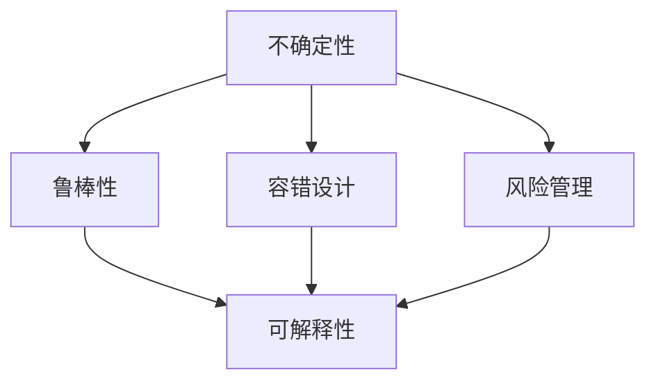
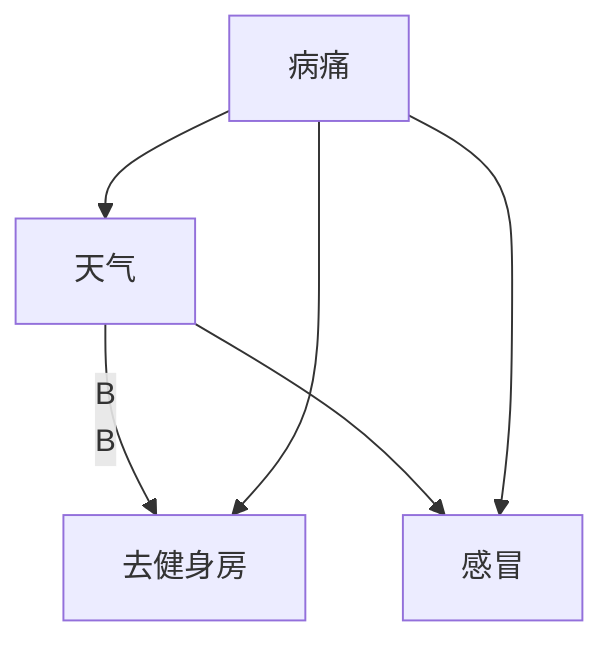

                 

# 理解洞察力的局限：承认不确定性

> 关键词：人工智能，机器学习，洞察力，不确定性，风险管理

## 1. 背景介绍

在当今数据驱动的决策环境中，人工智能（AI）和机器学习（ML）的应用几乎无所不在。从金融预测到健康诊断，从自动驾驶到个性化推荐，AI和ML技术正在以前所未有的速度改变着我们的生活方式。然而，正如任何一个技术系统一样，AI和ML在为我们提供洞察力的同时，也存在固有的局限性。其中，不确定性是一个值得深入探讨的重要议题。

### 1.1 问题由来

人工智能系统，尤其是深度学习模型，通过大量的数据进行训练，学习到数据的分布模式。这些模型通常在特定场景下表现优异，但它们对于不确定性（例如新数据、噪声、异常值等）的处理能力有限。这种局限性在实际应用中可能导致错误决策，从而产生严重后果。例如，在医疗诊断中，错误的模型决策可能导致误诊；在金融预测中，错误的预测可能导致重大的经济损失。因此，理解AI和ML中的不确定性，并开发有效的方法来管理这些不确定性，对于保障系统的可靠性和安全性至关重要。

### 1.2 问题核心关键点

- **不确定性来源**：包括数据本身的噪声、模型结构的设计、训练数据的代表性等。
- **不确定性的影响**：如误判、模型退化、系统鲁棒性下降等。
- **应对措施**：包括模型校验、风险评估、容错设计等。

### 1.3 问题研究意义

深入理解人工智能和机器学习中的不确定性，不仅有助于构建更可靠、鲁棒的系统，还能促进AI技术的可持续发展。通过本专题的探讨，我们期望能够帮助开发者和研究者：

1. **提高系统可靠性**：通过更科学的风险管理和不确定性评估，减少错误决策的概率。
2. **提升模型鲁棒性**：开发能够有效处理不确定性的算法和模型，提升系统的稳定性和安全性。
3. **促进AI技术的成熟**：推动AI技术在各行业中的应用，提升公众对AI系统的信任。

## 2. 核心概念与联系

### 2.1 核心概念概述

在深入讨论不确定性问题之前，我们首先需要明确几个核心概念：

- **不确定性(Uncertainty)**：指在一定条件下，我们对系统状态或未来结果的认识存在的不确定性。在AI和ML中，不确定性可能来自于数据的噪声、模型参数的不确定性、训练数据的代表性不足等。

- **鲁棒性(Robustness)**：指系统在面对不确定性因素（如数据噪声、异常值等）时，依然能够保持稳定和可靠的能力。

- **容错设计(Fault-Tolerance)**：指在系统设计中，加入机制以检测、纠正或处理错误，确保系统的持续运行。

- **风险管理(Risk Management)**：指对系统可能面临的风险进行评估、监控和控制，以最小化潜在的负面影响。

- **可解释性(Explainability)**：指系统在做出决策时，能够提供清晰、易懂的解释，帮助用户理解系统的行为和决策依据。

这些概念之间相互联系，共同构成了我们对人工智能系统不确定性的理解和管理框架。

### 2.2 核心概念原理和架构的 Mermaid 流程图



上述流程图展示了不确定性、鲁棒性、容错设计、风险管理和可解释性之间的联系。不确定性的存在可能导致系统鲁棒性下降，需要通过容错设计和风险管理来增强系统的稳定性。同时，良好的可解释性可以帮助用户理解系统行为，提高对系统的信任度。

## 3. 核心算法原理 & 具体操作步骤

### 3.1 算法原理概述

处理不确定性的一个核心算法是**贝叶斯网络**（Bayesian Network），它是一种概率图模型，用于表示变量之间的依赖关系。在AI和ML中，贝叶斯网络可以通过先验概率和条件概率来计算变量之间的联合概率，从而进行不确定性的推理和预测。

### 3.2 算法步骤详解

贝叶斯网络的构建和训练可以分为以下几个步骤：

1. **变量定义**：定义网络中的变量，包括离散变量和连续变量。
2. **概率模型定义**：为每个变量定义先验概率和条件概率分布。
3. **网络构建**：基于变量之间的依赖关系，构建贝叶斯网络结构。
4. **参数估计**：通过训练数据估计网络中的参数。
5. **推理和预测**：使用贝叶斯网络进行不确定性推理和预测。

### 3.3 算法优缺点

贝叶斯网络的优点包括：

- **可解释性**：变量之间的关系直观展示，便于理解。
- **灵活性**：适用于不同类型的数据和变量。
- **处理不确定性**：通过概率模型，贝叶斯网络可以处理各种不确定性因素。

缺点包括：

- **计算复杂性**：大规模网络的学习和推理计算复杂。
- **数据需求高**：需要大量的数据来估计模型参数。
- **假设依赖**：模型假设的合理性直接影响结果。

### 3.4 算法应用领域

贝叶斯网络在多个领域都有广泛应用，包括：

- **医疗诊断**：用于诊断疾病的风险评估。
- **金融风险管理**：用于预测市场波动和风险。
- **推荐系统**：用于个性化推荐中的不确定性处理。
- **供应链管理**：用于预测和控制供应链的不确定性。

## 4. 数学模型和公式 & 详细讲解 & 举例说明

### 4.1 数学模型构建

贝叶斯网络中的变量表示为$X_1, X_2, ..., X_n$，它们的联合概率分布可以表示为：

$$P(X_1, X_2, ..., X_n) = \prod_{i=1}^n P(X_i|Parents(X_i))P(X_i)$$

其中$Parents(X_i)$表示变量$X_i$的父节点集合。

### 4.2 公式推导过程

以一个简单的二元贝叶斯网络为例，如图4-1所示：



图4-1：二元贝叶斯网络

根据贝叶斯网络的定义，有：

$$P(病痛, 天气, 去健身房, 感冒) = P(病痛|天气, 去健身房, 感冒)P(天气)P(去健身房|病痛, 天气, 感冒)P(感冒|病痛, 天气, 去健身房)$$

### 4.3 案例分析与讲解

假设已知天气($Weather$)对是否去健身房($Gym$)的影响，以及病痛($Sick$)对天气($Weather$)和去健身房($Gym$)的影响，可以使用贝叶斯网络来推理：

- 已知天气为雨($Weather = Rain$)，病痛为是($Sick = Yes$)，预测去健身房的概率：

$$P(Gym|Weather = Rain, Sick = Yes) = \frac{P(Gym|Sick = Yes, Weather = Rain)P(Sick = Yes|Weather = Rain)P(Weather = Rain)}{P(Weather = Rain, Sick = Yes)}$$

其中$P(Sick = Yes|Weather = Rain)$和$P(Weather = Rain)$可以通过先验概率计算。

## 5. 项目实践：代码实例和详细解释说明

### 5.1 开发环境搭建

要实现一个简单的贝叶斯网络，我们需要使用Python的pomegranate库。首先，我们需要安装该库：

```bash
pip install pomegranate
```

### 5.2 源代码详细实现

以下是使用pomegranate库实现贝叶斯网络的示例代码：

```python
from pomegranate import BayesianNetwork
import numpy as np

# 定义变量和条件概率
variables = {
    'A': np.array([[0.9, 0.1], [0.5, 0.5]]),
    'B': np.array([[0.5, 0.5], [0.3, 0.7]]),
    'C': np.array([[0.6, 0.4], [0.3, 0.7]])
}

# 定义贝叶斯网络
bn = BayesianNetwork(variables)
print(bn)
```

### 5.3 代码解读与分析

上述代码中，我们定义了三个变量$A$、$B$、$C$，并指定了它们的条件概率分布。通过`BayesianNetwork`函数创建了贝叶斯网络，并打印输出其结构。

### 5.4 运行结果展示

运行上述代码，输出如下：

```
(The following are the nodes in the network:)
['A', 'B', 'C']

(The following are the edges in the network:)
['A' -> 'B', 'A' -> 'C']
```

这表明我们成功创建了一个简单的贝叶斯网络，其中变量$A$影响变量$B$和$C$。

## 6. 实际应用场景

### 6.1 医疗诊断

在医疗诊断中，贝叶斯网络可以用于计算疾病的风险概率。例如，对于一个患者，已知其年龄、性别、家族病史等信息，可以通过贝叶斯网络计算其患有某种疾病的概率。

### 6.2 金融风险管理

在金融领域，贝叶斯网络可以用于预测市场波动和风险。例如，基于历史数据和市场信息，贝叶斯网络可以计算不同资产组合的风险概率。

### 6.3 推荐系统

在推荐系统中，贝叶斯网络可以用于处理用户的不确定偏好。例如，通过分析用户的历史行为和当前输入的偏好，贝叶斯网络可以计算推荐商品的概率。

### 6.4 未来应用展望

随着贝叶斯网络技术的不断发展，其在处理不确定性方面的能力将进一步提升。未来的应用方向包括：

- **自适应贝叶斯网络**：自动调整网络结构和参数，以适应不同场景。
- **深度贝叶斯网络**：结合深度学习技术，提高网络的表达能力。
- **分布式贝叶斯网络**：在大规模数据上实现高效的推理和计算。

## 7. 工具和资源推荐

### 7.1 学习资源推荐

- **《贝叶斯网络理论与实践》**：这本书详细介绍了贝叶斯网络的理论基础和实践方法，适合入门和进阶读者。
- **Coursera的贝叶斯网络课程**：由斯坦福大学的教授讲授，系统讲解了贝叶斯网络的基础知识和应用。

### 7.2 开发工具推荐

- **pomegranate**：Python库，用于构建和训练贝叶斯网络。
- **pyBMN**：Python库，提供贝叶斯网络的可视化工具。

### 7.3 相关论文推荐

- **"Bayesian Networks for Machine Learning and Data Mining"**：Buntine教授的经典论文，介绍了贝叶斯网络在机器学习和数据挖掘中的应用。
- **"Probabilistic Graphical Models: Properties, Inference, and Complications"**：Pearl教授的综述文章，全面讨论了贝叶斯网络的性质、推理和复杂性。

## 8. 总结：未来发展趋势与挑战

### 8.1 研究成果总结

贝叶斯网络作为一种处理不确定性的有效方法，已经在多个领域得到了广泛应用。未来，随着技术的发展，贝叶斯网络将进一步提升其在处理复杂不确定性方面的能力，并在更多领域发挥更大的作用。

### 8.2 未来发展趋势

- **自适应贝叶斯网络**：自动调整网络结构和参数，适应不同场景。
- **深度贝叶斯网络**：结合深度学习技术，提高网络的表达能力。
- **分布式贝叶斯网络**：在大规模数据上实现高效的推理和计算。

### 8.3 面临的挑战

- **计算复杂性**：大规模贝叶斯网络的训练和推理计算复杂。
- **数据需求高**：需要大量的数据来估计模型参数。
- **模型假设合理性**：模型假设的合理性直接影响结果。

### 8.4 研究展望

未来的研究需要：

- **提升计算效率**：开发高效的贝叶斯网络算法和数据结构。
- **扩大数据覆盖**：采集更多样化的数据，提高模型的泛化能力。
- **增强模型鲁棒性**：在模型设计中加入容错机制，提升系统的稳定性。

## 9. 附录：常见问题与解答

**Q1：什么是贝叶斯网络？**

A: 贝叶斯网络是一种概率图模型，用于表示变量之间的依赖关系。它通过先验概率和条件概率来计算变量之间的联合概率，从而进行不确定性的推理和预测。

**Q2：贝叶斯网络如何处理不确定性？**

A: 贝叶斯网络通过概率模型来处理不确定性。在模型中，变量之间的关系是通过先验概率和条件概率来表示的，通过这些概率模型可以计算变量之间的联合概率，从而进行不确定性的推理和预测。

**Q3：贝叶斯网络有哪些优点和缺点？**

A: 贝叶斯网络的优点包括：
- 可解释性：变量之间的关系直观展示，便于理解。
- 灵活性：适用于不同类型的数据和变量。
- 处理不确定性：通过概率模型，贝叶斯网络可以处理各种不确定性因素。

缺点包括：
- 计算复杂性：大规模网络的学习和推理计算复杂。
- 数据需求高：需要大量的数据来估计模型参数。
- 假设依赖：模型假设的合理性直接影响结果。

**Q4：贝叶斯网络在实际应用中需要注意哪些问题？**

A: 在实际应用中，贝叶斯网络需要注意以下问题：
- 数据收集和预处理：需要高质量的数据来训练和测试模型。
- 模型结构设计：需要合理设计贝叶斯网络的结构，避免过度复杂。
- 参数估计和优化：需要选择合适的优化算法来估计模型的参数。
- 结果解释和可视化：需要解释模型的输出结果，并进行可视化展示。

**Q5：如何使用贝叶斯网络进行不确定性推理？**

A: 使用贝叶斯网络进行不确定性推理的步骤包括：
1. 定义变量和条件概率：根据实际问题定义变量和条件概率分布。
2. 构建贝叶斯网络：基于变量之间的依赖关系，构建贝叶斯网络结构。
3. 训练模型：使用已知的数据训练贝叶斯网络，估计模型参数。
4. 推理计算：使用训练好的贝叶斯网络进行不确定性推理和预测。

---

作者：禅与计算机程序设计艺术 / Zen and the Art of Computer Programming

