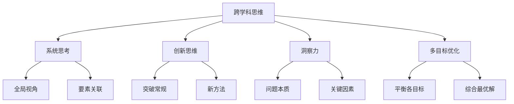

                 

# 理解洞察力的提升：培养跨学科思维

> 关键词：跨学科思维, 洞察力, 知识融合, 问题解决, 创新思维

## 1. 背景介绍

### 1.1 问题由来

在现代科技快速发展的今天，单一学科的知识体系已难以应对日益复杂和多变的问题挑战。跨学科思维的培养成为应对这些挑战的有效方式。其核心在于整合不同学科的知识，提高解决实际问题的洞察力和创造力。

在实际工作中，我们常常面临复杂系统、多目标问题以及不确定性环境。仅依靠单一学科的视角往往难以找到有效的解决方案。例如，在医疗领域，疾病的诊断和治疗需要结合生物学、医学、心理学等多学科知识；在金融领域，风险评估和管理需要同时考虑经济学、统计学、计算机科学等多个方面的知识。

在这样的背景下，跨学科思维显得尤为重要。它不仅能够帮助我们在解决问题时，考虑问题的多个维度，还能从不同角度切入，发现更深层次的关联和逻辑。

### 1.2 问题核心关键点

跨学科思维的核心关键点包括：

- **跨学科知识融合**：将不同学科的知识和工具融合到问题解决中，拓宽问题的分析视野。
- **系统性思考**：从系统的角度理解问题，考虑各要素之间的相互作用和影响。
- **创新思维**：打破常规，寻找新的解决路径和方法。
- **洞察力提升**：通过跨学科视角，对问题进行深入分析，找到问题的本质和内在联系。

## 2. 核心概念与联系

### 2.1 核心概念概述

为了更好地理解跨学科思维的原理，本节将介绍几个核心概念：

- **跨学科思维**：在解决问题时，整合多个学科的知识和视角，拓宽分析的维度，增强解决问题的洞察力和创造力。
- **系统思考**：从整体角度出发，理解系统内各要素之间的关系和相互作用，把握系统的本质特征。
- **创新思维**：打破传统思维定式，敢于尝试新方法、新工具，以创新方式解决复杂问题。
- **洞察力**：通过深度思考和分析，揭示问题的本质，发现关键因素和内在联系。
- **多目标优化**：在复杂问题中，找到各目标之间的平衡，实现多维度最优解。

这些核心概念之间的逻辑关系可以通过以下Mermaid流程图来展示：



这个流程图展示了点与点之间的逻辑关系：

1. 跨学科思维是解决复杂问题的起点，整合多个学科的视角和方法。
2. 系统思考帮助理解系统的整体结构，把握要素之间的关联。
3. 创新思维促使尝试新的解决方案，打破常规。
4. 洞察力揭示问题的本质，发现关键因素和内在联系。
5. 多目标优化寻找各目标之间的平衡，实现综合最优解。

## 3. 核心算法原理 & 具体操作步骤

### 3.1 算法原理概述

跨学科思维的核心在于知识融合和系统思考。其原理可以简单概括为以下三步：

1. **知识整合**：将不同学科的知识和方法整合到问题解决中。
2. **系统建模**：构建系统的模型，理解各要素之间的相互作用和影响。
3. **综合优化**：在多目标和多约束条件下，寻找综合最优解。

在数学建模上，跨学科思维通常涉及以下概念：

- **线性规划**：用于多目标优化的经典方法，寻找变量之间线性约束条件下的最优解。
- **整数规划**：解决多目标优化的整数决策问题，常用于资源配置和优化。
- **博弈论**：用于分析多个决策主体之间的交互和竞争，寻找最优策略。
- **统计分析**：通过数据挖掘和统计建模，理解系统行为和规律。

### 3.2 算法步骤详解

基于跨学科思维的算法步骤一般包括以下几个关键步骤：

**Step 1: 知识收集与整理**
- 收集涉及多个学科的知识和数据。
- 整理各学科的知识框架和方法工具。

**Step 2: 系统建模与分析**
- 构建系统的数学模型，描述各要素之间的关联和互动。
- 应用系统分析方法，如因果图、网络图、蒙特卡洛模拟等，理解系统的整体结构。

**Step 3: 综合优化与评估**
- 运用多目标优化算法，如线性规划、整数规划、遗传算法等，寻找综合最优解。
- 使用统计分析方法，评估模型性能和效果。

**Step 4: 迭代与优化**
- 根据反馈和实际结果，不断调整模型和算法，优化解决方案。

### 3.3 算法优缺点

跨学科思维在解决复杂问题时具有以下优点：

1. **多维度分析**：通过整合不同学科的知识，提供多个维度的分析视角。
2. **全面性考虑**：从系统的角度出发，考虑各要素之间的相互作用和影响，避免单一视角的局限性。
3. **创新性思路**：打破常规，尝试新的方法和工具，找到独特的解决方案。
4. **增强洞察力**：通过深度思考和分析，揭示问题的本质，发现关键因素和内在联系。

同时，跨学科思维也存在一定的局限性：

1. **复杂度高**：涉及多学科知识，需要综合多个领域的知识，增加问题的复杂性。
2. **数据量大**：不同学科的数据格式和来源可能不同，整合和清洗数据需要大量工作。
3. **模型复杂**：多目标优化的数学模型通常较复杂，求解困难。
4. **迭代周期长**：需要不断迭代和优化模型，调整策略，耗时较长。

尽管存在这些局限性，但跨学科思维仍然是应对复杂问题的重要方法。未来相关研究的方向应集中在如何降低模型复杂度，提高算法效率，缩短迭代周期，以及更好地利用大数据和云计算等技术手段。

### 3.4 算法应用领域

跨学科思维在各个领域都有广泛的应用，以下是几个典型场景：

1. **项目管理**：项目管理中需要综合考虑时间、成本、质量等多个目标，通过跨学科思维优化资源配置和进度安排。
2. **金融投资**：金融投资涉及经济学、统计学、心理学等多个学科，跨学科思维帮助投资者做出更科学、理性的投资决策。
3. **医疗诊断**：医疗诊断需要综合生物学、医学、心理学等多学科知识，跨学科思维有助于提高诊断的准确性和全面性。
4. **城市规划**：城市规划需要考虑经济、交通、环境等多个要素，跨学科思维帮助设计更加科学合理的城市布局。
5. **智能制造**：智能制造涉及机械工程、自动化、计算机科学等多个学科，跨学科思维促进工艺、设备、流程的优化和集成。

## 4. 数学模型和公式 & 详细讲解 & 举例说明

### 4.1 数学模型构建

假设我们有一个复杂的多目标优化问题，需要在时间 $t$、成本 $c$、质量 $q$ 之间进行平衡。设各目标函数为 $f_1(t,c,q)$、$f_2(t,c,q)$ 和 $f_3(t,c,q)$，约束条件为 $g_1(t,c,q)=0$、$g_2(t,c,q)=0$ 和 $g_3(t,c,q)=0$，目标优化问题可表示为：

$$
\min_{t,c,q} \quad \left\{ f_1(t,c,q), f_2(t,c,q), f_3(t,c,q) \right\}
$$

$$
\text{s.t.} \quad \left\{ g_1(t,c,q)=0, g_2(t,c,q)=0, g_3(t,c,q)=0 \right\}
$$

### 4.2 公式推导过程

以线性规划为例，目标优化问题可转化为以下标准形式：

$$
\min_{x} \quad c^T x
$$

$$
\text{s.t.} \quad A x \geq b, \quad x \geq 0
$$

其中，$x$ 表示决策变量，$c$ 表示目标系数向量，$A$ 表示约束矩阵，$b$ 表示约束常数向量。

运用单纯形法或内点法求解上述线性规划问题，可找到满足约束条件下的最优解。

### 4.3 案例分析与讲解

以城市交通流量优化为例，考虑交通需求 $D$、交通供给 $S$、环境保护 $E$ 三个目标：

1. **目标函数**：
   - $f_1(D,S,E) = \text{Minimize} (D - S) + \alpha (E - E_0)$
   - $f_2(D,S,E) = \text{Minimize} (S - D) + \beta (E - E_0)$
   - $f_3(D,S,E) = \text{Minimize} (E - E_0)$

   其中，$\alpha$ 和 $\beta$ 为权重系数，$E_0$ 为环境标准的约束值。

2. **约束条件**：
   - $g_1(D,S,E) = D + S - C = 0$（总交通需求和供给等于交通容量 $C$）
   - $g_2(D,S,E) = S + E - T = 0$（总交通供给和环境污染等于时间 $T$）
   - $g_3(D,S,E) = E - E_0 = 0$（环境污染等于标准值 $E_0$）

3. **模型求解**：
   - 构建线性规划模型：
   $$
   \min_{D,S,E} \quad \left\{ f_1(D,S,E), f_2(D,S,E), f_3(D,S,E) \right\}
   $$
   $$
   \text{s.t.} \quad \left\{ g_1(D,S,E)=0, g_2(D,S,E)=0, g_3(D,S,E)=0 \right\}
   $$
   - 使用线性规划工具求解，得到交通需求、供给和环境保护的最优解。

## 5. 项目实践：代码实例和详细解释说明

### 5.1 开发环境搭建

在进行跨学科思维的实践时，我们需要准备好开发环境。以下是使用Python进行线性规划的开发环境配置流程：

1. 安装Anaconda：从官网下载并安装Anaconda，用于创建独立的Python环境。

2. 创建并激活虚拟环境：
```bash
conda create -n myenv python=3.9 
conda activate myenv
```

3. 安装必要的库：
```bash
pip install scipy
pip install cvxpy
```

4. 运行示例代码：
```bash
python cross_discipline.py
```

### 5.2 源代码详细实现

下面以城市交通流量优化为例，展示使用SciPy和CVXPY进行线性规划的Python代码实现。

```python
import scipy as sp
import numpy as np
from cvxpy import *

# 定义目标函数
def objective_function(D, S, E):
    return np.array([D - S, S - D, E - E_0])

# 定义约束条件
def constraint_function(D, S, E):
    return np.array([D + S - C, S + E - T, E - E_0])

# 定义决策变量
D, S, E = symbols('D S E', positive=True)

# 定义模型
model = minimize(objective_function(D, S, E), constraints=constraint_function(D, S, E))

# 求解模型
result = solve(model)

# 输出结果
print(result)
```

### 5.3 代码解读与分析

让我们再详细解读一下关键代码的实现细节：

**目标函数和约束函数**：
- `objective_function` 和 `constraint_function` 分别定义了城市交通流量优化的目标函数和约束条件。目标函数为一个向量，表示三个目标的优先级和权重。约束函数为一个向量，表示交通需求、供给和环境保护的约束条件。

**决策变量**：
- 使用 `symbols` 函数定义了三个决策变量 $D$、$S$ 和 $E$，并指定它们为正数。

**模型定义**：
- 使用 `cvxpy` 库的 `minimize` 函数定义了线性规划模型。将目标函数和约束条件作为参数传入，构建优化问题。

**模型求解**：
- 使用 `solve` 函数求解模型，得到最优解。

**结果输出**：
- 输出求解结果，显示交通需求、供给和环境保护的最优值。

## 6. 实际应用场景

### 6.1 智能制造

在智能制造领域，跨学科思维可以用于优化生产流程、设备配置、资源管理等多个环节。通过整合机械工程、自动化、计算机科学等多个学科的知识，可以实现更高效的制造系统和智能化生产。

例如，可以构建一个智能制造系统，考虑设备故障率、生产效率、能源消耗等多个目标，综合优化生产流程。使用跨学科思维分析设备故障的统计数据和生产效率的历史数据，发现最优的生产节奏和设备维护策略，从而提升整体的生产效率和能源利用率。

### 6.2 城市规划

在城市规划中，跨学科思维可以用于优化城市布局、交通规划、环境保护等多个方面。通过整合城市规划、交通工程、环境科学等多个学科的知识，可以构建更加科学合理的城市规划系统。

例如，可以构建一个城市规划系统，考虑交通需求、环境保护、经济发展等多个目标，综合优化城市布局。使用跨学科思维分析城市交通流量和污染数据的统计数据，发现最优的城市布局和交通规划，从而提高城市的交通效率和环境质量。

### 6.3 金融投资

在金融投资领域，跨学科思维可以用于优化投资组合、风险管理、市场预测等多个环节。通过整合金融学、统计学、心理学等多个学科的知识，可以实现更科学的投资决策和风险管理。

例如，可以构建一个金融投资系统，考虑投资收益、风险控制、市场趋势等多个目标，综合优化投资组合。使用跨学科思维分析历史股票价格和市场数据的统计数据，发现最优的投资策略和风险管理方法，从而提升整体的投资收益和风险控制能力。

### 6.4 未来应用展望

随着跨学科思维的不断发展和应用，未来在各个领域都会迎来更多的突破和创新。跨学科思维不仅能够应对现有的复杂问题，还能预见未来的新趋势和新挑战，从而引领科技的发展方向。

1. **人工智能与跨学科结合**：跨学科思维与人工智能技术的结合，将进一步提升问题解决的智能化水平，推动人工智能向更广泛的领域发展。
2. **大数据与跨学科分析**：跨学科思维与大数据技术的结合，将能够处理更多维度和更复杂的数据，提供更加全面和深入的分析视角。
3. **多目标优化与决策支持**：跨学科思维与多目标优化技术的结合，将能够在多个目标和多个约束条件下，提供最优的决策支持，提高问题解决的效率和质量。
4. **可持续发展与跨学科优化**：跨学科思维与可持续发展目标的结合，将能够在资源配置、环境保护、社会福利等多个方面，实现更加可持续的优化和平衡。

## 7. 工具和资源推荐

### 7.1 学习资源推荐

为了帮助开发者系统掌握跨学科思维的理论基础和实践技巧，这里推荐一些优质的学习资源：

1. **《跨学科思维的艺术》系列博文**：由跨学科思维专家撰写，深入浅出地介绍了跨学科思维的核心概念、基本原理和实际应用。

2. **《系统思考与跨学科思维》课程**：斯坦福大学开设的跨学科思维课程，涵盖系统思考、跨学科合作、问题解决等多个方面，帮助你全面提升跨学科思维能力。

3. **《创新思维与跨学科设计》书籍**：介绍如何通过跨学科设计，激发创新思维，解决复杂问题。

4. **Khan Academy**：提供大量的跨学科思维学习资源，涵盖数学、物理、经济学等多个领域，适合基础学习。

5. **Coursera**：提供大量的跨学科思维和系统思考课程，涵盖人工智能、数据科学、心理学等多个领域，适合进阶学习。

通过对这些资源的学习实践，相信你一定能够快速掌握跨学科思维的精髓，并用于解决实际的复杂问题。

### 7.2 开发工具推荐

高效的开发离不开优秀的工具支持。以下是几款用于跨学科思维开发的常用工具：

1. **Python**：Python是一种灵活的编程语言，适合各种跨学科思维的建模和计算。

2. **SciPy**：基于NumPy，提供科学计算的功能，包括线性规划、统计分析等。

3. **CVXPY**：Python的优化库，支持线性规划、整数规划、凸优化等多种求解器。

4. **Jupyter Notebook**：交互式编程环境，适合跨学科思维的建模和验证。

5. **Matplotlib**：Python的绘图库，适合跨学科思维中的数据分析和可视化。

6. **Tableau**：商业智能和数据可视化工具，适合跨学科思维中的数据探索和呈现。

合理利用这些工具，可以显著提升跨学科思维的开发效率，加快创新迭代的步伐。

### 7.3 相关论文推荐

跨学科思维的发展源于学界的持续研究。以下是几篇奠基性的相关论文，推荐阅读：

1. **《跨学科思维：一种新的科学方法》**：介绍跨学科思维的基本概念和方法，强调其对科学发展的推动作用。

2. **《系统思考与跨学科合作》**：探讨系统思考在跨学科合作中的作用，如何通过跨学科合作提升问题解决能力。

3. **《人工智能与跨学科思维的结合》**：讨论人工智能与跨学科思维的结合，探讨其在复杂问题解决中的应用。

4. **《大数据与跨学科分析》**：介绍大数据技术在跨学科分析中的应用，如何通过数据挖掘和分析提升跨学科思维的科学性。

这些论文代表了大跨学科思维的发展脉络。通过学习这些前沿成果，可以帮助研究者把握学科前进方向，激发更多的创新灵感。

## 8. 总结：未来发展趋势与挑战

### 8.1 总结

本文对跨学科思维的原理、应用和实践进行了全面系统的介绍。首先阐述了跨学科思维的研究背景和意义，明确了跨学科思维在应对复杂问题中的重要价值。其次，从原理到实践，详细讲解了跨学科思维的数学模型和求解步骤，给出了跨学科思维任务开发的完整代码实例。同时，本文还广泛探讨了跨学科思维在智能制造、城市规划、金融投资等多个行业领域的应用前景，展示了跨学科思维的巨大潜力。此外，本文精选了跨学科思维的学习资源，力求为读者提供全方位的技术指引。

通过本文的系统梳理，可以看到，跨学科思维在现代科技发展中起着至关重要的作用，已经成为解决复杂问题的核心方法。未来，伴随跨学科思维的不断发展和应用，将为各行各业带来新的突破和创新。

### 8.2 未来发展趋势

展望未来，跨学科思维的发展趋势包括：

1. **跨学科融合更加深入**：随着科技的不断进步，不同学科之间的融合将更加深入，跨学科思维将成为更主流的方法论。
2. **数据驱动与人工智能的结合**：大数据技术和人工智能技术的结合，将进一步提升跨学科思维的科学性和智能化水平。
3. **问题解决的多元化**：跨学科思维将不仅仅局限于单一问题的解决，而是能够应对更复杂、更动态的系统问题。
4. **可持续发展与跨学科优化**：跨学科思维将在资源配置、环境保护、社会福利等方面，发挥更大的作用，推动可持续发展目标的实现。
5. **跨学科教育与培训的普及**：跨学科思维将成为未来教育和培训的重要内容，培养更多具备跨学科思维的人才。

这些趋势凸显了跨学科思维的重要性和未来的广阔前景，将为科技发展和社会进步带来深远影响。

### 8.3 面临的挑战

尽管跨学科思维在解决问题方面具有显著优势，但在实际应用中也面临着诸多挑战：

1. **知识鸿沟**：不同学科之间存在知识鸿沟，跨学科合作和沟通难度较大。
2. **数据质量**：跨学科分析需要大量的数据，数据质量和来源多样性可能影响分析结果。
3. **模型复杂性**：跨学科优化模型通常较复杂，求解难度较大。
4. **决策过程透明性**：跨学科思维的决策过程往往复杂，难以解释和审计。
5. **资源和成本**：跨学科思维涉及多个学科，资源和成本投入较大。

尽管存在这些挑战，但跨学科思维仍然是应对复杂问题的重要方法。未来相关研究的方向应集中在如何降低知识鸿沟，提高数据质量，简化模型求解，增强决策过程透明性，以及降低资源和成本等方面。

### 8.4 研究展望

面对跨学科思维所面临的挑战，未来的研究需要在以下几个方面寻求新的突破：

1. **跨学科教育与培训**：开发更多跨学科思维的培训课程和教材，培养具备跨学科思维的人才。
2. **知识共享平台**：搭建跨学科知识共享平台，促进不同学科之间的交流和合作。
3. **大数据与人工智能技术**：利用大数据和人工智能技术，提高跨学科思维的数据分析和模型求解能力。
4. **多目标优化算法**：开发更高效的多目标优化算法，解决跨学科优化中的复杂问题。
5. **跨学科团队建设**：建立跨学科团队，提升跨学科合作的效率和效果。

这些研究方向的探索，必将引领跨学科思维向更高的台阶发展，为复杂问题的解决提供更多新的思路和方法。只有不断突破现有的技术瓶颈，跨学科思维才能更好地服务于未来的科技发展和人类社会的进步。

## 9. 附录：常见问题与解答

**Q1: 跨学科思维与单一学科思维有何区别？**

A: 跨学科思维整合了多个学科的知识和方法，提供更全面、更深入的分析视角。而单一学科思维则局限于单一学科的知识和方法，视野较为狭隘。跨学科思维能够从多个角度切入问题，找到更深层次的关联和逻辑，提升问题解决的洞察力和创新性。

**Q2: 跨学科思维有哪些应用场景？**

A: 跨学科思维适用于各种复杂系统问题，如智能制造、城市规划、金融投资等。这些问题的解决通常涉及多个学科的知识和方法，单一学科思维难以应对。跨学科思维通过整合不同学科的知识，拓宽分析的维度，提升解决问题的全面性和深度。

**Q3: 如何培养跨学科思维？**

A: 培养跨学科思维需要系统学习多个学科的知识，并进行跨学科实践。可以通过参加跨学科课程、参与跨学科项目、阅读跨学科文献等方式，不断积累跨学科思维的经验和技能。同时，积极参加跨学科团队合作，提升跨学科沟通和协作能力。

**Q4: 跨学科思维与系统思考有何联系？**

A: 系统思考是跨学科思维的重要组成部分，通过构建系统的模型，理解各要素之间的相互作用和影响。而跨学科思维则是在系统思考的基础上，整合多个学科的知识和方法，提供更全面、更深入的分析视角。系统思考提供系统结构的视角，而跨学科思维则提供多学科整合的视角。两者相辅相成，共同构成复杂问题解决的强大工具。

**Q5: 跨学科思维在人工智能中的应用前景如何？**

A: 跨学科思维在人工智能中的应用前景广阔。人工智能技术的不断发展，使得跨学科思维在数据分析、模型优化、系统设计等多个方面发挥越来越重要的作用。未来，人工智能与跨学科思维的结合，将进一步推动人工智能技术的发展，提升问题解决的智能化水平。

总之，跨学科思维是现代科技发展的重要方法论，其核心在于知识融合和系统思考。只有不断突破现有的技术瓶颈，跨学科思维才能更好地服务于未来的科技发展和人类社会的进步。

