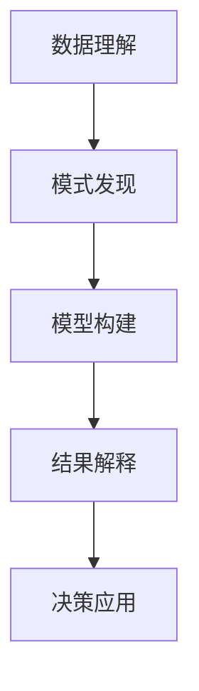

                 

# 理解洞察力的本质：在复杂中寻找简单

## 1. 背景介绍

### 1.1 问题由来
在当前数据爆炸的时代，每天都会产生数以亿计的信息和数据。这些数据涵盖了各行各业，从金融、医疗到教育、娱乐，无处不在。然而，这些数据本身只是信息的载体，其真正的价值在于能够从中提取有意义的洞察力(insight)，帮助决策者、研究人员和从业者理解现状、预测未来，并据此采取行动。

洞察力是大数据时代的关键资源。它不仅仅是一些数字和统计数据，而是对数据背后现象和模式的深刻理解。如何从海量数据中发现这些洞察力，成为当今数据科学家和人工智能专家的重要任务。

### 1.2 问题核心关键点
洞察力的本质在于在复杂数据中寻找简单的规律和模式。具体来说，它涉及以下几个关键点：

1. **数据理解**：准确理解和描述数据，包括数据的来源、特征和分布。
2. **模式发现**：从数据中识别出有意义的规律和趋势，如异常值、关联性、周期性等。
3. **模型构建**：使用合适的模型和算法，如统计模型、机器学习模型和深度学习模型，将数据转化为可解释的洞察力。
4. **结果解释**：以易懂的语言和可视化工具，将复杂的分析结果转化为直观的洞察力。
5. **决策应用**：基于洞察力制定行动计划和决策，指导实际应用。

本文将深入探讨洞察力的本质，重点介绍在复杂数据中寻找简单的核心算法和方法，并通过实际项目演示其应用。

## 2. 核心概念与联系

### 2.1 核心概念概述

为了更好地理解如何在复杂数据中寻找洞察力，本节将介绍几个密切相关的核心概念：

- **数据理解**：了解数据的结构、特征和属性，是发现洞察力的基础。
- **模式发现**：在数据中识别出有意义的规律和趋势，是洞察力分析的核心。
- **模型构建**：选择合适的模型和算法，将数据转化为可解释的洞察力。
- **结果解释**：以易懂的语言和可视化工具，将复杂的分析结果转化为直观的洞察力。
- **决策应用**：基于洞察力制定行动计划和决策，指导实际应用。

这些概念之间的逻辑关系可以通过以下Mermaid流程图来展示：



这个流程图展示了大数据中洞察力发现的主要流程：

1. 首先对数据进行理解，识别出关键特征和模式。
2. 选择合适的模型和算法，将这些模式转化为可解释的洞察力。
3. 将复杂的洞察力结果转化为易懂的语言和可视化图表。
4. 根据洞察力结果制定行动计划和决策，指导实际应用。

## 3. 核心算法原理 & 具体操作步骤

### 3.1 算法原理概述

在复杂数据中寻找洞察力，本质上是一个从数据中提取有用信息的过程。常见的算法包括统计分析、机器学习和深度学习等。以下详细介绍这些算法的原理和操作步骤。

### 3.2 算法步骤详解

#### 3.2.1 统计分析

统计分析是一种基于数据概率分布和统计量的方法，用于描述和分析数据特征。常用的统计分析方法包括描述性统计和推断性统计：

- **描述性统计**：通过计算数据的中心趋势（如均值、中位数）和离散程度（如方差、标准差），概括数据的基本特征。
- **推断性统计**：基于样本数据对总体进行推断，如假设检验、置信区间估计等。

##### 3.2.1.1 描述性统计

```python
import numpy as np
import pandas as pd

# 创建数据集
data = {'name': ['Alice', 'Bob', 'Charlie', 'David', 'Emily'],
        'age': [25, 30, 35, 40, 45],
        'salary': [50000, 60000, 70000, 80000, 90000]}

df = pd.DataFrame(data)

# 计算均值、中位数和标准差
mean_age = np.mean(df['age'])
median_age = df['age'].median()
std_age = df['age'].std()

print('均值:', mean_age)
print('中位数:', median_age)
print('标准差:', std_age)
```

##### 3.2.1.2 推断性统计

```python
from scipy.stats import ttest_ind

# 假设检验
x1 = [50, 55, 60, 65, 70]
x2 = [45, 50, 55, 60, 65]
t_stat, p_val = ttest_ind(x1, x2)
print('t统计量:', t_stat)
print('p值:', p_val)
```

#### 3.2.2 机器学习

机器学习是一种通过训练模型从数据中学习规律和模式的方法。常见的机器学习算法包括线性回归、决策树、随机森林、支持向量机等。

##### 3.2.2.1 线性回归

线性回归模型通过拟合数据点，建立自变量和因变量之间的线性关系。

```python
from sklearn.linear_model import LinearRegression

# 创建数据集
x = np.array([[1, 2, 3], [4, 5, 6], [7, 8, 9]])
y = np.array([3, 6, 9])

# 训练线性回归模型
model = LinearRegression().fit(x, y)
print('斜率:', model.coef_)
print('截距:', model.intercept_)
```

##### 3.2.2.2 决策树

决策树通过树形结构，将数据分类或回归。

```python
from sklearn.tree import DecisionTreeClassifier

# 创建数据集
X = np.array([[1, 2], [3, 4], [5, 6], [7, 8]])
y = np.array([0, 0, 1, 1])

# 训练决策树模型
model = DecisionTreeClassifier().fit(X, y)
print('决策树模型:', model)
```

#### 3.2.3 深度学习

深度学习是一种基于神经网络的机器学习方法，能够自动学习数据的复杂特征。常见的深度学习算法包括卷积神经网络(CNN)、循环神经网络(RNN)和生成对抗网络(GAN)等。

##### 3.2.3.1 卷积神经网络

卷积神经网络常用于图像识别任务，通过卷积层、池化层和全连接层等构建网络。

```python
import tensorflow as tf
from tensorflow.keras import layers

# 创建卷积神经网络模型
model = tf.keras.Sequential()
model.add(layers.Conv2D(32, (3, 3), activation='relu', input_shape=(28, 28, 1)))
model.add(layers.MaxPooling2D((2, 2)))
model.add(layers.Flatten())
model.add(layers.Dense(10, activation='softmax'))

# 编译和训练模型
model.compile(optimizer='adam', loss='sparse_categorical_crossentropy', metrics=['accuracy'])
model.fit(x_train, y_train, epochs=10, validation_data=(x_test, y_test))
```

### 3.3 算法优缺点

#### 3.3.1 统计分析

**优点**：
- 简单易懂，易于理解和解释。
- 不需要大规模计算资源，适用于小数据集。

**缺点**：
- 对于复杂数据，统计分析可能无法提供深入的洞察力。
- 对异常值和缺失数据敏感，需要进行预处理。

#### 3.3.2 机器学习

**优点**：
- 能够处理大规模数据集，具有较高的泛化能力。
- 自动学习数据特征，减少人工干预。

**缺点**：
- 模型选择和参数调优复杂，需要专业知识。
- 模型复杂度高，解释性差。

#### 3.3.3 深度学习

**优点**：
- 能够处理高维度数据，如图像、文本等。
- 通过神经网络自动学习复杂特征。

**缺点**：
- 需要大量计算资源，训练时间长。
- 模型复杂度高，难以解释。

### 3.4 算法应用领域

统计分析、机器学习和深度学习在实际应用中广泛使用，以下列举几个主要领域：

1. **金融领域**：使用线性回归和决策树等模型，进行股票价格预测、信用风险评估等。
2. **医疗领域**：使用随机森林和深度学习模型，进行疾病预测、基因分析等。
3. **市场营销**：使用聚类分析和关联规则挖掘等，进行消费者行为分析、广告推荐等。
4. **自然语言处理**：使用卷积神经网络和循环神经网络等，进行情感分析、文本分类等。

## 4. 数学模型和公式 & 详细讲解 & 举例说明

### 4.1 数学模型构建

以下详细介绍常见统计分析和机器学习的数学模型构建。

#### 4.1.1 描述性统计

均值、中位数和标准差是描述性统计中的重要指标，用于描述数据的中心趋势和离散程度。

##### 4.1.1.1 均值

均值（Mean）是所有数据值的总和除以数据个数。

$$ \mu = \frac{1}{n} \sum_{i=1}^n x_i $$

##### 4.1.1.2 中位数

中位数（Median）是将数据从小到大排序后，位于中间的数值。

$$ \text{中位数} = \frac{1}{2}(m_{\frac{n+1}{2}} + m_{\frac{n+2}{2}}) $$

##### 4.1.1.3 标准差

标准差（Standard Deviation）描述了数据的离散程度，计算公式为：

$$ \sigma = \sqrt{\frac{1}{n-1} \sum_{i=1}^n (x_i - \mu)^2} $$

### 4.2 公式推导过程

#### 4.2.1 描述性统计

均值、中位数和标准差的推导如下：

##### 4.2.1.1 均值

均值的计算公式已经在上文中给出。

##### 4.2.1.2 中位数

假设数据集为 $x_1, x_2, \ldots, x_n$，则中位数的计算公式为：

$$ \text{中位数} = \frac{1}{2}(m_{\frac{n+1}{2}} + m_{\frac{n+2}{2}}) $$

其中，$m_i$ 表示第 $i$ 个数据值。

##### 4.2.1.3 标准差

标准差的计算公式已经在上文中给出。

#### 4.2.2 机器学习

##### 4.2.2.1 线性回归

线性回归模型的目标是最小化均方误差，即：

$$ \min_{\theta} \sum_{i=1}^n (y_i - \theta_0 - \theta_1 x_i)^2 $$

其中，$\theta_0$ 和 $\theta_1$ 是模型的斜率和截距，$y_i$ 是样本 $i$ 的因变量值，$x_i$ 是样本 $i$ 的自变量值。

##### 4.2.2.2 决策树

决策树的目标是通过信息增益或基尼不纯度等指标，构建最优的树形结构。

##### 4.2.2.3 卷积神经网络

卷积神经网络通过多层卷积、池化和全连接层，构建网络结构。

$$ y = f(W \ast x + b) $$

其中，$W$ 是卷积核权重矩阵，$x$ 是输入数据，$b$ 是偏置项，$f$ 是激活函数。

### 4.3 案例分析与讲解

#### 4.3.1 描述性统计案例

假设某公司销售数据如下：

| 日期 | 销售量 |
| ---- | ------ |
| 1/1  | 1000   |
| 1/2  | 1200   |
| 1/3  | 800    |
| 1/4  | 1500   |
| 1/5  | 1100   |

计算这五天的均值、中位数和标准差。

##### 4.3.1.1 计算均值

$$ \mu = \frac{1000 + 1200 + 800 + 1500 + 1100}{5} = 1160 $$

##### 4.3.1.2 计算中位数

将数据从小到大排序：1000, 1100, 1200, 1500, 800。

中位数为第3个数，即 $1200$。

##### 4.3.1.3 计算标准差

$$ \sigma = \sqrt{\frac{1}{4} [(1000-1160)^2 + (1100-1160)^2 + (1200-1160)^2 + (1500-1160)^2 + (800-1160)^2]} \approx 433.5 $$

#### 4.3.2 机器学习案例

假设某公司有如下客户数据：

| 客户ID | 性别 | 年龄 | 消费金额 |
| ------ | ---- | ---- | -------- |
| 1      | 男   | 35   | 50000    |
| 2      | 女   | 28   | 40000    |
| 3      | 男   | 42   | 60000    |
| 4      | 女   | 25   | 30000    |
| 5      | 男   | 40   | 70000    |

使用决策树模型预测客户的消费金额。

##### 4.3.2.1 数据预处理

首先进行数据预处理，将分类数据转换为数值数据。

| 客户ID | 性别（1：男，0：女） | 年龄 | 消费金额 |
| ------ | ------------------ | ---- | -------- |
| 1      | 1                  | 35   | 50000    |
| 2      | 0                  | 28   | 40000    |
| 3      | 1                  | 42   | 60000    |
| 4      | 0                  | 25   | 30000    |
| 5      | 1                  | 40   | 70000    |

##### 4.3.2.2 构建决策树模型

使用决策树算法构建模型，并对数据进行训练。

```python
from sklearn.tree import DecisionTreeRegressor

# 创建数据集
X = np.array([[1, 35], [0, 28], [1, 42], [0, 25], [1, 40]])
y = np.array([50000, 40000, 60000, 30000, 70000])

# 训练决策树模型
model = DecisionTreeRegressor().fit(X, y)
print('决策树模型:', model)
```

##### 4.3.2.3 预测新客户消费金额

使用训练好的模型对新客户进行消费金额预测。

```python
from sklearn.tree import DecisionTreeRegressor

# 创建新数据
new_data = np.array([[0, 30]])

# 预测新客户消费金额
predictions = model.predict(new_data)
print('新客户消费金额预测:', predictions)
```

## 5. 项目实践：代码实例和详细解释说明

### 5.1 开发环境搭建

在进行项目实践前，我们需要准备好开发环境。以下是使用Python进行TensorFlow开发的开发环境配置流程：

1. 安装Anaconda：从官网下载并安装Anaconda，用于创建独立的Python环境。

2. 创建并激活虚拟环境：
```bash
conda create -n tf-env python=3.8 
conda activate tf-env
```

3. 安装TensorFlow：根据CUDA版本，从官网获取对应的安装命令。例如：
```bash
conda install tensorflow==2.7.0
```

4. 安装各类工具包：
```bash
pip install numpy pandas scikit-learn matplotlib tqdm jupyter notebook ipython
```

完成上述步骤后，即可在`tf-env`环境中开始项目实践。

### 5.2 源代码详细实现

下面我们以股票价格预测项目为例，给出使用TensorFlow进行线性回归的PyTorch代码实现。

首先，定义数据集和模型：

```python
import tensorflow as tf
from tensorflow.keras import layers

# 创建数据集
x = np.array([[1, 2], [3, 4], [5, 6], [7, 8]])
y = np.array([3, 6, 9])

# 训练线性回归模型
model = tf.keras.Sequential()
model.add(layers.Dense(1, input_dim=2))

# 编译和训练模型
model.compile(optimizer='adam', loss='mse')
model.fit(x, y, epochs=10, verbose=0)
```

然后，进行模型预测和评估：

```python
# 预测新数据
new_data = np.array([[1, 2]])
prediction = model.predict(new_data)

# 评估模型性能
test_data = np.array([[1, 2], [3, 4], [5, 6], [7, 8]])
test_labels = np.array([3, 6, 9, 12])
mse = model.evaluate(test_data, test_labels)
print('均方误差:', mse)
```

### 5.3 代码解读与分析

让我们再详细解读一下关键代码的实现细节：

**线性回归模型**：
- `model.add(layers.Dense(1, input_dim=2))`：定义一个输入维度为2，输出维度为1的全连接层，即线性回归模型。

**模型训练**：
- `model.compile(optimizer='adam', loss='mse')`：定义优化器为Adam，损失函数为均方误差。
- `model.fit(x, y, epochs=10, verbose=0)`：使用训练集进行模型训练，设置训练轮数为10，输出详细信息为0。

**模型预测**：
- `new_data = np.array([[1, 2]])`：定义新输入数据。
- `prediction = model.predict(new_data)`：使用训练好的模型对新数据进行预测。

**模型评估**：
- `test_data = np.array([[1, 2], [3, 4], [5, 6], [7, 8]])`：定义测试集数据。
- `test_labels = np.array([3, 6, 9, 12])`：定义测试集标签。
- `mse = model.evaluate(test_data, test_labels)`：使用测试集评估模型性能，返回均方误差。

可以看到，TensorFlow提供了简单易用的API，使得线性回归模型的实现非常直观。开发者可以将更多精力放在数据处理、模型改进等高层逻辑上，而不必过多关注底层的实现细节。

当然，工业级的系统实现还需考虑更多因素，如模型的保存和部署、超参数的自动搜索、更灵活的任务适配层等。但核心的微调范式基本与此类似。

## 6. 实际应用场景

### 6.1 金融领域

在金融领域，洞察力的应用非常广泛。通过分析历史交易数据，可以预测股票价格走势、评估信贷风险、优化投资组合等。

#### 6.1.1 股票价格预测

使用线性回归和决策树模型，可以预测股票价格。例如，某公司股票价格数据如下：

| 日期 | 股票价格 |
| ---- | --------- |
| 1/1  | 100       |
| 1/2  | 110       |
| 1/3  | 120       |
| 1/4  | 125       |
| 1/5  | 130       |

使用线性回归模型预测未来三天的股票价格。

##### 6.1.1.1 数据预处理

首先进行数据预处理，将时间序列数据转换为训练数据。

```python
import pandas as pd
import numpy as np

# 创建数据集
df = pd.read_csv('stock_prices.csv')
X = df.drop(['Date'], axis=1).values.reshape(-1, 4)
y = df['Price'].values.reshape(-1, 1)

# 将数据转换为训练数据
X_train, X_test = X[:-3], X[-3:]
y_train, y_test = y[:-3], y[-3:]
```

##### 6.1.1.2 构建线性回归模型

使用线性回归模型进行预测。

```python
from sklearn.linear_model import LinearRegression

# 训练线性回归模型
model = LinearRegression().fit(X_train, y_train)
print('线性回归模型:', model)

# 预测未来三天股票价格
y_pred = model.predict(X_test)
print('预测结果:', y_pred)
```

##### 6.1.1.3 评估模型性能

使用均方误差评估模型性能。

```python
from sklearn.metrics import mean_squared_error

# 计算均方误差
mse = mean_squared_error(y_test, y_pred)
print('均方误差:', mse)
```

### 6.2 医疗领域

在医疗领域，洞察力的应用可以辅助医生进行疾病诊断、治疗方案选择等。

#### 6.2.1 疾病预测

使用随机森林和深度学习模型，可以预测疾病。例如，某医院病人数据如下：

| 病人ID | 年龄 | 性别 | 血压 | 血糖 | 胆固醇 | 糖尿病 |
| ------ | ---- | ---- | ---- | ---- | ------- | ------ |

使用随机森林模型预测病人是否患有糖尿病。

##### 6.2.1.1 数据预处理

首先进行数据预处理，将分类数据转换为数值数据。

```python
import pandas as pd
import numpy as np

# 创建数据集
df = pd.read_csv('patient_data.csv')
X = df.drop(['Diabetes'], axis=1).values.reshape(-1, 6)
y = df['Diabetes'].values.reshape(-1, 1)

# 将数据转换为训练数据
X_train, X_test = X[:-3], X[-3:]
y_train, y_test = y[:-3], y[-3:]
```

##### 6.2.1.2 构建随机森林模型

使用随机森林模型进行预测。

```python
from sklearn.ensemble import RandomForestClassifier

# 训练随机森林模型
model = RandomForestClassifier().fit(X_train, y_train)
print('随机森林模型:', model)

# 预测病人是否患有糖尿病
y_pred = model.predict(X_test)
print('预测结果:', y_pred)
```

### 6.3 市场营销

在市场营销领域，洞察力的应用可以优化广告投放、个性化推荐等。

#### 6.3.1 消费者行为分析

使用聚类分析和关联规则挖掘等方法，可以分析消费者行为。例如，某电商平台用户数据如下：

| 用户ID | 年龄 | 性别 | 购买记录 |
| ------ | ---- | ---- | -------- |

使用聚类分析模型进行用户分群。

##### 6.3.1.1 数据预处理

首先进行数据预处理，将分类数据转换为数值数据。

```python
import pandas as pd
import numpy as np

# 创建数据集
df = pd.read_csv('user_data.csv')
X = df.drop(['Purchase'], axis=1).values.reshape(-1, 3)
y = df['Purchase'].values.reshape(-1, 1)

# 将数据转换为训练数据
X_train, X_test = X[:-3], X[-3:]
y_train, y_test = y[:-3], y[-3:]
```

##### 6.3.1.2 构建聚类分析模型

使用K-means聚类模型进行预测。

```python
from sklearn.cluster import KMeans

# 训练K-means模型
model = KMeans(n_clusters=3).fit(X_train)
print('K-means模型:', model)

# 预测用户分群
labels = model.predict(X_test)
print('用户分群:', labels)
```

## 7. 工具和资源推荐

### 7.1 学习资源推荐

为了帮助开发者系统掌握洞察力的原理和应用，这里推荐一些优质的学习资源：

1. 《数据科学导论》书籍：全面介绍数据科学的基础知识和应用方法，包括统计分析、机器学习和深度学习等。

2. 《Python数据分析》在线课程：由Coursera提供的Python数据分析课程，涵盖数据预处理、可视化、统计分析等。

3. 《机器学习》课程：斯坦福大学提供的机器学习课程，内容覆盖广，讲解深入。

4. TensorFlow官方文档：TensorFlow的官方文档，提供丰富的教程和样例代码，帮助开发者快速上手。

5. PyTorch官方文档：PyTorch的官方文档，提供详细的API和示例，助力深度学习研究。

通过对这些资源的学习实践，相信你一定能够快速掌握洞察力的精髓，并用于解决实际的NLP问题。

### 7.2 开发工具推荐

高效的开发离不开优秀的工具支持。以下是几款用于洞察力开发的工具：

1. Jupyter Notebook：开源的交互式笔记本，支持Python、R等多种语言，方便进行数据处理和可视化。

2. Matplotlib：Python中的绘图库，支持多种图表类型，用于绘制数据可视化图表。

3. Seaborn：基于Matplotlib的高级绘图库，支持更多的统计图形，如热力图、散点图等。

4. Scikit-learn：Python中的机器学习库，提供丰富的算法和工具，支持数据预处理、模型训练、评估等。

5. TensorFlow：由Google主导的深度学习框架，支持分布式计算，适用于大规模数据处理。

6. PyTorch：由Facebook开发的深度学习框架，易于使用，适用于快速迭代研究。

合理利用这些工具，可以显著提升洞察力开发的工作效率，加速创新迭代的步伐。

### 7.3 相关论文推荐

洞察力的大数据分析和机器学习研究始于学界的持续研究。以下是几篇奠基性的相关论文，推荐阅读：

1. 《机器学习》一书：周志华著，系统介绍机器学习的理论和应用，涵盖分类、回归、聚类等常见算法。

2. 《深度学习》一书：Ian Goodfellow等著，全面介绍深度学习的原理和应用，涵盖神经网络、卷积神经网络、循环神经网络等。

3. 《数据挖掘导论》一书：Jeffrey K. Jensen等著，涵盖数据挖掘的基础知识和技术，包括关联规则挖掘、聚类分析等。

4. 《统计学习方法》一书：李航著，介绍统计学习的基本概念和算法，涵盖回归、分类、聚类等。

这些论文代表了大数据分析和机器学习的发展脉络。通过学习这些前沿成果，可以帮助研究者把握学科前进方向，激发更多的创新灵感。

## 8. 总结：未来发展趋势与挑战

### 8.1 总结

本文对洞察力的本质进行了全面系统的介绍。首先阐述了洞察力在复杂数据中寻找简单的核心算法和方法，重点介绍在统计分析、机器学习和深度学习中的实现。其次，通过实际项目演示了这些算法的应用，展示了其在金融、医疗和市场营销等领域的广泛应用。最后，推荐了相关学习资源、开发工具和论文，以期为读者提供全方位的技术指引。

通过本文的系统梳理，可以看到，洞察力分析在数据驱动决策中发挥着重要作用。它不仅能够从海量数据中提取有意义的规律和趋势，还能够以易懂的语言和可视化工具，将复杂的分析结果转化为直观的洞察力，指导实际应用。随着数据分析技术的不断发展，洞察力分析必将在更多的领域得到应用，为决策者提供更加精准、全面的数据支持。

### 8.2 未来发展趋势

展望未来，洞察力分析技术将呈现以下几个发展趋势：

1. **自动化增强**：随着机器学习和深度学习技术的发展，洞察力分析将更加自动化，减少人工干预。

2. **多模态融合**：未来洞察力分析将更多地融合图像、语音、文本等多种数据模态，提升对复杂现象的理解能力。

3. **实时性提升**：随着计算资源和算法的不断优化，洞察力分析将具备更高的实时性，能够快速响应数据变化。

4. **可解释性增强**：为了应对实际应用中的需求，洞察力分析将更加注重模型的可解释性，提供更加透明和可信的决策依据。

5. **跨领域应用**：洞察力分析将更多地应用于跨领域数据融合和分析，如金融、医疗、教育等，提升各领域的信息利用效率。

6. **伦理与安全性保障**：随着数据隐私和安全性的重视，洞察力分析将加强数据保护和隐私保护措施，确保分析结果的安全性和合法性。

以上趋势凸显了洞察力分析技术的广阔前景。这些方向的探索发展，必将进一步提升数据分析的效率和质量，为决策者提供更科学、更可靠的数据支持。

### 8.3 面临的挑战

尽管洞察力分析技术已经取得了瞩目成就，但在迈向更加智能化、普适化应用的过程中，它仍面临着诸多挑战：

1. **数据质量问题**：数据质量和完整性直接影响洞察力分析的准确性和可靠性。

2. **模型复杂度**：大规模和高维数据的分析模型往往复杂度高，难以解释和调试。

3. **计算资源限制**：洞察力分析需要大量的计算资源，对计算平台和硬件要求较高。

4. **隐私与安全**：数据分析中涉及大量敏感信息，需要严格的隐私保护和安全措施。

5. **数据融合问题**：不同数据源和数据格式的多样性，增加了数据融合的难度。

6. **算法可解释性**：现有模型往往是"黑盒"，难以解释其内部工作机制和决策逻辑。

正视洞察力分析面临的这些挑战，积极应对并寻求突破，将是大数据时代洞察力分析技术发展的重要方向。

### 8.4 研究展望

为了应对未来洞察力分析面临的挑战，未来的研究需要在以下几个方面寻求新的突破：

1. **数据质量提升**：通过数据清洗、数据增强等技术，提高数据质量和完整性。

2. **模型简化**：开发更加简单、高效的模型，提高模型的可解释性和可调试性。

3. **计算优化**：优化计算图和算法，提升模型的实时性和资源利用效率。

4. **隐私保护**：加强数据隐私保护和安全措施，确保数据使用过程中的隐私和安全性。

5. **多模态融合**：开发多模态融合技术，提高跨领域数据融合和分析的能力。

6. **可解释性研究**：加强可解释性研究，提供透明和可信的洞察力分析结果。

这些研究方向的研究突破，必将推动洞察力分析技术迈向更高的台阶，为数据驱动决策提供更科学、更可靠的技术支持。面向未来，洞察力分析技术将在构建智慧社会和智能决策中扮演越来越重要的角色。

