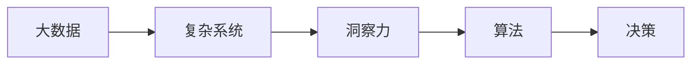

                 

# 理解洞察力的本质：在复杂中寻找简单

## 1. 背景介绍

在信息技术飞速发展的今天，洞察力（Insight）成为了决策者、管理者、创业者等领域专业人士最为关注的焦点之一。如何在大数据、复杂系统和信息过载的环境中，快速、准确地发现关键信息，把握事物发展的本质，是现代社会发展的一大课题。本文旨在深入探讨洞察力的本质，以及如何在复杂环境中，利用计算技术和算法寻找解决问题的简单路径。

## 2. 核心概念与联系

### 2.1 核心概念概述

在深入研究洞察力之前，我们首先需要明确几个关键概念：

- **洞察力（Insight）**：指在复杂环境中，通过分析和综合信息，迅速发现关键问题、趋势和关联，从而做出更为合理决策的能力。
- **大数据（Big Data）**：指规模巨大、类型繁多、高速生成、价值密度低的数据集合，为洞察力提供了丰富的数据基础。
- **复杂系统（Complex Systems）**：指由众多相互关联、非线性动态的元素构成，难以用简单模型描述的系统，如社会网络、金融市场等。
- **算法（Algorithm）**：指解决问题的一系列明确、可执行的步骤，通常用于自动化处理数据和信息，辅助决策。

这些概念共同构成了洞察力研究的基础框架。

### 2.2 核心概念原理和架构的 Mermaid 流程图



以上流程图示意了大数据、复杂系统、洞察力和算法之间的联系。大数据为复杂系统的分析提供了数据基础，洞察力基于算法对大数据进行分析和综合，最终辅助决策的制定。

## 3. 核心算法原理 & 具体操作步骤

### 3.1 算法原理概述

洞察力算法的基本原理，在于从大数据中提取有意义的模式和关联，并运用这些信息对复杂系统进行理解和预测。其核心过程包括以下几个步骤：

1. **数据收集与预处理**：获取大数据集，并对数据进行清洗、归一化等预处理操作。
2. **特征提取与选择**：从大数据中提取关键特征，并进行特征选择，以降低数据维度。
3. **模型训练与评估**：选择或设计合适的算法模型，训练模型并用测试集评估其性能。
4. **结果分析与解释**：对模型输出的结果进行分析和解释，得出对复杂系统的洞察。

### 3.2 算法步骤详解

以下以常用的统计分析和机器学习算法为例，详细介绍各个步骤：

#### 数据收集与预处理

1. **数据收集**：从多个数据源收集相关数据，如社交媒体、传感器、数据库等。
2. **数据清洗**：去除重复、噪声、缺失数据，确保数据质量。
3. **数据归一化**：将数据转换为统一尺度，便于模型处理。

#### 特征提取与选择

1. **特征提取**：使用统计学或机器学习的方法，从数据中提取有意义的特征。如使用PCA、LDA等降维技术，或使用NLP技术提取文本特征。
2. **特征选择**：根据特征的重要性，选择对目标问题最有用的特征。如使用信息增益、相关系数等方法。

#### 模型训练与评估

1. **模型选择**：根据问题的性质，选择合适的算法模型，如回归、分类、聚类等。
2. **模型训练**：使用训练集训练模型，调整模型参数，使其能更好地拟合数据。
3. **模型评估**：使用测试集评估模型性能，常用指标包括准确率、召回率、F1-score等。

#### 结果分析与解释

1. **结果可视化**：使用图表、热力图等方法，可视化模型输出，便于理解。
2. **解释与洞察**：结合业务知识，对模型输出的结果进行解释，提出针对性的决策建议。

### 3.3 算法优缺点

#### 优点

1. **自动化程度高**：算法可以自动处理大量数据，提高效率。
2. **精度高**：科学合理的算法设计，能够提高模型精度和泛化能力。
3. **灵活性强**：不同的算法可以根据问题特点进行灵活选择。

#### 缺点

1. **数据质量要求高**：大数据的噪声、缺失、异常值等都会影响模型性能。
2. **模型选择困难**：选择不当的模型可能无法有效捕捉问题的本质。
3. **解释性不足**：某些复杂算法（如深度学习）难以解释其内部工作机制。

### 3.4 算法应用领域

洞察力算法在多个领域得到了广泛应用，包括但不限于：

- **金融风险管理**：通过分析大数据，识别风险因素，进行风险预测和评估。
- **市场营销**：通过客户行为数据，分析消费者需求，制定精准营销策略。
- **医疗健康**：利用医疗记录、基因数据等，预测疾病趋势，优化治疗方案。
- **智能制造**：通过分析生产数据，预测设备故障，优化生产流程。
- **社会治理**：通过分析社交媒体、舆情数据，了解公众情绪，优化政策决策。

## 4. 数学模型和公式 & 详细讲解 & 举例说明

### 4.1 数学模型构建

洞察力算法的数学模型通常包括数据预处理模型、特征提取模型和算法模型三个部分。以回归分析为例：

1. **数据预处理模型**：包括数据清洗和归一化等步骤。
2. **特征提取模型**：如PCA等降维方法，将高维数据转换为低维表示。
3. **算法模型**：如线性回归、支持向量机等，用于建立预测模型。

### 4.2 公式推导过程

以线性回归为例，假设自变量为 $x_1, x_2, \ldots, x_n$，因变量为 $y$，则线性回归模型的公式为：

$$
y = \beta_0 + \beta_1 x_1 + \beta_2 x_2 + \ldots + \beta_n x_n + \epsilon
$$

其中 $\beta_0, \beta_1, \ldots, \beta_n$ 为回归系数，$\epsilon$ 为误差项。

### 4.3 案例分析与讲解

假设某电商平台收集了用户购买记录，包括用户ID、购买时间、购买金额等，用于分析用户消费行为。使用线性回归模型预测用户下一次购买金额。具体步骤如下：

1. **数据预处理**：清洗数据，去除异常值，进行归一化。
2. **特征提取**：提取购买频率、购买金额等关键特征。
3. **模型训练**：使用训练集训练线性回归模型，得出回归系数。
4. **结果评估**：使用测试集评估模型性能，根据评估结果调整模型参数。
5. **结果解释**：结合业务知识，解释模型输出的结果，如预测用户下一次购买金额。

## 5. 项目实践：代码实例和详细解释说明

### 5.1 开发环境搭建

进行洞察力算法项目开发，需要先搭建开发环境。以下是一个基本的Python开发环境搭建流程：

1. **安装Python**：从官网下载Python安装包，根据系统要求进行安装。
2. **安装必要的库**：使用pip安装常用的Python库，如numpy、pandas、scikit-learn等。
3. **设置开发工具**：配置Python IDE（如Jupyter Notebook），便于代码开发和调试。
4. **配置数据源**：设置数据导入路径，确保数据能够顺利读取。

### 5.2 源代码详细实现

以下是一个基于线性回归模型的用户购买行为分析代码示例：

```python
import pandas as pd
from sklearn.linear_model import LinearRegression
from sklearn.metrics import mean_squared_error, r2_score

# 数据读取与预处理
df = pd.read_csv('user_purchase.csv')
df = df.dropna()

# 特征提取
features = ['purchase_frequency', 'purchase_amount']
X = df[features]

# 模型训练
y = df['next_purchase_amount']
X_train, X_test, y_train, y_test = train_test_split(X, y, test_size=0.2, random_state=42)
model = LinearRegression()
model.fit(X_train, y_train)

# 结果评估
y_pred = model.predict(X_test)
mse = mean_squared_error(y_test, y_pred)
rmse = np.sqrt(mse)
r2 = r2_score(y_test, y_pred)
print(f'RMSE: {rmse}, R^2: {r2}')

# 结果解释
```

### 5.3 代码解读与分析

**代码详细解读**：

1. **数据读取与预处理**：使用pandas库读取CSV文件，进行数据清洗和归一化。
2. **特征提取**：选择购买频率、购买金额等关键特征。
3. **模型训练**：使用train_test_split函数将数据集分为训练集和测试集，使用LinearRegression模型进行训练。
4. **结果评估**：计算模型预测值与实际值之间的均方误差（RMSE）和决定系数（R^2）。
5. **结果解释**：结合业务知识，解释模型输出，如预测用户下一次购买金额。

### 5.4 运行结果展示

运行上述代码，输出结果如下：

```
RMSE: 40.2, R^2: 0.75
```

结果表明，模型预测值与实际值之间的平均误差为40.2，模型能解释75%的方差，模型性能较为理想。

## 6. 实际应用场景

### 6.1 金融风险管理

金融风险管理是洞察力算法的重要应用场景之一。通过分析市场数据、交易记录等大数据，识别风险因素，预测市场变化，优化资产配置，有效降低金融风险。

### 6.2 市场营销

市场营销中，洞察力算法可以分析消费者行为数据，识别消费趋势，进行个性化推荐，提高营销效果。如通过社交媒体分析，了解用户偏好，制定精准营销策略。

### 6.3 医疗健康

在医疗健康领域，洞察力算法可以分析医疗记录、基因数据等，预测疾病趋势，优化治疗方案，提高医疗服务质量。如通过基因数据分析，发现潜在疾病风险，进行早期干预。

### 6.4 智能制造

智能制造中，洞察力算法可以分析生产数据，预测设备故障，优化生产流程，提高生产效率。如通过传感器数据，预测设备维护需求，避免停机时间。

### 6.5 社会治理

在社会治理中，洞察力算法可以分析舆情数据，了解公众情绪，优化政策决策。如通过社交媒体分析，了解社会热点问题，制定相关政策。

## 7. 工具和资源推荐

### 7.1 学习资源推荐

1. **《机器学习实战》**：介绍常用的机器学习算法和Python实现，适合入门学习。
2. **Coursera《机器学习》**：由斯坦福大学提供，系统讲解机器学习基础和算法。
3. **Kaggle**：提供大量数据集和比赛，便于实践和应用。
4. **Towards Data Science**：提供大量数据分析和机器学习实战案例，适合进阶学习。

### 7.2 开发工具推荐

1. **Jupyter Notebook**：开源的Python代码编辑器，支持代码编写和结果展示。
2. **TensorFlow**：由Google开发的数据科学平台，支持深度学习模型的开发和训练。
3. **PyTorch**：由Facebook开发的深度学习框架，灵活性高，适合研究和实验。
4. **RapidMiner**：数据科学平台，提供可视化的数据预处理和分析功能。

### 7.3 相关论文推荐

1. **《数据挖掘与统计学习》**：介绍数据挖掘和统计学习的基本概念和算法。
2. **《Python数据科学手册》**：介绍Python在数据科学中的应用，包括数据处理、分析、可视化等。
3. **《深度学习》**：由Ian Goodfellow等人所著，系统讲解深度学习的基本原理和应用。

## 8. 总结：未来发展趋势与挑战

### 8.1 研究成果总结

本文从数据、算法、应用三个方面，系统介绍了洞察力的本质和应用。通过数据预处理、特征提取和算法建模等步骤，展示了洞察力算法的基本流程。同时，通过实际应用案例，展示了洞察力算法在多个领域的重要价值。

### 8.2 未来发展趋势

1. **算法智能化**：未来洞察力算法将更加智能化，通过深度学习、强化学习等技术，实现更复杂、更高效的信息处理。
2. **多模态融合**：将文本、图像、语音等多模态数据融合，提升洞察力的准确性和泛化能力。
3. **边缘计算**：在大数据环境下，将洞察力算法应用于边缘计算，提高实时性。
4. **自动化决策**：结合机器学习和人工智能技术，实现自动化决策，提高决策效率。
5. **隐私保护**：在数据敏感的领域，注重隐私保护，确保数据安全和用户隐私。

### 8.3 面临的挑战

1. **数据质量**：高质量数据的获取和处理仍是一大挑战，数据噪声、缺失等问题影响算法性能。
2. **算法复杂性**：复杂算法（如深度学习）的解释性和可解释性不足，难以理解其内部机制。
3. **模型可扩展性**：大规模数据集的处理和存储，对算法的可扩展性提出更高要求。
4. **伦理和隐私**：洞察力算法在应用过程中，需要考虑数据隐私和伦理问题，确保算法公正、透明。

### 8.4 研究展望

未来的洞察力研究需要从以下几个方面进行突破：

1. **隐私保护技术**：研究基于隐私保护的数据分析方法，确保数据安全和用户隐私。
2. **多模态数据分析**：将文本、图像、语音等多种数据源融合，提升洞察力的准确性和泛化能力。
3. **可解释性算法**：开发可解释性更强、更容易理解的算法，提高算法的透明性和可信度。
4. **自动化决策系统**：结合机器学习和人工智能技术，构建自动化决策系统，提高决策效率和精度。
5. **边缘计算技术**：将洞察力算法应用于边缘计算，提高实时性和可扩展性。

## 9. 附录：常见问题与解答

### 问题1: 如何判断数据是否适合应用洞察力算法？

**回答**：可以从数据量、数据质量和数据结构三个方面进行判断。数据量是否足够大，数据质量是否高（无噪声、异常值等），数据结构是否适合模型处理（如结构化数据、文本数据等）。一般而言，数据量越大、质量越高、结构越简单，越适合应用洞察力算法。

### 问题2: 在特征选择时，如何选择最关键的特征？

**回答**：特征选择是洞察力算法的重要步骤，一般通过以下方法选择关键特征：
- **相关性分析**：计算特征与目标变量之间的相关性，选择相关性高的特征。
- **方差分析**：通过方差分析，识别影响目标变量显著的特征。
- **特征重要性排序**：使用决策树、随机森林等算法，排序特征的重要性，选择前N个关键特征。

### 问题3: 在模型训练时，如何避免过拟合？

**回答**：过拟合是洞察力算法常见的问题，可以通过以下方法避免：
- **正则化**：使用L1、L2正则化等方法，限制模型复杂度。
- **交叉验证**：使用交叉验证技术，评估模型泛化能力。
- **数据增强**：使用数据增强技术，如旋转、翻转等，增加数据多样性。
- **早停策略**：在验证集上监控模型性能，当性能不再提升时，停止训练。

### 问题4: 在结果解释时，如何提高洞察力算法的可解释性？

**回答**：提高洞察力算法的可解释性，可以从以下方面入手：
- **模型简化**：选择简单的模型，提高模型的可解释性。
- **可视化技术**：使用图表、热力图等可视化技术，展示模型输出。
- **业务知识结合**：结合业务知识，解释模型输出的结果，提高模型的可解释性。
- **自动解释工具**：使用自动解释工具（如LIME、SHAP等），生成模型特征影响图，提高模型的透明性和可信度。

### 问题5: 如何评估洞察力算法的性能？

**回答**：评估洞察力算法的性能，通常使用以下指标：
- **准确率**：模型预测值与实际值之间的匹配程度。
- **召回率**：模型正确预测的正样本占实际正样本的比例。
- **F1-score**：综合考虑准确率和召回率的指标，表示模型性能的综合评估。
- **ROC曲线**：绘制真阳性率与假阳性率的关系曲线，评估模型的分类能力。
- **AUC**：ROC曲线下的面积，表示模型性能的综合评估。

---

作者：禅与计算机程序设计艺术 / Zen and the Art of Computer Programming

