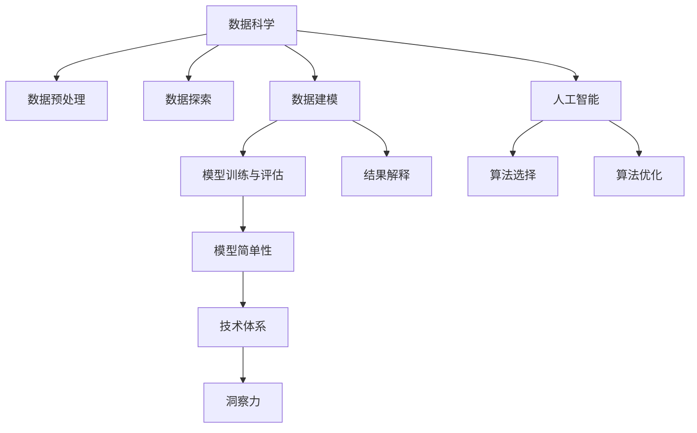

                 

# 理解洞察力的本质：在复杂中把握简单

> 关键词：洞察力,复杂性,简单性,数据科学,人工智能,技术体系

## 1. 背景介绍

### 1.1 问题由来
在当今信息爆炸的时代，我们面对的数据量和处理任务日趋复杂。如何从庞杂的信息中提炼出有价值的内容，洞察数据的本质，已经成为各行各业面临的核心挑战。无论是商业决策、科学研究，还是社会治理，洞察力都扮演着至关重要的角色。

在这一背景下，数据分析和人工智能技术的结合应运而生。通过算法和技术的力量，我们可以在数据中寻找规律，揭示真相，为决策提供科学依据。然而，技术的进步并不总是意味着复杂性的减少，反而可能带来新的困惑和挑战。因此，理解洞察力的本质，把握数据和技术的简单性，成为当前技术发展的重要课题。

### 1.2 问题核心关键点
洞察力是理解和解释数据的关键能力。它不仅关乎数据处理和分析的效率，更涉及对数据背后深层次规律的认识。在复杂的数据和算法面前，洞察力的培养和提升显得尤为重要。

技术层面上，洞察力的实现依赖于以下关键点：
1. 数据预处理：通过数据清洗、特征工程等技术，减少数据噪声，提取关键特征。
2. 算法选择：选择合适的统计模型和机器学习算法，如回归、分类、聚类等，构建模型。
3. 模型训练与评估：通过训练模型并验证性能，调整模型参数，提升模型精度。
4. 结果解释：通过可视化、特征分析等手段，理解模型的输出，洞察数据的本质。

本文将从数据科学和人工智能的角度出发，探讨如何培养和提升洞察力，在复杂的数据和算法面前把握简单性，实现高效、准确的数据分析和决策支持。

## 2. 核心概念与联系

### 2.1 核心概念概述

洞察力是数据分析的核心能力之一，它通过对数据的深度挖掘和分析，揭示出背后的规律和趋势。在复杂的数据和算法面前，洞察力的培养和提升显得尤为重要。

以下是与洞察力密切相关的几个核心概念：

1. **数据科学**：通过数据收集、整理、分析等技术手段，从数据中提取知识和洞察力。数据科学包括数据预处理、数据探索、数据建模、结果解释等多个环节。

2. **人工智能**：通过机器学习和深度学习算法，从数据中学习模式和规律，实现自动化的数据分析和决策支持。人工智能的核心在于算法的选择和优化。

3. **算法复杂性**：指算法实现的复杂程度，包括数据结构、算法时间复杂度、空间复杂度等。算法复杂性是影响数据分析效率的重要因素。

4. **模型简单性**：指模型的结构和参数设置的简单程度，简单模型往往更容易理解和解释，更适合数据科学的应用。

5. **技术体系**：指数据科学和人工智能技术之间的相互作用和相互依赖。技术体系的发展促进了洞察力的提升，同时也带来了新的挑战。

这些核心概念之间的逻辑关系可以通过以下Mermaid流程图来展示：



这个流程图展示了数据科学和人工智能技术在培养洞察力过程中的关键环节和相互依赖关系：

1. 数据科学提供了数据收集和整理的基础，通过数据预处理和数据探索，为模型训练和结果解释提供输入。
2. 人工智能技术通过算法选择和优化，实现数据的自动化分析和决策支持。
3. 模型简单性是提升洞察力的重要因素，简单模型更容易解释和应用。
4. 技术体系的发展促进了洞察力的提升，同时也带来了新的挑战。

## 3. 核心算法原理 & 具体操作步骤
### 3.1 算法原理概述

洞察力的培养和提升，主要依赖于数据科学和人工智能技术的结合。本文将以数据预处理、数据建模和结果解释为例，详细阐述算法原理和具体操作步骤。

### 3.2 算法步骤详解

#### 3.2.1 数据预处理
数据预处理是数据分析的第一步，其主要目标是通过清洗、归一化和特征工程等技术手段，减少数据噪声，提取关键特征。具体步骤包括：

1. **数据清洗**：处理缺失值、异常值等，确保数据质量。
2. **特征工程**：提取和构造关键特征，如均值、标准差、时间特征、文本特征等。
3. **数据转换**：通过编码、标准化等技术，将数据转化为适合算法处理的格式。

#### 3.2.2 数据建模
数据建模是洞察力的核心步骤，通过选择合适的统计模型和机器学习算法，从数据中学习规律和模式。具体步骤包括：

1. **模型选择**：根据数据类型和业务需求，选择合适的统计模型或机器学习算法。
2. **模型训练**：使用训练数据对模型进行训练，调整模型参数，优化模型性能。
3. **模型评估**：使用测试数据评估模型性能，确保模型泛化能力。

#### 3.2.3 结果解释
结果解释是洞察力的关键步骤，通过可视化、特征分析等手段，理解模型的输出，洞察数据的本质。具体步骤包括：

1. **可视化**：使用图表、直方图等可视化工具，展示数据分布和模型输出。
2. **特征分析**：通过特征重要性分析，理解模型输出对关键特征的依赖关系。
3. **结果解释**：结合业务背景，对模型输出进行解释，揭示数据背后的规律和趋势。

### 3.3 算法优缺点

#### 3.3.1 优点
1. **效率高**：自动化算法可以处理大量数据，提高数据分析效率。
2. **精度高**：通过模型训练和优化，提高数据分析精度。
3. **可解释性**：可视化、特征分析等手段，提高了模型输出的可解释性。

#### 3.3.2 缺点
1. **复杂性高**：算法选择和优化过程复杂，需要丰富的技术背景。
2. **过拟合风险**：模型过拟合现象严重，影响数据分析结果的泛化能力。
3. **结果解释难度大**：复杂模型输出结果难以解释，增加了数据分析的难度。

### 3.4 算法应用领域

洞察力在多个领域都有广泛的应用，包括商业决策、科学研究、社会治理等。以下是一些典型应用场景：

#### 3.4.1 商业决策
在商业决策中，洞察力可以通过分析市场趋势、客户行为、销售数据等，为决策提供科学依据。例如，使用机器学习算法分析客户购买行为，预测未来消费趋势，优化产品组合。

#### 3.4.2 科学研究
在科学研究中，洞察力可以通过分析实验数据、文献数据等，揭示科学规律。例如，使用深度学习算法分析基因组数据，发现疾病相关基因，推动医学研究。

#### 3.4.3 社会治理
在社会治理中，洞察力可以通过分析人口数据、公共安全数据等，优化政策制定。例如，使用机器学习算法分析犯罪数据，预测犯罪趋势，优化警务资源配置。

## 4. 数学模型和公式 & 详细讲解 & 举例说明

### 4.1 数学模型构建

在进行数据分析时，通常需要构建数学模型来描述数据特征和规律。常见的数学模型包括回归模型、分类模型、聚类模型等。

#### 4.1.1 线性回归模型
线性回归模型用于预测连续型变量，模型形式为：

$$
y = \beta_0 + \beta_1x_1 + \beta_2x_2 + \cdots + \beta_nx_n + \epsilon
$$

其中，$y$ 为预测变量，$x_i$ 为自变量，$\beta_i$ 为回归系数，$\epsilon$ 为误差项。

#### 4.1.2 逻辑回归模型
逻辑回归模型用于预测二分类变量，模型形式为：

$$
\log\left(\frac{p(y=1|x)}{p(y=0|x)}\right) = \beta_0 + \beta_1x_1 + \beta_2x_2 + \cdots + \beta_nx_n
$$

其中，$p(y=1|x)$ 为事件发生的概率，$p(y=0|x)$ 为事件不发生的概率，$\beta_i$ 为回归系数。

#### 4.1.3 聚类模型
聚类模型用于将数据分为不同的类别，模型形式为：

$$
k-means: \min_{\mu_k} \sum_{i=1}^{n} \min_{k=1,\cdots,K} ||x_i - \mu_k||^2
$$

其中，$x_i$ 为数据点，$\mu_k$ 为聚类中心，$K$ 为聚类数量。

### 4.2 公式推导过程

#### 4.2.1 线性回归模型的推导
线性回归模型的最小二乘估计公式为：

$$
\hat{\beta} = (X^TX)^{-1}X^Ty
$$

其中，$\hat{\beta}$ 为回归系数估计值，$X$ 为自变量矩阵，$y$ 为因变量向量。

#### 4.2.2 逻辑回归模型的推导
逻辑回归模型的最大似然估计公式为：

$$
\hat{\beta} = (X^TX)^{-1}X^T\sum_{i=1}^n y_i(1-y_i) + \lambda\hat{\beta}
$$

其中，$\lambda$ 为正则化系数。

#### 4.2.3 聚类模型的推导
K-means聚类算法通过迭代更新聚类中心，实现数据聚类。具体步骤包括：

1. 初始化聚类中心$\mu_k$。
2. 将每个数据点$x_i$分配到最近的聚类中心$\mu_k$，得到新的聚类中心。
3. 重复步骤2，直到聚类中心不再变化。

### 4.3 案例分析与讲解

#### 4.3.1 案例背景
某电商平台收集了用户的购买历史数据，包括用户ID、购买时间、商品ID、商品价格等。目标是分析用户购买行为，预测用户未来的购买趋势，优化推荐系统。

#### 4.3.2 数据分析步骤
1. **数据预处理**：处理缺失值、异常值，提取关键特征，如购买时间、商品类别、价格等。
2. **数据建模**：使用线性回归模型预测用户购买行为，使用逻辑回归模型预测用户购买意愿。
3. **结果解释**：分析模型输出，洞察用户购买行为背后的规律和趋势，优化推荐系统。

#### 4.3.3 结果展示
通过数据分析，我们发现用户的购买行为与商品类别、价格等特征密切相关，进一步优化了推荐系统，提升了用户购买转化率。

## 5. 项目实践：代码实例和详细解释说明

### 5.1 开发环境搭建

在进行数据分析实践前，我们需要准备好开发环境。以下是使用Python进行Scikit-learn开发的环境配置流程：

1. 安装Anaconda：从官网下载并安装Anaconda，用于创建独立的Python环境。

2. 创建并激活虚拟环境：
```bash
conda create -n sklearn-env python=3.8 
conda activate sklearn-env
```

3. 安装Scikit-learn：从官网获取对应的安装命令。例如：
```bash
conda install scikit-learn
```

4. 安装各类工具包：
```bash
pip install numpy pandas scikit-learn matplotlib tqdm jupyter notebook ipython
```

完成上述步骤后，即可在`sklearn-env`环境中开始数据分析实践。

### 5.2 源代码详细实现

下面我们以线性回归模型的实现为例，给出使用Scikit-learn库进行数据分析的PyTorch代码实现。

首先，定义数据处理函数：

```python
import pandas as pd
from sklearn.model_selection import train_test_split
from sklearn.linear_model import LinearRegression

# 加载数据
data = pd.read_csv('data.csv')

# 数据预处理
X = data[['feature1', 'feature2', 'feature3']]
y = data['target']

# 划分训练集和测试集
X_train, X_test, y_train, y_test = train_test_split(X, y, test_size=0.2, random_state=42)

# 建立模型
model = LinearRegression()

# 训练模型
model.fit(X_train, y_train)

# 评估模型
score = model.score(X_test, y_test)
print(f'模型测试得分：{score:.2f}')
```

然后，定义模型训练和评估函数：

```python
from sklearn.metrics import mean_squared_error

def train_model(X, y, model, test_size=0.2, random_state=42):
    # 划分训练集和测试集
    X_train, X_test, y_train, y_test = train_test_split(X, y, test_size=test_size, random_state=random_state)
    # 训练模型
    model.fit(X_train, y_train)
    # 评估模型
    score = model.score(X_test, y_test)
    mse = mean_squared_error(y_test, model.predict(X_test))
    return score, mse

# 训练模型
score, mse = train_model(X, y, model)

# 输出评估结果
print(f'模型得分：{score:.2f}')
print(f'均方误差：{mse:.2f}')
```

最后，启动数据分析流程：

```python
if __name__ == '__main__':
    # 加载数据
    data = pd.read_csv('data.csv')
    # 数据预处理
    X = data[['feature1', 'feature2', 'feature3']]
    y = data['target']
    # 训练模型
    score, mse = train_model(X, y, model)
    # 输出评估结果
    print(f'模型得分：{score:.2f}')
    print(f'均方误差：{mse:.2f}')
```

以上就是使用Scikit-learn进行线性回归模型数据分析的完整代码实现。可以看到，Scikit-learn提供了丰富的数据处理和模型训练功能，使得数据分析工作变得更加高效便捷。

### 5.3 代码解读与分析

让我们再详细解读一下关键代码的实现细节：

**data处理函数**：
- `read_csv`方法：用于读取CSV格式的数据文件。
- `train_test_split`方法：用于将数据划分为训练集和测试集，支持指定测试集比例和随机种子。

**模型训练函数**：
- `train_model`方法：实现了模型训练和评估的完整流程，包括数据划分、模型训练、评估和结果输出。

**数据分析流程**：
- `if __name__ == '__main__':`：用于在脚本中执行主函数。
- `train_model`方法：从数据加载到模型训练，再到结果输出，提供了完整的分析流程。

可以看到，Scikit-learn库在数据分析中提供了强大的支持，使得数据分析工作更加便捷和高效。开发者可以在实际应用中灵活使用Scikit-learn提供的各类函数，快速完成数据分析任务。

## 6. 实际应用场景
### 6.1 智能推荐系统
智能推荐系统是洞察力在商业决策中的应用之一。通过分析用户行为数据，洞察用户的兴趣和需求，实现个性化推荐。

例如，电商平台可以通过分析用户购买历史和浏览行为，预测用户未来的购买需求，从而提供个性化的商品推荐。这一过程中，洞察力贯穿了数据收集、特征提取、模型训练和结果解释等多个环节。

### 6.2 医疗数据分析
医疗数据分析是洞察力在科学研究中的应用之一。通过分析患者数据，洞察疾病的发生和发展规律，辅助医疗决策。

例如，医院可以分析患者历史病历数据，预测疾病发展趋势，优化治疗方案。这一过程中，洞察力有助于从海量数据中提取关键信息，揭示疾病发生规律，提高医疗决策的科学性。

### 6.3 金融风险评估
金融风险评估是洞察力在商业决策中的应用之一。通过分析市场数据和客户数据，洞察风险因素，优化金融产品设计。

例如，银行可以分析客户信用记录和交易数据，预测信用风险，优化贷款审批流程。这一过程中，洞察力有助于从大量数据中提取关键信息，评估风险水平，提高金融决策的准确性。

## 7. 工具和资源推荐
### 7.1 学习资源推荐

为了帮助开发者系统掌握数据分析和洞察力的理论基础和实践技巧，这里推荐一些优质的学习资源：

1. 《数据科学入门》系列博文：由数据科学领域专家撰写，深入浅出地介绍了数据科学的基本概念和实践技巧。

2. 《机器学习实战》书籍：针对实际应用场景，讲解了机器学习算法的基本原理和实现方法，适合实战练习。

3. 《Python数据科学手册》书籍：全面介绍了Python在数据科学中的应用，包括数据处理、模型训练、结果解释等各个环节。

4. Kaggle竞赛平台：提供丰富的数据集和挑战，通过实战练习提升数据分析和洞察力的能力。

5. Coursera《机器学习》课程：斯坦福大学开设的机器学习入门课程，有Lecture视频和配套作业，带你入门机器学习的基本概念和技术。

通过对这些资源的学习实践，相信你一定能够快速掌握数据分析和洞察力的精髓，并用于解决实际的商业和科学问题。

### 7.2 开发工具推荐

高效的开发离不开优秀的工具支持。以下是几款用于数据分析和洞察力培养的常用工具：

1. Jupyter Notebook：一个交互式的编程环境，支持Python、R等语言，适合数据探索和模型训练。

2. R语言：一款统计分析语言，拥有丰富的统计分析和机器学习库，适合数据处理和模型训练。

3. Tableau：一款数据可视化工具，支持多种数据源，提供丰富的图表和可视化功能，适合数据探索和结果展示。

4. Python libraries：包括NumPy、Pandas、Scikit-learn等库，提供了丰富的数据处理、模型训练和结果解释功能。

5. R libraries：包括ggplot2、dplyr等库，提供了丰富的数据处理和可视化功能。

合理利用这些工具，可以显著提升数据分析和洞察力的开发效率，加快创新迭代的步伐。

### 7.3 相关论文推荐

数据分析和洞察力的发展源于学界的持续研究。以下是几篇奠基性的相关论文，推荐阅读：

1. 《Data Mining: Concepts and Techniques》书籍：涵盖了数据挖掘和数据分析的各个方面，包括数据预处理、模型训练、结果解释等环节。

2. 《The Elements of Statistical Learning》书籍：介绍了统计学习的基本方法和技术，适合理解数据分析的核心原理。

3. 《Machine Learning Yearning》书籍：由深度学习专家Andrew Ng撰写，介绍了机器学习的基本原理和技术，适合实战练习。

4. 《Data Science for Business》书籍：介绍了数据科学在商业中的应用，包括数据收集、数据处理、模型训练和结果解释等环节。

这些论文代表了大数据分析和洞察力技术的发展脉络。通过学习这些前沿成果，可以帮助研究者把握学科前进方向，激发更多的创新灵感。

## 8. 总结：未来发展趋势与挑战

### 8.1 总结

本文对数据分析和洞察力的培养方法进行了全面系统的介绍。首先阐述了数据分析和洞察力在商业决策、科学研究、社会治理等场景中的重要性，明确了数据分析在各个环节中的关键作用。其次，从数据预处理、数据建模和结果解释等环节，详细讲解了数据分析的核心步骤和算法原理。最后，结合实际应用场景，探讨了数据分析和洞察力的未来发展趋势和面临的挑战。

通过本文的系统梳理，可以看到，数据分析和洞察力在处理复杂数据时显得尤为重要，需要在各个环节进行全面优化，才能最大限度地发挥其价值。

### 8.2 未来发展趋势

展望未来，数据分析和洞察力的发展将呈现以下几个趋势：

1. **自动化分析**：自动化分析技术的发展，将极大地提升数据分析的效率和准确性。未来，随着机器学习算法的发展，自动化分析将变得更加智能和可靠。

2. **实时分析**：实时分析技术的发展，将使数据分析更加动态和高效。未来，随着数据流处理的进步，实时分析将应用于更多场景，如金融交易、网络安全等。

3. **跨领域融合**：跨领域融合技术的发展，将使数据分析更加全面和深入。未来，数据分析将结合更多领域的知识，如医学、金融、社会等，实现多学科协同创新。

4. **数据可视化**：数据可视化技术的发展，将使数据分析更加直观和易于理解。未来，通过更丰富的图表和可视化工具，数据分析结果将更加生动和直观。

5. **智能化应用**：智能化应用的发展，将使数据分析更加智能和个性化。未来，通过深度学习算法和大数据分析技术，数据分析将更能够满足用户的个性化需求。

以上趋势凸显了数据分析和洞察力的广阔前景。这些方向的探索发展，必将进一步提升数据分析的效率和准确性，为商业决策、科学研究等提供更加科学和精准的支持。

### 8.3 面临的挑战

尽管数据分析和洞察力的发展前景广阔，但在迈向更加智能化、普适化应用的过程中，它仍面临着诸多挑战：

1. **数据质量问题**：数据质量的参差不齐，影响数据分析的准确性和可靠性。如何提高数据质量，减少噪声，是数据分析面临的主要挑战。

2. **算法复杂性问题**：算法的复杂性和可解释性，影响数据分析的可操作性和普及性。如何简化算法，提高算法的可解释性，是数据分析面临的重要问题。

3. **数据隐私问题**：数据的隐私和安全，影响数据分析的应用场景和普及度。如何保护数据隐私，确保数据安全，是数据分析面临的重要挑战。

4. **计算资源问题**：数据分析所需的大量计算资源，限制了数据分析的普及度。如何降低计算成本，提高计算效率，是数据分析面临的重要问题。

5. **人才缺口问题**：数据分析需要跨学科的复合型人才，而目前相关人才的供给不足。如何培养和吸引相关人才，是数据分析面临的重要挑战。

正视数据分析和洞察力面临的这些挑战，积极应对并寻求突破，将是大数据分析技术走向成熟的必由之路。相信随着学界和产业界的共同努力，这些挑战终将一一被克服，数据分析和洞察力必将在各行各业中发挥更大的作用。

### 8.4 研究展望

面对数据分析和洞察力所面临的种种挑战，未来的研究需要在以下几个方面寻求新的突破：

1. **自动化数据分析**：探索自动化数据分析方法，通过机器学习算法和大数据技术，提升数据分析的效率和准确性。

2. **跨领域融合**：结合更多领域的知识，实现跨领域的数据分析和应用，推动多学科协同创新。

3. **数据隐私保护**：研究数据隐私保护技术，确保数据的合法使用，保护用户隐私。

4. **智能化应用**：结合深度学习算法和大数据分析技术，实现智能化数据分析，满足用户的个性化需求。

5. **人才培养**：培养跨学科的复合型人才，推动数据分析和洞察力的普及和发展。

这些研究方向的探索，必将引领数据分析和洞察力技术迈向更高的台阶，为各行各业提供更加科学和精准的数据支持。面向未来，数据分析和洞察力将成为人类认知智能的重要组成部分，推动人工智能技术的发展和应用。

## 9. 附录：常见问题与解答

**Q1：数据分析和洞察力是否适用于所有领域？**

A: 数据分析和洞察力在大多数领域都有广泛的应用，特别是对于数据量大、结构复杂的场景。然而，对于一些特定领域，如医学、法律等，需要结合领域知识进行深入分析，才能获得有价值的结果。

**Q2：如何选择合适的数据分析方法？**

A: 选择合适的数据分析方法需要考虑多个因素，如数据类型、业务需求、数据量等。常用的方法包括回归分析、分类分析、聚类分析等。具体选择需根据实际问题进行综合考虑。

**Q3：数据分析结果如何解释？**

A: 数据分析结果的解释需要结合业务背景和模型输出，进行多维度的解读。通常使用可视化、特征分析等手段，揭示数据背后的规律和趋势。

**Q4：数据分析面临哪些计算资源限制？**

A: 数据分析所需的大量计算资源，是制约数据分析普及的重要因素。可以通过并行计算、分布式计算等技术，降低计算成本，提高计算效率。

**Q5：数据分析和洞察力如何应用于商业决策？**

A: 数据分析和洞察力可以通过分析客户行为数据、市场趋势数据等，揭示用户需求和市场变化，为商业决策提供科学依据。

作者：禅与计算机程序设计艺术 / Zen and the Art of Computer Programming

