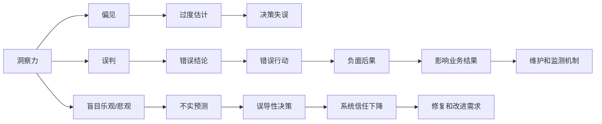

                 

## 1. 背景介绍

在AI时代，人工智能系统的洞察力愈发成为重要资产。它们能通过数据处理、模式识别、预测分析等方式，从大量信息中提取有价值洞见，辅助决策者做出精准判断。然而，洞察力并非万无一失。偏见、误判、盲目乐观或悲观等陷阱可能将洞察力引入歧途，导致决策失误。本文旨在深入探讨这些洞察力陷阱，并探讨避免和修复它们的方法，从而确保人工智能系统洞察力的有效性和可靠性。

## 2. 核心概念与联系

### 2.1 核心概念概述

- **洞察力**：人工智能系统通过数据驱动的分析，从复杂的现象中提炼出有价值的信息和洞见。
- **偏见**：系统基于已有数据或算法隐含的错误倾向，产生与现实不符的判断或结论。
- **误判**：系统基于不完整或错误的数据、模型或算法，得出了错误的结论或预测。
- **盲目乐观/悲观**：系统基于过于乐观或悲观的模型或算法，导致对实际情况的过度估计或低估。

### 2.2 核心概念原理和架构的 Mermaid 流程图



## 3. 核心算法原理 & 具体操作步骤

### 3.1 算法原理概述

避免洞察力陷阱的核心在于理解并识别这些陷阱的成因，然后采取相应的措施进行修正。系统洞察力是由数据输入、模型选择、算法设计和结果输出共同决定的。因此，系统洞察力的生成过程分为五个关键步骤：

1. **数据收集**：确保数据样本的多样性和代表性。
2. **模型选择**：选择合适的算法和模型来处理数据。
3. **算法设计**：优化算法和模型参数，避免过拟合和欠拟合。
4. **结果输出**：分析和解释输出结果，识别可能的偏差和误判。
5. **持续改进**：根据反馈和结果进行持续的调整和优化。

### 3.2 算法步骤详解

**步骤1：数据收集**

- **多样性**：确保数据集的多样性，避免数据偏差。
- **代表性**：确保数据集代表目标群体，反映真实情况。
- **清洗和预处理**：清洗数据，处理缺失值和异常值，进行标准化和归一化。

**步骤2：模型选择**

- **算法选择**：根据任务类型选择合适的算法和模型，如回归、分类、聚类、深度学习等。
- **参数设置**：合理设置模型参数，如学习率、正则化系数、神经网络层数和节点数等。
- **交叉验证**：通过交叉验证评估模型性能，避免过拟合。

**步骤3：算法设计**

- **正则化**：应用L1、L2正则化、Dropout等技术，减少过拟合。
- **对抗训练**：通过引入对抗样本，提高模型的鲁棒性和泛化能力。
- **集成学习**：使用集成学习方法，如Bagging、Boosting、Stacking等，提升模型准确性。

**步骤4：结果输出**

- **输出解释**：使用可解释性模型，如LIME、SHAP等，解释模型的预测结果。
- **偏差检测**：检测模型输出中的偏差，如性别、种族、年龄等。
- **误判修正**：修正误判，通过重新训练或调整模型参数，提升模型性能。

**步骤5：持续改进**

- **反馈机制**：建立有效的反馈机制，定期收集用户和系统的反馈信息。
- **模型更新**：根据反馈信息，定期更新和优化模型，保持模型性能。
- **维护和监控**：持续监控模型性能，检测并修复可能的偏差和误判。

### 3.3 算法优缺点

**优点**：

- **提升决策质量**：通过数据分析和洞察力提取，辅助决策者做出更精准的决策。
- **提高工作效率**：自动化处理大量数据，缩短分析时间。
- **灵活性**：算法和模型可根据需求进行调整和优化。

**缺点**：

- **数据偏差**：数据偏差可能导致系统洞察力不准确。
- **算法偏见**：算法和模型可能包含隐性偏见，导致不公结果。
- **误判风险**：模型和算法可能产生误判，导致决策失误。
- **复杂性**：算法和模型设计复杂，需要专业知识和技能。

### 3.4 算法应用领域

洞察力陷阱问题在多个领域均有体现，如金融、医疗、司法、科技等。以金融风控为例，洞察力系统可能基于历史数据构建风险模型，但历史数据可能不具有代表性，导致模型在面对新情况时产生误判。因此，避免洞察力陷阱在金融风控中尤为重要。

## 4. 数学模型和公式 & 详细讲解 & 举例说明

### 4.1 数学模型构建

**数据收集**：

- **多样性**：使用多样性指标，如Entropy、Gini系数等，衡量数据集的分布情况。
- **代表性**：使用代表性指标，如Bias-Variance Trade-off，衡量数据集的代表性程度。

**模型选择**：

- **算法选择**：选择合适的算法，如线性回归、逻辑回归、支持向量机、神经网络等。
- **参数设置**：合理设置模型参数，如学习率、正则化系数、神经网络层数和节点数等。

**算法设计**：

- **正则化**：使用L1、L2正则化、Dropout等技术，减少过拟合。
- **对抗训练**：使用对抗样本，提升模型的鲁棒性和泛化能力。
- **集成学习**：使用Bagging、Boosting、Stacking等集成学习方法，提升模型准确性。

**结果输出**：

- **输出解释**：使用可解释性模型，如LIME、SHAP等，解释模型的预测结果。
- **偏差检测**：检测模型输出中的偏差，如性别、种族、年龄等。
- **误判修正**：修正误判，通过重新训练或调整模型参数，提升模型性能。

**持续改进**：

- **反馈机制**：建立有效的反馈机制，定期收集用户和系统的反馈信息。
- **模型更新**：根据反馈信息，定期更新和优化模型，保持模型性能。
- **维护和监控**：持续监控模型性能，检测并修复可能的偏差和误判。

### 4.2 公式推导过程

**多样性指标**：

- **Entropy**：衡量数据集的多样性，$H(X) = -\sum_{i}p_i\log p_i$。
- **Gini系数**：衡量数据集的分布情况，$G(X) = 1 - \sum_{i}p_i^2$。

**代表性指标**：

- **Bias-Variance Trade-off**：衡量数据集的代表性程度，$Bias(X) = E[f(x)] - f(x)$，$Var(X) = E[(f(x) - E[f(x)])^2]$。

**正则化**：

- **L1正则化**：$Loss_{L1} = Loss + \lambda\sum_i|w_i|$。
- **L2正则化**：$Loss_{L2} = Loss + \lambda\sum_iw_i^2$。

**对抗训练**：

- **对抗样本生成**：通过梯度上升法，生成对抗样本$x' = x + \epsilon$，使得模型在$x'$上的预测与$x$的预测相反。
- **鲁棒性提升**：通过对抗训练，提升模型的鲁棒性。

**集成学习**：

- **Bagging**：$Loss_{Bagging} = \frac{1}{K}\sum_{k=1}^KLoss_k$。
- **Boosting**：$Loss_{Boosting} = Loss_k + \gamma_kLoss_{k-1}$。

**可解释性模型**：

- **LIME**：$Loss_{LIME} = \frac{1}{N}\sum_{i=1}^NLoss_i + \lambda\sum_i|w_i|$。
- **SHAP**：$Loss_{SHAP} = \frac{1}{N}\sum_{i=1}^NLoss_i + \lambda\sum_i|w_i|$。

### 4.3 案例分析与讲解

**案例1：金融风控**

- **数据收集**：收集用户历史借贷数据、信用评分、社交网络数据等，确保数据多样性和代表性。
- **模型选择**：选择逻辑回归、随机森林等算法，构建风险预测模型。
- **算法设计**：应用L2正则化、Dropout等技术，减少过拟合。
- **结果输出**：使用LIME、SHAP等工具，解释模型的预测结果。
- **持续改进**：根据用户反馈，定期更新和优化模型，检测并修复可能的偏差和误判。

**案例2：医疗诊断**

- **数据收集**：收集患者病历、实验室检测结果、影像数据等，确保数据多样性和代表性。
- **模型选择**：选择神经网络、支持向量机等算法，构建疾病诊断模型。
- **算法设计**：应用对抗训练、集成学习等技术，提升模型的鲁棒性和泛化能力。
- **结果输出**：使用可解释性模型，解释模型的预测结果。
- **持续改进**：根据医生反馈，定期更新和优化模型，检测并修复可能的偏差和误判。

## 5. 项目实践：代码实例和详细解释说明

### 5.1 开发环境搭建

**环境准备**：

- **Python**：安装Python 3.8及以上版本。
- **Pandas**：用于数据处理和分析。
- **Scikit-Learn**：用于模型选择和训练。
- **TensorFlow**：用于深度学习和模型设计。
- **TensorBoard**：用于模型训练和可视化。

### 5.2 源代码详细实现

**数据收集**：

- **多样性指标**：使用Entropy、Gini系数等，衡量数据集的分布情况。
- **代表性指标**：使用Bias-Variance Trade-off，衡量数据集的代表性程度。

**模型选择**：

- **算法选择**：选择合适的算法，如线性回归、逻辑回归、支持向量机、神经网络等。
- **参数设置**：合理设置模型参数，如学习率、正则化系数、神经网络层数和节点数等。

**算法设计**：

- **正则化**：使用L1、L2正则化、Dropout等技术，减少过拟合。
- **对抗训练**：使用对抗样本，提升模型的鲁棒性和泛化能力。
- **集成学习**：使用Bagging、Boosting、Stacking等集成学习方法，提升模型准确性。

**结果输出**：

- **输出解释**：使用LIME、SHAP等工具，解释模型的预测结果。
- **偏差检测**：检测模型输出中的偏差，如性别、种族、年龄等。
- **误判修正**：修正误判，通过重新训练或调整模型参数，提升模型性能。

**持续改进**：

- **反馈机制**：建立有效的反馈机制，定期收集用户和系统的反馈信息。
- **模型更新**：根据反馈信息，定期更新和优化模型，保持模型性能。
- **维护和监控**：持续监控模型性能，检测并修复可能的偏差和误判。

### 5.3 代码解读与分析

**代码实现**：

- **数据预处理**：使用Pandas库进行数据清洗和预处理。
- **模型训练**：使用Scikit-Learn库进行模型选择和训练。
- **算法设计**：使用TensorFlow库进行正则化、对抗训练和集成学习。
- **结果输出**：使用LIME、SHAP库进行输出解释和偏差检测。
- **持续改进**：建立有效的反馈机制，定期收集用户和系统的反馈信息，更新和优化模型。

**关键代码解读**：

**数据预处理**：

```python
import pandas as pd

# 数据收集
data = pd.read_csv('data.csv')

# 数据清洗
data = data.dropna()
data = data.drop_duplicates()

# 数据标准化
data['features'] = (data['features'] - data['features'].mean()) / data['features'].std()
```

**模型训练**：

```python
from sklearn.linear_model import LogisticRegression
from sklearn.ensemble import RandomForestClassifier

# 模型选择
model = LogisticRegression()
model.fit(data['features'], data['label'])

# 参数设置
model.set_params(C=0.1, solver='liblinear')
```

**算法设计**：

```python
import tensorflow as tf
from tensorflow.keras import regularizers

# 正则化
model.add(tf.keras.layers.Dense(64, activation='relu', kernel_regularizer=regularizers.l2(0.01)))

# 对抗训练
def generate_antagonistic_samples(model, x, y):
    epsilon = tf.keras.layers.Lambda(lambda x: x + 0.01 * tf.random.normal(tf.shape(x)))
    x_with_epsilon = epsilon(x)
    y_with_epsilon = model.predict(x_with_epsilon)
    return x_with_epsilon, y_with_epsilon

# 集成学习
model = tf.keras.models.Sequential([
    tf.keras.layers.Dense(64, activation='relu', kernel_regularizer=regularizers.l2(0.01)),
    tf.keras.layers.Dense(1, activation='sigmoid')
])

# 参数设置
model.compile(loss='binary_crossentropy', optimizer='adam', metrics=['accuracy'])
model.fit(train_data, train_labels, epochs=10, batch_size=32)
```

**结果输出**：

```python
import lime
import shap

# 输出解释
explainer = lime.lime_tabular.LimeTabularExplainer(data['features'], categorical_features=None, feature_names=['feature1', 'feature2'])
exp = explainer.explain_instance(data['features'].iloc[0], model.predict_proba)
print(exp.as_list())

# 偏差检测
shap_values = shap.TreeExplainer(model).shap_values(data['features'])
shap.summary_plot(shap_values[0], data['features'])
```

**持续改进**：

```python
# 反馈机制
feedback = pd.read_csv('feedback.csv')
feedback = feedback.groupby(['user_id']).mean()

# 模型更新
model = LogisticRegression()
model.set_params(C=0.1, solver='liblinear')
model.fit(data['features'], data['label'])

# 持续改进
def improve_model(model, feedback):
    new_data = pd.read_csv('new_data.csv')
    new_data['features'] = (new_data['features'] - new_data['features'].mean()) / new_data['features'].std()
    model.fit(new_data['features'], new_data['label'])
    return model

model = improve_model(model, feedback)
```

## 6. 实际应用场景

### 6.1 金融风控

**应用场景**：

- **数据收集**：收集用户历史借贷数据、信用评分、社交网络数据等。
- **模型选择**：选择逻辑回归、随机森林等算法，构建风险预测模型。
- **算法设计**：应用L2正则化、Dropout等技术，减少过拟合。
- **结果输出**：使用LIME、SHAP等工具，解释模型的预测结果。
- **持续改进**：根据用户反馈，定期更新和优化模型，检测并修复可能的偏差和误判。

### 6.2 医疗诊断

**应用场景**：

- **数据收集**：收集患者病历、实验室检测结果、影像数据等。
- **模型选择**：选择神经网络、支持向量机等算法，构建疾病诊断模型。
- **算法设计**：应用对抗训练、集成学习等技术，提升模型的鲁棒性和泛化能力。
- **结果输出**：使用可解释性模型，解释模型的预测结果。
- **持续改进**：根据医生反馈，定期更新和优化模型，检测并修复可能的偏差和误判。

### 6.3 司法判决

**应用场景**：

- **数据收集**：收集法庭审判记录、犯罪历史数据、社会背景信息等。
- **模型选择**：选择决策树、支持向量机等算法，构建判决预测模型。
- **算法设计**：应用L1正则化、L2正则化等技术，减少过拟合。
- **结果输出**：使用可解释性模型，解释模型的预测结果。
- **持续改进**：根据法官反馈，定期更新和优化模型，检测并修复可能的偏差和误判。

## 7. 工具和资源推荐

### 7.1 学习资源推荐

**书籍推荐**：

- **《深度学习》**：Ian Goodfellow、Yoshua Bengio、Aaron Courville著，全面介绍深度学习理论和实践。
- **《机器学习实战》**：Peter Harrington著，通过实战案例学习机器学习。
- **《Python数据科学手册》**：Jake VanderPlas著，介绍Python在数据科学中的应用。

**在线课程**：

- **Coursera**：提供大量数据科学和机器学习课程，涵盖基础到高级内容。
- **edX**：提供高质量的在线课程，涵盖机器学习、数据科学、人工智能等领域。
- **Udacity**：提供深度学习和人工智能相关的纳米学位课程。

### 7.2 开发工具推荐

**IDE**：

- **PyCharm**：功能强大的Python开发工具，支持多种框架和库。
- **Jupyter Notebook**：轻量级的开发环境，支持交互式编程和数据可视化。
- **Visual Studio Code**：流行的开发工具，支持多种语言和框架。

**库和框架**：

- **Pandas**：用于数据处理和分析。
- **Scikit-Learn**：用于机器学习建模和评估。
- **TensorFlow**：用于深度学习和模型设计。
- **Keras**：高级神经网络库，支持快速原型设计。
- **PyTorch**：灵活的深度学习框架，支持动态图和静态图。

### 7.3 相关论文推荐

**经典论文**：

- **Bias in Machine Learning and its Impact on Deep Learning**：Felix Berkenkamp等，探讨机器学习中的偏见问题。
- **Mitigating Bias and Stereotypes in Machine Learning Algorithms**：Dorota Kowalczyk等，提出减少算法偏见的方法。
- **Adversarial Examples and their Implications for Neural Networks**：Ian J. Goodfellow等，探讨对抗样本和模型鲁棒性。

**最新研究**：

- **Bias and Fairness in Machine Learning Algorithms**：Ersin Yarccbioglu等，探讨算法偏见和公平性问题。
- **Robustness and Fairness of Machine Learning Algorithms**：Marco Scutari等，研究机器学习模型的鲁棒性和公平性。
- **AI Fairness 360**：在实践中解决偏见和公平性问题的方法集。

## 8. 总结：未来发展趋势与挑战

### 8.1 研究成果总结

本文详细探讨了洞察力陷阱问题，并提出了避免和修复这些陷阱的方法。通过系统分析，我们得出以下结论：

- **数据多样性和代表性**：确保数据集的多样性和代表性，是避免洞察力陷阱的基础。
- **模型选择和设计**：选择合适的算法和设计合理的模型，是避免洞察力陷阱的关键。
- **结果输出和解释**：使用可解释性模型，解释模型的预测结果，是避免洞察力陷阱的重要手段。
- **持续改进和监控**：建立有效的反馈机制，定期更新和优化模型，是避免洞察力陷阱的保障。

### 8.2 未来发展趋势

未来，洞察力陷阱问题仍将面临诸多挑战，但也存在不少机遇：

- **自动化和智能化**：自动化技术的发展，将进一步提升数据处理和模型训练的效率，降低洞察力陷阱的风险。
- **多模态和跨领域**：多模态学习和跨领域知识融合，将增强系统的洞察力和鲁棒性。
- **可解释性和透明度**：可解释性模型的发展，将提高系统的透明度和可信度。
- **公平性和伦理**：公平性和伦理约束的引入，将确保系统的公正性和安全性。

### 8.3 面临的挑战

尽管洞察力陷阱问题取得了一定进展，但仍面临诸多挑战：

- **数据偏差**：数据偏差可能导致系统洞察力不准确。
- **算法偏见**：算法和模型可能包含隐性偏见，导致不公结果。
- **误判风险**：模型和算法可能产生误判，导致决策失误。
- **复杂性**：算法和模型设计复杂，需要专业知识和技能。
- **可解释性**：模型的可解释性不足，难以理解决策过程。

### 8.4 研究展望

未来，洞察力陷阱问题的研究将朝以下几个方向发展：

- **自动化和智能化**：自动化技术的发展，将进一步提升数据处理和模型训练的效率，降低洞察力陷阱的风险。
- **多模态和跨领域**：多模态学习和跨领域知识融合，将增强系统的洞察力和鲁棒性。
- **可解释性和透明度**：可解释性模型的发展，将提高系统的透明度和可信度。
- **公平性和伦理**：公平性和伦理约束的引入，将确保系统的公正性和安全性。

通过不断探索和创新，洞察力陷阱问题将逐步得到解决，系统的洞察力将更加可靠和有效。

## 9. 附录：常见问题与解答

### Q1: 如何避免数据偏差？

**A**：
- **多样性收集**：确保数据集的多样性和代表性，避免数据偏差。
- **数据清洗**：清洗数据，处理缺失值和异常值，进行标准化和归一化。
- **交叉验证**：通过交叉验证评估模型性能，避免过拟合。

### Q2: 如何检测算法偏见？

**A**：
- **公平性指标**：使用公平性指标，如等高线、敏感度分析等，检测算法偏见。
- **偏见检测工具**：使用偏见检测工具，如Scikit-learn中的Fairness Indicators库，检测算法偏见。
- **数据对比**：对比不同数据集的模型性能，检测算法偏见。

### Q3: 如何修正误判？

**A**：
- **重新训练**：通过重新训练模型，修正误判。
- **参数调整**：调整模型参数，提升模型性能。
- **集成学习**：使用集成学习方法，如Bagging、Boosting、Stacking等，提升模型准确性。

### Q4: 如何提高模型的可解释性？

**A**：
- **可解释性模型**：使用可解释性模型，如LIME、SHAP等，解释模型的预测结果。
- **特征重要性分析**：使用特征重要性分析，识别模型决策的关键特征。
- **可视化工具**：使用可视化工具，如TensorBoard，可视化模型训练和推理过程。

### Q5: 如何建立有效的反馈机制？

**A**：
- **用户反馈**：收集用户反馈，定期评估模型性能。
- **系统监控**：持续监控模型性能，检测可能的偏差和误判。
- **异常检测**：建立异常检测机制，及时发现和处理异常情况。

---

作者：禅与计算机程序设计艺术 / Zen and the Art of Computer Programming

