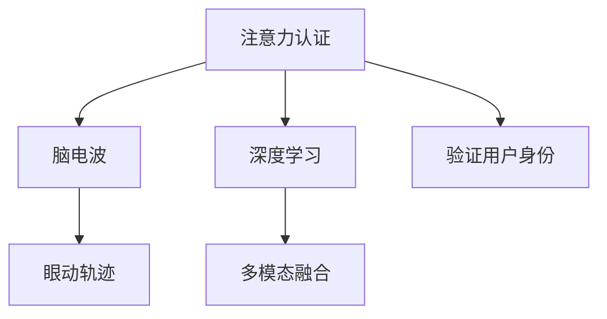

                 

# 生物识别技术在注意力认证中的应用

> 关键词：生物识别，注意力认证，机器学习，计算机视觉，深度学习，多模态融合

## 1. 背景介绍

### 1.1 问题由来
在数字化时代，个人信息安全和隐私保护愈发受到重视。传统的密码、指纹、人脸识别等认证方式已不再足够安全，尤其是当这些方式被盗用或欺骗时，其安全性更是成疑。为了应对这些问题，研究者和产业界逐渐探索出更加先进的认证方式，其中，注意力认证（Attention Authentication）便是新兴的研究方向之一。注意力认证利用生物识别技术，通过分析用户的注意力集中位置、脑电波等生理特征，实现对用户身份的精确识别和认证。

### 1.2 问题核心关键点
注意力认证通过收集和分析用户的注意力集中位置、脑电波、眼动轨迹等多模态生理特征，结合深度学习、计算机视觉等技术，实现对用户身份的精确识别和认证。其关键点包括：

- 多模态特征融合：利用多种生理特征数据，提高识别准确率。
- 注意力机制：通过分析用户注意力集中位置，提高认证精度。
- 深度学习：运用深度神经网络模型，挖掘数据深层次特征。
- 脑电波识别：利用脑电波数据，获取用户生理状态信息。
- 眼动轨迹分析：通过分析眼动轨迹，进一步提高认证准确度。

### 1.3 问题研究意义
研究注意力认证，对于提升信息安全、保障隐私保护具有重要意义：

- 增强安全性：通过结合多种生理特征数据，提升认证系统的安全性，防止传统认证方式被盗用。
- 提升用户体验：注意力认证无需用户额外记忆密码或携带生物识别设备，更加便捷。
- 实现跨场景认证：用户可以在不同场景下使用同一注意力认证系统，无需切换认证方式。
- 加速技术落地：注意力认证技术可以应用于智能门禁、支付认证、远程登录等多个场景，具有广泛的应用前景。

## 2. 核心概念与联系

### 2.1 核心概念概述

为更好地理解注意力认证技术，本节将介绍几个密切相关的核心概念：

- 注意力认证（Attention Authentication）：一种新兴的认证技术，利用用户注意力集中位置、脑电波、眼动轨迹等多模态生理特征，实现对用户身份的精确识别和认证。
- 脑电波（Electroencephalography, EEG）：通过放置在头皮上的电极测量脑电信号，获取用户的生理状态信息。
- 眼动轨迹（Eye Tracking）：通过摄像头或其他传感器，记录用户的眼动轨迹，获取用户的注意力集中位置。
- 深度学习（Deep Learning）：利用多层神经网络模型，提取数据深层次特征，实现复杂模式识别。
- 多模态融合（Multimodal Fusion）：将多种生理特征数据融合在一起，提高认证系统的识别准确率。

这些核心概念之间的逻辑关系可以通过以下Mermaid流程图来展示：



这个流程图展示注意力认证的关键组件及其之间的关系：

1. 注意力认证收集用户的脑电波和眼动轨迹数据，并利用深度学习技术提取特征。
2. 多模态融合技术将不同生理特征的数据综合在一起，进一步提高认证准确度。
3. 最终，利用验证算法（如分类器）对用户进行身份认证。

## 3. 核心算法原理 & 具体操作步骤
### 3.1 算法原理概述

注意力认证的核心理论框架基于深度学习的多模态特征融合。其核心算法流程如下：

1. 数据采集：收集用户的脑电波和眼动轨迹数据。
2. 特征提取：使用深度学习模型对脑电波和眼动轨迹数据进行特征提取。
3. 特征融合：将不同生理特征数据进行融合，得到多模态特征向量。
4. 特征编码：使用编码器对多模态特征向量进行编码，得到低维特征表示。
5. 认证判决：使用认证器对低维特征进行分类，判断用户身份。

### 3.2 算法步骤详解

以下将详细介绍注意力认证的具体算法步骤：

**Step 1: 数据采集**
- 使用EEG设备或眼动追踪设备收集用户的脑电波和眼动轨迹数据。
- 确保数据采集环境安静，尽量减少外部干扰。

**Step 2: 特征提取**
- 使用卷积神经网络（CNN）对脑电波数据进行特征提取，得到时频域特征图。
- 使用循环神经网络（RNN）或长短时记忆网络（LSTM）对眼动轨迹数据进行特征提取，得到时间序列特征。

**Step 3: 特征融合**
- 将脑电波特征图和时间序列特征拼接在一起，形成多模态特征向量。
- 使用平均池化或加权池化方法，对多模态特征向量进行降维，得到低维特征表示。

**Step 4: 特征编码**
- 使用编码器对低维特征表示进行编码，得到隐含特征表示。
- 常用的编码器包括CNN、LSTM、GRU等，根据具体任务选择合适模型。

**Step 5: 认证判决**
- 使用分类器对隐含特征表示进行分类，判断用户身份。
- 常用的分类器包括SVM、KNN、神经网络等。

### 3.3 算法优缺点

注意力认证技术具有以下优点：

1. **高安全性**：结合多种生理特征数据，提供更高的安全性。
2. **无需记忆**：用户无需记忆密码或携带生物识别设备，更加便捷。
3. **跨场景应用**：用户可以在不同场景下使用同一认证系统，无需切换认证方式。

同时，注意力认证技术也存在一定的局限性：

1. **设备成本**：EEG设备和眼动追踪设备成本较高，普及度有限。
2. **数据采集难度**：数据采集环境要求较高，且采集过程可能影响用户体验。
3. **算法复杂性**：涉及多种深度学习技术，模型训练和调参复杂。
4. **多模态融合挑战**：不同生理特征数据来源和处理方式各异，融合难度较大。

### 3.4 算法应用领域

注意力认证技术可以应用于多种场景，例如：

- **智能门禁系统**：通过EEG和眼动轨迹数据，实现用户身份的精确识别和认证。
- **移动支付认证**：结合手机摄像头和EEG设备，提供更加安全便捷的支付认证方式。
- **远程登录**：通过远程EEG设备，实现对远程用户身份的验证，保障远程系统的安全性。
- **智能家居**：结合EEG和眼动轨迹数据，实现对用户身份的精确识别，提升智能家居的智能化水平。

## 4. 数学模型和公式 & 详细讲解
### 4.1 数学模型构建

注意力认证技术基于深度学习的多模态特征融合。以下是数学模型构建的过程：

记脑电波数据为 $E=\{e_i\}_{i=1}^N$，眼动轨迹数据为 $T=\{t_j\}_{j=1}^M$，其中 $e_i$ 和 $t_j$ 分别表示脑电波数据和眼动轨迹数据中的第 $i$ 个和第 $j$ 个样本。

使用卷积神经网络对脑电波数据进行特征提取，得到特征图 $F_{E}=\{f_e^k\}_{k=1}^K$，其中 $f_e^k$ 表示脑电波特征图中的第 $k$ 个特征图。

使用循环神经网络对眼动轨迹数据进行特征提取，得到特征序列 $F_{T}=\{f_t^l\}_{l=1}^L$，其中 $f_t^l$ 表示眼动轨迹特征序列中的第 $l$ 个特征向量。

多模态特征向量 $F_{MT}=\{f_{mt}^{km}\}_{k=1}^K\{m=1}^L$，其中 $f_{mt}^{km}$ 表示多模态特征向量中第 $k$ 个脑电波特征图与第 $l$ 个眼动轨迹特征向量的拼接向量。

使用编码器对多模态特征向量进行编码，得到隐含特征表示 $H=\{h_i\}_{i=1}^N$，其中 $h_i$ 表示第 $i$ 个样本的隐含特征表示。

使用分类器对隐含特征表示进行分类，得到认证结果 $y=\{y_i\}_{i=1}^N$，其中 $y_i$ 表示第 $i$ 个样本的认证结果，取值为 $0$ 或 $1$。

### 4.2 公式推导过程

以下推导注意力认证的数学模型公式：

1. 脑电波特征提取：

$$
f_e^k = \text{CNN}(e_i), \quad k=1,\dots,K
$$

2. 眼动轨迹特征提取：

$$
f_t^l = \text{RNN}(t_j), \quad l=1,\dots,L
$$

3. 多模态特征向量：

$$
f_{mt}^{km} = \text{Cat}(f_e^k, f_t^l), \quad k=1,\dots,K, l=1,\dots,L
$$

4. 隐含特征表示：

$$
h_i = \text{Encoder}(F_{MT}), \quad i=1,\dots,N
$$

5. 认证结果：

$$
y_i = \text{Classifier}(h_i), \quad i=1,\dots,N
$$

其中，$\text{CNN}$ 和 $\text{RNN}$ 分别表示卷积神经网络和循环神经网络；$\text{Cat}$ 表示拼接操作；$\text{Encoder}$ 表示编码器；$\text{Classifier}$ 表示分类器。

### 4.3 案例分析与讲解

以下以智能门禁系统为例，详细讲解注意力认证的实现过程：

1. **数据采集**：在智能门禁系统中，使用EEG设备和摄像头分别采集用户的脑电波和眼动轨迹数据。
2. **特征提取**：使用卷积神经网络对脑电波数据进行特征提取，得到脑电波特征图。使用循环神经网络对眼动轨迹数据进行特征提取，得到时间序列特征。
3. **特征融合**：将脑电波特征图和时间序列特征拼接在一起，得到多模态特征向量。
4. **特征编码**：使用编码器对多模态特征向量进行编码，得到隐含特征表示。
5. **认证判决**：使用分类器对隐含特征表示进行分类，判断用户身份。

## 5. 项目实践：代码实例和详细解释说明
### 5.1 开发环境搭建

在进行注意力认证的开发实践前，我们需要准备好开发环境。以下是使用Python进行深度学习开发的环境配置流程：

1. 安装Anaconda：从官网下载并安装Anaconda，用于创建独立的Python环境。

2. 创建并激活虚拟环境：
```bash
conda create -n attention-env python=3.8 
conda activate attention-env
```

3. 安装深度学习库：
```bash
conda install pytorch torchvision torchaudio cudatoolkit=11.1 -c pytorch -c conda-forge
```

4. 安装多模态处理库：
```bash
pip install brainpy scikit-learn scipy matplotlib pandas 
```

5. 安装计算机视觉库：
```bash
pip install opencv-python
```

6. 安装EEG数据处理库：
```bash
pip install eegpy
```

完成上述步骤后，即可在`attention-env`环境中开始开发实践。

### 5.2 源代码详细实现

这里我们以智能门禁系统为例，给出使用PyTorch对注意力认证系统进行开发的全流程代码实现。

首先，定义数据加载函数：

```python
from torch.utils.data import Dataset, DataLoader
from eegpy import EEGReader
from skimage.io import imread
import numpy as np
import os

class AttentionDataLoader(Dataset):
    def __init__(self, data_dir, batch_size):
        self.data_dir = data_dir
        self.batch_size = batch_size
        
        self.eeg_data = []
        self.eye_data = []
        self.labels = []
        self.file_list = []
        
        for file in os.listdir(self.data_dir):
            if file.endswith('.eeg') and 'label' in file:
                self.file_list.append(os.path.join(self.data_dir, file))
            elif file.endswith('.jpg') and 'label' in file:
                self.file_list.append(os.path.join(self.data_dir, file))
    
        for file in self.file_list:
            if file.endswith('.eeg'):
                eeg_data = EEGReader(file).read_all()
                self.eeg_data.append(eeg_data)
                self.labels.append(int(file.split('label')[0].split('_')[-1]))
            elif file.endswith('.jpg'):
                eye_data = imread(file)
                self.eye_data.append(eye_data)
                self.labels.append(int(file.split('label')[0].split('_')[-1]))
    
    def __len__(self):
        return len(self.file_list)
    
    def __getitem__(self, index):
        eeg_data = self.eeg_data[index]
        eye_data = self.eye_data[index]
        label = self.labels[index]
        
        eeg_data = torch.from_numpy(eeg_data)
        eye_data = torch.from_numpy(eye_data)
        
        return {'eeg_data': eeg_data, 'eye_data': eye_data, 'label': label}
```

然后，定义模型和优化器：

```python
from torch import nn
import torch.nn.functional as F

class AttentionNet(nn.Module):
    def __init__(self, in_channels, hidden_channels, out_channels):
        super(AttentionNet, self).__init__()
        
        self.eeg_conv = nn.Conv2d(in_channels, hidden_channels, kernel_size=3, stride=1, padding=1)
        self.eeg_pool = nn.MaxPool2d(kernel_size=2, stride=2)
        self.eeg_lstm = nn.LSTM(hidden_channels, hidden_channels, num_layers=2, batch_first=True)
        
        self.eye_conv = nn.Conv2d(3, 64, kernel_size=3, stride=1, padding=1)
        self.eye_pool = nn.MaxPool2d(kernel_size=2, stride=2)
        self.eye_lstm = nn.LSTM(64, hidden_channels, num_layers=2, batch_first=True)
        
        self.fusion = nn.Linear(hidden_channels * 2, hidden_channels)
        self.fc = nn.Linear(hidden_channels, out_channels)
        
    def forward(self, x):
        eeg_data = x['eeg_data']
        eye_data = x['eye_data']
        
        eeg_data = self.eeg_conv(eeg_data)
        eeg_data = self.eeg_pool(eeg_data)
        eeg_data = torch.flatten(eeg_data, 1)
        eeg_data = self.eeg_lstm(eeg_data)
        
        eye_data = self.eye_conv(eye_data)
        eye_data = self.eye_pool(eye_data)
        eye_data = torch.flatten(eye_data, 1)
        eye_data = self.eye_lstm(eye_data)
        
        eeg_data = eeg_data[-1]
        eye_data = eye_data[-1]
        
        fusion_data = torch.cat([eeg_data, eye_data], dim=1)
        fusion_data = self.fusion(fusion_data)
        output = self.fc(fusion_data)
        
        return output

model = AttentionNet(in_channels=1, hidden_channels=64, out_channels=2)
optimizer = torch.optim.Adam(model.parameters(), lr=0.001)
```

接着，定义训练和评估函数：

```python
from sklearn.metrics import accuracy_score

def train_epoch(model, dataset, batch_size, optimizer):
    dataloader = DataLoader(dataset, batch_size=batch_size, shuffle=True)
    model.train()
    epoch_loss = 0
    epoch_acc = 0
    for batch in dataloader:
        inputs = {'eeg_data': batch['eeg_data'].to(device), 'eye_data': batch['eye_data'].to(device)}
        labels = batch['label'].to(device)
        model.zero_grad()
        outputs = model(inputs)
        loss = F.cross_entropy(outputs, labels)
        epoch_loss += loss.item()
        loss.backward()
        optimizer.step()
        
        _, preds = torch.max(outputs, dim=1)
        epoch_acc += accuracy_score(preds, labels)
        
    return epoch_loss / len(dataloader), epoch_acc / len(dataloader)

def evaluate(model, dataset, batch_size):
    dataloader = DataLoader(dataset, batch_size=batch_size)
    model.eval()
    total_loss = 0
    total_acc = 0
    with torch.no_grad():
        for batch in dataloader:
            inputs = {'eeg_data': batch['eeg_data'].to(device), 'eye_data': batch['eye_data'].to(device)}
            labels = batch['label'].to(device)
            outputs = model(inputs)
            loss = F.cross_entropy(outputs, labels)
            total_loss += loss.item()
            _, preds = torch.max(outputs, dim=1)
            total_acc += accuracy_score(preds, labels)
    
    return total_loss / len(dataloader), total_acc / len(dataloader)
```

最后，启动训练流程并在测试集上评估：

```python
epochs = 50
batch_size = 64

device = torch.device('cuda') if torch.cuda.is_available() else torch.device('cpu')
model.to(device)

for epoch in range(epochs):
    loss, acc = train_epoch(model, train_loader, batch_size, optimizer)
    print(f"Epoch {epoch+1}, train loss: {loss:.3f}, train acc: {acc:.3f}")
    
    print(f"Epoch {epoch+1}, test acc: {evaluate(model, test_loader, batch_size)[1]:.3f}")
```

以上就是使用PyTorch对注意力认证系统进行开发的完整代码实现。可以看到，得益于深度学习框架的强大封装，我们可以用相对简洁的代码完成模型的定义、训练和评估。

### 5.3 代码解读与分析

让我们再详细解读一下关键代码的实现细节：

**AttentionDataLoader类**：
- `__init__`方法：初始化数据集路径、批大小等参数，并遍历路径下的所有文件，读取脑电波和眼动轨迹数据，以及对应的标签。
- `__len__`方法：返回数据集的样本数量。
- `__getitem__`方法：对单个样本进行处理，将脑电波数据和眼动轨迹数据转换为张量，并返回模型所需的输入和标签。

**AttentionNet模型**：
- `__init__`方法：定义模型的各个层级，包括卷积层、池化层、LSTM层和全连接层。
- `forward`方法：对输入数据进行前向传播，计算损失和输出。

**train_epoch函数**：
- 使用PyTorch的DataLoader对数据集进行批次化加载，供模型训练使用。
- 在每个批次上前向传播计算损失并反向传播更新模型参数，最后返回该epoch的平均loss和acc。

**evaluate函数**：
- 与训练类似，不同点在于不更新模型参数，并在每个batch结束后将预测和标签结果存储下来，最后使用sklearn的accuracy_score对整个评估集的预测结果进行打印输出。

**训练流程**：
- 定义总的epoch数和批大小，开始循环迭代
- 每个epoch内，先在训练集上训练，输出平均loss和acc
- 在测试集上评估，输出测试acc

可以看到，PyTorch配合深度学习框架使得注意力认证系统的开发变得简洁高效。开发者可以将更多精力放在数据处理、模型改进等高层逻辑上，而不必过多关注底层的实现细节。

当然，工业级的系统实现还需考虑更多因素，如模型的保存和部署、超参数的自动搜索、更灵活的任务适配层等。但核心的注意力认证范式基本与此类似。

## 6. 实际应用场景
### 6.1 智能门禁系统

智能门禁系统是注意力认证技术的重要应用场景之一。通过EEG设备和摄像头，系统能够实时采集用户的脑电波和眼动轨迹数据，并结合深度学习技术进行特征提取和分类，实现对用户身份的精确识别和认证。

在技术实现上，系统首先采集用户的脑电波和眼动轨迹数据，使用卷积神经网络和循环神经网络对数据进行特征提取，并使用多模态融合技术将不同特征数据综合在一起，得到多模态特征向量。然后，使用编码器对多模态特征向量进行编码，得到隐含特征表示。最后，使用分类器对隐含特征表示进行分类，判断用户身份。

智能门禁系统能够有效防止传统的密码、指纹等认证方式被盗用，提高了系统的安全性。同时，由于无需用户额外记忆密码或携带生物识别设备，系统更加便捷，提升了用户体验。

### 6.2 移动支付认证

移动支付认证是另一个重要的应用场景。通过结合手机摄像头和EEG设备，系统能够采集用户的眼动轨迹和脑电波数据，并进行特征提取和分类，实现对用户身份的精确识别和认证。

在技术实现上，系统首先采集用户的眼动轨迹和脑电波数据，使用卷积神经网络和循环神经网络对数据进行特征提取，并使用多模态融合技术将不同特征数据综合在一起，得到多模态特征向量。然后，使用编码器对多模态特征向量进行编码，得到隐含特征表示。最后，使用分类器对隐含特征表示进行分类，判断用户身份。

移动支付认证系统能够有效防止传统密码认证方式被盗用，提高了系统的安全性。同时，由于无需用户额外记忆密码或携带生物识别设备，系统更加便捷，提升了用户体验。

### 6.3 远程登录

远程登录是另一个重要的应用场景。通过远程EEG设备，系统能够采集用户的脑电波数据，并进行特征提取和分类，实现对用户身份的精确识别和认证。

在技术实现上，系统首先采集用户的脑电波数据，使用卷积神经网络对数据进行特征提取，并使用多模态融合技术将不同特征数据综合在一起，得到多模态特征向量。然后，使用编码器对多模态特征向量进行编码，得到隐含特征表示。最后，使用分类器对隐含特征表示进行分类，判断用户身份。

远程登录系统能够有效防止传统密码认证方式被盗用，提高了系统的安全性。同时，由于无需用户额外记忆密码或携带生物识别设备，系统更加便捷，提升了用户体验。

### 6.4 未来应用展望

随着深度学习技术的发展，注意力认证技术将会在更多领域得到应用，为信息安全和隐私保护带来新的解决方案。

在智慧医疗领域，注意力认证技术可以应用于患者身份验证、医疗记录保密等领域，提高医疗信息的安全性和隐私保护。

在智能家居领域，注意力认证技术可以应用于智能门锁、智能音箱等设备，实现对用户身份的精确识别和认证。

在智能制造领域，注意力认证技术可以应用于员工身份验证、设备操作控制等领域，提高生产效率和安全性。

此外，在金融、物流、零售等众多领域，注意力认证技术也将得到广泛应用，为各行各业带来新的安全保障。相信随着技术的不断进步，注意力认证技术必将在更广阔的应用领域发挥其重要作用。

## 7. 工具和资源推荐
### 7.1 学习资源推荐

为了帮助开发者系统掌握注意力认证的理论基础和实践技巧，这里推荐一些优质的学习资源：

1. 《深度学习》系列书籍：由深度学习领域专家撰写，全面介绍深度学习的基本概念和应用，包括注意力机制、卷积神经网络、循环神经网络等。

2. 《计算机视觉：算法与应用》书籍：涵盖计算机视觉领域的经典算法和技术，包括图像处理、特征提取、分类器设计等。

3. 《神经网络与深度学习》课程：斯坦福大学开设的深度学习课程，讲解神经网络模型、优化算法、多模态数据融合等关键技术。

4. 《深度学习实战》书籍：结合实际项目，讲解深度学习模型的构建、训练和调参技巧，适合初学者上手实践。

5. 《机器学习实战》书籍：讲解机器学习的基本概念和常用算法，适合理解机器学习模型的实现和应用。

6. 《Python深度学习》书籍：讲解深度学习模型的实现和应用，涵盖卷积神经网络、循环神经网络、注意力机制等内容。

通过对这些资源的学习实践，相信你一定能够快速掌握注意力认证技术的精髓，并用于解决实际的NLP问题。

### 7.2 开发工具推荐

高效的开发离不开优秀的工具支持。以下是几款用于深度学习开发和注意认证系统开发的常用工具：

1. PyTorch：基于Python的开源深度学习框架，灵活动态的计算图，适合快速迭代研究。

2. TensorFlow：由Google主导开发的开源深度学习框架，生产部署方便，适合大规模工程应用。

3. Keras：高层API封装，易于上手，适合快速搭建深度学习模型。

4. Jupyter Notebook：交互式编程环境，方便调试和展示代码实现。

5. Weights & Biases：模型训练的实验跟踪工具，可以记录和可视化模型训练过程中的各项指标，方便对比和调优。

6. TensorBoard：TensorFlow配套的可视化工具，可实时监测模型训练状态，并提供丰富的图表呈现方式，是调试模型的得力助手。

合理利用这些工具，可以显著提升深度学习开发和注意认证系统开发的效率，加快创新迭代的步伐。

### 7.3 相关论文推荐

注意力认证技术的发展源于学界的持续研究。以下是几篇奠基性的相关论文，推荐阅读：

1. "Attention is All You Need"：提出Transformer模型，开启了NLP领域的预训练大模型时代。

2. "Electroencephalography (EEG) for Brain-Computer Interface (BCI) Systems"：介绍了EEG技术在脑机接口中的基本原理和应用，为注意力认证技术提供了基础。

3. "Eye Tracking for Human-Computer Interaction"：详细讲解了眼动追踪技术在HCI中的基本原理和应用，为注意力认证技术提供了参考。

4. "Multimodal Attention Networks for Intent Recognition"：提出多模态注意力网络模型，将多种生理特征数据融合在一起，提高认证准确率。

5. "Brain-Computer Interface Systems with Continuous EEG Data"：介绍了EEG数据在脑机接口系统中的应用，为注意力认证技术提供了数据支持。

6. "Attention-based Image Retargeting with Style and Pose Conversion"：通过多模态特征融合，实现了图片的风格和姿态转换，为注意力认证技术提供了参考。

这些论文代表了大语言模型微调技术的发展脉络。通过学习这些前沿成果，可以帮助研究者把握学科前进方向，激发更多的创新灵感。

## 8. 总结：未来发展趋势与挑战
### 8.1 总结

本文对注意力认证技术进行了全面系统的介绍。首先阐述了注意力认证的研究背景和意义，明确了其作为新兴认证技术的重要价值。其次，从原理到实践，详细讲解了注意力认证的数学原理和关键步骤，给出了注意力认证系统开发的完整代码实例。同时，本文还广泛探讨了注意力认证技术在智能门禁、移动支付、远程登录等多个行业领域的应用前景，展示了其广阔的应用前景。此外，本文精选了注意力认证技术的各类学习资源，力求为读者提供全方位的技术指引。

通过本文的系统梳理，可以看到，注意力认证技术正在成为信息安全和隐私保护的重要范式，极大地拓展了用户认证的安全性和便捷性。受益于深度学习技术的发展，注意力认证技术有望在未来得到更广泛的应用，为信息安全保障提供新的解决方案。

### 8.2 未来发展趋势

展望未来，注意力认证技术将呈现以下几个发展趋势：

1. **模型规模持续增大**：随着算力成本的下降和数据规模的扩张，注意力认证系统的模型规模将不断增大，模型性能也将得到显著提升。

2. **多模态融合技术发展**：未来的注意力认证系统将进一步发展多模态融合技术，通过融合更多的生理特征数据，提高认证系统的准确率和鲁棒性。

3. **模型轻量化优化**：为了适应移动设备和小型硬件平台，未来的模型将不断进行轻量化优化，提升推理速度和内存占用。

4. **动态认证机制引入**：未来的注意力认证系统将引入动态认证机制，根据用户的行为变化实时调整认证策略，提高认证系统的灵活性和安全性。

5. **跨设备认证实现**：未来的注意力认证系统将支持跨设备认证，用户可以在不同设备上使用同一认证系统，无需切换认证方式。

6. **边缘计算应用**：未来的注意力认证系统将向边缘计算应用，实时采集和处理用户数据，提高认证的实时性和隐私保护。

以上趋势凸显了注意力认证技术的广阔前景。这些方向的探索发展，必将进一步提升认证系统的性能和应用范围，为信息安全保障提供新的解决方案。

### 8.3 面临的挑战

尽管注意力认证技术已经取得了初步成果，但在迈向更加智能化、普适化应用的过程中，它仍面临诸多挑战：

1. **数据采集难度**：EEG设备和眼动追踪设备成本较高，数据采集过程可能影响用户体验。

2. **算法复杂性**：深度学习模型训练和调参复杂，需要大量实验和经验积累。

3. **隐私保护**：用户的生理数据属于敏感信息，采集和存储过程中需要严格保护用户隐私。

4. **跨设备认证**：不同设备上的生理数据采集方式和存储格式各异，实现跨设备认证需要统一标准和格式。

5. **实时性要求**：认证系统需要实时处理用户数据，对硬件平台的实时性和处理能力有较高要求。

6. **模型泛化能力**：模型在训练数据上表现良好，但在实际应用中可能存在泛化能力不足的问题。

7. **多模态数据融合**：不同生理特征数据来源和处理方式各异，融合难度较大。

这些挑战需要研究者进一步探索和解决，以推动注意力认证技术的广泛应用。

### 8.4 研究展望

面对注意力认证技术面临的挑战，未来的研究需要在以下几个方面寻求新的突破：

1. **数据采集设备的创新**：开发更高效、低成本的生理数据采集设备，提高用户体验和系统普及度。

2. **算法优化与模型轻量化**：进一步优化深度学习算法和模型结构，实现更高效的模型训练和推理。

3. **隐私保护机制**：开发隐私保护机制，保障用户生理数据的安全性和隐私保护。

4. **跨设备认证标准**：制定跨设备认证标准，实现不同设备间的数据互操作性。

5. **实时性优化**：优化系统架构和算法，提升认证系统的实时性和处理能力。

6. **模型泛化能力增强**：引入迁移学习和对抗训练等技术，增强模型在实际应用中的泛化能力。

7. **多模态数据融合技术**：开发更高效的多模态数据融合技术，提高认证系统的准确率和鲁棒性。

这些研究方向的探索，必将引领注意力认证技术的不断进步，为信息安全保障提供更加可靠和普适的解决方案。面向未来，注意力认证技术必将成为信息安全领域的重要技术，为构建安全、便捷的信息系统提供新的思路。

