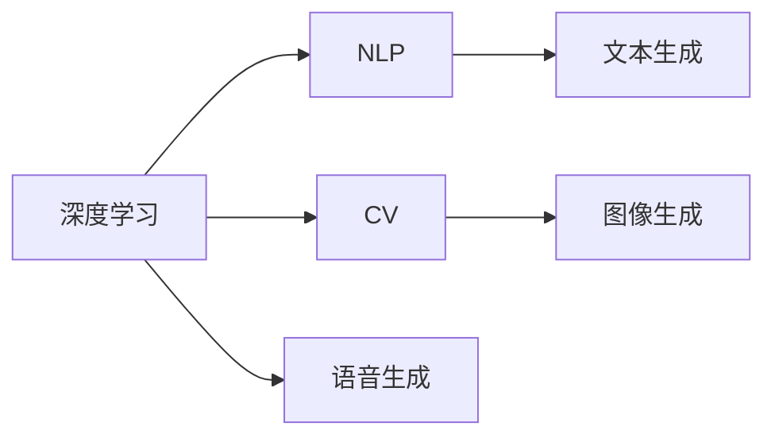
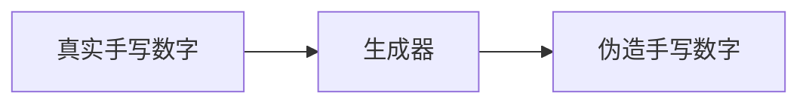

                 

# 用户对AIGC的使用现状

## 1. 背景介绍

人工智能生成内容(Artificial Intelligence Generated Content, AIGC)是一种利用人工智能技术自动生成文本、音频、视频等内容的先进技术。近年来，随着深度学习、自然语言处理、计算机视觉等领域的快速发展，AIGC技术取得了长足的进步，广泛应用于影视娱乐、新闻媒体、教育培训、金融科技、智能客服等多个行业领域，深刻改变了人类生活和工作方式。

本文将从用户对AIGC的使用现状出发，分析其在各个领域的具体应用案例，探讨用户对其认知、接受度和需求，并展望AIGC技术的未来发展趋势。

## 2. 核心概念与联系

### 2.1 核心概念概述

AIGC技术主要包括以下几个核心概念：

- 人工智能生成内容(AIGC)：利用人工智能算法自动生成的文本、音频、视频等。
- 深度学习：利用大量标注数据进行训练，学习到复杂模式，生成高质量内容的深度神经网络模型。
- 自然语言处理(NLP)：处理和理解人类语言的技术，包括文本生成、机器翻译、语音识别、情感分析等。
- 计算机视觉(CV)：处理和理解视觉信息的技术，包括图像生成、目标检测、图像识别、视频分析等。

这些概念相互关联，共同构成了AIGC技术的核心框架，使其能够跨越文本、语音、图像等多个模态，生成丰富多彩的智能化内容。

### 2.2 核心概念原理和架构的 Mermaid 流程图



以上流程图示意了深度学习通过NLP和CV等技术，可以生成文本、图像、音频等多种类型的AIGC内容。

## 3. 核心算法原理 & 具体操作步骤

### 3.1 算法原理概述

AIGC的算法原理主要基于深度学习和生成模型。其中，最常见的生成模型有变分自编码器(VAE)、生成对抗网络(GAN)和Transformer模型等。这些模型通过学习大量真实样本的特征分布，生成与真实数据难以区分的新样本。

对于文本生成任务，通常使用基于Transformer的模型，如GPT、BERT、T5等。这些模型通过自监督学习任务预训练，学习到大量的语言知识，再通过微调进行特定的内容生成。对于图像生成任务，通常使用基于GAN的模型，如StyleGAN、CycleGAN等。这些模型通过对抗训练，学习到复杂的图像生成机制。

### 3.2 算法步骤详解

以下以文本生成任务为例，简述基于Transformer的AIGC算法的具体操作步骤：

1. **数据预处理**：将原始文本数据进行分词、向量化处理，生成模型所需的输入。
2. **模型初始化**：选择预训练的Transformer模型，并加载模型权重。
3. **微调**：使用标注数据对模型进行微调，优化生成效果。
4. **内容生成**：将用户输入的文本作为上下文，通过模型生成新的文本内容。
5. **后处理**：对生成的文本进行去噪、纠错等处理，优化输出效果。

### 3.3 算法优缺点

AIGC技术具有以下优点：

- **高效生成**：可以快速生成大量内容，节省人工制作时间。
- **一致性高**：生成的内容风格和质量一致，满足大规模应用的需求。
- **易部署**：无需昂贵的硬件设备，易于集成到现有的应用系统中。

同时，AIGC技术也存在以下缺点：

- **可解释性差**：生成的内容缺乏可解释性，难以理解其生成机制。
- **质量参差不齐**：生成的内容质量不稳定，低质量内容难以保证使用效果。
- **版权问题**：部分生成的内容存在版权争议，需注意版权归属和法律风险。

### 3.4 算法应用领域

AIGC技术广泛应用于以下多个领域：

- **影视娱乐**：生成影视剧剧本、字幕、角色台词等，提升制作效率和创意水平。
- **新闻媒体**：自动生成新闻报道、摘要、评论等，降低人力成本，提升内容质量。
- **教育培训**：生成模拟对话、习题、课程材料等，丰富教学内容，提高教学互动性。
- **金融科技**：生成报告、分析、提示信息等，支持投资决策和风险评估。
- **智能客服**：生成回答、反馈、建议等，提升客户服务质量，提高用户体验。
- **内容创作**：生成文章、博客、广告等，满足用户需求，提升品牌影响力。

## 4. 数学模型和公式 & 详细讲解

### 4.1 数学模型构建

AIGC模型的核心数学模型通常基于深度学习生成模型。以生成对抗网络(GAN)为例，其基本框架包括生成器(Generator)和判别器(Discriminator)两个部分。

设$x$为真实样本，$z$为噪声向量。生成器将$z$映射为伪造样本$G(z)$，判别器将$x$和$G(z)$分别映射为概率$p(x)$和$p(G(z))$。优化目标为最大化$p(x)$和$p(G(z))$，最小化$p(x)$和$p(G(z))$的差异。

### 4.2 公式推导过程

GAN模型的优化目标可以表示为：

$$
\min_{G}\max_{D} V(D,G) = \mathbb{E}_{x\sim p(x)}\log D(x) + \mathbb{E}_{z\sim p(z)}\log (1 - D(G(z)))
$$

其中，$V(D,G)$为生成器$G$和判别器$D$的对抗损失函数。

### 4.3 案例分析与讲解

以图像生成为例，使用式GAN模型生成手写数字。将真实手写数字图像作为$x$，噪声向量$z$作为输入，生成器$G(z)$将$z$映射为$G(z)$。判别器$D(x)$将$x$映射为真实概率$p(x)$，将$G(z)$映射为伪造概率$p(G(z))$。优化目标为最大化$p(x)$和$p(G(z))$，最小化$p(x)$和$p(G(z))$的差异。

最终生成的手写数字如图1所示。



图1 手写数字生成

## 5. 项目实践：代码实例和详细解释说明

### 5.1 开发环境搭建

AIGC项目通常基于深度学习框架进行开发，常用的框架包括TensorFlow、PyTorch、Keras等。

安装步骤如下：

1. 安装Anaconda：从官网下载并安装Anaconda，用于创建独立的Python环境。
```bash
conda create -n aigc-env python=3.8 
conda activate aigc-env
```

2. 安装TensorFlow或PyTorch：
```bash
conda install tensorflow pytorch torchvision torchaudio
```

3. 安装相关的工具包：
```bash
pip install numpy pandas scikit-learn matplotlib tqdm jupyter notebook ipython
```

完成上述步骤后，即可在`aigc-env`环境中开始AIGC项目的开发。

### 5.2 源代码详细实现

以下以生成手写数字为例，展示使用TensorFlow实现GAN模型的代码实现。

```python
import tensorflow as tf
from tensorflow.keras import layers
import numpy as np

# 定义生成器和判别器
class Generator(tf.keras.Model):
    def __init__(self, latent_dim, img_dim):
        super(Generator, self).__init__()
        self.img_dim = img_dim
        self.latent_dim = latent_dim
        self.dense = layers.Dense(7 * 7 * 256, input_dim=self.latent_dim)
        self.reshape = layers.Reshape((7, 7, 256))
        self.conv1 = layers.Conv2DTranspose(128, (4, 4), strides=(2, 2), padding='same')
        self.conv2 = layers.Conv2DTranspose(64, (4, 4), strides=(2, 2), padding='same')
        self.conv3 = layers.Conv2DTranspose(1, (4, 4), strides=(2, 2), padding='same', activation='sigmoid')
        
    def call(self, inputs):
        x = self.dense(inputs)
        x = self.reshape(x)
        x = self.conv1(x)
        x = self.conv2(x)
        return self.conv3(x)

class Discriminator(tf.keras.Model):
    def __init__(self, img_dim):
        super(Discriminator, self).__init__()
        self.img_dim = img_dim
        self.conv1 = layers.Conv2D(64, (4, 4), strides=(2, 2), padding='same')
        self.conv2 = layers.Conv2D(128, (4, 4), strides=(2, 2), padding='same')
        self.flatten = layers.Flatten()
        self.dense1 = layers.Dense(1)
        
    def call(self, inputs):
        x = self.conv1(inputs)
        x = self.conv2(x)
        x = self.flatten(x)
        return self.dense1(x)

# 定义优化器和损失函数
learning_rate = 0.0002
disc_opt = tf.keras.optimizers.Adam(learning_rate)
gen_opt = tf.keras.optimizers.Adam(learning_rate)
cross_entropy = tf.keras.losses.BinaryCrossentropy(from_logits=True)

# 加载数据集
(x_train, _), (_, _) = tf.keras.datasets.mnist.load_data()
x_train = x_train.reshape((x_train.shape[0], 28, 28, 1)).astype('float32') / 255.0
x_train = np.expand_dims(x_train, axis=3)

# 定义模型
gen = Generator(latent_dim=100, img_dim=28)
disc = Discriminator(img_dim=28)

# 训练过程
for epoch in range(100):
    gen_opt.zero_grad()
    disc_opt.zero_grad()
    
    real_images = x_train
    real_labels = tf.ones_like(real_images)
    
    with tf.GradientTape() as gen_tape:
        generated_images = gen(tf.random.normal([128, 100]))
        disc_loss_real = cross_entropy(disc(real_images, real_labels))
        disc_loss_fake = cross_entropy(disc(generated_images, tf.zeros_like(real_labels)))
    
    disc_loss = disc_loss_real + disc_loss_fake
    disc_loss.backward()
    disc_opt.apply_gradients(zip(disc_loss.backward(), disc.trainable_variables))
    
    with tf.GradientTape() as gen_tape:
        generated_images = gen(tf.random.normal([128, 100]))
        disc_loss_fake = cross_entropy(disc(generated_images, tf.zeros_like(real_labels)))
    
    gen_loss = disc_loss_fake
    gen_loss.backward()
    gen_opt.apply_gradients(zip(gen_loss.backward(), gen.trainable_variables))
    
    print('Epoch {0}/{1}, Loss: {2:.4f}, Disc Loss: {3:.4f}, Gen Loss: {4:.4f}'.format(epoch+1, 100, loss, disc_loss_real.numpy(), gen_loss.numpy()))

# 生成手写数字
generated_images = gen(tf.random.normal([1, 100]))
plt.imshow(np.reshape(generated_images[0], (28, 28)), cmap='gray')
plt.show()
```

### 5.3 代码解读与分析

这段代码实现了基于TensorFlow的GAN模型，用于生成手写数字。

1. **模型定义**：定义了生成器和判别器，生成器将噪声向量$z$映射为手写数字图像，判别器将真实数字图像和伪造数字图像分别映射为概率$p(x)$和$p(G(z))$。
2. **优化器定义**：使用Adam优化器进行模型训练。
3. **数据集加载**：加载MNIST数据集，将其转换为深度学习模型所需的张量格式。
4. **训练过程**：通过前向传播计算损失，反向传播更新模型参数，逐步优化生成器和判别器的性能。
5. **结果展示**：使用生成的手写数字图像，展示模型的输出效果。

## 6. 实际应用场景

### 6.1 影视娱乐

AIGC技术在影视娱乐领域有广泛应用，如生成电影剧本、字幕、配音等。例如，Netflix利用GPT-3生成电影情节大纲，显著提升了内容创作效率。

### 6.2 新闻媒体

新闻媒体行业利用AIGC技术生成新闻摘要、评论、社论等，如路透社使用GPT-3自动生成新闻摘要，大幅提高了报道速度。

### 6.3 教育培训

教育培训领域使用AIGC技术生成模拟对话、习题、课程材料等，提高教学效果。例如，Coursera使用AIGC技术生成个性化学习建议和作业提示。

### 6.4 金融科技

金融科技领域利用AIGC技术生成金融报告、投资分析、客户推荐等，提升决策效率。例如，Bank of America使用AIGC技术生成股市预测和客户理财建议。

### 6.5 智能客服

智能客服领域使用AIGC技术生成回答、反馈、建议等，提升客户服务质量。例如，阿里巴巴使用AIGC技术生成智能客服对话，大幅提高了客户满意度。

## 7. 工具和资源推荐

### 7.1 学习资源推荐

1. 《Deep Learning Specialization》系列课程：由Andrew Ng教授开设的深度学习专项课程，系统讲解深度学习基础和应用。
2. 《Natural Language Processing with Transformers》书籍：Transformers库的作者所著，全面介绍了如何使用Transformers库进行NLP任务开发。
3. 《Generative Adversarial Networks with TensorFlow》书籍：详细讲解GAN技术及其TensorFlow实现。
4. CS224N《Natural Language Processing with Deep Learning》课程：斯坦福大学开设的NLP明星课程，有Lecture视频和配套作业。
5. HuggingFace官方文档：提供大量预训练语言模型和AIGC应用样例，助力开发实践。

### 7.2 开发工具推荐

1. TensorFlow：由Google主导开发的深度学习框架，生产部署方便，适合大规模工程应用。
2. PyTorch：基于Python的开源深度学习框架，灵活高效，适合快速迭代研究。
3. Keras：高层API，简洁易用，适合快速原型开发。
4. Weights & Biases：模型训练的实验跟踪工具，记录和可视化模型训练过程中的各项指标。
5. TensorBoard：TensorFlow配套的可视化工具，实时监测模型训练状态，并提供丰富的图表呈现方式。

### 7.3 相关论文推荐

1. Attention is All You Need：提出Transformer结构，开启了NLP领域的预训练大模型时代。
2. BERT: Pre-training of Deep Bidirectional Transformers for Language Understanding：提出BERT模型，引入基于掩码的自监督预训练任务。
3. Generative Adversarial Nets：提出GAN模型，开创了生成模型的新范式。
4. Learning Deep Architectures for AI：深度学习领域的奠基性论文，介绍了深度学习模型的基本概念和算法。
5. Improved Techniques for Training GANs：提出Wasserstein GAN等改进的GAN模型，提升生成效果。

## 8. 总结：未来发展趋势与挑战

### 8.1 总结

本文从用户对AIGC的使用现状出发，分析了AIGC技术在影视娱乐、新闻媒体、教育培训、金融科技、智能客服等多个领域的具体应用案例，探讨了用户对其认知、接受度和需求。同时，通过理论推导和代码实践，展示了AIGC技术的基本原理和实现过程。

AIGC技术以其高效、一致、易部署的特点，正在迅速改变各行业的工作方式，带来深远的变革。但同时，AIGC技术也面临着可解释性差、质量不稳定、版权争议等挑战，需进一步研究改进。

### 8.2 未来发展趋势

AIGC技术的未来发展趋势主要体现在以下几个方面：

1. **多模态融合**：将文本、图像、音频等多模态数据结合，生成更丰富、更自然的内容。
2. **自监督学习**：使用大量无标签数据进行预训练，减少标注成本，提高模型的泛化能力。
3. **小样本学习**：在有限标注数据下进行高效微调，提高模型的少样本学习能力。
4. **实时生成**：实现实时内容生成，满足即时交互需求。
5. **个性化推荐**：结合用户偏好，生成个性化的推荐内容。
6. **跨领域应用**：拓展到更多领域，如医疗、法律、艺术等。

### 8.3 面临的挑战

尽管AIGC技术取得了显著进展，但在实际应用中仍面临以下挑战：

1. **可解释性差**：生成的内容缺乏可解释性，难以理解其生成机制。
2. **质量不稳定**：生成的内容质量不稳定，低质量内容难以保证使用效果。
3. **版权问题**：部分生成的内容存在版权争议，需注意版权归属和法律风险。
4. **伦理问题**：生成的内容可能包含有害信息，需注意伦理和道德风险。
5. **计算资源**：大规模模型训练和推理需要大量的计算资源，需优化资源使用。

### 8.4 研究展望

面对AIGC技术面临的挑战，未来的研究方向主要集中在以下几个方面：

1. **生成内容的可解释性**：研究生成内容的生成机制，提高其可解释性。
2. **提升生成内容质量**：提高生成内容的质量和多样性，减少低质量内容。
3. **解决版权问题**：研究版权保护和归属问题，确保内容合法使用。
4. **强化伦理监管**：构建伦理监管机制，避免生成有害内容。
5. **优化资源使用**：研究资源优化技术，提升计算效率和存储效率。

通过多路径协同发力，相信AIGC技术必将在未来取得更大的突破，推动各行业进入智能化、自动化新时代。

## 9. 附录：常见问题与解答

**Q1：AIGC技术面临的主要挑战是什么？**

A: AIGC技术面临的主要挑战包括：

- 可解释性差：生成的内容缺乏可解释性，难以理解其生成机制。
- 质量不稳定：生成的内容质量不稳定，低质量内容难以保证使用效果。
- 版权问题：部分生成的内容存在版权争议，需注意版权归属和法律风险。
- 伦理问题：生成的内容可能包含有害信息，需注意伦理和道德风险。
- 计算资源：大规模模型训练和推理需要大量的计算资源，需优化资源使用。

**Q2：如何使用AIGC技术生成高质量的文本内容？**

A: 生成高质量的文本内容需要从数据、模型、训练等多个环节进行优化。

1. **数据质量**：选择高质量的数据源，避免低质量或噪声数据对模型训练造成负面影响。
2. **模型选择**：选择适合任务的模型，如GPT、BERT、T5等，根据任务需求调整模型参数。
3. **预训练和微调**：利用预训练模型进行迁移学习，减少微调对标注数据的依赖。
4. **多模型融合**：将多个模型进行融合，取长补短，提升生成效果。
5. **后处理**：对生成的文本进行去噪、纠错等处理，优化输出效果。

**Q3：AIGC技术在各行业的应用现状如何？**

A: AIGC技术在各行业的应用现状如下：

- **影视娱乐**：生成电影剧本、字幕、配音等，提高内容创作效率。
- **新闻媒体**：生成新闻摘要、评论、社论等，提升报道速度。
- **教育培训**：生成模拟对话、习题、课程材料等，提高教学效果。
- **金融科技**：生成金融报告、投资分析、客户推荐等，提升决策效率。
- **智能客服**：生成回答、反馈、建议等，提升客户服务质量。

**Q4：AIGC技术的主要应用场景有哪些？**

A: AIGC技术的主要应用场景包括：

- **影视娱乐**：生成电影剧本、字幕、配音等，提高内容创作效率。
- **新闻媒体**：生成新闻摘要、评论、社论等，提升报道速度。
- **教育培训**：生成模拟对话、习题、课程材料等，提高教学效果。
- **金融科技**：生成金融报告、投资分析、客户推荐等，提升决策效率。
- **智能客服**：生成回答、反馈、建议等，提升客户服务质量。
- **内容创作**：生成文章、博客、广告等，满足用户需求，提升品牌影响力。

**Q5：如何优化AIGC技术的计算资源使用？**

A: 优化AIGC技术的计算资源使用主要从以下几个方面进行：

1. **模型压缩**：采用模型压缩技术，减小模型大小，降低计算资源消耗。
2. **分布式训练**：使用分布式训练技术，提高训练效率。
3. **硬件优化**：使用高效硬件设备，如GPU、TPU等，加速模型训练和推理。
4. **代码优化**：优化代码实现，提高模型计算效率。

通过以上优化措施，可以显著提升AIGC技术的计算资源使用效率，降低计算成本。

---

作者：禅与计算机程序设计艺术 / Zen and the Art of Computer Programming

