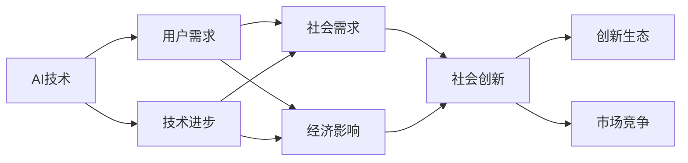
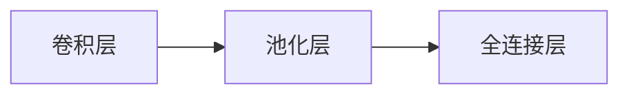

                 

# 用户需求：AI 发展的指南

在当今这个数字化、智能化的时代，人工智能(AI)技术已经渗透到了我们生活的方方面面，从智能家居、自动驾驶、到医疗健康、金融服务，AI的应用无处不在。然而，AI的发展和应用还面临着诸多挑战和需求，这些需求不仅仅局限于技术层面的改进，更涉及伦理、社会、经济等多个维度。本文将从用户需求的角度，探讨AI发展的关键问题，并提出相应的解决方案，旨在推动AI技术向更加成熟、普适、可信的方向发展。

## 1. 背景介绍

### 1.1 人工智能发展的现状

当前，AI技术的发展正处于飞速进展之中，尤其是在深度学习、自然语言处理、计算机视觉等领域取得了显著的成果。大模型如GPT-3、BERT等凭借其庞大的参数量和强大的泛化能力，在多项任务上刷新了最优性能记录。然而，尽管如此，AI在真实世界的应用仍存在诸多局限，难以满足用户多样化的需求。

### 1.2 用户需求的概述

用户对于AI的需求是多层次的，不仅包括性能提升，还有功能完善、体验优化、隐私保护、伦理约束等。因此，AI的发展不应仅仅关注技术指标的提升，更要关注用户体验和实际需求。只有将技术进步与社会、伦理、经济等多方面因素相结合，AI才能更好地服务于社会，实现可持续发展。

## 2. 核心概念与联系

### 2.1 核心概念概述

为更好地理解AI技术的发展和用户需求，本文将介绍几个核心概念，并阐述它们之间的联系：

- **AI技术**：指通过计算机科学和数学方法，赋予机器以智能，使其能够完成复杂任务的技术体系。
- **用户需求**：指用户在使用AI产品或服务时，所期望达到的功能、性能、体验等要求。
- **技术进步**：指AI技术的不断发展，包括算法改进、模型优化、数据增强等方面。
- **社会需求**：指AI技术在社会各个层面上的需求，如就业结构变化、隐私保护、伦理规范等。
- **经济影响**：指AI技术对经济领域的深远影响，包括产业升级、市场竞争格局变化等。

这些概念之间存在着紧密的联系，技术的进步可以更好地满足用户需求，而用户需求的多样性又推动了AI技术的不断创新和发展。

### 2.2 核心概念的联系

以上核心概念之间的联系可以通过以下Mermaid流程图来展示：



这个流程图展示了AI技术如何通过技术进步不断满足用户需求，进而推动社会创新和经济发展。

## 3. 核心算法原理 & 具体操作步骤

### 3.1 算法原理概述

AI发展的核心在于算法原理的不断创新。从传统的统计学习、决策树、支持向量机，到深度学习、强化学习、迁移学习，算法的发展使得AI技术在各个领域取得了突破性进展。深度学习，特别是神经网络模型，已经成为AI发展的主流范式，其中卷积神经网络(CNN)和循环神经网络(RNN)在图像处理和语音识别等领域表现优异。

### 3.2 算法步骤详解

AI技术的开发一般包括以下几个关键步骤：

**Step 1: 数据准备**  
- 收集和预处理数据集，确保数据的质量和多样性。

**Step 2: 模型设计**  
- 选择或设计适合的模型架构，如CNN、RNN、Transformer等，并设定超参数。

**Step 3: 模型训练**  
- 使用训练数据集对模型进行有监督或无监督学习，调整模型参数以最小化损失函数。

**Step 4: 模型评估**  
- 使用验证数据集评估模型性能，选择最优模型。

**Step 5: 模型部署**  
- 将训练好的模型部署到实际应用中，进行推理预测。

**Step 6: 模型迭代**  
- 根据实际应用反馈，对模型进行优化和更新，提升性能。

### 3.3 算法优缺点

AI算法在提高生产效率、优化决策过程、解决复杂问题等方面具有显著优势，但同时也存在一些缺点：

**优点**：
- **高效性**：AI算法可以快速处理大量数据，优化决策过程。
- **准确性**：基于大量数据训练的AI模型具有较高的预测准确性。
- **灵活性**：AI算法能够处理多种类型的数据，适应不同的应用场景。

**缺点**：
- **数据依赖性**：AI算法需要大量标注数据进行训练，数据获取成本较高。
- **模型复杂性**：大型深度学习模型需要高性能硬件支持，计算成本高。
- **可解释性不足**：黑盒模型难以解释其内部决策过程。

### 3.4 算法应用领域

AI算法在多个领域得到了广泛应用，包括但不限于：

- **医疗健康**：通过AI技术辅助诊断疾病、推荐治疗方案等。
- **金融服务**：利用AI进行风险评估、投资决策、欺诈检测等。
- **智能制造**：应用AI技术进行质量检测、设备维护、生产调度等。
- **自动驾驶**：利用AI技术实现车辆自主驾驶、路况预测等。

## 4. 数学模型和公式 & 详细讲解 & 举例说明

### 4.1 数学模型构建

AI模型的构建需要建立数学模型，如线性回归、逻辑回归、卷积神经网络、循环神经网络等。以线性回归模型为例，其数学模型为：

$$
y = w_0 + w_1 x_1 + w_2 x_2 + \dots + w_n x_n + \epsilon
$$

其中 $w_i$ 为模型权重，$x_i$ 为输入特征，$y$ 为输出目标，$\epsilon$ 为噪声项。

### 4.2 公式推导过程

线性回归模型的最小二乘法损失函数为：

$$
\mathcal{L}(\theta) = \frac{1}{2N} \sum_{i=1}^N (y_i - \hat{y}_i)^2
$$

其中 $\theta$ 为模型参数，$y_i$ 为真实标签，$\hat{y}_i$ 为模型预测值。

通过求解最小二乘法损失函数的最小值，可以得到最优模型参数 $\theta^*$：

$$
\theta^* = \mathop{\arg\min}_{\theta} \mathcal{L}(\theta)
$$

求解过程一般通过梯度下降等优化算法实现。

### 4.3 案例分析与讲解

以卷积神经网络(CNN)为例，CNN在图像识别任务中表现优异。其基本结构包括卷积层、池化层和全连接层，如图：



卷积层通过滑动窗口对输入图像进行卷积运算，提取图像特征；池化层对特征图进行下采样，减少计算量；全连接层将池化层输出的特征向量映射为分类结果。

## 5. 项目实践：代码实例和详细解释说明

### 5.1 开发环境搭建

要进行AI开发，首先需要搭建开发环境。以下是使用Python进行TensorFlow开发的环境配置流程：

1. 安装Anaconda：从官网下载并安装Anaconda，用于创建独立的Python环境。

2. 创建并激活虚拟环境：
```bash
conda create -n tf-env python=3.8 
conda activate tf-env
```

3. 安装TensorFlow：根据CUDA版本，从官网获取对应的安装命令。例如：
```bash
conda install tensorflow==2.8
```

4. 安装各类工具包：
```bash
pip install numpy pandas scikit-learn matplotlib tqdm jupyter notebook ipython
```

完成上述步骤后，即可在`tf-env`环境中开始AI开发。

### 5.2 源代码详细实现

以下是使用TensorFlow进行图像识别的代码实现。

```python
import tensorflow as tf
from tensorflow.keras import datasets, layers, models

# 加载数据集
(train_images, train_labels), (test_images, test_labels) = datasets.cifar10.load_data()

# 数据预处理
train_images, test_images = train_images / 255.0, test_images / 255.0

# 定义模型架构
model = models.Sequential([
    layers.Conv2D(32, (3, 3), activation='relu', input_shape=(32, 32, 3)),
    layers.MaxPooling2D((2, 2)),
    layers.Conv2D(64, (3, 3), activation='relu'),
    layers.MaxPooling2D((2, 2)),
    layers.Conv2D(64, (3, 3), activation='relu'),
    layers.Flatten(),
    layers.Dense(64, activation='relu'),
    layers.Dense(10)
])

# 编译模型
model.compile(optimizer='adam',
              loss=tf.keras.losses.SparseCategoricalCrossentropy(from_logits=True),
              metrics=['accuracy'])

# 训练模型
history = model.fit(train_images, train_labels, epochs=10, 
                    validation_data=(test_images, test_labels))

# 评估模型
test_loss, test_acc = model.evaluate(test_images, test_labels, verbose=2)
print('Test accuracy:', test_acc)
```

### 5.3 代码解读与分析

**图像数据集加载**：
- `datasets.cifar10.load_data()` 方法从TensorFlow数据集中加载CIFAR-10数据集，该数据集包含60,000张32x32的彩色图像，分为10个类别。

**数据预处理**：
- 将图像像素值缩放到[0,1]区间，以加速模型训练。

**模型架构定义**：
- 定义了一个包含三个卷积层、两个池化层、两个全连接层的CNN模型。

**模型编译**：
- 使用Adam优化器，交叉熵损失函数，并定义了准确率作为评估指标。

**模型训练**：
- 在训练集上使用10个epoch进行训练，并在验证集上评估模型性能。

**模型评估**：
- 在测试集上评估模型性能，并输出准确率。

## 6. 实际应用场景

### 6.1 医疗影像分析

AI在医疗影像分析中的应用可以大幅提升诊断的准确性和效率。传统上，医生需要耗费大量时间对影像进行人工分析，易受主观因素影响。而AI算法可以通过分析影像特征，自动生成诊断报告，大大缩短诊断时间，降低误诊率。

以深度学习算法在肺部结节检测任务中的应用为例，使用卷积神经网络对CT影像进行特征提取，并通过全连接层进行分类，可以准确检测出肺结节并给出病灶位置。

### 6.2 智能客服

智能客服系统通过AI技术实现自动化客服，可以24小时不间断服务，提高客户满意度。智能客服系统通常基于自然语言处理(NLP)技术，利用预训练语言模型对客户提问进行理解和分类，从而自动提供相应的答案或服务。

智能客服系统在电商平台、银行、保险公司等领域得到了广泛应用，可以处理大量重复性问题，降低人力成本，提高服务效率。

### 6.3 金融风险管理

AI在金融风险管理中的应用包括信用评估、反欺诈检测、风险预测等。金融行业对决策的准确性和及时性要求极高，而AI算法可以通过分析大量历史数据，预测市场趋势，识别异常交易行为，及时发现潜在的金融风险。

例如，利用深度学习算法对交易数据进行分析，可以预测股票价格的走势，帮助投资者做出更明智的投资决策。

## 7. 工具和资源推荐

### 7.1 学习资源推荐

为了帮助开发者系统掌握AI技术，以下是一些优质的学习资源：

1. 《深度学习》课程：斯坦福大学提供的深度学习课程，由Andrew Ng教授主讲，内容详实，涵盖了深度学习的各个方面。

2. Coursera上的《机器学习》课程：由Andrew Ng教授主讲，适合零基础入门。

3. Kaggle：一个数据科学竞赛平台，提供大量公开数据集和竞赛题目，有助于提高数据处理和算法设计能力。

4. GitHub上的AI开源项目：如TensorFlow、PyTorch等，提供丰富的AI技术实现和应用案例。

### 7.2 开发工具推荐

高效的AI开发需要依赖优秀的工具。以下是几款用于AI开发的工具：

1. TensorFlow：由Google主导开发的深度学习框架，支持分布式训练，生产部署方便。

2. PyTorch：由Facebook主导开发的深度学习框架，灵活易用，适用于研究开发。

3. Keras：高层次API，支持TensorFlow、Theano、CNTK等深度学习框架，方便快速搭建模型。

4. Jupyter Notebook：交互式编程环境，支持Python、R等语言，适合快速迭代开发。

### 7.3 相关论文推荐

AI技术的发展离不开学界的持续研究。以下是几篇奠基性的相关论文，推荐阅读：

1. 《ImageNet Classification with Deep Convolutional Neural Networks》：提出了深度卷积神经网络，在ImageNet图像识别任务上取得了优异成绩。

2. 《DenseNet》：提出了一种密集连接的网络结构，大幅提升了深度神经网络的表现。

3. 《BERT: Pre-training of Deep Bidirectional Transformers for Language Understanding》：提出BERT模型，利用自监督学习任务进行预训练，在多项NLP任务上刷新了最优性能。

4. 《Attention is All You Need》：提出了Transformer结构，推动了NLP领域的预训练大模型发展。

5. 《The Power of Scale for Transfer Learning》：探讨了模型规模对迁移学习效果的影响，强调了超大规模模型的优势。

这些论文代表了AI技术的发展脉络，通过学习这些前沿成果，可以帮助研究者把握学科前进方向，激发更多的创新灵感。

## 8. 总结：未来发展趋势与挑战

### 8.1 研究成果总结

本文从用户需求的角度，探讨了AI技术的发展方向和挑战。AI技术在多个领域已经取得了显著的成果，但用户需求的多样性和复杂性也提出了新的挑战。未来，AI的发展需要更加注重技术进步与社会需求之间的平衡，才能真正实现可持续发展。

### 8.2 未来发展趋势

展望未来，AI技术的发展趋势包括以下几个方面：

1. **多模态融合**：将图像、语音、文本等多种数据形式进行融合，提升AI系统的理解和推理能力。

2. **联邦学习**：在分布式环境下，通过模型参数的共享和更新，实现数据隐私保护和模型训练效率的提升。

3. **自适应学习**：通过强化学习、转移学习等技术，使AI模型具备自我优化和适应环境变化的能力。

4. **智能制造**：AI技术在智能制造中的应用将推动制造业的数字化、智能化转型。

5. **自动驾驶**：AI技术在自动驾驶领域的应用将大幅提升交通安全性和交通效率。

### 8.3 面临的挑战

尽管AI技术取得了显著进展，但在落地应用的过程中，仍面临诸多挑战：

1. **数据隐私和安全**：AI算法需要大量的标注数据进行训练，如何在保证数据隐私和安全的前提下，获取高质量数据，是一个重要问题。

2. **伦理和社会影响**：AI技术在应用过程中可能带来一些负面影响，如就业结构变化、算法偏见等，需要制定相应的伦理规范和政策。

3. **计算资源需求**：AI模型规模的不断增大，对计算资源的需求也在不断增加，如何高效利用计算资源，是一个关键问题。

4. **模型可解释性**：AI模型的复杂性使得其决策过程难以解释，需要在模型设计和技术应用过程中，注重模型的可解释性和透明性。

### 8.4 研究展望

未来的AI研究需要从多个方面进行突破：

1. **数据隐私保护**：开发更加高效的数据获取和保护技术，确保用户隐私安全。

2. **伦理和法律规范**：制定AI伦理规范和法律标准，确保AI技术的公平、透明和可信。

3. **计算资源优化**：开发更加高效的计算模型和算法，降低计算成本，提升训练效率。

4. **模型可解释性**：研究并开发更加可解释的AI模型，提升模型的透明性和可理解性。

5. **多领域应用**：将AI技术应用于更多领域，推动各行业的数字化转型和智能化升级。

## 9. 附录：常见问题与解答

**Q1: 什么是AI技术？**

A: AI技术是通过计算机科学和数学方法，赋予机器以智能，使其能够完成复杂任务的技术体系。

**Q2: AI技术在实际应用中有哪些优点？**

A: AI技术具有高效性、准确性、灵活性等优点，可以处理大量数据，优化决策过程，适应多种应用场景。

**Q3: AI技术在实际应用中面临哪些挑战？**

A: AI技术在实际应用中面临数据隐私和安全、伦理和社会影响、计算资源需求、模型可解释性等挑战。

**Q4: 如何开发AI模型？**

A: AI模型的开发一般包括以下步骤：数据准备、模型设计、模型训练、模型评估和模型部署。

**Q5: 如何使用TensorFlow进行图像识别？**

A: 使用TensorFlow进行图像识别的步骤如下：加载数据集、预处理数据、定义模型架构、编译模型、训练模型、评估模型。

---

作者：禅与计算机程序设计艺术 / Zen and the Art of Computer Programming

