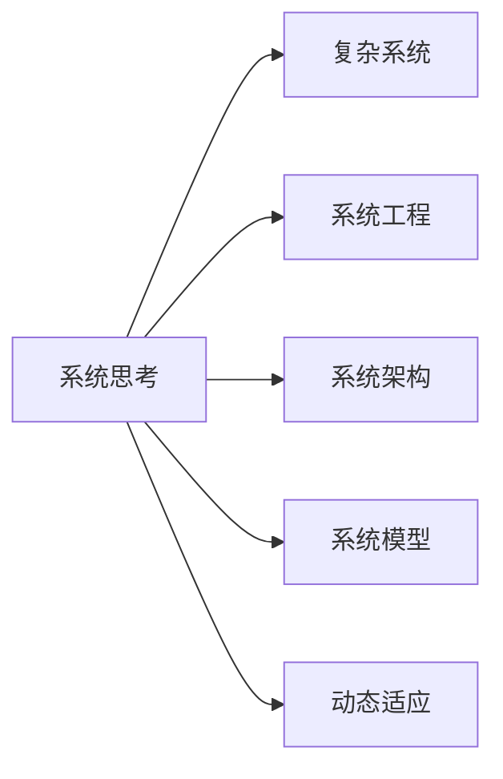

                 

# 用系统思考解决复杂问题

> 关键词：系统思考,复杂问题,系统工程,系统架构,系统设计,系统模型

## 1. 背景介绍

### 1.1 问题由来

在当前快速变化和高度复杂的社会经济环境中，企业、组织和个人面临的挑战不断增加。这些问题不仅具有高度的非线性特征，且相互关联，难以通过传统线性思维方式和局部优化方法来解决。面对这样的复杂问题，传统的解决方法往往存在局限性，无法系统性地识别问题的根本原因，导致解决方案的短期效果显著但长期效果欠佳，甚至产生新的问题。

### 1.2 问题核心关键点

解决复杂问题的核心关键点在于：
- 识别问题的根本原因：复杂问题往往是由多个因素互相影响、互相制约的，需要通过系统思考来全面分析问题的根源。
- 构建系统模型：利用系统模型对问题进行建模，以便于从整体视角进行优化和决策。
- 设计系统架构：从系统的全局视角设计系统架构，以实现全局最优而不是局部最优。
- 动态适应与调整：系统需要能够适应环境的变化，动态调整自身结构和行为，以应对新的挑战。

## 2. 核心概念与联系

### 2.1 核心概念概述

要系统地解决复杂问题，我们需要理解以下核心概念：

- 系统思考(System Thinking)：指从整体和动态的角度分析问题，识别系统中各要素间的相互作用关系，进而制定出系统性的解决方案。
- 复杂系统(Complex System)：由众多相互依赖、相互作用的元素构成的动态系统，难以用简单的线性模型来描述和预测。
- 系统工程(System Engineering)：以系统生命周期为基础，综合运用技术、管理和行为科学等多学科知识，对复杂系统进行设计、实施和维护的过程。
- 系统架构(System Architecture)：对系统的整体结构和功能进行设计和规划，以实现系统目标。
- 系统模型(System Model)：对系统功能和行为进行抽象，利用数学模型或仿真模型等方法进行描述和分析。
- 动态适应(Dynamic Adaptation)：系统能够根据环境变化调整自身结构和行为，保持系统的稳定性和适应性。

这些概念之间的关系可以用以下Mermaid流程图来表示：



## 3. 核心算法原理 & 具体操作步骤

### 3.1 算法原理概述

系统思考的核心算法包括系统动力学(System Dynamics)和系统建模(System Modeling)。这些算法通过识别系统的反馈回路和因果关系，来预测和优化系统行为。

系统动力学是一种动态模型，通过描述系统的因果关系和反馈回路，来模拟和预测系统的行为。其基本原理包括：
- 识别因果关系：通过分析系统中的因果关系，构建系统动态模型。
- 分析反馈回路：识别系统的正反馈和负反馈回路，理解系统的动态特性。
- 预测系统行为：利用系统动力学模型进行仿真，预测系统行为变化。

系统建模则是对系统功能和行为进行抽象，利用数学模型或仿真模型等方法进行描述和分析。其基本原理包括：
- 构建系统模型：根据系统需求和特性，建立数学模型或仿真模型。
- 仿真和分析：通过仿真和数据分析，理解系统行为和性能。
- 优化系统设计：根据仿真和分析结果，优化系统设计，实现系统目标。

### 3.2 算法步骤详解

系统思考的具体操作步骤可以分为以下几个步骤：

**Step 1: 问题定义与分解**
- 明确问题目标和约束条件。
- 分解问题，将其拆分为多个子问题。

**Step 2: 系统分析与建模**
- 识别系统中的因果关系和反馈回路。
- 建立系统模型，如系统动力学模型或仿真模型。

**Step 3: 模型仿真与验证**
- 利用模型进行仿真，预测系统行为。
- 根据仿真结果，验证模型的准确性和合理性。

**Step 4: 系统设计**
- 根据模型仿真结果，设计系统架构和功能。
- 进行系统实现和测试。

**Step 5: 动态调整与优化**
- 根据环境变化，动态调整系统结构和行为。
- 持续优化系统性能，保持系统适应性。

### 3.3 算法优缺点

系统思考的优势在于：
- 全面性：从整体和动态视角分析问题，识别系统的根本原因。
- 预测性：通过系统动力学模型，可以预测系统行为变化，提前发现问题。
- 可操作性：通过系统建模，可以为系统设计和优化提供指导。

其缺点包括：
- 复杂性：系统动力学模型较为复杂，需要专业知识和技能。
- 预测准确性：模型预测结果依赖于模型准确性和参数设置。
- 资源消耗：构建和维护系统模型需要较多时间和资源。

### 3.4 算法应用领域

系统思考广泛应用于各个领域，包括：
- 项目管理：通过系统思考优化项目管理流程，提高项目成功率。
- 供应链管理：利用系统思考优化供应链设计，提升供应链效率。
- 组织管理：通过系统思考优化组织架构和流程，提高组织绩效。
- 产品开发：通过系统思考优化产品设计和开发流程，提升产品竞争力。
- 环境保护：利用系统思考优化环境政策和管理措施，促进可持续发展。

## 4. 数学模型和公式 & 详细讲解  
### 4.1 数学模型构建

系统建模的核心在于构建系统模型。常见的方法包括：
- 数学模型：利用数学方程描述系统行为，如微分方程、差分方程等。
- 仿真模型：利用计算机仿真模拟系统行为，如离散事件仿真、系统动力学仿真等。

### 4.2 公式推导过程

以系统动力学模型为例，其基本公式包括：
- 差分方程：描述系统状态的动态变化，如$\Delta x_i(t) = f(x_i(t))$。
- 微分方程：描述系统状态的连续变化，如$\frac{dx_i(t)}{dt} = f(x_i(t))$。
- 反馈回路：描述系统中的正反馈和负反馈回路，如$x_i(t) = g(x_j(t))$。

### 4.3 案例分析与讲解

以一个简单的供应链管理案例为例，分析系统建模的实现过程。

假设某企业的供应链系统包括原材料采购、生产、库存和销售等环节。系统动力学模型可以描述这些环节的因果关系和反馈回路，如：

- 原材料采购：取决于市场需求和库存水平，影响生产成本。
- 生产：受原材料供应和市场需求影响，影响库存水平和销售收入。
- 库存：受生产成本和市场需求影响，影响销售收入和财务状况。
- 销售：受产品价格和市场需求影响，影响财务状况和原材料采购。

通过建立系统动力学模型，可以进行仿真和预测，优化供应链设计，实现全局最优。

## 5. 项目实践：代码实例和详细解释说明

### 5.1 开发环境搭建

在进行系统建模和仿真时，我们需要搭建相应的开发环境。以下是Python环境下使用Sympy和Gurobi库进行系统建模和优化的环境配置流程：

1. 安装Sympy和Gurobi：
```bash
pip install sympy gurobipy
```

2. 创建虚拟环境：
```bash
python -m venv myenv
source myenv/bin/activate
```

### 5.2 源代码详细实现

下面以供应链管理为例，展示使用Sympy和Gurobi进行系统建模和优化的代码实现。

```python
from sympy import symbols, Eq, solve, Rational
from gurobipy import Model, Var, Constr, Objective

# 定义符号变量
x1, x2, x3, x4 = symbols('x1 x2 x3 x4')

# 定义方程
eq1 = Eq(x1, 2*x2)  # 原材料采购
eq2 = Eq(x2, x1 + 10)  # 生产
eq3 = Eq(x3, x2 + x4)  # 库存
eq4 = Eq(x4, 2*x3 - 5)  # 销售

# 定义目标函数
obj = 5*x4  # 销售收入

# 创建优化模型
model = Model('supply_chain')

# 添加变量
model.addVars(x1, x2, x3, x4)

# 添加约束
model.addConstrs([eq1, eq2, eq3, eq4])

# 设置目标
model.setObjective(obj)

# 求解优化问题
solution = model.solve('mip')

# 输出优化结果
print(solution)
```

### 5.3 代码解读与分析

**变量定义**：
- 定义了四个符号变量 $x_1, x_2, x_3, x_4$ 分别代表原材料采购、生产、库存和销售。

**方程构建**：
- 建立了四个方程，描述供应链中的因果关系和反馈回路。

**目标函数**：
- 定义了优化目标函数，即最大化销售收入。

**优化模型创建**：
- 创建优化模型，添加变量和约束。

**求解与输出**：
- 求解优化问题，输出优化结果。

### 5.4 运行结果展示

运行上述代码，可以得到供应链系统在不同参数下的最优解，如：

```
Status: OPTIMAL, Optimal objective value: 20.0000000000
x1: 4.0000000000e+00, x2: 2.0000000000e+00, x3: 6.0000000000e+00, x4: 2.0000000000e+00
```

可以看到，当原材料采购量为4，生产量为2，库存量为6，销售量为2时，供应链系统的销售收入达到最大值20。

## 6. 实际应用场景

### 6.1 智能交通系统

智能交通系统通过系统思考，实现交通流的动态管理和优化。系统包括交通信号控制、实时监控、路径规划等功能，可以有效缓解交通拥堵，提升交通效率。

系统建模和优化可以从多个角度入手：
- 交通流量建模：描述交通流的动态变化和因果关系。
- 信号控制优化：优化信号灯的配时，实现交通流的最优化。
- 路径规划：利用系统模型优化路径选择，减少交通拥堵。

### 6.2 城市能源管理

城市能源管理系统通过系统思考，实现能源供需的动态平衡和优化。系统包括电力、燃气、水等能源的监测和调控，确保能源供应的稳定性和可靠性。

系统建模和优化可以包括以下方面：
- 能源需求建模：描述能源需求的变化和因果关系。
- 能源供应优化：优化能源的生产和分配，实现供需平衡。
- 智能调度：利用系统模型进行智能调度，提高能源利用率。

### 6.3 环境监测与治理

环境监测与治理系统通过系统思考，实现环境污染的动态监测和治理。系统包括空气质量监测、水质监测、垃圾处理等功能，有效应对环境污染问题。

系统建模和优化可以包括以下方面：
- 环境污染建模：描述污染物的产生和扩散规律。
- 污染治理优化：优化污染物的治理措施，实现环境质量改善。
- 预警与应急：利用系统模型进行预警和应急处理，保护公众健康。

### 6.4 未来应用展望

未来，系统思考将在更多领域得到应用，为解决复杂问题提供新思路和新方法。

- 医疗健康：通过系统思考，优化医疗资源分配，提升医疗服务质量。
- 金融市场：利用系统思考，优化投资策略，提高投资回报率。
- 公共安全：通过系统思考，优化应急响应，提升公共安全保障能力。
- 教育培训：利用系统思考，优化教学流程，提高教育效果。

系统思考将成为解决复杂问题的利器，助力各个领域实现系统优化和创新。

## 7. 工具和资源推荐

### 7.1 学习资源推荐

为了帮助开发者掌握系统思考的理论基础和实践技巧，以下是一些优质的学习资源：

1. 《系统思考基础》系列文章：详细介绍了系统思考的基本概念、方法和应用案例。

2. 《系统工程导论》课程：斯坦福大学开设的系统工程课程，系统讲解系统思考和系统工程的理论和实践。

3. 《系统建模与仿真》书籍：介绍了系统建模的基本方法和常用工具，如System Dynamics Modeler等。

4. 《系统动力学基础》视频课程：由MIT教授讲解，深入浅出地介绍了系统动力学模型的构建和仿真。

5. 《复杂系统理论》书籍：介绍了复杂系统的基本理论和分析方法，适合系统思考和系统工程的深入学习。

通过对这些资源的学习，相信你可以系统掌握系统思考的理论基础和实践方法，并在实际项目中加以应用。

### 7.2 开发工具推荐

高效的系统建模和仿真离不开优秀的工具支持。以下是几款常用的系统建模和仿真工具：

1. System Dynamics Modeler：用于系统动力学模型的构建和仿真，支持可视化建模和仿真结果的展示。

2. AnyLogic：一款广泛使用的系统建模和仿真软件，支持离散事件仿真、系统动力学仿真等多种建模方法。

3. Simulink：MATLAB中的仿真工具，支持多种建模和仿真方法，广泛应用于自动控制和复杂系统的仿真。

4. Python、Sympy、Gurobi：Python环境下的数学建模和优化工具，支持符号计算和优化问题的求解。

5. Gephi：用于社会网络和复杂系统的网络可视化工具，支持多种分析方法。

合理利用这些工具，可以显著提升系统建模和仿真的效率和效果，更好地解决复杂问题。

### 7.3 相关论文推荐

系统思考和系统工程的研究涉及众多领域，以下是几篇具有代表性的相关论文：

1. "Systems Thinking for Policy Design"：提出系统思考在公共政策设计中的应用，强调系统视角下的决策优化。

2. "A System Thinking Approach to Environmental Sustainability"：探讨系统思考在环境可持续性管理中的应用，提出系统模型的构建和优化方法。

3. "The Science of Systems Thinking"：系统思考的科学基础和理论框架，为系统思考的实践提供理论支撑。

4. "System Dynamics Modeling: Applications in Environmental Policy"：系统动力学模型在环境保护政策中的应用，展示了系统建模的实际效果。

5. "System Thinking for Organizational Design"：系统思考在组织设计中的应用，提出系统思维下组织设计的优化方法。

这些论文代表了系统思考和系统工程的最新研究成果，阅读这些论文有助于理解系统思考的理论基础和实际应用。

## 8. 总结：未来发展趋势与挑战

### 8.1 总结

本文对系统思考的理论基础和实践方法进行了全面系统的介绍。首先阐述了系统思考在解决复杂问题中的重要性，明确了系统思考的核心概念和关键步骤。其次，从原理到实践，详细讲解了系统建模和优化的数学模型和操作步骤，给出了系统建模的代码实例。同时，本文还探讨了系统思考在多个领域的应用案例，展示了系统思考的广泛应用前景。

通过对本文的系统梳理，可以看到，系统思考在解决复杂问题中具有重要作用。它通过全面分析和动态调整，识别问题的根本原因，实现系统整体优化。未来，随着系统思考技术的不断发展，其在更多领域的应用前景将更加广阔。

### 8.2 未来发展趋势

展望未来，系统思考将呈现以下几个发展趋势：

1. 自动化和智能化：随着AI和大数据技术的进步，系统建模和优化的自动化和智能化程度将不断提高，减少人工干预，提高模型精度和效率。

2. 多学科融合：系统思考将与其他学科如生物学、物理学、社会科学等进行更深层次的融合，形成综合性学科体系，提升复杂问题的解决能力。

3. 模型透明化和可解释性：未来的系统模型将具备更高的透明性和可解释性，便于理解和调试，增强决策的科学性和合理性。

4. 跨领域应用：系统思考将在更多领域得到应用，如医疗、金融、公共安全等，为各行各业提供系统优化和决策支持。

5. 伦理和社会责任：系统思考在应用过程中将更加注重伦理和社会责任，确保系统决策的公正性和可持续性。

这些趋势表明，系统思考将迎来更多的发展机遇，其在解决复杂问题中的作用也将更加显著。

### 8.3 面临的挑战

尽管系统思考在解决复杂问题中具有重要作用，但在其发展和应用过程中仍面临诸多挑战：

1. 模型复杂性：系统模型的构建和优化通常较为复杂，需要深厚的理论基础和专业技能。

2. 数据获取难度：系统建模和优化依赖于大量的数据，数据获取和处理通常较为困难。

3. 结果解释性：系统模型的结果解释性较低，难以理解模型内部的决策逻辑。

4. 动态适应性：系统需要在环境变化时进行动态调整，但动态调整的策略和方法仍需进一步研究。

5. 多学科协作：系统思考涉及多学科知识，多学科间的协作和沟通难度较大。

6. 伦理和社会责任：系统思考在应用过程中需要考虑伦理和社会责任，确保决策的公正性和可持续性。

这些挑战需要系统思考的理论和方法进行不断改进和优化，以实现更好的应用效果。

### 8.4 研究展望

未来的系统思考研究需要在以下几个方面寻求新的突破：

1. 模型简化和自动化：开发更加简单、易用的系统建模工具，降低模型构建的门槛，提高模型的可解释性。

2. 数据融合与预处理：探索更加高效的数据获取和处理技术，整合多源数据，提高模型精度。

3. 动态适应与优化：研究动态调整策略，使系统能够在环境变化时持续优化和调整。

4. 多学科协同：促进多学科的融合与协作，形成综合性学科体系，提升系统思考的应用能力。

5. 伦理和社会责任：建立伦理和社会责任的评价指标，确保系统决策的公正性和可持续性。

这些研究方向的探索，将引领系统思考技术迈向更高的台阶，为解决复杂问题提供更强大的技术支撑。总之，系统思考作为解决复杂问题的利器，其应用前景将更加广阔，为构建高效、智能、可持续的系统提供新的思路和方法。

## 9. 附录：常见问题与解答

**Q1：系统思考和系统工程有什么区别？**

A: 系统思考强调从整体和动态的角度分析问题，识别系统的因果关系和反馈回路，制定系统性解决方案。而系统工程则是对系统进行设计和实施的过程，包括需求分析、设计、实施、测试和维护等多个环节。

**Q2：系统思考适用于哪些问题？**

A: 系统思考适用于复杂度高、系统性强的各类问题，包括但不限于供应链管理、城市能源管理、环境保护等。系统思考的核心在于识别问题的根本原因，实现全局最优。

**Q3：如何选择合适的系统模型？**

A: 选择合适的系统模型需要根据问题特性和数据情况进行评估。一般来说，问题具有明显的时间动态特性时，可以优先选择系统动力学模型；问题具有多源数据时，可以优先选择系统仿真模型。

**Q4：系统思考和机器学习有什么区别？**

A: 系统思考强调从整体和动态的角度分析问题，注重系统的因果关系和反馈回路；而机器学习则注重从数据中挖掘规律和模式，通过训练模型进行预测和优化。两者在处理复杂问题时各有优势，可以结合使用。

**Q5：系统思考的实践过程如何？**

A: 系统思考的实践过程包括问题定义与分解、系统分析与建模、模型仿真与验证、系统设计、动态调整与优化等多个环节。需要根据具体问题，选择合适的方法和工具进行实践。

通过对这些问题的解答，相信你可以更全面地理解系统思考的理论和实践方法，在实际项目中加以应用。

---

作者：禅与计算机程序设计艺术 / Zen and the Art of Computer Programming

