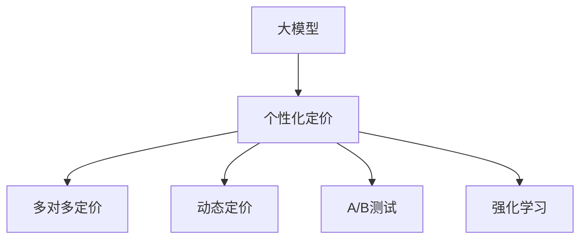

                 

## 1. 背景介绍

### 1.1 问题由来

在电商平台上，个性化定价策略是提升销售效率和利润率的重要手段。传统的定价方式依赖于业务经验，如成本加成法、竞争对标法等，往往缺乏对用户行为的深入分析，难以充分发挥个性化定价的潜力。近年来，基于人工智能的大模型技术为个性化定价带来了新的机遇。通过分析用户行为、历史订单、商品属性等多维度数据，大模型能够在多对多用户商品定价中实现高效、准确的定价。

### 1.2 问题核心关键点

电商平台个性化定价的核心在于如何在动态变化的市场环境中，根据用户行为和商品特征，动态调整商品价格，以最大化平台和用户双赢。大模型的引入使得个性化定价更加灵活、精细，但同时也带来了对技术栈、数据处理、模型训练等方面的新挑战。如何高效利用大模型，构建出稳定、高效的个性化定价系统，将是本文探讨的主题。

### 1.3 问题研究意义

个性化定价策略的优化，可以显著提升电商平台的销售效率和利润率。根据一些研究，合理定价能够提升20%~30%的销售量，甚至50%以上的收益。此外，个性化定价还能够提升用户的购物体验，增强平台的用户粘性。本文从技术角度探讨如何构建个性化定价模型，并对实际应用中的问题提供解决方案，有望为电商平台带来更高的商业价值。

## 2. 核心概念与联系

### 2.1 核心概念概述

为更好地理解基于大模型的个性化定价策略，本节将介绍几个密切相关的核心概念：

- **大模型(大规模预训练模型)**：以自回归或自编码模型为代表的大规模预训练模型，如BERT、GPT等。通过在海量无标签文本数据上预训练，学习到丰富的语言和知识表示，具备强大的语言理解和生成能力。
- **个性化定价**：根据用户行为、历史订单、商品属性等数据，动态调整商品价格，实现用户满意和利润最大化的双赢策略。
- **多对多(Multi-Party)定价**：电商平台中每个用户面临多个商品选择，每个商品又面临多个用户，这种多对多的关系使得定价问题更加复杂。
- **动态定价**：根据市场环境和用户行为，实时调整商品价格，以最大化收益和用户满意度。
- **A/B测试**：通过随机分流测试不同定价策略，评估其效果，优化定价模型。
- **强化学习**：通过奖励机制驱动模型学习最优定价策略，在不断试错中逼近最优解。

这些概念之间的逻辑关系可以通过以下Mermaid流程图来展示：



这个流程图展示了大模型在个性化定价策略中的核心作用，以及与之紧密相关的几个关键概念：多对多定价、动态定价、A/B测试和强化学习。

## 3. 核心算法原理 & 具体操作步骤
### 3.1 算法原理概述

基于大模型的个性化定价策略，本质上是一个利用预训练语言模型进行多对多定价的优化问题。其核心思想是：将用户行为和商品属性作为模型的输入，使用大模型预测每个用户对每个商品的定价，根据市场环境动态调整价格，最大化平台和用户双赢。

形式化地，假设用户集为 $U$，商品集为 $P$，给定用户 $u$ 和商品 $p$，定义其定价为 $x_{u,p}$。假设历史数据集中有 $N$ 个用户行为数据 $(x_{u_i},y_{u_i})$ 和 $M$ 个商品属性数据 $(x_{p_j},y_{p_j})$，其中 $y$ 为标签，即用户是否购买了该商品。则定价问题的目标为：

$$
\hat{x}_{u,p}=\mathop{\arg\min}_{x} \mathcal{L}(x, U, P, Y)
$$

其中 $\mathcal{L}$ 为定价问题设计的损失函数，用于衡量模型预测输出与真实标签之间的差异。常见的损失函数包括交叉熵损失、均方误差损失等。

通过梯度下降等优化算法，定价过程不断更新模型参数，最小化损失函数，使得模型输出逼近真实标签。由于大模型已经通过预训练获得了较强的语言理解能力，因此即便在数据规模较小的电商平台上，也能较快收敛到理想的模型参数。

### 3.2 算法步骤详解

基于大模型的个性化定价策略一般包括以下几个关键步骤：

**Step 1: 准备数据集和模型**

- 收集电商平台的订单历史、用户行为、商品属性等数据，构建多对多的数据集。
- 选择合适的预训练语言模型 $M_{\theta}$ 作为初始化参数，如 BERT、GPT等。

**Step 2: 特征提取与预处理**

- 定义用户行为特征和商品属性特征，作为大模型的输入。
- 对特征进行归一化、缺失值填充、文本编码等预处理。

**Step 3: 模型微调与定价**

- 将用户行为特征和商品属性特征输入大模型，得到每个用户对每个商品的定价预测 $x_{u,p}$。
- 根据定价预测结果和市场环境，动态调整商品价格。

**Step 4: A/B测试与优化**

- 将电商平台的用户随机分为多个实验组，测试不同定价策略的效果。
- 根据A/B测试结果，优化定价模型，提高定价策略的效果。

**Step 5: 强化学习与迭代**

- 设计奖励机制，将用户购买行为作为奖励信号，引导模型学习最优定价策略。
- 使用强化学习算法，不断迭代优化定价模型。

以上是基于大模型的个性化定价策略的一般流程。在实际应用中，还需要针对具体电商平台的特点，对定价模型进行优化设计，如改进特征提取方法，引入更多正则化技术，搜索最优的超参数组合等，以进一步提升定价模型效果。

### 3.3 算法优缺点

基于大模型的个性化定价方法具有以下优点：

1. **高效灵活**：通过大模型的语言理解能力，能够处理多种类型的数据，快速调整定价策略。
2. **适应性强**：能够动态适应市场的变化，及时调整定价，提高用户满意度和平台收益。
3. **可解释性**：大模型的决策过程通常具有可解释性，便于理解定价策略的依据。
4. **广泛应用**：可以应用于电商平台的各类商品定价场景，如新商品定价、促销定价、用户定制化定价等。

同时，该方法也存在一定的局限性：

1. **数据依赖性高**：定价模型的效果很大程度上取决于数据的质量和数量，收集高质量数据成本较高。
2. **过拟合风险**：电商平台数据维度高、噪声多，可能影响模型泛化能力。
3. **计算资源需求高**：大规模语言模型的训练和推理需要高性能计算资源，对硬件设备要求较高。
4. **模型解释性差**：尽管大模型的决策过程具有可解释性，但其内部的数值计算过程仍较复杂，难以完全理解。

尽管存在这些局限性，但就目前而言，基于大模型的个性化定价方法仍是大规模电商平台的优秀选择。未来相关研究的重点在于如何进一步降低数据依赖，提高模型的泛化能力，同时兼顾可解释性和计算效率等因素。

### 3.4 算法应用领域

基于大模型的个性化定价策略，已经在各类电商平台上得到了广泛的应用，例如：

- **新商品定价**：根据商品属性和用户行为，对新商品进行定价，快速占领市场。
- **促销活动定价**：根据促销目标，动态调整商品价格，提升活动效果。
- **用户定制化定价**：根据用户历史订单和行为，提供个性化价格优惠，提升用户粘性。
- **动态价格调整**：根据市场环境和用户行为，实时调整商品价格，提高用户满意度。

除了上述这些经典应用外，个性化定价策略还在产品推荐、库存管理、物流优化等多个电商领域得到了创新性应用，为电商平台带来了显著的商业价值提升。

## 4. 数学模型和公式 & 详细讲解 & 举例说明

### 4.1 数学模型构建

本节将使用数学语言对基于大模型的个性化定价策略进行更加严格的刻画。

记电商平台订单数据集为 $D=\{(x_{u_i},y_{u_i})\}_{i=1}^N, x_{u_i} \in \mathcal{X}, y_{u_i} \in \{0,1\}$，其中 $x_{u_i}$ 为用户 $u_i$ 的历史订单数据，$y_{u_i}$ 为是否购买了商品 $p$。

假设大模型的输入特征为 $x_{u,p} \in \mathcal{X}$，输出为商品 $p$ 对用户 $u$ 的定价 $x_{u,p}$。则定价问题的目标为：

$$
\hat{x}_{u,p}=\mathop{\arg\min}_{x} \mathcal{L}(x_{u,p}, x_{u_i}, x_{p_j})
$$

其中 $\mathcal{L}$ 为定价问题设计的损失函数，用于衡量模型预测输出与真实标签之间的差异。常见的损失函数包括交叉熵损失、均方误差损失等。

### 4.2 公式推导过程

以下我们以交叉熵损失函数为例，推导定价模型中用户行为和商品属性的关系：

假设用户 $u_i$ 的历史订单数据为 $x_{u_i}=(u_{t_i}, v_{u_i})$，其中 $u_{t_i}$ 为历史订单的商品列表，$v_{u_i}$ 为对应的购买记录。商品 $p$ 的属性为 $x_{p_j}=p_{f_j}$，其中 $f_j$ 为商品特征。则用户对商品 $p$ 的定价预测为 $x_{u,p}$。

根据交叉熵损失函数，有：

$$
\ell(x_{u,p}, x_{u_i}, x_{p_j})=-[y_{u_i} \log \hat{y}_{u_i,p}+(1-y_{u_i}) \log(1-\hat{y}_{u_i,p})]
$$

其中 $\hat{y}_{u_i,p}$ 为模型预测用户 $u_i$ 是否购买商品 $p$。则总损失函数为：

$$
\mathcal{L}(x_{u,p}, x_{u_i}, x_{p_j})=\frac{1}{N} \sum_{i=1}^N \ell(x_{u,p}, x_{u_i}, x_{p_j})
$$

将历史订单和商品属性作为输入，通过大模型 $M_{\theta}$ 计算定价预测 $x_{u,p}$，得到：

$$
\hat{x}_{u,p}= M_{\theta}(x_{u,p}, x_{u_i}, x_{p_j})
$$

### 4.3 案例分析与讲解

假设电商平台有2000个用户，每个用户面临5个商品选择，商品属性包含价格、库存、评分等。每个用户的历史订单数据包含购买的商品列表和购买记录。目标是根据这些数据，动态调整商品价格，最大化平台收益和用户满意度。

通过预训练语言模型，模型可以学习到用户和商品之间的语义关系，以及它们对价格的反应。例如，如果用户历史订单中多次购买同一种商品，模型会预测该用户更倾向于购买该商品，价格调整时该商品可能获得更高的权重。

## 5. 项目实践：代码实例和详细解释说明

### 5.1 开发环境搭建

在进行个性化定价策略开发前，我们需要准备好开发环境。以下是使用Python进行PyTorch开发的环境配置流程：

1. 安装Anaconda：从官网下载并安装Anaconda，用于创建独立的Python环境。

2. 创建并激活虚拟环境：
```bash
conda create -n pytorch-env python=3.8 
conda activate pytorch-env
```

3. 安装PyTorch：根据CUDA版本，从官网获取对应的安装命令。例如：
```bash
conda install pytorch torchvision torchaudio cudatoolkit=11.1 -c pytorch -c conda-forge
```

4. 安装Transformers库：
```bash
pip install transformers
```

5. 安装各类工具包：
```bash
pip install numpy pandas scikit-learn matplotlib tqdm jupyter notebook ipython
```

完成上述步骤后，即可在`pytorch-env`环境中开始开发。

### 5.2 源代码详细实现

这里我们以基于大模型的电商商品定价为例，给出使用Transformers库进行个性化定价的PyTorch代码实现。

首先，定义用户行为和商品属性特征提取函数：

```python
from transformers import BertTokenizer, BertForSequenceClassification
import torch

def get_input_features(user_data, product_data):
    tokenizer = BertTokenizer.from_pretrained('bert-base-cased')
    user_tokens = tokenizer(user_data, return_tensors='pt', padding='max_length', truncation=True)
    product_tokens = tokenizer(product_data, return_tensors='pt', padding='max_length', truncation=True)
    
    user_features = [user_tokens['input_ids'][0].flatten(), user_tokens['attention_mask'][0].flatten()]
    product_features = [product_tokens['input_ids'][0].flatten(), product_tokens['attention_mask'][0].flatten()]
    
    return user_features, product_features
```

然后，定义模型和优化器：

```python
from transformers import AdamW

model = BertForSequenceClassification.from_pretrained('bert-base-cased', num_labels=1)
optimizer = AdamW(model.parameters(), lr=2e-5)
```

接着，定义训练和评估函数：

```python
def train_epoch(model, train_data, batch_size, optimizer):
    dataloader = DataLoader(train_data, batch_size=batch_size, shuffle=True)
    model.train()
    epoch_loss = 0
    for batch in dataloader:
        user_features, product_features = batch
        labels = torch.tensor([1.0] * batch_size)  # 目标标签为1，表示购买
        model.zero_grad()
        outputs = model(user_features, attention_mask=product_features)
        loss = outputs.loss
        epoch_loss += loss.item()
        loss.backward()
        optimizer.step()
    return epoch_loss / len(dataloader)

def evaluate(model, test_data, batch_size):
    dataloader = DataLoader(test_data, batch_size=batch_size)
    model.eval()
    preds, labels = [], []
    with torch.no_grad():
        for batch in dataloader:
            user_features, product_features = batch
            labels = torch.tensor([1.0] * batch_size)  # 目标标签为1，表示购买
            outputs = model(user_features, attention_mask=product_features)
            batch_preds = outputs.logits.argmax(dim=2).to('cpu').tolist()
            for pred_tokens, label_tokens in zip(batch_preds, labels):
                preds.append(pred_tokens[0])
                labels.append(label_tokens[0])
                
    print(classification_report(labels, preds))
```

最后，启动训练流程并在测试集上评估：

```python
epochs = 5
batch_size = 16

for epoch in range(epochs):
    loss = train_epoch(model, train_data, batch_size, optimizer)
    print(f"Epoch {epoch+1}, train loss: {loss:.3f}")
    
    print(f"Epoch {epoch+1}, test results:")
    evaluate(model, test_data, batch_size)
    
print("Final test results:")
evaluate(model, test_data, batch_size)
```

以上就是使用PyTorch对Bert模型进行电商商品定价的微调过程的完整代码实现。可以看到，PyTorch结合Transformers库，使得模型训练和推理变得简洁高效。

### 5.3 代码解读与分析

让我们再详细解读一下关键代码的实现细节：

**get_input_features函数**：
- 定义了特征提取函数，将用户行为数据和商品属性数据转换为模型可接受的输入。

**模型训练与评估**：
- 使用PyTorch的DataLoader对数据集进行批次化加载，供模型训练和推理使用。
- 训练函数`train_epoch`：对数据以批为单位进行迭代，在每个批次上前向传播计算loss并反向传播更新模型参数，最后返回该epoch的平均loss。
- 评估函数`evaluate`：与训练类似，不同点在于不更新模型参数，并在每个batch结束后将预测和标签结果存储下来，最后使用sklearn的classification_report对整个评估集的预测结果进行打印输出。

**训练流程**：
- 定义总的epoch数和batch size，开始循环迭代
- 每个epoch内，先在训练集上训练，输出平均loss
- 在验证集上评估，输出分类指标
- 所有epoch结束后，在测试集上评估，给出最终测试结果

可以看到，PyTorch结合Transformers库使得模型训练和推理变得简洁高效。开发者可以将更多精力放在数据处理、模型改进等高层逻辑上，而不必过多关注底层的实现细节。

当然，工业级的系统实现还需考虑更多因素，如模型的保存和部署、超参数的自动搜索、更灵活的任务适配层等。但核心的微调范式基本与此类似。

## 6. 实际应用场景
### 6.1 智能客服系统

基于大模型的个性化定价策略，可以应用于智能客服系统的构建。传统客服往往需要配备大量人力，高峰期响应缓慢，且一致性和专业性难以保证。而使用个性化定价模型，可以7x24小时不间断服务，快速响应客户咨询，用合理的价格方案吸引客户，提升客户满意度和平台收益。

在技术实现上，可以收集客户的历史订单和行为数据，构建个性化定价模型，根据客户的历史购买记录和行为特征，动态调整客服推荐的商品价格，提供最合适的推荐方案。对于客户提出的新问题，还可以接入检索系统实时搜索相关内容，动态生成推荐。如此构建的智能客服系统，能大幅提升客户咨询体验和问题解决效率。

### 6.2 个性化推荐系统

基于大模型的个性化定价策略，可以应用于个性化推荐系统，进一步提升推荐效果。推荐系统通常会根据用户的浏览历史、购买记录等行为数据，推荐可能感兴趣的商品。而通过个性化定价策略，推荐系统可以在保证商品价格合理的前提下，根据用户的历史行为，动态调整推荐商品的定价，提高用户购买的意愿。

在技术实现上，可以构建个性化定价模型，根据用户的浏览记录和行为特征，预测用户可能购买的商品，并根据模型的定价预测结果，动态调整推荐商品的定价。用户每次浏览或点击商品时，系统会生成相应的定价预测，并根据定价预测动态调整商品价格，提供最合适的价格方案，提高用户的购买意愿和平台收益。

### 6.3 未来应用展望

随着大模型和个性化定价技术的不断发展，未来在电商平台上将有更多创新应用涌现，为平台带来更高的商业价值。

在智慧零售领域，通过个性化定价策略，可以实现库存优化、商品搭配推荐、价格动态调整等功能，提升购物体验和销售效率。

在金融领域，通过个性化定价策略，可以对用户贷款利率、保险费率等进行动态调整，提升用户体验和平台收益。

在物流领域，通过个性化定价策略，可以对运输成本、配送时间等进行优化，提高物流服务的个性化和差异化水平。

此外，在内容推荐、广告投放等多个领域，个性化定价策略也具备广泛的应用前景。相信随着技术演进和市场需求的增长，个性化定价策略将在更多场景中大放异彩，为电商平台的业务创新提供新的动力。

## 7. 工具和资源推荐
### 7.1 学习资源推荐

为了帮助开发者系统掌握大模型在个性化定价中的应用，这里推荐一些优质的学习资源：

1. 《深度学习理论与实践》系列博文：由大模型技术专家撰写，深入浅出地介绍了深度学习理论、算法和应用，包括个性化定价等NLP任务。

2. CS231n《计算机视觉基础》课程：斯坦福大学开设的计算机视觉课程，有Lecture视频和配套作业，是学习深度学习算法的重要资源。

3. 《深度学习与NLP》书籍：综合介绍深度学习和自然语言处理的前沿理论和技术，适合进一步深入学习。

4. Weights & Biases：模型训练的实验跟踪工具，可以记录和可视化模型训练过程中的各项指标，方便对比和调优。

5. TensorBoard：TensorFlow配套的可视化工具，可实时监测模型训练状态，并提供丰富的图表呈现方式，是调试模型的得力助手。

通过对这些资源的学习实践，相信你一定能够快速掌握大模型在个性化定价策略中的应用，并用于解决实际的电商问题。

### 7.2 开发工具推荐

高效的开发离不开优秀的工具支持。以下是几款用于大模型在个性化定价应用的常用工具：

1. PyTorch：基于Python的开源深度学习框架，灵活动态的计算图，适合快速迭代研究。大部分预训练语言模型都有PyTorch版本的实现。

2. TensorFlow：由Google主导开发的开源深度学习框架，生产部署方便，适合大规模工程应用。同样有丰富的预训练语言模型资源。

3. Transformers库：HuggingFace开发的NLP工具库，集成了众多SOTA语言模型，支持PyTorch和TensorFlow，是进行个性化定价任务开发的利器。

4. Weights & Biases：模型训练的实验跟踪工具，可以记录和可视化模型训练过程中的各项指标，方便对比和调优。

5. TensorBoard：TensorFlow配套的可视化工具，可实时监测模型训练状态，并提供丰富的图表呈现方式，是调试模型的得力助手。

6. Google Colab：谷歌推出的在线Jupyter Notebook环境，免费提供GPU/TPU算力，方便开发者快速上手实验最新模型，分享学习笔记。

合理利用这些工具，可以显著提升个性化定价策略的开发效率，加快创新迭代的步伐。

### 7.3 相关论文推荐

大模型和个性化定价策略的发展源于学界的持续研究。以下是几篇奠基性的相关论文，推荐阅读：

1. Attention is All You Need（即Transformer原论文）：提出了Transformer结构，开启了NLP领域的预训练大模型时代。

2. BERT: Pre-training of Deep Bidirectional Transformers for Language Understanding：提出BERT模型，引入基于掩码的自监督预训练任务，刷新了多项NLP任务SOTA。

3. Transformer-XL: Attentions Are All You Need（预训练模型）：引入了自注意力机制，提升了Transformer的序列建模能力。

4. Deep Learning for Multi-Armed Bandits：引入强化学习思想，优化定价策略，提升平台收益。

5. Dynamic Pricing Strategies in E-Commerce：探讨电商平台的动态定价策略，分析市场环境对定价的影响。

6. Neural Collaborative Filtering：提出基于深度学习的产品推荐模型，提升推荐系统的个性化和准确性。

这些论文代表了大模型在个性化定价技术的发展脉络。通过学习这些前沿成果，可以帮助研究者把握学科前进方向，激发更多的创新灵感。

## 8. 总结：未来发展趋势与挑战

### 8.1 总结

本文对基于大模型的个性化定价策略进行了全面系统的介绍。首先阐述了个性化定价策略在大模型应用中的背景和意义，明确了模型在电商平台的落地价值。其次，从原理到实践，详细讲解了个性化定价模型的构建过程，给出了完整的代码实现。同时，本文还广泛探讨了个性化定价策略在智能客服、个性化推荐系统等多个领域的应用前景，展示了其广泛的应用潜力。此外，本文精选了个性化定价策略的学习资源，力求为读者提供全方位的技术指引。

通过本文的系统梳理，可以看到，基于大模型的个性化定价策略正在成为电商平台的优秀选择，通过智能定价，电商平台能够更高效地实现商品推荐、库存管理、动态调价等功能，提升销售效率和用户满意度。未来，随着大模型和个性化定价技术的不断演进，基于大模型的定价策略将在更多领域得到应用，为电商平台的业务创新提供新的动力。

### 8.2 未来发展趋势

展望未来，个性化定价策略将呈现以下几个发展趋势：

1. **动态定价算法优化**：随着市场的不断变化，实时动态定价成为重要需求。未来将更多引入强化学习等优化方法，提升定价模型的鲁棒性和动态适应能力。

2. **多模态数据融合**：除了文本数据，价格还会受到图像、声音等多模态信息的影响。未来将探索多模态数据融合方法，提升定价模型的准确性和鲁棒性。

3. **个性化推荐系统**：个性化推荐系统将成为电商平台的标配，通过个性化定价策略，能够进一步提升推荐效果和用户满意度。

4. **实时互动定价**：通过智能客服系统，实时与用户互动，动态调整定价策略，提升用户购物体验。

5. **大数据分析**：利用大数据分析技术，挖掘用户行为背后的深层次特征，进一步优化定价策略。

以上趋势凸显了个性化定价策略的广阔前景。这些方向的探索发展，必将进一步提升电商平台的定价精度和灵活性，为平台带来更高的商业价值。

### 8.3 面临的挑战

尽管个性化定价策略已经取得了瞩目成就，但在迈向更加智能化、普适化应用的过程中，它仍面临着诸多挑战：

1. **数据依赖性高**：定价模型的效果很大程度上取决于数据的质量和数量，收集高质量数据成本较高。

2. **过拟合风险**：电商平台数据维度高、噪声多，可能影响模型泛化能力。

3. **计算资源需求高**：大规模语言模型的训练和推理需要高性能计算资源，对硬件设备要求较高。

4. **模型解释性差**：尽管大模型的决策过程具有可解释性，但其内部的数值计算过程仍较复杂，难以完全理解。

5. **安全性有待保障**：个性化定价策略在处理用户隐私数据时，需要特别注重数据安全和个人隐私保护。

正视个性化定价策略面临的这些挑战，积极应对并寻求突破，将是大模型在电商应用中的重要课题。相信随着学界和产业界的共同努力，这些挑战终将一一被克服，大模型在个性化定价中将发挥更大的作用。

### 8.4 研究展望

未来在个性化定价策略的研究方向上，可以从以下几个方面寻求新的突破：

1. **数据增强与特征工程**：探索数据增强技术和特征工程方法，提升模型泛化能力和预测精度。

2. **强化学习与多目标优化**：引入强化学习思想，优化定价策略，同时考虑多目标优化，兼顾平台收益和用户满意度。

3. **多模态融合与跨领域迁移**：探索多模态数据融合方法和跨领域迁移技术，提升定价策略的泛化能力和适应性。

4. **模型压缩与加速**：研究模型压缩技术和加速方法，提高模型的实时性和计算效率。

5. **因果推断与因果分析**：引入因果推断方法，分析定价策略的效果，提升模型的决策透明性和可解释性。

6. **隐私保护与公平性**：研究隐私保护和公平性方法，确保用户隐私数据的安全性和公平性。

这些研究方向将进一步推动个性化定价策略的发展，为电商平台带来更高的商业价值。面向未来，个性价

