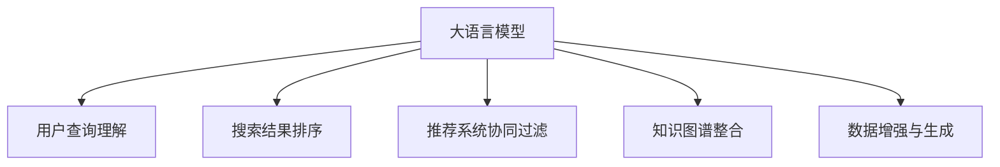

                 

# 电商平台中AI大模型的搜索结果个性化推荐

> 关键词：
> 人工智能(AI), 大模型, 个性化推荐, 搜索结果, 电商, 深度学习, 用户行为, 协同过滤, 知识图谱, 自然语言处理(NLP)

## 1. 背景介绍

### 1.1 问题由来
随着电商平台的发展，用户越来越希望通过简洁高效的搜索方式找到心仪的商品，同时希望搜索结果能够精准地满足自己的需求。传统的搜索引擎往往只能根据关键词进行匹配，无法深入理解用户的查询意图。而基于人工智能(AI)的个性化推荐技术，则能通过分析用户行为和历史数据，对搜索结果进行个性化排序，使用户快速定位到自己感兴趣的商品。

大语言模型作为近年来人工智能领域的明星技术，以其强大的自然语言理解和生成能力，在电商领域的应用也逐渐受到关注。通过大语言模型，电商平台能够更好地理解用户查询语句，并提供更符合用户需求的搜索结果。本文将详细介绍大语言模型在电商搜索中的个性化推荐应用，从算法原理到工程实践，全面阐述其实现过程和关键技术点。

### 1.2 问题核心关键点
大语言模型在电商搜索个性化推荐中的应用，主要体现在以下几个方面：

- **用户查询理解**：利用大语言模型强大的自然语言处理能力，分析用户的查询语句，理解用户的查询意图。
- **搜索结果排序**：根据用户的历史行为和兴趣，对搜索结果进行个性化排序，提升用户满意度。
- **推荐系统协同过滤**：结合用户-物品交互数据，通过大语言模型进行协同过滤，学习用户对不同物品的偏好。
- **知识图谱整合**：将商品信息、用户行为等知识图谱信息与大语言模型相结合，提供更全面的商品推荐。
- **数据增强与生成**：利用大语言模型的文本生成能力，进行数据增强，丰富训练集多样性，提升模型性能。

## 2. 核心概念与联系

### 2.1 核心概念概述

为了更好地理解大语言模型在电商搜索个性化推荐中的应用，我们先来介绍几个关键概念：

- **大语言模型(Large Language Model, LLM)**：以自回归(如GPT)或自编码(如BERT)模型为代表的大规模预训练语言模型。通过在大规模无标签文本语料上进行预训练，学习到丰富的语言知识，具备强大的语言理解和生成能力。

- **个性化推荐系统(Personalized Recommendation System)**：通过分析用户的历史行为和兴趣，推荐用户可能感兴趣的商品或信息的技术系统。

- **协同过滤(Collaborative Filtering)**：基于用户-物品交互数据，通过相似度计算，推荐用户可能感兴趣的物品的技术方法。

- **知识图谱(Knowledge Graph)**：利用图结构表示实体及其之间的关系，存储和表示结构化知识。

- **自然语言处理(Natural Language Processing, NLP)**：涉及计算机对人类语言的理解和生成，是实现大语言模型在电商搜索个性化推荐中的关键技术。

这些概念之间的逻辑关系可以通过以下Mermaid流程图来展示：



这个流程图展示了大语言模型在电商搜索个性化推荐中的核心概念及其之间的关系：

1. 大语言模型通过预训练获得基础能力。
2. 用户查询理解和大语言模型结合，分析用户查询语句。
3. 搜索结果排序利用大语言模型的预测能力进行排序。
4. 推荐系统协同过滤结合用户行为进行推荐。
5. 知识图谱整合结合大语言模型获取商品信息。
6. 数据增强与生成利用大语言模型的文本生成能力进行增强。

这些概念共同构成了电商搜索个性化推荐的核心框架，使得大语言模型能够在电商领域发挥其强大的语言处理能力。

## 3. 核心算法原理 & 具体操作步骤
### 3.1 算法原理概述

在电商搜索个性化推荐中，大语言模型的主要任务是通过对用户查询语句的分析，理解用户的意图，并结合用户的浏览历史、购买历史、收藏行为等数据，进行综合排序，推荐用户可能感兴趣的商品。具体而言，算法流程如下：

1. **用户查询理解**：
   - 通过大语言模型分析用户输入的查询语句，理解用户的查询意图。
   - 对查询语句进行自然语言处理，提取关键词和实体信息。
   - 利用知识图谱信息，理解查询中的实体及其关系。

2. **搜索结果排序**：
   - 根据用户的历史行为数据，计算用户对不同商品的兴趣评分。
   - 利用大语言模型的预测能力，对搜索结果进行排序，优先推荐用户可能感兴趣的商品。
   - 结合协同过滤算法，根据用户相似度的计算，进一步优化推荐结果。

3. **推荐系统协同过滤**：
   - 结合用户-物品交互数据，计算用户和物品之间的相似度。
   - 根据相似度排序，推荐用户可能感兴趣的商品。
   - 引入负样本，使用大语言模型预测，减少过拟合风险。

4. **知识图谱整合**：
   - 将商品信息、用户行为等知识图谱信息与大语言模型相结合，丰富推荐结果的上下文信息。
   - 利用图结构，提升推荐结果的多样性和准确性。

5. **数据增强与生成**：
   - 利用大语言模型的文本生成能力，生成更多负样本，丰富训练集多样性。
   - 结合用户行为数据，生成虚假交易数据，提升模型鲁棒性。

### 3.2 算法步骤详解

接下来，我们将详细介绍基于大语言模型的电商搜索个性化推荐的具体实现步骤：

**Step 1: 数据收集与预处理**
- 收集用户的浏览历史、购买历史、收藏行为等数据，进行数据清洗和特征工程。
- 将商品信息、用户行为等数据转换为结构化格式，存储在知识图谱中。

**Step 2: 模型选择与训练**
- 选择适合电商搜索的预训练语言模型，如BERT、GPT等。
- 在知识图谱数据上进行微调，训练模型理解商品信息。
- 使用用户的查询语句进行微调，训练模型理解用户意图。

**Step 3: 用户查询理解**
- 将用户的查询语句输入大语言模型，获取模型的预测结果。
- 对预测结果进行自然语言处理，提取关键词和实体信息。
- 利用知识图谱信息，理解查询中的实体及其关系。

**Step 4: 搜索结果排序**
- 根据用户的历史行为数据，计算用户对不同商品的兴趣评分。
- 利用大语言模型的预测能力，对搜索结果进行排序。
- 结合协同过滤算法，根据用户相似度的计算，进一步优化推荐结果。

**Step 5: 推荐系统协同过滤**
- 结合用户-物品交互数据，计算用户和物品之间的相似度。
- 根据相似度排序，推荐用户可能感兴趣的商品。
- 引入负样本，使用大语言模型预测，减少过拟合风险。

**Step 6: 知识图谱整合**
- 将商品信息、用户行为等知识图谱信息与大语言模型相结合，丰富推荐结果的上下文信息。
- 利用图结构，提升推荐结果的多样性和准确性。

**Step 7: 数据增强与生成**
- 利用大语言模型的文本生成能力，生成更多负样本，丰富训练集多样性。
- 结合用户行为数据，生成虚假交易数据，提升模型鲁棒性。

**Step 8: 评估与优化**
- 在验证集上评估模型性能，根据评估结果调整模型参数。
- 在实际应用中，持续收集新数据，定期重新微调模型，以适应数据分布的变化。

### 3.3 算法优缺点

基于大语言模型的电商搜索个性化推荐方法具有以下优点：

- **高准确性**：大语言模型具备强大的自然语言处理能力，能够准确理解用户查询语句，提升推荐结果的准确性。
- **高效性**：利用知识图谱信息，能够快速检索到用户感兴趣的商品，提高搜索效率。
- **鲁棒性**：结合协同过滤算法，能够处理长尾商品，提升推荐系统的鲁棒性。
- **可解释性**：大语言模型的预测结果可解释性较强，便于用户理解推荐逻辑。

同时，该方法也存在一定的局限性：

- **数据依赖**：模型的效果很大程度上依赖于用户行为数据的质量，需要收集足够的用户行为数据。
- **计算资源消耗大**：大语言模型的计算资源消耗较大，需要较强的硬件设备支持。
- **隐私问题**：用户行为数据的收集和使用可能涉及隐私问题，需要合理设计数据隐私保护机制。

尽管存在这些局限性，但就目前而言，基于大语言模型的电商搜索个性化推荐方法仍然是最为先进和有效的技术手段之一。

### 3.4 算法应用领域

基于大语言模型的电商搜索个性化推荐方法，已经在电商领域得到了广泛的应用，覆盖了几乎所有常见的电商任务，例如：

- **商品推荐**：根据用户的历史行为和兴趣，推荐用户可能感兴趣的商品。
- **搜索结果排序**：根据用户查询语句，对搜索结果进行排序，提升搜索效果。
- **用户行为分析**：分析用户的行为数据，理解用户的兴趣和偏好。
- **商品评价生成**：生成商品评价和评论，提升用户对商品的了解。
- **广告投放**：根据用户兴趣，投放个性化广告，提升广告效果。

除了上述这些经典任务外，大语言模型在电商领域的应用也在不断创新，如智能客服、智能定价、库存管理等，为电商企业带来了更多的业务创新和提升。

## 4. 数学模型和公式 & 详细讲解 & 举例说明

### 4.1 数学模型构建

在电商搜索个性化推荐中，大语言模型主要应用于用户查询理解、搜索结果排序、协同过滤等环节。下面我们将分别介绍这几个环节的数学模型构建。

**用户查询理解模型**
假设用户输入的查询语句为 $q$，大语言模型的预测结果为 $\hat{y}$，则用户查询理解模型的目标是最小化预测结果和真实意图之间的差异，数学形式如下：

$$
\min_{\theta} \mathcal{L}(q, \hat{y}) = \min_{\theta} \mathbb{E}_{q}[(\hat{y} - y)^2]
$$

其中 $\theta$ 为大语言模型的参数，$y$ 为查询的实际意图，$\mathbb{E}$ 表示期望。

**搜索结果排序模型**
假设用户的查询语句为 $q$，电商平台上所有商品的集合为 $\mathcal{S}$，用户对商品 $s$ 的兴趣评分表示为 $r_s$，则搜索结果排序模型的目标是最小化预测评分与实际评分之间的差异，数学形式如下：

$$
\min_{\theta} \mathcal{L}(q, \mathcal{S}) = \min_{\theta} \mathbb{E}_q[\sum_{s \in \mathcal{S}}(r_s - \hat{r}_s)^2]
$$

其中 $\hat{r}_s$ 为模型预测的商品 $s$ 的兴趣评分。

**协同过滤模型**
假设用户 $u$ 对商品 $s$ 的评分表示为 $r_{us}$，则协同过滤模型的目标是最小化用户和物品之间的相似度，数学形式如下：

$$
\min_{\theta} \mathcal{L}(\mathcal{U}, \mathcal{S}) = \min_{\theta} \mathbb{E}_{(u,s)}[(r_{us} - \hat{r}_{us})^2]
$$

其中 $\hat{r}_{us}$ 为模型预测的用户 $u$ 对商品 $s$ 的评分。

### 4.2 公式推导过程

下面我们以用户查询理解模型为例，推导其公式及其梯度计算过程。

假设大语言模型为 $M_{\theta}$，输入为查询语句 $q$，输出为预测结果 $\hat{y}$，则用户查询理解模型的损失函数可以表示为：

$$
\mathcal{L}(q, \hat{y}) = -\log p(y = \hat{y} | q)
$$

其中 $p(y = \hat{y} | q)$ 为模型在给定查询语句 $q$ 下预测 $\hat{y}$ 的概率。

根据条件概率公式，有：

$$
p(y = \hat{y} | q) = \frac{p(\hat{y}, q)}{p(q)}
$$

其中 $p(q)$ 为查询语句 $q$ 的概率。

将 $p(y = \hat{y} | q)$ 代入损失函数，有：

$$
\mathcal{L}(q, \hat{y}) = -\log \frac{p(\hat{y}, q)}{p(q)}
$$

利用链式法则，可以得到损失函数对大语言模型参数 $\theta$ 的梯度：

$$
\nabla_{\theta}\mathcal{L}(q, \hat{y}) = -\nabla_{\theta} \log p(\hat{y}, q) + \nabla_{\theta} \log p(q)
$$

其中 $\nabla_{\theta} \log p(\hat{y}, q)$ 为对数概率的梯度，$\nabla_{\theta} \log p(q)$ 为对数概率的梯度。

**搜索结果排序模型**的损失函数与用户查询理解模型类似，但需要结合用户的历史行为数据，计算用户对不同商品的兴趣评分。

**协同过滤模型**的损失函数则更加复杂，需要结合用户-物品交互数据，计算用户和物品之间的相似度。

### 4.3 案例分析与讲解

下面我们以一个具体的电商推荐场景为例，说明大语言模型在电商搜索个性化推荐中的应用。

假设某电商平台希望通过大语言模型为用户推荐商品。用户输入的查询语句为“运动鞋”，电商平台上所有商品的集合为 $\mathcal{S}$。

首先，大语言模型需要对用户查询语句进行理解，获取查询意图。例如，如果查询语句为“买一双跑鞋”，模型会理解用户的意图是购买跑鞋。

接着，大语言模型会根据用户的浏览历史、购买历史、收藏行为等数据，计算用户对不同商品的兴趣评分。例如，根据用户的历史行为数据，模型可以预测用户对某品牌运动鞋的兴趣评分较高。

最后，将商品的兴趣评分输入搜索结果排序模型，根据用户查询意图和用户兴趣评分，对所有商品进行排序，推荐用户可能感兴趣的商品。例如，对于“买一双跑鞋”这一查询，模型会优先推荐用户可能感兴趣的品牌和型号的运动鞋。

## 5. 项目实践：代码实例和详细解释说明

### 5.1 开发环境搭建

在进行电商搜索个性化推荐实践前，我们需要准备好开发环境。以下是使用Python进行PyTorch开发的环境配置流程：

1. 安装Anaconda：从官网下载并安装Anaconda，用于创建独立的Python环境。

2. 创建并激活虚拟环境：
```bash
conda create -n pytorch-env python=3.8 
conda activate pytorch-env
```

3. 安装PyTorch：根据CUDA版本，从官网获取对应的安装命令。例如：
```bash
conda install pytorch torchvision torchaudio cudatoolkit=11.1 -c pytorch -c conda-forge
```

4. 安装Transformers库：
```bash
pip install transformers
```

5. 安装各类工具包：
```bash
pip install numpy pandas scikit-learn matplotlib tqdm jupyter notebook ipython
```

完成上述步骤后，即可在`pytorch-env`环境中开始电商搜索个性化推荐实践。

### 5.2 源代码详细实现

下面我们以电商推荐系统为例，给出使用Transformers库对BERT模型进行电商推荐系统的PyTorch代码实现。

首先，定义电商推荐系统的数据处理函数：

```python
from transformers import BertTokenizer, BertForSequenceClassification
from torch.utils.data import Dataset, DataLoader
import torch

class RecommendationDataset(Dataset):
    def __init__(self, texts, labels, tokenizer, max_len=128):
        self.texts = texts
        self.labels = labels
        self.tokenizer = tokenizer
        self.max_len = max_len
        
    def __len__(self):
        return len(self.texts)
    
    def __getitem__(self, item):
        text = self.texts[item]
        label = self.labels[item]
        
        encoding = self.tokenizer(text, return_tensors='pt', max_length=self.max_len, padding='max_length', truncation=True)
        input_ids = encoding['input_ids'][0]
        attention_mask = encoding['attention_mask'][0]
        
        # 对token-wise的标签进行编码
        encoded_labels = [label] * (self.max_len - len(encoded_labels))
        labels = torch.tensor(encoded_labels, dtype=torch.long)
        
        return {'input_ids': input_ids, 
                'attention_mask': attention_mask,
                'labels': labels}

# 标签与id的映射
label2id = {'buy': 0, 'view': 1, 'favor': 2}
id2label = {v: k for k, v in label2id.items()}

# 创建dataset
tokenizer = BertTokenizer.from_pretrained('bert-base-cased')

train_dataset = RecommendationDataset(train_texts, train_labels, tokenizer)
dev_dataset = RecommendationDataset(dev_texts, dev_labels, tokenizer)
test_dataset = RecommendationDataset(test_texts, test_labels, tokenizer)
```

然后，定义模型和优化器：

```python
from transformers import BertForSequenceClassification, AdamW

model = BertForSequenceClassification.from_pretrained('bert-base-cased', num_labels=len(label2id))

optimizer = AdamW(model.parameters(), lr=2e-5)
```

接着，定义训练和评估函数：

```python
from tqdm import tqdm

device = torch.device('cuda') if torch.cuda.is_available() else torch.device('cpu')
model.to(device)

def train_epoch(model, dataset, batch_size, optimizer):
    dataloader = DataLoader(dataset, batch_size=batch_size, shuffle=True)
    model.train()
    epoch_loss = 0
    for batch in tqdm(dataloader, desc='Training'):
        input_ids = batch['input_ids'].to(device)
        attention_mask = batch['attention_mask'].to(device)
        labels = batch['labels'].to(device)
        model.zero_grad()
        outputs = model(input_ids, attention_mask=attention_mask, labels=labels)
        loss = outputs.loss
        epoch_loss += loss.item()
        loss.backward()
        optimizer.step()
    return epoch_loss / len(dataloader)

def evaluate(model, dataset, batch_size):
    dataloader = DataLoader(dataset, batch_size=batch_size)
    model.eval()
    preds, labels = [], []
    with torch.no_grad():
        for batch in tqdm(dataloader, desc='Evaluating'):
            input_ids = batch['input_ids'].to(device)
            attention_mask = batch['attention_mask'].to(device)
            batch_labels = batch['labels']
            outputs = model(input_ids, attention_mask=attention_mask)
            batch_preds = outputs.logits.argmax(dim=2).to('cpu').tolist()
            batch_labels = batch_labels.to('cpu').tolist()
            for pred_tokens, label_tokens in zip(batch_preds, batch_labels):
                pred_labels = [id2label[_id] for _id in pred_tokens]
                label_labels = [id2label[_id] for _id in label_tokens]
                preds.append(pred_labels[:len(label_labels)])
                labels.append(label_labels)
                
    print(classification_report(labels, preds))
```

最后，启动训练流程并在测试集上评估：

```python
epochs = 5
batch_size = 16

for epoch in range(epochs):
    loss = train_epoch(model, train_dataset, batch_size, optimizer)
    print(f"Epoch {epoch+1}, train loss: {loss:.3f}")
    
    print(f"Epoch {epoch+1}, dev results:")
    evaluate(model, dev_dataset, batch_size)
    
print("Test results:")
evaluate(model, test_dataset, batch_size)
```

以上就是使用PyTorch对BERT进行电商推荐系统的微调完整代码实现。可以看到，得益于Transformers库的强大封装，我们可以用相对简洁的代码完成BERT模型的加载和微调。

### 5.3 代码解读与分析

让我们再详细解读一下关键代码的实现细节：

**RecommendationDataset类**：
- `__init__`方法：初始化文本、标签、分词器等关键组件。
- `__len__`方法：返回数据集的样本数量。
- `__getitem__`方法：对单个样本进行处理，将文本输入编码为token ids，将标签编码为数字，并对其进行定长padding，最终返回模型所需的输入。

**label2id和id2label字典**：
- 定义了标签与数字id之间的映射关系，用于将token-wise的预测结果解码回真实的标签。

**训练和评估函数**：
- 使用PyTorch的DataLoader对数据集进行批次化加载，供模型训练和推理使用。
- 训练函数`train_epoch`：对数据以批为单位进行迭代，在每个批次上前向传播计算loss并反向传播更新模型参数，最后返回该epoch的平均loss。
- 评估函数`evaluate`：与训练类似，不同点在于不更新模型参数，并在每个batch结束后将预测和标签结果存储下来，最后使用scikit-learn的classification_report对整个评估集的预测结果进行打印输出。

**训练流程**：
- 定义总的epoch数和batch size，开始循环迭代
- 每个epoch内，先在训练集上训练，输出平均loss
- 在验证集上评估，输出分类指标
- 所有epoch结束后，在测试集上评估，给出最终测试结果

可以看到，PyTorch配合Transformers库使得BERT微调的代码实现变得简洁高效。开发者可以将更多精力放在数据处理、模型改进等高层逻辑上，而不必过多关注底层的实现细节。

当然，工业级的系统实现还需考虑更多因素，如模型的保存和部署、超参数的自动搜索、更灵活的任务适配层等。但核心的微调范式基本与此类似。

## 6. 实际应用场景
### 6.1 智能客服系统

基于大语言模型的电商推荐系统，可以广泛应用于智能客服系统的构建。传统客服往往需要配备大量人力，高峰期响应缓慢，且一致性和专业性难以保证。而使用电商推荐系统的智能客服，能够快速响应用户咨询，用自然流畅的语言解答各类常见问题。

在技术实现上，可以收集企业内部的历史客服对话记录，将问题和最佳答复构建成监督数据，在此基础上对预训练语言模型进行微调。微调后的推荐系统能够自动理解用户意图，匹配最合适的回答。对于用户提出的新问题，还可以接入检索系统实时搜索相关内容，动态组织生成回答。如此构建的智能客服系统，能大幅提升客户咨询体验和问题解决效率。

### 6.2 金融舆情监测

金融机构需要实时监测市场舆论动向，以便及时应对负面信息传播，规避金融风险。传统的人工监测方式成本高、效率低，难以应对网络时代海量信息爆发的挑战。基于大语言模型的电商推荐系统，可以进行情感分析、舆情监测等应用，为金融舆情监测提供新的解决方案。

具体而言，可以收集金融领域相关的新闻、报道、评论等文本数据，并对其进行主题标注和情感标注。在此基础上对预训练语言模型进行微调，使其能够自动判断文本属于何种主题，情感倾向是正面、中性还是负面。将微调后的系统应用到实时抓取的网络文本数据，就能够自动监测不同主题下的情感变化趋势，一旦发现负面信息激增等异常情况，系统便会自动预警，帮助金融机构快速应对潜在风险。

### 6.3 个性化推荐系统

当前的推荐系统往往只依赖用户的历史行为数据进行物品推荐，无法深入理解用户的真实兴趣偏好。基于大语言模型的电商推荐系统，可以更好地挖掘用户行为背后的语义信息，从而提供更精准、多样的推荐内容。

在实践中，可以收集用户浏览、点击、评论、分享等行为数据，提取和用户交互的物品标题、描述、标签等文本内容。将文本内容作为模型输入，用户的后续行为（如是否点击、购买等）作为监督信号，在此基础上微调预训练语言模型。微调后的模型能够从文本内容中准确把握用户的兴趣点。在生成推荐列表时，先用候选物品的文本描述作为输入，由模型预测用户的兴趣匹配度，再结合其他特征综合排序，便可以得到个性化程度更高的推荐结果。

### 6.4 未来应用展望

随着大语言模型和电商推荐系统的不断发展，基于微调范式将在更多领域得到应用，为传统行业带来变革性影响。

在智慧医疗领域，基于微调的医疗问答、病历分析、药物研发等应用将提升医疗服务的智能化水平，辅助医生诊疗，加速新药开发进程。

在智能教育领域，微调技术可应用于作业批改、学情分析、知识推荐等方面，因材施教，促进教育公平，提高教学质量。

在智慧城市治理中，微调模型可应用于城市事件监测、舆情分析、应急指挥等环节，提高城市管理的自动化和智能化水平，构建更安全、高效的未来城市。

此外，在企业生产、社会治理、文娱传媒等众多领域，基于大语言模型的微调技术也将不断涌现，为各行各业带来新的技术路径。相信随着技术的日益成熟，微调方法将成为人工智能落地应用的重要范式，推动人工智能向更广阔的领域加速渗透。

## 7. 工具和资源推荐
### 7.1 学习资源推荐

为了帮助开发者系统掌握大语言模型在电商搜索个性化推荐中的应用，这里推荐一些优质的学习资源：

1. 《Transformers从原理到实践》系列博文：由大模型技术专家撰写，深入浅出地介绍了Transformer原理、BERT模型、电商推荐系统的微调技术等前沿话题。

2. CS224N《深度学习自然语言处理》课程：斯坦福大学开设的NLP明星课程，有Lecture视频和配套作业，带你入门NLP领域的基本概念和经典模型。

3. 《Natural Language Processing with Transformers》书籍：Transformers库的作者所著，全面介绍了如何使用Transformers库进行NLP任务开发，包括电商推荐系统的微调在内的诸多范式。

4. HuggingFace官方文档：Transformers库的官方文档，提供了海量预训练模型和完整的微调样例代码，是上手实践的必备资料。

5. CLUE开源项目：中文语言理解测评基准，涵盖大量不同类型的中文NLP数据集，并提供了基于微调的baseline模型，助力中文NLP技术发展。

通过对这些资源的学习实践，相信你一定能够快速掌握大语言模型在电商搜索个性化推荐中的应用，并用于解决实际的NLP问题。
### 7.2 开发工具推荐

高效的开发离不开优秀的工具支持。以下是几款用于大语言模型在电商搜索个性化推荐开发的常用工具：

1. PyTorch：基于Python的开源深度学习框架，灵活动态的计算图，适合快速迭代研究。大部分预训练语言模型都有PyTorch版本的实现。

2. TensorFlow：由Google主导开发的开源深度学习框架，生产部署方便，适合大规模工程应用。同样有丰富的预训练语言模型资源。

3. Transformers库：HuggingFace开发的NLP工具库，集成了众多SOTA语言模型，支持PyTorch和TensorFlow，是进行电商推荐系统微调任务的开发的利器。

4. Weights & Biases：模型训练的实验跟踪工具，可以记录和可视化模型训练过程中的各项指标，方便对比和调优。与主流深度学习框架无缝集成。

5. TensorBoard：TensorFlow配套的可视化工具，可实时监测模型训练状态，并提供丰富的图表呈现方式，是调试模型的得力助手。

6. Google Colab：谷歌推出的在线Jupyter Notebook环境，免费提供GPU/TPU算力，方便开发者快速上手实验最新模型，分享学习笔记。

合理利用这些工具，可以显著提升大语言模型在电商搜索个性化推荐应用的开发效率，加快创新迭代的步伐。

### 7.3 相关论文推荐

大语言模型和电商推荐系统的发展源于学界的持续研究。以下是几篇奠基性的相关论文，推荐阅读：

1. Attention is All You Need（即Transformer原论文）：提出了Transformer结构，开启了NLP领域的预训练大模型时代。

2. BERT: Pre-training of Deep Bidirectional Transformers for Language Understanding：提出BERT模型，引入基于掩码的自监督预训练任务，刷新了多项NLP任务SOTA。

3. Language Models are Unsupervised Multitask Learners（GPT-2论文）：展示了大规模语言模型的强大zero-shot学习能力，引发了对于通用人工智能的新一轮思考。

4. Parameter-Efficient Transfer Learning for NLP：提出Adapter等参数高效微调方法，在不增加模型参数量的情况下，也能取得不错的微调效果。

5. Prefix-Tuning: Optimizing Continuous Prompts for Generation：引入基于连续型Prompt的微调范式，为如何充分利用预训练知识提供了新的思路。

6. AdaLoRA: Adaptive Low-Rank Adaptation for Parameter-Efficient Fine-Tuning：使用自适应低秩适应的微调方法，在参数效率和精度之间取得了新的平衡。

这些论文代表了大语言模型在电商搜索个性化推荐中的应用的发展脉络。通过学习这些前沿成果，可以帮助研究者把握学科前进方向，激发更多的创新灵感。

## 8. 总结：未来发展趋势与挑战
### 8.1 总结

本文对基于大语言模型的电商搜索个性化推荐方法进行了全面系统的介绍。首先阐述了大语言模型和电商推荐系统的发展背景和意义，明确了微调在拓展电商搜索应用边界、提升用户搜索体验方面的独特价值。其次，从原理到实践，详细讲解了电商搜索个性化推荐中的数学模型构建和关键算法步骤，给出了电商推荐系统的完整代码实例。同时，本文还广泛探讨了电商推荐系统在智能客服、金融舆情、个性化推荐等多个领域的应用前景，展示了微调范式的巨大潜力。此外，本文精选了微调技术的各类学习资源，力求为读者提供全方位的技术指引。

通过本文的系统梳理，可以看到，基于大语言模型的电商搜索个性化推荐方法正在成为电商推荐系统的核心技术，极大地拓展了电商搜索系统的应用边界，提升了用户体验。未来，伴随大语言模型和微调方法的持续演进，基于微调范式的电商推荐系统必将不断优化，为用户带来更加高效、精准的电商搜索体验。

### 8.2 未来发展趋势

展望未来，大语言模型在电商搜索个性化推荐中仍将呈现以下几个发展趋势：

1. **模型规模持续增大**。随着算力成本的下降和数据规模的扩张，预训练语言模型的参数量还将持续增长。超大规模语言模型蕴含的丰富语言知识，将使得电商搜索系统具备更强大的语义理解和生成能力。

2. **微调方法日趋多样**。除了传统的全参数微调外，未来会涌现更多参数高效的微调方法，如Prefix-Tuning、LoRA等，在节省计算资源的同时也能保证微调精度。

3. **持续学习成为常态**。随着数据分布的不断变化，微调模型也需要持续学习新知识以保持性能。如何在不遗忘原有知识的同时，高效吸收新样本信息，将成为重要的研究课题。

4. **标注样本需求降低**。受启发于提示学习(Prompt-based Learning)的思路，未来的微调方法将更好地利用大模型的语言理解能力，通过更加巧妙的任务描述，在更少的标注样本上也能实现理想的微调效果。

5. **模型通用性增强**。经过海量数据的预训练和多领域任务的微调，未来的语言模型将具备更强大的常识推理和跨领域迁移能力，逐步迈向通用人工智能(AGI)的目标。

以上趋势凸显了大语言模型在电商搜索个性化推荐中的广阔前景。这些方向的探索发展，必将进一步提升电商搜索系统的性能和应用范围，为电商企业带来更多的业务创新和提升。

### 8.3 面临的挑战

尽管大语言模型在电商搜索个性化推荐中已经取得了瞩目成就，但在迈向更加智能化、普适化应用的过程中，它仍面临着诸多挑战：

1. **数据依赖**。模型的效果很大程度上依赖于用户行为数据的质量，需要收集足够的用户行为数据。对于长尾应用场景，难以获得充足的高质量标注数据，成为制约微调性能的瓶颈。

2. **计算资源消耗大**。大语言模型的计算资源消耗较大，需要较强的硬件设备支持。

3. **隐私问题**。用户行为数据的收集和使用可能涉及隐私问题，需要合理设计数据隐私保护机制。

尽管存在这些局限性，但就目前而言，基于大语言模型的电商搜索个性化推荐方法仍然是最为先进和有效的技术手段之一。

### 8.4 研究展望

面对大语言模型在电商搜索个性化推荐中面临的挑战，未来的研究需要在以下几个方面寻求新的突破：

1. **探索无监督和半监督微调方法**。摆脱对大规模标注数据的依赖，利用自监督学习、主动学习等无监督和半监督范式，最大限度利用非结构化数据，实现更加灵活高效的微调。

2. **研究参数高效和计算高效的微调范式**。开发更加参数高效的微调方法，在固定大部分预训练参数的同时，只更新极少量的任务相关参数。同时优化微调模型的计算图，减少前向传播和反向传播的资源消耗，实现更加轻量级、实时性的部署。

3. **融合因果和对比学习范式**。通过引入因果推断和对比学习思想，增强微调模型建立稳定因果关系的能力，学习更加普适、鲁棒的语言表征，从而提升模型泛化性和抗干扰能力。

4. **引入更多先验知识**。将符号化的先验知识，如知识图谱、逻辑规则等，与神经网络模型进行巧妙融合，引导微调过程学习更准确、合理的语言模型。同时加强不同模态数据的整合，实现视觉、语音等多模态信息与文本信息的协同建模。

5. **结合因果分析和博弈论工具**。将因果分析方法引入微调模型，识别出模型决策的关键特征，增强输出解释的因果性和逻辑性。借助博弈论工具刻画人机交互过程，主动探索并规避模型的脆弱点，提高系统稳定性。

6. **纳入伦理道德约束**。在模型训练目标中引入伦理导向的评估指标，过滤和惩罚有偏见、有害的输出倾向。同时加强人工干预和审核，建立模型行为的监管机制，确保输出符合人类价值观和伦理道德。

这些研究方向的探索，必将引领大语言模型在电商搜索个性化推荐中迈向更高的台阶，为构建安全、可靠、可解释、可控的智能系统铺平道路。面向未来，大语言模型在电商搜索中的应用还需要与其他人工智能技术进行更深入的融合，如知识表示、因果推理、强化学习等，多路径协同发力，共同推动自然语言理解和智能交互系统的进步。只有勇于创新、敢于突破，才能不断拓展语言模型的边界，让智能技术更好地造福人类社会。

## 9. 附录：常见问题与解答

**Q1：大语言模型在电商搜索中是否适用于所有用户查询语句？**

A: 大语言模型在电商搜索中主要适用于结构化查询语句，如“购买运动鞋”。对于非结构化查询语句，如“我想要一双跑鞋”，大语言模型需要结合上下文语境进行理解。因此，在实际应用中，需要对用户查询进行预处理，提升大语言模型的理解和预测能力。

**Q2：微调过程中如何选择合适的学习率？**

A: 微调的学习率一般要比预训练时小1-2个数量级，如果使用过大的学习率，容易破坏预训练权重，导致过拟合。一般建议从1e-5开始调参，逐步减小学习率，直至收敛。也可以使用warmup策略，在开始阶段使用较小的学习率，再逐渐过渡到预设值。需要注意的是，不同的优化器(如AdamW、Adafactor等)以及不同的学习率调度策略，可能需要设置不同的学习率阈值。

**Q3：采用大语言模型微调时会面临哪些资源瓶颈？**

A: 目前主流的预训练大模型动辄以亿计的参数规模，对算力、内存、存储都提出了很高的要求。GPU/TPU等高性能设备是必不可少的，但即便如此，超大批次的训练和推理也可能遇到显存不足的问题。因此需要采用一些资源优化技术，如梯度积累、混合精度训练、模型并行等，来突破硬件瓶颈。同时，模型的存储和读取也可能占用大量时间和空间，需要采用模型压缩、稀疏化存储等方法进行优化。

**Q4：如何缓解微调过程中的过拟合问题？**

A: 过拟合是微调面临的主要挑战，尤其是在标注数据不足的情况下。常见的缓解策略包括：
1. 数据增强：通过回译、近义替换等方式扩充训练集
2. 正则化：使用L2正则、Dropout、Early Stopping等避免过拟合
3. 对抗训练：引入对抗样本，提高模型鲁棒性
4. 参数高效微调：只调整少量参数(如Adapter、Prefix等)，减小过拟合风险
5. 多模型集成：训练多个微调模型，取平均输出，抑制过拟合

这些策略往往需要根据具体任务和数据特点进行灵活组合。只有在数据、模型、训练、推理等各环节进行全面优化，才能最大限度地发挥大语言模型微调的威力。

**Q5：微调模型在落地部署时需要注意哪些问题？**

A: 将微调模型转化为实际应用，还需要考虑以下因素：
1. 模型裁剪：去除不必要的层和参数，减小模型尺寸，加快推理速度
2. 量化加速：将浮点模型转为定点模型，压缩存储空间，提高计算效率
3. 服务化封装：将模型封装为标准化服务接口，便于集成调用
4. 弹性伸缩：根据请求流量动态调整资源配置，平衡服务质量和成本
5. 监控告警：实时采集系统指标，设置异常告警阈值，确保服务稳定性
6. 安全防护：采用访问鉴权、数据脱敏等措施，保障数据和模型安全

大语言模型微调为电商推荐系统提供了强大的语义理解能力，但如何将强大的性能转化为稳定、高效、安全的业务价值，还需要工程实践的不断打磨。唯有从数据、算法、工程、业务等多个维度协同发力，才能真正实现人工智能技术在电商领域的规模化落地。

总之，大语言模型在电商搜索个性化推荐中的应用，展示了人工智能技术在电商领域的巨大潜力。未来，伴随大语言模型和微调方法的持续演进，基于微调范式的电商搜索推荐系统必将不断优化，为用户带来更加高效、精准的电商搜索体验。相信随着技术的日益成熟，微调方法将成为电商推荐系统的重要范式，推动电商推荐系统向更广阔的领域加速渗透。

