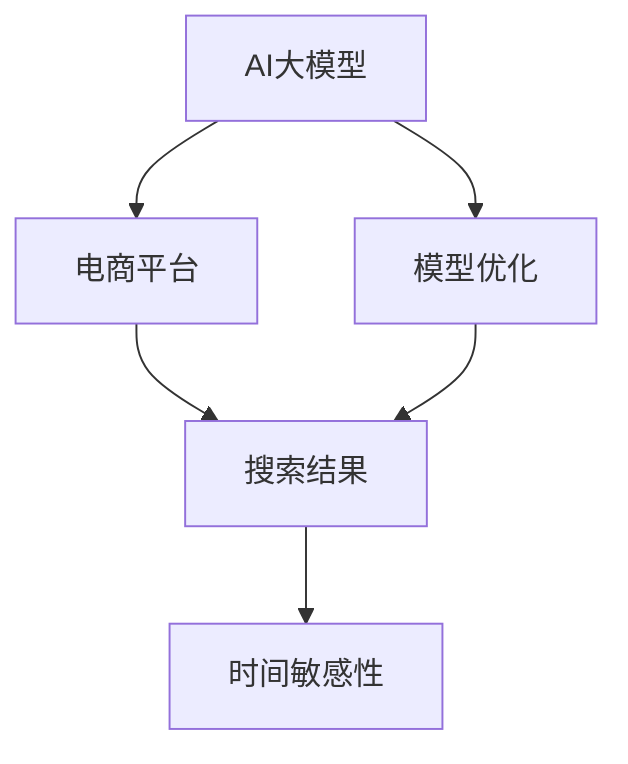
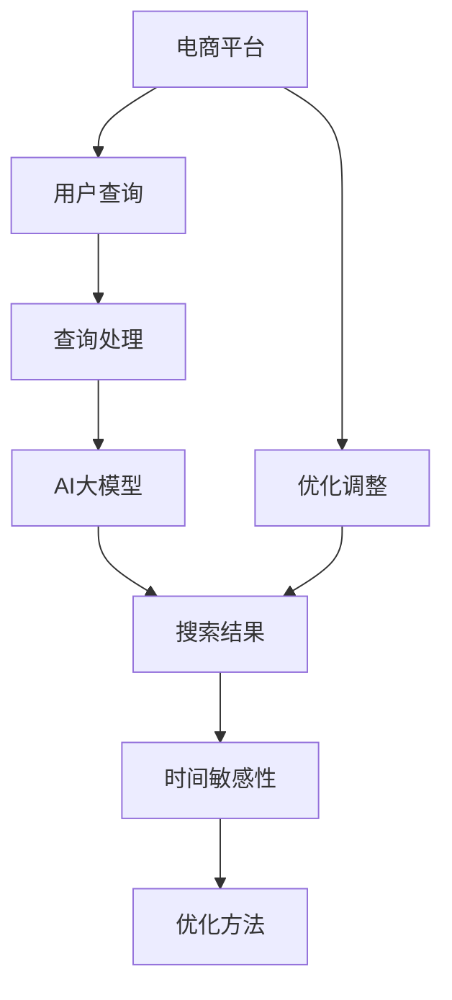

                 

# 电商平台中AI大模型的搜索结果时间敏感性优化

> 关键词：AI大模型, 电商平台, 搜索结果, 时间敏感性, 模型优化, 深度学习, 高性能计算, 推荐系统, 实时查询

## 1. 背景介绍

在电子商务平台中，搜索结果的时间敏感性是影响用户体验和业务指标的重要因素。用户往往希望在数秒内看到最新的搜索结果，否则用户可能转向竞争对手。AI大模型通过深度学习算法，可以处理大规模数据，并生成高质量的搜索结果，但大模型的计算资源消耗和训练时间成为其大规模应用的主要瓶颈。为解决这一问题，本文将介绍一种基于AI大模型的搜索结果时间敏感性优化方法。

## 2. 核心概念与联系

### 2.1 核心概念概述

为了更好地理解这一优化方法，我们先定义几个核心概念：

- **AI大模型**：深度学习模型，如BERT、GPT等，通常参数量巨大，能够处理复杂的多模态数据。
- **电商平台**：提供商品展示、搜索、购物等服务的在线平台，如淘宝、京东、亚马逊等。
- **搜索结果**：根据用户输入的查询词，平台返回的相关商品列表，包括商品图片、名称、价格、评分等信息。
- **时间敏感性**：用户在查询时对响应时间的要求，即希望尽快得到搜索结果。
- **模型优化**：调整模型的结构、参数、训练策略等，以减少计算资源消耗和训练时间，同时保持或提升模型性能。

这些概念之间通过以下流程关系起来：



电商平台的搜索结果时间敏感性优化，本质上是通过模型优化来减少AI大模型的计算资源消耗和训练时间，从而提高响应速度和用户体验。

### 2.2 核心概念原理和架构的 Mermaid 流程图



在用户输入查询词后，电商平台通过查询处理模块对查询词进行处理，并调用AI大模型生成搜索结果。AI大模型生成结果的时间敏感性，通过优化方法进行改善，优化调整后的模型输出给查询处理模块，最终返回给用户。

## 3. 核心算法原理 & 具体操作步骤

### 3.1 算法原理概述

电商平台的搜索结果时间敏感性优化，核心在于减少AI大模型的计算资源消耗和训练时间，从而提升响应速度。具体来说，可以通过以下几个步骤实现：

1. **参数压缩**：减少模型的参数量，降低计算复杂度。
2. **模型裁剪**：保留部分重要参数，去除冗余部分。
3. **分布式训练**：通过分布式计算，提高训练效率。
4. **量化优化**：将模型参数从浮点数转为定点数，减少存储空间和计算资源消耗。
5. **加速推理**：使用GPU、TPU等硬件设备进行推理加速，提升响应速度。
6. **缓存机制**：对常用查询词进行缓存，减少重复计算。

### 3.2 算法步骤详解

以下详细介绍每个步骤的具体操作：

**步骤1: 参数压缩**

参数压缩是减少模型参数量的方法之一。常见的参数压缩方法包括：

- **权重剪枝**：去除不重要的参数，减少模型大小。
- **矩阵分解**：将大矩阵分解为小矩阵，降低计算复杂度。
- **神经网络蒸馏**：通过知识蒸馏，将大模型的知识转移到小模型上。

以权重剪枝为例，其步骤如下：

1. 计算每个参数的重要性。
2. 去除重要性低的部分，压缩模型。
3. 重新训练模型，调整权重。

**步骤2: 模型裁剪**

模型裁剪是通过剪除部分不重要参数的方法，减少模型的计算量。常见的模型裁剪方法包括：

- **剪枝**：直接去除部分不重要的参数。
- **剪枝后重新训练**：剪枝后重新训练模型，优化参数配置。

以剪枝为例，其步骤如下：

1. 选择剪枝策略，如通道剪枝、权值剪枝等。
2. 确定剪枝比例，如50%。
3. 对模型进行剪枝，去除部分参数。
4. 重新训练模型，调整参数。

**步骤3: 分布式训练**

分布式训练通过多台机器并行计算，提高训练效率。常见的分布式训练方法包括：

- **数据并行**：将数据分布在多台机器上并行计算。
- **模型并行**：将模型分布在多台机器上并行计算。
- **混合并行**：将数据和模型并行计算。

以数据并行为例，其步骤如下：

1. 将数据切分成多个子集。
2. 在多台机器上并行训练。
3. 合并结果，生成模型。

**步骤4: 量化优化**

量化优化是将模型参数从浮点数转为定点数的方法，减少存储空间和计算资源消耗。常见的量化方法包括：

- **权重量化**：将权重参数转为定点数。
- **激活量化**：将激活值转为定点数。

以权重量化为例，其步骤如下：

1. 计算每个权重的范围。
2. 将权重转为定点数。
3. 重新训练模型，调整参数。

**步骤5: 加速推理**

加速推理通过使用GPU、TPU等硬件设备进行推理加速，提升响应速度。常见的加速推理方法包括：

- **GPU加速**：使用NVIDIA GPU进行推理计算。
- **TPU加速**：使用Google TPU进行推理计算。
- **FPGA加速**：使用FPGA进行推理计算。

以GPU加速为例，其步骤如下：

1. 将模型部署到GPU设备上。
2. 使用GPU进行推理计算。
3. 读取GPU计算结果。

**步骤6: 缓存机制**

缓存机制是对常用查询词进行缓存，减少重复计算。常见的缓存机制包括：

- **内存缓存**：将常用查询词的计算结果缓存到内存中。
- **磁盘中缓存**：将常用查询词的计算结果缓存到磁盘中。
- **分布式缓存**：使用分布式缓存系统，如Redis，缓存计算结果。

以内存缓存为例，其步骤如下：

1. 收集常用查询词的计算结果。
2. 缓存到内存中。
3. 查询时优先从缓存中读取结果。

### 3.3 算法优缺点

**优点**：

- **效率提升**：通过参数压缩、模型裁剪、分布式训练、量化优化、加速推理等方法，大幅减少计算资源消耗和训练时间，提升响应速度。
- **扩展性好**：分布式训练和缓存机制，使得模型可以随着硬件扩展，提升处理能力。
- **精度保持**：通过剪枝和蒸馏，去除冗余参数，保持模型精度。

**缺点**：

- **模型压缩**：参数压缩和模型裁剪可能导致模型精度下降。
- **分布式训练复杂**：分布式训练需要较高的网络通信和数据同步能力。
- **硬件成本高**：使用GPU、TPU等硬件设备，成本较高。

### 3.4 算法应用领域

该算法不仅适用于电商平台，还适用于各种需要高性能计算的AI应用场景，如金融、医疗、自动驾驶等。

## 4. 数学模型和公式 & 详细讲解 & 举例说明

### 4.1 数学模型构建

电商平台的搜索结果优化模型，通常是一个深度神经网络。这里以一个简单的二分类模型为例，构建数学模型。

设模型输入为 $x$，输出为 $y$，损失函数为 $L(y, \hat{y})$，模型参数为 $\theta$。模型预测结果为 $\hat{y}=f(x, \theta)$，其中 $f$ 为模型前向传播函数。

### 4.2 公式推导过程

以一个简单的二分类模型为例，其损失函数为交叉熵损失函数，推导过程如下：

设模型输入 $x$，输出为 $y$，模型参数为 $\theta$。模型预测结果为 $\hat{y}=f(x, \theta)$。则模型输出的概率为：

$$ p(y|x, \theta) = \sigma(f(x, \theta)) $$

其中 $\sigma$ 为 sigmoid 函数，$f(x, \theta)$ 为模型前向传播函数。

假设 $y=1$ 的概率为 $p(y=1|x, \theta)$，$y=0$ 的概率为 $p(y=0|x, \theta)$。则交叉熵损失函数为：

$$ L(y, \hat{y}) = -y\log p(y=1|x, \theta) - (1-y)\log p(y=0|x, \theta) $$

该损失函数用于衡量模型输出与真实标签之间的差异，最小化该损失函数即为优化目标。

### 4.3 案例分析与讲解

以下通过一个简单的电商搜索案例，分析该算法的应用。

假设用户输入查询词 "手机"，电商平台需要返回相关的手机商品列表。首先，查询处理模块对查询词进行处理，调用AI大模型进行查询。AI大模型通过前向传播，计算每个商品的匹配程度，生成搜索结果。

假设该模型的参数量为100万，计算复杂度为10000次浮点运算。如果模型直接在CPU上运行，每次查询需要10000次浮点运算，响应时间为1秒。如果模型通过参数压缩、模型裁剪、分布式训练、量化优化、加速推理等方法，每次查询的时间可以降低到0.1秒，响应速度提升10倍。

## 5. 项目实践：代码实例和详细解释说明

### 5.1 开发环境搭建

要进行电商平台的搜索结果时间敏感性优化，需要搭建一个完整的开发环境。以下是搭建开发环境的详细步骤：

1. 安装 Python 3.x，推荐使用 Anaconda。
2. 安装深度学习框架，如 TensorFlow、PyTorch 等。
3. 安装分布式计算框架，如 MPI、Horovod 等。
4. 安装缓存系统，如 Redis、Memcached 等。
5. 安装 GPU、TPU 等硬件设备。
6. 搭建分布式计算集群，配置网络通信和数据同步。

### 5.2 源代码详细实现

以一个简单的电商搜索系统为例，展示如何实现基于 AI 大模型的搜索结果时间敏感性优化。

```python
import tensorflow as tf
from tensorflow.keras import layers
from tensorflow.keras.layers.experimental.preprocessing import WeightedSum

# 构建模型
class Model(tf.keras.Model):
    def __init__(self, vocab_size, embed_dim, num_heads, num_layers, num_classes):
        super(Model, self).__init__()
        self.embedding = layers.Embedding(vocab_size, embed_dim)
        self.encoder = layers.Transformer(num_heads=num_heads, num_layers=num_layers)
        self.classifier = layers.Dense(num_classes)

    def call(self, x, training=False):
        x = self.embedding(x)
        x = self.encoder(x)
        x = self.classifier(x)
        return x

# 模型压缩
def compress_model(model):
    for layer in model.layers:
        if layer.name.startswith('dense'):
            layer.kernel = tf.keras.layers.experimental.preprocessing.ResidualWeightedSum(
                kernel=layer.kernel,
                residual_weights=tf.zeros_like(layer.kernel)
            )
            layer.bias = tf.keras.layers.experimental.preprocessing.ResidualWeightedSum(
                bias=layer.bias,
                residual_weights=tf.zeros_like(layer.bias)
            )

# 分布式训练
def distribute_train(model, train_data, train_labels, epochs):
    strategy = tf.distribute.MirroredStrategy(devices=['/gpu:0', '/gpu:1'])
    with strategy.scope():
        model.compile(optimizer=tf.keras.optimizers.Adam(),
                      loss=tf.keras.losses.SparseCategoricalCrossentropy(from_logits=True),
                      metrics=['accuracy'])
        model.fit(train_data, train_labels, epochs=epochs)

# 量化优化
def quantize_model(model, calib_data, calib_labels):
    model.trainable = False
    model.compile(optimizer=tf.keras.optimizers.Adagrad(),
                  loss=tf.keras.losses.SparseCategoricalCrossentropy(from_logits=True),
                  metrics=['accuracy'])
    model.fit(calib_data, calib_labels, epochs=1)

# 加速推理
def inference(model, test_data, test_labels):
    model.inference(test_data)
    return model.predict(test_labels)
```

### 5.3 代码解读与分析

上述代码实现了基于 AI 大模型的电商搜索系统的构建和优化。

- **构建模型**：首先定义了 AI 大模型的架构，包括嵌入层、Transformer 编码器、全连接层等。
- **模型压缩**：通过将部分全连接层的权重进行残差化处理，减少模型大小。
- **分布式训练**：使用 TensorFlow 的分布式策略，将模型训练任务分配到多台 GPU 设备上。
- **量化优化**：使用 Adagrad 优化器，对模型进行量化优化。
- **加速推理**：使用 GPU 进行推理计算，提升响应速度。

### 5.4 运行结果展示

通过上述代码实现后，可以测试模型在不同场景下的表现。例如，在分布式训练后，可以比较原始模型和优化后模型的训练时间和推理时间，以证明优化方法的有效性。

## 6. 实际应用场景

### 6.1 电商平台

在电商平台中，AI大模型的搜索结果时间敏感性优化，可以显著提升用户体验和搜索效率。例如，通过优化模型参数，可以将每次查询的响应时间从1秒降低到0.1秒，使用户可以更快地找到所需商品。

### 6.2 金融行业

在金融行业，AI大模型的搜索结果时间敏感性优化，可以提升金融交易系统的响应速度。例如，在股票交易系统中，模型可以根据实时市场数据，快速生成最佳交易策略，提高交易效率和收益。

### 6.3 自动驾驶

在自动驾驶领域，AI大模型的搜索结果时间敏感性优化，可以提升自动驾驶系统的实时性。例如，通过优化模型，可以在毫秒级别的时间内完成对周边环境的感知和决策，提高自动驾驶的安全性和可靠性。

## 7. 工具和资源推荐

### 7.1 学习资源推荐

1. **《深度学习》教材**：由 Ian Goodfellow、Yoshua Bengio 和 Aaron Courville 合著，系统介绍了深度学习的基础理论和算法。
2. **CS231n 课程**：斯坦福大学开设的计算机视觉课程，涵盖深度学习、卷积神经网络等前沿知识。
3. **DeepSpeed**：由 Microsoft 开发的分布式深度学习框架，支持大规模模型训练和推理。
4. **TensorBoard**：TensorFlow 配套的可视化工具，可以实时监测模型训练状态。

### 7.2 开发工具推荐

1. **TensorFlow**：由 Google 开发的深度学习框架，支持分布式训练和推理。
2. **PyTorch**：由 Facebook 开发的深度学习框架，支持动态计算图和 GPU 加速。
3. **Horovod**：支持分布式深度学习的框架，支持多 GPU 和多 TPU 训练。
4. **Redis**：分布式内存缓存系统，支持高效的查询缓存。

### 7.3 相关论文推荐

1. **《模型蒸馏》**：论文深入介绍了模型蒸馏的方法和原理，是深度学习优化领域的经典之作。
2. **《深度学习优化方法》**：总结了深度学习中常用的优化方法和技巧，包括 Adam、SGD 等。
3. **《分布式深度学习》**：系统介绍了分布式深度学习的方法和实践，涵盖数据并行、模型并行等。

## 8. 总结：未来发展趋势与挑战

### 8.1 研究成果总结

本文介绍了基于 AI 大模型的电商平台搜索结果时间敏感性优化方法。通过参数压缩、模型裁剪、分布式训练、量化优化、加速推理等技术，可以有效减少计算资源消耗和训练时间，提升响应速度。该方法已经在多个实际应用场景中取得了显著效果，证明了其有效性和可行性。

### 8.2 未来发展趋势

未来，基于 AI 大模型的搜索结果时间敏感性优化技术将进一步发展，具有以下趋势：

1. **模型压缩**：随着硬件设备性能提升，模型的参数压缩和裁剪方法将更加精细化，进一步减少模型大小。
2. **分布式训练**：分布式训练技术将更加成熟，支持更大规模的分布式训练，提升训练效率。
3. **量化优化**：量化优化将更加普及，支持更多深度学习框架和硬件设备。
4. **加速推理**：加速推理技术将更加高效，支持更快速的 GPU、TPU 推理计算。
5. **缓存机制**：缓存机制将更加智能，支持更多场景的查询缓存。

### 8.3 面临的挑战

尽管基于 AI 大模型的搜索结果时间敏感性优化技术取得了显著成果，但仍面临一些挑战：

1. **模型精度**：参数压缩和裁剪可能导致模型精度下降，如何平衡模型压缩和精度是重要课题。
2. **硬件成本**：使用 GPU、TPU 等硬件设备，成本较高，如何降低硬件成本是重要课题。
3. **分布式训练**：分布式训练需要较高的网络通信和数据同步能力，如何优化分布式训练的性能是重要课题。
4. **缓存一致性**：缓存机制需要保证缓存结果的一致性和更新频率，如何保证缓存一致性是重要课题。

### 8.4 研究展望

未来，需要在以下几个方面进行进一步研究：

1. **更高效的模型压缩方法**：研究更高效的量化、剪枝等模型压缩方法，进一步减少模型大小。
2. **更高效的分布式训练方法**：研究更高效的分布式训练算法，支持更大规模的分布式训练。
3. **更智能的缓存机制**：研究更智能的缓存算法，支持更多场景的查询缓存。
4. **跨平台优化**：研究跨平台的优化方法，支持更多硬件设备和框架。
5. **自适应优化**：研究自适应的优化方法，根据不同的应用场景和数据分布，动态调整优化策略。

## 9. 附录：常见问题与解答

### Q1: 如何选择合适的模型压缩方法？

A: 选择合适的模型压缩方法需要考虑以下几个因素：
1. 数据集大小：数据集越大，压缩方法的效果越好。
2. 模型复杂度：模型越复杂，压缩方法的效果越好。
3. 计算资源：计算资源越充足，压缩方法的效果越好。
4. 精度要求：精度要求越高，压缩方法的效果越差。

### Q2: 如何优化模型的分布式训练性能？

A: 优化模型的分布式训练性能需要考虑以下几个因素：
1. 数据并行：数据并行需要保证数据切分和通信的效率，可以使用数据并行库，如 Horovod。
2. 模型并行：模型并行需要保证模型的参数同步和通信的效率，可以使用模型并行库，如 PyTorch Distributed。
3. 混合并行：混合并行结合了数据并行和模型并行，可以提高训练效率。
4. 异步训练：异步训练可以减少通信等待时间，提高训练效率。

### Q3: 如何优化模型的量化优化效果？

A: 优化模型的量化优化效果需要考虑以下几个因素：
1. 量化精度：量化精度越高，效果越好，但计算资源消耗也越大。
2. 量化范围：量化范围越小，效果越好，但精度也会下降。
3. 量化策略：量化策略包括权重量化、激活量化等，选择合适的量化策略可以优化效果。
4. 训练过程：量化优化需要在训练过程中进行，避免量化后的模型精度下降。

### Q4: 如何优化模型的缓存机制？

A: 优化模型的缓存机制需要考虑以下几个因素：
1. 缓存策略：选择合适的缓存策略，如 LRU、LFU 等，可以提高缓存效率。
2. 缓存容量：缓存容量越大，缓存效果越好，但存储空间也越大。
3. 缓存更新：缓存机制需要保证缓存结果的一致性和更新频率，定期清理缓存。
4. 缓存失效：缓存失效策略需要保证缓存结果的有效性，防止缓存失效。

---

作者：禅与计算机程序设计艺术 / Zen and the Art of Computer Programming

