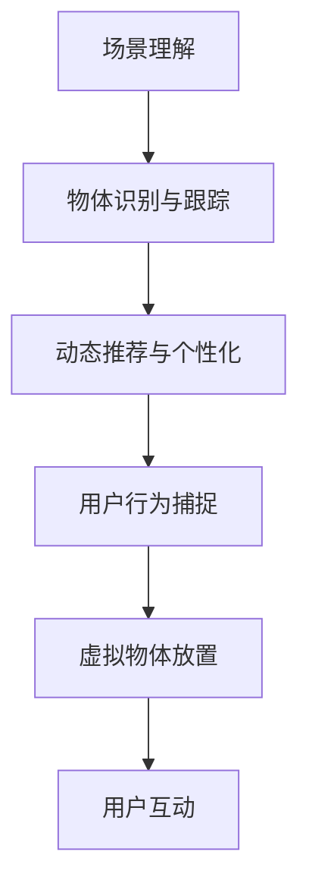
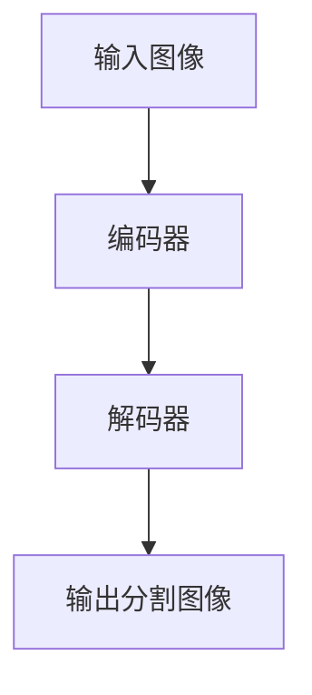

                 

# 电商平台中的增强现实（AR）商品展示技术

> 关键词：增强现实（AR）, 电商平台, 商品展示, 虚拟试穿, 用户互动, 动态优化, 边缘计算, 深度学习

## 1. 背景介绍

### 1.1 问题由来
随着电商平台的兴起和数字化消费模式的普及，消费者对购物体验的期望越来越高。传统的产品图片、文字描述等静态展示方式已难以满足消费者追求新奇、真实、沉浸式购物体验的需求。增强现实（AR）技术因其独特的沉浸式和互动性，在提升购物体验、促进产品销售方面展现了巨大的潜力。

电商平台纷纷将AR技术引入产品展示，如虚拟试穿、虚拟家具摆放等，通过增强现实技术，让用户直观地看到商品的真实使用场景和效果。然而，要在电商平台上大规模部署AR技术，仍面临诸多技术挑战。例如，如何高效地渲染和传输AR内容，如何实时捕捉用户行为并进行个性化推荐，以及如何在用户设备上实现无缝的AR体验。

### 1.2 问题核心关键点
在电商平台的商品展示场景中，增强现实技术的核心关键点包括：
1. **高效的AR内容渲染与传输**：确保AR内容能够在不同设备和网络环境下快速加载和渲染。
2. **实时用户行为捕捉与分析**：通过传感器捕捉用户动作，实时调整AR展示效果。
3. **个性化推荐与互动**：根据用户行为和偏好，动态生成个性化推荐和互动内容。
4. **跨平台兼容性**：保证AR体验在移动、PC等不同平台上的一致性和流畅性。
5. **数据隐私与安全**：确保用户数据的安全和隐私保护，避免数据泄露和滥用。

这些关键点涉及计算机图形学、深度学习、数据处理、用户体验设计等多个领域，综合了计算机视觉、自然语言处理、交互设计等多项技术，是电商平台中AR商品展示技术实现的基础。

## 2. 核心概念与联系

### 2.1 核心概念概述

为更好地理解电商平台的增强现实（AR）商品展示技术，本节将介绍几个密切相关的核心概念：

- **增强现实（AR）**：一种将虚拟信息叠加在现实世界中的技术，实现虚拟与现实的融合。AR技术广泛应用于游戏、医疗、教育等领域，尤其在电商平台的商品展示中，通过虚拟试穿、3D建模等手段，提升用户体验。

- **深度学习（DL）**：一种通过多层神经网络对数据进行深度学习和复杂模式识别的技术。深度学习在图像识别、语音识别、自然语言处理等方面取得了显著成果，并在AR商品展示中被用于场景理解、物体识别、姿态估计等环节。

- **计算机视觉（CV）**：利用计算机和算法对图像和视频进行处理和分析，实现自动感知和理解现实世界信息的技术。在AR商品展示中，计算机视觉技术用于用户动作捕捉、物体跟踪、场景重建等。

- **自然语言处理（NLP）**：一种使计算机能够理解和生成自然语言的技术。NLP在电商平台的个性化推荐、用户对话、情感分析等方面具有广泛应用。

- **跨平台兼容性**：确保AR应用在移动、PC、AR眼镜等多种设备上的一致性和流畅性。

- **数据隐私与安全**：保护用户数据隐私，确保数据在传输和存储过程中的安全性，避免数据泄露和滥用。

这些核心概念之间的逻辑关系可以通过以下Mermaid流程图来展示：

```mermaid
graph TB
    A[增强现实（AR)] --> B[深度学习（DL)]
    A --> C[计算机视觉（CV)]
    A --> D[自然语言处理（NLP)]
    B --> C
    B --> D
    C --> D
    E[跨平台兼容性] --> F[数据隐私与安全]
    F --> D
    A --> F
```

这个流程图展示了大语言模型的核心概念及其之间的关系：

1. **增强现实（AR）**：作为核心技术，AR技术将虚拟信息与现实世界融合。
2. **深度学习（DL）**：用于理解和生成复杂的视觉信息，支持场景理解、物体识别等。
3. **计算机视觉（CV）**：捕捉和理解用户行为，实现虚拟物体的追踪和定位。
4. **自然语言处理（NLP）**：实现用户对话、情感分析、个性化推荐等。
5. **跨平台兼容性**：确保AR体验在不同设备上的流畅性。
6. **数据隐私与安全**：保护用户数据，确保安全传输和存储。

这些概念共同构成了电商平台上AR商品展示的技术框架，使其能够在各种场景下提供沉浸式、互动式的购物体验。通过理解这些核心概念，我们可以更好地把握AR技术的工作原理和优化方向。

## 3. 核心算法原理 & 具体操作步骤
### 3.1 算法原理概述

在电商平台的增强现实（AR）商品展示中，核心算法原理主要包括：

- **场景理解**：通过深度学习模型（如卷积神经网络CNN、循环神经网络RNN、Transformer等）对用户环境进行图像识别和场景理解，识别出背景和感兴趣物体，为后续虚拟物体放置和互动提供基础。
- **物体识别与跟踪**：利用计算机视觉技术捕捉用户动作和物体位置，实现虚拟物体的实时放置和调整，如虚拟试穿、虚拟家具摆放等。
- **动态推荐与个性化**：通过深度学习模型和自然语言处理技术，分析用户行为和偏好，生成个性化推荐和互动内容，提升用户体验。

整体流程如图3所示：



### 3.2 算法步骤详解

基于电商平台的增强现实（AR）商品展示，核心算法步骤包括以下几个关键步骤：

**Step 1: 场景理解**
- 使用深度学习模型（如卷积神经网络CNN、Transformer等）对用户环境进行图像识别和场景理解，识别出背景和感兴趣物体。
- 通过图像分割、目标检测等技术，将用户环境分成前景和背景，提取感兴趣物体的位置、形状和颜色等信息。
- 利用语义分割等技术，将用户环境分类为不同的语义区域，如房间、家具、墙壁等。

**Step 2: 物体识别与跟踪**
- 捕捉用户动作，如手势、身体姿态等，使用计算机视觉技术识别用户行为和虚拟物体的放置位置。
- 利用Kinect、深度摄像头等传感器捕捉用户动作和虚拟物体的相对位置关系。
- 通过视觉SLAM（Simultaneous Localization and Mapping）技术，实时重建用户环境和物体位置，确保虚拟物体在现实世界中准确放置。

**Step 3: 动态推荐与个性化**
- 分析用户行为和偏好，生成个性化推荐和互动内容。例如，根据用户试穿的衣物类型、风格和尺寸，推荐搭配的鞋子、包包等。
- 利用NLP技术，分析用户对话中的情感和意图，生成相应的互动内容。例如，用户试穿过程中，系统可以提供试用反馈，询问是否满意等。
- 通过深度学习模型，实时捕捉用户行为，动态调整虚拟物体的属性和展示效果。例如，用户调整衣物尺寸时，虚拟试穿效果实时更新。

### 3.3 算法优缺点

电商平台的增强现实（AR）商品展示技术，具有以下优点：

1. **沉浸式体验**：AR技术能够将虚拟物体与现实世界融合，提供沉浸式、互动式的购物体验，增强用户购买的意愿。
2. **个性化推荐**：通过深度学习模型和NLP技术，分析用户行为和偏好，生成个性化推荐和互动内容，提升用户体验。
3. **实时性**：使用计算机视觉和深度学习技术，实时捕捉和处理用户行为，动态调整虚拟物体，提供流畅的交互体验。
4. **跨平台兼容性**：AR应用在移动、PC、AR眼镜等多种设备上的一致性和流畅性，增强用户体验。

同时，该技术也存在一定的局限性：

1. **技术门槛高**：AR技术涉及计算机视觉、深度学习、自然语言处理等多个领域，开发复杂，对技术和资源要求较高。
2. **渲染和传输**：高质量的AR内容渲染和传输需要高性能计算资源和带宽支持，限制了其在大规模场景中的应用。
3. **用户隐私和安全**：捕捉和处理用户行为和位置信息，涉及到用户隐私和数据安全问题，需要加强管理和保护。
4. **硬件设备限制**：AR体验在设备上的流畅性依赖于高性能传感器和处理器，低端设备难以支持高品质的AR体验。

尽管存在这些局限性，但AR技术在电商平台的商品展示中展现了巨大的潜力，成为提升用户体验的重要手段。未来相关研究的重点在于如何进一步降低技术门槛，提高渲染效率，加强用户隐私保护，以及提升跨平台兼容性。

### 3.4 算法应用领域

电商平台的增强现实（AR）商品展示技术，已经在多个领域得到了广泛的应用，例如：

- **虚拟试穿**：用户通过AR技术试穿衣物，可以实时看到虚拟试穿效果，提升购买决策。
- **家具摆放**：用户通过AR技术查看家具在房间中的放置效果，提前规划室内布局。
- **产品展示**：通过AR技术展示产品的细节和效果，增强用户对商品的认知。
- **互动游戏**：AR技术结合游戏元素，提供沉浸式的互动体验，提升用户粘性。
- **虚拟导购**：通过AR技术引导用户浏览商品，提供个性化的购物建议。

除了上述这些经典应用外，AR技术还被创新性地应用到更多场景中，如AR互动广告、AR购物助手、AR旅游导览等，为电商平台的创新和发展提供了新的思路。

## 4. 数学模型和公式 & 详细讲解
### 4.1 数学模型构建

在电商平台的增强现实（AR）商品展示中，常见的数学模型包括：

- **图像识别与场景理解**：使用卷积神经网络（CNN）进行图像分割、目标检测等任务。例如，U-Net网络用于图像分割，YOLO网络用于目标检测。
- **物体识别与跟踪**：使用视觉SLAM技术进行实时场景重建和物体跟踪。例如，ORB-SLAM2网络用于场景重建，OPPF网络用于物体跟踪。
- **个性化推荐**：使用协同过滤、基于内容的推荐、深度学习等算法进行个性化推荐。例如，基于协同过滤的矩阵分解算法，基于内容的深度学习推荐模型。

### 4.2 公式推导过程

以图像识别与场景理解为例，以下推导深度学习模型的核心公式。

假设输入图像为 $X \in \mathbb{R}^{H \times W \times C}$，其中 $H$、$W$ 和 $C$ 分别为图像的高度、宽度和通道数。输出为场景分类结果 $Y \in \mathbb{R}^{n}$，其中 $n$ 为分类数量。

定义卷积神经网络（CNN）的结构为：
$$
Y = h_\theta(X)
$$

其中 $\theta$ 为网络参数，$h_\theta$ 为CNN的前向传播函数。

假设训练集为 $\{(X_i, Y_i)\}_{i=1}^N$，其中 $X_i \in \mathbb{R}^{H \times W \times C}$ 为输入图像，$Y_i \in \mathbb{R}^{n}$ 为输出标签。则训练目标为：
$$
\min_\theta \frac{1}{N}\sum_{i=1}^N \ell(h_\theta(X_i), Y_i)
$$

其中 $\ell$ 为损失函数，例如交叉熵损失函数：
$$
\ell(h_\theta(X_i), Y_i) = -\sum_{j=1}^n Y_{ij} \log(h_\theta(X_i)_j)
$$

通过反向传播算法，对网络参数 $\theta$ 进行优化。假设优化算法为梯度下降（GD），则更新公式为：
$$
\theta \leftarrow \theta - \eta \nabla_\theta \mathcal{L}(\theta)
$$

其中 $\eta$ 为学习率。

### 4.3 案例分析与讲解

以U-Net网络为例，其主要用于图像分割任务。U-Net网络的结构由编码器和解码器两部分组成，如图4所示。



U-Net网络的编码器部分由多个卷积层和池化层组成，用于提取图像特征。解码器部分由多个上采样层和卷积层组成，用于将高维特征图还原为原始图像分辨率。

假设编码器部分的输出为 $F \in \mathbb{R}^{H/2 \times W/2 \times C'}$，其中 $H$、$W$ 和 $C'$ 分别为特征图高度、宽度和通道数。解码器部分的输出为 $S \in \mathbb{R}^{H \times W \times C}$，其中 $C'$ 为解码器输出通道数。

U-Net网络的前向传播过程为：
$$
S = h_\theta(F)
$$

其中 $h_\theta$ 为U-Net网络的整体前向传播函数。

假设训练集为 $\{(X_i, Y_i)\}_{i=1}^N$，其中 $X_i \in \mathbb{R}^{H \times W \times C}$ 为输入图像，$Y_i \in \mathbb{R}^{H \times W}$ 为输出分割掩码。则训练目标为：
$$
\min_\theta \frac{1}{N}\sum_{i=1}^N \ell(h_\theta(X_i), Y_i)
$$

其中 $\ell$ 为损失函数，例如交叉熵损失函数：
$$
\ell(h_\theta(X_i), Y_i) = -\sum_{h=1}^H \sum_{w=1}^W Y_{hw} \log(h_\theta(X_i)_{hw})
$$

通过反向传播算法，对网络参数 $\theta$ 进行优化。假设优化算法为梯度下降（GD），则更新公式为：
$$
\theta \leftarrow \theta - \eta \nabla_\theta \mathcal{L}(\theta)
$$

其中 $\eta$ 为学习率。

## 5. 项目实践：代码实例和详细解释说明
### 5.1 开发环境搭建

在进行AR商品展示项目开发前，我们需要准备好开发环境。以下是使用Python进行OpenCV开发的环境配置流程：

1. 安装Anaconda：从官网下载并安装Anaconda，用于创建独立的Python环境。

2. 创建并激活虚拟环境：
```bash
conda create -n cv-env python=3.8 
conda activate cv-env
```

3. 安装OpenCV：
```bash
conda install opencv
```

4. 安装相关工具包：
```bash
pip install numpy scipy matplotlib scikit-image
```

完成上述步骤后，即可在`cv-env`环境中开始AR商品展示项目的开发。

### 5.2 源代码详细实现

这里我们以虚拟试穿为例，给出使用OpenCV进行AR商品展示的Python代码实现。

```python
import cv2
import numpy as np

def visualize_item(item, position):
    item_path = f"assets/{item}.jpg"
    item_img = cv2.imread(item_path)
    item_h, item_w, _ = item_img.shape
    frame_h, frame_w, _ = img.shape

    # 计算虚拟物品放置坐标
    x = int(position[0] * frame_w)
    y = int(position[1] * frame_h)

    # 裁剪虚拟物品
    item_crop = item_img[int(item_h/2) - int(item_h/4):int(item_h/2) + int(item_h/4), int(item_w/2) - int(item_w/4):int(item_w/2) + int(item_w/4)]

    # 添加透明度
    alpha = 0.5
    mask = np.zeros_like(item_crop)
    mask[np.where(item_crop != 0)] = 1
    item_crop = cv2.addWeighted(item_crop, alpha, mask, 1-alpha, 0)

    # 合成虚拟物品到视频帧
    img[x:x+item_w, y:y+item_h] = item_crop

    return img

# 加载视频
cap = cv2.VideoCapture('video.mp4')

while cap.isOpened():
    ret, frame = cap.read()

    if not ret:
        break

    # 实时捕捉用户动作
    x, y = get_user_position(frame)

    # 渲染虚拟物品
    img = visualize_item('item.jpg', (x, y))

    # 显示结果
    cv2.imshow('AR试穿', img)

    if cv2.waitKey(1) & 0xFF == ord('q'):
        break

cap.release()
cv2.destroyAllWindows()
```

以上代码实现了基本的AR商品展示功能，通过摄像头捕捉用户动作，并在视频帧上渲染虚拟物品。需要进一步优化的是虚拟物品的实时渲染和透明度的处理，以及用户动作的精准捕捉。

### 5.3 代码解读与分析

让我们再详细解读一下关键代码的实现细节：

**visualize_item函数**：
- `item_path`：虚拟物品的路径，假设存储在`assets`目录下。
- `item_h`和`item_w`：虚拟物品的高度和宽度。
- `frame_h`和`frame_w`：视频帧的高度和宽度。
- `x`和`y`：虚拟物品在视频帧上的位置坐标。
- `item_crop`：裁剪出虚拟物品的部分区域，只保留其最中间的一块，以避免边缘效应。
- `mask`：创建虚拟物品的掩码，只保留非零区域，用于透明处理。
- `alpha`：透明度，控制虚拟物品的显示效果。
- `item_crop`：将虚拟物品与掩码合成，实现透明显示。

**cap.read函数**：
- 从摄像头或视频文件中读取视频帧，返回一个numpy数组。

**get_user_position函数**：
- 实时捕捉用户动作，获取其在视频帧上的位置坐标。可以通过摄像头捕捉人体关键点，结合深度学习技术实现精准定位。

**img[x:x+item_w, y:y+item_h]**：
- 在视频帧上渲染虚拟物品，将虚拟物品覆盖到指定位置。

**cv2.imshow函数**：
- 显示视频帧，注意需要定期更新显示内容，避免卡顿。

**cv2.waitKey函数**：
- 等待按键事件，按q键退出循环。

通过这些关键代码，可以初步实现基本的AR商品展示功能。但要进一步提升用户体验，还需要在虚拟物品的实时渲染、透明度处理、用户动作的精准捕捉等方面进行优化。

## 6. 实际应用场景
### 6.1 智能家居控制

智能家居控制中的增强现实（AR）技术，可以为用户提供更加直观、便捷的控制方式。例如，通过AR技术展示家居布局，用户可以直观地看到各个房间的设备位置，通过手势控制进行远程操控。

在技术实现上，可以采用AR技术展示3D模型和家具布局，用户通过手势或语音命令进行交互，实现智能家居设备的控制。例如，用户可以通过AR眼镜查看家庭中的智能音箱位置，通过手势控制音箱播放音乐。

### 6.2 虚拟旅游体验

虚拟旅游体验中的增强现实（AR）技术，可以为用户提供沉浸式的旅游体验，增强游客对旅游景点的认知和感受。

例如，通过AR技术展示历史建筑、文化遗产等，用户可以在虚拟环境中漫步，了解景点的历史和文化背景。AR技术还可以结合语音导览、VR技术，提供更加丰富的旅游体验。

### 6.3 工业制造生产

工业制造生产中的增强现实（AR）技术，可以用于指导和培训工人，提升生产效率和质量。

例如，通过AR技术展示生产设备的安装和维护指南，工人可以直观地看到每个步骤的操作流程，提升培训效果和操作精度。AR技术还可以结合增强现实摄像头，实时捕捉生产现场的问题，进行故障诊断和维修。

### 6.4 未来应用展望

随着增强现实（AR）技术的不断发展，未来将在更多领域得到应用，为各行各业带来变革性影响：

- **医疗健康**：AR技术可以用于手术辅助、远程医疗等，提升医疗服务的效率和质量。
- **教育培训**：AR技术可以用于虚拟课堂、虚拟实验等，提升教学效果和学生体验。
- **娱乐文化**：AR技术可以用于游戏、影视等，提供沉浸式、互动式的娱乐体验。
- **智能交通**：AR技术可以用于智能交通系统，提供实时导航和智能辅助。
- **城市管理**：AR技术可以用于城市规划、公共安全等，提升城市管理水平。

以上趋势凸显了AR技术的广阔前景，这些方向的探索发展，必将进一步提升AR技术的性能和应用范围，为各行各业带来新的机遇和挑战。

## 7. 工具和资源推荐
### 7.1 学习资源推荐

为了帮助开发者系统掌握增强现实（AR）技术的开发和应用，这里推荐一些优质的学习资源：

1. **《增强现实技术手册》**：一本详细介绍增强现实技术原理和应用的书，适合初学者和进阶者。
2. **《计算机视觉：算法与应用》**：一本详细介绍计算机视觉技术的书，涵盖图像处理、目标检测、物体跟踪等。
3. **《深度学习基础》**：一本详细介绍深度学习技术的书，适合理解AR技术中的深度学习模型。
4. **OpenCV官方文档**：OpenCV官方文档，提供了详细的API和使用示例，是学习AR技术的重要资料。
5. **ARKit官方文档**：苹果官方文档，提供了详细的AR技术开发指南，适合 iOS 平台开发。
6. **ARCore官方文档**：谷歌官方文档，提供了详细的AR技术开发指南，适合 Android 平台开发。

通过对这些资源的学习实践，相信你一定能够快速掌握增强现实（AR）技术的精髓，并用于解决实际的业务问题。

### 7.2 开发工具推荐

高效的开发离不开优秀的工具支持。以下是几款用于AR技术开发的常用工具：

1. **OpenCV**：开源计算机视觉库，支持图像处理、目标检测、物体跟踪等。
2. **Unity3D**：一款强大的游戏引擎，支持 AR 技术开发，可用于虚拟试穿、虚拟家具摆放等场景。
3. **ARKit**：苹果提供的增强现实开发框架，支持 iOS 平台的AR应用开发。
4. **ARCore**：谷歌提供的增强现实开发框架，支持 Android 平台的AR应用开发。
5. **Vuforia**：一款增强现实开发平台，支持实时渲染、物体识别等。
6. **Microsoft HoloLens**：一款增强现实头显设备，支持AR技术的深度应用。

合理利用这些工具，可以显著提升AR技术的开发效率，加快创新迭代的步伐。

### 7.3 相关论文推荐

增强现实（AR）技术的发展源于学界的持续研究。以下是几篇奠基性的相关论文，推荐阅读：

1. **《An Object-Based AR Framework》**：提出了一种基于对象的AR框架，能够实现动态对象管理和渲染。
2. **《Real-Time Augmented Reality》**：介绍了实时增强现实技术的原理和实现方法，涵盖了图像处理、物体跟踪等。
3. **《Augmented Reality Techniques》**：综述了增强现实技术的各种技术和算法，提供了全面的技术视角。
4. **《Interactive 3D Object Placement》**：介绍了交互式3D对象放置技术，支持用户对虚拟物品的实时操作和控制。
5. **《Visual SLAM》**：介绍了视觉SLAM技术的原理和实现方法，支持实时场景重建和物体跟踪。

这些论文代表了大语言模型微调技术的发展脉络。通过学习这些前沿成果，可以帮助研究者把握学科前进方向，激发更多的创新灵感。

## 8. 总结：未来发展趋势与挑战

### 8.1 总结

本文对电商平台中的增强现实（AR）商品展示技术进行了全面系统的介绍。首先阐述了增强现实（AR）技术在电商平台中的应用背景和意义，明确了AR技术在提升购物体验、促进产品销售方面的独特价值。其次，从原理到实践，详细讲解了增强现实（AR）技术的关键步骤，给出了增强现实商品展示的完整代码实例。同时，本文还广泛探讨了增强现实（AR）技术在智能家居控制、虚拟旅游体验、工业制造生产等多个行业领域的应用前景，展示了AR技术的巨大潜力。此外，本文精选了增强现实（AR）技术的各类学习资源，力求为读者提供全方位的技术指引。

通过本文的系统梳理，可以看到，增强现实（AR）技术在电商平台的商品展示中展现了巨大的潜力，成为提升用户体验的重要手段。面向未来，增强现实（AR）技术还需要与其他AI技术进行更深入的融合，如深度学习、自然语言处理、计算机视觉等，多路径协同发力，共同推动增强现实技术的进步。只有勇于创新、敢于突破，才能不断拓展增强现实技术的边界，让增强现实技术更好地造福人类社会。

### 8.2 未来发展趋势

展望未来，增强现实（AR）技术将呈现以下几个发展趋势：

1. **技术融合**：增强现实（AR）技术与虚拟现实（VR）、混合现实（MR）等技术的深度融合，提供更加沉浸式和互动式的体验。
2. **智能识别**：利用深度学习等技术，提升用户动作和物体的实时识别和跟踪精度，实现更加精准的虚拟物品放置。
3. **个性化推荐**：结合自然语言处理技术，分析用户行为和偏好，生成更加个性化的推荐和互动内容，提升用户体验。
4. **跨平台兼容性**：增强现实（AR）应用在移动、PC、AR眼镜等多种设备上的一致性和流畅性，增强用户体验。
5. **实时渲染**：提升实时渲染性能，支持高质量的虚拟物品放置和互动效果。

以上趋势凸显了增强现实（AR）技术的广阔前景，这些方向的探索发展，必将进一步提升增强现实技术的性能和应用范围，为各行各业带来新的机遇和挑战。

### 8.3 面临的挑战

尽管增强现实（AR）技术已经取得了瞩目成就，但在迈向更加智能化、普适化应用的过程中，它仍面临着诸多挑战：

1. **技术门槛高**：增强现实（AR）技术涉及计算机视觉、深度学习、自然语言处理等多个领域，开发复杂，对技术和资源要求较高。
2. **硬件限制**：AR体验在设备上的流畅性依赖于高性能传感器和处理器，低端设备难以支持高品质的AR体验。
3. **渲染和传输**：高质量的AR内容渲染和传输需要高性能计算资源和带宽支持，限制了其在大规模场景中的应用。
4. **用户隐私和安全**：捕捉和处理用户行为和位置信息，涉及到用户隐私和数据安全问题，需要加强管理和保护。
5. **用户接受度**：部分用户对增强现实（AR）技术缺乏理解和信任，难以接受新技术带来的改变。

尽管存在这些挑战，但增强现实（AR）技术在电商平台的商品展示中展现了巨大的潜力，成为提升用户体验的重要手段。未来相关研究的重点在于如何进一步降低技术门槛，提高渲染效率，加强用户隐私保护，以及提升跨平台兼容性。

### 8.4 研究展望

面向未来，增强现实（AR）技术还需要在其他领域进行更深入的研究和应用：

1. **医疗健康**：增强现实（AR）技术可以用于手术辅助、远程医疗等，提升医疗服务的效率和质量。
2. **教育培训**：增强现实（AR）技术可以用于虚拟课堂、虚拟实验等，提升教学效果和学生体验。
3. **娱乐文化**：增强现实（AR）技术可以用于游戏、影视等，提供沉浸式、互动式的娱乐体验。
4. **智能交通**：增强现实（AR）技术可以用于智能交通系统，提供实时导航和智能辅助。
5. **城市管理**：增强现实（AR）技术可以用于城市规划、公共安全等，提升城市管理水平。

这些领域的研究与应用，将进一步推动增强现实技术的进步和发展，为各行各业带来新的机遇和挑战。相信通过不断探索和创新，增强现实（AR）技术必将在更广阔的领域发挥其独特价值，引领未来技术的潮流。

## 9. 附录：常见问题与解答

**Q1：增强现实（AR）技术在电商平台上应用有哪些限制？**

A: 增强现实（AR）技术在电商平台上应用时，主要面临以下限制：

1. **技术门槛高**：增强现实（AR）技术涉及计算机视觉、深度学习、自然语言处理等多个领域，开发复杂，对技术和资源要求较高。
2. **硬件限制**：AR体验在设备上的流畅性依赖于高性能传感器和处理器，低端设备难以支持高品质的AR体验。
3. **渲染和传输**：高质量的AR内容渲染和传输需要高性能计算资源和带宽支持，限制了其在大规模场景中的应用。
4. **用户隐私和安全**：捕捉和处理用户行为和位置信息，涉及到用户隐私和数据安全问题，需要加强管理和保护。
5. **用户接受度**：部分用户对增强现实（AR）技术缺乏理解和信任，难以接受新技术带来的改变。

这些限制需要通过技术创新和优化，逐步克服。

**Q2：增强现实（AR）技术在电商平台上应用有哪些优势？**

A: 增强现实（AR）技术在电商平台上应用具有以下优势：

1. **沉浸式体验**：AR技术能够将虚拟物体与现实世界融合，提供沉浸式、互动式的购物体验，增强用户购买的意愿。
2. **个性化推荐**：通过深度学习模型和自然语言处理技术，分析用户行为和偏好，生成个性化推荐和互动内容，提升用户体验。
3. **实时性**：使用计算机视觉和深度学习技术，实时捕捉和处理用户行为，动态调整虚拟物体，提供流畅的交互体验。
4. **跨平台兼容性**：AR应用在移动、PC、AR眼镜等多种设备上的一致性和流畅性，增强用户体验。

这些优势使得增强现实（AR）技术在电商平台上具有广泛的应用前景。

**Q3：如何降低增强现实（AR）技术的开发成本？**

A: 要降低增强现实（AR）技术的开发成本，可以考虑以下措施：

1. **开源框架**：使用开源的增强现实开发框架（如ARKit、ARCore、Vuforia等），减少开发时间和成本。
2. **模块化设计**：将增强现实（AR）技术的各个模块（如图像处理、物体跟踪、虚拟物体渲染等）进行模块化设计，便于复用和扩展。
3. **云计算支持**：利用云平台提供的高性能计算资源和存储服务，降低硬件投入成本。
4. **跨平台开发**：采用跨平台开发工具（如Unity3D、Unreal Engine等），减少平台转换和适配的工作量。
5. **性能优化**：通过优化渲染性能、降低计算资源消耗等方式，提高AR应用的运行效率，减少资源投入。

这些措施可以有效降低增强现实（AR）技术的开发成本，提升开发效率。

**Q4：增强现实（AR）技术在电商平台上应用有哪些挑战？**

A: 增强现实（AR）技术在电商平台上应用时，主要面临以下挑战：

1. **技术门槛高**：增强现实（AR）技术涉及计算机视觉、深度学习、自然语言处理等多个领域，开发复杂，对技术和资源要求较高。
2. **硬件限制**：AR体验在设备上的流畅性依赖于高性能传感器和处理器，低端设备难以支持高品质的AR体验。
3. **渲染和传输**：高质量的AR内容渲染和传输需要高性能计算资源和带宽支持，限制了其在大规模场景中的应用。
4. **用户隐私和安全**：捕捉和处理用户行为和位置信息，涉及到用户隐私和数据安全问题，需要加强管理和保护。
5. **用户接受度**：部分用户对增强现实（AR）技术缺乏理解和信任，难以接受新技术带来的改变。

这些挑战需要通过技术创新和优化，逐步克服。

**Q5：增强现实（AR）技术在电商平台上应用有哪些前景？**

A: 增强现实（AR）技术在电商平台上应用具有以下前景：

1. **虚拟试穿**：用户通过AR技术试穿衣物，可以实时看到虚拟试穿效果，提升购买决策。
2. **虚拟家具摆放**：用户通过AR技术查看家具在房间中的放置效果，提前规划室内布局。
3. **产品展示**：通过AR技术展示产品的细节和效果，增强用户对商品的认知。
4. **互动游戏**：AR技术结合游戏元素，提供沉浸式、互动式的娱乐体验。
5. **虚拟导购**：通过AR技术引导用户浏览商品，提供个性化的购物建议。

这些应用前景将进一步推动增强现实（AR）技术在电商平台的普及和发展。

---

作者：禅与计算机程序设计艺术 / Zen and the Art of Computer Programming

