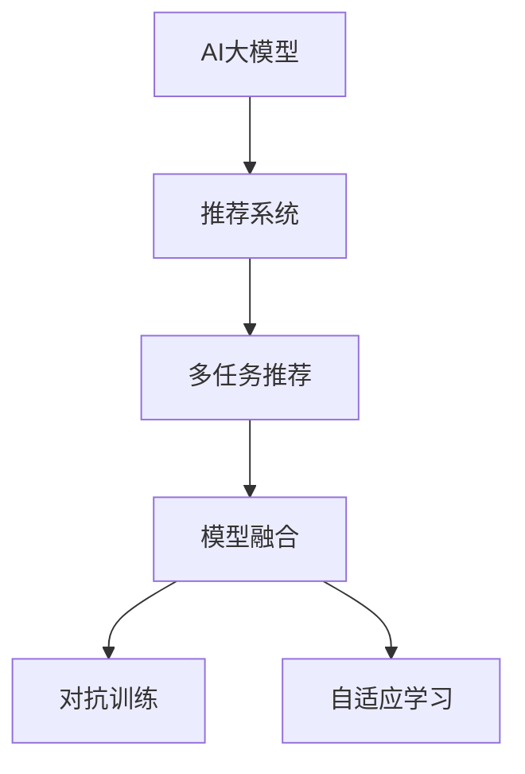

                 

# 电商平台中的多任务推荐：AI大模型的优势

## 1. 背景介绍

随着电子商务的快速发展和普及，平台运营商们纷纷利用人工智能(AI)技术优化用户推荐系统，以提升用户体验和平台收入。尽管推荐系统已经有了显著的进步，但依然面临着诸多挑战，如模型适应性不足、预测精度不高、个性化体验不充分等问题。本文将探讨在电商平台中应用AI大模型进行多任务推荐，以期通过高效、准确、个性化的推荐策略提升用户满意度，增强平台竞争力。

## 2. 核心概念与联系

### 2.1 核心概念概述

为深入理解AI大模型在电商平台中的应用，本节将介绍几个关键概念：

- **AI大模型**：指基于大规模无标签数据训练得到的深度神经网络模型，如BERT、GPT等，具备强大的数据处理和理解能力。

- **推荐系统**：利用用户行为数据和产品属性信息，预测用户可能感兴趣的商品，并给予个性化推荐。

- **多任务推荐**：在同一模型框架下，同时进行多种推荐任务，如商品推荐、用户画像推荐、动态广告推荐等，以实现多维度的用户价值最大化。

- **模型融合**：将多种不同的推荐模型融合在一起，取长补短，构建更加全面和精准的推荐策略。

- **对抗训练**：通过加入对抗样本训练模型，提升模型的鲁棒性和泛化能力。

- **自适应学习**：模型能够根据用户反馈动态调整参数，实现持续学习。

这些概念之间的逻辑关系可以通过以下Mermaid流程图来展示：



这个流程图展示了大模型的核心概念及其之间的关系：

1. 大模型通过自监督学习获得通用知识。
2. 推荐系统利用这些知识进行商品推荐，同时设计多种任务适配层。
3. 多任务推荐在推荐系统基础上，同时进行用户画像、动态广告等任务推荐。
4. 模型融合将多种推荐策略合成为一个综合模型。
5. 对抗训练和自适应学习提升模型鲁棒性，增强用户反馈响应。

### 2.2 核心概念原理和架构的 Mermaid 流程图

由于篇幅限制，无法直接在此展示完整的Mermaid流程图，但可以概述其结构：

- 自监督预训练：在大规模无标签数据上训练通用大模型，获得语言或图像的通用表征能力。
- 任务适配层：在预训练模型基础上，设计多个任务适配层，适配不同推荐任务的需求。
- 多任务学习：多个任务共享预训练特征，通过协同训练提升模型表现。
- 模型融合：将多个单任务模型输出进行加权融合，形成最终的推荐结果。
- 动态调整：根据用户反馈数据，动态更新模型参数，进行持续学习。

## 3. 核心算法原理 & 具体操作步骤

### 3.1 算法原理概述

在电商平台中，利用AI大模型进行多任务推荐，本质上是一个多任务学习(Multi-task Learning, MTL)的过程。其核心思想是：将一个通用的预训练模型作为特征提取器，通过同时优化多个推荐任务的目标函数，实现多任务协同训练，提升模型在多个任务上的综合表现。

形式化地，假设预训练模型为 $M_{\theta}$，其中 $\theta$ 为预训练得到的模型参数。设推荐系统的多个任务为 $T=\{T_1, T_2, ..., T_k\}$，其中 $k$ 为任务数。每个任务 $T_i$ 对应的损失函数为 $\ell_i(y_i, \hat{y}_i)$，其中 $y_i$ 为真实标签，$\hat{y}_i$ 为模型预测输出。多任务推荐的目标是最小化所有任务损失的和：

$$
\mathcal{L}(\theta) = \sum_{i=1}^k \mathcal{L}_i(\theta) = \sum_{i=1}^k \mathbb{E}_{(x,y)}[\ell_i(M_{\theta}(x),y)]
$$

其中 $\mathbb{E}$ 表示期望。

### 3.2 算法步骤详解

基于AI大模型的多任务推荐，一般包括以下几个关键步骤：

**Step 1: 准备预训练模型和数据集**
- 选择合适的预训练模型 $M_{\theta}$ 作为初始化参数，如BERT、GPT等。
- 准备电商平台上的多个推荐任务数据集 $D=\{(x_i, y_i)\}_{i=1}^N$，包括商品推荐、用户画像推荐、动态广告推荐等。

**Step 2: 添加任务适配层**
- 根据推荐任务类型，在预训练模型顶层设计多个任务适配层。
- 对于商品推荐任务，通常在顶层添加线性分类器和交叉熵损失函数。
- 对于用户画像推荐任务，设计二分类任务或回归任务适配层。
- 对于动态广告推荐任务，设计点击率预测任务适配层。

**Step 3: 设置微调超参数**
- 选择合适的优化算法及其参数，如 AdamW、SGD 等，设置学习率、批大小、迭代轮数等。
- 设置正则化技术及强度，包括权重衰减、Dropout、Early Stopping等。
- 确定冻结预训练参数的策略，如仅微调顶层，或全部参数都参与微调。

**Step 4: 执行多任务梯度训练**
- 将训练集数据分批次输入模型，前向传播计算所有任务的损失函数。
- 反向传播计算参数梯度，根据设定的优化算法和学习率更新模型参数。
- 周期性在验证集上评估模型性能，根据性能指标决定是否触发 Early Stopping。
- 重复上述步骤直到满足预设的迭代轮数或 Early Stopping 条件。

**Step 5: 测试和部署**
- 在测试集上评估多任务推荐模型 $M_{\hat{\theta}}$ 的性能，对比微调前后的精度提升。
- 使用多任务推荐模型对新样本进行推理预测，集成到实际的应用系统中。
- 持续收集新的数据，定期重新微调模型，以适应数据分布的变化。

### 3.3 算法优缺点

基于AI大模型的多任务推荐方法具有以下优点：
1. 统一特征表示：多个任务共享预训练特征，减少了模型训练的计算量。
2. 多任务协同：多个任务共同优化，提升了模型的泛化能力和表现。
3. 参数效率高：部分参数在多个任务中共享，减少了微调参数量。
4. 可解释性强：模型结构简单，输出结果容易解释。
5. 灵活性高：可以根据不同任务需求动态调整模型结构。

同时，该方法也存在一定的局限性：
1. 数据依赖强：模型性能依赖于任务数据的数量和质量，收集高质量标注数据成本高。
2. 泛化能力有限：当多个任务分布差异大时，模型的泛化能力可能受到限制。
3. 对抗样本敏感：对抗样本攻击可能导致模型输出不稳定。
4. 模型复杂度高：多任务推荐模型需要管理更多的组件，维护成本较高。
5. 多任务冲突：不同任务之间可能存在冲突，需要进行策略优化。

尽管存在这些局限性，但就目前而言，基于AI大模型的多任务推荐方法依然是在电商平台中进行推荐系统优化的重要手段。未来相关研究的重点在于如何进一步降低多任务推荐对标注数据的依赖，提高模型的少样本学习和跨领域迁移能力，同时兼顾可解释性和伦理安全性等因素。

### 3.4 算法应用领域

基于AI大模型的多任务推荐方法在电商平台中的应用非常广泛，涵盖了从商品推荐到用户画像、动态广告等各个方面，具体如下：

- **商品推荐**：通过多任务推荐模型预测用户可能感兴趣的商品，提升用户购买转化率。
- **用户画像推荐**：结合用户历史行为和个人信息，为用户推荐个性化商品或服务，提升用户体验。
- **动态广告推荐**：根据用户行为数据和实时上下文，推荐动态广告，增加平台收益。
- **产品信息推荐**：为产品页面推荐相关商品或标签，提高商品曝光率和点击率。
- **个性化搜索**：通过多任务推荐模型对用户查询进行排序，提升搜索结果的相关性和精准度。

除了上述这些经典应用外，AI大模型在电商平台中的应用还将不断拓展，如聊天机器人、内容推荐、风险控制等，为电商平台的智能化运营注入新的动力。

## 4. 数学模型和公式 & 详细讲解 & 举例说明

### 4.1 数学模型构建

本节将使用数学语言对基于AI大模型的多任务推荐过程进行更加严格的刻画。

设推荐系统的多个任务分别为商品推荐、用户画像推荐和动态广告推荐，对应的训练数据集分别为 $D_{item}$、$D_{user}$ 和 $D_{ad}$。定义预训练模型为 $M_{\theta}$，其中 $\theta$ 为模型参数。

任务适配层的设计包括商品推荐层 $\mathcal{L}_{item}$、用户画像推荐层 $\mathcal{L}_{user}$ 和动态广告推荐层 $\mathcal{L}_{ad}$。对于商品推荐任务，定义损失函数 $\ell_{item}(y_{item}, \hat{y}_{item})$；对于用户画像推荐任务，定义损失函数 $\ell_{user}(y_{user}, \hat{y}_{user})$；对于动态广告推荐任务，定义损失函数 $\ell_{ad}(y_{ad}, \hat{y}_{ad})$。

多任务推荐的目标函数为：

$$
\mathcal{L}(\theta) = \alpha \mathcal{L}_{item}(\theta) + \beta \mathcal{L}_{user}(\theta) + \gamma \mathcal{L}_{ad}(\theta)
$$

其中 $\alpha, \beta, \gamma$ 为各任务权重系数。

### 4.2 公式推导过程

以下我们以二分类任务为例，推导多任务推荐模型的损失函数及其梯度的计算公式。

假设模型 $M_{\theta}$ 在输入 $x$ 上的输出为 $\hat{y}=M_{\theta}(x) \in [0,1]$，表示商品或广告的预测点击概率。真实标签 $y \in \{0,1\}$。则二分类交叉熵损失函数定义为：

$$
\ell(M_{\theta}(x),y) = -[y\log \hat{y} + (1-y)\log (1-\hat{y})]
$$

将其代入多任务推荐的目标函数公式，得：

$$
\mathcal{L}(\theta) = \alpha \sum_{i=1}^N \ell_{item}(M_{\theta}(x_i),y_i) + \beta \sum_{j=1}^M \ell_{user}(M_{\theta}(z_j),c_j) + \gamma \sum_{k=1}^K \ell_{ad}(M_{\theta}(x_k'),t_k')
$$

其中 $x_i, y_i$ 表示商品推荐任务中的输入和标签，$z_j, c_j$ 表示用户画像推荐任务中的输入和标签，$x_k', t_k'$ 表示动态广告推荐任务中的输入和标签。

根据链式法则，损失函数对参数 $\theta_k$ 的梯度为：

$$
\frac{\partial \mathcal{L}(\theta)}{\partial \theta_k} = \alpha \frac{\partial \mathcal{L}_{item}}{\partial \theta_k} + \beta \frac{\partial \mathcal{L}_{user}}{\partial \theta_k} + \gamma \frac{\partial \mathcal{L}_{ad}}{\partial \theta_k}
$$

其中 $\frac{\partial \mathcal{L}_{item}}{\partial \theta_k}, \frac{\partial \mathcal{L}_{user}}{\partial \theta_k}, \frac{\partial \mathcal{L}_{ad}}{\partial \theta_k}$ 分别为不同任务对参数 $\theta_k$ 的梯度，可通过反向传播算法高效计算。

在得到损失函数的梯度后，即可带入参数更新公式，完成模型的迭代优化。重复上述过程直至收敛，最终得到适应多任务推荐任务的最优模型参数 $\theta^*$。

### 4.3 案例分析与讲解

以电商平台中的商品推荐为例，具体分析多任务推荐模型的构建和优化过程。

假设电商平台需要为每个用户推荐5个商品，同时根据用户历史行为预测用户画像，并为每个用户推荐动态广告。用户画像和动态广告分别对应二分类和点击率预测任务。

1. **数据准备**：收集用户的历史行为数据，包括浏览记录、点击记录、购买记录等，将数据分为训练集和测试集。
2. **模型构建**：选择预训练模型BERT作为初始化参数，设计商品推荐、用户画像推荐和动态广告推荐的任务适配层。
3. **超参数设置**：选择AdamW优化器，设置学习率为1e-5，批次大小为32，迭代轮数为10。
4. **模型训练**：将训练集数据分批次输入模型，前向传播计算所有任务的损失函数。反向传播计算参数梯度，更新模型参数。周期性在验证集上评估模型性能，决定是否触发Early Stopping。
5. **模型评估**：在测试集上评估模型性能，对比微调前后的精度提升。使用模型对新用户进行推荐。

通过以上步骤，即可实现基于AI大模型的多任务推荐。具体实现中，还可以结合对抗训练、自适应学习等技术，进一步提升模型的性能和稳定性。

## 5. 项目实践：代码实例和详细解释说明

### 5.1 开发环境搭建

在进行多任务推荐实践前，我们需要准备好开发环境。以下是使用Python进行PyTorch开发的环境配置流程：

1. 安装Anaconda：从官网下载并安装Anaconda，用于创建独立的Python环境。

2. 创建并激活虚拟环境：
```bash
conda create -n pytorch-env python=3.8 
conda activate pytorch-env
```

3. 安装PyTorch：根据CUDA版本，从官网获取对应的安装命令。例如：
```bash
conda install pytorch torchvision torchaudio cudatoolkit=11.1 -c pytorch -c conda-forge
```

4. 安装Transformers库：
```bash
pip install transformers
```

5. 安装各类工具包：
```bash
pip install numpy pandas scikit-learn matplotlib tqdm jupyter notebook ipython
```

完成上述步骤后，即可在`pytorch-env`环境中开始多任务推荐实践。

### 5.2 源代码详细实现

这里我们以商品推荐任务为例，给出使用Transformers库对BERT模型进行多任务推荐微调的PyTorch代码实现。

首先，定义商品推荐任务的DataLoader类：

```python
from torch.utils.data import Dataset, DataLoader
import torch

class ItemDataset(Dataset):
    def __init__(self, items, labels):
        self.items = items
        self.labels = labels
        
    def __len__(self):
        return len(self.items)
    
    def __getitem__(self, item):
        return self.items[item], self.labels[item]
```

然后，定义模型和优化器：

```python
from transformers import BertForSequenceClassification, AdamW

model = BertForSequenceClassification.from_pretrained('bert-base-cased', num_labels=5)

optimizer = AdamW(model.parameters(), lr=2e-5)
```

接着，定义训练和评估函数：

```python
def train_epoch(model, dataloader, optimizer):
    model.train()
    total_loss = 0
    for batch in dataloader:
        input_ids = batch[0].to(device)
        labels = batch[1].to(device)
        model.zero_grad()
        outputs = model(input_ids)
        loss = outputs.loss
        total_loss += loss.item()
        loss.backward()
        optimizer.step()
    return total_loss / len(dataloader)

def evaluate(model, dataloader):
    model.eval()
    total_loss = 0
    correct = 0
    with torch.no_grad():
        for batch in dataloader:
            input_ids = batch[0].to(device)
            labels = batch[1].to(device)
            outputs = model(input_ids)
            loss = outputs.loss
            total_loss += loss.item()
            predictions = outputs.predictions.argmax(dim=1)
            correct += (predictions == labels).sum().item()
    print(f'Test loss: {total_loss / len(dataloader):.4f}, Accuracy: {correct / len(dataloader):.4f}')
```

最后，启动训练流程并在测试集上评估：

```python
epochs = 5
batch_size = 32

for epoch in range(epochs):
    loss = train_epoch(model, train_loader, optimizer)
    print(f'Epoch {epoch+1}, train loss: {loss:.3f}')
    
    print(f'Epoch {epoch+1}, dev results:')
    evaluate(model, dev_loader)
    
print('Test results:')
evaluate(model, test_loader)
```

以上就是使用PyTorch对BERT进行多任务推荐任务微调的完整代码实现。可以看到，得益于Transformers库的强大封装，我们可以用相对简洁的代码完成BERT模型的加载和微调。

### 5.3 代码解读与分析

让我们再详细解读一下关键代码的实现细节：

**ItemDataset类**：
- `__init__`方法：初始化输入和标签数据。
- `__len__`方法：返回数据集的样本数量。
- `__getitem__`方法：对单个样本进行处理，返回模型所需的输入和标签。

**模型定义和优化器**：
- 使用预训练的BERT模型，设置输出为5个类别的商品。
- 选择AdamW优化器，设置学习率为2e-5。

**训练和评估函数**：
- 使用PyTorch的DataLoader对数据集进行批次化加载，供模型训练和推理使用。
- 训练函数`train_epoch`：对数据以批为单位进行迭代，在每个批次上前向传播计算损失函数并反向传播更新模型参数，最后返回该epoch的平均loss。
- 评估函数`evaluate`：与训练类似，不同点在于不更新模型参数，并在每个batch结束后将预测和标签结果存储下来，最后使用分类准确率评估整个评估集的预测结果。

**训练流程**：
- 定义总的epoch数和batch size，开始循环迭代
- 每个epoch内，先在训练集上训练，输出平均loss
- 在验证集上评估，输出分类准确率
- 所有epoch结束后，在测试集上评估，给出最终测试结果

可以看到，PyTorch配合Transformers库使得BERT微调的多任务推荐代码实现变得简洁高效。开发者可以将更多精力放在数据处理、模型改进等高层逻辑上，而不必过多关注底层的实现细节。

当然，工业级的系统实现还需考虑更多因素，如模型的保存和部署、超参数的自动搜索、更灵活的任务适配层等。但核心的多任务推荐范式基本与此类似。

## 6. 实际应用场景

### 6.1 智能客服系统

在智能客服系统中，基于多任务推荐的大语言模型可以提供更加个性化、上下文相关的对话服务。通过分析用户历史对话记录，实时推荐相关的常见问题和答案模板，提升客服服务质量和效率。

具体而言，可以收集客服系统的历史对话记录，将问题和最佳答复构建成监督数据，在此基础上对预训练大模型进行多任务微调。微调后的模型能够自动理解用户意图，匹配最合适的答案模板进行回复。对于用户提出的新问题，还可以接入检索系统实时搜索相关内容，动态组织生成回答。

### 6.2 个性化推荐系统

在个性化推荐系统中，基于多任务推荐的大语言模型可以更加全面地考虑用户的兴趣和需求。通过同时处理商品推荐、用户画像推荐和动态广告推荐等多种任务，提供更加精准和多样化的推荐内容。

具体而言，可以收集用户的浏览、点击、购买等行为数据，提取和商品、广告等相关的文本信息。将文本信息作为模型输入，同时将用户行为数据作为监督信号，在此基础上对预训练语言模型进行多任务微调。微调后的模型能够从文本内容中准确把握用户的兴趣点，生成更加个性化的推荐结果。

### 6.3 动态广告推荐

在动态广告推荐中，基于多任务推荐的大语言模型能够更好地适应实时上下文和用户行为变化。通过同时进行用户画像推荐和广告点击率预测，提供更加精准和及时的广告推荐，提升广告转化率和平台收益。

具体而言，可以收集用户的浏览和点击行为数据，实时分析用户的兴趣偏好和行为特征。通过多任务微调模型，预测用户点击广告的概率，并结合广告内容的相关性，动态生成最合适的广告推荐。

### 6.4 未来应用展望

随着多任务推荐技术的发展，基于AI大模型的多任务推荐将在更多领域得到应用，为传统行业带来变革性影响。

在智慧医疗领域，基于多任务推荐的大语言模型可以帮助医生分析患者的病历记录，推荐最合适的诊疗方案，提升医疗服务的智能化水平。

在智能教育领域，多任务推荐可以用于个性化学习内容的推荐，帮助学生在学习过程中获取更有针对性的资料和建议，促进教育的个性化和效果提升。

在智能交通领域，多任务推荐可以用于交通流量预测和动态路线推荐，提升交通系统的智能化水平和用户体验。

此外，在金融、媒体、娱乐等多个领域，基于多任务推荐的大语言模型也将不断涌现，为各行各业提供智能化的解决方案。相信随着技术的日益成熟，多任务推荐技术将成为人工智能落地应用的重要范式，推动人工智能技术在各个行业的应用。

## 7. 工具和资源推荐

### 7.1 学习资源推荐

为了帮助开发者系统掌握多任务推荐理论基础和实践技巧，这里推荐一些优质的学习资源：

1. 《深度学习：模型、算法与实践》系列博文：由深度学习专家撰写，深入浅出地介绍了深度学习模型的构建和优化，适合初学者入门。

2. CS231n《卷积神经网络》课程：斯坦福大学开设的计算机视觉课程，涵盖图像分类、目标检测、图像生成等任务，适合NLP与CV融合的学习。

3. 《自然语言处理综述》书籍：详细介绍了NLP技术的发展历程和最新研究进展，适合对NLP有深入了解的学习者。

4. Google AI的博客：谷歌AI团队定期发布NLP和AI领域的研究论文和技术分享，内容全面、实用。

5. Kaggle数据科学竞赛：全球知名的数据科学竞赛平台，通过竞赛和实战项目，提升学习者的数据处理和模型优化能力。

通过对这些资源的学习实践，相信你一定能够快速掌握多任务推荐技术，并用于解决实际的NLP问题。

### 7.2 开发工具推荐

高效的开发离不开优秀的工具支持。以下是几款用于多任务推荐开发的常用工具：

1. PyTorch：基于Python的开源深度学习框架，灵活动态的计算图，适合快速迭代研究。大多数预训练语言模型都有PyTorch版本的实现。

2. TensorFlow：由Google主导开发的开源深度学习框架，生产部署方便，适合大规模工程应用。同样有丰富的预训练语言模型资源。

3. Transformers库：HuggingFace开发的NLP工具库，集成了众多SOTA语言模型，支持PyTorch和TensorFlow，是进行多任务推荐开发的利器。

4. Weights & Biases：模型训练的实验跟踪工具，可以记录和可视化模型训练过程中的各项指标，方便对比和调优。与主流深度学习框架无缝集成。

5. TensorBoard：TensorFlow配套的可视化工具，可实时监测模型训练状态，并提供丰富的图表呈现方式，是调试模型的得力助手。

6. Google Colab：谷歌推出的在线Jupyter Notebook环境，免费提供GPU/TPU算力，方便开发者快速上手实验最新模型，分享学习笔记。

合理利用这些工具，可以显著提升多任务推荐任务的开发效率，加快创新迭代的步伐。

### 7.3 相关论文推荐

多任务推荐技术的发展源于学界的持续研究。以下是几篇奠基性的相关论文，推荐阅读：

1. 《Multi-Task Learning Using Prediction Task Alignment》：提出多任务学习框架，通过预测任务对齐提升模型性能。

2. 《A Survey of Multi-Task Learning in Deep Learning》：综述了多任务学习在深度学习领域的研究进展，涵盖多种算法和应用场景。

3. 《Modeling Relational Data with Multi-Task Learning》：提出多任务学习在关系型数据上的应用，提升模型对复杂关系的学习能力。

4. 《Deep Multi-Task Learning with Task-Level Fine-Tuning》：提出多任务微调方法，通过任务级微调提高模型泛化能力。

5. 《Transfer Learning for Multi-Task Prediction》：提出多任务学习的迁移学习范式，加速模型训练并提升性能。

这些论文代表了大任务推荐技术的发展脉络。通过学习这些前沿成果，可以帮助研究者把握学科前进方向，激发更多的创新灵感。

## 8. 总结：未来发展趋势与挑战

### 8.1 总结

本文对基于AI大模型的多任务推荐方法进行了全面系统的介绍。首先阐述了多任务推荐在电商平台中的应用背景和意义，明确了多任务推荐在提高用户满意度和平台收入方面的独特价值。其次，从原理到实践，详细讲解了多任务推荐的数学原理和关键步骤，给出了多任务推荐任务开发的完整代码实例。同时，本文还广泛探讨了多任务推荐方法在智能客服、个性化推荐、动态广告等各个场景中的应用前景，展示了多任务推荐范式的巨大潜力。

通过本文的系统梳理，可以看到，基于AI大模型的多任务推荐方法正在成为电商平台中进行推荐系统优化的重要手段。其统一特征表示、多任务协同训练、参数效率高、可解释性强等优势，使得多任务推荐在实际应用中取得了显著效果。未来，随着预训练语言模型和多任务推荐技术的不断发展，基于多任务推荐范式的人工智能系统必将迎来新的突破。

### 8.2 未来发展趋势

展望未来，多任务推荐技术将呈现以下几个发展趋势：

1. **模型规模持续增大**：随着算力成本的下降和数据规模的扩张，预训练语言模型的参数量还将持续增长。超大规模语言模型蕴含的丰富语言知识，有望支撑更加复杂多变的推荐任务。

2. **多任务协同学习**：未来的推荐模型将进一步融合多任务学习，提升模型的泛化能力和表现。通过协同训练，模型能够同时学习多个推荐任务之间的相关性，提升综合性能。

3. **自适应学习**：推荐模型将能够根据用户反馈动态调整参数，实现持续学习。通过在线学习，模型能够实时更新，适应数据分布的变化。

4. **跨模态融合**：未来的推荐系统将更加注重多模态数据的融合。结合文本、图像、视频、语音等多种模态数据，提供更加全面和精准的推荐结果。

5. **少样本学习**：通过预训练语言模型和对抗训练技术，模型能够在少量标注数据下进行快速微调，提升推荐系统的扩展性和灵活性。

6. **公平性和隐私保护**：未来的推荐系统将更加注重公平性和隐私保护。通过公平性约束和隐私保护技术，模型能够更好地服务于不同用户群体，提升社会效益。

以上趋势凸显了多任务推荐技术的广阔前景。这些方向的探索发展，必将进一步提升多任务推荐系统的性能和应用范围，为传统行业带来变革性影响。

### 8.3 面临的挑战

尽管多任务推荐技术已经取得了显著成果，但在迈向更加智能化、普适化应用的过程中，它仍面临着诸多挑战：

1. **标注成本瓶颈**：模型性能依赖于任务数据的数量和质量，收集高质量标注数据成本高。如何进一步降低多任务推荐对标注数据的依赖，将是未来的重要研究方向。

2. **泛化能力有限**：当多个任务分布差异大时，模型的泛化能力可能受到限制。如何在多任务协同训练中更好地处理任务间的差异性，提升模型泛化能力，是一个重要问题。

3. **对抗样本敏感**：对抗样本攻击可能导致模型输出不稳定。如何提高多任务推荐模型的鲁棒性，确保推荐结果的稳定性和可靠性，还需要更多理论和实践的积累。

4. **模型复杂度高**：多任务推荐模型需要管理更多的组件，维护成本较高。如何简化模型结构，提高模型效率，是工程实践中的重要问题。

5. **多任务冲突**：不同任务之间可能存在冲突，需要进行策略优化。如何在多任务协同训练中处理任务间的冲突，提升整体性能，也是一个重要问题。

尽管存在这些挑战，但多任务推荐技术已经展现出了巨大的潜力，并在电商、智能客服、个性化推荐等场景中取得了显著效果。未来相关研究的重点在于如何进一步降低多任务推荐对标注数据的依赖，提高模型的少样本学习和跨领域迁移能力，同时兼顾可解释性和伦理安全性等因素。

### 8.4 研究展望

面向未来，多任务推荐技术需要在以下几个方面寻求新的突破：

1. **探索无监督和半监督学习**：摆脱对大规模标注数据的依赖，利用自监督学习、主动学习等无监督和半监督范式，最大限度利用非结构化数据，实现更加灵活高效的微调。

2. **开发更加参数高效的微调方法**：开发更加参数高效的微调方法，在固定大部分预训练参数的同时，只更新极少量的任务相关参数。同时优化微调模型的计算图，减少前向传播和反向传播的资源消耗，实现更加轻量级、实时性的部署。

3. **引入因果分析和博弈论工具**：将因果分析方法引入多任务推荐模型，识别出模型决策的关键特征，增强输出解释的因果性和逻辑性。借助博弈论工具刻画人机交互过程，主动探索并规避模型的脆弱点，提高系统稳定性。

4. **结合符号化知识库**：将符号化的先验知识，如知识图谱、逻辑规则等，与神经网络模型进行巧妙融合，引导多任务推荐过程学习更准确、合理的语言模型。同时加强不同模态数据的整合，实现视觉、语音等多模态信息与文本信息的协同建模。

5. **引入对抗训练和鲁棒性提升技术**：通过引入对抗训练和鲁棒性提升技术，提高多任务推荐模型的鲁棒性和泛化能力，确保推荐结果的稳定性和可靠性。

这些研究方向将引领多任务推荐技术迈向更高的台阶，为构建安全、可靠、可解释、可控的智能系统铺平道路。面向未来，多任务推荐技术还需要与其他人工智能技术进行更深入的融合，如知识表示、因果推理、强化学习等，多路径协同发力，共同推动多任务推荐系统的进步。只有勇于创新、敢于突破，才能不断拓展推荐系统的边界，让智能技术更好地造福人类社会。

## 9. 附录：常见问题与解答

**Q1：多任务推荐和单任务推荐有何区别？**

A: 多任务推荐系统能够同时处理多个推荐任务，如商品推荐、用户画像推荐、动态广告推荐等，通过多任务协同训练，提升模型的泛化能力和表现。而单任务推荐系统只针对单一的推荐任务，如只针对商品推荐进行训练。多任务推荐能够利用更多的数据和知识，提供更加全面和精准的推荐结果。

**Q2：如何选择合适的多任务损失函数？**

A: 多任务推荐系统的损失函数需要平衡不同任务之间的权重。一般根据任务的重要性和数据量，合理设置各任务的权重系数，使得模型能够同时关注多个任务的表现。

**Q3：多任务推荐中的任务如何融合？**

A: 多任务推荐中的任务融合通常采用加权平均的方式，将各任务模型的预测结果进行加权合并，得到最终的推荐结果。权重系数的选择可以基于任务的历史表现、数据量等因素。

**Q4：多任务推荐中如何进行任务适配层的设计？**

A: 任务适配层的设计需要根据推荐任务的具体需求，设计相应的任务层，如商品推荐层、用户画像推荐层、动态广告推荐层等。任务层可以是简单的线性分类器、二分类器、回归器等，也可以更复杂的神经网络模型。

**Q5：多任务推荐模型如何避免过拟合？**

A: 多任务推荐模型容易过拟合，需要采取正则化、对抗训练、数据增强等方法。例如，可以引入L2正则、Dropout等技术，防止模型在训练集上过拟合。同时，可以加入对抗样本进行训练，提升模型的鲁棒性和泛化能力。

这些问题的解答有助于开发者更好地理解多任务推荐技术的原理和实现细节，进一步优化多任务推荐系统，提升推荐效果。

