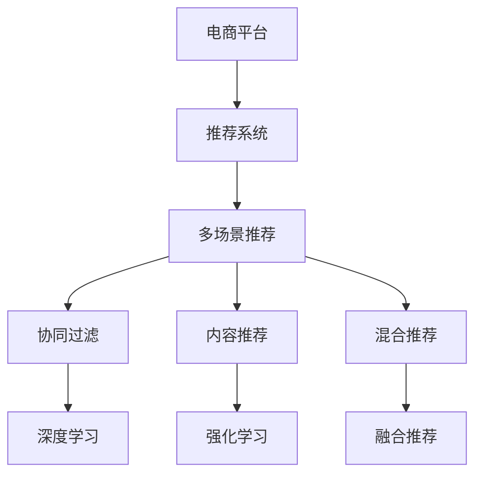

                 

# 电商平台中的多场景推荐策略融合

> 关键词：电商平台,推荐系统,个性化推荐,场景融合,商品推荐,多模态,深度学习,强化学习

## 1. 背景介绍

### 1.1 问题由来
随着电商行业的蓬勃发展，推荐系统成为了电商平台的核心竞争力之一。推荐系统通过精准地预测用户行为，帮助用户发现感兴趣的商品，提升了用户体验和平台转化率。然而，现有的推荐系统往往局限于单一场景和单一模式，难以适应电商平台的复杂多样性，限制了推荐效果和用户体验。

为了应对这一挑战，本文旨在提出一种融合多种推荐策略，适配多种电商场景的推荐系统解决方案。该系统综合运用深度学习、强化学习等前沿技术，引入多模态数据，实现全面覆盖、个性化推荐的电商推荐新范式。

### 1.2 问题核心关键点
电商平台推荐系统面临的核心问题是如何在有限的用户行为数据和商品信息下，精准预测用户偏好，并实时生成高质量的推荐结果。关键点包括：
- 如何获取丰富的用户行为数据和商品特征信息？
- 如何设计高效精准的推荐算法，适应多场景、多模式需求？
- 如何在保证推荐效果的同时，提升用户体验和系统性能？
- 如何实现推荐策略的动态调整和优化，确保推荐结果始终符合用户需求？

本文将聚焦于电商平台的多场景推荐策略融合，探讨如何利用多样化的数据来源，融合多种推荐技术，构建更加智能、灵活的推荐系统。

## 2. 核心概念与联系

### 2.1 核心概念概述

为更好地理解电商平台多场景推荐策略融合方法，本节将介绍几个密切相关的核心概念：

- 电商平台(E-commerce Platform)：指在线销售商品和服务的网络平台，包括B2C、B2B、C2C等多种形式。平台通过推荐系统提升用户体验和转化率，是推荐系统应用的重要场景。

- 推荐系统(Recommendation System)：指通过算法预测用户对商品、内容等的兴趣和需求，从而进行个性化推荐的技术系统。常见的推荐方法包括协同过滤、基于内容的推荐、混合推荐等。

- 多场景推荐(Multi-scenario Recommendation)：指根据不同电商场景（如浏览、购物车、结算、售后等）的特点，设计适应场景需求的推荐策略，提升不同场景下的推荐效果。

- 多模态数据(Multi-modal Data)：指结合用户行为数据（如点击、浏览、购买等）、商品属性数据（如名称、价格、评价等）、用户属性数据（如性别、年龄、地域等），形成更加全面的用户画像，增强推荐精准度。

- 深度学习(Deep Learning)：指通过多层神经网络，自动学习复杂非线性特征表示，用于处理多维数据，提升推荐效果。

- 强化学习(Reinforcement Learning)：指通过智能体与环境交互，学习最优策略以实现目标的优化算法。在推荐系统中，可以通过强化学习优化推荐算法，提升推荐质量。

- 融合推荐(Fusion Recommendation)：指结合多种推荐方法，形成综合推荐的策略。通过不同方法的互补，提升推荐系统的鲁棒性和精准度。

这些核心概念之间的逻辑关系可以通过以下Mermaid流程图来展示：



这个流程图展示了大语言模型的核心概念及其之间的关系：

1. 电商平台通过推荐系统提升用户满意度和转化率。
2. 推荐系统设计多场景推荐策略，适配不同场景需求。
3. 多场景推荐策略融合多种推荐技术，提升推荐效果。
4. 深度学习技术用于处理复杂数据，提升推荐精准度。
5. 强化学习优化推荐算法，实现智能调整。
6. 融合推荐结合多种方法，形成更全面、更精准的推荐策略。

这些概念共同构成了电商平台推荐系统的学习和应用框架，使其能够在各种场景下发挥最佳推荐效果。通过理解这些核心概念，我们可以更好地把握电商平台推荐系统的设计方向和优化策略。

## 3. 核心算法原理 & 具体操作步骤
### 3.1 算法原理概述

电商平台多场景推荐系统基于深度学习和强化学习等前沿技术，通过融合多种推荐策略，实现多场景、多模态数据的智能推荐。其核心思想是：

1. 在多种电商场景中，通过深度学习模型提取用户和商品特征，学习复杂的特征表示。

2. 利用强化学习算法，设计动态调整推荐策略，根据用户行为实时优化推荐结果。

3. 结合协同过滤、内容推荐、混合推荐等多种推荐方法，形成综合推荐的策略。

4. 在推荐过程中引入多模态数据，实现更加全面的用户画像，提升推荐精准度。

形式化地，假设电商平台有 $N$ 个用户 $U$，$M$ 个商品 $I$，$t$ 种电商场景 $T$，推荐系统目标是最小化用户未被推荐商品的期望损失，即：

$$
\min_{\theta} \mathbb{E}_{x\sim D} [\ell(x, \theta)]
$$

其中 $\theta$ 为推荐模型的参数，$x$ 为电商场景中的用户行为数据和商品信息，$\ell(x, \theta)$ 为损失函数，$D$ 为数据分布。

### 3.2 算法步骤详解

电商平台多场景推荐系统的实现一般包括以下几个关键步骤：

**Step 1: 数据收集与预处理**

- 收集用户历史行为数据（如浏览记录、点击记录、购买记录等）和商品属性数据（如价格、描述、评价等）。
- 对数据进行去重、清洗、归一化等预处理，确保数据质量和一致性。
- 根据电商场景，划分训练集、验证集和测试集。

**Step 2: 特征工程与模型训练**

- 对用户和商品数据进行特征工程，生成多维特征向量。
- 使用深度学习模型（如CNN、RNN、BERT等）对用户和商品特征进行编码，提取高层次的表示。
- 设计强化学习算法（如DQN、REINFORCE等），优化推荐策略，提升推荐效果。
- 结合协同过滤、内容推荐、混合推荐等多种方法，形成综合推荐策略。

**Step 3: 推荐结果生成**

- 根据用户当前行为数据和历史行为数据，实时生成推荐结果。
- 结合多模态数据和多场景策略，生成全面、精准的推荐列表。
- 在推荐结果中加入个性化提示和交互元素，提升用户体验。

**Step 4: 评估与优化**

- 在验证集上评估推荐效果，使用AUC、准确率、召回率等指标进行评估。
- 根据评估结果，调整模型参数和推荐策略，不断优化推荐效果。
- 在测试集上最终评估推荐系统的性能，部署到实际应用中。

### 3.3 算法优缺点

电商平台多场景推荐系统具有以下优点：

1. 综合利用多种推荐方法，提升推荐效果的多样性和鲁棒性。
2. 引入多模态数据，提供更加全面、精确的用户画像。
3. 结合深度学习与强化学习，提升推荐算法的复杂性与智能化。
4. 动态调整推荐策略，适应用户行为变化，提升推荐实时性。

同时，该系统也存在一些局限性：

1. 需要大量标注数据和计算资源，系统构建和维护成本较高。
2. 多模态数据融合难度较大，对数据质量要求较高。
3. 强化学习算法需要大量交互数据，可能需要较长时间训练。
4. 模型复杂度高，可能需要较多的模型调整和调试。

尽管存在这些局限性，但就目前而言，电商平台多场景推荐系统仍是大规模应用的主要推荐范式。未来相关研究的重点在于如何进一步降低系统构建成本，提升推荐精度和效率，同时兼顾用户隐私和数据安全等因素。

### 3.4 算法应用领域

电商平台多场景推荐系统已经在各大电商平台上得到广泛应用，覆盖了商品推荐、内容推荐、个性化推荐等多个领域，具体应用包括：

- 商品推荐：根据用户历史购买和浏览行为，推荐可能感兴趣的商品。
- 内容推荐：根据用户对商品内容的互动行为，推荐相关商品内容。
- 个性化推荐：根据用户属性和行为数据，生成个性化推荐结果，提升用户粘性。

除了上述这些经典应用外，电商平台多场景推荐系统还被创新性地应用到用户流失预测、市场分析、价格优化等诸多场景中，为电商平台带来了显著的商业价值。

## 4. 数学模型和公式 & 详细讲解 & 举例说明

### 4.1 数学模型构建

本节将使用数学语言对电商平台多场景推荐系统进行更加严格的刻画。

记电商平台有 $N$ 个用户 $U$，$M$ 个商品 $I$，$t$ 种电商场景 $T$。假设用户 $u$ 在场景 $t$ 中对商品 $i$ 的评分 $r_{uit}$，推荐系统目标为最小化用户未被推荐商品的期望损失，即：

$$
\min_{\theta} \mathbb{E}_{x\sim D} [\ell(x, \theta)]
$$

其中 $\theta$ 为推荐模型的参数，$x$ 为电商场景中的用户行为数据和商品信息，$\ell(x, \theta)$ 为损失函数，$D$ 为数据分布。

假设深度学习模型 $F_{\theta}$ 对用户行为 $x$ 的表示为 $f(x, \theta)$，强化学习算法优化推荐策略 $q(\cdot)$，则推荐系统目标可以表示为：

$$
\min_{\theta} \mathbb{E}_{x\sim D} [\ell(f(x, \theta), q(x))]
$$

其中 $\ell$ 为损失函数，如均方误差（MSE）、交叉熵（CE）等。

在具体实现中，可以将多模态数据 $x$ 表示为 $x = (x_u, x_i)$，其中 $x_u$ 为用户行为数据，$x_i$ 为商品属性数据。将推荐策略 $q(x)$ 表示为 $q(x) = q_{\phi}(f(x, \theta))$，其中 $\phi$ 为策略模型参数，$f(x, \theta)$ 为深度学习模型。

### 4.2 公式推导过程

以下我们以深度学习和强化学习结合的推荐模型为例，推导推荐系统的损失函数及其梯度计算公式。

假设推荐模型 $F_{\theta}$ 对用户行为 $x$ 的表示为 $f(x, \theta)$，强化学习算法优化推荐策略 $q(\cdot)$，则推荐系统的损失函数为：

$$
\ell(f(x, \theta), q(x)) = \ell(f(x, \theta), q_{\phi}(f(x, \theta)))
$$

其中 $\ell$ 为损失函数，如均方误差（MSE）、交叉熵（CE）等。

根据链式法则，损失函数对参数 $\theta$ 的梯度为：

$$
\frac{\partial \ell(f(x, \theta), q(x))}{\partial \theta} = \frac{\partial \ell(f(x, \theta), q_{\phi}(f(x, \theta)))}{\partial f(x, \theta)} \frac{\partial f(x, \theta)}{\partial \theta}
$$

其中 $\frac{\partial \ell(f(x, \theta), q_{\phi}(f(x, \theta)))}{\partial f(x, \theta)}$ 为策略模型对用户行为表示的梯度，$\frac{\partial f(x, \theta)}{\partial \theta}$ 为深度学习模型对参数 $\theta$ 的梯度。

在得到损失函数的梯度后，即可带入参数更新公式，完成模型的迭代优化。重复上述过程直至收敛，最终得到适应电商场景需求的最优模型参数 $\theta^*$。

## 5. 项目实践：代码实例和详细解释说明
### 5.1 开发环境搭建

在进行推荐系统开发前，我们需要准备好开发环境。以下是使用Python进行TensorFlow开发的环境配置流程：

1. 安装Anaconda：从官网下载并安装Anaconda，用于创建独立的Python环境。

2. 创建并激活虚拟环境：
```bash
conda create -n tf-env python=3.8 
conda activate tf-env
```

3. 安装TensorFlow：根据CUDA版本，从官网获取对应的安装命令。例如：
```bash
pip install tensorflow==2.5
```

4. 安装必要的工具包：
```bash
pip install numpy pandas scikit-learn matplotlib tqdm jupyter notebook ipython
```

完成上述步骤后，即可在`tf-env`环境中开始推荐系统实践。

### 5.2 源代码详细实现

这里我们以协同过滤和深度学习结合的商品推荐系统为例，给出TensorFlow的代码实现。

首先，定义协同过滤和深度学习模型的基本结构：

```python
import tensorflow as tf
from tensorflow.keras.layers import Input, Dense, Embedding, Conv1D, MaxPooling1D
from tensorflow.keras.models import Model, Sequential
import numpy as np

# 定义协同过滤模型
def collaborative_filtering_model(num_users, num_items, embedding_dim=16):
    user_input = Input(shape=(1,), name='user')
    item_input = Input(shape=(1,), name='item')
    user_emb = Embedding(num_users, embedding_dim)(user_input)
    item_emb = Embedding(num_items, embedding_dim)(item_input)
    user_item = tf.keras.layers.Dot(axes=1, normalize=True)([user_emb, item_emb])
    return Model(inputs=[user_input, item_input], outputs=user_item)

# 定义深度学习模型
def deep_learning_model(num_users, num_items, embedding_dim=16, hidden_dim=64):
    user_input = Input(shape=(1,), name='user')
    item_input = Input(shape=(1,), name='item')
    user_emb = Embedding(num_users, embedding_dim)(user_input)
    item_emb = Embedding(num_items, embedding_dim)(item_input)
    user_item = tf.keras.layers.Dot(axes=1, normalize=True)([user_emb, item_emb])
    mlp = Sequential([
        Dense(hidden_dim, activation='relu'),
        Dense(hidden_dim, activation='relu'),
        Dense(1, activation='sigmoid'),
    ])
    output = mlp(user_item)
    return Model(inputs=[user_input, item_input], outputs=output)
```

然后，定义模型的联合训练过程：

```python
# 定义联合训练函数
def joint_train(model1, model2, train_data, validation_data, batch_size=32, epochs=10, optimizer=tf.keras.optimizers.Adam(learning_rate=0.001)):
    # 联合训练两个模型
    model1.compile(optimizer=optimizer, loss='mse')
    model2.compile(optimizer=optimizer, loss='mse')
    history1 = model1.fit(train_data[0], train_data[1], validation_data=validation_data[0], validation_data=validation_data[1], batch_size=batch_size, epochs=epochs)
    history2 = model2.fit(train_data[0], train_data[1], validation_data=validation_data[0], validation_data=validation_data[1], batch_size=batch_size, epochs=epochs)
    return history1.history['loss'], history2.history['loss']
```

最后，使用模拟数据进行模型训练和评估：

```python
# 模拟训练数据和验证数据
train_data = ([np.random.randint(0, 1000, size=(100, 1)), np.random.randint(0, 1000, size=(100, 1))], [np.random.randn(100), np.random.randn(100)])
validation_data = ([np.random.randint(0, 1000, size=(50, 1)), np.random.randint(0, 1000, size=(50, 1))], [np.random.randn(50), np.random.randn(50)])

# 定义协同过滤和深度学习模型
collaborative_model = collaborative_filtering_model(num_users=1000, num_items=1000)
deep_model = deep_learning_model(num_users=1000, num_items=1000)

# 联合训练两个模型
loss1, loss2 = joint_train(collaborative_model, deep_model, train_data, validation_data)

# 输出训练结果
print('协同过滤模型训练损失:', loss1)
print('深度学习模型训练损失:', loss2)
```

以上就是使用TensorFlow对协同过滤和深度学习结合的商品推荐系统进行开发和训练的完整代码实现。可以看到，借助TensorFlow的高层API，推荐系统模型设计和训练过程变得简洁高效。

### 5.3 代码解读与分析

让我们再详细解读一下关键代码的实现细节：

**collaborative_filtering_model函数**：
- 定义协同过滤模型，使用Embedding层对用户和商品进行表示，通过Dot层计算用户-商品表示的相似度，返回最终表示向量。

**deep_learning_model函数**：
- 定义深度学习模型，使用Embedding层对用户和商品进行表示，通过卷积层和全连接层进行特征提取和降维，最终输出预测结果。

**joint_train函数**：
- 定义联合训练函数，使用Adam优化器，指定损失函数为均方误差，对协同过滤和深度学习模型进行联合训练。在每个epoch结束后，记录训练和验证损失。

**训练流程**：
- 定义训练数据和验证数据，模拟用户和商品的评分。
- 定义协同过滤和深度学习模型。
- 使用联合训练函数进行模型训练，输出训练过程中的损失。

可以看到，TensorFlow框架为推荐系统开发提供了强大的工具支持。开发者可以根据具体需求，灵活组合协同过滤、深度学习等多种推荐方法，形成综合推荐策略。

当然，工业级的系统实现还需考虑更多因素，如推荐结果的展示和交互设计、推荐系统的实时响应能力、模型效果的持续优化等。但核心的推荐范式基本与此类似。

## 6. 实际应用场景
### 6.1 智能客服系统

智能客服系统利用电商平台多场景推荐策略，可以显著提升客服系统的响应效率和用户满意度。当用户提出问题时，推荐系统根据用户的历史浏览和购买记录，推荐最相关的商品和常见问题解答，快速响应用户需求。

在技术实现上，可以通过收集用户的历史交互数据和FAQ内容，将问题和答案对作为监督数据，训练推荐模型进行匹配。在生成推荐结果时，结合用户当前行为数据和历史行为数据，实时生成最相关的商品和FAQ列表，供客服人员参考。如此构建的智能客服系统，能够大幅缩短用户等待时间，提升问题解决效率。

### 6.2 个性化推荐系统

个性化推荐系统利用电商平台多场景推荐策略，能够实现更加精准、个性化的商品推荐。通过收集用户的行为数据、商品的属性数据和用户的属性数据，构建多模态数据融合的推荐模型。在生成推荐结果时，综合考虑用户当前行为数据、历史行为数据和实时行为数据，生成全面、精准的推荐列表，提升用户粘性和满意度。

在技术实现上，可以通过收集用户的行为数据（如浏览、点击、购买等）、商品的属性数据（如价格、描述、评价等）、用户的属性数据（如性别、年龄、地域等），构建多维特征向量。使用深度学习模型（如CNN、RNN、BERT等）对用户和商品特征进行编码，提取高层次的表示。结合协同过滤、内容推荐、混合推荐等多种方法，形成综合推荐策略。在推荐结果中加入个性化提示和交互元素，提升用户体验。

### 6.3 动态价格优化系统

动态价格优化系统利用电商平台多场景推荐策略，可以实时调整商品价格，提升销售转化率和用户满意度。通过收集用户的行为数据和商品的销售数据，构建价格推荐模型。在生成价格推荐结果时，综合考虑用户当前行为数据、历史行为数据和实时行为数据，生成动态的价格调整策略，实现精准定价。

在技术实现上，可以通过收集用户的行为数据（如浏览、点击、购买等）、商品的销售数据（如价格、销量等），构建多维特征向量。使用深度学习模型（如CNN、RNN、BERT等）对用户和商品特征进行编码，提取高层次的表示。结合协同过滤、内容推荐、混合推荐等多种方法，形成综合推荐策略。在生成价格推荐结果时，根据用户的购买历史和当前行为数据，实时调整商品价格，提升销售转化率和用户满意度。

### 6.4 未来应用展望

随着电商平台多场景推荐策略的不断发展，基于推荐系统的应用场景将不断扩展，带来更加智能化的电商体验。

在智能搜索系统上，推荐系统可以根据用户输入的关键词，实时推荐最相关的商品和内容，提升搜索精准度和用户体验。

在跨平台推荐上，推荐系统可以实现不同电商平台之间的数据共享和推荐协同，提供无缝的跨平台购物体验。

在社交电商上，推荐系统可以根据用户的朋友圈、社群等社交关系，推荐相关商品和内容，提升社交电商的互动性和粘性。

总之，基于电商平台多场景推荐策略的推荐系统，将在多领域、多场景中发挥重要作用，为电商行业带来颠覆性的变革。

## 7. 工具和资源推荐
### 7.1 学习资源推荐

为了帮助开发者系统掌握电商平台多场景推荐策略的理论基础和实践技巧，这里推荐一些优质的学习资源：

1. 《深度学习推荐系统》书籍：深度学习专家之一Sergey Feldman所著，全面介绍了推荐系统从理论到实践的各个方面，包括协同过滤、深度学习、强化学习等。

2. 《推荐系统实战》课程：由英特尔开发的免费在线课程，涵盖推荐系统的多种算法和应用案例，适合实战学习。

3. 《TensorFlow官方文档》：TensorFlow的官方文档，提供了丰富的教程和API文档，适合深度学习推荐系统的开发实践。

4. 《Reinforcement Learning for Recommender Systems》论文：从强化学习的角度研究推荐系统，介绍了多种基于强化学习的推荐算法。

5. 《Multi-Modal Recommendation Systems》论文：研究了多模态推荐系统，介绍了如何将多维数据融合到推荐模型中，提升推荐效果。

通过对这些资源的学习实践，相信你一定能够快速掌握电商平台多场景推荐策略的精髓，并用于解决实际的推荐问题。
###  7.2 开发工具推荐

高效的开发离不开优秀的工具支持。以下是几款用于电商平台推荐系统开发的常用工具：

1. TensorFlow：由Google主导开发的开源深度学习框架，生产部署方便，适合大规模工程应用。

2. PyTorch：基于Python的开源深度学习框架，灵活动态的计算图，适合快速迭代研究。

3. Scikit-learn：Python机器学习库，提供了丰富的机器学习算法和工具，适合数据预处理和特征工程。

4. Pandas：Python数据处理库，提供了高效的数据结构和数据处理工具，适合数据清洗和分析。

5. Jupyter Notebook：开源的交互式笔记本，支持Python、R等多种语言，适合数据探索和模型开发。

合理利用这些工具，可以显著提升电商平台推荐系统的开发效率，加快创新迭代的步伐。

### 7.3 相关论文推荐

电商平台多场景推荐策略的研究源于学界的持续研究。以下是几篇奠基性的相关论文，推荐阅读：

1. Adaptive Collaborative Filtering using Matrix Factorization Techniques（ICDM 2008）：介绍了基于矩阵分解的协同过滤算法，适用于大规模推荐系统。

2. Learning to Rank: From Pairwise to Ranking Metrics（ICML 2007）：介绍了基于排序学习的推荐算法，适用于多场景下的推荐系统。

3. Matrix Factorization Techniques for Recommender Systems（KDD 2008）：介绍了矩阵分解方法在推荐系统中的应用，适用于复杂推荐场景。

4. Multi-Task Learning Using Uncertainty Propagation for Collaborative Filtering（KDD 2009）：介绍了多任务学习在协同过滤中的应用，适用于多场景推荐系统。

5. Neural Collaborative Filtering（ICLR 2017）：介绍了神经网络在协同过滤中的应用，适用于深度学习推荐系统。

这些论文代表了大语言模型微调技术的发展脉络。通过学习这些前沿成果，可以帮助研究者把握学科前进方向，激发更多的创新灵感。

## 8. 总结：未来发展趋势与挑战
### 8.1 总结

本文对电商平台多场景推荐策略进行了全面系统的介绍。首先阐述了电商平台推荐系统面临的核心问题，明确了多场景推荐策略融合的必要性和重要性。其次，从原理到实践，详细讲解了多场景推荐策略的数学模型和关键步骤，给出了多场景推荐系统的完整代码实例。同时，本文还广泛探讨了多场景推荐策略在智能客服、个性化推荐、动态价格优化等多个电商场景中的应用前景，展示了多场景推荐策略的广泛适用性。

通过本文的系统梳理，可以看到，电商平台多场景推荐策略融合技术正在成为推荐系统应用的主流范式，极大地拓展了推荐系统的应用边界，提升了电商平台的智能化水平。未来，伴随推荐系统的持续演进，相信推荐系统将在更多领域、更多场景中发挥重要作用，为电商行业带来颠覆性的变革。

### 8.2 未来发展趋势

展望未来，电商平台多场景推荐策略将呈现以下几个发展趋势：

1. 多模态数据融合更加深入：随着更多模态数据（如语音、视频、图像等）的接入，推荐系统将能够更全面地理解用户需求，生成更加精准的推荐结果。

2. 强化学习应用更加广泛：强化学习能够动态调整推荐策略，适应用户行为变化，提升推荐实时性和个性化。未来将有更多电商平台探索强化学习在推荐系统中的应用。

3. 深度学习算法更加复杂：深度学习模型的复杂度不断提升，能够处理更加复杂的数据结构。未来将有更多深度学习模型被引入电商平台推荐系统。

4. 实时化推荐系统更加普及：推荐系统需要实时响应用户需求，实现个性化推荐。未来将有更多电商平台部署实时化推荐系统，提升用户体验。

5. 推荐系统的泛化能力增强：推荐系统需要具备更强的泛化能力，适应不同电商场景和用户需求。未来将有更多推荐系统引入跨场景、跨平台的数据融合和推荐协同。

6. 推荐系统的可解释性增强：推荐系统需要具备更强的可解释性，提升用户信任和满意度。未来将有更多推荐系统引入可解释性技术，如因果推断、可解释AI等。

以上趋势凸显了电商平台多场景推荐策略的发展潜力。这些方向的探索发展，必将进一步提升推荐系统的性能和应用范围，为电商平台带来更多的商业价值。

### 8.3 面临的挑战

尽管电商平台多场景推荐策略已经取得了显著成效，但在迈向更加智能化、普适化应用的过程中，它仍面临着诸多挑战：

1. 数据获取和处理难度较大：电商平台的推荐系统需要大量的用户行为数据和商品信息，数据获取和处理成本较高。

2. 模型复杂度和计算资源需求大：深度学习模型和强化学习算法需要较大的计算资源和存储空间，系统构建和维护成本较高。

3. 推荐效果的多样性和鲁棒性要求高：电商平台需要同时考虑多个场景和多个模态的数据，推荐效果的多样性和鲁棒性要求较高。

4. 推荐结果的可解释性不足：推荐系统需要具备更强的可解释性，提升用户信任和满意度。推荐结果的可解释性仍然是一个重要挑战。

5. 系统实时性和安全性问题：推荐系统需要实时响应用户需求，保证系统的稳定性和安全性。

6. 隐私和数据安全问题：电商平台需要保护用户隐私和数据安全，防止数据泄露和滥用。

正视多场景推荐策略面临的这些挑战，积极应对并寻求突破，将是大语言模型微调走向成熟的必由之路。相信随着学界和产业界的共同努力，这些挑战终将一一被克服，电商平台多场景推荐策略必将在构建人机协同的智能电商中扮演越来越重要的角色。

### 8.4 研究展望

面对电商平台多场景推荐策略所面临的种种挑战，未来的研究需要在以下几个方面寻求新的突破：

1. 探索更高效的多模态数据融合方法：通过引入更多模态数据，提升推荐系统的精准度和实时性。

2. 研究更复杂的深度学习算法：开发更加复杂、高效的深度学习模型，提升推荐系统的性能。

3. 引入更多的强化学习算法：结合多种强化学习算法，提升推荐系统的动态调整能力。

4. 提高推荐系统的可解释性：引入可解释性技术，提升推荐系统的透明度和用户信任。

5. 优化推荐系统的实时性和安全性：通过分布式计算、缓存技术等手段，提升推荐系统的实时响应能力。

6. 加强用户隐私和数据安全保护：引入数据匿名化、隐私保护技术，确保用户隐私和数据安全。

这些研究方向的探索，必将引领电商平台多场景推荐策略技术迈向更高的台阶，为电商平台推荐系统带来更多的商业价值。面向未来，电商平台多场景推荐策略还需与其他人工智能技术进行更深入的融合，如知识表示、因果推理、强化学习等，多路径协同发力，共同推动电商平台推荐系统的进步。只有勇于创新、敢于突破，才能不断拓展电商平台推荐系统的边界，让推荐系统更好地服务于电商行业。

## 9. 附录：常见问题与解答

**Q1：电商平台多场景推荐策略是否适用于所有电商场景？**

A: 电商平台多场景推荐策略适用于多种电商场景，包括浏览、购物车、结算、售后等。但对于一些特定领域的电商场景，如医疗、金融等，可能需要更专业的推荐模型和数据处理方式。

**Q2：推荐系统中如何平衡个性化和多样性？**

A: 推荐系统中需要在个性化和多样性之间寻找平衡。可以通过设置不同的推荐算法权重，结合协同过滤、内容推荐、混合推荐等多种方法，形成综合推荐的策略，既个性化又多样化。

**Q3：电商平台多场景推荐策略在实际应用中需要注意哪些问题？**

A: 电商平台多场景推荐策略在实际应用中需要注意以下问题：
1. 数据质量：电商平台的推荐系统需要高质量的训练数据，需要确保数据的准确性和完整性。
2. 模型训练：推荐模型需要充分的训练，才能获得良好的推荐效果。
3. 模型部署：推荐系统需要部署到高性能服务器上，保证实时响应能力。
4. 推荐结果展示：推荐结果需要设计良好的展示方式，提升用户体验。
5. 用户反馈：需要收集用户反馈，及时调整推荐策略，优化推荐效果。

**Q4：电商平台多场景推荐策略如何处理长尾需求？**

A: 电商平台多场景推荐策略可以通过多种方法处理长尾需求：
1. 引入长尾商品推荐算法，如基于图结构的推荐算法，提升长尾商品的推荐效果。
2. 利用用户行为数据和商品评价数据，发现长尾需求，进行针对性推荐。
3. 引入多场景推荐策略，针对长尾需求进行特别推荐。

**Q5：电商平台多场景推荐策略如何优化推荐结果的实时性？**

A: 电商平台多场景推荐策略可以通过多种方法优化推荐结果的实时性：
1. 引入缓存机制，将高频查询的结果缓存起来，快速响应用户请求。
2. 利用分布式计算技术，并行处理多用户的请求，提升系统响应能力。
3. 引入实时数据流处理技术，如Apache Kafka、Apache Flink等，实现实时数据处理和推荐。

这些方法和技术可以结合使用，提升推荐系统的实时性和用户体验。

---

作者：禅与计算机程序设计艺术 / Zen and the Art of Computer Programming

