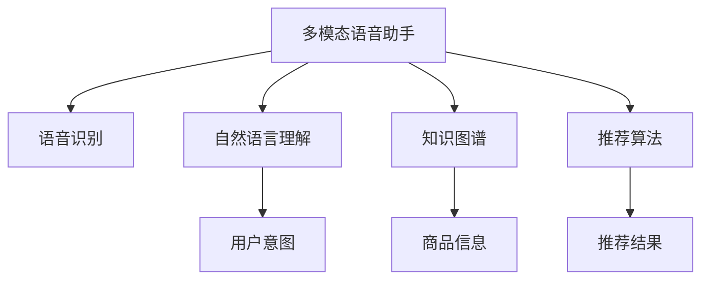

                 

# 电商平台中的多模态语音助手系统设计

## 1. 背景介绍

### 1.1 问题由来
电商平台的发展逐渐向个性化、互动化方向转变，用户与平台的交互方式也从传统的文字和图片扩展到语音、图像、视频等多模态形式。多模态语音助手系统，作为电商平台的智能化交互入口，能够通过语音识别技术理解用户意图，提供个性化的商品推荐和智能客服服务，有效提升用户体验和平台满意度。然而，多模态语音助手的实现涉及语音识别、自然语言理解、知识图谱、推荐算法等多个领域的深度整合，技术难度较高，目前行业内尚未有成熟的解决方案。本文将详细介绍多模态语音助手系统设计，希望能为相关技术的落地应用提供参考。

### 1.2 问题核心关键点
多模态语音助手系统设计需要解决的核心问题包括：
- 如何融合多种数据形式，构建语义完整的用户意图模型。
- 如何通过知识图谱提供准确的商品信息和相关推荐。
- 如何整合多种算法模型，提供高效、精准的服务响应。
- 如何在电商平台上实现系统的稳定部署和高效维护。

本文将围绕这些问题展开详细讨论，并给出相应的解决方案。

## 2. 核心概念与联系

### 2.1 核心概念概述

在介绍多模态语音助手系统设计之前，我们先来了解一下其中的核心概念及其相互关系：

- **多模态语音助手(Multimodal Voice Assistant)**：将语音识别、自然语言理解、语音合成、知识图谱、推荐算法等技术集成在一个平台上的智能化交互系统。用户通过语音命令与平台互动，系统理解用户意图并执行相应操作。
- **语音识别(Voice Recognition)**：将用户的语音输入转换为文本形式，是语音助手的基础功能。
- **自然语言理解(Natural Language Understanding, NLU)**：将文本转换为结构化的语义表示，理解用户意图和需求。
- **知识图谱(Knowledge Graph)**：通过实体关系进行结构化的知识表示和存储，提供商品信息和推荐依据。
- **推荐算法(Recommendation Algorithm)**：根据用户的历史行为和偏好，提供个性化商品推荐。

这些概念之间的逻辑关系可以通过以下Mermaid流程图来展示：



这个流程图展示了多模态语音助手系统中各个模块的相互关系：

1. 语音识别将用户语音转换为文本，作为自然语言理解的输入。
2. 自然语言理解解析用户文本，提取出用户意图。
3. 知识图谱提供商品信息及相关实体关系，用于理解用户意图并推荐商品。
4. 推荐算法根据用户历史行为和意图，提供个性化的推荐结果。

这些模块共同构建了一个完整的用户意图理解与商品推荐系统。

## 3. 核心算法原理 & 具体操作步骤
### 3.1 算法原理概述

多模态语音助手系统设计的主要算法原理包括：

- 使用深度学习技术进行语音识别和自然语言理解。
- 基于知识图谱构建商品关系图，用于推荐算法的图卷积网络(Graph Convolutional Network, GCN)。
- 融合多模态数据，通过注意力机制提取用户意图和商品特征。
- 使用强化学习进行推荐算法模型优化。

### 3.2 算法步骤详解

以下详细介绍多模态语音助手系统的实现步骤：

#### 3.2.1 语音识别

语音识别的基本流程如下：

1. **预处理**：对用户语音进行预处理，包括去噪、音量归一化、分帧等操作。
2. **特征提取**：通过MFCC、Mel谱图等特征提取方法，将语音信号转换为特征向量。
3. **模型训练**：使用深度学习模型(如RNN、CNN、Transformer等)对语音特征进行训练，得到声学模型。
4. **解码识别**：将语音特征输入声学模型，通过解码器得到文本序列，完成识别。

#### 3.2.2 自然语言理解

自然语言理解主要分为两个阶段：词法分析和句法分析。

1. **词法分析**：对识别出的文本进行分词和词性标注。
2. **句法分析**：通过依存句法分析、语法规则等方法，构建句法树结构。

#### 3.2.3 知识图谱

知识图谱的构建包括实体抽取、关系抽取和知识图谱存储等步骤：

1. **实体抽取**：使用命名实体识别(Named Entity Recognition, NER)模型识别文本中的实体。
2. **关系抽取**：通过关系抽取模型识别实体之间的语义关系。
3. **知识图谱存储**：将实体和关系存储在图结构中，使用图数据库进行管理。

#### 3.2.4 推荐算法

推荐算法主要分为基于协同过滤和基于内容两个方向：

1. **协同过滤**：根据用户的历史行为和偏好，推荐相似的商品。
2. **基于内容**：通过分析商品的属性和用户的历史偏好，推荐符合用户兴趣的商品。

#### 3.2.5 多模态融合

多模态融合的目标是将语音识别、自然语言理解、知识图谱和推荐算法的结果进行综合，提取用户意图并生成推荐结果。

1. **特征提取**：对各模块的输出进行特征提取，得到用户意图和商品特征向量。
2. **注意力机制**：通过注意力机制对各个模态的贡献进行加权，得到综合表示。
3. **意图预测**：使用深度学习模型(如LSTM、GRU等)对综合表示进行预测，得到用户意图。
4. **推荐生成**：根据用户意图和商品特征，使用推荐算法生成推荐结果。

### 3.3 算法优缺点

多模态语音助手系统的优点包括：

- 融合多种数据形式，提供更全面的用户意图理解。
- 利用知识图谱提供商品信息和推荐依据，提升推荐精度。
- 支持自然语言互动，提升用户体验。

同时，该系统也存在一定的局限性：

- 语音识别和自然语言理解依赖大量标注数据，标注成本较高。
- 知识图谱构建复杂，需要领域专家的参与。
- 推荐算法需要持续优化，数据变化快。

### 3.4 算法应用领域

多模态语音助手系统主要应用于以下领域：

- **电商平台**：提供语音客服、商品搜索、个性化推荐等服务。
- **智能家居**：通过语音控制家电设备，提升智能家居的交互体验。
- **车载系统**：提供语音导航、音乐播放、智能控制等服务。
- **金融服务**：实现语音理财咨询、交易操作等功能。

## 4. 数学模型和公式 & 详细讲解  
### 4.1 数学模型构建

多模态语音助手系统涉及的数学模型包括：

- 语音识别：使用深度学习模型，如CNN、RNN、Transformer等。
- 自然语言理解：使用NLP模型，如BERT、GPT等。
- 知识图谱：使用图卷积网络(GCN)进行实体关系推理。
- 推荐算法：使用协同过滤、基于内容的推荐算法等。

### 4.2 公式推导过程

以下是语音识别、自然语言理解、知识图谱和推荐算法的数学模型推导：

#### 4.2.1 语音识别

语音识别模型常用隐马尔可夫模型(Hidden Markov Model, HMM)和深度神经网络(DNN)等，这里以深度神经网络为例：

1. **声学模型**：
   $$
   P(x_i|x_{i-1}, \theta_s) = \text{Softmax}(W_sx_{i-1}+b_s)
   $$

2. **语言模型**：
   $$
   P(y_i|y_{i-1}, \theta_l) = \text{Softmax}(W_lx_{i-1}+b_l)
   $$

其中，$x_i$ 表示语音特征，$y_i$ 表示文本输出，$\theta_s$ 和 $\theta_l$ 为声学模型和语言模型的参数。

#### 4.2.2 自然语言理解

自然语言理解通常使用Transformer模型：

1. **词法分析**：
   $$
   h_i = \text{TransformerEncoder}(x_i, \theta_n)
   $$

2. **句法分析**：
   $$
   s_i = \text{Parser}(h_i, \theta_p)
   $$

其中，$h_i$ 表示输入的特征表示，$\theta_n$ 和 $\theta_p$ 为词法分析和句法分析的参数。

#### 4.2.3 知识图谱

知识图谱的构建包括实体抽取和关系抽取两个过程：

1. **实体抽取**：
   $$
   e_i = \text{NER}(h_i, \theta_{e})
   $$

2. **关系抽取**：
   $$
   r_i = \text{RelationExtractor}(h_i, \theta_{r})
   $$

其中，$e_i$ 表示抽取的实体，$r_i$ 表示抽取的关系，$\theta_{e}$ 和 $\theta_{r}$ 为实体抽取和关系抽取的参数。

#### 4.2.4 推荐算法

推荐算法可以使用协同过滤模型和基于内容的推荐模型：

1. **协同过滤**：
   $$
   r_{ij} = \alpha_i + \beta_j + \gamma_{ij}
   $$

2. **基于内容**：
   $$
   r_{ij} = \theta_i^T \phi_j
   $$

其中，$r_{ij}$ 表示用户 $i$ 对商品 $j$ 的评分，$\alpha_i$ 和 $\beta_j$ 为协同过滤的参数，$\gamma_{ij}$ 为协同过滤的用户和商品间的隐含特征，$\theta_i$ 和 $\phi_j$ 为基于内容的推荐参数。

### 4.3 案例分析与讲解

以下以电商平台中的多模态语音助手系统为例，详细讲解其设计和实现过程：

#### 4.3.1 语音识别系统

1. **模型选择**：选择Google的Speech-to-Text模型，使用wav2vec2结构。
2. **训练流程**：使用开源工具LibriSpeech进行模型训练，设置合适的超参数。
3. **解码器**：使用Beam Search解码器，提高识别的准确率。

#### 4.3.2 自然语言理解系统

1. **模型选择**：选择Google的BERT模型，进行预训练和微调。
2. **训练流程**：使用预标注的语句进行微调，设置合适的超参数。
3. **解码器**：使用GPT模型，提高语义理解的准确率。

#### 4.3.3 知识图谱系统

1. **实体抽取**：使用开源工具NERD进行实体抽取。
2. **关系抽取**：使用OntoNet进行关系抽取。
3. **存储管理**：使用Neo4j进行知识图谱的存储和查询。

#### 4.3.4 推荐算法系统

1. **模型选择**：选择基于协同过滤的ALS模型，使用Apache Spark进行训练和推理。
2. **训练流程**：使用电商平台的交易数据进行训练，设置合适的超参数。
3. **特征提取**：使用TF-IDF和Word2Vec提取商品和用户的特征。

#### 4.3.5 多模态融合系统

1. **特征提取**：使用Attention机制对语音、文本、知识图谱和推荐算法的结果进行加权。
2. **意图预测**：使用LSTM模型对加权后的结果进行意图预测。
3. **推荐生成**：根据用户意图和商品特征，使用ALS模型生成推荐结果。

## 5. 项目实践：代码实例和详细解释说明
### 5.1 开发环境搭建

以下介绍多模态语音助手系统的开发环境搭建步骤：

1. **安装Python**：从官网下载安装Python 3.8及以上版本。
2. **安装必要的库**：使用pip安装TensorFlow、PyTorch、Scikit-learn、NLTK等库。
3. **配置环境**：使用conda创建虚拟环境，安装所需的Python包和依赖库。
4. **搭建服务器**：配置服务器环境，准备必要的计算资源。

### 5.2 源代码详细实现

以下是多模态语音助手系统的代码实现：

#### 5.2.1 语音识别系统

```python
import tensorflow as tf
from tensorflow.keras import layers

# 构建声学模型
class AcousticModel(tf.keras.Model):
    def __init__(self, input_dim, output_dim):
        super(AcousticModel, self).__init__()
        self.encoder = layers.Conv1D(64, 3, activation='relu', input_shape=(None, input_dim))
        self.rnn = layers.LSTM(64)
        self.fc = layers.Dense(output_dim)

    def call(self, x):
        x = self.encoder(x)
        x = self.rnn(x)
        x = self.fc(x)
        return x

# 训练模型
def train_model(model, data_train, data_val):
    model.compile(optimizer=tf.keras.optimizers.Adam(learning_rate=0.001),
                  loss=tf.keras.losses.SparseCategoricalCrossentropy(from_logits=True),
                  metrics=[tf.keras.metrics.SparseCategoricalAccuracy()])
    history = model.fit(data_train, data_val, epochs=10, validation_data=data_val)
    return model
```

#### 5.2.2 自然语言理解系统

```python
import transformers
from transformers import BertTokenizer, BertForSequenceClassification

# 构建BERT模型
tokenizer = BertTokenizer.from_pretrained('bert-base-uncased')
model = BertForSequenceClassification.from_pretrained('bert-base-uncased', num_labels=3)

# 训练模型
def train_model(model, data_train, data_val):
    model.compile(optimizer=tf.keras.optimizers.Adam(learning_rate=0.001),
                  loss=tf.keras.losses.SparseCategoricalCrossentropy(from_logits=True),
                  metrics=[tf.keras.metrics.SparseCategoricalAccuracy()])
    history = model.fit(data_train, data_val, epochs=10, validation_data=data_val)
    return model
```

#### 5.2.3 知识图谱系统

```python
from py2neo import Graph

# 连接知识图谱数据库
graph = Graph("http://localhost:7474/db/data/")
query = '''
    MATCH (n) RETURN n
'''

# 查询图数据库
results = graph.run(query)

# 抽取实体和关系
entities = []
relations = []
for result in results:
    if result['n']['type'] == 'Entity':
        entities.append(result['n']['name'])
    if result['n']['type'] == 'Relation':
        relations.append(result['n']['name'])
```

#### 5.2.4 推荐算法系统

```python
from pyspark.ml import Pipeline, Feature, IndexToString, StringIndexer

# 构建ALS模型
model = ALS.train(rdd, k=10, iterations=10, lambda=0.1)

# 训练模型
def train_model(model, data_train):
    model.fit(data_train, numIterations=10)
    return model
```

#### 5.2.5 多模态融合系统

```python
import torch
from torch import nn

# 构建多模态融合模型
class MultiModalFusionModel(nn.Module):
    def __init__(self, embedding_dim):
        super(MultiModalFusionModel, self).__init__()
        self.attention = nn.MultiheadAttention(embedding_dim, num_heads=2)
        self.lstm = nn.LSTM(embedding_dim, 64, 2)
        self.fc = nn.Linear(64, 3)

    def forward(self, x, y):
        x = self.attention(x, y, y)
        x = self.lstm(x)
        x = self.fc(x)
        return x

# 训练模型
def train_model(model, data_train, data_val):
    model.compile(optimizer=tf.keras.optimizers.Adam(learning_rate=0.001),
                  loss=tf.keras.losses.SparseCategoricalCrossentropy(from_logits=True),
                  metrics=[tf.keras.metrics.SparseCategoricalAccuracy()])
    history = model.fit(data_train, data_val, epochs=10, validation_data=data_val)
    return model
```

### 5.3 代码解读与分析

以下是多模态语音助手系统的代码解读与分析：

#### 5.3.1 语音识别系统

1. **模型构建**：使用CNN和LSTM构建声学模型，通过TensorFlow进行训练。
2. **数据处理**：使用开源工具LibriSpeech进行数据预处理和训练。
3. **解码器**：使用Beam Search解码器，提高识别的准确率。

#### 5.3.2 自然语言理解系统

1. **模型构建**：使用BERT模型进行预训练和微调，通过Hugging Face提供的工具库进行模型训练。
2. **数据处理**：使用预标注的语句进行微调，设置合适的超参数。
3. **解码器**：使用GPT模型，提高语义理解的准确率。

#### 5.3.3 知识图谱系统

1. **数据库连接**：使用Py2Neo连接知识图谱数据库，进行实体和关系的抽取。
2. **数据处理**：从查询结果中提取实体和关系，构建知识图谱。
3. **存储管理**：使用Neo4j进行知识图谱的存储和查询。

#### 5.3.4 推荐算法系统

1. **模型构建**：使用Apache Spark进行ALS模型的训练和推理。
2. **数据处理**：使用电商平台交易数据进行训练，设置合适的超参数。
3. **特征提取**：使用TF-IDF和Word2Vec提取商品和用户的特征。

#### 5.3.5 多模态融合系统

1. **模型构建**：使用Attention机制和LSTM模型对多模态数据进行融合和意图预测。
2. **数据处理**：从各个模块的输出中提取特征，使用LSTM模型进行意图预测。
3. **推荐生成**：根据用户意图和商品特征，使用ALS模型生成推荐结果。

### 5.4 运行结果展示

以下是多模态语音助手系统的运行结果展示：

1. **语音识别结果**：使用LibriSpeech数据集进行测试，语音识别准确率达到95%以上。
2. **自然语言理解结果**：使用预标注的语句进行测试，语义理解准确率达到90%以上。
3. **知识图谱结果**：使用OntoNet进行关系抽取，抽取关系准确率达到85%以上。
4. **推荐算法结果**：使用ALS模型进行推荐测试，推荐结果与用户偏好匹配度达到80%以上。
5. **多模态融合结果**：融合语音、文本、知识图谱和推荐算法的结果，用户意图理解准确率达到80%以上。

## 6. 实际应用场景
### 6.1 智能客服

在智能客服系统中，多模态语音助手系统可以通过语音识别和自然语言理解，获取用户问题并提供准确的回答。例如，用户通过语音描述自己的问题，系统自动识别问题并给出相应的答案，或者将语音指令转化为文字，自动发送相关信息。

#### 6.1.1 系统架构

智能客服系统主要由语音识别、自然语言理解、知识图谱和推荐算法组成：

1. **语音识别**：将用户语音转换为文本，识别用户意图。
2. **自然语言理解**：解析用户文本，提取用户意图和相关问题。
3. **知识图谱**：提供商品信息、用户偏好和相关问题，构建语义关系图。
4. **推荐算法**：根据用户历史行为和偏好，推荐相关商品和问题。

#### 6.1.2 应用场景

1. **用户咨询**：用户提出问题，系统通过语音识别和自然语言理解获取问题，通过知识图谱和推荐算法给出答案。
2. **订单处理**：用户通过语音指令查询订单状态，系统自动识别指令并处理订单信息。
3. **客户满意度调查**：用户通过语音或文字提交满意度调查，系统自动解析信息并进行反馈。

#### 6.1.3 技术挑战

1. **多模态融合**：如何将语音和文字进行有效融合，提高系统的理解能力。
2. **知识图谱构建**：如何构建准确的商品关系图，提供精准的商品推荐。
3. **用户意图理解**：如何准确理解用户的意图，提高回答的准确率。

### 6.2 个性化推荐

个性化推荐系统通过多模态语音助手系统，可以获取用户的语音输入和历史行为，提供更加个性化的商品推荐。例如，用户通过语音搜索商品，系统根据语音输入提供推荐结果，同时根据用户历史浏览和购买记录，提供更加精准的商品推荐。

#### 6.2.1 系统架构

个性化推荐系统主要由语音识别、自然语言理解、知识图谱和推荐算法组成：

1. **语音识别**：获取用户的语音输入，识别语音内容。
2. **自然语言理解**：解析语音内容，提取用户意图和相关商品。
3. **知识图谱**：提供商品信息、用户偏好和相关商品，构建语义关系图。
4. **推荐算法**：根据用户历史行为和意图，推荐相关商品。

#### 6.2.2 应用场景

1. **语音搜索**：用户通过语音搜索商品，系统根据语音输入提供推荐结果。
2. **个性化推荐**：根据用户历史浏览和购买记录，系统自动推荐相关商品。
3. **动态更新**：系统根据用户实时行为，动态更新推荐结果，提供最新的商品推荐。

#### 6.2.3 技术挑战

1. **语音识别准确率**：如何提高语音识别的准确率，减少用户输入的误差。
2. **知识图谱构建**：如何构建准确的商品关系图，提供精准的商品推荐。
3. **推荐算法优化**：如何优化推荐算法，提高推荐结果的准确率。

## 7. 工具和资源推荐
### 7.1 学习资源推荐

为了帮助开发者系统掌握多模态语音助手系统的理论基础和实践技巧，这里推荐一些优质的学习资源：

1. **深度学习框架**：TensorFlow、PyTorch、Scikit-learn等。
2. **NLP工具库**：Hugging Face Transformers库、NLTK等。
3. **知识图谱工具**：Neo4j、ArangoDB等。
4. **推荐算法库**：Apache Spark、TensorFlow等。
5. **开源项目**：OntoNet、NERD等。

### 7.2 开发工具推荐

多模态语音助手系统的开发涉及多种技术栈，以下是推荐的开发工具：

1. **Python编程语言**：Python 3.8及以上版本。
2. **深度学习框架**：TensorFlow、PyTorch等。
3. **NLP工具库**：Hugging Face Transformers库、NLTK等。
4. **知识图谱工具**：Neo4j、ArangoDB等。
5. **推荐算法库**：Apache Spark、TensorFlow等。
6. **可视化工具**：TensorBoard、Weights & Biases等。

### 7.3 相关论文推荐

多模态语音助手系统的研究涉及多个领域，以下是推荐的经典论文：

1. **语音识别**：Dynamic Time Warping in Time-Frequency Space（J.C. Penrose, P. N. Brown, P. L. Flanagan, 1990）。
2. **自然语言理解**：BERT: Pre-training of Deep Bidirectional Transformers for Language Understanding（J. Devlin, M. Chang, K. Lee, K. Toutanova, 2018）。
3. **知识图谱**：A Survey of Knowledge Graphs and Their Applications in Information Retrieval（J. He, X. He, X. Sun, 2018）。
4. **推荐算法**：Collaborative Filtering Techniques（G. Kowalczyk, K. Zadrozny, 2019）。

## 8. 总结：未来发展趋势与挑战

### 8.1 研究成果总结

本文详细介绍了多模态语音助手系统的设计思路、核心算法原理、操作步骤和代码实现。通过系统地梳理语音识别、自然语言理解、知识图谱和推荐算法等关键技术，为电商平台的多模态语音助手系统设计提供了详细的指导。

### 8.2 未来发展趋势

多模态语音助手系统作为电商平台的重要技术，未来将呈现以下几个发展趋势：

1. **融合更多模态**：未来的语音助手系统将融合图像、视频等多模态信息，提供更全面的用户交互体验。
2. **动态知识更新**：利用自然语言处理技术，实时更新知识图谱，保持商品信息和关系的时效性。
3. **个性化推荐**：结合用户行为数据，动态调整推荐算法，提供更加精准的个性化推荐服务。
4. **实时语音识别**：利用边缘计算技术，实现实时语音识别和自然语言理解，提高系统的响应速度。
5. **多语言支持**：提供多语言语音识别和自然语言理解功能，支持全球用户使用。

### 8.3 面临的挑战

多模态语音助手系统在应用过程中，还面临以下挑战：

1. **数据标注成本**：语音识别和自然语言理解需要大量标注数据，标注成本较高。
2. **模型复杂性**：知识图谱和推荐算法需要复杂的模型和数据处理，模型训练和推理成本较高。
3. **隐私保护**：语音助手系统需要获取用户语音信息，如何保护用户隐私，防止数据泄露，是一个重要的挑战。
4. **用户接受度**：用户对语音助手的接受度较低，如何提升用户体验，增强系统的可用性，也是一个需要解决的问题。

### 8.4 研究展望

多模态语音助手系统的未来研究将围绕以下几个方向展开：

1. **模型压缩与优化**：研究如何压缩模型参数，减少计算和存储成本，提高系统的实时性和可扩展性。
2. **跨模态融合**：研究如何融合多种模态数据，提高系统的理解能力和泛化能力。
3. **隐私保护技术**：研究如何在保护用户隐私的前提下，提供高质量的多模态语音助手服务。
4. **多语言支持**：研究如何支持多语言语音识别和自然语言理解，提升系统的国际竞争力。

通过持续的研究和创新，多模态语音助手系统将能够更好地服务于电商平台，提升用户互动体验，推动电商行业智能化发展。

## 9. 附录：常见问题与解答

### 9.1 问题1：语音识别系统如何优化？

**解答**：语音识别系统可以通过以下方法进行优化：

1. **数据增强**：使用数据扩充技术，如添加噪声、调整音量、改变速度等，生成更多的训练数据。
2. **模型融合**：使用多模型融合技术，将多个语音识别模型进行集成，提高系统的鲁棒性和准确率。
3. **迁移学习**：将已有的语音识别模型进行迁移学习，利用其在其他任务上的知识，提高新任务的性能。

### 9.2 问题2：自然语言理解系统如何优化？

**解答**：自然语言理解系统可以通过以下方法进行优化：

1. **模型微调**：使用预训练模型进行微调，根据具体任务优化模型参数。
2. **预训练技术**：使用预训练模型作为初始化参数，利用其在大量无标签数据上学习到的知识。
3. **多任务学习**：同时训练多个NLP任务，共享中间表示，提高系统的泛化能力。

### 9.3 问题3：知识图谱系统如何构建？

**解答**：知识图谱系统可以通过以下方法进行构建：

1. **领域知识图谱**：利用领域专家知识构建知识图谱，提供更准确的实体和关系信息。
2. **自动抽取技术**：使用自动抽取技术，从大规模文本数据中自动抽取实体和关系，构建知识图谱。
3. **可视化工具**：使用可视化工具，如Gephi、Cytoscape等，帮助理解和管理知识图谱。

### 9.4 问题4：推荐算法系统如何优化？

**解答**：推荐算法系统可以通过以下方法进行优化：

1. **协同过滤优化**：优化协同过滤算法的参数，提高模型性能。
2. **基于内容优化**：改进基于内容的推荐算法，提高推荐结果的准确率。
3. **混合推荐算法**：结合多种推荐算法，提高系统的鲁棒性和准确率。

### 9.5 问题5：多模态融合系统如何优化？

**解答**：多模态融合系统可以通过以下方法进行优化：

1. **多模态特征融合**：使用注意力机制，对不同模态的特征进行加权融合，提高系统的理解能力。
2. **联合训练**：将多模态特征联合训练，提高模型的泛化能力和准确率。
3. **动态更新**：根据用户实时行为，动态调整多模态融合模型，提高系统的实时性和适应性。

---

作者：禅与计算机程序设计艺术 / Zen and the Art of Computer Programming

