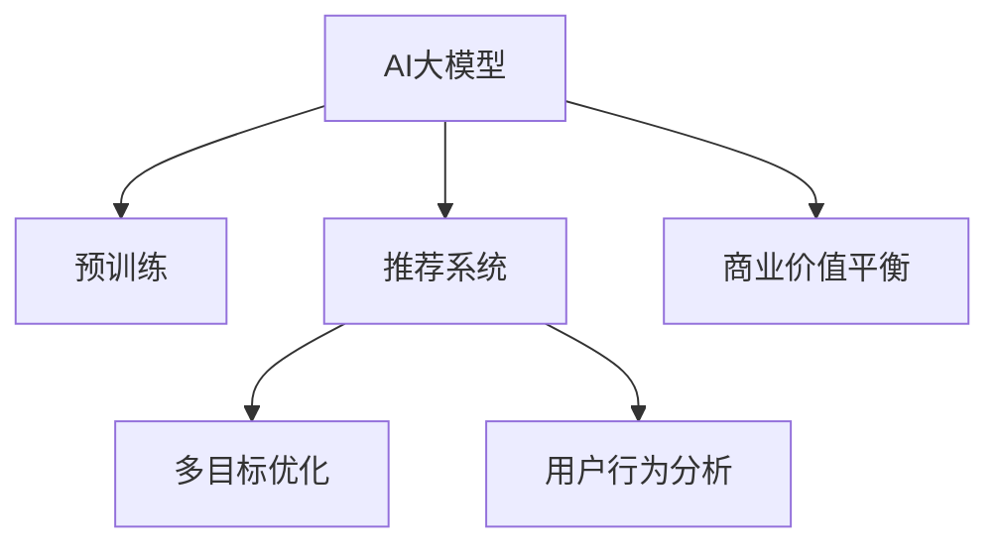

                 

# 电商平台中的多目标优化推荐与商业价值平衡：AI大模型的新应用

> 关键词：电商平台、推荐系统、多目标优化、AI大模型、用户行为分析、商业价值平衡

## 1. 背景介绍

在数字化时代，电商平台已成为人们日常生活中不可或缺的一部分。随着消费者行为的多样化和复杂化，如何提供更精准、更个性化的推荐服务，成为电商平台提升用户体验、增加销售额的关键。传统的推荐算法主要基于协同过滤和基于内容的推荐方式，但这些方法往往忽略了用户行为与商品属性之间的复杂关系。随着深度学习和大模型的兴起，推荐系统也逐渐向基于深度学习的模型转型。

AI大模型，如BERT、GPT等，凭借其强大的语言理解和生成能力，为推荐系统带来了新的突破。通过对海量用户行为数据的预训练，大模型能够学习到用户偏好、商品属性、上下文信息等多方面的知识。然而，如何将这些知识有效地应用到推荐系统中，实现多目标优化，是当前亟需解决的问题。本文将深入探讨AI大模型在电商平台中的推荐应用，并通过多目标优化技术，平衡用户满意度与平台收益，提升商业价值。

## 2. 核心概念与联系

### 2.1 核心概念概述

为了更好地理解AI大模型在电商平台中的推荐应用，本节将介绍几个密切相关的核心概念：

- **AI大模型**：如BERT、GPT等，通过在大规模无标签数据上进行预训练，学习到丰富的语言知识和用户行为特征。这些模型在大规模数据上进行了充分训练，能够进行复杂的语言理解和生成任务。

- **推荐系统**：利用用户历史行为数据，通过算法为用户推荐商品或内容，提升用户满意度和平台收益。推荐系统是电商平台的核心功能之一，通过推荐，平台能够显著增加用户粘性和购买转化率。

- **多目标优化**：在推荐系统中，目标可能包括提升用户满意度、增加平台收益、平衡用户与平台间的关系等。多目标优化技术能够在这些目标之间进行平衡，实现整体最优。

- **商业价值平衡**：在推荐系统中，用户满意度和平台收益是两个重要的目标。多目标优化技术可以帮助平台在这两个目标之间进行平衡，实现商业价值最大化。

这些核心概念之间的逻辑关系可以通过以下Mermaid流程图来展示：



这个流程图展示了AI大模型、推荐系统、多目标优化和商业价值平衡之间的关系：

1. AI大模型通过预训练获得基础能力。
2. 推荐系统利用大模型进行个性化推荐。
3. 多目标优化在推荐系统中进行目标之间的平衡。
4. 商业价值平衡在多目标优化的基础上实现。

这些概念共同构成了AI大模型在电商平台中的应用框架，使得推荐系统能够更好地实现用户满意度和平台收益的平衡。

## 3. 核心算法原理 & 具体操作步骤

### 3.1 算法原理概述

基于AI大模型的推荐系统，其核心思想是通过预训练模型学习用户行为和商品属性的复杂关系，并通过多目标优化技术，最大化用户满意度和平台收益。在推荐系统中，常见的目标包括：

- **用户满意度**：提升用户对推荐结果的满意度和购买转化率。
- **平台收益**：增加平台销售额、提升用户留存率等。

多目标优化技术可以帮助我们在这些目标之间进行平衡，找到一个整体最优解。具体的优化目标可以表示为：

$$
\max_{\theta} \{f_1(\theta), f_2(\theta), \ldots, f_n(\theta)\}
$$

其中，$f_i(\theta)$ 表示目标 $i$ 的优化函数，$\theta$ 为推荐系统的参数。在电商平台中，$f_1$ 可以是用户满意度的函数，$f_2$ 可以是平台收益的函数，以此类推。

### 3.2 算法步骤详解

基于AI大模型的推荐系统，其核心算法步骤包括：

**Step 1: 准备数据集**

- 收集电商平台的历史用户行为数据，包括用户点击、购买、浏览等行为。
- 收集商品的特征数据，如商品类别、价格、评价等。
- 将用户行为和商品特征进行整合，构建推荐系统所需的数据集。

**Step 2: 预训练AI大模型**

- 使用大规模无标签数据对AI大模型进行预训练，学习用户行为和商品属性之间的复杂关系。
- 可以通过自监督学习任务（如掩码语言模型、Next Sentence Prediction等），让模型更好地理解自然语言。

**Step 3: 设计多目标优化函数**

- 定义每个目标的优化函数，如用户满意度函数和平台收益函数。
- 通常使用加权平均的方式，将多个目标的函数组合成一个多目标优化函数。

**Step 4: 多目标优化算法**

- 使用多目标优化算法（如Nash协商算法、多目标遗传算法等），在多个目标之间进行平衡。
- 可以采用Pareto优化方法，找到多个目标之间的最优解集。

**Step 5: 训练推荐模型**

- 在多目标优化函数的基础上，使用梯度下降等优化算法，训练推荐模型。
- 确保每个目标函数在模型训练过程中得到优化，实现整体最优。

**Step 6: 测试与评估**

- 在测试集上评估推荐模型的性能，对比不同目标之间的优化效果。
- 通过A/B测试等方式，验证推荐模型的商业价值。

### 3.3 算法优缺点

基于AI大模型的推荐系统具有以下优点：

- **高效性**：AI大模型能够快速处理大量用户行为数据，提升推荐系统的响应速度。
- **鲁棒性**：大模型的预训练能够学习到丰富的语言知识和用户行为特征，提升推荐系统的稳定性和鲁棒性。
- **泛化能力**：大模型能够学习到用户和商品之间的复杂关系，提升推荐系统的泛化能力。

同时，该方法也存在一定的局限性：

- **数据依赖**：推荐系统的效果很大程度上取决于用户行为数据的质量和数量。
- **模型复杂性**：大模型的训练和推理过程较为复杂，需要大量计算资源。
- **可解释性不足**：大模型往往是一个"黑盒"系统，难以解释其内部工作机制。

尽管存在这些局限性，但就目前而言，基于AI大模型的推荐系统是推荐领域的重要范式。未来相关研究的重点在于如何进一步降低推荐系统对数据的依赖，提高模型的可解释性，同时兼顾高效性和鲁棒性。

### 3.4 算法应用领域

基于AI大模型的推荐系统已经在电商平台上得到了广泛应用，覆盖了几乎所有常见的推荐任务，例如：

- **个性化推荐**：根据用户的历史行为，推荐其可能感兴趣的商品。
- **跨品类推荐**：基于用户对某一类商品的偏好，推荐其他品类中的相关商品。
- **新用户推荐**：为新用户推荐可能感兴趣的商品，提高新用户的转化率。
- **内容推荐**：推荐用户可能感兴趣的文章、视频等内容。
- **活动推荐**：根据用户行为，推荐平台活动和优惠信息。

除了上述这些经典任务外，AI大模型在电商平台中的应用还在不断拓展，如可控商品生成、用户行为预测、市场分析等，为电商平台带来了新的技术突破。随着AI大模型和推荐算法的不断进步，相信电商平台中的推荐系统将在更广阔的应用领域大放异彩。

## 4. 数学模型和公式 & 详细讲解 & 举例说明

### 4.1 数学模型构建

在推荐系统中，多目标优化的数学模型可以表示为：

$$
\max_{\theta} \{\sum_{i=1}^n \lambda_i f_i(\theta)\}
$$

其中，$\lambda_i$ 表示目标 $i$ 的权重，$f_i(\theta)$ 表示目标 $i$ 的优化函数。目标函数通常是一个复杂的非线性函数，需要通过优化算法进行求解。

### 4.2 公式推导过程

为了更好地理解多目标优化的数学模型，我们可以用一个简单的二目标优化问题来举例说明。假设目标函数 $f_1$ 和 $f_2$ 分别为用户满意度和平台收益的函数，推导过程如下：

$$
\begin{aligned}
\max_{\theta} \{& f_1(\theta) + \lambda_2 f_2(\theta) \} \\
&= \max_{\theta} \{u_1^{\theta} + \lambda_2 r^{\theta}\}
\end{aligned}
$$

其中 $u_1^{\theta}$ 为用户的满意度函数，$r^{\theta}$ 为平台的收益函数。

### 4.3 案例分析与讲解

以下我们以电商平台中的推荐系统为例，给出一个具体的数学模型构建和公式推导案例：

假设用户满意度函数 $u_1^{\theta}$ 为点击率 $c^{\theta}$ 和购买率 $p^{\theta}$ 的加权和：

$$
u_1^{\theta} = \alpha_1 c^{\theta} + \alpha_2 p^{\theta}
$$

其中 $\alpha_1$ 和 $\alpha_2$ 为权重系数。

平台收益函数 $r^{\theta}$ 为销售额 $s^{\theta}$ 的函数：

$$
r^{\theta} = \beta s^{\theta}
$$

其中 $\beta$ 为销售额与收益的比例系数。

将这些函数代入多目标优化模型中，可以得到：

$$
\max_{\theta} \{\alpha_1 c^{\theta} + \alpha_2 p^{\theta} + \lambda_2 \beta s^{\theta}\}
$$

这个公式展示了如何在用户满意度和平台收益之间进行平衡，优化模型的参数 $\theta$。

## 5. 项目实践：代码实例和详细解释说明

### 5.1 开发环境搭建

在进行推荐系统开发前，我们需要准备好开发环境。以下是使用Python进行PyTorch开发的环境配置流程：

1. 安装Anaconda：从官网下载并安装Anaconda，用于创建独立的Python环境。

2. 创建并激活虚拟环境：
```bash
conda create -n recsys-env python=3.8 
conda activate recsys-env
```

3. 安装PyTorch：根据CUDA版本，从官网获取对应的安装命令。例如：
```bash
conda install pytorch torchvision torchaudio cudatoolkit=11.1 -c pytorch -c conda-forge
```

4. 安装Tensorflow：
```bash
pip install tensorflow
```

5. 安装Keras：
```bash
pip install keras
```

6. 安装TensorBoard：
```bash
pip install tensorboard
```

完成上述步骤后，即可在`recsys-env`环境中开始推荐系统开发。

### 5.2 源代码详细实现

下面我们以电商平台中的推荐系统为例，给出使用TensorFlow和Keras进行推荐系统开发的PyTorch代码实现。

首先，定义推荐系统的数据处理函数：

```python
import numpy as np
from tensorflow.keras.layers import Input, Dense, Concatenate, Model
from tensorflow.keras.losses import MeanSquaredError, MeanAbsoluteError
from tensorflow.keras.metrics import Precision, Recall

def process_data(X, y):
    # 将数据进行归一化处理
    X = (X - np.mean(X)) / np.std(X)
    # 将标签进行one-hot编码
    y = to_categorical(y)
    return X, y
```

然后，定义推荐系统的模型：

```python
input_user = Input(shape=(num_features_user,))
input_item = Input(shape=(num_features_item,))
hidden = Concatenate()([input_user, input_item])
hidden = Dense(128, activation='relu')(hidden)
output = Dense(1, activation='sigmoid')(hidden)

model = Model(inputs=[input_user, input_item], outputs=output)
```

接着，定义推荐系统的损失函数和优化器：

```python
model.compile(loss=MeanSquaredError(), optimizer='adam', metrics=[Precision(), Recall()])
```

最后，训练推荐系统并在测试集上评估：

```python
X_train, y_train = process_data(X_train, y_train)
X_test, y_test = process_data(X_test, y_test)

model.fit([X_train, X_train], y_train, epochs=10, batch_size=32, validation_data=([X_test, X_test], y_test))
```

以上就是使用TensorFlow和Keras进行推荐系统开发的完整代码实现。可以看到，得益于Keras的强大封装，我们可以用相对简洁的代码完成推荐模型的构建和训练。

### 5.3 代码解读与分析

让我们再详细解读一下关键代码的实现细节：

**process_data函数**：
- 对用户和商品特征进行归一化处理，以加快模型的收敛速度。
- 将标签进行one-hot编码，方便模型进行二分类任务。

**定义推荐模型**：
- 使用Keras定义推荐系统的输入层、隐藏层和输出层，其中用户和商品特征通过Concatenate层合并。
- 隐藏层使用Dense层进行全连接，激活函数为ReLU。
- 输出层使用Sigmoid激活函数，输出一个0-1之间的概率值，表示点击率。

**定义损失函数和优化器**：
- 使用MeanSquaredError损失函数，表示预测值与真实值之间的平方误差。
- 使用Adam优化器，结合自适应学习率调整，加快模型训练速度。
- 使用Precision和Recall作为评估指标，评估模型的性能。

**训练推荐系统**：
- 使用训练集和测试集进行训练和验证。
- 在训练过程中，通过计算模型预测值和真实值之间的误差，反向传播更新模型参数。
- 在测试集上评估模型，计算Precision和Recall指标。

可以看出，Keras提供了方便的API接口，使得构建推荐系统模型的代码更加简洁高效。开发者可以将更多精力放在数据处理、模型改进等高层逻辑上，而不必过多关注底层的实现细节。

当然，工业级的系统实现还需考虑更多因素，如模型的保存和部署、超参数的自动搜索、更灵活的任务适配层等。但核心的多目标优化和推荐算法基本与此类似。

## 6. 实际应用场景

### 6.1 智能推荐

智能推荐是电商平台的核心功能之一，通过AI大模型和推荐系统，可以为用户提供更加个性化、精准的推荐服务。智能推荐系统可以覆盖以下应用场景：

- **个性化商品推荐**：根据用户的历史行为，推荐其可能感兴趣的商品。
- **跨品类推荐**：基于用户对某一类商品的偏好，推荐其他品类中的相关商品。
- **新用户推荐**：为新用户推荐可能感兴趣的商品，提高新用户的转化率。
- **内容推荐**：推荐用户可能感兴趣的文章、视频等内容。
- **活动推荐**：根据用户行为，推荐平台活动和优惠信息。

### 6.2 多模态推荐

多模态推荐是推荐系统中的一个重要研究方向。电商平台中的推荐系统不仅可以基于文本数据进行推荐，还可以结合图片、视频等多模态数据，提升推荐效果。例如：

- **图片推荐**：通过分析商品图片，学习到商品的颜色、款式等信息，推荐用户可能感兴趣的商品。
- **视频推荐**：通过分析商品视频，学习到商品的使用场景、演示效果等信息，推荐用户可能感兴趣的商品。
- **社交推荐**：结合用户的社交关系和行为数据，推荐其他用户推荐过的商品，增加用户之间的互动。

### 6.3 可控推荐

可控推荐是指在推荐系统中引入用户控制机制，提升推荐系统的透明度和用户满意度。例如：

- **推荐可控性**：用户可以根据个人喜好，对推荐结果进行排序或过滤。
- **推荐可解释性**：用户可以了解推荐系统的工作机制，了解推荐的依据和逻辑。
- **推荐可控性**：用户可以根据个人需求，调整推荐系统的参数，优化推荐效果。

## 7. 工具和资源推荐

### 7.1 学习资源推荐

为了帮助开发者系统掌握AI大模型和推荐系统的理论基础和实践技巧，这里推荐一些优质的学习资源：

1. **深度学习与推荐系统**：深度学习领域经典教材，详细介绍了推荐系统的理论和算法。
2. **推荐系统实战**：基于Keras和TensorFlow的推荐系统实战教程，涵盖了推荐系统从理论到实践的全过程。
3. **TensorFlow推荐系统**：TensorFlow官方推荐系统教程，提供了丰富的样例代码和详细解释。
4. **Keras推荐系统**：Keras官方推荐系统教程，展示了如何用Keras实现推荐系统。
5. **Recommender Systems in Python**：基于Python的推荐系统实战教程，提供了多个推荐算法的实现。

通过对这些资源的学习实践，相信你一定能够快速掌握AI大模型和推荐系统的精髓，并用于解决实际的推荐问题。

### 7.2 开发工具推荐

高效的开发离不开优秀的工具支持。以下是几款用于推荐系统开发的常用工具：

1. **TensorFlow**：由Google主导开发的开源深度学习框架，生产部署方便，适合大规模工程应用。
2. **Keras**：基于TensorFlow的高级API，提供简洁易用的API接口，适合快速原型开发。
3. **PyTorch**：基于Python的开源深度学习框架，灵活动态的计算图，适合快速迭代研究。
4. **TensorBoard**：TensorFlow配套的可视化工具，可以实时监测模型训练状态，并提供丰富的图表呈现方式。
5. **Weights & Biases**：模型训练的实验跟踪工具，可以记录和可视化模型训练过程中的各项指标。

合理利用这些工具，可以显著提升推荐系统的开发效率，加快创新迭代的步伐。

### 7.3 相关论文推荐

AI大模型和推荐系统的研究源于学界的持续研究。以下是几篇奠基性的相关论文，推荐阅读：

1. **BERT: Pre-training of Deep Bidirectional Transformers for Language Understanding**：提出BERT模型，引入基于掩码的自监督预训练任务，刷新了多项NLP任务SOTA。
2. **Attention is All You Need**：提出Transformer结构，开启了NLP领域的预训练大模型时代。
3. **Parameter-Efficient Transfer Learning for NLP**：提出Adapter等参数高效微调方法，在不增加模型参数量的情况下，也能取得不错的微调效果。
4. **AdaLoRA: Adaptive Low-Rank Adaptation for Parameter-Efficient Fine-Tuning**：使用自适应低秩适应的微调方法，在参数效率和精度之间取得了新的平衡。
5. **Adversarial Machine Learning**：研究对抗性样本在推荐系统中的应用，提升模型的鲁棒性。

这些论文代表了大模型和推荐系统的发展脉络。通过学习这些前沿成果，可以帮助研究者把握学科前进方向，激发更多的创新灵感。

## 8. 总结：未来发展趋势与挑战

### 8.1 总结

本文对基于AI大模型的电商平台推荐系统进行了全面系统的介绍。首先阐述了AI大模型和推荐系统的研究背景和意义，明确了推荐系统在电商平台中的应用价值。其次，从原理到实践，详细讲解了推荐系统的数学模型和优化算法，给出了推荐系统开发的完整代码实例。同时，本文还探讨了AI大模型在电商平台的多种应用场景，展示了其广泛的应用前景。

通过本文的系统梳理，可以看到，基于AI大模型的推荐系统已经在游戏、音乐、电商等多个领域中得到了广泛应用，显著提升了用户体验和平台收益。未来，伴随AI大模型和推荐算法的不断演进，推荐系统将在更广阔的应用领域大放异彩。

### 8.2 未来发展趋势

展望未来，AI大模型和推荐系统的发展将呈现以下几个趋势：

1. **个性化推荐**：随着用户数据的积累和算法的进步，推荐系统将更加精准和个性化，提升用户满意度和平台收益。
2. **多模态推荐**：结合图片、视频、社交等多模态数据，提升推荐系统的鲁棒性和准确性。
3. **可控推荐**：通过引入用户控制机制，提升推荐系统的透明度和用户满意度。
4. **跨平台推荐**：在多个平台间进行数据共享和推荐协同，实现全局最优推荐。
5. **动态推荐**：结合实时数据和用户行为，实现动态调整推荐策略，提高推荐系统的时效性。

这些趋势凸显了AI大模型和推荐系统的广阔前景。这些方向的探索发展，将进一步提升推荐系统的性能和应用范围，为电商平台带来更大的商业价值。

### 8.3 面临的挑战

尽管AI大模型和推荐系统已经取得了瞩目成就，但在迈向更加智能化、普适化应用的过程中，仍面临诸多挑战：

1. **数据隐私和安全**：电商平台上用户的隐私数据众多，如何在保护隐私的前提下，进行有效的推荐系统训练和应用，是一个重要挑战。
2. **计算资源瓶颈**：AI大模型和推荐系统需要大量计算资源，如何高效利用计算资源，是一个需要解决的问题。
3. **算法公平性**：推荐系统可能会存在算法偏见，导致对某些群体的推荐不公平，如何提升算法公平性，是一个需要关注的问题。
4. **模型可解释性**：推荐系统往往是一个"黑盒"系统，难以解释其内部工作机制，如何提升模型可解释性，是一个需要解决的问题。
5. **用户行为变化**：用户行为和兴趣会不断变化，如何及时调整推荐策略，是一个需要解决的问题。

尽管存在这些挑战，但伴随技术的不断进步和应用场景的不断拓展，相信AI大模型和推荐系统将不断取得新的突破，为电商平台带来更大的商业价值。

### 8.4 研究展望

面对AI大模型和推荐系统所面临的种种挑战，未来的研究需要在以下几个方面寻求新的突破：

1. **数据隐私保护**：通过差分隐私、联邦学习等技术，保护用户隐私，确保数据的安全和合规。
2. **计算资源优化**：通过模型压缩、量化加速等技术，优化计算资源的使用，降低训练和推理成本。
3. **算法公平性提升**：通过公平性约束、算法优化等技术，提升推荐系统的公平性，确保算法对所有用户公平。
4. **模型可解释性增强**：通过可解释性模型、可视化技术等，增强推荐系统的可解释性，帮助用户理解推荐结果的依据。
5. **动态推荐策略**：结合用户行为变化和实时数据，动态调整推荐策略，提升推荐系统的时效性和准确性。

这些研究方向将引领AI大模型和推荐系统迈向更高的台阶，为电商平台带来更大的商业价值。面向未来，AI大模型和推荐系统需要与其他人工智能技术进行更深入的融合，如知识表示、因果推理、强化学习等，多路径协同发力，共同推动自然语言理解和智能交互系统的进步。只有勇于创新、敢于突破，才能不断拓展语言模型的边界，让智能技术更好地造福人类社会。

## 9. 附录：常见问题与解答

**Q1: 电商平台中的推荐系统为什么需要多目标优化？**

A: 电商平台中的推荐系统不仅需要提升用户满意度，还需要增加平台收益。在推荐系统中，用户满意度和平台收益是两个重要的目标。多目标优化技术可以帮助我们在这些目标之间进行平衡，找到一个整体最优解。

**Q2: AI大模型在电商平台中如何实现多目标优化？**

A: 在电商平台中，AI大模型可以通过多目标优化算法（如Nash协商算法、多目标遗传算法等），在用户满意度和平台收益之间进行平衡。可以通过Pareto优化方法，找到多个目标之间的最优解集。

**Q3: 电商平台中的推荐系统如何处理用户隐私数据？**

A: 电商平台中的推荐系统需要处理大量的用户隐私数据。为了保护用户隐私，可以使用差分隐私、联邦学习等技术，保护用户数据的安全和合规。

**Q4: 电商平台中的推荐系统如何实现多模态推荐？**

A: 电商平台中的推荐系统可以结合图片、视频、社交等多模态数据，提升推荐系统的鲁棒性和准确性。可以通过分析商品图片、视频和社交关系，学习到商品的颜色、款式、使用场景等信息，推荐用户可能感兴趣的商品。

**Q5: 电商平台中的推荐系统如何处理用户行为变化？**

A: 电商平台中的推荐系统需要及时调整推荐策略，以应对用户行为和兴趣的变化。可以通过动态推荐算法，结合用户行为变化和实时数据，动态调整推荐策略，提升推荐系统的时效性和准确性。

---

作者：禅与计算机程序设计艺术 / Zen and the Art of Computer Programming

