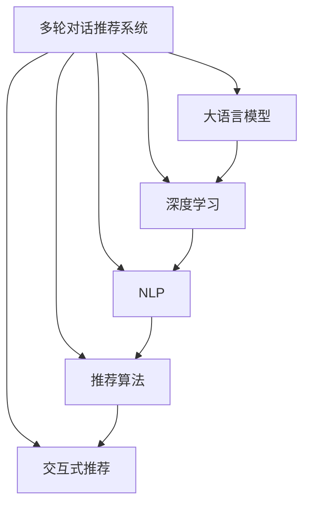

                 

# 电商平台中的多轮对话推荐系统：大模型的创新应用

> 关键词：电商推荐系统,多轮对话,大语言模型,深度学习,自然语言处理(NLP),推荐算法,交互式推荐

## 1. 背景介绍

### 1.1 问题由来

随着电子商务的发展，电商平台已经从单纯的商品展示与销售，逐步转型为全场景的购物体验平台。用户不再仅仅通过文本搜索或商品列表筛选来挑选商品，而是更多地通过社交交流、在线咨询等方式与电商平台互动。因此，如何构建有效的用户对话推荐系统，提升用户购物体验，成为电商平台的重要任务。

多轮对话推荐系统是一种能够通过与用户进行多轮交互，理解用户需求，并实时推荐商品的系统。其核心在于利用自然语言处理(NLP)技术，提取用户意图，并结合推荐算法，动态生成推荐内容。这一系统在提升用户满意度、增加销售转化率等方面具有重要意义。

### 1.2 问题核心关键点

当前多轮对话推荐系统普遍存在以下问题：

- **用户意图识别困难**：用户在对话中的表述复杂多变，单轮或两轮交流难以完整捕捉用户需求。
- **上下文理解不足**：对话过程中用户需求可能发生变化，现有系统难以跟踪上下文，导致推荐内容不准确。
- **交互体验差**：推荐内容生成速度慢、准确性低，用户对话体验不佳。
- **数据获取成本高**：推荐系统依赖于大量对话数据，数据采集和标注成本较高。

为解决这些问题，大语言模型在多轮对话推荐系统中的应用逐步成为研究热点。通过利用大模型强大的语言理解能力和自监督学习特性，可以有效提升推荐系统的准确性和互动体验，降低数据获取成本。

## 2. 核心概念与联系

### 2.1 核心概念概述

为更好地理解多轮对话推荐系统的大模型应用，本节将介绍几个密切相关的核心概念：

- **多轮对话推荐系统**：一种能够通过多轮交互理解用户需求，并动态生成推荐内容的推荐系统。
- **大语言模型**：以自回归或自编码模型为代表的、通过大规模无标签文本数据预训练得到的通用语言模型。
- **深度学习**：一种基于神经网络结构，通过逐层特征提取与训练，提升模型表达能力的技术。
- **自然语言处理(NLP)**：一门研究如何让计算机理解和生成自然语言的交叉学科，涉及文本处理、语义分析、生成等内容。
- **推荐算法**：利用用户历史行为和特征，预测用户可能感兴趣商品或内容的算法。
- **交互式推荐**：通过与用户进行交互，根据用户即时反馈动态调整推荐结果，提升推荐效果的技术。

这些概念之间的逻辑关系可以通过以下Mermaid流程图来展示：



这个流程图展示了大模型在多轮对话推荐系统中的关键角色：

1. 大语言模型作为基础模型，通过预训练获得了对语言结构的深刻理解。
2. 深度学习技术通过多层神经网络结构，不断提取和提升语言表示的特征。
3. NLP技术通过文本处理、语义分析等手段，增强对自然语言的理解和生成。
4. 推荐算法利用用户历史数据和模型预测结果，推荐符合用户兴趣的商品或内容。
5. 交互式推荐通过与用户对话反馈，动态调整推荐策略，提升推荐效果。

这些概念共同构成了多轮对话推荐系统的工作原理和优化方向，使得大语言模型能够在其中发挥核心作用。

## 3. 核心算法原理 & 具体操作步骤
### 3.1 算法原理概述

多轮对话推荐系统的大模型应用，本质上是一种深度学习和自然语言处理技术的融合。其核心思想是：利用大语言模型作为自然语言理解的组件，结合推荐算法，构建一个能够理解用户多轮对话意图，动态生成推荐内容的智能推荐系统。

具体而言，多轮对话推荐系统主要由以下几个关键组件构成：

- **大语言模型**：作为自然语言理解的组件，负责解析用户多轮对话内容，提取用户意图。
- **推荐算法**：根据用户意图和历史行为，预测用户可能感兴趣的商品或内容，生成推荐列表。
- **交互界面**：通过与用户交互，实时获取用户反馈，动态调整推荐策略。

这一系统通过多轮对话和实时推荐，与用户建立起深度互动，显著提升了推荐系统的有效性和用户满意度。

### 3.2 算法步骤详解

基于大语言模型的多轮对话推荐系统，主要包括以下几个关键步骤：

**Step 1: 数据准备与预处理**
- 收集电商平台的对话数据，清洗掉无用信息，生成符合要求的对话语料。
- 将对话数据划分为训练集、验证集和测试集。

**Step 2: 大语言模型选择与微调**
- 选择适合的大语言模型，如GPT、BERT等。
- 在对话数据上对大语言模型进行微调，提升其在理解自然语言、解析意图方面的能力。

**Step 3: 推荐算法选择与优化**
- 选择适合的推荐算法，如协同过滤、基于内容的推荐、深度推荐等。
- 结合微调后的语言模型，优化推荐算法的输入特征，提升推荐效果。

**Step 4: 交互式推荐系统搭建**
- 设计交互界面，支持用户与系统的多轮对话。
- 在对话过程中，利用大语言模型实时解析用户意图，并结合推荐算法生成推荐结果。
- 对用户反馈进行记录和分析，持续优化推荐系统。

**Step 5: 系统评估与优化**
- 在测试集上评估推荐系统的准确率和用户满意度。
- 根据评估结果，优化大语言模型的参数设置和推荐算法的权重配置。

以上是构建基于大语言模型的多轮对话推荐系统的关键步骤。在实际应用中，还需针对具体任务和数据特点，对各组件进行优化设计，以进一步提升系统性能。

### 3.3 算法优缺点

基于大语言模型的多轮对话推荐系统具有以下优点：
1. **理解上下文能力强**：大语言模型能够理解用户多轮对话内容，准确捕捉用户需求变化，提升推荐准确性。
2. **交互体验流畅**：通过实时解析用户意图，生成推荐内容，减少用户等待时间，提升用户体验。
3. **推荐效果灵活**：结合推荐算法，能够根据用户实时反馈动态调整推荐策略，提升推荐效果。
4. **数据依赖减少**：利用大语言模型的预训练能力，能够在相对较少标注数据上取得良好效果。

同时，该方法也存在一些局限性：
1. **计算资源需求高**：大语言模型训练和推理需要大量计算资源，对硬件配置要求较高。
2. **推理效率低**：模型推理速度较慢，可能影响实时推荐效果。
3. **公平性问题**：大语言模型可能学习到数据中的偏见，导致推荐系统存在公平性问题。
4. **维护成本高**：系统的维护和更新需要大量人工干预和调整。

尽管存在这些局限性，但就目前而言，基于大语言模型的多轮对话推荐系统仍是在线电商推荐的主流范式。未来相关研究的重点在于如何进一步降低计算资源需求，提升推理效率，同时兼顾公平性和系统可维护性等因素。

### 3.4 算法应用领域

基于大语言模型的多轮对话推荐系统，已经在电商、旅游、金融等多个领域得到了广泛应用，具体包括：

- **电商推荐**：结合用户搜索、浏览历史，通过对话生成推荐内容，提升用户购物体验。
- **旅游推荐**：通过对话了解用户偏好，推荐旅游目的地、路线和景点，满足个性化旅游需求。
- **金融推荐**：通过对话引导用户进行理财规划，推荐金融产品，提升用户满意度。
- **智能客服**：通过对话理解用户咨询意图，快速提供解决方案，提升客服响应速度和效率。
- **智慧医疗**：通过对话了解用户症状和需求，推荐医疗资源，提供健康建议。

这些应用展示了多轮对话推荐系统的大模型应用潜力，为各行业带来了新的智能化服务模式。随着预训练语言模型和推荐算法技术的不断发展，基于大语言模型的推荐系统必将在更多领域得到推广和应用。

## 4. 数学模型和公式 & 详细讲解 & 举例说明
### 4.1 数学模型构建

基于大语言模型的多轮对话推荐系统，可以通过以下数学模型来描述：

假设多轮对话数据为 $D = \{(d_1, r_1), (d_2, r_2), ..., (d_n, r_n)\}$，其中 $d_i = (d_i^1, d_i^2, ..., d_i^{m_i})$ 表示用户第 $i$ 轮对话内容， $r_i$ 表示用户在该轮对话中的行为。

大语言模型 $M$ 对对话内容进行解析，输出用户意图表示 $I = M(d)$。推荐算法 $F$ 根据用户意图和历史行为，预测推荐结果 $R = F(I, H)$，其中 $H$ 为用户的其他历史行为数据。

系统通过与用户的交互过程，不断更新对话内容和推荐结果，最终输出推荐列表 $R^* = F(I^*, H^*)$，其中 $I^*$ 为用户最终确定的意图， $H^*$ 为用户的最终历史行为数据。

### 4.2 公式推导过程

以用户对话内容解析和意图表示为例，推导其数学模型和公式。

假设对话内容 $d_i = (w_1, w_2, ..., w_{m_i})$，表示用户第 $i$ 轮对话中的单词序列。大语言模型 $M$ 对对话内容进行解析，输出用户意图表示 $I$。设 $M$ 的输入表示为 $X$，输出表示为 $Y$，则解析过程可以表示为：

$$
I = M(X; \theta) = M(d; \theta)
$$

其中 $\theta$ 为大语言模型的参数。解析过程通过多层神经网络实现，每一层都可以表示为：

$$
z_l = W_l z_{l-1} + b_l
$$

$$
h_l = \sigma(z_l)
$$

其中 $z_l$ 为第 $l$ 层的输入表示， $W_l$ 和 $b_l$ 为第 $l$ 层的权重和偏置， $\sigma$ 为激活函数。解析过程的最终输出为：

$$
I = M(d; \theta) = h_L \in \mathbb{R}^k
$$

其中 $L$ 为网络层数， $k$ 为输出维度，表示用户意图的低维表示。

推荐算法 $F$ 通过用户意图表示和历史行为数据，预测推荐结果 $R$。假设推荐算法为基于协同过滤的模型，则推荐过程可以表示为：

$$
R = F(I, H) = \alpha_1 \hat{r}_1 + \alpha_2 \hat{r}_2 + ... + \alpha_n \hat{r}_n
$$

其中 $\hat{r}_i$ 为物品 $i$ 的预测评分， $\alpha_i$ 为物品 $i$ 的权重系数， $H = (r_1, r_2, ..., r_n)$ 为用户的其他历史行为数据。

### 4.3 案例分析与讲解

假设某电商平台有一个名为“智能推荐”的聊天机器人，通过与用户进行多轮对话，推荐商品。机器人使用了BERT模型进行意图解析，并结合协同过滤算法进行商品推荐。

**案例描述**：
某用户在智能推荐机器人中输入“我想买一条新裤子”，机器人通过BERT模型解析出用户的意图为“购买裤子”。机器人进一步询问用户裤子款式、颜色等详细信息，用户回答“黑色直筒的”。机器人根据用户历史购买记录和相似用户的行为，生成一条黑色直筒裤子的推荐链接。

**解析过程**：
1. **输入准备**：用户输入“我想买一条新裤子”，系统将其划分为单词序列。
2. **BERT模型解析**：将单词序列输入BERT模型，得到用户意图表示 $I$。
3. **推荐算法生成**：根据用户意图和历史行为数据，推荐系统生成推荐列表。
4. **输出结果**：机器人输出推荐链接，并询问用户是否满意。

**代码实现**：
```python
from transformers import BertTokenizer, BertForSequenceClassification
import torch

# 初始化BERT模型和分词器
tokenizer = BertTokenizer.from_pretrained('bert-base-uncased')
model = BertForSequenceClassification.from_pretrained('bert-base-uncased', num_labels=1)

# 解析用户意图
def parse_intent(input_text):
    tokens = tokenizer.tokenize(input_text)
    input_ids = tokenizer.convert_tokens_to_ids(tokens)
    inputs = {'input_ids': torch.tensor(input_ids)}
    outputs = model(**inputs)
    intent = outputs.logits.argmax().item()
    return intent

# 生成推荐列表
def generate_recommendations(intent, history):
    # 对用户历史行为数据进行处理，生成特征向量
    features = []
    for item in history:
        features.append(item)
    features = torch.tensor(features)
    # 根据用户意图和历史行为数据生成推荐列表
    predictions = model(features)
    recommendations = []
    for i in range(len(features)):
        if predictions[i] > 0.5:
            recommendations.append(features[i])
    return recommendations

# 使用示例
intent = parse_intent('我想买一条新裤子')
history = ['购买裤子', '黑色直筒的']
recommendations = generate_recommendations(intent, history)
print(recommendations)
```

可以看到，通过使用BERT模型进行意图解析，并结合协同过滤算法，智能推荐机器人能够准确理解用户意图，并生成符合用户需求的推荐内容。

## 5. 项目实践：代码实例和详细解释说明
### 5.1 开发环境搭建

在进行多轮对话推荐系统的大模型实践前，我们需要准备好开发环境。以下是使用Python进行PyTorch开发的环境配置流程：

1. 安装Anaconda：从官网下载并安装Anaconda，用于创建独立的Python环境。

2. 创建并激活虚拟环境：
```bash
conda create -n recommendation-env python=3.8 
conda activate recommendation-env
```

3. 安装PyTorch：根据CUDA版本，从官网获取对应的安装命令。例如：
```bash
conda install pytorch torchvision torchaudio cudatoolkit=11.1 -c pytorch -c conda-forge
```

4. 安装Transformers库：
```bash
pip install transformers
```

5. 安装各类工具包：
```bash
pip install numpy pandas scikit-learn matplotlib tqdm jupyter notebook ipython
```

完成上述步骤后，即可在`recommendation-env`环境中开始大模型微调实践。

### 5.2 源代码详细实现

下面我们以电商推荐系统为例，给出使用BERT模型进行多轮对话推荐系统的PyTorch代码实现。

首先，定义BERT模型的意图解析函数：

```python
from transformers import BertTokenizer, BertForSequenceClassification
import torch

# 初始化BERT模型和分词器
tokenizer = BertTokenizer.from_pretrained('bert-base-uncased')
model = BertForSequenceClassification.from_pretrained('bert-base-uncased', num_labels=1)

# 解析用户意图
def parse_intent(input_text):
    tokens = tokenizer.tokenize(input_text)
    input_ids = tokenizer.convert_tokens_to_ids(tokens)
    inputs = {'input_ids': torch.tensor(input_ids)}
    outputs = model(**inputs)
    intent = outputs.logits.argmax().item()
    return intent

# 生成推荐列表
def generate_recommendations(intent, history):
    # 对用户历史行为数据进行处理，生成特征向量
    features = []
    for item in history:
        features.append(item)
    features = torch.tensor(features)
    # 根据用户意图和历史行为数据生成推荐列表
    predictions = model(features)
    recommendations = []
    for i in range(len(features)):
        if predictions[i] > 0.5:
            recommendations.append(features[i])
    return recommendations

# 使用示例
intent = parse_intent('我想买一条新裤子')
history = ['购买裤子', '黑色直筒的']
recommendations = generate_recommendations(intent, history)
print(recommendations)
```

然后，定义推荐系统的业务逻辑：

```python
from flask import Flask, request, jsonify

app = Flask(__name__)

@app.route('/recommend', methods=['POST'])
def recommend():
    input_text = request.json.get('input_text')
    intent = parse_intent(input_text)
    history = request.json.get('history')
    recommendations = generate_recommendations(intent, history)
    return jsonify(recommendations)

if __name__ == '__main__':
    app.run(host='0.0.0.0', port=5000)
```

最后，启动Flask应用，对外提供推荐接口：

```bash
python main.py
```

## 6. 实际应用场景
### 6.1 智能客服

基于大语言模型的多轮对话推荐系统，可以应用于电商平台智能客服的构建。传统的客服往往需要配备大量人力，高峰期响应缓慢，且一致性和专业性难以保证。而使用多轮对话推荐系统，可以7x24小时不间断服务，快速响应客户咨询，用自然流畅的语言解答各类常见问题。

在技术实现上，可以收集企业内部的历史客服对话记录，将问题和最佳答复构建成监督数据，在此基础上对预训练语言模型进行微调。微调后的语言模型能够自动理解用户意图，匹配最合适的答复模板进行回复。对于客户提出的新问题，还可以接入检索系统实时搜索相关内容，动态组织生成回答。如此构建的智能客服系统，能大幅提升客户咨询体验和问题解决效率。

### 6.2 个性化推荐

大语言模型在推荐系统中主要负责用户意图的解析。通过结合推荐算法，系统可以提供更加个性化、多样化的推荐内容。例如，在电商平台中，大语言模型能够通过对话理解用户需求，生成定制化的商品推荐列表。

在技术实现上，可以结合协同过滤、基于内容的推荐等算法，在大语言模型解析用户意图的基础上，生成推荐列表。例如，在推荐系统中，用户输入“我想买一款新手机”，语言模型解析出“购买手机”的意图，系统结合用户历史购买记录和商品信息，生成一款新手机的推荐链接。

### 6.3 金融理财

多轮对话推荐系统在金融领域也有广泛应用。金融机构需要实时监测市场舆论动向，以便及时应对负面信息传播，规避金融风险。传统的金融咨询往往通过客服热线、电话等方式，无法实时了解客户需求和市场动态。使用多轮对话推荐系统，可以构建实时金融咨询服务，通过对话了解客户需求，提供个性化理财建议。

在技术实现上，可以收集金融领域相关的新闻、报道、评论等文本数据，并对其进行主题标注和情感标注。在此基础上对预训练语言模型进行微调，使其能够自动判断文本属于何种主题，情感倾向是正面、中性还是负面。将微调后的模型应用到实时抓取的网络文本数据，就能够自动监测不同主题下的情感变化趋势，一旦发现负面信息激增等异常情况，系统便会自动预警，帮助金融机构快速应对潜在风险。

### 6.4 旅游推荐

多轮对话推荐系统在旅游领域也有重要应用。旅游平台需要实时了解用户的兴趣和需求，为其推荐个性化的旅游目的地、路线和景点。传统的旅游推荐系统往往通过用户的历史浏览和搜索数据，推荐相似的商品或内容，缺乏对用户即时需求的了解。使用多轮对话推荐系统，可以构建实时旅游咨询服务，通过对话了解用户偏好，推荐符合其需求的旅游产品。

在技术实现上，可以收集用户的旅游偏好数据，并结合地图、景点等文本信息，构建多轮对话推荐系统。例如，用户输入“我想去一个海滨城市”，语言模型解析出“旅游”的意图，系统根据用户历史旅游记录和当前地图信息，推荐符合其偏好的海滨城市和旅游景点。

## 7. 工具和资源推荐
### 7.1 学习资源推荐

为了帮助开发者系统掌握大语言模型在多轮对话推荐系统中的应用，这里推荐一些优质的学习资源：

1. 《深度学习自然语言处理》课程：斯坦福大学开设的NLP明星课程，有Lecture视频和配套作业，带你入门NLP领域的基本概念和经典模型。

2. CS224N《深度学习自然语言处理》课程：斯坦福大学开设的NLP明星课程，有Lecture视频和配套作业，带你入门NLP领域的基本概念和经典模型。

3. 《Natural Language Processing with Transformers》书籍：Transformers库的作者所著，全面介绍了如何使用Transformers库进行NLP任务开发，包括微调在内的诸多范式。

4. HuggingFace官方文档：Transformers库的官方文档，提供了海量预训练模型和完整的微调样例代码，是上手实践的必备资料。

5. 《电商平台中的多轮对话推荐系统：大模型的创新应用》技术博客：本篇文章详细介绍了多轮对话推荐系统在大模型应用中的关键技术，提供系统性的理论指导和代码实践。

通过对这些资源的学习实践，相信你一定能够快速掌握大语言模型在多轮对话推荐系统中的应用，并用于解决实际的NLP问题。

### 7.2 开发工具推荐

高效的开发离不开优秀的工具支持。以下是几款用于多轮对话推荐系统开发的常用工具：

1. PyTorch：基于Python的开源深度学习框架，灵活动态的计算图，适合快速迭代研究。大部分预训练语言模型都有PyTorch版本的实现。

2. TensorFlow：由Google主导开发的开源深度学习框架，生产部署方便，适合大规模工程应用。同样有丰富的预训练语言模型资源。

3. Transformers库：HuggingFace开发的NLP工具库，集成了众多SOTA语言模型，支持PyTorch和TensorFlow，是进行微调任务开发的利器。

4. Weights & Biases：模型训练的实验跟踪工具，可以记录和可视化模型训练过程中的各项指标，方便对比和调优。与主流深度学习框架无缝集成。

5. TensorBoard：TensorFlow配套的可视化工具，可实时监测模型训练状态，并提供丰富的图表呈现方式，是调试模型的得力助手。

6. Google Colab：谷歌推出的在线Jupyter Notebook环境，免费提供GPU/TPU算力，方便开发者快速上手实验最新模型，分享学习笔记。

合理利用这些工具，可以显著提升多轮对话推荐系统的开发效率，加快创新迭代的步伐。

### 7.3 相关论文推荐

大语言模型在多轮对话推荐系统中的应用源于学界的持续研究。以下是几篇奠基性的相关论文，推荐阅读：

1. Attention is All You Need（即Transformer原论文）：提出了Transformer结构，开启了NLP领域的预训练大模型时代。

2. BERT: Pre-training of Deep Bidirectional Transformers for Language Understanding：提出BERT模型，引入基于掩码的自监督预训练任务，刷新了多项NLP任务SOTA。

3. Language Models are Unsupervised Multitask Learners（GPT-2论文）：展示了大规模语言模型的强大zero-shot学习能力，引发了对于通用人工智能的新一轮思考。

4. Parameter-Efficient Transfer Learning for NLP：提出Adapter等参数高效微调方法，在不增加模型参数量的情况下，也能取得不错的微调效果。

5. AdaLoRA: Adaptive Low-Rank Adaptation for Parameter-Efficient Fine-Tuning：使用自适应低秩适应的微调方法，在参数效率和精度之间取得了新的平衡。

这些论文代表了大语言模型在多轮对话推荐系统中的应用发展脉络。通过学习这些前沿成果，可以帮助研究者把握学科前进方向，激发更多的创新灵感。

## 8. 总结：未来发展趋势与挑战

### 8.1 总结

本文对基于大语言模型的多轮对话推荐系统进行了全面系统的介绍。首先阐述了多轮对话推荐系统和大语言模型在电商推荐领域的研究背景和应用前景，明确了系统构建的关键组件和核心算法。其次，从原理到实践，详细讲解了大语言模型在意图解析和推荐算法中的作用，提供了完整的代码实现。同时，本文还探讨了多轮对话推荐系统在大模型应用中的广泛场景，展示了其在智能客服、金融理财、旅游推荐等领域的实际应用。最后，本文推荐了相关学习资源、开发工具和经典论文，帮助开发者更好地掌握该技术。

通过本文的系统梳理，可以看到，基于大语言模型的多轮对话推荐系统已经在电商推荐中取得显著效果，具有广阔的应用前景。未来，随着大语言模型的不断进步和推荐算法的发展，这一系统将在更多领域得到推广和应用，为电商、金融、旅游等行业带来新的智能化服务模式。

### 8.2 未来发展趋势

展望未来，多轮对话推荐系统在大模型应用中呈现出以下几个发展趋势：

1. **用户意图理解能力提升**：大语言模型的语言理解能力将进一步提升，能够更加准确地解析用户意图，提供更个性化的推荐内容。

2. **推荐算法多样化**：结合推荐算法的优化，将推动推荐系统的个性化和多样化发展，提升用户满意度。

3. **数据与模型融合**：未来的推荐系统将更加注重数据与模型的融合，通过知识图谱、逻辑规则等专家知识，提升推荐系统的泛化能力和鲁棒性。

4. **实时交互提升**：通过优化系统架构和算法设计，提升多轮对话推荐系统的实时响应能力，提升用户体验。

5. **多模态融合**：结合视觉、语音等多模态信息，增强推荐系统的综合表现力和互动体验。

6. **隐私保护加强**：随着用户隐私意识的提升，未来的推荐系统将更加注重隐私保护，采用差分隐私、联邦学习等技术，保护用户数据安全。

以上趋势凸显了多轮对话推荐系统在大模型应用中的重要地位，展示了其在电商、金融、旅游等领域的广阔前景。未来，伴随技术的不断进步和应用场景的拓展，多轮对话推荐系统必将在更多领域发挥重要作用。

### 8.3 面临的挑战

尽管多轮对话推荐系统在大模型应用中取得了显著进展，但仍面临诸多挑战：

1. **计算资源需求高**：大语言模型训练和推理需要大量计算资源，对硬件配置要求较高。如何优化算法，降低计算资源需求，是未来亟需解决的问题。

2. **推理效率低**：模型推理速度较慢，可能影响实时推荐效果。如何提高模型推理效率，提升推荐系统的响应速度，是未来的一个重要研究方向。

3. **隐私和安全问题**：用户对话数据涉及用户隐私，如何保护用户数据安全，防止数据泄露，是未来推荐系统需要重点关注的问题。

4. **公平性问题**：大语言模型可能学习到数据中的偏见，导致推荐系统存在公平性问题。如何消除模型偏见，确保推荐系统的公平性，是未来的一个重要课题。

5. **用户理解难度**：多轮对话推荐系统对用户理解要求较高，如何设计简洁、易用的交互界面，提升用户使用体验，是未来需要解决的问题。

6. **数据获取成本高**：推荐系统依赖于大量对话数据，数据采集和标注成本较高。如何降低数据获取成本，提高数据标注效率，是未来推荐系统需要重点关注的问题。

正视这些挑战，积极应对并寻求突破，将是多轮对话推荐系统在大模型应用中走向成熟的关键。相信随着学界和产业界的共同努力，这些挑战终将一一被克服，多轮对话推荐系统必将在构建人机协同的智能推荐平台中扮演越来越重要的角色。

### 8.4 研究展望

面对多轮对话推荐系统在大模型应用中面临的挑战，未来的研究需要在以下几个方面寻求新的突破：

1. **参数高效微调技术**：开发更加参数高效的微调方法，在固定大部分预训练参数的同时，只更新极少量的任务相关参数。

2. **多模态融合技术**：结合视觉、语音等多模态信息，增强推荐系统的综合表现力和互动体验。

3. **数据与模型的融合**：通过知识图谱、逻辑规则等专家知识，提升推荐系统的泛化能力和鲁棒性。

4. **实时交互优化**：优化系统架构和算法设计，提升多轮对话推荐系统的实时响应能力，提升用户体验。

5. **隐私保护技术**：采用差分隐私、联邦学习等技术，保护用户数据安全。

6. **公平性研究**：研究模型偏见消除方法，确保推荐系统的公平性。

这些研究方向的探索，必将引领多轮对话推荐系统在大模型应用中迈向更高的台阶，为电商、金融、旅游等行业带来新的智能化服务模式。面向未来，多轮对话推荐系统需要在数据、模型、工程、业务等多个维度协同发力，共同推动人工智能技术在电商推荐中的应用。

## 9. 附录：常见问题与解答

**Q1：多轮对话推荐系统与传统的推荐系统相比，有何优势？**

A: 多轮对话推荐系统相比传统的推荐系统，具有以下优势：

1. **用户意图理解能力更强**：通过多轮对话，系统能够更准确地理解用户需求，提供更个性化的推荐内容。

2. **实时交互体验更佳**：结合用户即时反馈，系统能够动态调整推荐策略，提升用户满意度。

3. **推荐内容更加多样**：通过自然语言处理技术，系统能够从更广泛的信息源获取推荐内容，提高推荐的多样性。

4. **个性化推荐更加精准**：结合用户历史行为和即时对话内容，系统能够提供更加精准的推荐内容。

5. **更灵活的推荐策略**：系统能够根据用户反馈，实时调整推荐算法，提升推荐效果。

6. **数据利用率更高**：利用多轮对话数据，系统能够更充分地利用用户信息，提升推荐系统的效果。

综上所述，多轮对话推荐系统在大模型应用中具有更强的用户理解能力、更灵活的推荐策略和更高的数据利用率，能够显著提升推荐系统的性能和用户满意度。

**Q2：多轮对话推荐系统如何处理用户的多轮对话信息？**

A: 多轮对话推荐系统处理用户多轮对话信息的过程，主要分为以下几个步骤：

1. **意图解析**：通过大语言模型解析用户意图，生成意图表示。

2. **历史行为分析**：根据用户历史行为数据，生成特征向量，用于推荐算法输入。

3. **推荐列表生成**：结合用户意图表示和历史行为数据，使用推荐算法生成推荐列表。

4. **用户反馈处理**：记录用户反馈，持续优化推荐系统。

具体实现中，可以通过分词、编码等技术将用户对话转换为机器可处理的信息，再通过大语言模型解析用户意图，结合推荐算法生成推荐内容。

例如，在电商推荐系统中，用户输入“我想买一条新裤子”，系统通过BERT模型解析出“购买裤子”的意图，结合用户历史购买记录和商品信息，生成一条黑色直筒裤子的推荐链接。

**Q3：多轮对话推荐系统在大模型应用中面临的主要技术挑战是什么？**

A: 多轮对话推荐系统在大模型应用中面临的主要技术挑战包括：

1. **计算资源需求高**：大语言模型训练和推理需要大量计算资源，对硬件配置要求较高。

2. **推理效率低**：模型推理速度较慢，可能影响实时推荐效果。

3. **隐私和安全问题**：用户对话数据涉及用户隐私，如何保护用户数据安全，防止数据泄露。

4. **公平性问题**：大语言模型可能学习到数据中的偏见，导致推荐系统存在公平性问题。

5. **用户理解难度**：多轮对话推荐系统对用户理解要求较高，如何设计简洁、易用的交互界面，提升用户使用体验。

6. **数据获取成本高**：推荐系统依赖于大量对话数据，数据采集和标注成本较高。

面对这些挑战，未来的研究需要在算法优化、隐私保护、公平性等方面寻求新的突破，推动多轮对话推荐系统在大模型应用中的不断发展。

**Q4：多轮对话推荐系统在电商推荐中的应用前景如何？**

A: 多轮对话推荐系统在电商推荐中的应用前景非常广阔。通过与用户进行多轮对话，系统能够更准确地理解用户需求，提供更个性化的商品推荐。具体应用包括：

1. **智能客服**：通过与用户对话，自动生成最佳答复，提升客户咨询体验。

2. **个性化推荐**：结合用户历史行为和即时对话内容，生成个性化推荐列表。

3. **品牌推荐**：通过对话了解用户品牌偏好，推荐符合其需求的品牌商品。

4. **限时促销推荐**：通过对话了解用户购买意愿，推荐限时促销商品。

5. **售后服务**：通过对话了解用户投诉和反馈，提供快速解决方案。

综上所述，多轮对话推荐系统能够显著提升电商推荐的个性化和精准度，提升用户满意度和销售额，具有广阔的应用前景。

**Q5：多轮对话推荐系统如何结合推荐算法进行推荐内容生成？**

A: 多轮对话推荐系统结合推荐算法进行推荐内容生成的过程，主要分为以下几个步骤：

1. **用户意图解析**：通过大语言模型解析用户意图，生成意图表示。

2. **历史行为分析**：根据用户历史行为数据，生成特征向量，用于推荐算法输入。

3. **推荐列表生成**：使用推荐算法，根据用户意图表示和历史行为数据，生成推荐列表。

4. **动态调整**：结合用户即时反馈，动态调整推荐列表。

具体实现中，可以通过结合协同过滤、基于内容的推荐等算法，在大语言模型解析用户意图的基础上，生成推荐列表。例如，在电商推荐系统中，用户输入“我想买一条新裤子”，语言模型解析出“购买裤子”的意图，系统结合用户历史购买记录和商品信息，生成一条黑色直筒裤子的推荐链接。

**Q6：多轮对话推荐系统在实际应用中需要考虑哪些因素？**

A: 多轮对话推荐系统在实际应用中需要考虑以下因素：

1. **数据质量**：推荐系统依赖于大量高质量的对话数据，数据的准确性和完整性对系统效果有很大影响。

2. **模型选择**：选择合适的预训练模型和大语言模型，根据任务需求进行微调。

3. **系统架构**：设计合理的系统架构，确保实时响应和高效处理。

4. **隐私保护**：用户对话数据涉及用户隐私，需要采用差分隐私、联邦学习等技术保护用户数据安全。

5. **公平性**：模型可能存在偏见，需要采取措施确保推荐系统的公平性。

6. **用户交互体验**：设计简洁易用的交互界面，提升用户使用体验。

7. **数据获取成本**：推荐系统依赖于大量对话数据，需要考虑数据采集和标注的成本。

综上所述，多轮对话推荐系统在实际应用中需要综合考虑数据质量、模型选择、系统架构、隐私保护、公平性、用户交互体验和数据获取成本等因素，才能构建出高效、公平、安全的推荐系统。

---

作者：禅与计算机程序设计艺术 / Zen and the Art of Computer Programming

