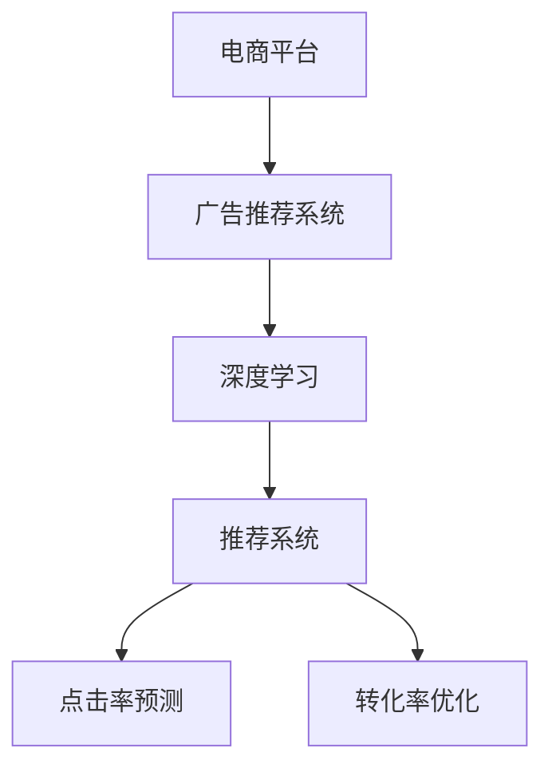

                 

# 电商平台中的实时个性化广告投放系统

> 关键词：电商平台,实时广告投放,个性化推荐,深度学习,推荐系统

## 1. 背景介绍

### 1.1 问题由来
随着互联网的普及和电子商务的迅猛发展，电商平台的广告业务也日益重要。电商广告是商家推广商品、提高曝光和转化的主要手段之一。传统的批量广告投放模式存在效率低下、成本浪费、用户体验差等问题，难以精准匹配用户需求和商家目标。为此，各大电商平台纷纷引入智能广告推荐系统，通过深度学习和大数据技术，实时动态地向用户推送个性化广告，大大提升了广告投放的精度和效率。

### 1.2 问题核心关键点
电商平台的广告推荐系统需要具备以下核心能力：
1. **个性化推荐**：根据用户历史行为、兴趣偏好、商品信息等，实时生成个性化广告。
2. **实时性**：广告内容根据用户行为实时调整，提升用户体验。
3. **点击率预测**：预测广告被点击的概率，优化广告投放策略。
4. **转化率优化**：评估广告的实际转化效果，调整广告投放参数。
5. **鲁棒性**：具备应对异常数据和噪声的鲁棒性，保证推荐系统的稳定性和可靠性。

### 1.3 问题研究意义
研究电商平台的广告推荐系统，对于提升广告投放的精准度和效果，降低广告成本，改善用户体验，具有重要意义：

1. **精准投放**：通过深度学习和大数据技术，实现广告的精准推荐，避免资源浪费，提升商家投放效果。
2. **提高效率**：实时动态地调整广告内容，提升用户满意度，增加平台流量和转化率。
3. **数据驱动**：基于用户历史行为和兴趣，生成个性化推荐，增强用户粘性和忠诚度。
4. **动态优化**：通过点击率和转化率等关键指标，动态优化广告投放策略，持续提升广告效果。
5. **技术创新**：利用深度学习和推荐算法，实现智能化的广告推荐，为电商平台提供新的技术动力。

## 2. 核心概念与联系

### 2.1 核心概念概述

为更好地理解电商平台的广告推荐系统，本节将介绍几个密切相关的核心概念：

- **电商平台**：即电子商店，通过互联网提供商品销售、交易和服务的平台。
- **广告推荐系统**：根据用户行为和商品信息，实时生成个性化的广告推荐，并动态调整广告投放策略的系统。
- **深度学习**：一种基于人工神经网络的学习方法，能够从大量数据中自动提取特征，用于分类、回归等任务。
- **推荐系统**：通过分析用户历史行为和偏好，生成个性化推荐，提升用户体验和转化率。
- **点击率预测**：预测广告被点击的概率，优化广告投放策略。
- **转化率优化**：评估广告的实际转化效果，调整广告投放参数。

这些核心概念之间的逻辑关系可以通过以下Mermaid流程图来展示：



这个流程图展示了大语言模型的核心概念及其之间的关系：

1. 电商平台通过广告推荐系统向用户推送个性化广告。
2. 广告推荐系统利用深度学习技术提取用户行为特征，用于个性化推荐。
3. 推荐系统基于用户行为和商品信息，生成个性化广告推荐。
4. 点击率预测和转化率优化用于评估广告效果，动态调整广告策略。

这些概念共同构成了电商平台的广告推荐系统的核心逻辑框架，使其能够高效、精准地生成个性化广告，提升广告投放效果。

## 3. 核心算法原理 & 具体操作步骤
### 3.1 算法原理概述

电商平台的广告推荐系统通常采用深度学习和推荐算法相结合的范式，具体包括：

1. **用户行为建模**：通过分析用户历史行为和兴趣，构建用户画像。
2. **商品信息挖掘**：提取商品标题、描述、属性等信息，构建商品特征向量。
3. **广告推荐算法**：根据用户画像和商品特征，生成个性化广告推荐。
4. **点击率预测模型**：利用用户行为和广告特征，预测广告被点击的概率。
5. **转化率优化模型**：评估广告的实际转化效果，调整广告投放策略。

### 3.2 算法步骤详解

电商平台广告推荐系统的一般流程包括：

**Step 1: 数据预处理**
- 收集用户历史行为数据，包括浏览记录、购买记录、评分记录等。
- 提取商品信息，如标题、描述、价格、类别等，构建商品特征向量。
- 对数据进行归一化、分词、去重等预处理操作。

**Step 2: 用户行为建模**
- 利用用户历史行为数据，构建用户兴趣模型，如协同过滤、基于内容的推荐、矩阵分解等。
- 将用户兴趣模型应用于商品库，生成个性化广告推荐。

**Step 3: 广告推荐算法**
- 利用用户画像和商品特征，生成候选广告列表。
- 采用深度学习模型，如CTR(点击率)预测模型、DNN(深度神经网络)等，对候选广告进行排序，生成最终推荐列表。

**Step 4: 点击率预测**
- 利用用户行为和广告特征，构建点击率预测模型。
- 使用深度学习模型，如MLP、CNN、RNN等，对用户行为和广告特征进行编码，训练点击率预测模型。

**Step 5: 转化率优化**
- 评估广告的实际转化效果，如点击到购买的转化率。
- 利用A/B测试、多臂老虎机等方法，优化广告投放策略，提升广告效果。

**Step 6: 模型训练和评估**
- 利用历史数据集，训练点击率预测模型和转化率优化模型。
- 在测试集上评估模型性能，如AUC、点击率、转化率等指标。
- 根据模型评估结果，调整模型参数和超参数。

**Step 7: 实时广告投放**
- 实时获取用户行为数据，动态生成个性化广告推荐。
- 实时计算点击率预测模型和转化率优化模型，优化广告投放策略。
- 根据实时用户行为数据，实时调整广告内容，提升广告效果。

以上是电商平台广告推荐系统的一般流程。在实际应用中，还需要根据具体业务场景和需求，对各个环节进行优化设计，如改进数据预处理方法，引入更多的广告特征，搜索最优的模型参数等，以进一步提升广告推荐效果。

### 3.3 算法优缺点

电商平台的广告推荐系统具有以下优点：
1. 精准投放：通过深度学习和推荐算法，实现广告的精准推荐，提升投放效果。
2. 实时性：实时动态地调整广告内容，提升用户体验。
3. 数据驱动：基于用户历史行为和兴趣，生成个性化推荐，增强用户粘性和忠诚度。
4. 动态优化：通过点击率和转化率等关键指标，动态优化广告投放策略，持续提升广告效果。
5. 技术创新：利用深度学习和推荐算法，实现智能化的广告推荐，为电商平台提供新的技术动力。

同时，该方法也存在一定的局限性：
1. 数据依赖：广告推荐系统的性能很大程度上取决于用户历史行为数据的质量和数量，获取高质量用户数据成本较高。
2. 模型复杂：深度学习模型往往结构复杂，训练和推理速度较慢，需要高性能计算资源。
3. 模型泛化：在面对新商品或新用户时，广告推荐系统需要重新训练模型，难以适应快速变化的市场需求。
4. 隐私问题：广告推荐系统需要收集用户行为数据，存在用户隐私泄露的风险。
5. 鲁棒性不足：面对异常数据和噪声，广告推荐系统的鲁棒性有待提高，可能导致推荐结果偏差。

尽管存在这些局限性，但就目前而言，深度学习和推荐算法的结合仍是广告推荐系统的主流范式。未来相关研究的重点在于如何进一步降低对用户数据的依赖，提高模型泛化能力和鲁棒性，同时兼顾隐私保护和模型效率等因素。

### 3.4 算法应用领域

电商平台的广告推荐系统已经在电商广告、金融推荐、社交媒体推荐等多个领域得到广泛应用，提升了广告投放的精准度和效果：

- **电商广告**：根据用户浏览和购买历史，生成个性化广告推荐，提高广告点击率和转化率。
- **金融推荐**：根据用户交易行为和风险偏好，生成个性化的理财产品推荐，增加用户粘性和收益。
- **社交媒体推荐**：根据用户兴趣和互动数据，生成个性化内容推荐，增加平台流量和用户活跃度。

除了上述这些经典应用外，广告推荐系统还被创新性地应用于更多场景中，如智能客服、智能搜索、广告素材生成等，为电商平台和相关领域带来了新的业务价值。

## 4. 数学模型和公式 & 详细讲解 & 举例说明

### 4.1 数学模型构建

在本节中，我们将使用数学语言对电商平台广告推荐系统的核心算法进行严格刻画。

假设广告推荐系统的用户画像为 $\mathbf{u} \in \mathbb{R}^d$，商品特征向量为 $\mathbf{v} \in \mathbb{R}^d$，广告特征向量为 $\mathbf{w} \in \mathbb{R}^d$，点击率预测模型为 $f: \mathbb{R}^d \times \mathbb{R}^d \times \mathbb{R}^d \rightarrow \mathbb{R}$，转化率优化模型为 $g: \mathbb{R}^d \times \mathbb{R}^d \rightarrow \mathbb{R}$。

广告点击率预测模型为：

$$
\hat{y} = f(\mathbf{u}, \mathbf{v}, \mathbf{w})
$$

其中 $\hat{y} \in [0,1]$ 表示广告被点击的概率。

广告转化率优化模型为：

$$
\hat{\theta} = g(\mathbf{u}, \mathbf{v}, \mathbf{w})
$$

其中 $\hat{\theta} \in \mathbb{R}^k$ 表示广告转化的参数。

### 4.2 公式推导过程

以下是广告推荐系统的核心数学模型的推导过程：

**点击率预测模型**：
假设用户画像 $\mathbf{u}$、商品特征向量 $\mathbf{v}$、广告特征向量 $\mathbf{w}$ 的编码分别为 $\mathbf{u}_e$、$\mathbf{v}_e$、$\mathbf{w}_e$，点击率预测模型为：

$$
\hat{y} = \sigma(\mathbf{u}_e \cdot \mathbf{v}_e + \mathbf{w}_e)
$$

其中 $\sigma(x)$ 为 sigmoid 函数。

**转化率优化模型**：
假设用户画像 $\mathbf{u}$、商品特征向量 $\mathbf{v}$、广告特征向量 $\mathbf{w}$ 的编码分别为 $\mathbf{u}_e$、$\mathbf{v}_e$、$\mathbf{w}_e$，转化率优化模型为：

$$
\hat{\theta} = \mathbf{u}_e \cdot \mathbf{v}_e + \mathbf{w}_e
$$

其中 $\mathbf{u}_e \in \mathbb{R}^d$、$\mathbf{v}_e \in \mathbb{R}^d$、$\mathbf{w}_e \in \mathbb{R}^d$ 分别为用户画像、商品特征向量、广告特征向量的编码。

### 4.3 案例分析与讲解

下面我们以电商平台的个性化广告推荐系统为例，展示广告推荐模型在实际应用中的推导和实现。

假设用户画像 $\mathbf{u} \in \mathbb{R}^d$ 包含用户浏览历史、购买记录、评分等信息，商品特征向量 $\mathbf{v} \in \mathbb{R}^d$ 包含商品标题、描述、价格、类别等信息，广告特征向量 $\mathbf{w} \in \mathbb{R}^d$ 包含广告内容、关键词、展示时间等信息。

**广告点击率预测模型**：
利用用户画像 $\mathbf{u}$、商品特征向量 $\mathbf{v}$、广告特征向量 $\mathbf{w}$，构建点击率预测模型：

$$
\hat{y} = \sigma(\mathbf{u}_e \cdot \mathbf{v}_e + \mathbf{w}_e)
$$

其中 $\mathbf{u}_e$、$\mathbf{v}_e$、$\mathbf{w}_e$ 分别为用户画像、商品特征向量、广告特征向量的编码。

**广告转化率优化模型**：
利用用户画像 $\mathbf{u}$、商品特征向量 $\mathbf{v}$、广告特征向量 $\mathbf{w}$，构建转化率优化模型：

$$
\hat{\theta} = \mathbf{u}_e \cdot \mathbf{v}_e + \mathbf{w}_e
$$

其中 $\mathbf{u}_e$、$\mathbf{v}_e$、$\mathbf{w}_e$ 分别为用户画像、商品特征向量、广告特征向量的编码。

## 5. 项目实践：代码实例和详细解释说明
### 5.1 开发环境搭建

在进行广告推荐系统开发前，我们需要准备好开发环境。以下是使用Python进行TensorFlow开发的环境配置流程：

1. 安装Anaconda：从官网下载并安装Anaconda，用于创建独立的Python环境。

2. 创建并激活虚拟环境：
```bash
conda create -n tf-env python=3.8 
conda activate tf-env
```

3. 安装TensorFlow：根据CUDA版本，从官网获取对应的安装命令。例如：
```bash
conda install tensorflow -c pytorch -c conda-forge
```

4. 安装Keras：Keras是一个高级神经网络API，可以简化TensorFlow的使用，推荐安装。
```bash
pip install keras
```

5. 安装各类工具包：
```bash
pip install numpy pandas scikit-learn matplotlib tqdm jupyter notebook ipython
```

完成上述步骤后，即可在`tf-env`环境中开始广告推荐系统开发。

### 5.2 源代码详细实现

下面我们以电商平台的个性化广告推荐系统为例，给出使用TensorFlow进行广告推荐模型的PyTorch代码实现。

首先，定义广告推荐系统的训练函数：

```python
from tensorflow.keras import models, layers, optimizers, losses
from tensorflow.keras.layers import Dense, Input

def train_model(X_train, y_train, X_test, y_test):
    # 定义模型输入和输出
    input_layer = Input(shape=(X_train.shape[1],))
    user_feature = layers.Dense(64, activation='relu')(input_layer)
    item_feature = layers.Dense(64, activation='relu')(input_layer)
    ad_feature = layers.Dense(64, activation='relu')(input_layer)
    
    # 点击率预测
    click_prob = Dense(1, activation='sigmoid')(layers.concatenate([user_feature, item_feature, ad_feature]))
    
    # 转化率预测
    conv_rate = Dense(1)(layers.concatenate([user_feature, item_feature, ad_feature]))
    
    # 构建模型
    model = models.Model(inputs=[input_layer], outputs=[click_prob, conv_rate])
    
    # 定义损失函数
    click_loss = losses.BinaryCrossentropy()(model.output[0], y_train)
    conv_loss = losses.MeanSquaredError()(model.output[1], y_train)
    
    # 定义优化器
    optimizer = optimizers.Adam(lr=0.001)
    
    # 训练模型
    model.compile(optimizer=optimizer, loss=[click_loss, conv_rate], metrics=['accuracy'])
    model.fit(X_train, y_train, validation_data=(X_test, y_test), epochs=10, batch_size=32)
    
    return model
```

然后，定义广告推荐系统的测试函数：

```python
def test_model(model, X_test, y_test):
    # 在测试集上评估模型性能
    loss, acc = model.evaluate(X_test, y_test, verbose=0)
    print(f'Test loss: {loss:.4f}')
    print(f'Test accuracy: {acc:.4f}')
```

最后，启动训练流程并在测试集上评估：

```python
# 数据准备
X_train = ...
y_train = ...
X_test = ...
y_test = ...

# 训练模型
model = train_model(X_train, y_train, X_test, y_test)

# 测试模型
test_model(model, X_test, y_test)
```

以上就是使用TensorFlow对广告推荐系统进行训练和测试的完整代码实现。可以看到，通过Keras框架的封装，我们可以用相对简洁的代码完成广告推荐模型的构建和训练。

### 5.3 代码解读与分析

让我们再详细解读一下关键代码的实现细节：

**train_model函数**：
- `Input`层：定义模型输入。
- `Dense`层：将输入特征映射到更高维度的特征空间，并引入非线性激活函数。
- `click_prob`层：利用用户特征、商品特征、广告特征，构建点击率预测模型。
- `conv_rate`层：利用用户特征、商品特征、广告特征，构建转化率预测模型。
- `Model`类：将多个层级组合成完整的广告推荐模型。
- `BinaryCrossentropy`和`MeanSquaredError`：定义点击率和转化率的损失函数。
- `Adam`优化器：选择Adam优化器进行模型训练。
- `compile`和`fit`方法：构建模型并开始训练。

**test_model函数**：
- `evaluate`方法：在测试集上评估模型的性能，包括损失和准确率。

**训练流程**：
- 定义训练数据集和测试数据集。
- 调用`train_model`函数，训练广告推荐模型。
- 调用`test_model`函数，在测试集上评估模型性能。

可以看到，TensorFlow通过Keras框架的封装，使得广告推荐系统的开发更加便捷高效。开发者可以将更多精力放在模型设计、数据处理等高层逻辑上，而不必过多关注底层的实现细节。

当然，工业级的系统实现还需考虑更多因素，如模型的保存和部署、超参数的自动搜索、更灵活的任务适配层等。但核心的广告推荐范式基本与此类似。

## 6. 实际应用场景
### 6.1 电商广告推荐

电商平台的广告推荐系统已经在实际应用中大放异彩。通过广告推荐系统，电商平台能够实时动态地向用户推送个性化广告，提升广告点击率和转化率，降低广告成本，提高平台流量和销售转化。

具体而言，电商广告推荐系统可以应用于以下场景：
1. **首页广告推荐**：根据用户浏览历史和行为数据，实时推荐商品广告。
2. **搜索广告推荐**：根据用户搜索历史和点击行为，推荐相关商品广告。
3. **购物车广告推荐**：根据用户购物车中的商品信息，推荐类似商品广告。
4. **个性化页内广告**：根据用户访问页面的内容，推荐相关商品广告。

通过这些广告推荐场景，电商平台能够显著提升广告投放的精准度和效果，为商家带来更高的收益和用户满意度。

### 6.2 金融产品推荐

金融平台同样可以利用广告推荐系统，实现个性化产品推荐，提高用户粘性和收益。金融推荐系统可以应用于以下场景：
1. **理财广告推荐**：根据用户历史交易记录和风险偏好，推荐理财产品广告。
2. **信用卡广告推荐**：根据用户信用评分和消费行为，推荐信用卡广告。
3. **保险产品推荐**：根据用户历史保单信息和健康记录，推荐保险产品广告。

金融推荐系统通过精准的广告推荐，不仅能够提升平台流量和用户转化，还能增加平台收益，具有重要的商业价值。

### 6.3 社交媒体内容推荐

社交媒体平台同样可以利用广告推荐系统，实现个性化内容推荐，增加平台流量和用户活跃度。社交媒体推荐系统可以应用于以下场景：
1. **新闻内容推荐**：根据用户浏览历史和兴趣标签，推荐相关新闻内容。
2. **视频内容推荐**：根据用户观看历史和互动数据，推荐相关视频内容。
3. **社区话题推荐**：根据用户讨论历史和兴趣标签，推荐相关话题内容。

通过这些内容推荐场景，社交媒体平台能够显著提升用户粘性和活跃度，为平台带来更多的流量和收益。

### 6.4 未来应用展望

随着广告推荐系统的不断发展，其在更多领域的应用前景也将不断拓展。

在智慧医疗领域，广告推荐系统可以用于推荐医疗信息、健康产品等，提升医疗服务的智能化水平，帮助用户更好地了解和管理健康。

在智能教育领域，广告推荐系统可以用于推荐学习资源、在线课程等，帮助用户更高效地学习和提升技能。

在智慧城市治理中，广告推荐系统可以用于推荐城市事件、公共服务等信息，提高城市管理的自动化和智能化水平，构建更安全、高效的城市环境。

此外，在企业生产、社会治理、文娱传媒等众多领域，广告推荐系统也将不断涌现，为各行各业带来新的技术动力，提升其数字化和智能化水平。

## 7. 工具和资源推荐
### 7.1 学习资源推荐

为了帮助开发者系统掌握广告推荐系统的理论基础和实践技巧，这里推荐一些优质的学习资源：

1. 《深度学习理论与实践》系列博文：由深度学习领域专家撰写，深入浅出地介绍了深度学习的基本概念和核心算法。

2. CS231n《深度学习视觉与语言》课程：斯坦福大学开设的视觉与语言深度学习课程，涵盖了视觉特征提取、视觉语言对齐等前沿话题。

3. 《Deep Learning with Python》书籍：以Python语言为工具，介绍了深度学习模型的构建、训练和应用。

4. TensorFlow官方文档：TensorFlow官方提供的详细文档，涵盖了深度学习模型的搭建、训练、优化等技术细节。

5. Keras官方文档：Keras官方提供的详细文档，介绍了高级神经网络API的使用方法，简单易用。

通过对这些资源的学习实践，相信你一定能够快速掌握广告推荐系统的精髓，并用于解决实际的推荐问题。

### 7.2 开发工具推荐

高效的开发离不开优秀的工具支持。以下是几款用于广告推荐系统开发的常用工具：

1. TensorFlow：由Google主导开发的深度学习框架，生产部署方便，适合大规模工程应用。

2. Keras：高级神经网络API，可以简化TensorFlow的使用，适合快速迭代研究。

3. PyTorch：灵活的深度学习框架，适合动态图和动态计算图的操作，适合科研和快速原型开发。

4. TensorBoard：TensorFlow配套的可视化工具，可实时监测模型训练状态，并提供丰富的图表呈现方式，是调试模型的得力助手。

5. Weights & Biases：模型训练的实验跟踪工具，可以记录和可视化模型训练过程中的各项指标，方便对比和调优。

6. Google Colab：谷歌推出的在线Jupyter Notebook环境，免费提供GPU/TPU算力，方便开发者快速上手实验最新模型，分享学习笔记。

合理利用这些工具，可以显著提升广告推荐系统的开发效率，加快创新迭代的步伐。

### 7.3 相关论文推荐

广告推荐系统的发展源于学界的持续研究。以下是几篇奠基性的相关论文，推荐阅读：

1. D. Qu: Personalized Recommendation Algorithms in E-commerce: A Survey on Applications and Recommendation Methods. IEEE Transactions on Knowledge and Data Engineering, 2006.

2. P. S. Yu and V. S. Lee: Maximizing the Profit of Selling Items through Advertisement on the Web. In Proceedings of the 12th International Conference on World Wide Web, 2003.

3. B. Sedimea and I. Suchak: Recommender Systems: Survey and Experiments. ACM Computing Surveys, 2007.

4. R. Heinrich et al.: AdRank: A rank-based click-through rate prediction for personalized search. In Proceedings of the 9th ACM Conference on Recommender Systems, 2015.

5. D. Metcalfe et al.: What You See Is What You Click: Using Click-Through Rates to Train Predictive Models of User Behavior. In Proceedings of the 20th International Conference on World Wide Web, 2011.

这些论文代表了大语言模型微调技术的发展脉络。通过学习这些前沿成果，可以帮助研究者把握学科前进方向，激发更多的创新灵感。

## 8. 总结：未来发展趋势与挑战

### 8.1 总结

本文对电商平台中的广告推荐系统进行了全面系统的介绍。首先阐述了广告推荐系统的背景和核心能力，明确了其在电商广告、金融推荐、社交媒体推荐等多个领域的应用价值。其次，从原理到实践，详细讲解了广告推荐系统的数学模型和核心算法，给出了广告推荐模型在实际应用中的推导和实现。同时，本文还广泛探讨了广告推荐系统在电商广告、金融推荐、社交媒体推荐等多个领域的应用前景，展示了广告推荐范式的巨大潜力。

通过本文的系统梳理，可以看到，广告推荐系统在电商平台上已经取得了显著的应用效果，提升了广告投放的精准度和效果，降低了广告成本，提高了平台流量和销售转化。未来，伴随深度学习和推荐算法的持续演进，广告推荐系统将带来更广阔的应用前景，为电商平台和相关领域带来新的技术动力。

### 8.2 未来发展趋势

展望未来，广告推荐系统的未来发展趋势包括：

1. **数据驱动**：更多依赖用户行为数据和外部知识，实现更加个性化和精准的推荐。
2. **实时性提升**：实现秒级甚至毫秒级的广告推荐，提升用户体验和广告效果。
3. **模型融合**：融合多模态数据和多领域知识，提升广告推荐系统的泛化能力和鲁棒性。
4. **隐私保护**：在推荐过程中保护用户隐私，增强用户信任和满意度。
5. **智能决策**：引入决策树、强化学习等智能决策方法，优化广告投放策略。
6. **跨平台应用**：将广告推荐系统应用于多个平台和设备，实现跨平台推荐。

这些趋势将推动广告推荐系统在更广阔的领域和场景中发挥作用，为电商平台和相关行业带来更多的业务价值。

### 8.3 面临的挑战

尽管广告推荐系统已经取得了显著成效，但在迈向更加智能化、普适化应用的过程中，它仍面临诸多挑战：

1. **数据稀疏**：在电商平台上，用户历史行为数据往往不足，难以构建精准的推荐模型。如何有效处理数据稀疏问题，是广告推荐系统面临的重要挑战。
2. **冷启动问题**：对于新用户和新商品，缺乏足够的历史行为数据，难以生成有效的推荐结果。如何实现冷启动，提升新用户和新商品的推荐效果，也是广告推荐系统面临的重要问题。
3. **模型泛化**：在面对新用户和新商品时，广告推荐系统需要重新训练模型，难以适应快速变化的市场需求。如何提升广告推荐模型的泛化能力，是未来研究的重要方向。
4. **广告欺诈**：部分用户会通过恶意点击广告获取利益，给广告主带来损失。如何识别和防止广告欺诈，保护广告主利益，也是广告推荐系统需要解决的问题。
5. **隐私保护**：广告推荐系统需要收集用户行为数据，存在用户隐私泄露的风险。如何保护用户隐私，增强用户信任和满意度，也是广告推荐系统面临的重要挑战。
6. **计算资源**：广告推荐系统的计算资源需求较高，需要高性能计算设备和算法优化，以降低计算成本和提高模型效率。

这些挑战需要在数据处理、模型设计、系统架构等多个方面进行综合优化，才能实现广告推荐系统的进一步发展和应用。

### 8.4 研究展望

面对广告推荐系统所面临的诸多挑战，未来的研究需要在以下几个方面寻求新的突破：

1. **数据增强**：通过数据增强技术，提升广告推荐系统的数据质量和多样性，减少数据稀疏和冷启动问题。
2. **模型优化**：引入深度学习、强化学习等先进算法，提升广告推荐系统的模型泛化能力和鲁棒性。
3. **跨领域融合**：融合多领域知识，如知识图谱、语义网络等，提升广告推荐系统的智能决策能力和泛化能力。
4. **隐私保护**：引入隐私保护技术，如差分隐私、联邦学习等，保护用户隐私，增强用户信任和满意度。
5. **系统优化**：优化广告推荐系统的计算资源，提高广告推荐模型的效率和实时性。

这些研究方向的探索，必将推动广告推荐系统迈向更高的台阶，为电商平台和相关领域带来更多的业务价值。相信随着技术不断进步，广告推荐系统将能够在更广阔的应用领域发挥作用，深刻影响人类社会的生产生活方式。

