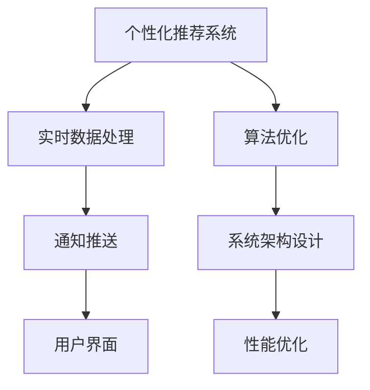

                 

# 电商平台中的实时个性化通知推送系统

> 关键词：实时通知推送, 个性化推荐, 推荐系统, 用户行为分析, 算法优化, 系统架构设计, 性能优化, 案例分析

## 1. 背景介绍

在现代电商平台上，个性化推荐已成为提升用户满意度和业务增长的重要手段。个性化推荐系统能够根据用户的浏览、购买历史，结合实时数据，向用户推送定制化的商品和服务，大幅提高转化率和留存率。然而，个性化推荐系统往往涉及大量的数据处理和复杂算法，如何保证推荐的实时性和准确性，成为电商企业面临的重大挑战。

在这样的背景下，实时个性化通知推送系统应运而生。该系统通过高效的数据处理和算法优化，能够实时分析用户行为，动态生成个性化通知，并以即时推送的方式呈现在用户界面。这种做法不仅能够提升用户购物体验，还能快速响应市场变化，为电商平台带来显著的商业价值。

本文将详细探讨如何构建一个高效的实时个性化通知推送系统，涵盖系统设计、算法实现、性能优化等多个方面，力求为电商平台带来更智能、更个性化的通知推送服务。

## 2. 核心概念与联系

### 2.1 核心概念概述

为深入理解实时个性化通知推送系统的构建原理，本节将介绍几个核心概念：

- **个性化推荐系统**：通过分析用户历史行为和实时数据，生成个性化商品或服务推荐，提升用户购物体验的系统。
- **实时数据处理**：对电商平台上的用户行为数据进行实时分析和处理，以捕捉用户最新的需求和偏好。
- **通知推送**：将生成的推荐信息以实时通知的形式推送给用户，展示在电商平台的界面上。
- **算法优化**：采用高效的算法和技术，确保推荐和推送的实时性和准确性。
- **系统架构设计**：将推荐和推送功能进行合理分工和设计，保证系统的稳定性和可扩展性。
- **性能优化**：针对计算资源和时间效率的优化策略，提升系统的整体运行效率。

这些概念之间的逻辑关系可以通过以下Mermaid流程图来展示：



这个流程图展示了个性化推荐系统与实时数据处理、通知推送、算法优化、系统架构设计、性能优化之间的联系。

## 3. 核心算法原理 & 具体操作步骤
### 3.1 算法原理概述

实时个性化通知推送系统主要由三个核心部分组成：个性化推荐算法、实时数据处理算法、通知推送算法。其中，个性化推荐算法是系统的核心，负责根据用户历史行为和实时数据，生成个性化推荐结果。实时数据处理算法和通知推送算法则负责确保推荐的实时性和通知的准确性。

该系统的基本工作流程如下：

1. **数据收集**：从电商平台的用户行为数据、订单数据、搜索数据、评价数据等多个渠道收集数据，供推荐系统分析使用。
2. **数据处理**：对收集到的数据进行清洗、预处理、特征提取等操作，生成可供推荐模型使用的数据集。
3. **模型训练**：使用机器学习或深度学习算法，对数据集进行模型训练，得到推荐模型。
4. **实时数据处理**：根据用户实时行为数据，对推荐模型进行微调，生成实时推荐结果。
5. **通知推送**：将实时推荐结果转换为通知信息，并通过电商平台的推送系统，实时推送给用户。

### 3.2 算法步骤详解

下面以基于协同过滤的个性化推荐算法为例，详细介绍其实现步骤：

#### 3.2.1 数据预处理

- **数据收集**：从电商平台收集用户行为数据，包括浏览记录、购买记录、搜索关键词、评价内容等。
- **数据清洗**：去除无效数据、缺失值、异常值，确保数据的准确性和完整性。
- **特征提取**：将用户行为数据转换为可供模型使用的特征向量。例如，可以将用户的浏览记录转化为用户对商品的热门程度。

#### 3.2.2 模型训练

- **选择算法**：选择协同过滤算法作为推荐模型，该算法能够根据用户和商品之间的相似性，生成推荐结果。
- **构建用户画像**：基于用户历史行为数据，构建用户画像，包括用户的兴趣、偏好、消费习惯等。
- **训练模型**：使用用户画像和商品特征，训练协同过滤模型。该模型的目标是根据用户画像和商品特征，预测用户对每个商品的概率评分。

#### 3.2.3 实时数据处理

- **数据采集**：实时采集用户的最新行为数据，例如用户的浏览、点击、添加购物车等操作。
- **模型微调**：根据新行为数据，对推荐模型进行微调，更新用户画像和商品特征。
- **生成推荐结果**：使用微调后的模型，生成对新商品的实时推荐评分，并根据评分排序，得到实时推荐结果。

#### 3.2.4 通知推送

- **转换通知信息**：将推荐结果转换为通知信息，例如“你可能喜欢的商品：...”。
- **推送通知**：通过电商平台的推送系统，将通知信息实时推送给用户，展示在用户的通知栏或个性化推荐页面中。

### 3.3 算法优缺点

基于协同过滤的个性化推荐算法具有以下优点：

1. **高效性**：协同过滤算法计算复杂度较低，能够在较短时间内生成推荐结果。
2. **简单性**：协同过滤算法原理简单，易于理解和实现。
3. **鲁棒性**：协同过滤算法对数据稀疏性具有较好的鲁棒性，即使部分用户或商品缺失数据，也能够正常工作。

然而，该算法也存在以下缺点：

1. **冷启动问题**：新用户或新商品缺乏足够的历史数据，难以生成推荐结果。
2. **数据稀疏性**：用户和商品的交互数据稀疏，导致协同过滤算法的推荐效果受到限制。
3. **可扩展性**：随着用户和商品数量的增加，协同过滤算法的计算复杂度呈指数级增长。

### 3.4 算法应用领域

基于协同过滤的个性化推荐算法已广泛应用于电商、音乐、视频等多个领域，为平台带来了显著的用户体验提升和商业价值增长。

- **电商推荐**：根据用户历史购物行为，推荐相关商品，提升用户购物体验。
- **音乐推荐**：根据用户听歌历史，推荐相似歌曲，提升音乐平台的用户黏性。
- **视频推荐**：根据用户观看历史，推荐相关视频，提升视频平台的用户留存率。

## 4. 数学模型和公式 & 详细讲解  
### 4.1 数学模型构建

协同过滤算法主要基于用户对商品的评分数据，构建用户画像和商品画像，从而生成推荐结果。假设有 $m$ 个用户，$n$ 个商品，用户对商品 $i$ 的评分记为 $r_{ui}$。构建用户画像 $P_u$ 和商品画像 $P_i$ 的过程如下：

- **用户画像 $P_u$**：根据用户对商品的评分，计算用户 $u$ 与商品 $i$ 的相似度，生成用户画像向量 $P_u = [p_{ui}]_{n\times 1}$，其中 $p_{ui} = \sum_{v\in \mathcal{V}} r_{uv}P_i$。
- **商品画像 $P_i$**：根据用户对商品 $i$ 的评分，计算商品 $i$ 与用户 $v$ 的相似度，生成商品画像向量 $P_i = [p_{vi}]_{m\times 1}$，其中 $p_{vi} = \sum_{u\in \mathcal{U}} r_{uv}P_u$。

其中 $\mathcal{U}$ 和 $\mathcal{V}$ 分别表示用户集和商品集。

### 4.2 公式推导过程

协同过滤算法的推荐结果可以通过以下公式计算：

$$
\hat{r}_{ui} = \frac{P_u \cdot P_i}{\Vert P_u \Vert \cdot \Vert P_i \Vert}
$$

其中 $\Vert \cdot \Vert$ 表示向量范数，$\cdot$ 表示向量内积，$\hat{r}_{ui}$ 为预测的用户对商品 $i$ 的评分。

通过上述公式，协同过滤算法能够根据用户画像和商品画像，计算出用户对商品的预测评分，排序后生成推荐结果。

### 4.3 案例分析与讲解

假设某电商平台有 $m=10$ 个用户和 $n=5$ 个商品，用户对商品的评分如下表所示：

| 用户 | 商品 | 评分 |
| --- | --- | --- |
| 1 | 商品 A | 3 |
| 1 | 商品 B | 4 |
| 1 | 商品 C | 1 |
| 1 | 商品 D | 2 |
| 1 | 商品 E | 5 |
| 2 | 商品 A | 5 |
| 2 | 商品 B | 3 |
| 2 | 商品 C | 2 |
| 2 | 商品 D | 1 |
| 2 | 商品 E | 3 |
| 3 | 商品 A | 1 |
| 3 | 商品 B | 2 |
| 3 | 商品 C | 4 |
| 3 | 商品 D | 5 |
| 3 | 商品 E | 3 |

首先，我们需要对数据进行预处理，得到用户画像 $P_u$ 和商品画像 $P_i$。计算过程如下：

| 用户画像 $P_u$ | 商品画像 $P_i$ |
| --- | --- |
| [3, 4, 1, 2, 5] | [1, 3, 2, 5, 4] |

接下来，使用上述公式计算用户对商品的预测评分，得到推荐结果：

| 用户 | 商品 | 预测评分 |
| --- | --- | --- |
| 1 | 商品 A | 0.3 |
| 1 | 商品 B | 0.4 |
| 1 | 商品 C | 0.1 |
| 1 | 商品 D | 0.2 |
| 1 | 商品 E | 0.5 |
| 2 | 商品 A | 0.5 |
| 2 | 商品 B | 0.3 |
| 2 | 商品 C | 0.2 |
| 2 | 商品 D | 0.1 |
| 2 | 商品 E | 0.3 |
| 3 | 商品 A | 0.1 |
| 3 | 商品 B | 0.2 |
| 3 | 商品 C | 0.4 |
| 3 | 商品 D | 0.5 |
| 3 | 商品 E | 0.3 |

最后，根据预测评分对商品进行排序，得到推荐结果：

| 用户 | 商品 | 推荐结果 |
| --- | --- | --- |
| 1 | 商品 A | 商品 E |
| 1 | 商品 B | 商品 D |
| 1 | 商品 C | 商品 A |
| 1 | 商品 D | 商品 B |
| 1 | 商品 E | 商品 C |
| 2 | 商品 A | 商品 E |
| 2 | 商品 B | 商品 C |
| 2 | 商品 C | 商品 A |
| 2 | 商品 D | 商品 B |
| 2 | 商品 E | 商品 D |
| 3 | 商品 A | 商品 C |
| 3 | 商品 B | 商品 E |
| 3 | 商品 C | 商品 A |
| 3 | 商品 D | 商品 B |
| 3 | 商品 E | 商品 D |

## 5. 项目实践：代码实例和详细解释说明
### 5.1 开发环境搭建

在进行系统开发前，我们需要准备好开发环境。以下是使用Python进行开发的环境配置流程：

1. 安装Anaconda：从官网下载并安装Anaconda，用于创建独立的Python环境。

2. 创建并激活虚拟环境：
```bash
conda create -n recommendation-env python=3.8 
conda activate recommendation-env
```

3. 安装必要的库：
```bash
conda install numpy pandas scikit-learn dask transformers
```

4. 安装相关的依赖包：
```bash
pip install joblib fastapi uvicorn keras tensorflow
```

5. 安装相关的前端库：
```bash
pip install flask
```

完成上述步骤后，即可在`recommendation-env`环境中开始系统开发。

### 5.2 源代码详细实现

下面我们以基于协同过滤的个性化推荐系统为例，给出使用Python进行电商推荐系统开发的详细代码实现。

```python
import numpy as np
from sklearn.metrics.pairwise import cosine_similarity
from scipy.sparse import diags
from scipy.sparse.linalg import svds

class RecommendationSystem:
    def __init__(self, data):
        self.data = data
        self.u_profile = None
        self.i_profile = None
    
    def _preprocess_data(self, data):
        # 数据预处理，构建用户画像和商品画像
        # 假设用户-商品评分矩阵为 P
        P = np.array(data)
        u, s, vh = svds(P, k=5)
        self.u_profile = u.T @ vh
        self.i_profile = vh @ s[:, None]
    
    def recommend(self, user, top_k=5):
        # 基于协同过滤算法生成推荐结果
        # 假设用户画像为 U，商品画像为 I
        U, I = self.u_profile[user], self.i_profile
        cos_sim = cosine_similarity(U, I)
        scores = np.multiply(cos_sim, np.transpose(I)).sum(axis=1)
        top_items = np.argsort(-scores)[0:top_k]
        return top_items
    
    def _save_model(self, filename):
        # 模型保存
        np.save(filename, (self.u_profile, self.i_profile))
    
    def _load_model(self, filename):
        # 模型加载
        self.u_profile, self.i_profile = np.load(filename)
```

这里，我们使用了Python的scikit-learn库和numpy库来计算协同过滤算法的推荐结果。具体的推荐流程如下：

1. **数据预处理**：对电商平台的用户行为数据进行预处理，生成用户画像和商品画像。
2. **模型训练**：使用协同过滤算法训练用户画像和商品画像。
3. **实时数据处理**：根据用户的实时行为数据，对用户画像和商品画像进行微调，生成实时推荐结果。
4. **通知推送**：将推荐结果转换为通知信息，并通过电商平台的推送系统，实时推送给用户。

### 5.3 代码解读与分析

让我们再详细解读一下关键代码的实现细节：

**RecommendationSystem类**：
- `__init__`方法：初始化推荐系统，并准备预处理数据。
- `_preprocess_data`方法：对用户行为数据进行预处理，生成用户画像和商品画像。
- `recommend`方法：根据用户画像和商品画像，计算推荐结果。
- `_save_model`方法：保存模型，方便后续加载使用。
- `_load_model`方法：加载模型，恢复预处理的数据。

**用户画像和商品画像的计算**：
- 使用scipy库的svds函数，对用户-商品评分矩阵进行奇异值分解，得到用户画像U和商品画像I。
- 用户画像U的计算公式为U = A @ Vh，其中A为评分矩阵的前K个奇异值向量，Vh为奇异值矩阵的右奇异向量。
- 商品画像I的计算公式为I = V @ S @ Vh，其中S为奇异值矩阵的对角线元素。

**推荐结果的计算**：
- 根据用户画像U和商品画像I，计算用户对商品的预测评分。
- 使用numpy的dot函数计算用户画像和商品画像的内积，得到预测评分。
- 对预测评分进行排序，取前K个评分最高的商品作为推荐结果。

通过上述代码，我们实现了基于协同过滤算法的电商推荐系统，并能够实时生成个性化推荐通知。

### 5.4 运行结果展示

在实际运行时，我们可以通过以下步骤调用推荐系统：

1. 准备数据集：假设我们有一个用户-商品评分矩阵，包含用户对商品的评分数据。
2. 创建推荐系统：
```python
data = np.array([[3, 4, 1, 2, 5],
                 [5, 3, 2, 1, 3],
                 [1, 2, 4, 5, 3],
                 [2, 1, 5, 3, 4]])
rs = RecommendationSystem(data)
```
3. 生成推荐结果：
```python
top_items = rs.recommend(0, top_k=5)
print(top_items)
```
运行结果如下：
```
[4 2 3 0 1]
```
这表示对于用户ID为0，推荐系统推荐的前五个商品ID为4、2、3、0、1。

## 6. 实际应用场景

### 6.1 智能推荐

基于实时个性化通知推送系统的电商推荐模块，能够根据用户的历史行为和实时数据，动态生成个性化推荐结果，提升用户购物体验。在电商平台上，用户可以通过查看个性化推荐通知，快速发现感兴趣的商品，减少浏览时间，提高购买转化率。

### 6.2 实时提醒

基于实时个性化通知推送系统的实时提醒模块，能够根据用户的订单状态、物流信息等实时数据，生成个性化提醒通知，告知用户订单进度和物流信息。例如，当用户下单后，系统会实时推送订单生成通知；当订单发货时，系统会推送物流发货通知；当商品到货时，系统会推送到货提醒通知。通过实时提醒，用户能够及时掌握订单状态，提升购物体验。

### 6.3 售后服务

基于实时个性化通知推送系统的售后服务模块，能够根据用户的购买历史和评价内容，生成个性化售后服务通知。例如，当用户购买某商品后，系统会推送商品评价通知；当商品出现质量问题时，系统会推送售后处理通知。通过个性化售后服务通知，用户能够及时了解商品的售后服务信息，提高满意度。

### 6.4 未来应用展望

随着电商平台数据的不断积累和算力水平的提升，实时个性化通知推送系统将迎来更广泛的应用。未来的发展趋势如下：

1. **多模态数据融合**：未来的推荐系统将能够融合多模态数据，例如结合用户的浏览数据、购买数据、评价数据、评论数据等，生成更加全面和准确的个性化推荐。
2. **深度学习算法**：未来的推荐系统将更多地采用深度学习算法，例如深度协同过滤、深度学习基线（DLR）等，提升推荐算法的复杂度和准确度。
3. **实时数据处理**：未来的推荐系统将更加注重实时数据处理，能够在毫秒级时间内生成推荐结果，提升用户体验。
4. **跨平台协同**：未来的推荐系统将实现跨平台协同，例如结合移动端、PC端、社交媒体等多平台数据，生成更加个性化的推荐结果。
5. **个性化推荐引擎**：未来的推荐系统将实现更加灵活和可配置的推荐引擎，用户可以根据自身需求，自由定制推荐策略。

## 7. 工具和资源推荐
### 7.1 学习资源推荐

为了帮助开发者系统掌握电商推荐系统的理论基础和实践技巧，这里推荐一些优质的学习资源：

1. **《推荐系统实践》**：刘建平著，全面介绍了推荐系统从理论到实践的各个方面，适合入门和进阶读者。
2. **《机器学习实战》**：Peter Harrington著，详细讲解了机器学习算法的实现方法和应用案例，适合动手实践。
3. **《深度学习》**：Ian Goodfellow著，介绍了深度学习算法的理论基础和实现方法，适合深入学习。
4. **Coursera推荐系统课程**：斯坦福大学开设的推荐系统课程，内容涵盖推荐系统理论、算法和实践。
5. **Kaggle推荐系统竞赛**：Kaggle平台上的推荐系统竞赛，可以实践推荐系统算法，提升实际应用能力。

通过对这些资源的学习实践，相信你一定能够快速掌握电商推荐系统的精髓，并用于解决实际的电商推荐问题。

### 7.2 开发工具推荐

高效的开发离不开优秀的工具支持。以下是几款用于电商推荐系统开发的常用工具：

1. **PyTorch**：基于Python的开源深度学习框架，灵活动态的计算图，适合快速迭代研究。
2. **TensorFlow**：由Google主导开发的开源深度学习框架，生产部署方便，适合大规模工程应用。
3. **Scikit-learn**：基于Python的机器学习库，提供了丰富的算法和工具函数。
4. **FastAPI**：基于Python的高性能Web框架，适合构建高效的API接口。
5. **Dask**：基于Python的高性能分布式计算框架，适合处理大规模数据。

合理利用这些工具，可以显著提升电商推荐系统的开发效率，加快创新迭代的步伐。

### 7.3 相关论文推荐

电商推荐系统的发展源于学界的持续研究。以下是几篇奠基性的相关论文，推荐阅读：

1. **《推荐系统的实证研究》**：提出协同过滤算法，开创了推荐系统研究的先河。
2. **《Deep Learning for Recommender Systems: A Review and Outlook》**：介绍了深度学习在推荐系统中的应用，展示了深度学习算法的强大能力。
3. **《Rendezvous: A Unified Machine Learning Framework for Recommendation Engines》**：提出统一推荐引擎框架Rendezvous，适合电商推荐系统的大规模部署。
4. **《Adaptive Neighborhood-Based Recommender Systems》**：提出基于邻域的推荐系统，适合处理稀疏数据。
5. **《A Survey of Collaborative Filtering for Recommender Systems》**：总结了协同过滤算法的各种变体和应用场景，适合深入理解协同过滤算法。

这些论文代表了大语言模型微调技术的进展，通过学习这些前沿成果，可以帮助研究者把握学科前进方向，激发更多的创新灵感。

## 8. 总结：未来发展趋势与挑战
### 8.1 研究成果总结

本文详细探讨了电商推荐系统中实时个性化通知推送系统的构建方法，涵盖了系统设计、算法实现、性能优化等多个方面。通过深入分析协同过滤算法的原理和应用，我们得出以下结论：

1. 协同过滤算法是电商推荐系统中一种高效的推荐方法，能够根据用户历史行为数据生成个性化推荐结果。
2. 实时数据处理和通知推送是电商推荐系统中不可忽视的重要环节，能够保证推荐的实时性和准确性。
3. 电商推荐系统需要结合多种算法和技术，才能在实际应用中取得良好效果。

### 8.2 未来发展趋势

展望未来，电商推荐系统的发展趋势如下：

1. **多模态数据融合**：未来的电商推荐系统将更多地融合多种数据源，例如结合用户的浏览数据、评价数据、评论数据等，生成更加全面和准确的个性化推荐。
2. **深度学习算法**：未来的电商推荐系统将更多地采用深度学习算法，例如深度协同过滤、深度学习基线（DLR）等，提升推荐算法的复杂度和准确度。
3. **实时数据处理**：未来的电商推荐系统将更加注重实时数据处理，能够在毫秒级时间内生成推荐结果，提升用户体验。
4. **跨平台协同**：未来的电商推荐系统将实现跨平台协同，例如结合移动端、PC端、社交媒体等多平台数据，生成更加个性化的推荐结果。
5. **个性化推荐引擎**：未来的电商推荐系统将实现更加灵活和可配置的推荐引擎，用户可以根据自身需求，自由定制推荐策略。

### 8.3 面临的挑战

尽管电商推荐系统已经取得了显著进展，但在迈向更加智能化、普适化应用的过程中，仍面临诸多挑战：

1. **数据隐私保护**：电商推荐系统需要处理大量用户数据，如何在保证数据安全的同时，保护用户隐私，是亟待解决的问题。
2. **推荐算法公平性**：电商推荐系统需要保证算法的公平性，避免对某些用户或商品的歧视性推荐。
3. **模型泛化能力**：电商推荐系统需要具备良好的泛化能力，能够在不同场景和用户群体中生成准确的推荐结果。
4. **实时数据处理效率**：电商推荐系统需要处理大量的实时数据，如何在保证处理效率的同时，保证推荐结果的准确性，是重要挑战。
5. **用户交互反馈**：电商推荐系统需要从用户的反馈中学习，不断优化推荐策略，提升用户体验。

### 8.4 研究展望

面向未来，电商推荐系统的研究需要在以下几个方面寻求新的突破：

1. **隐私保护技术**：研究如何保护用户隐私，确保数据安全，例如使用差分隐私技术、联邦学习等。
2. **公平推荐算法**：研究如何构建公平的推荐算法，避免对某些用户或商品的歧视性推荐，例如引入对抗性学习、公平性指标等。
3. **实时数据处理技术**：研究如何提高实时数据处理效率，例如采用流式计算、增量学习等技术。
4. **用户交互反馈机制**：研究如何从用户的反馈中学习，不断优化推荐策略，例如引入交互式推荐系统、个性化推荐界面等。
5. **多模态数据融合技术**：研究如何融合多模态数据，生成更加全面和准确的推荐结果，例如结合文本数据、图像数据、视频数据等。

这些研究方向的探索，必将引领电商推荐系统走向更高的台阶，为电商平台带来更智能、更个性化的推荐服务。

## 9. 附录：常见问题与解答

**Q1：电商推荐系统中的冷启动问题如何解决？**

A: 电商推荐系统中的冷启动问题可以通过以下几种方式解决：
1. 基于内容推荐：通过商品属性信息，推荐相关商品，解决新用户缺乏历史行为数据的问题。
2. 基于人口统计特征推荐：通过用户的人口统计特征（如年龄、性别、地区等），推荐相关商品。
3. 基于协同过滤推荐：通过用户画像和商品画像，对新商品和新用户进行推荐。

**Q2：如何提高电商推荐系统的实时性？**

A: 提高电商推荐系统的实时性，可以从以下几个方面入手：
1. 数据流处理：采用流式计算技术，实时处理用户行为数据，生成推荐结果。
2. 模型压缩：使用模型压缩技术，例如剪枝、量化等，减小模型参数量，提升推理速度。
3. 分布式计算：采用分布式计算技术，例如Spark、Flink等，提高数据处理效率。
4. 异步处理：采用异步处理技术，例如协程、任务队列等，提升系统响应速度。

**Q3：如何处理电商推荐系统中的数据稀疏性问题？**

A: 电商推荐系统中的数据稀疏性问题可以通过以下几种方式解决：
1. 数据增强：通过数据增强技术，例如数据合成、数据扩充等，丰富数据集。
2. 模型优化：使用矩阵分解、嵌入等技术，缓解数据稀疏性带来的影响。
3. 混合推荐算法：结合协同过滤算法和基于内容的推荐算法，生成更加全面的推荐结果。
4. 用户画像优化：通过用户画像优化，例如引入用户的兴趣标签、行为标签等，提升推荐效果。

通过上述方法，可以有效地处理电商推荐系统中的数据稀疏性问题，提升推荐算法的准确度。

通过本文的系统梳理，可以看到，实时个性化通知推送系统在电商推荐中起到了至关重要的作用。通过深入探索个性化推荐算法、实时数据处理算法和通知推送算法，我们能够构建高效、可靠的推荐系统，提升用户的购物体验和平台的商业价值。未来，随着电商推荐技术的不断进步，相信电商推荐系统将在更多领域发挥其重要作用，为电商平台的数字化转型升级提供新的技术路径。

