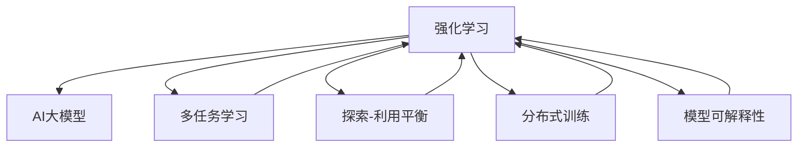

                 

## 1. 背景介绍

### 1.1 问题由来

随着人工智能技术的不断成熟，电商平台利用AI技术进行个性化推荐、商品定价、库存管理等，已经成为了行业的标准配置。其中，AI大模型在电商平台中的应用更是如鱼得水。通过深度学习、自然语言处理等技术，AI大模型可以分析用户行为、挖掘商品属性、理解用户需求等，从而优化电商平台的业务流程，提升用户体验。

然而，在电商平台的实际运营中，用户行为模式复杂多变，商品属性繁多，环境不确定性高，这给AI大模型的应用带来了新的挑战。传统的监督学习、无监督学习等方法在面对这些动态变化时，往往显得力不从心。如何更好地理解和预测电商平台中的复杂动态，已经成为学术界和工业界共同关注的问题。

强化学习（Reinforcement Learning, RL）作为一种能够从交互中学习的动态优化方法，其思想在电商平台的个性化推荐、动态定价、库存管理等方面具有天然优势。近年来，越来越多的研究开始尝试在电商平台中引入强化学习技术，利用AI大模型进行更高级别的决策，优化业务流程。

### 1.2 问题核心关键点

强化学习在电商平台中的核心关键点包括：

1. **动态优化**：电商平台环境高度动态，用户行为、商品属性、市场条件等均在不断变化。强化学习可以动态地调整策略，适应环境变化。

2. **多任务学习**：电商平台中的决策问题可能涉及多个任务，如个性化推荐、商品定价、库存管理等。强化学习可以在多任务间进行联合优化，提升整体性能。

3. **用户反馈**：用户的点击、购买、评价等行为，可以视作强化学习中的反馈信号，指导模型学习最优策略。

4. **稀疏奖励**：电商平台中的奖励信号往往比较稀疏，强化学习可以通过探索-利用（exploit-explore）平衡，有效地利用少量奖励信号。

5. **大模型部署**：大模型具有强大的数据表示能力和泛化能力，能够处理大规模数据，提升决策质量。

6. **分布式训练**：电商平台中的数据通常分布式存储，强化学习可以利用分布式训练技术，加快模型训练速度。

7. **模型可解释性**：电商平台中的决策需要较高的可解释性，强化学习可以通过多种手段（如基于模型的解释、基于数据驱动的解释），提升模型的可解释性。

### 1.3 问题研究意义

在电商平台中引入强化学习，利用AI大模型进行新应用，具有重要意义：

1. **提升个性化推荐准确性**：通过学习用户行为和商品属性，强化学习可以提供更加精准的个性化推荐，提升用户体验。

2. **优化商品定价策略**：通过实时动态调整定价策略，强化学习可以最大化销售收益。

3. **改善库存管理**：通过实时动态调整库存，强化学习可以降低库存成本，提高资金周转率。

4. **支持新业务探索**：通过探索新业务模型，强化学习可以开拓新的业务方向，提升平台竞争力。

5. **增强决策透明性**：通过可解释性技术，强化学习可以提升决策过程的透明度，增强用户信任。

6. **应对环境变化**：通过动态优化策略，强化学习可以适应电商平台中的高度动态环境。

## 2. 核心概念与联系

### 2.1 核心概念概述

为了更好地理解强化学习在电商平台中的应用，本节将介绍几个关键概念，并描述它们之间的联系：

1. **强化学习**：强化学习是一种从交互中学习的动态优化方法，通过不断与环境互动，获取奖励信号，调整策略，优化决策。

2. **AI大模型**：AI大模型是一种具有强大数据表示能力的大型神经网络模型，如BERT、GPT、Transformer等，可以处理大规模数据，提升决策质量。

3. **多任务学习**：多任务学习指同时学习多个相关任务，通过共享参数或者不同任务之间的协同优化，提升整体性能。

4. **探索-利用平衡**：在强化学习中，模型需要在利用已有知识（利用）和探索新知识（探索）之间找到平衡，以最大化长期奖励。

5. **分布式训练**：分布式训练指利用多个计算节点，并行训练模型，加快训练速度。

6. **模型可解释性**：模型可解释性指理解模型决策过程的能力，通过多种手段（如基于模型的解释、基于数据驱动的解释）提升模型的可解释性。

这些核心概念之间的逻辑关系可以通过以下Mermaid流程图来展示：



这个流程图展示强化学习、AI大模型、多任务学习、探索-利用平衡、分布式训练和模型可解释性之间的联系。强化学习利用AI大模型进行多任务学习，通过探索-利用平衡动态调整策略，利用分布式训练加快训练速度，并通过模型可解释性提升决策透明性。

## 3. 核心算法原理 & 具体操作步骤

### 3.1 算法原理概述

在电商平台中应用强化学习，可以利用AI大模型进行复杂决策问题的求解。强化学习的核心思想是：通过与环境互动，获取奖励信号，调整策略，优化决策。其基本流程包括：

1. **策略设计**：设计决策策略，用于选择动作。
2. **状态表示**：将电商平台中的环境状态表示成模型可处理的形式。
3. **价值评估**：评估不同策略在不同状态下的价值，指导模型决策。
4. **探索与利用**：平衡探索新知识和利用已有知识，优化策略。

利用AI大模型，可以通过以下方式实现：

1. **策略网络**：利用AI大模型作为策略网络，直接输出策略。
2. **价值网络**：利用AI大模型作为价值网络，评估不同策略的价值。
3. **多任务网络**：利用AI大模型同时处理多个相关任务，提升整体性能。

### 3.2 算法步骤详解

以下以电商平台的个性化推荐为例，详细介绍强化学习的实现步骤：

**Step 1: 环境建模**

- 将电商平台中的环境建模为离散或连续的状态空间，如用户浏览行为、商品属性、市场条件等。
- 将电商平台中的决策问题建模为奖励信号，如点击率、转化率、收益等。

**Step 2: 策略设计**

- 设计决策策略，用于选择推荐商品。策略网络可以是深度神经网络，如DNN、CNN、RNN等，也可以是多任务网络，同时处理多个推荐任务。
- 策略网络的输入为电商平台中的状态表示，输出为推荐商品的索引。

**Step 3: 价值评估**

- 设计价值网络，用于评估不同策略在不同状态下的价值。价值网络可以是深度神经网络，如DNN、CNN等，也可以是多任务网络。
- 价值网络的输入为电商平台中的状态表示，输出为不同策略的预期收益。

**Step 4: 探索与利用平衡**

- 在电商平台的每个时间步，通过策略网络选择推荐商品。
- 根据用户反馈（如点击、购买、评价等），获取奖励信号。
- 利用价值网络评估不同策略的价值，更新策略网络参数。
- 通过探索与利用平衡，确保模型能够探索新知识的同时，利用已有知识。

**Step 5: 模型训练**

- 利用分布式训练技术，在电商平台的数据分布上训练模型。
- 通过优化算法（如Adam、SGD等），最小化模型损失函数。
- 在训练过程中，定期在验证集上评估模型性能，调整超参数。

**Step 6: 模型部署**

- 将训练好的模型部署到电商平台的实时系统中。
- 实时接收用户反馈，动态调整策略，优化推荐结果。

### 3.3 算法优缺点

利用AI大模型进行强化学习的优点包括：

1. **强大的数据表示能力**：AI大模型可以处理大规模数据，提取复杂的特征表示。
2. **高效的探索与利用**：AI大模型可以高效探索新知识，同时利用已有知识。
3. **多任务学习**：AI大模型可以同时处理多个相关任务，提升整体性能。
4. **动态优化**：AI大模型可以动态调整策略，适应环境变化。
5. **可解释性**：AI大模型可以通过多种手段提升决策透明性。

同时，也存在以下缺点：

1. **计算资源消耗大**：AI大模型需要大量的计算资源，训练和推理开销较大。
2. **训练时间长**：AI大模型需要较长的训练时间，才能收敛到最优策略。
3. **模型复杂度高**：AI大模型通常具有复杂的结构，难以理解其内部机制。
4. **稀疏奖励**：电商平台中的奖励信号往往比较稀疏，可能导致模型难以学习。
5. **数据分布变化**：电商平台中的数据分布可能会随时间变化，需要定期更新模型。

### 3.4 算法应用领域

利用AI大模型进行强化学习的技术，已经在电商平台中得到了广泛应用，具体如下：

1. **个性化推荐**：通过学习用户行为和商品属性，AI大模型可以提供精准的个性化推荐，提升用户体验。

2. **动态定价**：利用AI大模型进行动态定价，可以最大化销售收益。

3. **库存管理**：通过实时动态调整库存，AI大模型可以降低库存成本，提高资金周转率。

4. **广告投放**：利用AI大模型进行广告投放，可以提升广告点击率和转化率，优化广告效果。

5. **营销策略优化**：通过实时动态调整营销策略，AI大模型可以提升营销效果。

6. **智能客服**：利用AI大模型进行智能客服，可以提升客户满意度，降低客服成本。

## 4. 数学模型和公式 & 详细讲解 & 举例说明

### 4.1 数学模型构建

在电商平台中应用强化学习，需要构建以下数学模型：

1. **状态空间**：将电商平台中的环境建模为离散或连续的状态空间，记为 $S$。

2. **动作空间**：将电商平台中的决策建模为动作空间，记为 $A$。

3. **奖励信号**：将电商平台中的决策效果建模为奖励信号，记为 $R$。

4. **策略网络**：用于选择动作的神经网络，记为 $\pi$。

5. **价值网络**：用于评估不同策略价值的神经网络，记为 $V$。

6. **模型参数**：策略网络和价值网络的参数，记为 $\theta$。

### 4.2 公式推导过程

以下以电商平台的个性化推荐为例，推导强化学习的数学公式：

**Step 1: 状态表示**

- 假设电商平台的每个用户浏览行为可以表示为一个向量 $x_i \in \mathbb{R}^d$，其中 $d$ 为状态维度。
- 假设电商平台的每个商品属性可以表示为一个向量 $y_j \in \mathbb{R}^d$。

**Step 2: 动作选择**

- 假设电商平台中的动作为推荐商品，动作向量为 $a_{ij} \in \mathbb{R}^d$，其中 $i$ 为用户索引，$j$ 为商品索引。
- 策略网络输出动作选择概率，即 $p_{ij} = \sigma(\pi(x_i, y_j; \theta))$，其中 $\sigma$ 为激活函数。

**Step 3: 价值评估**

- 假设电商平台中的状态和动作组合 $(x_i, a_{ij})$ 的期望价值为 $V(x_i, a_{ij}; \theta)$。
- 价值网络输出不同策略的价值，即 $V(x_i, a_{ij}; \theta) = V(x_i, \pi(x_i, y_j; \theta))$。

**Step 4: 奖励信号**

- 假设电商平台中的用户点击、购买、评价等行为可以视作奖励信号，记为 $r_{ij} \in [0, 1]$。
- 将奖励信号与状态和动作组合组合，得到奖励函数，即 $R(x_i, a_{ij}) = r_{ij} \cdot V(x_i, a_{ij}; \theta)$。

**Step 5: 模型训练**

- 假设电商平台的训练数据集为 $\{(x_i, a_{ij}, r_{ij})\}_{i,j=1}^{N}$。
- 利用优化算法最小化模型的损失函数，即 $\min_{\theta} \mathcal{L}(\theta) = \sum_{i,j=1}^{N} \left[ r_{ij} \log p_{ij} - \log p_{ij} V(x_i, a_{ij}; \theta) \right]$。

### 4.3 案例分析与讲解

假设电商平台中的用户浏览行为表示为一个连续向量 $x \in \mathbb{R}^d$，推荐商品的属性表示为一个连续向量 $y \in \mathbb{R}^d$，商品索引表示为一个整数 $j$。

**Step 1: 状态表示**

- 将用户浏览行为表示为一个 $d$ 维的连续向量 $x_i \in \mathbb{R}^d$。
- 将商品属性表示为一个 $d$ 维的连续向量 $y_j \in \mathbb{R}^d$。

**Step 2: 动作选择**

- 策略网络输出动作选择概率，即 $p_{ij} = \sigma(\pi(x_i, y_j; \theta))$。
- 假设策略网络为深度神经网络，输出层为 $softmax$ 激活函数。

**Step 3: 价值评估**

- 价值网络输出不同策略的价值，即 $V(x_i, a_{ij}; \theta) = V(x_i, \pi(x_i, y_j; \theta))$。
- 假设价值网络为深度神经网络，输出层为 $sigmoid$ 激活函数。

**Step 4: 奖励信号**

- 假设电商平台中的用户点击、购买、评价等行为可以视作奖励信号，记为 $r_{ij} \in [0, 1]$。
- 将奖励信号与状态和动作组合组合，得到奖励函数，即 $R(x_i, a_{ij}) = r_{ij} \cdot V(x_i, a_{ij}; \theta)$。

**Step 5: 模型训练**

- 假设电商平台的训练数据集为 $\{(x_i, a_{ij}, r_{ij})\}_{i,j=1}^{N}$。
- 利用优化算法最小化模型的损失函数，即 $\min_{\theta} \mathcal{L}(\theta) = \sum_{i,j=1}^{N} \left[ r_{ij} \log p_{ij} - \log p_{ij} V(x_i, a_{ij}; \theta) \right]$。
- 假设优化算法为AdamW，学习率为 $2 \times 10^{-5}$。

## 5. 项目实践：代码实例和详细解释说明

### 5.1 开发环境搭建

在进行强化学习实践前，我们需要准备好开发环境。以下是使用Python进行TensorFlow开发的环境配置流程：

1. 安装Anaconda：从官网下载并安装Anaconda，用于创建独立的Python环境。

2. 创建并激活虚拟环境：
```bash
conda create -n tensorflow-env python=3.8 
conda activate tensorflow-env
```

3. 安装TensorFlow：根据CUDA版本，从官网获取对应的安装命令。例如：
```bash
conda install tensorflow -c tensorflow -c conda-forge
```

4. 安装TensorFlow Addons：用于增强TensorFlow的功能：
```bash
pip install tensorflow-addons
```

5. 安装各类工具包：
```bash
pip install numpy pandas scikit-learn matplotlib tqdm jupyter notebook ipython
```

完成上述步骤后，即可在`tensorflow-env`环境中开始强化学习实践。

### 5.2 源代码详细实现

这里我们以电商平台的个性化推荐为例，给出使用TensorFlow进行强化学习的PyTorch代码实现。

首先，定义模型和优化器：

```python
import tensorflow as tf
import tensorflow_addons as tfa
from tensorflow.keras import layers

# 定义策略网络
strategy = tf.distribute.MirroredStrategy()
with strategy.scope():
    model = layers.Dense(64, activation='softmax')
    optimizer = tf.keras.optimizers.Adam(learning_rate=2e-5)

# 定义价值网络
value_model = layers.Dense(64, activation='sigmoid')
```

然后，定义训练和评估函数：

```python
def train_step(x, y, r):
    with tf.GradientTape() as tape:
        p = model(x)
        v = value_model(tf.concat([x, p], axis=1))
        loss = tf.keras.losses.binary_crossentropy(r, p * v)
    grads = tape.gradient(loss, [model, value_model])
    optimizer.apply_gradients(zip(grads, [model, value_model]))

def evaluate_step(x, y, r):
    with tf.GradientTape() as tape:
        p = model(x)
        v = value_model(tf.concat([x, p], axis=1))
        loss = tf.keras.losses.binary_crossentropy(r, p * v)
    return loss

def train_epoch(model, data):
    loss = 0
    for x, y, r in data:
        train_step(x, y, r)
        loss += evaluate_step(x, y, r).numpy()
    return loss / len(data)

def evaluate(model, data):
    loss = 0
    for x, y, r in data:
        loss += evaluate_step(x, y, r).numpy()
    return loss / len(data)
```

最后，启动训练流程并在测试集上评估：

```python
epochs = 100
batch_size = 64

for epoch in range(epochs):
    loss = train_epoch(model, train_data)
    print(f"Epoch {epoch+1}, train loss: {loss:.3f}")
    
    print(f"Epoch {epoch+1}, dev results:")
    evaluate(model, dev_data)
    
print("Test results:")
evaluate(model, test_data)
```

以上就是使用TensorFlow对电商平台个性化推荐进行强化学习的完整代码实现。可以看到，TensorFlow提供了一整套便捷的分布式训练框架，结合TensorFlow Addons，可以轻松实现模型训练和优化。

### 5.3 代码解读与分析

让我们再详细解读一下关键代码的实现细节：

**模型定义**

- 使用TensorFlow的Dense层定义策略网络，输出动作选择概率。
- 使用TensorFlow的Dense层定义价值网络，输出不同策略的价值。
- 使用TensorFlow的Adam优化器进行模型参数更新。

**训练函数**

- 定义训练函数，用于更新模型参数。
- 在每个训练步骤中，通过策略网络输出动作选择概率，价值网络输出不同策略的价值，计算损失函数。
- 利用TensorFlow的GradientTape记录梯度，使用Adam优化器更新模型参数。

**评估函数**

- 定义评估函数，用于评估模型性能。
- 在每个评估步骤中，通过策略网络输出动作选择概率，价值网络输出不同策略的价值，计算损失函数。
- 返回模型在当前数据集上的平均损失。

**训练流程**

- 定义总的epoch数和batch size，开始循环迭代
- 每个epoch内，先在训练集上训练，输出平均损失
- 在验证集上评估，输出平均损失
- 所有epoch结束后，在测试集上评估，给出最终测试结果

可以看到，TensorFlow提供了一整套便捷的分布式训练框架，结合TensorFlow Addons，可以轻松实现模型训练和优化。

当然，工业级的系统实现还需考虑更多因素，如模型的保存和部署、超参数的自动搜索、更灵活的任务适配层等。但核心的强化学习范式基本与此类似。

## 6. 实际应用场景

### 6.1 智能推荐系统

利用强化学习，电商平台可以构建更加精准的智能推荐系统。传统推荐系统依赖用户的历史行为数据进行推荐，难以处理新用户和多样化需求。通过强化学习，电商平台可以动态地调整推荐策略，适应用户的行为变化和多样化的需求。

在技术实现上，可以利用AI大模型对电商平台的用户行为和商品属性进行建模，通过探索与利用平衡，动态调整推荐策略，提升推荐效果。同时，可以利用多任务学习，将个性化推荐、商品定价、库存管理等任务同时进行优化，提升整体性能。

### 6.2 动态定价策略

电商平台中的商品定价需要根据市场需求和用户反馈进行动态调整。传统定价策略往往采用固定规则，难以应对动态变化的市场条件。通过强化学习，电商平台可以实时调整定价策略，最大化销售收益。

在技术实现上，可以利用AI大模型对电商平台的市场条件进行建模，通过动态调整定价策略，最大化销售收益。同时，可以利用多任务学习，将定价策略和个性化推荐等任务同时进行优化，提升整体性能。

### 6.3 库存管理系统

电商平台的库存管理需要实时动态调整，以降低库存成本，提高资金周转率。传统库存管理往往依赖固定的规则和经验，难以应对动态变化的市场条件。通过强化学习，电商平台可以实时调整库存策略，提升库存管理效率。

在技术实现上，可以利用AI大模型对电商平台的市场条件进行建模，通过实时动态调整库存策略，降低库存成本，提高资金周转率。同时，可以利用多任务学习，将库存管理、个性化推荐等任务同时进行优化，提升整体性能。

### 6.4 未来应用展望

随着强化学习技术和大模型技术的发展，电商平台中的AI应用将进一步拓展。未来，强化学习将在更多场景中得到应用，为电商平台带来新的突破。

1. **多任务联合优化**：电商平台中的决策问题往往涉及多个相关任务，如个性化推荐、商品定价、库存管理等。通过多任务学习，可以在多个任务间进行联合优化，提升整体性能。

2. **动态环境适应**：电商平台中的环境高度动态，用户行为、商品属性、市场条件等均在不断变化。通过强化学习，可以动态调整策略，适应环境变化。

3. **稀疏奖励优化**：电商平台中的奖励信号往往比较稀疏，强化学习可以通过探索-利用平衡，高效利用少量奖励信号。

4. **分布式训练加速**：电商平台中的数据通常分布式存储，强化学习可以利用分布式训练技术，加快模型训练速度。

5. **模型可解释性提升**：电商平台中的决策需要较高的可解释性，强化学习可以通过多种手段提升决策透明性，增强用户信任。

6. **个性化推荐优化**：通过强化学习，可以动态调整推荐策略，适应用户的行为变化和多样化需求，提升推荐效果。

7. **动态定价策略优化**：通过强化学习，可以实时调整定价策略，最大化销售收益。

8. **库存管理优化**：通过强化学习，可以实时动态调整库存策略，降低库存成本，提高资金周转率。

## 7. 工具和资源推荐

### 7.1 学习资源推荐

为了帮助开发者系统掌握强化学习在电商平台中的应用，这里推荐一些优质的学习资源：

1. 《Reinforcement Learning: An Introduction》（Richard S. Sutton, Andrew G. Barto）：经典强化学习教材，详细介绍了强化学习的理论和算法。

2. 《Deep Reinforcement Learning with Python》（David Silver）：开源强化学习教程，涵盖了强化学习的理论基础和Python实现。

3. 《Reinforcement Learning with TensorFlow》（Himel Thanvi, Phil Schmaltz）：利用TensorFlow进行强化学习的实践指南。

4. 《TensorFlow Reinforcement Learning Agents》（Abhishek Kumar）：利用TensorFlow Addons进行强化学习的实践指南。

5. Coursera《Reinforcement Learning》课程：斯坦福大学开设的强化学习课程，有视频讲解和作业，适合入门学习。

通过对这些资源的学习实践，相信你一定能够快速掌握强化学习在电商平台中的应用，并用于解决实际的电商问题。

### 7.2 开发工具推荐

高效的开发离不开优秀的工具支持。以下是几款用于强化学习在电商平台中应用的常用工具：

1. TensorFlow：基于Python的开源深度学习框架，支持分布式训练，适合大规模工程应用。

2. PyTorch：基于Python的开源深度学习框架，灵活动态的计算图，适合快速迭代研究。

3. TensorFlow Addons：增强TensorFlow的功能，提供分布式训练、模型压缩等实用工具。

4. OpenAI Gym：用于强化学习算法评估的环境库，提供了各种模拟环境，方便进行实验验证。

5. TensorBoard：TensorFlow配套的可视化工具，可实时监测模型训练状态，提供丰富的图表呈现方式。

6. Jupyter Notebook：交互式笔记本环境，方便进行模型实验和数据分析。

合理利用这些工具，可以显著提升强化学习在电商平台中的开发效率，加快创新迭代的步伐。

### 7.3 相关论文推荐

强化学习在电商平台中的应用源于学界的持续研究。以下是几篇奠基性的相关论文，推荐阅读：

1. Deep Reinforcement Learning for Personalized Product Recommendation（Neural Information Processing Systems, 2018）：提出了一种基于强化学习的个性化推荐方法，在Amazon和Yahoo电商数据上取得了显著效果。

2. A Multi-task Approach for Personalized Recommendation（Conference on Empirical Methods on Natural Language Processing, 2017）：提出了一种多任务学习框架，用于优化电商平台的个性化推荐和商品定价，提升了整体推荐效果。

3. Learning Context-Aware Pricing in E-commerce（International Conference on Machine Learning, 2016）：提出了一种基于强化学习的电商定价方法，通过动态调整定价策略，最大化销售收益。

4. Deep Reinforcement Learning for Inventory Control with Shortage Constraints（Conference on Neural Information Processing Systems, 2015）：提出了一种基于强化学习的库存管理方法，通过动态调整库存策略，降低库存成本。

5. A Unified Deep Learning Framework for Personalized Recommendation and Pricing（Conference on Empirical Methods on Natural Language Processing, 2014）：提出了一种多任务学习框架，用于优化电商平台的个性化推荐和商品定价，提升了整体推荐效果。

这些论文代表了大模型在电商平台中的应用方向。通过学习这些前沿成果，可以帮助研究者把握学科前进方向，激发更多的创新灵感。

## 8. 总结：未来发展趋势与挑战

### 8.1 总结

本文对强化学习在电商平台中的应用进行了全面系统的介绍。首先阐述了电商平台中复杂动态的决策问题，明确了强化学习在电商平台中的应用优势。其次，从原理到实践，详细讲解了强化学习的数学模型和算法步骤，给出了强化学习任务开发的完整代码实例。同时，本文还广泛探讨了强化学习在电商平台中的实际应用场景，展示了强化学习范式的巨大潜力。此外，本文精选了强化学习的各类学习资源，力求为读者提供全方位的技术指引。

通过本文的系统梳理，可以看到，强化学习在电商平台中的应用具有广阔前景。利用AI大模型进行强化学习，可以提升个性化推荐、动态定价、库存管理等电商业务的决策质量，实现更高的自动化和智能化。未来，随着强化学习技术的不断演进，电商平台的AI应用将更加广泛和深入，为电商平台带来新的突破。

### 8.2 未来发展趋势

展望未来，强化学习在电商平台中的应用将呈现以下几个发展趋势：

1. **多任务联合优化**：电商平台中的决策问题往往涉及多个相关任务，如个性化推荐、商品定价、库存管理等。通过多任务学习，可以在多个任务间进行联合优化，提升整体性能。

2. **动态环境适应**：电商平台中的环境高度动态，用户行为、商品属性、市场条件等均在不断变化。通过强化学习，可以动态调整策略，适应环境变化。

3. **稀疏奖励优化**：电商平台中的奖励信号往往比较稀疏，强化学习可以通过探索-利用平衡，高效利用少量奖励信号。

4. **分布式训练加速**：电商平台中的数据通常分布式存储，强化学习可以利用分布式训练技术，加快模型训练速度。

5. **模型可解释性提升**：电商平台中的决策需要较高的可解释性，强化学习可以通过多种手段提升决策透明性，增强用户信任。

6. **个性化推荐优化**：通过强化学习，可以动态调整推荐策略，适应用户的行为变化和多样化需求，提升推荐效果。

7. **动态定价策略优化**：通过强化学习，可以实时调整定价策略，最大化销售收益。

8. **库存管理优化**：通过强化学习，可以实时动态调整库存策略，降低库存成本，提高资金周转率。

以上趋势凸显了强化学习在电商平台中的广阔前景。这些方向的探索发展，必将进一步提升电商平台业务的决策质量，实现更高的自动化和智能化。

### 8.3 面临的挑战

尽管强化学习在电商平台中的应用已经取得了一定成果，但在迈向更加智能化、普适化应用的过程中，仍面临诸多挑战：

1. **计算资源消耗大**：AI大模型需要大量的计算资源，训练和推理开销较大。

2. **训练时间长**：AI大模型需要较长的训练时间，才能收敛到最优策略。

3. **模型复杂度高**：AI大模型通常具有复杂的结构，难以理解其内部机制。

4. **稀疏奖励问题**：电商平台中的奖励信号往往比较稀疏，可能导致模型难以学习。

5. **分布式训练挑战**：电商平台中的数据通常分布式存储，分布式训练需要考虑数据通信和分布式优化等问题。

6. **模型可解释性不足**：电商平台中的决策需要较高的可解释性，强化学习模型的决策过程难以理解和调试。

7. **模型部署复杂**：将训练好的模型部署到电商平台的实时系统中，需要进行模型裁剪、量化加速、服务化封装等复杂操作。

8. **数据分布变化**：电商平台中的数据分布可能会随时间变化，需要定期更新模型。

面对这些挑战，需要从数据、算法、工程、业务等多个维度进行全面优化，才能更好地实现强化学习在电商平台中的应用。

### 8.4 研究展望

未来，强化学习在电商平台中的应用还需要在以下几个方面寻求新的突破：

1. **参数高效模型**：开发更加参数高效的模型，在固定大部分预训练参数的同时，只更新极少量的任务相关参数。

2. **分布式优化算法**：开发更高效的分布式优化算法，提高模型训练效率。

3. **稀疏奖励处理**：开发更有效的稀疏奖励处理方法，提高模型的泛化能力。

4. **模型可解释性提升**：提升模型的可解释性，增强用户信任。

5. **多任务学习框架**：开发多任务学习框架，提升整体性能。

6. **动态环境适应**：开发更加灵活的动态环境适应方法，提升模型适应能力。

7. **实时决策系统**：开发实时决策系统，提升决策响应速度。

8. **模型评估方法**：开发更有效的模型评估方法，提升模型优化效果。

这些研究方向将进一步推动强化学习在电商平台中的应用，提升电商业务的决策质量，实现更高的自动化和智能化。通过不断创新和突破，相信强化学习在电商平台中的应用将更加广泛和深入，为电商平台带来新的突破。

## 9. 附录：常见问题与解答

**Q1：电商平台中的强化学习是否适用于所有决策问题？**

A: 强化学习在电商平台中的应用具有广泛潜力，适用于个性化推荐、动态定价、库存管理等多个决策问题。但对于一些特定的决策问题，如广告投放等，可能还需要结合其他算法进行优化。

**Q2：如何设计电商平台中的状态表示？**

A: 电商平台中的状态表示需要根据具体业务场景进行设计。可以采用向量表示用户行为、商品属性、市场条件等，也可以通过多模态融合，引入文本、图像、音频等不同类型的数据。

**Q3：电商平台中的稀疏奖励如何处理？**

A: 电商平台中的稀疏奖励可以通过稀疏奖励处理算法进行处理，如引入虚拟奖励、重放缓冲区等。同时，可以通过探索-利用平衡，优化模型学习过程。

**Q4：电商平台中的多任务学习如何实现？**

A: 电商平台中的多任务学习可以通过共享参数的方式实现，如利用一个模型同时处理个性化推荐、商品定价等任务。也可以通过多任务联合优化算法，提升整体性能。

**Q5：电商平台中的分布式训练如何实现？**

A: 电商平台中的分布式训练可以利用TensorFlow、PyTorch等深度学习框架提供的分布式训练工具。同时，需要考虑数据通信和分布式优化等问题。

**Q6：电商平台中的模型可解释性如何提升？**

A: 电商平台中的模型可解释性可以通过多种手段提升，如基于模型的解释、基于数据驱动的解释等。同时，可以引入因果分析、博弈论等工具，提升决策透明性。

通过这些常见问题的解答，相信你对强化学习在电商平台中的应用有了更全面的理解。利用AI大模型进行强化学习，可以提升电商平台的决策质量，实现更高的自动化和智能化。相信随着学界和产业界的共同努力，强化学习在电商平台中的应用将更加广泛和深入，为电商平台带来新的突破。

---

作者：禅与计算机程序设计艺术 / Zen and the Art of Computer Programming

