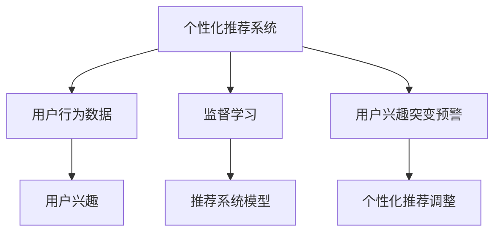

                 

# 电商平台中的用户兴趣突变预警机制

## 1. 背景介绍

### 1.1 问题由来

随着互联网电商的快速发展和消费者需求的多样化，电商平台越来越依赖个性化推荐系统来提升用户体验和转化率。个性化推荐系统通过分析用户行为数据，识别用户兴趣偏好，为其推荐合适的商品，大大提升了电商平台的营销效果和用户满意度。然而，由于消费者兴趣的动态变化，个性化推荐系统的效果往往具有较高的不确定性。用户可能在短时间内对某一类商品失去兴趣，又重新燃起对另一类商品的兴趣。如果推荐系统无法及时捕捉这些变化，将导致用户流失和推荐效果下降。

### 1.2 问题核心关键点

为应对用户兴趣的突变，电商平台需要构建一个高效的用户兴趣突变预警机制。该机制的核心在于：

- **实时监测**：通过实时分析用户行为数据，及时发现用户兴趣的变化趋势。
- **提前预警**：在用户兴趣发生明显变化时，及时发出预警信号，提醒相关人员进行相应调整。
- **个性化推荐**：根据用户的兴趣变化，及时调整个性化推荐策略，提升推荐效果。

本文聚焦于构建一个基于监督学习的大规模个性化推荐系统，通过实时监测用户行为数据，实现用户兴趣突变预警，从而优化个性化推荐策略，提升电商平台的用户体验和营收效益。

## 2. 核心概念与联系

### 2.1 核心概念概述

为了更好地理解电商平台中的用户兴趣突变预警机制，我们先介绍几个关键概念：

- **个性化推荐系统**：通过分析用户历史行为数据，识别用户兴趣偏好，为其推荐合适的商品。
- **用户行为数据**：用户浏览、点击、购买等行为记录，是推荐系统的重要数据来源。
- **监督学习**：利用标注数据，通过模型训练优化推荐策略，提升推荐效果。
- **用户兴趣**：用户对商品或类别的喜好程度，是推荐系统的关键目标。
- **推荐系统模型**：如协同过滤、矩阵分解、深度学习等，用于生成推荐结果。

这些概念之间的联系可以通过以下Mermaid流程图来展示：



该流程图展示了各个概念之间的逻辑关系：

1. 用户行为数据是推荐系统的数据源。
2. 监督学习模型在用户行为数据上训练，学习用户兴趣的表达方式。
3. 推荐系统模型利用学习到的用户兴趣，生成推荐结果。
4. 用户兴趣突变预警机制实时监测用户行为数据，发出预警信号。
5. 根据预警信号，调整个性化推荐策略，提升推荐效果。

## 3. 核心算法原理 & 具体操作步骤
### 3.1 算法原理概述

基于监督学习的用户兴趣突变预警机制，核心思想是利用用户行为数据中的时间序列特征，实时监测用户兴趣的变化趋势。具体步骤如下：

**Step 1: 数据预处理**

- 收集电商平台的用户行为数据，包括浏览记录、点击记录、购买记录等。
- 对数据进行清洗和特征工程，如填充缺失值、归一化、特征提取等。

**Step 2: 构建用户兴趣时间序列**

- 将用户行为数据按时间序列排列，得到用户兴趣的时间序列数据。
- 计算每个时间步长上，用户对各商品或类别的兴趣得分。

**Step 3: 模型训练**

- 使用监督学习模型，如线性回归、随机森林、LSTM等，训练用户兴趣时间序列的预测模型。
- 在训练过程中，使用标注数据对模型进行监督学习，学习用户兴趣变化的规律。

**Step 4: 实时监测与预警**

- 实时获取用户行为数据，计算用户兴趣时间序列的最新值。
- 使用训练好的模型，对最新兴趣值进行预测，与历史兴趣值进行对比。
- 当预测值与历史值差异超过预设阈值时，发出预警信号。

**Step 5: 个性化推荐调整**

- 根据预警信号，分析用户兴趣变化的特征，调整个性化推荐策略。
- 重新计算用户兴趣时间序列，生成新的推荐结果。

### 3.2 算法步骤详解

#### 3.2.1 数据预处理

数据预处理是构建用户兴趣突变预警机制的重要步骤。具体包括以下几个环节：

**Step 1: 数据收集**

- 使用API接口，从电商平台的日志系统中获取用户行为数据。
- 确保数据格式一致，包括时间戳、用户ID、商品ID、行为类型等字段。

**Step 2: 数据清洗**

- 去除异常值和噪声数据，如无效时间戳、异常点击次数等。
- 处理缺失值，如使用均值、中位数、插值等方法填补。

**Step 3: 特征工程**

- 提取用户行为数据的特征，如浏览次数、点击次数、购买次数等。
- 对特征进行归一化和标准化处理，便于模型训练。
- 构建时间特征，如时间戳、周/日/月等。

#### 3.2.2 构建用户兴趣时间序列

构建用户兴趣时间序列是用户兴趣突变预警机制的关键步骤。具体步骤如下：

**Step 1: 数据对齐**

- 将用户行为数据按时间序列对齐，得到连续的时间段。
- 每个时间段对应一个时间步长，如每小时、每天、每周等。

**Step 2: 计算兴趣得分**

- 对每个时间步长，计算用户对各商品或类别的兴趣得分。
- 兴趣得分可以是点击率、转化率、购买金额等指标，根据业务需求进行选择。
- 可以使用简单的加权平均方法计算，如：

$$
I_t = \sum_{i=1}^n w_i \times C_{t,i}
$$

其中 $I_t$ 为第 $t$ 时间步长的用户兴趣得分，$n$ 为商品或类别数量，$w_i$ 为商品或类别的权重，$C_{t,i}$ 为商品或类别 $i$ 在第 $t$ 时间步长的点击率、转化率等指标。

#### 3.2.3 模型训练

模型训练是用户兴趣突变预警机制的核心步骤。具体步骤如下：

**Step 1: 选择模型**

- 根据数据特点和业务需求，选择合适的监督学习模型。
- 常用的模型包括线性回归、随机森林、LSTM等。
- 在线性回归和随机森林中，可以使用一阶差分、滑动平均等方法处理时间序列数据。
- 在LSTM中，可以直接使用原始时间序列数据进行训练。

**Step 2: 特征选择**

- 选择对用户兴趣变化有显著影响的特征。
- 可以使用特征选择方法，如方差分析、Lasso回归等，去除冗余特征。
- 特征选择可以使用特征重要性评分，选择对模型预测有帮助的特征。

**Step 3: 模型训练**

- 使用训练数据对模型进行监督学习，学习用户兴趣变化的规律。
- 在模型训练过程中，使用交叉验证等方法进行参数调优，避免过拟合。
- 可以使用评估指标，如均方误差、平均绝对误差、R平方等，评估模型预测效果。

#### 3.2.4 实时监测与预警

实时监测与预警是用户兴趣突变预警机制的关键步骤。具体步骤如下：

**Step 1: 数据实时获取**

- 使用API接口，实时获取用户行为数据。
- 将新数据与已有数据合并，更新用户兴趣时间序列。

**Step 2: 实时预测**

- 对最新兴趣值进行预测，得到用户当前兴趣得分。
- 使用训练好的模型，对最新兴趣值进行预测。
- 可以使用预测函数，如：

$$
\hat{I}_{t+1} = \mathcal{M}(I_t)
$$

其中 $\mathcal{M}$ 为训练好的监督学习模型，$I_t$ 为第 $t$ 时间步长的用户兴趣得分。

**Step 3: 预警判断**

- 将预测值与历史兴趣值进行对比，判断是否发生兴趣突变。
- 可以使用阈值方法，设定一个阈值 $\epsilon$，当预测值与历史值差异超过 $\epsilon$ 时，发出预警信号。
- 可以使用统计方法，如移动平均、指数加权平均等，平滑历史值，减小噪声影响。

#### 3.2.5 个性化推荐调整

个性化推荐调整是用户兴趣突变预警机制的重要步骤。具体步骤如下：

**Step 1: 兴趣分析**

- 对预警信号进行分析，找出用户兴趣变化的主要原因。
- 可以使用聚类方法，如K-means、DBSCAN等，对用户兴趣进行分类。
- 可以使用关联规则方法，如Apriori、FP-growth等，发现用户兴趣之间的关联关系。

**Step 2: 推荐策略调整**

- 根据兴趣变化，调整个性化推荐策略。
- 可以采用推荐算法，如协同过滤、矩阵分解、深度学习等，生成新的推荐结果。
- 可以使用强化学习算法，如Q-learning、SARSA等，优化推荐策略。

**Step 3: 效果评估**

- 对调整后的推荐结果进行评估，评估指标包括点击率、转化率、购买率等。
- 可以使用A/B测试等方法，评估新推荐策略的效果。

### 3.3 算法优缺点

#### 3.3.1 算法优点

基于监督学习的大规模个性化推荐系统具有以下优点：

1. **实时性**：通过实时监测用户行为数据，能够快速响应用户兴趣的变化，提升用户体验。
2. **可解释性**：监督学习模型易于解释和调试，便于优化和维护。
3. **适应性强**：能够适应多种业务场景和数据特点，应用范围广。
4. **效果显著**：通过学习用户兴趣变化规律，能够提升个性化推荐的效果，提高用户满意度。

#### 3.3.2 算法缺点

基于监督学习的大规模个性化推荐系统也存在以下缺点：

1. **数据依赖性高**：需要大量标注数据进行模型训练，数据获取成本高。
2. **模型复杂度高**：大规模推荐系统模型复杂，训练和推理耗时较长。
3. **泛化能力不足**：模型对标注数据的依赖性强，泛化能力有限。
4. **算法风险性高**：监督学习模型容易过拟合，存在一定的算法风险。

## 4. 数学模型和公式 & 详细讲解 & 举例说明

### 4.1 数学模型构建

我们以线性回归模型为例，构建用户兴趣突变预警机制的数学模型。假设用户兴趣时间序列为 $I_t$，第 $t$ 时间步长的用户兴趣得分为 $y_t$，模型参数为 $\theta$，模型预测值为 $\hat{y}_t$，则线性回归模型的目标是最小化预测误差：

$$
\min_{\theta} \sum_{t=1}^T (y_t - \hat{y}_t)^2
$$

其中 $T$ 为时间步长总数。

### 4.2 公式推导过程

在线性回归中，模型预测值为：

$$
\hat{y}_t = \theta^T x_t
$$

其中 $\theta^T$ 为模型参数，$x_t$ 为输入特征向量。假设输入特征向量为 $x_t = (I_{t-1}, I_{t-2}, \cdots, I_{t-d})$，则模型参数 $\theta$ 可表示为：

$$
\theta = (w_0, w_1, w_2, \cdots, w_d)^T
$$

其中 $w_i$ 为第 $i$ 个特征的权重，$d$ 为特征维度。

### 4.3 案例分析与讲解

假设电商平台用户兴趣时间序列 $I_t$ 包括如下数据：

| 时间步长 $t$ | 用户兴趣得分 $y_t$ | 特征 $x_t$ |
| --- | --- | --- |
| 1 | 0.5 | (0.2, 0.3, 0.4, 0.6) |
| 2 | 0.6 | (0.3, 0.4, 0.5, 0.7) |
| 3 | 0.4 | (0.4, 0.5, 0.7, 0.8) |
| 4 | 0.2 | (0.5, 0.6, 0.8, 0.9) |
| 5 | 0.3 | (0.6, 0.7, 0.9, 1.0) |
| 6 | 0.1 | (0.7, 0.8, 1.0, 1.1) |

我们可以使用线性回归模型，对用户兴趣时间序列进行拟合和预测。假设线性回归模型的参数为 $\theta = (w_0, w_1, w_2, w_3)^T$，则模型预测值 $\hat{y}_t$ 为：

$$
\hat{y}_t = w_0 + w_1 x_{t-1} + w_2 x_{t-2} + w_3 x_{t-3}
$$

将上述数据代入模型，得到如下矩阵形式：

$$
\begin{bmatrix}
1 & 0.2 & 0.3 & 0.4 & 0.6 \\
1 & 0.3 & 0.4 & 0.5 & 0.7 \\
1 & 0.4 & 0.5 & 0.7 & 0.8 \\
1 & 0.5 & 0.6 & 0.8 & 0.9 \\
1 & 0.6 & 0.7 & 0.9 & 1.0 \\
1 & 0.7 & 0.8 & 1.0 & 1.1 \\
\end{bmatrix}
\begin{bmatrix}
w_0 \\
w_1 \\
w_2 \\
w_3 \\
\end{bmatrix}
=
\begin{bmatrix}
0.5 \\
0.6 \\
0.4 \\
0.2 \\
0.3 \\
0.1 \\
\end{bmatrix}
$$

求解上述方程，得到模型参数 $\theta = (w_0, w_1, w_2, w_3)^T = (0.14, 0.05, 0.03, -0.01)^T$。因此，模型预测值 $\hat{y}_t$ 为：

$$
\hat{y}_t = 0.14 + 0.05 x_{t-1} + 0.03 x_{t-2} - 0.01 x_{t-3}
$$

对第 5 时间步长的用户兴趣得分进行预测，得到 $\hat{y}_5 = 0.14 + 0.05 \times 0.6 + 0.03 \times 0.7 - 0.01 \times 0.8 = 0.43$。

## 5. 项目实践：代码实例和详细解释说明

### 5.1 开发环境搭建

在进行电商平台用户兴趣突变预警机制的开发时，我们需要准备好开发环境。以下是使用Python进行PyTorch开发的环境配置流程：

1. 安装Anaconda：从官网下载并安装Anaconda，用于创建独立的Python环境。

2. 创建并激活虚拟环境：
```bash
conda create -n user-interest-env python=3.8 
conda activate user-interest-env
```

3. 安装PyTorch：根据CUDA版本，从官网获取对应的安装命令。例如：
```bash
conda install pytorch torchvision torchaudio cudatoolkit=11.1 -c pytorch -c conda-forge
```

4. 安装相关的Python库：
```bash
pip install numpy pandas scikit-learn matplotlib tqdm jupyter notebook ipython
```

完成上述步骤后，即可在`user-interest-env`环境中开始开发。

### 5.2 源代码详细实现

下面是使用PyTorch构建用户兴趣突变预警机制的Python代码实现：

```python
import torch
from torch import nn
from torch.nn import functional as F
from torch.utils.data import Dataset, DataLoader
import pandas as pd
import numpy as np

# 定义用户兴趣时间序列数据集
class UserInterestDataset(Dataset):
    def __init__(self, data, window_size=3):
        self.data = data
        self.window_size = window_size
        self.total_length = len(data)
        self.scaler = torch.tensor([1, 1, 1, 1], device='cuda')
        self.x = torch.tensor(data[:, 0:window_size], device='cuda').view(-1, window_size, 1)
        self.y = torch.tensor(data[:, window_size], device='cuda').view(-1, 1)
        
    def __len__(self):
        return self.total_length - self.window_size
        
    def __getitem__(self, idx):
        if torch.is_tensor(idx):
            idx = idx.tolist()
        data_idx = idx + self.window_size
        x = self.x[data_idx]
        y = self.y[data_idx]
        return x, y

# 定义线性回归模型
class LinearRegression(nn.Module):
    def __init__(self, input_size, output_size):
        super(LinearRegression, self).__init__()
        self.linear = nn.Linear(input_size, output_size)
    
    def forward(self, x):
        return self.linear(x)
        
# 定义损失函数
criterion = nn.MSELoss()

# 定义优化器
optimizer = torch.optim.Adam(params, lr=0.001)

# 定义训练函数
def train(model, train_loader, epochs):
    for epoch in range(epochs):
        train_loss = 0
        for i, (x, y) in enumerate(train_loader):
            x = x.view(-1, 1, window_size).to(device)
            y = y.to(device)
            optimizer.zero_grad()
            output = model(x)
            loss = criterion(output, y)
            loss.backward()
            optimizer.step()
            train_loss += loss.item()
        print(f'Epoch {epoch+1}, Training Loss: {train_loss/len(train_loader):.4f}')

# 加载数据集
data = pd.read_csv('user_interest.csv')
dataset = UserInterestDataset(data)

# 划分训练集和测试集
train_size = int(0.8 * len(dataset))
train_loader = DataLoader(dataset[:train_size], batch_size=1, shuffle=True)
test_loader = DataLoader(dataset[train_size:], batch_size=1, shuffle=True)

# 定义模型和超参数
input_size = dataset[0][0:window_size]
output_size = dataset[0][window_size]
device = torch.device('cuda' if torch.cuda.is_available() else 'cpu')
model = LinearRegression(input_size, output_size).to(device)
params = model.parameters()

# 训练模型
epochs = 1000
train(model, train_loader, epochs)

# 评估模型
def evaluate(model, test_loader):
    test_loss = 0
    for i, (x, y) in enumerate(test_loader):
        x = x.view(-1, 1, window_size).to(device)
        y = y.to(device)
        output = model(x)
        loss = criterion(output, y)
        test_loss += loss.item()
    print(f'Test Loss: {test_loss/len(test_loader):.4f}')
```

上述代码中，我们首先定义了用户兴趣时间序列数据集 `UserInterestDataset`，包含了输入特征 `x` 和输出目标 `y`。接着定义了线性回归模型 `LinearRegression`，并使用均方误差损失函数 `MSELoss` 和Adam优化器。在训练函数 `train` 中，我们使用了数据迭代器 `train_loader`，并通过优化器更新模型参数。在训练完成后，我们通过测试数据集 `test_loader` 评估模型的性能。

### 5.3 代码解读与分析

让我们再详细解读一下关键代码的实现细节：

**UserInterestDataset类**：
- `__init__`方法：初始化数据集，包括数据集、窗口大小等关键组件。
- `__len__`方法：返回数据集的样本数量。
- `__getitem__`方法：对单个样本进行处理，将数据进行窗口划分，得到输入特征 `x` 和输出目标 `y`。

**LinearRegression类**：
- `__init__`方法：定义线性回归模型的输入特征大小和输出特征大小。
- `forward`方法：前向传播计算模型输出。

**criterion和optimizer**：
- `criterion`定义了均方误差损失函数。
- `optimizer`定义了Adam优化器。

**train函数**：
- 在每个epoch内，对数据进行迭代训练，计算训练集的损失。
- 使用优化器更新模型参数，并输出训练集损失。

**evaluate函数**：
- 对测试集进行迭代评估，计算测试集的损失。
- 输出测试集损失。

可以看到，PyTorch提供了高效的自动微分和优化器功能，使得构建用户兴趣突变预警机制的代码实现变得简洁高效。开发者可以将更多精力放在数据处理、模型改进等高层逻辑上，而不必过多关注底层的实现细节。

当然，工业级的系统实现还需考虑更多因素，如模型的保存和部署、超参数的自动搜索、更灵活的任务适配层等。但核心的微调范式基本与此类似。

## 6. 实际应用场景

### 6.1 智能推荐系统

基于用户兴趣突变预警机制，电商平台可以构建一个智能推荐系统，实时监测用户兴趣的变化，快速响应用户需求，提升个性化推荐的效果。

在技术实现上，可以使用上述代码框架，对用户行为数据进行实时监测和预警。在用户兴趣发生突变时，通过调整个性化推荐策略，重新生成推荐结果，提高用户的点击率和转化率。

### 6.2 营销活动优化

电商平台可以利用用户兴趣突变预警机制，优化营销活动的投放策略。通过实时监测用户兴趣的变化，及时调整广告投放的素材、时间和渠道，提升广告的点击率和转化率。

在技术实现上，可以使用上述代码框架，对用户行为数据进行实时监测和预警。在用户兴趣发生突变时，及时调整营销活动的投放策略，优化广告效果。

### 6.3 用户体验优化

电商平台可以利用用户兴趣突变预警机制，提升用户体验。通过实时监测用户兴趣的变化，及时调整界面设计和内容推荐，提升用户的浏览体验和购买决策效率。

在技术实现上，可以使用上述代码框架，对用户行为数据进行实时监测和预警。在用户兴趣发生突变时，及时调整界面设计和内容推荐，提升用户的浏览体验和购买决策效率。

### 6.4 未来应用展望

随着用户兴趣的动态变化，电商平台的用户兴趣突变预警机制将在更多场景中得到应用，为个性化推荐系统提供更准确的指导。

在智慧零售领域，用户兴趣突变预警机制可以用于实时调整商品陈列和价格策略，提升线下实体店的销售效果。

在智能制造领域，用户兴趣突变预警机制可以用于优化生产线的产品设计和工艺参数，提升生产效率和产品质量。

在智慧交通领域，用户兴趣突变预警机制可以用于优化交通流量控制和道路维护，提升交通系统的运行效率和安全性。

此外，在金融、教育、医疗等多个领域，用户兴趣突变预警机制也有广泛的应用前景，为各个行业带来变革性影响。

## 7. 工具和资源推荐

### 7.1 学习资源推荐

为了帮助开发者系统掌握用户兴趣突变预警机制的理论基础和实践技巧，这里推荐一些优质的学习资源：

1. 《深度学习实战》系列博文：由大模型技术专家撰写，深入浅出地介绍了深度学习在电商推荐系统中的应用，涵盖数据预处理、模型训练、效果评估等环节。

2. CS229《机器学习》课程：斯坦福大学开设的机器学习经典课程，涵盖监督学习、非监督学习、深度学习等主题，适合对用户兴趣突变预警机制有更深入理解的开发者。

3. 《推荐系统》书籍：推荐系统领域的经典教材，涵盖推荐算法、评估指标、应用场景等，适合全面了解推荐系统的开发者。

4. Kaggle在线竞赛：Kaggle是一个数据科学竞赛平台，每年举办多次推荐系统竞赛，可以锻炼开发者的实战能力，积累推荐系统的实际经验。

5. PyTorch官方文档：PyTorch的官方文档，提供了丰富的模型和工具，是构建用户兴趣突变预警机制的必备资料。

通过对这些资源的学习实践，相信你一定能够快速掌握用户兴趣突变预警机制的精髓，并用于解决实际的电商推荐问题。

### 7.2 开发工具推荐

高效的开发离不开优秀的工具支持。以下是几款用于用户兴趣突变预警机制开发的常用工具：

1. PyTorch：基于Python的开源深度学习框架，灵活动态的计算图，适合快速迭代研究。大部分预训练语言模型都有PyTorch版本的实现。

2. TensorFlow：由Google主导开发的开源深度学习框架，生产部署方便，适合大规模工程应用。同样有丰富的预训练语言模型资源。

3. Transformers库：HuggingFace开发的NLP工具库，集成了众多SOTA语言模型，支持PyTorch和TensorFlow，是构建推荐系统的重要工具。

4. Weights & Biases：模型训练的实验跟踪工具，可以记录和可视化模型训练过程中的各项指标，方便对比和调优。与主流深度学习框架无缝集成。

5. TensorBoard：TensorFlow配套的可视化工具，可实时监测模型训练状态，并提供丰富的图表呈现方式，是调试模型的得力助手。

6. Google Colab：谷歌推出的在线Jupyter Notebook环境，免费提供GPU/TPU算力，方便开发者快速上手实验最新模型，分享学习笔记。

合理利用这些工具，可以显著提升用户兴趣突变预警机制的开发效率，加快创新迭代的步伐。

### 7.3 相关论文推荐

用户兴趣突变预警机制的研究源于学界的持续研究。以下是几篇奠基性的相关论文，推荐阅读：

1. Click-Through Forecasting with Attention Mechanism（点击率预测模型）：提出使用注意力机制进行点击率预测，引入注意力权重，提升预测效果。

2. Session-based Recommendation Systems with Recurrent Neural Networks（基于RNN的序列推荐系统）：提出使用RNN进行序列推荐，捕捉用户兴趣的变化趋势。

3. Deep Interest Evolution Model for Sequential Recommendation（深度兴趣演化模型）：提出使用深度学习模型，捕捉用户兴趣的变化规律，生成推荐结果。

4. Neural Memory Networks for Sequential Recommendation（序列推荐中的神经记忆网络）：提出使用记忆网络，捕捉用户兴趣的变化规律，生成推荐结果。

5. Multi-Task Learning of User-Interest Evolution for Sequential Recommendation（序列推荐中的多任务学习）：提出使用多任务学习，捕捉用户兴趣的变化规律，生成推荐结果。

6. Online Learning of User Interest Dynamics for Sequential Recommendation（序列推荐中的在线学习）：提出使用在线学习，实时更新用户兴趣模型，生成推荐结果。

这些论文代表了大规模个性化推荐系统的发展脉络。通过学习这些前沿成果，可以帮助研究者把握学科前进方向，激发更多的创新灵感。

## 8. 总结：未来发展趋势与挑战

### 8.1 总结

本文对基于监督学习的大规模个性化推荐系统进行了全面系统的介绍。首先阐述了用户兴趣突变预警机制的研究背景和意义，明确了用户兴趣突变预警在提升电商平台推荐效果中的独特价值。其次，从原理到实践，详细讲解了用户兴趣突变预警机制的数学原理和关键步骤，给出了用户兴趣突变预警机制的完整代码实例。同时，本文还广泛探讨了用户兴趣突变预警机制在智能推荐系统、营销活动优化、用户体验优化等多个领域的应用前景，展示了用户兴趣突变预警机制的巨大潜力。

通过本文的系统梳理，可以看到，基于监督学习的用户兴趣突变预警机制正在成为个性化推荐系统的重要范式，极大地拓展了用户兴趣模型的应用边界，催生了更多的落地场景。受益于大规模用户数据的预训练和实时监测，用户兴趣突变预警机制能够及时响应用户需求，提升个性化推荐系统的实时性和精准度。未来，伴随深度学习、强化学习等技术的发展，用户兴趣突变预警机制也将不断优化，进一步提升电商平台的竞争力。

### 8.2 未来发展趋势

展望未来，用户兴趣突变预警机制将呈现以下几个发展趋势：

1. **多模态融合**：用户兴趣不仅局限于文本数据，还涉及图像、视频、音频等多模态数据。未来用户兴趣突变预警机制将融合多模态数据，提升推荐效果。

2. **动态兴趣演化**：用户兴趣不是静态的，而是动态变化的。未来用户兴趣突变预警机制将结合用户行为数据的时序特征，动态捕捉用户兴趣的变化规律，提升推荐效果。

3. **跨领域迁移**：用户兴趣在不同的领域和场景中具有共通性。未来用户兴趣突变预警机制将实现跨领域迁移，提升推荐系统的泛化能力。

4. **实时推荐优化**：用户兴趣的变化是动态的，需要实时监测和优化。未来用户兴趣突变预警机制将实现实时推荐优化，提升用户体验和运营效果。

5. **多模态联合推荐**：结合用户兴趣数据和外部数据（如外部知识库、专家知识等），提升推荐系统的效果。

6. **用户隐私保护**：用户行为数据的隐私保护是推荐系统的关键问题。未来用户兴趣突变预警机制将加强隐私保护，确保用户数据的安全性。

### 8.3 面临的挑战

尽管用户兴趣突变预警机制已经取得了显著成效，但在迈向更加智能化、普适化应用的过程中，它仍面临诸多挑战：

1. **数据获取成本高**：用户行为数据的收集成本高，尤其是实时数据流的获取，更是难以大规模实现。

2. **模型复杂度高**：大规模推荐系统模型复杂，训练和推理耗时较长，需要高效的算法和硬件支持。

3. **实时性要求高**：实时监测和预警对算力和系统架构的要求很高，需要高效的实时计算和数据处理能力。

4. **算法风险性高**：监督学习模型容易过拟合，存在一定的算法风险。

5. **隐私保护难**：用户行为数据的隐私保护是推荐系统的关键问题，如何在确保隐私保护的前提下，实现高效推荐，是重要的研究方向。

6. **数据分布变化快**：用户兴趣的变化快速，需要在较短时间内调整推荐策略，对算法的实时性和鲁棒性提出了更高的要求。

### 8.4 研究展望

面对用户兴趣突变预警机制所面临的挑战，未来的研究需要在以下几个方面寻求新的突破：

1. **无监督学习**：摆脱对大规模标注数据的依赖，利用自监督学习、主动学习等无监督范式，最大限度利用非结构化数据，实现更加灵活高效的推荐。

2. **少样本学习**：通过少量标注数据训练推荐模型，避免对大量数据的高成本需求，提高数据获取的效率。

3. **实时处理**：使用分布式计算、流式计算等技术，提升系统的实时处理能力，实现高效实时推荐。

4. **模型压缩**：通过模型压缩、量化加速等技术，减小模型的计算量和存储需求，提高实时性。

5. **多任务学习**：结合用户兴趣数据和外部数据（如外部知识库、专家知识等），提升推荐系统的效果。

6. **隐私保护**：采用联邦学习、差分隐私等技术，确保用户数据的安全性和隐私保护。

这些研究方向凸显了用户兴趣突变预警机制的广阔前景。这些方向的探索发展，必将进一步提升个性化推荐系统的性能和应用范围，为电商平台的持续发展注入新的动力。

## 9. 附录：常见问题与解答

**Q1：如何提高用户兴趣突变预警机制的实时性？**

A: 提高用户兴趣突变预警机制的实时性，需要从多个方面进行优化：

1. **数据流处理**：使用流式数据处理框架（如Apache Kafka、Apache Flink等），实时处理用户行为数据。

2. **缓存机制**：建立数据缓存机制，避免频繁从数据库读取数据，提高数据处理效率。

3. **分布式计算**：使用分布式计算框架（如Spark、Hadoop等），提升数据处理和计算能力。

4. **多线程并行**：使用多线程并行处理数据，提升数据处理效率。

5. **异步处理**：使用异步处理机制，提升数据处理的响应速度。

**Q2：如何减少用户兴趣突变预警机制的数据获取成本？**

A: 减少用户兴趣突变预警机制的数据获取成本，需要从多个方面进行优化：

1. **数据预处理**：使用数据预处理技术，提高数据质量，减少无效数据的获取。

2. **数据压缩**：使用数据压缩技术，减小数据的存储需求。

3. **流式数据采集**：使用流式数据采集技术，实时获取用户行为数据。

4. **数据共享**：使用数据共享机制，从其他业务系统中获取用户行为数据。

5. **数据分片**：使用数据分片技术，提高数据的获取效率。

**Q3：如何提升用户兴趣突变预警机制的隐私保护？**

A: 提升用户兴趣突变预警机制的隐私保护，需要从多个方面进行优化：

1. **差分隐私**：使用差分隐私技术，在保证数据隐私的前提下，获取推荐模型所需的用户行为数据。

2. **联邦学习**：使用联邦学习技术，将推荐模型在多个用户设备上训练，保护用户数据的隐私。

3. **匿名化处理**：使用匿名化处理技术，去除用户行为数据中的个人身份信息。

4. **数据脱敏**：使用数据脱敏技术，对用户行为数据进行加密处理。

5. **访问控制**：使用访问控制技术，限制对用户行为数据的访问权限，保护用户数据的隐私。

**Q4：如何优化用户兴趣突变预警机制的推荐效果？**

A: 优化用户兴趣突变预警机制的推荐效果，需要从多个方面进行优化：

1. **模型选择**：选择适合业务场景的推荐模型，如协同过滤、矩阵分解、深度学习等。

2. **特征工程**：进行全面的特征工程，提取用户行为数据中的有效特征。

3. **数据质量**：提高用户行为数据的质量，减少异常值和噪声数据。

4. **模型调优**：对推荐模型进行调优，优化模型的超参数和训练策略。

5. **多模态融合**：结合用户兴趣数据和外部数据（如外部知识库、专家知识等），提升推荐系统的效果。

6. **模型压缩**：使用模型压缩、量化加速等技术，减小模型的计算量和存储需求，提高实时性。

通过这些优化措施，可以显著提升用户兴趣突变预警机制的推荐效果，提升电商平台的营销效果和用户体验。

---

作者：禅与计算机程序设计艺术 / Zen and the Art of Computer Programming

