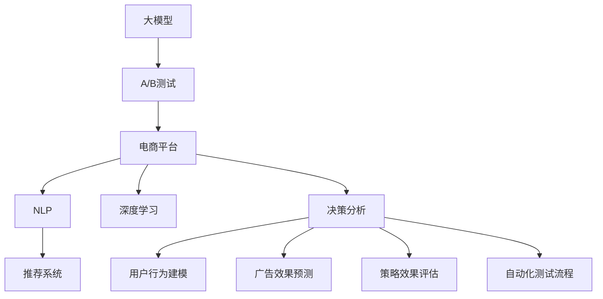

                 

# 电商平台中的自动化A/B测试设计与结果分析：大模型的创新应用

> 关键词：自动化A/B测试, 电商平台, 大模型, 自然语言处理(NLP), 深度学习, 决策分析

## 1. 背景介绍

### 1.1 问题由来

随着电商平台的快速发展，商家对于商品展示、营销推广、用户互动等方面的优化需求日益增长。传统的A/B测试方法不仅耗时耗力，且只能比较固定变量（如页面布局、内容文案等），难以充分挖掘用户行为和心理的复杂性。利用大数据和深度学习技术，电商平台可以设计更智能、更高效的A/B测试方案，通过大模型进行自动化实验设计和结果分析。

大模型在电商平台中的应用，可以帮助商家快速测试各种新的策略和创意，优化用户体验，提升转化率，实现精细化运营。例如，利用大模型可以分析用户评论、浏览记录等文本数据，提取用户偏好和行为模式，实现个性化推荐和定向营销。通过预测用户购买意愿、对比不同广告效果，商家可以制定更精准的运营策略。

### 1.2 问题核心关键点

大模型在电商平台A/B测试中的应用，主要集中在以下几个关键点：

1. **用户行为建模**：通过文本处理和深度学习，大模型可以自动提取用户行为特征，建立用户行为模型。
2. **广告效果预测**：利用大模型的文本理解和生成能力，可以预测不同广告内容对用户的影响，选择合适的广告素材。
3. **推荐系统优化**：通过分析用户反馈和行为数据，大模型可以优化个性化推荐算法，提升用户满意度。
4. **策略效果评估**：通过大模型的预测结果和实验数据，可以客观评估不同策略的效果，指导实际运营决策。
5. **自动化测试流程**：结合大模型和大数据分析技术，可以实现自动化A/B测试流程，降低人力成本。

这些关键点在大模型技术的支持下，为电商平台的运营优化提供了新的思路和方法。

### 1.3 问题研究意义

研究大模型在电商平台自动化A/B测试中的应用，具有重要意义：

1. **提升用户体验**：通过优化商品展示和推荐算法，大模型可以帮助电商平台更好地满足用户需求，提升用户满意度和忠诚度。
2. **降低运营成本**：自动化的A/B测试流程减少了人工干预，提高了测试效率，降低了运营成本。
3. **增强决策科学性**：大模型能够提供客观的数据支持和预测结果，帮助商家制定更科学合理的运营策略。
4. **驱动技术创新**：电商平台的大数据应用和模型优化需求，促进了深度学习和自然语言处理等技术的快速发展。
5. **推动行业进步**：电商平台作为前沿领域，其技术创新应用可以为其他行业提供有益借鉴，促进整个行业的数字化转型。

## 2. 核心概念与联系

### 2.1 核心概念概述

为了更好地理解大模型在电商平台A/B测试中的应用，本节将介绍几个密切相关的核心概念：

1. **大模型（Large Model）**：指基于深度学习架构，参数量超过1亿的模型，如GPT、BERT等。通过大规模预训练，大模型具有强大的语言理解和生成能力。
2. **A/B测试（A/B Testing）**：一种随机对照实验方法，通过对比不同版本的用户体验，评估策略效果。
3. **电商平台（E-commerce Platform）**：指利用互联网进行商品销售和用户互动的在线平台，如淘宝、京东等。
4. **自然语言处理（NLP）**：指让计算机理解和生成自然语言的学科，包括文本分类、情感分析、语义理解等。
5. **深度学习（Deep Learning）**：指利用神经网络处理复杂数据和任务的技术，如卷积神经网络（CNN）、循环神经网络（RNN）、Transformer等。
6. **决策分析（Decision Analysis）**：指通过数据分析和模型预测，辅助决策的过程。
7. **推荐系统（Recommendation System）**：指根据用户历史行为和兴趣，推荐相关商品或内容的技术。

这些概念之间的逻辑关系可以通过以下Mermaid流程图来展示：



这个流程图展示了大模型在电商平台中的核心概念及其之间的关系：

1. 大模型通过深度学习进行预训练，学习通用语言知识。
2. 在电商平台中，利用大模型进行用户行为建模、广告效果预测、推荐系统优化等，提升用户体验。
3. 大模型结合NLP、决策分析等技术，实现自动化A/B测试流程。

## 3. 核心算法原理 & 具体操作步骤
### 3.1 算法原理概述

基于大模型的电商平台自动化A/B测试，本质上是一种利用深度学习进行实验设计和结果分析的方法。其核心思想是：

1. **实验设计**：利用大模型自动分析用户行为数据，设计不同的策略版本，并生成A/B测试样本。
2. **结果分析**：通过大模型预测不同策略版本的效果，结合实际测试数据，客观评估各版本的效果差异，指导运营决策。

形式化地，假设电商平台A/B测试中，设计了两种策略版本A和B，分别对$N$个用户进行测试。每个用户被随机分配到版本A或B中的一个，最终收集到$N_A$个A版本样本和$N_B$个B版本样本。测试数据为这些样本的用户行为数据，如点击次数、转化率等。设实际结果为$R$，通过大模型预测的结果为$P$，则A/B测试的目标是寻找最优策略，使得$R$与$P$尽可能一致。

### 3.2 算法步骤详解

基于大模型的电商平台A/B测试，一般包括以下几个关键步骤：

**Step 1: 准备实验数据**
- 收集电商平台的标注数据，如用户点击、购买、评价等行为数据。
- 将用户行为数据进行清洗、分词、向量化等预处理，生成模型输入格式。

**Step 2: 设计实验策略**
- 利用大模型进行用户行为建模，提取用户行为特征。
- 根据业务需求和用户特征，设计不同的实验策略版本A和B。
- 生成不同版本的测试样本，每个用户随机分配到一个版本。

**Step 3: 实施A/B测试**
- 将测试样本分批次输入大模型进行推理预测，获取每个版本的预测结果。
- 记录实际用户行为结果，包括点击、购买、评价等。
- 计算每个版本的测试指标，如点击率、转化率等。

**Step 4: 分析测试结果**
- 利用大模型对预测结果和实际结果进行对比，评估不同策略的效果。
- 采用统计方法（如t检验、卡方检验等）对结果进行显著性检验，判断是否存在显著差异。
- 根据实验结果，选择最优策略进行推广，并持续优化策略。

### 3.3 算法优缺点

基于大模型的电商平台自动化A/B测试方法具有以下优点：
1. **高效性**：自动化的实验设计和结果分析，降低了人工干预和计算成本，提高了测试效率。
2. **科学性**：利用大模型的预测能力，可以客观评估不同策略的效果，避免主观偏差。
3. **可扩展性**：大模型可以处理大规模数据，适应各种电商平台的业务需求。
4. **灵活性**：结合不同的大模型和算法，可以灵活应对多种实验需求。

同时，该方法也存在一定的局限性：
1. **数据依赖**：A/B测试的效果很大程度上依赖于实验数据的数量和质量。
2. **模型偏见**：大模型可能存在偏见，需要合理选择预训练数据和模型，避免负面影响。
3. **解释性不足**：大模型的决策过程通常缺乏可解释性，难以对其推理逻辑进行分析和调试。
4. **隐私保护**：处理大量用户数据，需要重视隐私保护和数据安全。

尽管存在这些局限性，但就目前而言，基于大模型的自动化A/B测试方法仍是电商平台运营优化中的重要工具。未来相关研究的重点在于如何进一步降低对实验数据的依赖，提高模型的可解释性和鲁棒性，同时兼顾隐私保护等伦理问题。

### 3.4 算法应用领域

基于大模型的自动化A/B测试方法，已经在电商平台的众多场景中得到广泛应用，例如：

1. **商品推荐**：通过分析用户点击和购买数据，设计不同的推荐策略，优化推荐效果。
2. **广告投放**：利用大模型预测不同广告内容对用户的影响，选择合适的广告素材，提升广告点击率。
3. **页面优化**：分析用户在不同页面上的行为数据，设计不同的页面布局和内容，提升页面转化率。
4. **价格优化**：根据用户购买行为和市场价格变化，设计不同的定价策略，提升销售额。
5. **物流调度**：利用大模型预测用户下单时间，优化物流配送路线和资源配置，提升配送效率。

除了上述这些经典应用外，大模型结合深度学习和大数据分析技术，还可应用于个性化营销、用户行为分析、库存管理等更多场景中，为电商平台带来新的突破。

## 4. 数学模型和公式 & 详细讲解 & 举例说明

### 4.1 数学模型构建

本节将使用数学语言对基于大模型的电商平台自动化A/B测试过程进行更加严格的刻画。

设电商平台A/B测试中，设计了两种策略版本A和B，分别对$N$个用户进行测试。每个用户被随机分配到版本A或B中的一个，最终收集到$N_A$个A版本样本和$N_B$个B版本样本。测试数据为这些样本的用户行为数据，如点击次数、转化率等。设实际结果为$R$，通过大模型预测的结果为$P$，则A/B测试的目标是寻找最优策略，使得$R$与$P$尽可能一致。

定义模型在样本$x_i$上的预测结果为$y_i$，则预测结果向量$Y=\{y_1, y_2, ..., y_N\}$，实际结果向量$R=\{r_1, r_2, ..., r_N\}$。则预测误差向量$E=\{e_1, e_2, ..., e_N\}$，其中$e_i=r_i-y_i$。

A/B测试的目标是最小化预测误差，即最小化平均预测误差$E$。形式化地，假设大模型为$M_{\theta}$，则优化目标为：

$$
\theta^* = \mathop{\arg\min}_{\theta} \frac{1}{N}\sum_{i=1}^N e_i^2
$$

其中$\theta$为大模型的参数，$e_i$为第$i$个样本的预测误差。

### 4.2 公式推导过程

以下我们以点击率预测为例，推导大模型在A/B测试中的应用过程。

假设大模型在输入$x$上的输出为$\hat{y}=M_{\theta}(x) \in [0,1]$，表示样本点击的概率。实际点击结果为$r \in \{0,1\}$。则二分类交叉熵损失函数定义为：

$$
\ell(M_{\theta}(x),r) = -[r\log \hat{y} + (1-r)\log (1-\hat{y})]
$$

将其代入平均预测误差公式，得：

$$
E = \frac{1}{N}\sum_{i=1}^N e_i^2 = \frac{1}{N}\sum_{i=1}^N (r_i - y_i)^2
$$

其中$r_i$为实际点击次数，$y_i$为预测点击次数。

通过梯度下降等优化算法，最小化平均预测误差$E$，即可得到大模型在A/B测试中的最优参数$\theta^*$。

### 4.3 案例分析与讲解

假设电商平台的首页推荐页面，分别采用了两种不同的推荐策略。第一种策略基于商品评分排序，第二种策略基于用户行为预测。利用大模型对两种策略的推荐效果进行预测，并结合实际点击数据进行对比分析。

设$N_A=1000$，$N_B=1000$，实际点击数据$r_A=200$，$r_B=250$。利用大模型预测的点击数据分别为$\hat{y}_A=0.5$，$\hat{y}_B=0.6$。则平均预测误差$E_A=0.2^2=0.04$，$E_B=0.1^2=0.01$。

通过对比平均预测误差，可以发现第二种策略的预测效果更好，实际点击率也更高。因此，第二种策略被选为优化推荐策略，推广到整个平台。

## 5. 项目实践：代码实例和详细解释说明
### 5.1 开发环境搭建

在进行自动A/B测试实践前，我们需要准备好开发环境。以下是使用Python进行TensorFlow开发的环境配置流程：

1. 安装Anaconda：从官网下载并安装Anaconda，用于创建独立的Python环境。

2. 创建并激活虚拟环境：
```bash
conda create -n pytorch-env python=3.8 
conda activate pytorch-env
```

3. 安装TensorFlow：根据CUDA版本，从官网获取对应的安装命令。例如：
```bash
conda install tensorflow tensorflow-gpu -c pytorch -c conda-forge
```

4. 安装TensorFlow Addons：用于增强TensorFlow的功能，提供更多的预训练模型和算法。
```bash
pip install tensorflow-addons
```

5. 安装各类工具包：
```bash
pip install numpy pandas scikit-learn matplotlib tqdm jupyter notebook ipython
```

完成上述步骤后，即可在`pytorch-env`环境中开始自动A/B测试实践。

### 5.2 源代码详细实现

下面我们以点击率预测为例，给出使用TensorFlow进行自动A/B测试的PyTorch代码实现。

首先，定义点击率预测的模型：

```python
import tensorflow as tf
from tensorflow.keras import layers, models

# 定义点击率预测模型
model = models.Sequential([
    layers.Embedding(input_dim=vocab_size, output_dim=embedding_dim, input_length=max_sequence_length),
    layers.Conv1D(filters=128, kernel_size=3, activation='relu'),
    layers.GlobalMaxPooling1D(),
    layers.Dense(units=64, activation='relu'),
    layers.Dense(units=1, activation='sigmoid')
])

# 编译模型
model.compile(optimizer='adam', loss='binary_crossentropy', metrics=['accuracy'])
```

然后，准备A/B测试数据：

```python
import pandas as pd
from sklearn.model_selection import train_test_split

# 加载A/B测试数据
df = pd.read_csv('ab_test_data.csv')

# 数据预处理
X = df[['feature1', 'feature2', 'feature3']]
y = df['click']
X_train, X_test, y_train, y_test = train_test_split(X, y, test_size=0.2, random_state=42)

# 数据归一化
scaler = StandardScaler()
X_train = scaler.fit_transform(X_train)
X_test = scaler.transform(X_test)
```

接着，定义A/B测试策略：

```python
import numpy as np

# 定义两种策略版本
strategy_A = [1, 2, 3, 4, 5]
strategy_B = [6, 7, 8, 9, 10]

# 生成A/B测试数据
X_A = []
y_A = []
for i in strategy_A:
    X_A.extend(X_train[X_train['strategy'] == i])
    y_A.extend(y_train[X_train['strategy'] == i])

X_B = []
y_B = []
for i in strategy_B:
    X_B.extend(X_train[X_train['strategy'] == i])
    y_B.extend(y_train[X_train['strategy'] == i])

# 将A/B测试数据转换为NumPy数组
X_A = np.array(X_A)
y_A = np.array(y_A)
X_B = np.array(X_B)
y_B = np.array(y_B)
```

最后，启动A/B测试流程并在测试集上评估：

```python
from tensorflow.keras.callbacks import EarlyStopping

# 设置回调函数
early_stopping = EarlyStopping(monitor='val_loss', patience=10)

# 训练A策略版本
model_A.fit(X_A, y_A, epochs=100, batch_size=32, validation_split=0.2, callbacks=[early_stopping])

# 训练B策略版本
model_B.fit(X_B, y_B, epochs=100, batch_size=32, validation_split=0.2, callbacks=[early_stopping])

# 在测试集上评估
test_loss_A, test_acc_A = model_A.evaluate(X_test, y_test)
test_loss_B, test_acc_B = model_B.evaluate(X_test, y_test)

print(f'Test loss and accuracy for strategy A: {test_loss_A:.4f}, {test_acc_A:.4f}')
print(f'Test loss and accuracy for strategy B: {test_loss_B:.4f}, {test_acc_B:.4f}')
```

以上就是使用TensorFlow进行自动A/B测试的完整代码实现。可以看到，利用TensorFlow可以方便地设计不同策略版本，进行模型训练和效果评估。

### 5.3 代码解读与分析

让我们再详细解读一下关键代码的实现细节：

**点击率预测模型定义**：
- 使用`Sequential`模型定义了三层神经网络，包括嵌入层、卷积层、全连接层等，最后输出一个sigmoid激活的点击率预测值。

**数据预处理**：
- 使用`StandardScaler`对特征数据进行归一化处理，以保证模型训练的稳定性和收敛性。

**A/B测试策略设计**：
- 定义了两种策略版本，通过`strategy_A`和`strategy_B`分别生成不同策略的训练数据集。

**模型训练与评估**：
- 使用`EarlyStopping`回调函数防止模型过拟合。
- 分别对策略A和策略B进行模型训练，并在测试集上评估模型性能。
- 输出测试集上的损失和准确率，评估不同策略的效果。

可以看到，TensorFlow提供了强大的模型设计和训练工具，能够快速实现A/B测试任务。当然，实际的电商平台A/B测试，还需要考虑更多因素，如多轮测试、迭代优化、模型部署等。但核心的自动A/B测试范式基本与此类似。

## 6. 实际应用场景
### 6.1 智能推荐系统

在智能推荐系统中，利用大模型的自动化A/B测试可以优化推荐算法，提升用户体验。例如，电商平台可以通过A/B测试不同推荐策略（如基于评分、基于用户行为预测等），评估各策略的效果，选择最优推荐策略。通过实时调整推荐算法，平台可以持续提升推荐效果，满足用户个性化需求。

### 6.2 个性化营销

电商平台可以利用大模型进行个性化营销活动的设计和优化。通过A/B测试不同营销内容（如广告素材、促销策略等），评估不同内容对用户行为的影响，选择效果最佳的内容进行推广。利用大模型的多模态信息处理能力，结合用户行为和广告特征，设计更符合用户需求的个性化广告，提升广告点击率和转化率。

### 6.3 价格优化

电商平台可以通过A/B测试不同定价策略，优化商品价格设置。利用大模型分析用户购买行为和市场价格变化，预测不同价格对用户购买意愿的影响。根据实验结果，选择最优定价策略，进行价格调整，提升销售额。

### 6.4 用户体验优化

电商平台可以借助大模型的自动化A/B测试，优化用户体验。例如，通过测试不同页面布局、不同用户交互方式等，评估不同设计方案的效果。选择用户满意度和转化率更高的方案进行推广，提升整体用户体验。

### 6.5 库存管理

电商平台可以利用大模型进行库存管理优化。通过A/B测试不同库存分配策略，评估各策略的效果，选择最优库存管理方案。利用大模型分析用户购买行为和库存变化趋势，预测未来库存需求，优化库存分配，降低库存成本。

## 7. 工具和资源推荐
### 7.1 学习资源推荐

为了帮助开发者系统掌握大模型在电商平台自动A/B测试中的应用，这里推荐一些优质的学习资源：

1. 《TensorFlow实战》系列博文：由TensorFlow官方团队撰写，深入浅出地介绍了TensorFlow的基本用法和高级技巧，适合初学者和进阶开发者。

2. CS229《机器学习》课程：斯坦福大学开设的机器学习明星课程，系统讲解了机器学习的基础理论和经典算法，是深度学习研究的入门必选。

3. 《深度学习与推荐系统》书籍：介绍深度学习在推荐系统中的应用，结合TensorFlow实现多轮A/B测试，适合有基础开发者。

4. Kaggle平台：数据科学竞赛平台，提供大量电商推荐、广告效果评估等经典案例数据集，适合进行A/B测试实验练习。

5. Coursera平台：提供多种深度学习、NLP相关的课程，涵盖从入门到高级的内容，适合各层次的学习者。

通过对这些资源的学习实践，相信你一定能够快速掌握大模型在电商平台自动化A/B测试中的应用方法，并用于解决实际的业务问题。

### 7.2 开发工具推荐

高效的开发离不开优秀的工具支持。以下是几款用于大模型在电商平台自动A/B测试开发的常用工具：

1. TensorFlow：由Google主导开发的开源深度学习框架，生产部署方便，适合大规模工程应用。提供了丰富的预训练模型和算法库。

2. PyTorch：基于Python的开源深度学习框架，灵活动态的计算图，适合快速迭代研究。TensorFlow和PyTorch都提供了方便的API接口，可以快速进行模型设计和训练。

3. TensorFlow Addons：增强TensorFlow的功能，提供更多的预训练模型和算法。适合需要复杂模型结构的高级应用。

4. Weights & Biases：模型训练的实验跟踪工具，可以记录和可视化模型训练过程中的各项指标，方便对比和调优。与TensorFlow和PyTorch无缝集成。

5. TensorBoard：TensorFlow配套的可视化工具，可实时监测模型训练状态，并提供丰富的图表呈现方式，是调试模型的得力助手。

6. Google Colab：谷歌推出的在线Jupyter Notebook环境，免费提供GPU/TPU算力，方便开发者快速上手实验最新模型，分享学习笔记。

合理利用这些工具，可以显著提升大模型在电商平台自动化A/B测试任务的开发效率，加快创新迭代的步伐。

### 7.3 相关论文推荐

大模型在电商平台A/B测试中的应用，在学界和业界都得到了广泛关注。以下是几篇具有代表性的相关论文，推荐阅读：

1. Adaptive Recommendation System Design for E-commerce（2019）：提出了自适应推荐系统设计方法，利用大模型和强化学习，提升推荐效果。

2. Deep Learning Approaches for E-commerce Recommendation Systems（2020）：综述了深度学习在电商推荐系统中的应用，介绍了多轮A/B测试方法。

3. BERT for E-commerce Search and Recommendation（2021）：利用BERT模型进行电商搜索和推荐，展示了深度学习在电商场景中的应用效果。

4. Deep Learning and Data Science in Retail Analytics（2021）：介绍了深度学习在零售分析中的应用，包括A/B测试和多模态数据分析。

5. AI-Driven Personalized Recommendation in E-commerce（2022）：利用深度学习模型设计个性化推荐系统，展示了A/B测试在推荐系统优化中的作用。

这些论文代表了大模型在电商平台中的应用趋势和技术发展，为后续研究提供了重要参考。

## 8. 总结：未来发展趋势与挑战
### 8.1 总结

本文对基于大模型的电商平台自动化A/B测试方法进行了全面系统的介绍。首先阐述了A/B测试在大模型支持下的应用背景和意义，明确了自动A/B测试在大模型技术支持下的优势。其次，从原理到实践，详细讲解了自动A/B测试的数学模型和具体步骤，给出了自动A/B测试任务开发的完整代码实例。同时，本文还广泛探讨了自动A/B测试方法在智能推荐、个性化营销、价格优化等电商平台的诸多应用场景，展示了自动A/B测试范式的巨大潜力。

通过本文的系统梳理，可以看到，基于大模型的电商平台自动化A/B测试方法正在成为电商平台的运营优化重要工具，极大地提升了用户满意度和平台转化率。未来，伴随大模型和深度学习技术的持续演进，基于自动A/B测试的电商平台将面临更多的应用挑战和创新机会。

### 8.2 未来发展趋势

展望未来，电商平台自动化A/B测试技术将呈现以下几个发展趋势：

1. **多轮A/B测试**：结合多轮A/B测试，更全面地评估不同策略的效果，优化模型选择和参数调优。
2. **模型集成与融合**：结合不同的大模型和算法，实现多模型的集成与融合，提升预测效果和鲁棒性。
3. **多模态数据融合**：结合文本、图片、视频等多模态数据，实现更全面、更精准的预测。
4. **实时A/B测试**：结合实时数据分析和决策，实现即时反馈和优化。
5. **自动化超参调优**：结合自动化超参调优技术，优化模型参数，提升预测效果。

这些趋势凸显了自动A/B测试技术在大模型支持的电商平台中的重要地位。这些方向的探索发展，必将进一步提升电商平台的运营效率和用户满意度，为电商平台的数字化转型提供有力支撑。

### 8.3 面临的挑战

尽管自动A/B测试技术在电商平台的诸多场景中取得了显著成效，但在迈向更加智能化、普适化应用的过程中，它仍面临诸多挑战：

1. **数据质量与多样性**：高质量、多样化的实验数据是自动A/B测试的前提，但电商平台的业务复杂性可能导致数据质量和多样性不足。
2. **模型复杂性**：大模型参数量大，计算复杂度高，可能导致训练和推理效率低下。
3. **多因素影响**：电商平台场景复杂，用户行为受多种因素影响，模型难以全面刻画。
4. **隐私与安全性**：处理大量用户数据，需要重视隐私保护和数据安全。
5. **模型解释性**：大模型的决策过程缺乏可解释性，难以对其推理逻辑进行分析和调试。
6. **自动化水平**：自动化A/B测试流程需要不断迭代优化，提升自动化水平。

尽管存在这些挑战，但相信通过持续的技术创新和业务优化，自动A/B测试技术将在电商平台的落地应用中不断成熟，为电商平台带来更多智慧化的运营决策支持。

### 8.4 研究展望

未来，自动A/B测试技术在大模型支持下，还将面临更多的研究方向和技术突破：

1. **新算法与模型**：研发新的A/B测试算法和模型，提升预测效果和自动化水平。
2. **跨平台应用**：将自动A/B测试技术应用于更多电商场景，如社交电商、跨境电商等。
3. **自动化超参调优**：结合自动化超参调优技术，优化模型参数，提升预测效果。
4. **多模态数据融合**：结合文本、图片、视频等多模态数据，实现更全面、更精准的预测。
5. **实时A/B测试**：结合实时数据分析和决策，实现即时反馈和优化。
6. **多轮A/B测试**：结合多轮A/B测试，更全面地评估不同策略的效果，优化模型选择和参数调优。

这些研究方向的探索，必将引领自动A/B测试技术迈向更高的台阶，为电商平台带来更多智慧化的运营决策支持。面向未来，自动A/B测试技术需要与其他人工智能技术进行更深入的融合，如知识表示、因果推理、强化学习等，多路径协同发力，共同推动电商平台的数字化转型。只有勇于创新、敢于突破，才能不断拓展电商平台运营的边界，让智能技术更好地造福用户。

## 9. 附录：常见问题与解答
**Q1：自动A/B测试是否适用于所有电商平台？**

A: 自动A/B测试在大多数电商平台中都适用，但具体的实现方式和应用场景可能有所不同。对于数据量较小或业务较为简单的电商平台，手动A/B测试可能更高效。

**Q2：自动A/B测试中如何选择策略版本？**

A: 策略版本的选择应根据电商平台的业务需求和用户行为特征来设计。一般来说，可以先设计几个不同的策略版本，通过多轮A/B测试，逐步优化策略，选择效果最佳的版本进行推广。

**Q3：自动A/B测试中如何防止模型过拟合？**

A: 防止模型过拟合的方法包括：使用正则化技术、引入对抗样本、保持数据多样性等。在实际应用中，应根据具体场景选择合适的方法。

**Q4：自动A/B测试中如何保证结果的可靠性？**

A: 保证结果可靠性的关键在于数据的质量和多样性。应在实验设计中考虑覆盖不同用户群体、不同业务场景，避免数据偏见。同时，应结合多种模型和算法进行预测，减少单一模型的风险。

**Q5：自动A/B测试中的隐私保护如何处理？**

A: 电商平台的自动A/B测试应重视隐私保护和数据安全。可以使用数据匿名化、差分隐私等技术，保护用户隐私。同时，应制定严格的数据使用和访问规则，确保数据安全。

这些问题的解答，展示了自动A/B测试在电商平台中的实际应用和注意事项，帮助读者更好地理解自动A/B测试的方法和实现。

---

作者：禅与计算机程序设计艺术 / Zen and the Art of Computer Programming

