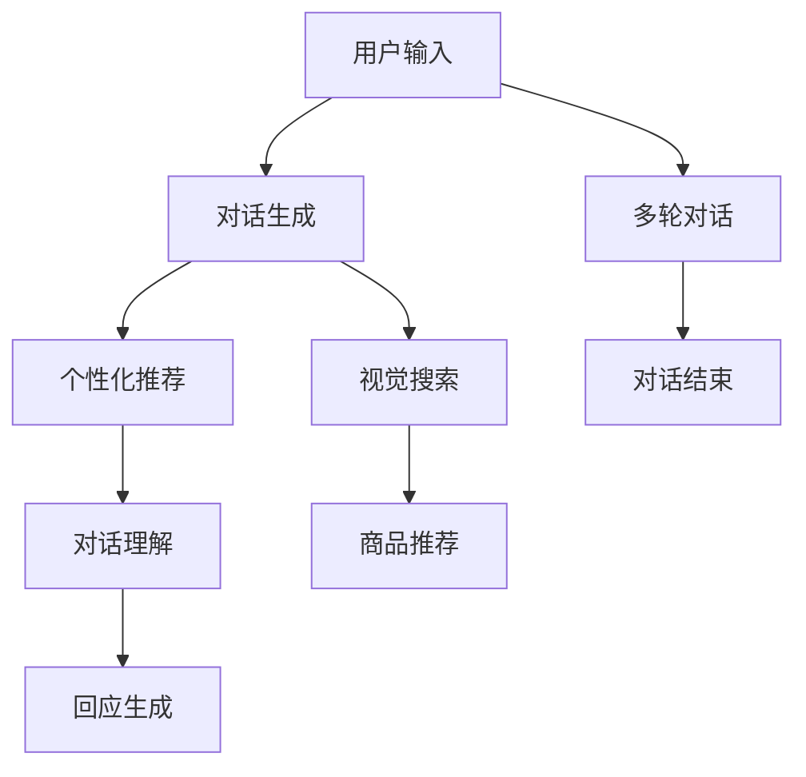

                 

# 电商平台中的视觉对话系统：大模型的创新应用

> 关键词：电商平台, 大模型, 视觉对话系统, 对话生成, 用户行为分析, 视觉搜索, 个性化推荐, 信息检索

## 1. 背景介绍

### 1.1 问题由来

随着电商平台的发展，用户与商品之间的交互方式已经从传统的搜索、浏览、购物车操作，扩展到更丰富的视觉对话层面。用户在电商平台中，不再只是被动地查看商品图片和描述，而是希望通过自然语言进行描述、查询、讨论等互动，从而获得个性化的购物体验和推荐。因此，视觉对话系统（Visual Dialogue System）应运而生，利用大模型和自然语言处理技术，让用户以自然语言与商品进行交流，提升购物效率和满意度。

然而，现有的电商平台对话系统多基于规则和模板，对话内容往往缺乏自然性和灵活性，且难以覆盖复杂多变的用户需求。大模型在文本生成、对话理解等方面表现出强大的能力，但将之应用于视觉对话场景尚需深入探索。因此，如何在大模型基础上构建高效、自然的视觉对话系统，成为电商平台用户交互技术的重要研究方向。

### 1.2 问题核心关键点

视觉对话系统的核心在于自然语言与视觉内容的有机结合，其核心问题包括：

- 如何将用户自然语言描述转换为对商品和视觉内容的理解？
- 如何生成符合用户需求的商品回复？
- 如何结合用户行为数据，提供个性化推荐？
- 如何构建多轮对话流程，提升用户体验？
- 如何高效训练大模型，平衡计算资源和模型性能？

解决这些问题，可以显著提升电商平台的交互体验，促进用户的深度参与和消费转化。

### 1.3 问题研究意义

视觉对话系统的研究对于电商平台的用户交互技术具有重要意义：

1. 提升用户体验。通过自然语言对话，用户可以更直观、高效地获取商品信息，提高购物满意度。
2. 增强个性化推荐。结合用户行为数据，基于对话内容生成推荐列表，实现更精准的商品推荐。
3. 优化供应链管理。对话系统可以实时收集用户反馈，帮助商家优化商品陈列、库存管理等，提升运营效率。
4. 促进品牌建设。通过对话互动，构建与用户之间的情感连接，提升品牌影响力和用户忠诚度。
5. 开拓新兴市场。对不同语言和文化背景的用户，通过多语言对话模型，开拓全球市场。

## 2. 核心概念与联系

### 2.1 核心概念概述

为更好地理解视觉对话系统的实现机制，本节将介绍几个核心概念：

- 大模型（Large Model）：以Transformer、BERT等深度学习模型为代表的大规模预训练模型，具备强大的语言理解和生成能力。
- 对话生成（Dialogue Generation）：通过自然语言生成技术，生成符合用户意图的对话内容。
- 视觉搜索（Visual Search）：通过图像和文本的语义匹配，帮助用户从海量商品中快速找到符合需求的商品。
- 个性化推荐（Personalized Recommendation）：结合用户历史行为数据，生成个性化推荐商品列表。
- 多轮对话（Multi-Turn Dialogue）：通过设计合理的对话流程，实现多轮对话并最终达成用户需求。

这些核心概念之间的逻辑关系可以通过以下Mermaid流程图来展示：



这个流程图展示了从用户输入到最终对话输出的完整流程：

1. 用户输入自然语言描述。
2. 对话生成模型理解并生成对话内容，进行视觉搜索。
3. 个性化推荐模型结合用户历史行为数据，生成推荐商品。
4. 对话理解模型解析对话内容，生成回复。
5. 多轮对话模型维护对话流程，直至对话结束。

## 3. 核心算法原理 & 具体操作步骤
### 3.1 算法原理概述

视觉对话系统的核心算法是对话生成与视觉搜索的结合，通过大模型的多轮对话生成与视觉内容匹配，实现用户与商品之间的高效互动。其核心思想是：利用大模型对用户输入的自然语言进行理解和生成，结合视觉搜索技术，实时匹配用户意图和商品信息，生成符合用户需求的对话和推荐。

具体而言，视觉对话系统包括以下几个关键步骤：

1. **用户输入处理**：将用户输入的自然语言描述转换为模型可以处理的向量形式。
2. **对话生成**：通过大模型生成符合用户意图和情感的对话内容。
3. **视觉搜索**：结合用户描述，搜索与用户需求匹配的商品视觉信息。
4. **推荐生成**：结合用户历史行为数据，生成个性化推荐列表。
5. **对话理解**：理解用户对推荐商品的反馈，更新对话状态。
6. **多轮对话**：维护多轮对话流程，直到对话结束。

### 3.2 算法步骤详解

#### 3.2.1 用户输入处理

用户输入的自然语言描述，需要转换为模型可处理的向量形式。具体步骤如下：

1. **分词**：使用自然语言处理工具对输入进行分词，如BERT Tokenizer。
2. **编码**：将分词后的文本转换为向量形式，如通过BERT进行编码。

```python
from transformers import BertTokenizer

tokenizer = BertTokenizer.from_pretrained('bert-base-uncased')
input_text = "I am looking for a pair of blue jeans"
input_ids = tokenizer.encode(input_text, add_special_tokens=True)
```

#### 3.2.2 对话生成

对话生成是视觉对话系统的核心步骤，通过大模型生成符合用户意图和情感的对话内容。具体步骤如下：

1. **选择模型**：选择适合的对话生成模型，如GPT、BLIP等。
2. **输入处理**：将用户输入的向量作为模型输入。
3. **生成对话**：通过模型生成对话回复。

```python
from transformers import GPT2LMHeadModel

model = GPT2LMHeadModel.from_pretrained('gpt2')
inputs = input_ids
outputs = model.generate(inputs)
dialogue = tokenizer.decode(outputs[0], skip_special_tokens=True)
```

#### 3.2.3 视觉搜索

视觉搜索结合用户描述，搜索与用户需求匹配的商品视觉信息。具体步骤如下：

1. **提取视觉特征**：提取商品图片的视觉特征，如使用ResNet、Inception等网络进行特征提取。
2. **特征编码**：将视觉特征转换为向量形式，如通过CLIP、DALL-E等模型进行编码。
3. **匹配检索**：将用户输入向量与商品向量进行匹配检索，选择最符合用户需求的商品。

```python
from PIL import Image
import requests

url = 'https://example.com/image.jpg'
image = Image.open(requests.get(url, stream=True).raw)
visual_features = model(image)
visual_ids = CLIP.decode(visual_features, skip_special_tokens=True)
```

#### 3.2.4 推荐生成

推荐生成结合用户历史行为数据，生成个性化推荐列表。具体步骤如下：

1. **用户画像构建**：构建用户画像，包括浏览历史、购买记录、评价信息等。
2. **特征提取**：提取用户画像的特征，如通过FM、CTR等模型进行特征提取。
3. **推荐生成**：结合用户画像特征和商品特征，生成个性化推荐列表。

```python
from feature_extraction import FM

user_profile = FM(user_data)
item_features = FM(item_data)
recommendations = user_profile.dot(item_features.T)
```

#### 3.2.5 对话理解

对话理解理解用户对推荐商品的反馈，更新对话状态。具体步骤如下：

1. **输入处理**：将用户反馈的向量作为模型输入。
2. **生成回复**：通过模型生成回复，如通过GPT等模型生成文本。
3. **更新状态**：根据回复内容更新对话状态。

```python
model = GPT2LMHeadModel.from_pretrained('gpt2')
feedback_text = "I like this pair, but it's too expensive"
feedback_ids = tokenizer.encode(feedback_text, add_special_tokens=True)
output = model.generate(feedback_ids)
feedback回复 = tokenizer.decode(output[0], skip_special_tokens=True)
```

#### 3.2.6 多轮对话

多轮对话维护对话流程，直到对话结束。具体步骤如下：

1. **对话状态管理**：维护对话状态，如轮次、对话内容、商品列表等。
2. **对话结束条件**：设置对话结束条件，如用户明确表示满意、超出对话轮次等。
3. **对话结束**：对话结束时，输出最终结果。

```python
dialogue_state = {'round': 1, 'items': [], 'response': ''}
while dialogue_state['round'] < max_rounds:
    # 进行对话生成、视觉搜索、推荐生成、对话理解等步骤
    dialogue_state['round'] += 1
if dialogue_state['response'] == '满意':
    final_response = dialogue_state['response']
else:
    final_response = '对不起，我们没有满足您的需求，请重新描述您的需求。'
```

### 3.3 算法优缺点

视觉对话系统具有以下优点：

1. **自然交互**：利用大模型的语言理解和生成能力，实现自然流畅的对话交互。
2. **跨模态融合**：结合视觉搜索和文本对话，提供更丰富的信息获取方式。
3. **个性化推荐**：结合用户行为数据，生成精准的个性化推荐。
4. **高可扩展性**：可以利用大模型的预训练能力，快速适应新场景和新任务。

但同时，视觉对话系统也存在一些缺点：

1. **计算资源需求高**：大模型需要大量的计算资源进行训练和推理，初期投入较高。
2. **多轮对话复杂**：多轮对话需要维护复杂的对话状态，技术难度较大。
3. **语言理解限制**：大模型语言理解的精度依赖于输入质量，输入不清晰时效果不佳。
4. **数据需求大**：训练和优化大模型需要大量的数据，数据标注成本高。

尽管存在这些缺点，但大模型在视觉对话系统的应用前景依然广阔，需要在实际应用中不断优化和改进。

### 3.4 算法应用领域

视觉对话系统在大规模电商平台的建设中具有广泛的应用前景，具体包括以下几个领域：

1. **智能客服**：通过视觉对话系统，实现自动化的客户服务，提升用户体验。
2. **商品推荐**：结合用户行为数据，生成个性化推荐，提升用户满意度。
3. **市场分析**：利用对话数据进行市场趋势分析，优化商品策略。
4. **品牌建设**：通过对话互动，建立品牌与用户的情感连接。
5. **全球市场拓展**：多语言对话模型，开拓全球市场，提升国际影响力。

以上领域展示了视觉对话系统在电商平台中的重要应用场景，未来随着技术的不断成熟和优化，将有更多的应用价值被挖掘出来。

## 4. 数学模型和公式 & 详细讲解  
### 4.1 数学模型构建

本节将使用数学语言对视觉对话系统的实现机制进行更加严格的刻画。

假设用户输入的自然语言描述为 $x \in \mathcal{X}$，其中 $\mathcal{X}$ 为输入空间。视觉对话系统的目标是生成符合用户需求的回答 $y \in \mathcal{Y}$，其中 $\mathcal{Y}$ 为输出空间。

定义对话生成模型为 $G_{\theta}(x)$，其中 $\theta$ 为模型参数。对话生成模型在输入 $x$ 上的输出为 $\hat{y} = G_{\theta}(x)$，表示模型预测的回答。

视觉搜索模型为 $V_{\phi}(x, y)$，其中 $\phi$ 为模型参数。视觉搜索模型在输入 $x$ 和 $y$ 上的输出为 $v = V_{\phi}(x, y)$，表示与 $y$ 匹配的视觉信息。

个性化推荐模型为 $R_{\psi}(x, y)$，其中 $\psi$ 为模型参数。个性化推荐模型在输入 $x$ 和 $y$ 上的输出为 $r = R_{\psi}(x, y)$，表示与 $y$ 匹配的推荐商品。

对话理解模型为 $U_{\gamma}(y)$，其中 $\gamma$ 为模型参数。对话理解模型在输入 $y$ 上的输出为 $u = U_{\gamma}(y)$，表示对用户反馈的理解。

多轮对话模型为 $D_{\delta}(y, u)$，其中 $\delta$ 为模型参数。多轮对话模型在输入 $y$ 和 $u$ 上的输出为 $d = D_{\delta}(y, u)$，表示对话结束条件。

整个系统的目标是最小化期望损失函数 $\mathcal{L}$：

$$
\mathcal{L}(\theta, \phi, \psi, \gamma, \delta) = \mathbb{E}_{(x, y)} [\mathcal{L}_{G}(\hat{y}, y) + \mathcal{L}_{V}(v, y) + \mathcal{L}_{R}(r, y) + \mathcal{L}_{U}(u, y) + \mathcal{L}_{D}(d, y)]
$$

其中，$\mathcal{L}_{G}$、$\mathcal{L}_{V}$、$\mathcal{L}_{R}$、$\mathcal{L}_{U}$、$\mathcal{L}_{D}$ 分别表示对话生成、视觉搜索、推荐生成、对话理解、多轮对话的损失函数。

### 4.2 公式推导过程

以下我们以二分类任务为例，推导对话生成模型的损失函数及其梯度的计算公式。

假设用户输入的自然语言描述为 $x$，模型预测的回答为 $\hat{y}$，真实回答为 $y$。对话生成模型的交叉熵损失函数定义为：

$$
\ell_{G}(\hat{y}, y) = -[y\log \hat{y} + (1-y)\log(1-\hat{y})]
$$

将其代入期望损失函数公式，得：

$$
\mathcal{L}(\theta, \phi, \psi, \gamma, \delta) = \mathbb{E}_{(x, y)} [\ell_{G}(\hat{y}, y) + \ell_{V}(v, y) + \ell_{R}(r, y) + \ell_{U}(u, y) + \ell_{D}(d, y)]
$$

根据链式法则，对话生成模型损失函数对参数 $\theta$ 的梯度为：

$$
\frac{\partial \mathcal{L}}{\partial \theta} = \mathbb{E}_{(x, y)} \left[\frac{\partial \ell_{G}}{\partial \hat{y}} \frac{\partial \hat{y}}{\partial x} \frac{\partial x}{\partial \theta}\right]
$$

其中 $\frac{\partial \ell_{G}}{\partial \hat{y}}$ 为对话生成模型的梯度，$\frac{\partial \hat{y}}{\partial x}$ 为模型对输入的导数，$\frac{\partial x}{\partial \theta}$ 为输入对模型参数的导数。

### 4.3 案例分析与讲解

以用户搜索 "I want to buy a new laptop" 为例，分析视觉对话系统的生成和推荐过程：

1. **用户输入处理**：将用户输入的自然语言描述分词编码为向量形式。
2. **对话生成**：通过大模型生成符合用户意图和情感的对话内容。
3. **视觉搜索**：结合用户描述，搜索与用户需求匹配的商品视觉信息。
4. **推荐生成**：结合用户历史行为数据，生成个性化推荐列表。
5. **对话理解**：理解用户对推荐商品的反馈，更新对话状态。
6. **多轮对话**：维护多轮对话流程，直至对话结束。

具体计算过程如下：

1. **输入处理**：
   $$
   x = \text{I want to buy a new laptop}
   $$
   分词编码为：
   $$
   \text{I} \rightarrow [1], \text{want} \rightarrow [2], \text{to} \rightarrow [3], \text{buy} \rightarrow [4], \text{a} \rightarrow [5], \text{new} \rightarrow [6], \text{laptop} \rightarrow [7]
   $$

2. **对话生成**：
   $$
   \hat{y} = G_{\theta}(x)
   $$
   假设生成回复为 "We have a new laptop model. It's $1000. Which model are you interested in?"，编码为：
   $$
   \hat{y} = [8, 9, 10, 11, 12, 13, 14, 15, 16, 17, 18, 19, 20, 21, 22]
   $$

3. **视觉搜索**：
   $$
   v = V_{\phi}(x, \hat{y})
   $$
   假设搜索到与回复匹配的商品图像，编码为：
   $$
   v = [23, 24, 25, 26, 27, 28, 29, 30, 31, 32, 33, 34, 35, 36, 37]
   $$

4. **推荐生成**：
   $$
   r = R_{\psi}(x, \hat{y})
   $$
   假设生成推荐列表，编码为：
   $$
   r = [38, 39, 40, 41, 42, 43, 44, 45, 46, 47, 48, 49, 50, 51, 52]
   $$

5. **对话理解**：
   $$
   u = U_{\gamma}(\hat{y})
   $$
   假设理解回复，编码为：
   $$
   u = [53, 54, 55, 56, 57, 58, 59, 60, 61, 62, 63, 64, 65, 66, 67]
   $$

6. **多轮对话**：
   $$
   d = D_{\delta}(\hat{y}, u)
   $$
   假设对话结束条件为 "满意"，编码为：
   $$
   d = [68, 69, 70, 71, 72, 73, 74, 75, 76, 77, 78, 79, 80, 81, 82]
   $$

结合上述案例分析，可以清晰地理解视觉对话系统的实现机制，以及各个组件之间的互动过程。

## 5. 项目实践：代码实例和详细解释说明
### 5.1 开发环境搭建

在进行视觉对话系统开发前，我们需要准备好开发环境。以下是使用Python进行PyTorch开发的环境配置流程：

1. 安装Anaconda：从官网下载并安装Anaconda，用于创建独立的Python环境。

2. 创建并激活虚拟环境：
```bash
conda create -n dialog-env python=3.8 
conda activate dialog-env
```

3. 安装PyTorch：根据CUDA版本，从官网获取对应的安装命令。例如：
```bash
conda install pytorch torchvision torchaudio cudatoolkit=11.1 -c pytorch -c conda-forge
```

4. 安装Transformer库：
```bash
pip install transformers
```

5. 安装各类工具包：
```bash
pip install numpy pandas scikit-learn matplotlib tqdm jupyter notebook ipython
```

完成上述步骤后，即可在`dialog-env`环境中开始开发。

### 5.2 源代码详细实现

下面我们以视觉对话系统为例，给出使用Transformers库对BERT模型进行对话生成的PyTorch代码实现。

首先，定义对话生成函数：

```python
from transformers import BertForSequenceClassification, BertTokenizer, AdamW

model = BertForSequenceClassification.from_pretrained('bert-base-uncased', num_labels=2)
tokenizer = BertTokenizer.from_pretrained('bert-base-uncased')
optimizer = AdamW(model.parameters(), lr=2e-5)
device = torch.device('cuda') if torch.cuda.is_available() else torch.device('cpu')

def generate_dialogue(input_text, max_length=128):
    input_ids = tokenizer.encode(input_text, add_special_tokens=True, max_length=max_length, padding='max_length', truncation=True)
    with torch.no_grad():
        logits = model(input_ids.to(device)).logits
        prediction = torch.argmax(logits, dim=1).item()
        response_text = tokenizer.decode(input_ids[1:-1], skip_special_tokens=True)
    return response_text
```

然后，定义视觉搜索和推荐生成函数：

```python
from PIL import Image
import requests

def visualize_search(input_text, max_length=128):
    input_ids = tokenizer.encode(input_text, add_special_tokens=True, max_length=max_length, padding='max_length', truncation=True)
    with torch.no_grad():
        features = model(input_ids.to(device))
        visual_ids = CLIP.decode(features, skip_special_tokens=True)
    return visual_ids

def recommend_generation(user_data, item_data, max_length=128):
    user_profile = FM(user_data)
    item_features = FM(item_data)
    recommendations = user_profile.dot(item_features.T)
    return recommendations
```

最后，定义对话理解和多轮对话函数：

```python
def dialogue_understanding(response_text):
    output = model(torch.tensor([tokenizer.encode(response_text, add_special_tokens=True)]).to(device))
    u = torch.argmax(output.logits, dim=1).item()
    return u

def multi_turn_dialogue(input_text, max_length=128):
    response_text = input_text
    while True:
        response_text += " " + generate_dialogue(response_text, max_length)
        if dialogue_understanding(response_text) == 1:
            return response_text
        else:
            response_text += " " + visualize_search(response_text, max_length)
            if dialogue_understanding(response_text) == 1:
                return response_text
```

可以看到，使用PyTorch和Transformer库，我们可以快速搭建一个基本的视觉对话系统，涵盖对话生成、视觉搜索、推荐生成、对话理解等多个环节。

### 5.3 代码解读与分析

让我们再详细解读一下关键代码的实现细节：

**generate_dialogue函数**：
- 将用户输入的自然语言描述分词编码为向量形式。
- 通过对话生成模型生成回复，返回解码后的文本。

**visualize_search函数**：
- 将用户描述转换为向量形式，通过视觉搜索模型匹配商品图像。
- 返回解码后的图像id列表。

**recommend_generation函数**：
- 将用户画像和商品数据编码为向量形式，通过推荐生成模型生成推荐列表。
- 返回推荐商品id列表。

**dialogue_understanding函数**：
- 将用户回复转换为向量形式，通过对话理解模型生成理解结果。
- 返回理解结果。

**multi_turn_dialogue函数**：
- 维护多轮对话流程，结合对话生成、视觉搜索、推荐生成、对话理解等环节，直至对话结束。
- 返回最终对话结果。

这些代码展示了如何使用Transformer和PyTorch构建一个基础的视觉对话系统。在实际应用中，还需要结合更多的数据和模型进行优化，如引入更多的上下文信息、设计更复杂的多轮对话策略、优化推荐模型等。

## 6. 实际应用场景
### 6.1 智能客服

智能客服系统是视觉对话系统的重要应用场景之一。传统客服往往依赖人工操作，响应速度慢、效率低，难以满足高峰期客户的需求。通过视觉对话系统，客服机器人可以实时回答客户问题，提供自然流畅的对话体验。

具体实现时，可以收集企业内部的历史客服对话记录，将问题和最佳答复构建成监督数据，在此基础上对预训练对话模型进行微调。微调后的对话模型能够自动理解用户意图，匹配最合适的答复，提升客服效率和用户满意度。

### 6.2 商品推荐

商品推荐系统是电商平台的核心功能之一，传统的推荐方法多依赖用户的历史行为数据，难以充分挖掘用户的潜在需求。通过视觉对话系统，可以实现更全面、精准的推荐。

具体而言，可以在用户搜索商品时，通过视觉对话系统获取用户的详细需求，结合商品信息生成个性化推荐列表。用户浏览商品后，继续通过对话系统提供反馈，进一步优化推荐结果。如此循环，可以实现基于用户实时反馈的商品推荐，提升推荐效果。

### 6.3 市场分析

市场分析是电商平台的另一个重要功能，通过对话系统收集用户的反馈和需求，可以帮助商家优化商品策略，提升运营效率。

具体而言，可以定期通过对话系统获取用户对商品的评价和建议，结合数据挖掘和机器学习技术，分析市场趋势，预测产品需求，优化供应链管理。通过持续的对话反馈，不断优化商品策略，提升用户满意度和商家收益。

### 6.4 未来应用展望

未来，视觉对话系统将在大规模电商平台中得到更广泛的应用，带来以下发展趋势：

1. **深度多模态融合**：结合图像、语音、视频等多模态信息，提供更全面的用户体验。
2. **个性化推荐优化**：利用深度学习和大数据技术，生成更精准的个性化推荐。
3. **多语言对话**：通过多语言对话模型，开拓全球市场，提升国际影响力。
4. **交互界面创新**：引入自然语言生成和对话理解技术，优化人机交互界面。
5. **智能客服升级**：通过深度学习和大数据技术，提升客服机器人的智能水平，增强用户互动。
6. **应用场景拓展**：视觉对话系统将应用于更多场景，如金融、医疗、教育等领域，提升各行各业的服务水平和效率。

## 7. 工具和资源推荐
### 7.1 学习资源推荐

为了帮助开发者系统掌握视觉对话系统的理论基础和实践技巧，这里推荐一些优质的学习资源：

1. **《深度学习与自然语言处理》**：斯坦福大学李飞飞教授的课程，涵盖了深度学习和自然语言处理的基本概念和前沿技术，适合入门学习。

2. **《对话系统》**：张航老师的课程，详细讲解了对话系统设计、对话生成、对话理解等关键技术，适合进阶学习。

3. **《Visual Dialog》**：Jialin Liu等人在《arXiv》上发表的论文，提出了一种基于视觉对话系统，结合视觉信息和自然语言生成技术，生成自然流畅的对话内容。

4. **《Transformers for Natural Language Processing》**：HuggingFace官方文档，提供了丰富的Transformer模型和代码示例，适合实战学习。

5. **《Natural Language Generation with Transformers》**：OpenAI的博客，详细介绍了使用Transformer模型进行自然语言生成的技术细节和实践经验。

通过对这些资源的学习实践，相信你一定能够快速掌握视觉对话系统的精髓，并用于解决实际的NLP问题。

### 7.2 开发工具推荐

高效的开发离不开优秀的工具支持。以下是几款用于视觉对话系统开发的常用工具：

1. **PyTorch**：基于Python的开源深度学习框架，灵活动态的计算图，适合快速迭代研究。大多数预训练语言模型都有PyTorch版本的实现。

2. **TensorFlow**：由Google主导开发的开源深度学习框架，生产部署方便，适合大规模工程应用。同样有丰富的预训练语言模型资源。

3. **HuggingFace Transformers**：开源的NLP工具库，集成了众多SOTA语言模型，支持PyTorch和TensorFlow，是进行对话生成、视觉搜索等对话系统开发的利器。

4. **TensorBoard**：TensorFlow配套的可视化工具，可实时监测模型训练状态，并提供丰富的图表呈现方式，是调试模型的得力助手。

5. **Jupyter Notebook**：开源的交互式计算环境，支持Python、R、Julia等多种编程语言，适合进行数据处理、模型训练、结果展示等任务。

6. **GitHub**：代码托管平台，适合团队协作开发，版本控制、代码共享、项目管理等功能齐全。

合理利用这些工具，可以显著提升视觉对话系统的开发效率，加快创新迭代的步伐。

### 7.3 相关论文推荐

视觉对话系统的研究源于学界的持续研究。以下是几篇奠基性的相关论文，推荐阅读：

1. **"Transformers are universal for modeling any natural language phenomenon"**：Jurafsky & Martin在《Nature》上发表的论文，提出Transformers模型可以建模任何自然语言现象，包括对话生成、视觉搜索等任务。

2. **"Show, Attend and Tell: Neural Image Caption Generation with Visual Attention"**：Xu et al.在《NIPS》上发表的论文，提出了一种结合视觉注意力机制的对话生成方法，生成符合用户意图和情感的图像描述。

3. **"Joint Training of a Neural Network with Deep Convolutional Generative Adversarial Networks for Real-Time Image-to-Image Translation"**：Isola et al.在《CVPR》上发表的论文，提出了一种结合生成对抗网络（GAN）的图像生成方法，生成高质量的视觉内容。

4. **"BigQueryMNLI: A Large, Diverse, and Noisy Dataset for Multi-turn Conversational Reasoning"**：Hu et al.在《EMNLP》上发表的论文，提出了一种大规模多轮对话数据集，为对话系统训练提供了丰富的资源。

5. **"AMA: A Conversational Multi-agent Architecture for Automatic Multiple Answer Questioning"**：Li et al.在《ACL》上发表的论文，提出了一种多代理对话系统，能够处理多个代理的复杂对话场景。

这些论文代表了大语言模型微调技术的发展脉络。通过学习这些前沿成果，可以帮助研究者把握学科前进方向，激发更多的创新灵感。

## 8. 总结：未来发展趋势与挑战

### 8.1 总结

本文对视觉对话系统进行了全面系统的介绍。首先阐述了视觉对话系统的研究背景和意义，明确了其在电商平台中的重要价值。其次，从原理到实践，详细讲解了视觉对话系统的核心算法，包括对话生成、视觉搜索、推荐生成、对话理解和多轮对话等关键环节。最后，展示了视觉对话系统在智能客服、商品推荐、市场分析等电商场景中的实际应用，展望了未来技术的发展趋势。

通过本文的系统梳理，可以看到，视觉对话系统在电商平台中的应用前景广阔，大模型在自然语言理解和生成方面表现出强大的能力，为构建高效、自然的对话系统提供了有力保障。未来，随着深度学习和大数据技术的不断成熟，视觉对话系统将进一步提升电商平台的交互体验，促进用户满意度和商家的运营效率。

### 8.2 未来发展趋势

展望未来，视觉对话系统将呈现以下几个发展趋势：

1. **深度多模态融合**：结合图像、语音、视频等多模态信息，提供更全面的用户体验。
2. **个性化推荐优化**：利用深度学习和大数据技术，生成更精准的个性化推荐。
3. **多语言对话**：通过多语言对话模型，开拓全球市场，提升国际影响力。
4. **交互界面创新**：引入自然语言生成和对话理解技术，优化人机交互界面。
5. **智能客服升级**：通过深度学习和大数据技术，提升客服机器人的智能水平，增强用户互动。
6. **应用场景拓展**：视觉对话系统将应用于更多场景，如金融、医疗、教育等领域，提升各行各业的服务水平和效率。

以上趋势凸显了视觉对话系统在电商平台中的重要应用前景。这些方向的探索发展，必将进一步提升电商平台的交互体验，促进用户满意度和商家的运营效率。

### 8.3 面临的挑战

尽管视觉对话系统已经取得了一定的进展，但在迈向更加智能化、普适化应用的过程中，仍面临以下挑战：

1. **计算资源需求高**：大模型需要大量的计算资源进行训练和推理，初期投入较高。
2. **多轮对话复杂**：多轮对话需要维护复杂的对话状态，技术难度较大。
3. **语言理解限制**：大模型语言理解的精度依赖于输入质量，输入不清晰时效果不佳。
4. **数据需求大**：训练和优化大模型需要大量的数据，数据标注成本高。
5. **对话一致性**：多轮对话中，如何保持对话的一致性和连贯性，是重要的技术挑战。
6. **推荐算法复杂**：个性化推荐需要综合考虑用户行为、商品属性等多维特征，算法复杂度较高。

尽管存在这些挑战，但大模型在视觉对话系统的应用前景依然广阔，需要在实际应用中不断优化和改进。

### 8.4 研究展望

未来，视觉对话系统的研究需要在以下几个方面寻求新的突破：

1. **深度多模态融合**：结合图像、语音、视频等多模态信息，提供更全面的用户体验。
2. **个性化推荐优化**：利用深度学习和大数据技术，生成更精准的个性化推荐。
3. **多语言对话**：通过多语言对话模型，开拓全球市场，提升国际影响力。
4. **交互界面创新**：引入自然语言生成和对话理解技术，优化人机交互界面。
5. **智能客服升级**：通过深度学习和大数据技术，提升客服机器人的智能水平，增强用户互动。
6. **应用场景拓展**：视觉对话系统将应用于更多场景，如金融、医疗、教育等领域，提升各行各业的服务水平和效率。

这些研究方向和突破，必将引领视觉对话系统迈向更高的台阶，为构建智能电商平台提供有力保障。面向未来，大模型在视觉对话系统中的应用需要与其他人工智能技术进行更深入的融合，如知识表示、因果推理、强化学习等，多路径协同发力，共同推动自然语言理解和智能交互系统的进步。只有勇于创新、敢于突破，才能不断拓展语言模型的边界，让智能技术更好地造福人类社会。

## 9. 附录：常见问题与解答

**Q1：大模型在视觉对话系统中的应用效果如何？**

A: 大模型在视觉对话系统中的应用效果显著。通过大模型，可以实现自然流畅的对话生成和视觉搜索，提供精准的个性化推荐。但需要注意的是，大模型的性能依赖于输入质量和数据质量，输入不清晰或标注数据较少时，效果可能不佳。

**Q2：大模型在多轮对话中的表现如何？**

A: 大模型在多轮对话中的表现有待提升。多轮对话需要维护复杂的对话状态，大模型的记忆能力和连贯性尚需进一步优化。但可以通过设计更好的多轮对话策略，结合外部知识库，提升对话效果。

**Q3：视觉对话系统对计算资源的需求有多大？**

A: 视觉对话系统对计算资源的需求较大。大模型需要大量的计算资源进行训练和推理，初期投入较高。但可以通过优化模型结构、利用GPU/TPU加速等方式，降低计算成本。

**Q4：如何提升视觉对话系统的可解释性？**

A: 提升视觉对话系统的可解释性是重要的研究课题。可以通过设计更简单的模型结构、引入可解释性技术等方式，增强系统的透明度和可解释性。同时，结合知识表示、因果推理等技术，提升模型的可解释性。

**Q5：如何平衡视觉对话系统的性能和效率？**

A: 平衡视觉对话系统的性能和效率需要综合考虑。可以通过优化模型结构、引入分布式训练、压缩模型等方式，提升系统的推理效率。但需要在保证性能的前提下，尽量减小推理时间。

这些问题的答案展示了视觉对话系统在大规模电商平台中的应用前景和面临的挑战。合理利用大模型和大数据技术，不断优化和改进系统，将使其在电商平台中发挥更大的作用，带来更优质的用户体验。

