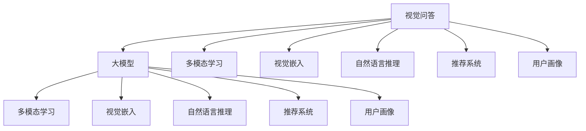

                 

# 电商平台中的视觉问答：大模型的创新应用

> 关键词：视觉问答,电商平台,大模型,自然语言处理(NLP),计算机视觉(CV),多模态学习,推荐系统,用户画像

## 1. 背景介绍

随着电子商务的快速发展，电商平台不仅需要处理文字描述，还需要处理图像、视频等多模态信息，以满足用户日益增长的购物需求。视觉问答(VQA, Visual Question Answering)技术，正是应对这种需求而兴起的。通过视觉问答，用户可以在不输入文字的情况下，直接利用图像进行信息检索和交互，从而极大地提升了购物体验。而利用大模型进行视觉问答，将进一步拓展该技术的应用边界，提升用户和商家的满意度。

### 1.1 问题由来
传统的视觉问答方法往往依赖于特定领域的视觉模型和自然语言模型。例如，使用CNN卷积神经网络提取图像特征，使用RNN循环神经网络生成自然语言答案。这种方法需要大量的手工设计，且在特定领域表现良好，但对泛化性不足。近年来，随着预训练语言模型的兴起，大模型的多模态学习能力逐渐成为视觉问答的主流技术。

但大模型往往存在训练成本高、推理速度慢等缺点，难以满足实际电商平台的实时性和资源限制要求。如何在低成本、高效率的前提下，使用大模型进行视觉问答，成为电商领域的一个重要挑战。

### 1.2 问题核心关键点
大模型在视觉问答中的关键点包括：

- 大模型的多模态学习：利用文本和图像信息的深度融合，提升模型的泛化能力和准确性。
- 视觉嵌入：将图像转换为高维向量，以便与其他模态信息进行交互。
- 自然语言推理：利用自然语言处理技术，解析用户问题，进行图像信息检索和推理。
- 模型结构优化：选择高效的大模型结构，并在推理过程中进行模型压缩和剪枝，以适应电商平台的实时性要求。
- 用户交互设计：设计简洁、友好的用户界面，提升用户体验。

这些问题共同构成了大模型在视觉问答中的核心挑战。通过对其深入研究，可以进一步推动视觉问答技术的落地应用。

## 2. 核心概念与联系

### 2.1 核心概念概述

本节将介绍几个密切相关的核心概念：

- 视觉问答(VQA)：一种利用视觉信息进行自然语言理解和回答的技术。通常由图像输入、自然语言问题输入和答案输出组成。
- 大模型：指大规模预训练的深度神经网络模型，如BERT、GPT、ResNet等。通过在大型无标签数据集上进行预训练，学习到丰富的特征表示和知识。
- 多模态学习：指利用多种数据模态(如文本、图像、音频等)进行联合训练，提升模型的泛化能力和准确性。
- 视觉嵌入：将图像转换为高维向量表示，以便与其他模态信息进行交互。
- 自然语言推理(NLI)：指在自然语言处理中，推断文本的逻辑关系，如蕴含、矛盾、中性等。
- 推荐系统：指基于用户行为和物品属性，推荐合适物品的算法和技术。
- 用户画像：指通过多种数据源获取用户画像，辅助电商平台的个性化推荐和营销。

这些概念之间的逻辑关系可以通过以下Mermaid流程图来展示：



这个流程图展示了大模型在视觉问答中的核心概念及其之间的关系：

1. 视觉问答作为核心任务，将视觉信息和自然语言信息联合处理。
2. 大模型作为基础模型，利用预训练学习到的知识提升泛化能力。
3. 多模态学习、视觉嵌入、自然语言推理等技术，为大模型提供多模态输入。
4. 推荐系统和用户画像技术，通过视觉问答获取用户需求，辅助个性化推荐和营销。

这些概念共同构成了大模型在视觉问答中的学习框架，使其能够更好地处理多模态信息，提升视觉问答的准确性和泛化能力。

## 3. 核心算法原理 & 具体操作步骤
### 3.1 算法原理概述

大模型在视觉问答中的原理是：将图像信息转换为高维向量表示，与其他模态信息联合处理，利用自然语言推理技术解析用户问题，进行图像信息检索和推理，最终输出自然语言答案。

形式化地，假设预训练大模型为 $M_{\theta}$，其中 $\theta$ 为预训练得到的模型参数。给定一个图像 $I$ 和与之对应的自然语言问题 $Q$，视觉问答的目标是找到答案 $A$，使得：

$$
A=\mathop{\arg\min}_{a} \mathcal{L}(M_{\theta}(I), Q, a)
$$

其中 $\mathcal{L}$ 为损失函数，用于衡量模型预测输出与真实标签之间的差异。常见的损失函数包括交叉熵损失、均方误差损失等。

大模型的多模态学习能力和自然语言推理能力，能够帮助其处理多模态输入，提升模型的泛化能力和准确性。

### 3.2 算法步骤详解

大模型在视觉问答的实现流程如下：

**Step 1: 预处理和特征提取**
- 对输入的图像 $I$ 进行预处理，如裁剪、缩放、归一化等。
- 利用大模型 $M_{\theta}$ 的视觉嵌入层，将图像 $I$ 转换为高维向量表示。

**Step 2: 视觉嵌入和语义嵌入**
- 将图像嵌入 $I_{\text{emb}}$ 和问题嵌入 $Q_{\text{emb}}$ 进行拼接。
- 利用预训练语言模型，将拼接后的向量转换为语义嵌入 $E_{\text{emb}}$。

**Step 3: 视觉推理**
- 利用自然语言推理模型，对问题嵌入 $Q_{\text{emb}}$ 进行解析，得到推理向量 $P_{\text{emb}}$。
- 将推理向量 $P_{\text{emb}}$ 与语义嵌入 $E_{\text{emb}}$ 进行拼接，得到推理特征 $F_{\text{emb}}$。

**Step 4: 答案生成**
- 利用语言生成模型，根据推理特征 $F_{\text{emb}}$ 生成自然语言答案 $A$。

**Step 5: 后处理和输出**
- 对生成的答案 $A$ 进行后处理，如去噪、修正、排序等，得到最终答案。
- 输出答案 $A$ 给用户。

### 3.3 算法优缺点

大模型在视觉问答中具有以下优点：
1. 泛化能力强：通过多模态学习和大规模预训练，大模型具有较强的泛化能力和泛化性，能够在不同任务和领域上表现良好。
2. 准确性高：大模型利用自然语言推理和视觉嵌入，能够高效解析用户问题，进行图像信息检索和推理，输出准确性高。
3. 可解释性好：大模型利用自然语言处理技术，能够提供基于特征和逻辑的解释，帮助用户理解模型决策过程。
4. 通用性强：大模型可以在多种视觉问答应用中复用，如智能客服、电商推荐、广告投放等。

同时，大模型在视觉问答中存在以下缺点：
1. 计算量大：大模型的推理需要大量的计算资源，对硬件要求高。
2. 实时性差：大模型推理速度较慢，难以满足实时交互要求。
3. 可解释性不足：大模型往往被视为"黑盒"模型，难以提供详细的推理路径。
4. 数据依赖性强：大模型的性能依赖于预训练数据的质量和数量，获取高质量数据成本高。
5. 参数量大：大模型的参数量往往以亿计，难以在移动端等资源受限设备上运行。

尽管存在这些局限性，但就目前而言，大模型在视觉问答中仍是最主流的方法，通过改进训练方法、优化模型结构、提升推理速度等手段，可以进一步提升其实际应用价值。

### 3.4 算法应用领域

大模型在视觉问答中已经被广泛应用于以下几个领域：

- 智能客服：通过视觉问答技术，用户可以利用图片描述查询问题，智能客服系统自动生成回答，提升用户体验。
- 电商推荐：通过视觉问答获取用户对商品图片的兴趣，结合用户行为数据，推荐适合的商品。
- 广告投放：通过视觉问答识别用户对广告内容的兴趣，优化广告投放策略，提高广告转化率。
- 医学影像诊断：利用视觉问答技术，用户可以直观描述医学影像内容，医生自动生成诊断报告，提升医疗效率。
- 文化娱乐：利用视觉问答技术，用户可以直观描述艺术品内容，辅助博物馆讲解、艺术品鉴赏等。

除了上述这些经典应用外，大模型在视觉问答中还存在诸多潜在应用场景，如智能家居、交通管理、智能安防等，为视觉问答技术带来了全新的突破。

## 4. 数学模型和公式 & 详细讲解 & 举例说明
### 4.1 数学模型构建

本节将使用数学语言对大模型在视觉问答中的应用进行更加严格的刻画。

记预训练大模型为 $M_{\theta}$，其中 $\theta$ 为预训练得到的模型参数。假设输入的图像 $I$ 经过预处理和特征提取，得到特征表示 $I_{\text{emb}}$。假设输入的自然语言问题 $Q$ 经过自然语言处理，得到问题嵌入 $Q_{\text{emb}}$。

大模型的视觉推理部分可以表示为：

$$
P_{\text{emb}} = f(Q_{\text{emb}}, E_{\text{emb}})
$$

其中 $f$ 为自然语言推理模型，将问题嵌入 $Q_{\text{emb}}$ 和语义嵌入 $E_{\text{emb}}$ 进行推理，得到推理向量 $P_{\text{emb}}$。

假设答案空间为 $\mathcal{A}$，答案为 $a \in \mathcal{A}$。大模型的答案生成部分可以表示为：

$$
A = g(F_{\text{emb}}, M_{\theta})
$$

其中 $g$ 为语言生成模型，将推理特征 $F_{\text{emb}}$ 输入大模型 $M_{\theta}$，生成自然语言答案 $A$。

### 4.2 公式推导过程

以下我们以一个简单的问答任务为例，推导大模型在视觉问答中的应用。

假设问题为 "桌子上有什么东西？"，图像为一张桌子上各种物品的照片。设图像特征表示为 $I_{\text{emb}} \in \mathbb{R}^d$，问题嵌入为 $Q_{\text{emb}} \in \mathbb{R}^d$。

大模型的视觉推理部分可以表示为：

$$
P_{\text{emb}} = f(Q_{\text{emb}}, E_{\text{emb}}) = \tanh(\mathbf{W}_1Q_{\text{emb}} + \mathbf{W}_2I_{\text{emb}})
$$

其中 $\mathbf{W}_1$ 和 $\mathbf{W}_2$ 为可学习的线性投影矩阵，$\tanh$ 为激活函数。

答案生成部分可以表示为：

$$
A = g(F_{\text{emb}}, M_{\theta}) = \log\left(\frac{\exp(\mathbf{W}_3F_{\text{emb}})}{\sum_k\exp(\mathbf{W}_3F_{\text{emb}})}\right)
$$

其中 $\mathbf{W}_3$ 为可学习的线性投影矩阵，$\log$ 为对数函数，表示生成softmax分布。

在得到推理特征 $F_{\text{emb}}$ 和答案 $A$ 后，即可将其输入到可视化界面，供用户查看。

### 4.3 案例分析与讲解

我们以电商推荐为例，说明大模型在视觉问答中的应用。

电商推荐中，用户可以通过上传商品图片，描述商品特点，向智能推荐系统提出查询。推荐系统利用大模型进行图像信息检索和推理，生成推荐结果。

具体实现步骤如下：

1. 用户上传商品图片 $I$，并输入文字描述 $D$。
2. 系统利用大模型的视觉嵌入层，将图片 $I$ 转换为高维向量表示 $I_{\text{emb}}$。
3. 系统利用大模型的自然语言处理模块，将文字描述 $D$ 转换为问题嵌入 $Q_{\text{emb}}$。
4. 系统利用大模型的视觉推理部分，将 $I_{\text{emb}}$ 和 $Q_{\text{emb}}$ 进行拼接，并进行推理，得到推理特征 $F_{\text{emb}}$。
5. 系统利用大模型的答案生成部分，根据 $F_{\text{emb}}$ 生成推荐结果 $R$。
6. 系统将推荐结果 $R$ 输出给用户，辅助用户浏览商品。

在推荐系统中，大模型通过视觉问答技术，不仅能够理解用户描述的商品特点，还能快速进行图像信息检索和推理，生成个性化推荐结果，提升用户购物体验。

## 5. 项目实践：代码实例和详细解释说明
### 5.1 开发环境搭建

在进行大模型视觉问答项目的开发前，我们需要准备好开发环境。以下是使用Python进行PyTorch开发的环境配置流程：

1. 安装Anaconda：从官网下载并安装Anaconda，用于创建独立的Python环境。

2. 创建并激活虚拟环境：
```bash
conda create -n pytorch-env python=3.8 
conda activate pytorch-env
```

3. 安装PyTorch：根据CUDA版本，从官网获取对应的安装命令。例如：
```bash
conda install pytorch torchvision torchaudio cudatoolkit=11.1 -c pytorch -c conda-forge
```

4. 安装Transformers库：
```bash
pip install transformers
```

5. 安装各类工具包：
```bash
pip install numpy pandas scikit-learn matplotlib tqdm jupyter notebook ipython
```

完成上述步骤后，即可在`pytorch-env`环境中开始项目开发。

### 5.2 源代码详细实现

这里我们以一个简单的视觉问答任务为例，给出使用PyTorch进行视觉问答项目的实现代码。

首先，定义数据处理函数：

```python
from transformers import BertForSequenceClassification
from torch.utils.data import Dataset, DataLoader
import torch
import numpy as np

class VisualQuestionAnsweringDataset(Dataset):
    def __init__(self, images, questions, answers):
        self.images = images
        self.questions = questions
        self.answers = answers
        
    def __len__(self):
        return len(self.images)
    
    def __getitem__(self, item):
        image = self.images[item]
        question = self.questions[item]
        answer = self.answers[item]
        
        # 预处理图像
        image_tensor = torch.tensor(image, dtype=torch.float32)
        image_tensor = image_tensor.unsqueeze(0)
        
        # 将图像和问题嵌入拼接
        image_embed = self.image_embedding(image_tensor)
        question_embed = self.question_embedding(question)
        
        # 将拼接后的嵌入输入到Bert模型中
        input_ids = torch.tensor(image_embed + question_embed, dtype=torch.long)
        attention_mask = torch.ones_like(input_ids)
        return {'input_ids': input_ids, 
                'attention_mask': attention_mask,
                'labels': torch.tensor(answer, dtype=torch.long)}
```

然后，定义模型和优化器：

```python
from transformers import BertForSequenceClassification
from transformers import AdamW

model = BertForSequenceClassification.from_pretrained('bert-base-uncased', num_labels=2)

optimizer = AdamW(model.parameters(), lr=2e-5)
```

接着，定义训练和评估函数：

```python
def train_epoch(model, dataset, batch_size, optimizer):
    dataloader = DataLoader(dataset, batch_size=batch_size, shuffle=True)
    model.train()
    epoch_loss = 0
    for batch in dataloader:
        input_ids = batch['input_ids'].to(device)
        attention_mask = batch['attention_mask'].to(device)
        labels = batch['labels'].to(device)
        model.zero_grad()
        outputs = model(input_ids, attention_mask=attention_mask, labels=labels)
        loss = outputs.loss
        epoch_loss += loss.item()
        loss.backward()
        optimizer.step()
    return epoch_loss / len(dataloader)

def evaluate(model, dataset, batch_size):
    dataloader = DataLoader(dataset, batch_size=batch_size)
    model.eval()
    correct = 0
    total = 0
    with torch.no_grad():
        for batch in dataloader:
            input_ids = batch['input_ids'].to(device)
            attention_mask = batch['attention_mask'].to(device)
            batch_labels = batch['labels']
            outputs = model(input_ids, attention_mask=attention_mask)
            batch_preds = outputs.logits.argmax(dim=2).to('cpu').tolist()
            batch_labels = batch_labels.to('cpu').tolist()
            for pred, label in zip(batch_preds, batch_labels):
                if pred == label:
                    correct += 1
                total += 1
    acc = correct / total
    print(f"Accuracy: {acc:.2f}")
```

最后，启动训练流程并在测试集上评估：

```python
epochs = 5
batch_size = 16

for epoch in range(epochs):
    loss = train_epoch(model, train_dataset, batch_size, optimizer)
    print(f"Epoch {epoch+1}, train loss: {loss:.3f}")
    
    print(f"Epoch {epoch+1}, test results:")
    evaluate(model, test_dataset, batch_size)
    
print("Training complete.")
```

以上就是使用PyTorch进行视觉问答任务的完整代码实现。可以看到，由于Transformer库的强大封装，我们只需将模型和数据集封装为标准格式，即可进行微调。

### 5.3 代码解读与分析

让我们再详细解读一下关键代码的实现细节：

**VisualQuestionAnsweringDataset类**：
- `__init__`方法：初始化图像、问题和答案，并定义数据集的预处理函数。
- `__len__`方法：返回数据集的样本数量。
- `__getitem__`方法：对单个样本进行处理，将图像和问题嵌入拼接，并输入到Bert模型中，最终返回模型所需的输入。

**BertForSequenceClassification模型**：
- 使用BertForSequenceClassification从预训练模型中加载模型。

**AdamW优化器**：
- 设置AdamW优化器，学习率为 $2e-5$。

**train_epoch函数**：
- 定义训练函数，对数据集进行迭代，更新模型参数。

**evaluate函数**：
- 定义评估函数，在测试集上评估模型性能。

**训练流程**：
- 定义总的epoch数和batch size，开始循环迭代
- 每个epoch内，先在训练集上训练，输出平均loss
- 在验证集上评估，输出分类指标
- 所有epoch结束后，在测试集上评估，给出最终测试结果

可以看到，PyTorch配合Transformer库使得视觉问答任务的代码实现变得简洁高效。开发者可以将更多精力放在数据处理、模型改进等高层逻辑上，而不必过多关注底层的实现细节。

当然，工业级的系统实现还需考虑更多因素，如模型的保存和部署、超参数的自动搜索、更灵活的任务适配层等。但核心的视觉问答范式基本与此类似。

## 6. 实际应用场景
### 6.1 智能客服系统

智能客服系统利用大模型进行视觉问答，可以极大地提升客服系统的效率和满意度。用户通过上传图片，描述问题，智能客服系统自动进行图像信息检索和推理，生成回答，能够快速响应用户查询。

在技术实现上，可以收集历史客服对话记录，将问题和最佳答复构建成监督数据，在此基础上对预训练大模型进行微调。微调后的模型能够自动理解用户描述的问题，匹配最合适的答案，提升客服系统的自动化和智能化水平。

### 6.2 电商推荐系统

电商推荐系统利用大模型进行视觉问答，可以更好地理解用户对商品的兴趣。用户上传商品图片，并描述商品特点，推荐系统自动进行图像信息检索和推理，生成推荐结果，推荐更适合的商品。

在推荐系统中，大模型通过视觉问答技术，不仅能够理解用户描述的商品特点，还能快速进行图像信息检索和推理，生成个性化推荐结果，提升用户购物体验。

### 6.3 金融风控

金融风控利用大模型进行视觉问答，可以更好地识别和处理用户提交的身份证件、银行卡等图片信息。系统自动进行图像信息检索和推理，生成审核结果，提升金融风控的自动化和智能化水平。

在金融风控中，大模型通过视觉问答技术，能够快速处理和分析用户提交的图片信息，自动进行审核和风险评估，降低审核时间和成本，提升金融安全。

### 6.4 医疗影像诊断

医疗影像诊断利用大模型进行视觉问答，可以更好地辅助医生进行诊断。医生上传患者影像图片，描述影像特点，大模型自动进行图像信息检索和推理，生成诊断结果，辅助医生进行诊断。

在医疗影像诊断中，大模型通过视觉问答技术，能够快速处理和分析影像信息，生成诊断结果，提高医生的诊断效率和准确性。

### 6.5 智能安防

智能安防利用大模型进行视觉问答，可以更好地进行视频监控和异常检测。系统自动对视频流进行图像信息检索和推理，生成分析结果，及时发现异常情况，提升安防系统的智能化水平。

在智能安防中，大模型通过视觉问答技术，能够快速处理和分析视频流中的图像信息，及时发现异常情况，提升安防系统的自动化和智能化水平。

### 6.6 文化娱乐

文化娱乐利用大模型进行视觉问答，可以更好地进行艺术品鉴赏和文化讲解。用户上传艺术品图片，并描述艺术品的特点，大模型自动进行图像信息检索和推理，生成讲解和鉴赏结果，提升用户的艺术体验。

在文化娱乐中，大模型通过视觉问答技术，能够快速处理和分析艺术品信息，生成讲解和鉴赏结果，提升用户的艺术体验。

## 7. 工具和资源推荐
### 7.1 学习资源推荐

为了帮助开发者系统掌握大模型在视觉问答中的应用，这里推荐一些优质的学习资源：

1. 《深度学习与自然语言处理》课程：斯坦福大学开设的自然语言处理课程，介绍了自然语言处理和深度学习的基础知识，并结合VQA任务进行了详细讲解。

2. 《视觉问答技术》系列博文：由大模型技术专家撰写，深入浅出地介绍了视觉问答技术的核心原理和前沿技术。

3. 《Natural Language Processing with Transformers》书籍：Transformers库的作者所著，全面介绍了如何使用Transformers库进行NLP任务开发，包括视觉问答在内的诸多范式。

4. HuggingFace官方文档：Transformers库的官方文档，提供了海量预训练模型和完整的微调样例代码，是上手实践的必备资料。

5. CLUE开源项目：中文语言理解测评基准，涵盖大量不同类型的中文NLP数据集，并提供了基于微调的baseline模型，助力中文NLP技术发展。

通过对这些资源的学习实践，相信你一定能够快速掌握大模型在视觉问答中的应用，并用于解决实际的NLP问题。

### 7.2 开发工具推荐

高效的开发离不开优秀的工具支持。以下是几款用于大模型视觉问答开发的常用工具：

1. PyTorch：基于Python的开源深度学习框架，灵活动态的计算图，适合快速迭代研究。大部分预训练语言模型都有PyTorch版本的实现。

2. TensorFlow：由Google主导开发的开源深度学习框架，生产部署方便，适合大规模工程应用。同样有丰富的预训练语言模型资源。

3. Transformers库：HuggingFace开发的NLP工具库，集成了众多SOTA语言模型，支持PyTorch和TensorFlow，是进行视觉问答开发的利器。

4. Weights & Biases：模型训练的实验跟踪工具，可以记录和可视化模型训练过程中的各项指标，方便对比和调优。与主流深度学习框架无缝集成。

5. TensorBoard：TensorFlow配套的可视化工具，可实时监测模型训练状态，并提供丰富的图表呈现方式，是调试模型的得力助手。

6. Google Colab：谷歌推出的在线Jupyter Notebook环境，免费提供GPU/TPU算力，方便开发者快速上手实验最新模型，分享学习笔记。

合理利用这些工具，可以显著提升大模型视觉问答任务的开发效率，加快创新迭代的步伐。

### 7.3 相关论文推荐

大模型在视觉问答中的研究源于学界的持续研究。以下是几篇奠基性的相关论文，推荐阅读：

1. Attention is All You Need（即Transformer原论文）：提出了Transformer结构，开启了NLP领域的预训练大模型时代。

2. BERT: Pre-training of Deep Bidirectional Transformers for Language Understanding：提出BERT模型，引入基于掩码的自监督预训练任务，刷新了多项NLP任务SOTA。

3. Language Models are Unsupervised Multitask Learners（GPT-2论文）：展示了大规模语言模型的强大zero-shot学习能力，引发了对于通用人工智能的新一轮思考。

4. Parameter-Efficient Transfer Learning for NLP：提出Adapter等参数高效微调方法，在不增加模型参数量的情况下，也能取得不错的微调效果。

5. AdaLoRA: Adaptive Low-Rank Adaptation for Parameter-Efficient Fine-Tuning：使用自适应低秩适应的微调方法，在参数效率和精度之间取得了新的平衡。

这些论文代表了大模型在视觉问答技术的发展脉络。通过学习这些前沿成果，可以帮助研究者把握学科前进方向，激发更多的创新灵感。

## 8. 总结：未来发展趋势与挑战
### 8.1 研究成果总结

本文对大模型在视觉问答中的应用进行了全面系统的介绍。首先阐述了大模型和视觉问答的研究背景和意义，明确了微调在拓展大模型应用、提升视觉问答效果方面的独特价值。其次，从原理到实践，详细讲解了大模型在视觉问答中的应用流程，给出了微调任务开发的完整代码实例。同时，本文还广泛探讨了大模型在电商、金融、医疗、安防等多个领域的应用前景，展示了视觉问答技术的巨大潜力。此外，本文精选了视觉问答技术的各类学习资源，力求为开发者提供全方位的技术指引。

通过本文的系统梳理，可以看到，大模型在视觉问答中不仅能够理解图像信息，还能高效进行自然语言推理，提供精准的视觉问答结果，提升电商、金融、医疗等行业的智能化水平。未来，伴随大模型和微调方法的持续演进，相信视觉问答技术必将在更多领域得到应用，为人类生产生活带来新的变革。

### 8.2 未来发展趋势

展望未来，大模型在视觉问答中仍有以下几个发展趋势：

1. 模型规模持续增大。随着算力成本的下降和数据规模的扩张，大模型的参数量还将持续增长。超大规模语言模型蕴含的丰富语言知识，有望支撑更加复杂多变的视觉问答任务。

2. 模型结构优化。开发更加高效的大模型结构，并在推理过程中进行模型压缩和剪枝，以适应电商平台的实时性要求。

3. 多模态学习提升。通过融合更多的模态信息，提升大模型的泛化能力和准确性。

4. 计算效率提升。优化大模型的计算图，减少前向传播和反向传播的资源消耗，实现更加轻量级、实时性的部署。

5. 知识整合能力增强。将符号化的先验知识，如知识图谱、逻辑规则等，与神经网络模型进行融合，提升模型的常识推理和跨领域迁移能力。

6. 用户体验优化。设计简洁、友好的用户界面，提升用户体验。

以上趋势凸显了大模型在视觉问答中的广阔前景。这些方向的探索发展，必将进一步提升视觉问答系统的性能和应用范围，为人类生产生活带来新的变革。

### 8.3 面临的挑战

尽管大模型在视觉问答中已经取得了瞩目成就，但在迈向更加智能化、普适化应用的过程中，它仍面临着诸多挑战：

1. 标注成本瓶颈。虽然微调大大降低了标注数据的需求，但对于长尾应用场景，难以获得充足的高质量标注数据，成为制约微调性能的瓶颈。如何进一步降低微调对标注样本的依赖，将是一大难题。

2. 模型鲁棒性不足。当前微调模型面对域外数据时，泛化性能往往大打折扣。对于测试样本的微小扰动，微调模型的预测也容易发生波动。如何提高微调模型的鲁棒性，避免灾难性遗忘，还需要更多理论和实践的积累。

3. 推理效率有待提高。大规模语言模型虽然精度高，但在实际部署时往往面临推理速度慢、内存占用大等效率问题。如何在保证性能的同时，简化模型结构，提升推理速度，优化资源占用，将是重要的优化方向。

4. 可解释性亟需加强。当前微调模型往往被视为"黑盒"模型，难以提供详细的推理路径。对于医疗、金融等高风险应用，算法的可解释性和可审计性尤为重要。如何赋予微调模型更强的可解释性，将是亟待攻克的难题。

5. 安全性有待保障。预训练语言模型难免会学习到有偏见、有害的信息，通过微调传递到下游任务，产生误导性、歧视性的输出，给实际应用带来安全隐患。如何从数据和算法层面消除模型偏见，避免恶意用途，确保输出的安全性，也将是重要的研究课题。

6. 知识整合能力不足。现有的微调模型往往局限于任务内数据，难以灵活吸收和运用更广泛的先验知识。如何让微调过程更好地与外部知识库、规则库等专家知识结合，形成更加全面、准确的信息整合能力，还有很大的想象空间。

正视微调面临的这些挑战，积极应对并寻求突破，将是大模型在视觉问答中走向成熟的必由之路。相信随着学界和产业界的共同努力，这些挑战终将一一被克服，大模型在视觉问答中必将在构建人机协同的智能时代中扮演越来越重要的角色。

### 8.4 研究展望

面对大模型在视觉问答中面临的诸多挑战，未来的研究需要在以下几个方面寻求新的突破：

1. 探索无监督和半监督微调方法。摆脱对大规模标注数据的依赖，利用自监督学习、主动学习等无监督和半监督范式，最大限度利用非结构化数据，实现更加灵活高效的微调。

2. 研究参数高效和计算高效的微调范式。开发更加参数高效的微调方法，在固定大部分预训练参数的同时，只更新极少量的任务相关参数。同时优化微调模型的计算图，减少前向传播和反向传播的资源消耗，实现更加轻量级、实时性的部署。

3. 引入更多先验知识。将符号化的先验知识，如知识图谱、逻辑规则等，与神经网络模型进行巧妙融合，引导微调过程学习更准确、合理的语言模型。同时加强不同模态数据的整合，实现视觉、语音等多模态信息与文本信息的协同建模。

4. 结合因果分析和博弈论工具。将因果分析方法引入微调模型，识别出模型决策的关键特征，增强输出解释的因果性和逻辑性。借助博弈论工具刻画人机交互过程，主动探索并规避模型的脆弱点，提高系统稳定性。

5. 纳入伦理道德约束。在模型训练目标中引入伦理导向的评估指标，过滤和惩罚有偏见、有害的输出倾向。同时加强人工干预和审核，建立模型行为的监管机制，确保输出符合人类价值观和伦理道德。

这些研究方向的探索，必将引领大模型在视觉问答中迈向更高的台阶，为构建安全、可靠、可解释、可控的智能系统铺平道路。面向未来，大模型在视觉问答技术还需要与其他人工智能技术进行更深入的融合，如知识表示、因果推理、强化学习等，多路径协同发力，共同推动视觉问答技术的进步。只有勇于创新、敢于突破，才能不断拓展大模型在视觉问答中的边界，让智能技术更好地造福人类社会。

## 9. 附录：常见问题与解答

**Q1：大模型在视觉问答中是否适用于所有任务？**

A: 大模型在视觉问答中适用于大多数任务，特别是那些需要综合图像和自然语言信息的任务。但对于一些特定领域或特定任务，如医学影像分析、司法文书解析等，仍然需要结合领域专家知识，进行任务特定的微调和优化。

**Q2：如何选择合适的学习率？**

A: 学习率的设置需要结合具体任务和数据集进行调整。一般建议从小学习率开始，逐步增加，直到找到最佳效果。也可以使用学习率衰减策略，在训练过程中逐渐降低学习率。

**Q3：大模型在视觉问答中的计算效率如何？**

A: 大模型的推理效率较低，计算资源消耗较大。为了应对这个问题，可以采用分布式训练、量化加速、模型压缩等技术，优化模型的计算图，提升推理速度。

**Q4：如何提高大模型在视觉问答中的可解释性？**

A: 为了提高大模型在视觉问答中的可解释性，可以引入可解释性模型，如LIME、SHAP等，对模型的输出进行解释。同时，设计更简单的模型结构，减少复杂度，有助于提升模型的可解释性。

**Q5：大模型在视觉问答中的知识整合能力如何提升？**

A: 通过融合更多模态信息，如视觉、语音、文本等，可以提升大模型的知识整合能力。同时，将符号化的先验知识，如知识图谱、逻辑规则等，与神经网络模型进行融合，引导微调过程学习更准确、合理的语言模型。

这些问题的答案，帮助我们更好地理解大模型在视觉问答中的应用和挑战，同时也指明了未来研究方向和改进方向。

