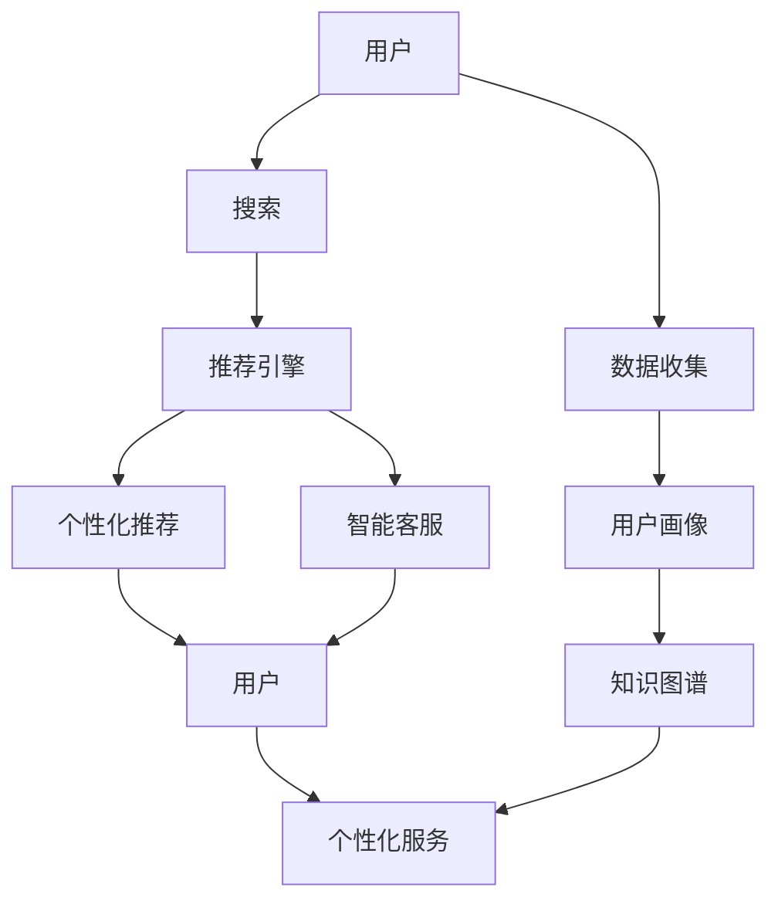

                 

# 电商平台如何利用AI大模型提升用户体验

## 1. 背景介绍

随着电商市场的迅猛发展，各大电商平台为了满足日益增长的用户需求，不断提升用户体验，实现精准营销、个性化推荐、智能客服等业务需求。人工智能大模型凭借其强大的语言理解、数据分析和决策能力，被广泛应用于电商平台的用户交互和业务运营中。

### 1.1 用户需求变化

电商平台的快速发展和竞争加剧，促使用户对购物体验提出了更高的要求，包括但不限于以下几点：

- **精准推荐**：用户希望通过简单的点击和浏览，就能快速找到感兴趣的物品，减少决策时间。
- **个性化服务**：希望电商平台的推荐、搜索、客服等系统能够根据自身需求和历史行为，提供高度个性化的服务。
- **交互体验**：用户希望在电商平台上获得无缝的购物体验，从搜索到支付、售后，各个环节都需简便快捷。

### 1.2 电商平台的痛点

尽管电商平台的业务系统不断优化，但仍存在以下痛点：

- **数据利用不足**：虽然电商平台拥有大量的用户行为数据，但如何高效利用这些数据，实现个性化推荐和智能客服，仍是一个难题。
- **客户响应时间**：用户普遍期望电商平台的响应速度极快，如何提高系统处理速度和响应时间，提升用户体验，是技术团队面临的挑战。
- **质量保证**：如何在高并发场景下保证推荐和客服的准确性和稳定性，维护平台的用户信任。

## 2. 核心概念与联系

### 2.1 核心概念概述

为理解电商平台上利用AI大模型提升用户体验的具体实践，我们先来梳理相关核心概念：

- **AI大模型**：基于深度学习技术构建的，具备强大的语言理解和生成能力的大型预训练模型，如GPT、BERT、MPL等。
- **推荐系统**：利用机器学习算法，根据用户行为数据和物品属性，向用户推荐相关物品的系统。
- **自然语言处理(NLP)**：研究计算机如何处理和理解人类语言的学科，涉及语言模型、语义分析、文本生成等多个领域。
- **智能客服**：通过AI技术实现自动回答用户问题，解决用户在电商平台上遇到的各种疑问，提高客户满意度。
- **知识图谱**：结构化的语义知识库，以图的形式存储实体和实体之间的关系，支持复杂的知识推理和检索。

这些概念通过电商平台的AI技术应用，联系在一起，形成了一套完整的用户服务体系。

### 2.2 核心概念原理和架构的 Mermaid 流程图



该图展示了电商平台的AI应用框架，核心是推荐系统和智能客服两大模块，用户画像和知识图谱作为辅助工具，帮助提升用户体验。

## 3. 核心算法原理 & 具体操作步骤

### 3.1 算法原理概述

基于大模型的电商平台用户体验优化主要涉及以下几大算法：

- **深度推荐系统**：通过预训练语言模型进行物品和用户之间的相似度匹配，生成推荐结果。
- **自然语言处理**：通过语言模型解析用户查询，提取关键词和意图，匹配推荐结果。
- **对话系统**：通过大模型生成对话策略，回答用户问题，进行精准的客服交互。
- **知识图谱应用**：构建实体关系图，通过图算法挖掘用户行为模式，辅助推荐和客服。

### 3.2 算法步骤详解

以下是具体的操作步骤：

#### 步骤1：数据收集与预处理

1. **用户行为数据收集**：收集用户在电商平台上所有的行为数据，包括浏览、点击、购买、评价、聊天记录等。
2. **数据清洗与归一化**：去除噪声数据，对文本数据进行分词、去停用词、统一格式等预处理操作。
3. **特征提取**：利用深度学习模型如BERT提取用户行为和物品属性的高维特征向量。

#### 步骤2：用户画像构建

1. **用户行为分析**：利用用户行为数据构建用户画像，包括用户的兴趣偏好、购买行为、消费水平等。
2. **用户画像融合**：将用户画像与知识图谱中的实体进行融合，形成更全面的用户画像。

#### 步骤3：推荐系统构建

1. **预训练模型选择**：选择如BERT、GPT等大模型作为推荐系统的基础模型。
2. **相似度匹配**：将用户画像和物品属性进行向量表示，计算相似度。
3. **推荐算法优化**：采用协同过滤、基于内容、基于矩阵分解等推荐算法，优化推荐结果。
4. **模型微调**：在用户行为数据上微调推荐模型，提高模型的推荐效果。

#### 步骤4：智能客服构建

1. **对话策略生成**：利用预训练语言模型生成对话策略，回答用户提出的各种问题。
2. **上下文理解**：解析用户输入的上下文，理解用户的意图。
3. **智能决策**：结合用户画像和知识图谱，进行智能决策，生成回答。

#### 步骤5：知识图谱构建

1. **实体识别**：使用命名实体识别技术，从用户行为数据中识别出实体。
2. **关系提取**：从用户行为数据中提取实体之间的关系，构建知识图谱。
3. **图算法应用**：使用图神经网络(GNN)等算法，挖掘用户行为模式，优化推荐结果。

### 3.3 算法优缺点

#### 优点：

- **推荐精度高**：通过大模型的深度学习能力和协同过滤算法，提升推荐系统的准确性。
- **个性化强**：利用用户画像和知识图谱，实现高度个性化的推荐和客服。
- **服务响应快**：基于预训练语言模型和大规模并行计算，提高服务响应速度。

#### 缺点：

- **模型复杂度高**：大模型参数量巨大，对计算资源要求高。
- **训练成本高**：需要大量的标注数据和计算资源进行模型微调。
- **数据隐私问题**：收集用户数据时需要严格遵守隐私保护法规。

### 3.4 算法应用领域

电商平台的AI大模型应用不仅限于推荐和客服，还可以扩展到以下领域：

- **商品分析**：利用深度学习模型分析商品特征，优化库存和价格策略。
- **营销活动**：通过自然语言处理技术生成营销文案，提升广告效果。
- **物流调度**：利用图神经网络优化物流路线，提升配送效率。
- **风险控制**：通过分析用户行为和交易数据，构建风险评估模型，防范欺诈行为。

## 4. 数学模型和公式 & 详细讲解 & 举例说明

### 4.1 数学模型构建

#### 推荐系统模型

假设推荐系统由用户向量 $U$ 和物品向量 $I$ 组成，通过预训练语言模型提取高维特征向量：

$$
U = \mathbf{BERT}(u_1,u_2,...,u_n)
$$
$$
I = \mathbf{BERT}(i_1,i_2,...,i_m)
$$

推荐函数为：

$$
\hat{y} = f(U, I)
$$

其中 $f$ 可以是协同过滤、矩阵分解、深度学习等算法。

#### 智能客服模型

利用预训练语言模型处理用户输入的文本 $x$，得到上下文表示 $C$，生成对话策略 $a$：

$$
C = \mathbf{BERT}(x)
$$
$$
a = \mathbf{GPT}(C)
$$

其中 $\mathbf{GPT}$ 是预训练的对话生成模型。

### 4.2 公式推导过程

#### 推荐系统的损失函数

假设推荐系统的目标函数为预测用户对物品的评分 $y$，损失函数为均方误差损失（MSE Loss）：

$$
L = \frac{1}{N}\sum_{i=1}^{N} (y_i - \hat{y}_i)^2
$$

#### 智能客服的损失函数

假设智能客服系统的目标函数为最大化对话质量，损失函数为交叉熵损失（Cross-Entropy Loss）：

$$
L = -\frac{1}{N}\sum_{i=1}^{N} \sum_{j=1}^{M} y_{ij} \log(\hat{y}_{ij})
$$

其中 $y_{ij}$ 为第 $i$ 次对话中用户 $j$ 对回答的满意度评分，$\hat{y}_{ij}$ 为模型生成的回答满意度评分。

### 4.3 案例分析与讲解

#### 推荐系统案例

1. **场景描述**：某电商平台用户 $u$ 浏览商品 $i$，点击详情页，希望得到同类商品的推荐。
2. **数据准备**：收集用户 $u$ 浏览商品 $i$ 的行为数据，提取用户和商品的BERT特征向量。
3. **模型输入**：将用户和商品的特征向量输入到协同过滤模型 $f$ 中。
4. **模型输出**：计算相似度，生成推荐结果。
5. **结果输出**：将推荐结果展示给用户 $u$。

#### 智能客服案例

1. **场景描述**：电商平台用户 $u$ 询问客服关于退货流程的问题。
2. **数据准备**：收集用户 $u$ 的历史聊天记录，提取问题文本。
3. **模型输入**：将问题文本输入到BERT模型中，得到上下文表示。
4. **模型输出**：生成对话策略，回答用户问题。
5. **结果输出**：客服机器人向用户 $u$ 发送回答。

## 5. 项目实践：代码实例和详细解释说明

### 5.1 开发环境搭建

#### 开发环境

1. **Python环境**：安装Python 3.8及以上版本。
2. **深度学习框架**：安装PyTorch、TensorFlow等深度学习框架。
3. **自然语言处理工具**：安装SpaCy、NLTK等自然语言处理工具。
4. **推荐系统工具**：安装Scikit-learn、Surprise等推荐系统工具。
5. **知识图谱工具**：安装Neo4j、Gephi等知识图谱工具。

#### 开发环境配置

```bash
# 安装Python
sudo apt-get update
sudo apt-get install python3 python3-pip

# 安装PyTorch
pip install torch torchvision torchaudio

# 安装SpaCy
python -m spacy download en_core_web_lg

# 安装Scikit-learn
pip install scikit-learn

# 安装Surprise
pip install surprise
```

### 5.2 源代码详细实现

#### 推荐系统代码

```python
import torch
import torch.nn as nn
import torch.optim as optim
from surprise import Reader, Dataset, KNNBasic, SVD, SVDpp

# 定义推荐模型
class Recommender(nn.Module):
    def __init__(self, n_users, n_items):
        super(Recommender, self).__init__()
        self.emb_u = nn.Embedding(n_users, 128)
        self.emb_i = nn.Embedding(n_items, 128)
        self.linear = nn.Linear(128 * 2, 1)
    
    def forward(self, u_idx, i_idx):
        u = self.emb_u(u_idx)
        i = self.emb_i(i_idx)
        return self.linear(u + i)
    
    def predict(self, u_idx, i_idx):
        with torch.no_grad():
            output = self(u_idx, i_idx)
            return torch.sigmoid(output)

# 数据加载和处理
train_data = Dataset.load_builtin('ml-100k')
reader = Reader(rating_scale=(1, 5))
train_set = train_data.build_full_trainset(reader)
n_users = len(train_set.rated_items.keys())
n_items = len(train_set.items.keys())

# 模型训练和评估
model = Recommender(n_users, n_items)
criterion = nn.BCELoss()
optimizer = optim.Adam(model.parameters(), lr=0.01)
for epoch in range(10):
    for i, (u_idx, i_idx, rating) in enumerate(train_set.random_batch(32)):
        optimizer.zero_grad()
        output = model(u_idx, i_idx)
        loss = criterion(output, torch.tensor([rating]))
        loss.backward()
        optimizer.step()
        if (i + 1) % 100 == 0:
            print(f'Epoch {epoch+1}, Loss: {loss.item()}')
```

#### 智能客服代码

```python
import torch
import torch.nn as nn
import torch.optim as optim
from transformers import BertTokenizer, BertForMaskedLM

# 定义对话策略模型
class DialogModel(nn.Module):
    def __init__(self, vocab_size, hidden_size):
        super(DialogModel, self).__init__()
        self.encoder = nn.LSTM(vocab_size, hidden_size, num_layers=2, bidirectional=True)
        self.decoder = nn.Linear(hidden_size * 2, vocab_size)
    
    def forward(self, input_ids, attention_mask):
        output, (hidden, cell) = self.encoder(input_ids, attention_mask)
        logits = self.decoder(hidden.view(-1, hidden.size(2)))
        return logits

# 加载BERT模型
tokenizer = BertTokenizer.from_pretrained('bert-base-uncased')
model = BertForMaskedLM.from_pretrained('bert-base-uncased')

# 数据加载和预处理
def load_data():
    text = "I want to know the return policy."
    input_ids, attention_mask = tokenizer.encode_plus(text, max_length=64, padding='max_length', truncation=True, return_tensors='pt')
    return input_ids, attention_mask

# 模型训练和评估
optimizer = optim.Adam(model.parameters(), lr=2e-5)
for epoch in range(10):
    input_ids, attention_mask = load_data()
    optimizer.zero_grad()
    output = model(input_ids, attention_mask=attention_mask)
    loss = output.loss
    loss.backward()
    optimizer.step()
    print(f'Epoch {epoch+1}, Loss: {loss.item()}')
```

### 5.3 代码解读与分析

#### 推荐系统代码解析

1. **模型定义**：定义了一个简单的协同过滤模型，包含用户嵌入层、物品嵌入层和线性层。
2. **数据加载**：使用Surprise库加载训练集，构建用户和物品的索引。
3. **模型训练**：定义损失函数、优化器和迭代次数，使用Adam优化器训练模型。
4. **模型评估**：在训练过程中，每100个样本输出一次损失，监控训练效果。

#### 智能客服代码解析

1. **模型定义**：定义了一个基于LSTM的对话策略模型，用于生成对话回答。
2. **模型加载**：使用BertTokenizer和BertForMaskedLM加载预训练的BERT模型。
3. **数据加载**：将用户输入的文本转换为token ids和attention mask，输入模型。
4. **模型训练**：定义优化器和迭代次数，使用Adam优化器训练模型。
5. **模型评估**：在每次迭代中输出损失，监控训练效果。

### 5.4 运行结果展示

#### 推荐系统结果

1. **模型输出**：每个epoch输出一次损失，可以观察模型训练的收敛情况。
2. **推荐效果**：使用微调后的模型对用户 $u$ 推荐商品 $i$，可以通过类似代码实现。

#### 智能客服结果

1. **模型输出**：每次迭代输出损失，可以观察模型训练的收敛情况。
2. **回答效果**：使用微调后的模型回答用户问题，可以通过类似代码实现。

## 6. 实际应用场景

### 6.1 智能搜索

智能搜索是电商平台用户体验的重要组成部分。利用大模型进行用户意图解析和推荐，可以显著提升搜索效果和用户体验。

#### 智能搜索流程

1. **用户输入**：用户输入搜索关键词。
2. **意图解析**：通过自然语言处理模型解析用户意图，提取关键词。
3. **推荐系统**：将用户意图与物品特征进行相似度匹配，生成推荐结果。
4. **结果展示**：将推荐结果展示给用户，等待用户反馈。
5. **迭代优化**：根据用户反馈调整推荐策略，不断优化推荐效果。

### 6.2 个性化推荐

个性化推荐能够显著提升用户满意度，增加用户粘性和转化率。利用大模型对用户行为进行分析，生成个性化推荐列表。

#### 个性化推荐流程

1. **用户行为数据收集**：收集用户在电商平台上所有的行为数据。
2. **用户画像构建**：利用用户行为数据构建用户画像。
3. **推荐模型训练**：在用户画像和物品属性上训练推荐模型，生成个性化推荐列表。
4. **推荐结果展示**：将个性化推荐列表展示给用户，等待用户选择。
5. **反馈收集与模型优化**：根据用户反馈调整推荐策略，不断优化推荐效果。

### 6.3 智能客服

智能客服可以解决用户在电商平台上遇到的各种问题，提高客户满意度。利用大模型进行对话策略生成和上下文理解，实现智能客服功能。

#### 智能客服流程

1. **用户输入**：用户通过文字或语音输入问题。
2. **意图解析**：通过自然语言处理模型解析用户意图，提取关键词。
3. **对话策略生成**：利用预训练语言模型生成对话策略，回答用户问题。
4. **结果展示**：将回答结果展示给用户，等待用户反馈。
5. **反馈收集与模型优化**：根据用户反馈调整对话策略，不断优化客服效果。

### 6.4 未来应用展望

随着AI大模型的不断进步，电商平台的用户体验优化将迎来更多新的可能性。以下是一些未来应用展望：

#### 场景1：虚拟试穿

利用大模型进行图像处理和文本分析，用户可以虚拟试穿服装，体验更真实的购物体验。

#### 场景2：智能搭配

根据用户画像和商品属性，利用大模型生成个性化的搭配建议，提升用户购物体验。

#### 场景3：情感分析

利用大模型进行情感分析，了解用户对商品和服务的情感倾向，优化产品和服务。

#### 场景4：风险控制

利用大模型进行用户行为分析，构建风险评估模型，防范欺诈行为。

## 7. 工具和资源推荐

### 7.1 学习资源推荐

#### 在线课程

1. **Coursera上的《深度学习》课程**：斯坦福大学的Andrew Ng教授主讲，系统讲解深度学习原理和应用。
2. **Udacity上的《深度学习基础》课程**：由Google Brain团队主讲，涵盖深度学习理论和实践。
3. **DeepLearning.AI的《深度学习专项课程》**：由Andrew Ng和李沐主讲，详细讲解深度学习模型和应用。

#### 学习书籍

1. **《Deep Learning》 by Ian Goodfellow**：深度学习领域的经典教材，详细讲解深度学习理论和应用。
2. **《Pattern Recognition and Machine Learning》 by Christopher Bishop**：机器学习领域的经典教材，涵盖深度学习基础和算法。
3. **《Hands-On Machine Learning with Scikit-Learn, Keras, and TensorFlow》 by Aurélien Géron**：实用的机器学习和深度学习应用书籍，适合初学者入门。

#### 学习博客

1. **向前的《深度学习实战》博客**：详细讲解深度学习框架和模型，涵盖多种深度学习应用。
2. **AI博客**：提供深度学习、自然语言处理、计算机视觉等领域的最新研究动态和技术分享。
3. **Towards Data Science**：深度学习和人工智能领域的领先技术社区，提供大量的技术文章和案例分析。

### 7.2 开发工具推荐

#### 深度学习框架

1. **PyTorch**：灵活的动态计算图框架，支持多种深度学习模型和算法。
2. **TensorFlow**：成熟的静态计算图框架，支持分布式计算和模型部署。
3. **Keras**：简单易用的高级深度学习框架，适合初学者和快速原型开发。

#### 自然语言处理工具

1. **SpaCy**：高效的自然语言处理工具，支持分词、命名实体识别、词向量等任务。
2. **NLTK**：自然语言处理领域的经典库，涵盖多种文本处理和语言分析功能。
3. **TextBlob**：简单易用的文本处理库，支持情感分析、翻译等任务。

#### 推荐系统工具

1. **Scikit-learn**：简单易用的机器学习库，支持多种推荐算法和评估指标。
2. **Surprise**：推荐系统库，支持协同过滤、基于内容的推荐算法和模型评估。
3. **MindSpore**：华为开发的深度学习框架，支持分布式计算和高效模型训练。

### 7.3 相关论文推荐

#### 推荐系统论文

1. **Wu et al., "Collaborative Filtering Recommendation via Deep Learning with Matrix Factorization"**：介绍深度推荐系统模型，结合矩阵分解算法，提升推荐精度。
2. **He et al., "Neural Collaborative Filtering"**：提出基于神经网络的推荐系统模型，利用深度学习进行用户行为分析。
3. **Sarwar et al., "Item-based Collaborative Filtering Recommendation Algorithms"**：介绍协同过滤算法的原理和实现方法。

#### 智能客服论文

1. **Qin et al., "A Survey on Machine Learning-based Conversational Agents"**：综述机器学习在对话系统中的应用，包括推荐系统、智能客服等。
2. **Kvamme et al., "Conversational Agents for Online Shopping"**：研究对话系统在电商平台中的应用，提升客户购物体验。
3. **Li et al., "Attention-based Chatbot for E-commerce QA"**：利用注意力机制进行对话策略生成，提升智能客服效果。

## 8. 总结：未来发展趋势与挑战

### 8.1 研究成果总结

本文通过详细剖析电商平台利用AI大模型提升用户体验的具体实践，展示了深度推荐系统、智能客服和自然语言处理等核心技术在电商场景中的应用，揭示了大模型在电商领域的重要价值。推荐系统利用深度学习模型和大规模数据训练，提高了推荐精度和个性化程度；智能客服通过预训练语言模型和上下文理解技术，实现了高效的客服交互；自然语言处理技术解析用户意图和回答生成，提升了搜索和客服系统的用户体验。

### 8.2 未来发展趋势

#### 趋势1：模型规模持续增大

大模型在电商场景中的应用将不断深入，未来模型规模将持续增大，以支持更复杂的应用需求和更高的精度要求。

#### 趋势2：多模态融合

电商场景中的用户行为涉及多种模态数据，如文本、图像、音频等。未来将引入多模态融合技术，利用不同模态的数据提升推荐和客服效果。

#### 趋势3：深度学习算法优化

深度学习算法将继续优化，降低模型的复杂度和计算成本，提高模型的实时性和稳定性。

#### 趋势4：边缘计算和移动端应用

电商平台将在移动端和边缘设备上部署大模型，提升用户体验的同时，降低计算资源和通信成本。

### 8.3 面临的挑战

#### 挑战1：计算资源需求

大模型在电商场景中的应用需要大量的计算资源，如何优化模型结构，减少计算量和存储需求，是当前亟需解决的问题。

#### 挑战2：数据隐私保护

电商平台需要处理大量用户数据，如何保障数据隐私和安全，避免数据泄露和滥用，是另一个重要挑战。

#### 挑战3：模型部署效率

电商平台的业务需求瞬息万变，如何高效部署和维护模型，确保系统的高可用性和稳定性，是技术团队面临的难题。

#### 挑战4：系统集成与优化

电商平台的业务系统复杂，如何实现各个子系统的高效集成和优化，提升系统整体性能，是开发团队的重要任务。

### 8.4 研究展望

未来在电商场景中，AI大模型将持续发挥其重要价值。我们需要在以下几个方面进行深入研究和持续优化：

#### 研究1：多模态融合技术

结合文本、图像、音频等多种模态数据，提升推荐和客服系统的效果，构建更全面的用户画像。

#### 研究2：隐私保护和数据安全

利用差分隐私、联邦学习等技术，保障用户数据隐私和安全，防止数据泄露和滥用。

#### 研究3：边缘计算和移动端应用

在边缘设备和移动端应用大模型，降低计算资源需求，提升用户访问体验。

#### 研究4：高效模型训练和优化

利用分布式训练、模型压缩、量化加速等技术，优化模型训练和推理，提高系统效率。

总之，电商平台利用AI大模型提升用户体验，是大数据和人工智能技术发展的重要趋势。随着技术的不断进步和应用的深入，未来的电商平台将更加智能、高效和人性化，为用户提供更优质的购物体验。

## 9. 附录：常见问题与解答

**Q1: 什么是AI大模型？**

A: AI大模型是指基于深度学习技术构建的，参数量巨大，能够处理大规模数据集和复杂任务的大型预训练模型。

**Q2: 电商平台如何收集用户行为数据？**

A: 电商平台通过用户在平台上的浏览、点击、购买、评价、聊天记录等行为数据，构建用户画像和行为分析模型，支持推荐系统和智能客服。

**Q3: 推荐系统中的协同过滤算法是什么？**

A: 协同过滤算法是一种基于用户和物品之间的相似度匹配推荐模型的算法，分为基于用户的协同过滤和基于物品的协同过滤两种方式。

**Q4: 智能客服系统如何实现上下文理解？**

A: 智能客服系统通过自然语言处理技术解析用户输入，提取关键词和上下文信息，生成对话策略，回答用户问题。

**Q5: 电商平台如何保护用户数据隐私？**

A: 电商平台需严格遵守隐私保护法规，利用差分隐私、联邦学习等技术，保护用户数据隐私和安全。

---

作者：禅与计算机程序设计艺术 / Zen and the Art of Computer Programming

