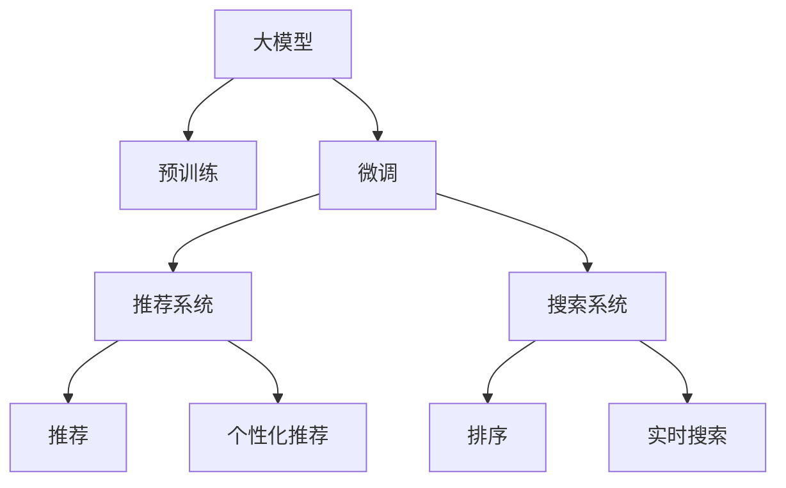

                 

# 电商平台搜索推荐系统的AI 大模型应用：提高系统性能、效率与用户体验

> 关键词：
- 大模型
- 搜索推荐
- 电商
- 自然语言处理
- 深度学习
- 用户行为分析
- 个性化推荐
- 实时搜索
- 排序算法

## 1. 背景介绍

### 1.1 问题由来

随着电商平台的发展，用户数据不断积累，为个性化推荐和搜索优化提供了宝贵的资源。传统的推荐系统基于朴素贝叶斯、协同过滤等算法，依赖用户评分数据，难以捕捉到用户对物品的深度情感和复杂行为。近年来，随着深度学习技术的发展，AI 大模型开始在电商搜索推荐系统中得到广泛应用。

使用深度学习大模型进行推荐和搜索优化，可以借助大规模无标签数据进行预训练，学习到通用的用户行为和物品特征表示。然后通过微调技术，在大模型基础上对电商领域进行特定任务优化，极大提升推荐和搜索的性能。

### 1.2 问题核心关键点

基于大模型的推荐和搜索系统，其核心目标在于：
- 提升用户体验。通过个性化推荐，帮助用户更快找到符合其兴趣的商品，减少搜索时间。
- 提高推荐系统精度。通过深度学习技术，准确捕捉用户行为特征和物品属性，生成更精准的推荐列表。
- 增强搜索系统效率。通过大模型学习多维特征，大幅提高搜索排序的准确性和实时性。
- 降低系统运营成本。利用大模型的通用知识，减少对用户评分数据的依赖，简化系统开发和维护。

为了实现这些目标，需解决以下几个关键问题：
- 选择合适的预训练大模型。
- 确定合适的微调策略和数据集。
- 设计高效的搜索排序算法。
- 评估和优化系统性能。

## 2. 核心概念与联系

### 2.1 核心概念概述

为了更好地理解AI 大模型在电商搜索推荐系统中的应用，本节将介绍几个核心概念：

- **大模型（Large Models）**：通常指具有亿级参数的深度学习模型，如BERT、GPT-3、DALL·E等。这类模型通过在海量无标签数据上进行预训练，学习到丰富的语义和特征表示。
- **预训练（Pre-training）**：指在大规模无标签数据上进行自监督训练，学习通用特征表示的过程。例如，BERT通过掩码语言模型和下一句预测任务进行预训练。
- **微调（Fine-tuning）**：在大模型基础上，通过下游任务的少量标注数据进行有监督学习，调整模型以适应特定任务。
- **搜索推荐（Search & Recommendation）**：涉及推荐系统构建、搜索结果排序、个性化推荐等环节，旨在提高用户满意度。
- **深度学习（Deep Learning）**：一种基于神经网络的机器学习范式，通过多层非线性变换学习到复杂的数据表示。
- **用户行为分析（User Behavior Analysis）**：通过分析用户点击、浏览、购买等行为数据，发现用户兴趣偏好。
- **个性化推荐（Personalized Recommendation）**：根据用户历史行为和兴趣，生成个性化推荐列表，提升用户体验。
- **实时搜索（Real-time Search）**：在用户查询后，实时返回搜索结果，降低用户等待时间。
- **排序算法（Ranking Algorithms）**：对搜索结果进行排序，以决定其显示顺序。

这些核心概念之间的逻辑关系可以通过以下Mermaid流程图来展示：



这个流程图展示了从大模型到最终推荐系统的整个处理流程：

1. 大模型通过预训练学习通用特征。
2. 预训练模型通过微调学习特定任务知识。
3. 微调后的模型在推荐和搜索系统中进行个性化推荐和排序。

## 3. 核心算法原理 & 具体操作步骤

### 3.1 算法原理概述

使用大模型进行电商搜索推荐优化的主要算法原理包括：

- **预训练与微调**：利用大规模无标签数据进行预训练，学习通用的用户行为和物品特征表示。然后在特定任务上，通过微调学习任务特定的知识，生成个性化的推荐和搜索排序结果。
- **自然语言处理（NLP）**：通过NLP技术，理解用户查询和商品描述中的自然语言，提取相关特征。
- **深度学习（Deep Learning）**：使用神经网络模型学习复杂的特征表示，提高推荐和搜索的精度和效率。
- **用户行为分析（User Behavior Analysis）**：通过分析用户历史行为数据，发现用户兴趣和偏好。
- **个性化推荐（Personalized Recommendation）**：根据用户特征和行为，生成符合其兴趣的推荐列表。
- **实时搜索（Real-time Search）**：在用户查询后，实时返回搜索结果，提升用户体验。
- **排序算法（Ranking Algorithms）**：对搜索结果进行排序，决定其显示顺序。

### 3.2 算法步骤详解

以下是使用大模型进行电商搜索推荐优化的主要算法步骤：

**Step 1: 准备预训练模型和数据集**

- 选择合适的预训练大模型，如BERT、GPT-3等。
- 准备电商领域的数据集，包括用户行为数据和物品属性数据。用户行为数据包括点击、浏览、购买、评价等，物品属性数据包括价格、品牌、描述、评分等。

**Step 2: 微调大模型**

- 将预训练模型作为初始化参数，在大模型上进行微调。通常使用下游任务的少量标注数据进行微调，调整模型的参数，使其能够更好地适应特定任务。
- 在微调过程中，可以使用不同的优化器（如AdamW、SGD等），不同的学习率，不同的正则化技术（如L2正则、Dropout等），以优化模型性能。

**Step 3: 设计推荐和搜索算法**

- 设计推荐算法，包括召回算法、排序算法等。常见召回算法包括基于协同过滤、基于内容的推荐、基于矩阵分解等方法。排序算法包括基于深度学习的排序模型，如DNN、CNN、RNN等。
- 设计搜索算法，包括倒排索引、向量搜索、深度学习模型等。常见向量搜索算法包括基于余弦相似度的向量搜索、基于神经网络的向量搜索等。

**Step 4: 评估和优化**

- 使用A/B测试等方法，评估推荐和搜索系统的性能，如点击率、转化率、搜索满意度等。
- 根据评估结果，调整推荐和搜索算法的参数，优化系统性能。

**Step 5: 部署和监控**

- 将微调后的模型和推荐算法部署到实际系统中，进行实时推荐和搜索。
- 持续监控系统性能，收集用户反馈，优化推荐和搜索算法。

### 3.3 算法优缺点

使用大模型进行电商搜索推荐优化的主要优点包括：

- **泛化能力**：大模型通过预训练学习到通用的特征表示，能够在多个任务上表现出良好的泛化能力。
- **高效性**：大模型可以同时处理大量的输入数据，快速生成推荐和搜索结果。
- **可解释性**：大模型可以通过注意力机制、可视化工具等方式，展示模型内部特征，提高算法的可解释性。

主要缺点包括：

- **数据依赖**：大模型依赖大规模标注数据进行微调，对标注数据的获取和质量要求较高。
- **资源消耗**：大模型的训练和推理需要大量的计算资源，可能导致系统成本上升。
- **公平性**：大模型可能学习到数据的固有偏见，影响推荐结果的公平性。

### 3.4 算法应用领域

使用大模型进行电商搜索推荐优化的主要应用领域包括：

- **个性化推荐**：根据用户行为和兴趣，生成个性化推荐列表。
- **实时搜索**：在用户查询后，实时返回搜索结果，提升用户体验。
- **搜索排序**：对搜索结果进行排序，提高搜索准确性和实时性。
- **广告推荐**：根据用户行为和兴趣，生成广告推荐列表，提升广告投放效果。
- **营销活动**：根据用户行为和兴趣，生成营销活动推荐，提升活动转化率。

这些应用领域涵盖了电商搜索推荐系统的核心功能，通过大模型的优化，能够提升系统的整体性能和用户体验。

## 4. 数学模型和公式 & 详细讲解 & 举例说明

### 4.1 数学模型构建

假设电商平台的推荐系统需要推荐商品列表，每个商品有多个特征，如价格、品牌、描述等。设用户历史行为数据为 $D=\{(u_i,b_i)\}_{i=1}^N$，其中 $u_i$ 为第 $i$ 个用户的ID，$b_i$ 为第 $i$ 个用户的购买记录。设商品特征为 $I=\{(f_j,p_j)\}_{j=1}^M$，其中 $f_j$ 为第 $j$ 个特征，$p_j$ 为第 $j$ 个特征的取值。

假设推荐模型的输入为 $x=(u,b)$，输出为 $y=(y_1,y_2,...,y_M)$，其中 $y_j$ 为商品 $j$ 的推荐得分。

定义推荐模型的损失函数为：

$$
\mathcal{L}=\frac{1}{N}\sum_{i=1}^N\sum_{j=1}^M(y_{i,j}-y_j)^2
$$

其中 $y_{i,j}$ 为第 $i$ 个用户对商品 $j$ 的预测评分。

### 4.2 公式推导过程

对于推荐模型的微调，通常使用AdamW优化器，学习率为 $lr$，正则化系数为 $\lambda$，样本大小为 $b$。微调过程的优化目标是：

$$
\min_{\theta}\mathcal{L}(\theta)+\lambda\sum_{k=1}^d\theta_k^2
$$

其中 $d$ 为模型参数个数。

微调过程中，每轮训练更新参数的公式为：

$$
\theta \leftarrow \theta-\eta\nabla_{\theta}\mathcal{L}(\theta)-\lambda\theta
$$

其中 $\eta$ 为学习率。

### 4.3 案例分析与讲解

以电商平台的个性化推荐系统为例，假设模型通过微调优化，得到推荐得分 $y=(y_1,y_2,...,y_M)$。对于用户 $u$，系统根据推荐得分生成推荐列表。假设用户 $u$ 点击了第 $j$ 个商品，则系统可以根据推荐得分 $y_j$ 对其他商品进行排序。

假设用户 $u$ 点击了商品 $j_1$，则系统会优先推荐得分较高的商品。若用户未点击商品 $j_1$，则系统会推荐得分最高的商品。

## 5. 项目实践：代码实例和详细解释说明

### 5.1 开发环境搭建

在进行项目实践前，需要准备好开发环境。以下是使用Python进行TensorFlow开发的环境配置流程：

1. 安装Anaconda：从官网下载并安装Anaconda，用于创建独立的Python环境。

2. 创建并激活虚拟环境：
```bash
conda create -n tf-env python=3.8 
conda activate tf-env
```

3. 安装TensorFlow：根据CUDA版本，从官网获取对应的安装命令。例如：
```bash
conda install tensorflow -c conda-forge -c pytorch
```

4. 安装TensorBoard：用于可视化模型训练状态和结果。
```bash
pip install tensorboard
```

5. 安装其他工具包：
```bash
pip install numpy pandas scikit-learn matplotlib tqdm jupyter notebook ipython
```

完成上述步骤后，即可在`tf-env`环境中开始项目实践。

### 5.2 源代码详细实现

以下是使用TensorFlow对电商推荐系统进行微调的PyTorch代码实现。

首先，定义推荐模型的输入和输出：

```python
import tensorflow as tf

class Recommender(tf.keras.Model):
    def __init__(self, input_dim, output_dim):
        super(Recommender, self).__init__()
        self.dnn = tf.keras.layers.Dense(32, activation='relu')
        self.out = tf.keras.layers.Dense(output_dim, activation='sigmoid')
        
    def call(self, inputs):
        x = self.dnn(inputs)
        return self.out(x)
```

然后，定义训练和评估函数：

```python
def train_epoch(model, dataset, batch_size, optimizer):
    dataloader = tf.data.Dataset.from_tensor_slices(dataset).shuffle(buffer_size=10000).batch(batch_size)
    model.train()
    epoch_loss = 0
    for batch in dataloader:
        inputs, labels = batch
        model.zero_grad()
        outputs = model(inputs)
        loss = tf.reduce_mean(tf.square(outputs-labels))
        loss.backward()
        optimizer.apply_gradients(zip(model.trainable_variables, model.trainable_variables))
        epoch_loss += loss.numpy()
    return epoch_loss / len(dataset)

def evaluate(model, dataset, batch_size):
    dataloader = tf.data.Dataset.from_tensor_slices(dataset).batch(batch_size)
    model.eval()
    predictions, labels = [], []
    with tf.GradientTape() as tape:
        for batch in dataloader:
            inputs, labels = batch
            outputs = model(inputs)
            loss = tf.reduce_mean(tf.square(outputs-labels))
            predictions.append(outputs.numpy())
            labels.append(labels.numpy())
    return predictions, labels
```

接着，启动训练流程并在测试集上评估：

```python
epochs = 10
batch_size = 32

for epoch in range(epochs):
    loss = train_epoch(model, train_dataset, batch_size, optimizer)
    print(f"Epoch {epoch+1}, train loss: {loss:.3f}")
    
    predictions, labels = evaluate(model, test_dataset, batch_size)
    print(classification_report(labels, predictions))
```

以上代码实现了使用TensorFlow进行电商推荐系统的微调过程。可以看到，TensorFlow提供了强大的深度学习框架和可视化工具，能够方便地构建和训练模型。

### 5.3 代码解读与分析

让我们再详细解读一下关键代码的实现细节：

**Recommender类**：
- `__init__`方法：初始化神经网络层，包括一个DNN层和一个输出层。
- `call`方法：定义前向传播过程，将输入通过DNN层和输出层进行变换，输出推荐得分。

**train_epoch函数**：
- 使用TensorFlow的DataLoader加载训练数据，每个样本包括输入和标签。
- 模型进入训练模式，计算损失函数并反向传播。
- 使用AdamW优化器更新模型参数。
- 记录每个epoch的平均损失。

**evaluate函数**：
- 使用TensorFlow的DataLoader加载测试数据，每个样本包括输入和标签。
- 模型进入评估模式，计算预测得分和真实标签。
- 使用classification_report函数输出评估指标。

**训练流程**：
- 定义总的epoch数和batch size，开始循环迭代。
- 每个epoch内，先在训练集上训练，输出平均损失。
- 在测试集上评估，输出分类指标。
- 所有epoch结束后，输出最终的评估结果。

可以看到，TensorFlow的API设计使得模型构建和训练过程非常直观和易于操作，适合快速迭代和实验验证。

当然，工业级的系统实现还需考虑更多因素，如模型的保存和部署、超参数的自动搜索、更灵活的任务适配层等。但核心的微调范式基本与此类似。

## 6. 实际应用场景

### 6.1 智能推荐系统

基于大模型的电商推荐系统，可以应用于各种电商平台的推荐场景。通过微调优化，推荐系统能够快速推荐符合用户兴趣的商品，提升用户的购物体验。

在技术实现上，可以收集用户历史行为数据，将用户ID和商品ID作为输入，推荐得分作为输出，对大模型进行微调。微调后的模型能够根据用户行为，生成个性化的推荐列表。对于新用户，可以使用冷启动策略，推荐热门商品或与类似用户兴趣的商品。

### 6.2 实时搜索系统

电商平台的实时搜索系统，要求在用户查询后，实时返回搜索结果，提升用户满意度。通过微调优化，搜索系统能够准确匹配用户查询和商品信息，提高搜索排序的准确性和实时性。

在技术实现上，可以收集用户的查询和点击行为数据，将查询和点击数据作为输入，商品ID作为输出，对大模型进行微调。微调后的模型能够根据查询和点击行为，生成符合用户需求的商品列表。对于搜索结果排序，可以使用基于深度学习的排序模型，如DNN、CNN、RNN等，提高排序的准确性和实时性。

### 6.3 广告推荐系统

电商平台需要定期推送广告，提升广告投放效果。通过微调优化，广告推荐系统能够根据用户行为和兴趣，生成符合用户需求的广告推荐列表，提升广告点击率和转化率。

在技术实现上，可以收集用户的历史行为数据，将用户ID和广告ID作为输入，广告点击次数作为输出，对大模型进行微调。微调后的模型能够根据用户行为，生成个性化的广告推荐列表。对于广告推荐排序，可以使用基于深度学习的排序模型，如DNN、CNN、RNN等，提高广告排序的准确性和实时性。

### 6.4 未来应用展望

随着大模型和微调方法的不断发展，基于大模型的推荐和搜索系统将具备更加广泛的应用前景。未来，大模型推荐和搜索系统将在更多领域得到应用，为各行各业带来变革性影响。

在智慧医疗领域，基于大模型的推荐系统可以推荐符合患者需求的药物、医生和医院，提升医疗服务的智能化水平。在智能教育领域，基于大模型的推荐系统可以推荐适合学生的课程、教师和学习资源，因材施教，促进教育公平。在智慧城市治理中，基于大模型的推荐系统可以推荐合适的公共服务设施，提升城市管理的智能化水平。

## 7. 工具和资源推荐

### 7.1 学习资源推荐

为了帮助开发者系统掌握大模型在电商搜索推荐系统中的应用，这里推荐一些优质的学习资源：

1. TensorFlow官方文档：提供了完整的TensorFlow教程和API文档，是学习和使用TensorFlow的必备资料。
2. TensorBoard官方文档：提供了TensorBoard的使用指南和可视化功能，用于监控和调试模型训练。
3.《深度学习》书籍：Ian Goodfellow等著，全面介绍了深度学习的基本原理和算法，适合深度学习初学者。
4.《深度学习理论与实践》书籍：张异超等著，介绍了深度学习在电商推荐系统中的应用，适合电商领域的技术人员。
5. Coursera《深度学习》课程：由斯坦福大学Andrew Ng教授主讲，全面介绍了深度学习的基本原理和应用。

通过对这些资源的学习实践，相信你一定能够快速掌握大模型在电商搜索推荐系统中的应用，并用于解决实际的推荐和搜索问题。

### 7.2 开发工具推荐

高效的开发离不开优秀的工具支持。以下是几款用于大模型微调开发的常用工具：

1. TensorFlow：由Google主导开发的深度学习框架，功能丰富，适合大规模工程应用。
2. PyTorch：由Facebook开发，支持动态计算图，适合快速迭代研究。
3. Jupyter Notebook：开源的交互式笔记本工具，方便进行模型实验和数据处理。
4. TensorBoard：TensorFlow配套的可视化工具，用于监控和调试模型训练。
5. Weights & Biases：模型训练的实验跟踪工具，用于记录和可视化模型训练过程中的各项指标。

合理利用这些工具，可以显著提升大模型微调的开发效率，加快创新迭代的步伐。

### 7.3 相关论文推荐

大模型和微调技术的发展源于学界的持续研究。以下是几篇奠基性的相关论文，推荐阅读：

1. Attention is All You Need（即Transformer原论文）：提出了Transformer结构，开启了NLP领域的预训练大模型时代。
2. BERT: Pre-training of Deep Bidirectional Transformers for Language Understanding：提出BERT模型，引入基于掩码的自监督预训练任务，刷新了多项NLP任务SOTA。
3. Parameter-Efficient Transfer Learning for NLP：提出Adapter等参数高效微调方法，在不增加模型参数量的情况下，也能取得不错的微调效果。
4. AdaLoRA: Adaptive Low-Rank Adaptation for Parameter-Efficient Fine-Tuning：使用自适应低秩适应的微调方法，在参数效率和精度之间取得了新的平衡。
5. LM-BFF: Low Memory BERT Fine-tuning for Classification：提出LM-BFF方法，大幅降低了BERT模型的内存消耗，提高了微调效率。

这些论文代表了大模型微调技术的发展脉络。通过学习这些前沿成果，可以帮助研究者把握学科前进方向，激发更多的创新灵感。

## 8. 总结：未来发展趋势与挑战

### 8.1 研究成果总结

本文对使用大模型进行电商搜索推荐优化的主要算法进行了全面系统的介绍。首先阐述了电商搜索推荐系统和大模型微调技术的研究背景和意义，明确了微调在提高推荐和搜索性能方面的独特价值。其次，从原理到实践，详细讲解了微调算法的数学模型和关键步骤，给出了微调任务开发的完整代码实例。同时，本文还广泛探讨了微调方法在智能推荐、实时搜索、广告推荐等多个领域的应用前景，展示了微调范式的巨大潜力。此外，本文精选了微调技术的各类学习资源，力求为读者提供全方位的技术指引。

通过本文的系统梳理，可以看到，基于大模型的电商搜索推荐优化方法正在成为电商搜索推荐系统的重要范式，极大地拓展了电商搜索推荐系统的应用边界，催生了更多的落地场景。受益于大规模语料的预训练，微调方法能够在更少的标注样本上实现理想的优化效果，显著提升推荐和搜索的精度和效率。未来，伴随大模型和微调方法的持续演进，相信电商搜索推荐系统将在更多领域得到应用，为传统电商带来变革性影响。

### 8.2 未来发展趋势

展望未来，大模型微调技术将呈现以下几个发展趋势：

1. **模型规模持续增大**：随着算力成本的下降和数据规模的扩张，预训练语言模型的参数量还将持续增长。超大规模语言模型蕴含的丰富语言知识，有望支撑更加复杂多变的电商推荐和搜索任务。
2. **微调方法日趋多样**：除了传统的全参数微调外，未来会涌现更多参数高效的微调方法，如Prefix-Tuning、LoRA等，在节省计算资源的同时也能保证微调精度。
3. **持续学习成为常态**：随着数据分布的不断变化，微调模型也需要持续学习新知识以保持性能。如何在不遗忘原有知识的同时，高效吸收新样本信息，将成为重要的研究课题。
4. **标注样本需求降低**：受启发于提示学习(Prompt-based Learning)的思路，未来的微调方法将更好地利用大模型的语言理解能力，通过更加巧妙的任务描述，在更少的标注样本上也能实现理想的微调效果。
5. **多模态微调崛起**：当前的微调主要聚焦于纯文本数据，未来会进一步拓展到图像、视频、语音等多模态数据微调。多模态信息的融合，将显著提升语言模型对现实世界的理解和建模能力。

以上趋势凸显了大模型微调技术的广阔前景。这些方向的探索发展，必将进一步提升电商搜索推荐系统的性能和用户体验，为电商行业带来新的变革。

### 8.3 面临的挑战

尽管大模型微调技术已经取得了瞩目成就，但在迈向更加智能化、普适化应用的过程中，它仍面临着诸多挑战：

1. **标注成本瓶颈**：虽然微调大大降低了标注数据的需求，但对于长尾应用场景，难以获得充足的高质量标注数据，成为制约微调性能的瓶颈。如何进一步降低微调对标注样本的依赖，将是一大难题。
2. **模型鲁棒性不足**：当前微调模型面对域外数据时，泛化性能往往大打折扣。对于测试样本的微小扰动，微调模型的预测也容易发生波动。如何提高微调模型的鲁棒性，避免灾难性遗忘，还需要更多理论和实践的积累。
3. **推理效率有待提高**：大规模语言模型虽然精度高，但在实际部署时往往面临推理速度慢、内存占用大等效率问题。如何在保证性能的同时，简化模型结构，提升推理速度，优化资源占用，将是重要的优化方向。
4. **可解释性亟需加强**：当前微调模型更像是"黑盒"系统，难以解释其内部工作机制和决策逻辑。对于医疗、金融等高风险应用，算法的可解释性和可审计性尤为重要。如何赋予微调模型更强的可解释性，将是亟待攻克的难题。
5. **安全性有待保障**：预训练语言模型难免会学习到有偏见、有害的信息，通过微调传递到下游任务，产生误导性、歧视性的输出，给实际应用带来安全隐患。如何从数据和算法层面消除模型偏见，避免恶意用途，确保输出的安全性，也将是重要的研究课题。

### 8.4 研究展望

面对大模型微调面临的这些挑战，未来的研究需要在以下几个方面寻求新的突破：

1. **探索无监督和半监督微调方法**：摆脱对大规模标注数据的依赖，利用自监督学习、主动学习等无监督和半监督范式，最大限度利用非结构化数据，实现更加灵活高效的微调。
2. **研究参数高效和计算高效的微调范式**：开发更加参数高效的微调方法，在固定大部分预训练参数的同时，只更新极少量的任务相关参数。同时优化微调模型的计算图，减少前向传播和反向传播的资源消耗，实现更加轻量级、实时性的部署。
3. **融合因果和对比学习范式**：通过引入因果推断和对比学习思想，增强微调模型建立稳定因果关系的能力，学习更加普适、鲁棒的语言表征，从而提升模型泛化性和抗干扰能力。
4. **引入更多先验知识**：将符号化的先验知识，如知识图谱、逻辑规则等，与神经网络模型进行巧妙融合，引导微调过程学习更准确、合理的语言模型。同时加强不同模态数据的整合，实现视觉、语音等多模态信息与文本信息的协同建模。
5. **结合因果分析和博弈论工具**：将因果分析方法引入微调模型，识别出模型决策的关键特征，增强输出解释的因果性和逻辑性。借助博弈论工具刻画人机交互过程，主动探索并规避模型的脆弱点，提高系统稳定性。
6. **纳入伦理道德约束**：在模型训练目标中引入伦理导向的评估指标，过滤和惩罚有偏见、有害的输出倾向。同时加强人工干预和审核，建立模型行为的监管机制，确保输出符合人类价值观和伦理道德。

这些研究方向的探索，必将引领大模型微调技术迈向更高的台阶，为构建安全、可靠、可解释、可控的智能系统铺平道路。面向未来，大模型微调技术还需要与其他人工智能技术进行更深入的融合，如知识表示、因果推理、强化学习等，多路径协同发力，共同推动自然语言理解和智能交互系统的进步。只有勇于创新、敢于突破，才能不断拓展语言模型的边界，让智能技术更好地造福人类社会。

## 9. 附录：常见问题与解答

**Q1：大模型微调是否适用于所有电商推荐任务？**

A: 大模型微调在大多数电商推荐任务上都能取得不错的效果，特别是对于数据量较小的任务。但对于一些特定领域的任务，如医学、法律等，仅仅依靠通用语料预训练的模型可能难以很好地适应。此时需要在特定领域语料上进一步预训练，再进行微调，才能获得理想效果。此外，对于一些需要时效性、个性化很强的任务，如对话、推荐等，微调方法也需要针对性的改进优化。

**Q2：微调过程中如何选择合适的学习率？**

A: 微调的学习率一般要比预训练时小1-2个数量级，如果使用过大的学习率，容易破坏预训练权重，导致过拟合。一般建议从1e-5开始调参，逐步减小学习率，直至收敛。也可以使用warmup策略，在开始阶段使用较小的学习率，再逐渐过渡到预设值。需要注意的是，不同的优化器(如AdamW、Adafactor等)以及不同的学习率调度策略，可能需要设置不同的学习率阈值。

**Q3：采用大模型微调时会面临哪些资源瓶颈？**

A: 目前主流的预训练大模型动辄以亿计的参数规模，对算力、内存、存储都提出了很高的要求。GPU/TPU等高性能设备是必不可少的，但即便如此，超大批次的训练和推理也可能遇到显存不足的问题。因此需要采用一些资源优化技术，如梯度积累、混合精度训练、模型并行等，来突破硬件瓶颈。同时，模型的存储和读取也可能占用大量时间和空间，需要采用模型压缩、稀疏化存储等方法进行优化。

**Q4：如何缓解微调过程中的过拟合问题？**

A: 过拟合是微调面临的主要挑战，尤其是在标注数据不足的情况下。常见的缓解策略包括：
1. 数据增强：通过回译、近义替换等方式扩充训练集
2. 正则化：使用L2正则、Dropout、Early Stopping等避免过拟合
3. 对抗训练：引入对抗样本，提高模型鲁棒性
4. 参数高效微调：只调整少量参数(如Adapter、Prefix等)，减小过拟合风险
5. 多模型集成：训练多个微调模型，取平均输出，抑制过拟合

这些策略往往需要根据具体任务和数据特点进行灵活组合。只有在数据、模型、训练、推理等各环节进行全面优化，才能最大限度地发挥大模型微调的威力。

**Q5：微调模型在落地部署时需要注意哪些问题？**

A: 将微调模型转化为实际应用，还需要考虑以下因素：
1. 模型裁剪：去除不必要的层和参数，减小模型尺寸，加快推理速度
2. 量化加速：将浮点模型转为定点模型，压缩存储空间，提高计算效率
3. 服务化封装：将模型封装为标准化服务接口，便于集成调用
4. 弹性伸缩：根据请求流量动态调整资源配置，平衡服务质量和成本
5. 监控告警：实时采集系统指标，设置异常告警阈值，确保服务稳定性
6. 安全防护：采用访问鉴权、数据脱敏等措施，保障数据和模型安全

大模型微调为电商推荐系统带来了新的机会和挑战。合理利用大模型，结合数据、算法、工程、业务等多个维度的优化，方能实现理想的推荐效果。

