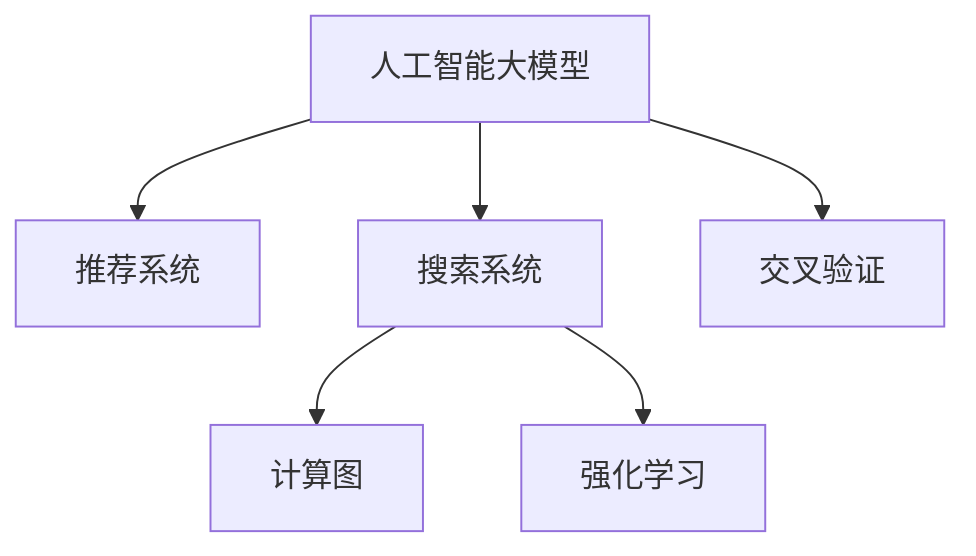

                 

# 电商平台搜索推荐系统的AI 大模型应用：提高系统性能、效率、准确率与实时性

## 1. 背景介绍

### 1.1 问题由来
电商平台搜索推荐系统是典型的电商业务中的人机交互模块，通过精确理解用户意图，向用户推荐最适合的商品，从而极大提升用户体验和业务转化率。然而，构建一个高效的搜索推荐系统，面临着诸多挑战，包括：
1. **高维稀疏性**：用户行为数据通常具有高维度、稀疏性强的特征，如商品ID、用户ID、用户评分、行为序列等。如何在高维稀疏数据上进行有效建模，是一大难题。
2. **冷启动问题**：新商品、新用户难以通过历史行为数据进行推荐，冷启动是亟需解决的问题。
3. **长尾需求**：用户的个性化需求通常具有长尾特性，平台需要具备处理长尾需求的能力。
4. **实时性要求**：搜索推荐系统需要即时响应用户查询，对计算效率和实时性有极高要求。

近年来，人工智能大模型在处理大规模数据、高维度特征、稀疏性问题等方面展现出显著优势，为构建高性能搜索推荐系统提供了新的可能性。大模型在电商领域的应用，可以极大地提升系统性能、效率、准确率和实时性。

## 2. 核心概念与联系

### 2.1 核心概念概述

为更好地理解AI大模型在电商平台搜索推荐系统中的应用，本节将介绍几个关键概念：

- **人工智能大模型(Deep Learning Models)**：指通过大规模无标签数据进行预训练，具备强大特征提取和推理能力的深度学习模型，如BERT、GPT、DALL-E等。
- **推荐系统(Recommender Systems)**：通过分析用户历史行为数据和商品属性，预测用户可能感兴趣的商品，为用户提供个性化推荐的技术。
- **搜索系统(Search Systems)**：负责根据用户输入的查询词，快速检索并返回相关结果，是电商平台的入口模块。
- **计算图(Calgraphs)**：指通过图结构表示计算流程的数学模型，如图神经网络(Graph Neural Networks, GNNs)、变分自编码器(Variational Autoencoder, VAE)等。
- **强化学习(Reinforcement Learning, RL)**：通过奖励机制指导智能体进行决策优化，适用于用户行为模拟和智能推荐等场景。
- **交叉验证(Cross-Validation)**：通过分割数据集，对模型进行多次验证，防止过拟合，提升模型泛化能力。

这些核心概念之间的逻辑关系可以通过以下Mermaid流程图来展示：



这个流程图展示了核心概念之间的关联：

1. 人工智能大模型为推荐系统和搜索系统提供了强大的计算能力。
2. 推荐系统利用大模型对用户行为进行建模，从而实现个性化推荐。
3. 搜索系统将大模型应用于信息检索，实现快速响应。
4. 计算图、强化学习等技术，辅助大模型提升推荐和搜索的精度和效率。
5. 交叉验证确保模型在训练和测试中保持良好泛化能力。

## 3. 核心算法原理 & 具体操作步骤
### 3.1 算法原理概述

AI大模型在电商平台搜索推荐系统中的应用，主要围绕以下几个关键算法进行展开：

- **编码-解码架构(Encoder-Decoder Architecture)**：将用户查询和商品描述编码为高维向量，通过注意力机制进行匹配，实现搜索排序和推荐。
- **协同过滤(Collaborative Filtering)**：利用用户行为数据和商品属性，预测用户可能感兴趣的商品。
- **序列推荐(Sequential Recommendation)**：通过时间序列预测用户未来的行为，实现动态推荐。
- **多任务学习(Multi-task Learning)**：通过多任务联合学习，提升推荐模型的泛化能力和性能。
- **对抗训练(Adversarial Training)**：通过对抗样本训练，提高模型的鲁棒性和泛化能力。
- **知识增强(Knowledge-Augmented)**：通过融合外部知识库，提升推荐模型的知识表示能力。

### 3.2 算法步骤详解

以推荐系统中的协同过滤为例，详细介绍其算法步骤：

**Step 1: 数据预处理**
- 收集用户历史行为数据，提取商品ID、评分、时间戳等信息。
- 对用户行为数据进行分词和向量化，生成用户行为矩阵$U$和商品特征矩阵$I$。

**Step 2: 用户-商品矩阵分解**
- 使用矩阵分解算法，将用户行为矩阵$U$和商品特征矩阵$I$分解为低秩矩阵$\hat{U}$和$\hat{I}$。
- 设定矩阵$\hat{U}$和$\hat{I}$的初始值，通常使用随机初始化或预先训练的矩阵。

**Step 3: 计算预测评分**
- 通过矩阵乘法，计算用户$i$对商品$j$的预测评分$\hat{u}_{ij}=\hat{u}_{i*}^\top\hat{i}_j$，其中$\hat{u}_{i*}$和$\hat{i}_j$分别表示$\hat{U}$和$\hat{I}$中用户$i$和商品$j$的列向量。
- 将预测评分进行归一化处理，得到最终推荐结果。

**Step 4: 模型优化**
- 利用反向传播算法，通过梯度下降等优化方法，更新矩阵$\hat{U}$和$\hat{I}$的参数。
- 在验证集上评估模型的均方误差等指标，调整超参数。

### 3.3 算法优缺点

AI大模型在电商平台搜索推荐系统中的应用，具有以下优势：
1. **强大的特征提取能力**：大模型通过大规模数据预训练，具备强大的特征提取和表示能力，可以处理高维度、稀疏性强的数据。
2. **高泛化性能**：大模型在泛化能力上优于传统机器学习模型，可以处理多种类型的电商业务，适应不同的用户需求。
3. **实时性**：大模型结合计算图优化，可以在极短时间内完成推荐和搜索计算，满足实时性要求。

同时，也存在一些局限性：
1. **模型复杂度高**：大模型通常参数量巨大，训练和推理成本较高。
2. **数据需求大**：大模型需要大规模无标签数据进行预训练，电商数据通常难以满足这一要求。
3. **泛化到新商品/用户困难**：大模型在面对新商品/用户时，需要再次训练或微调，才能获得理想的效果。
4. **计算资源需求高**：大模型在训练和推理时，需要高性能的GPU/TPU等硬件支持。

尽管存在这些局限性，但AI大模型在电商平台搜索推荐系统中的应用，已经展现出了显著的性能提升和应用潜力，值得进一步探索和优化。

### 3.4 算法应用领域

AI大模型在电商平台搜索推荐系统中的应用，已经覆盖了电商业务中的多个场景，如：

- **商品推荐**：通过用户行为数据和商品属性，预测用户可能感兴趣的商品。
- **搜索排序**：根据用户查询词，快速检索并排序相关商品，提升用户搜索体验。
- **实时个性化推荐**：基于用户实时行为数据，动态调整推荐内容，提升用户满意度。
- **交叉销售与关联推荐**：通过用户购买历史数据，推荐相关商品，促进多品类的销售。
- **新商品推荐**：利用大模型对新商品进行建模，推荐给潜在用户。
- **用户行为预测**：预测用户未来的行为，实现个性化推送和营销。

除了上述这些经典应用场景，AI大模型还逐步拓展到了个性化定制、库存管理、用户画像构建等多个领域，为电商平台带来了全新的业务模式和增长点。

## 4. 数学模型和公式 & 详细讲解  
### 4.1 数学模型构建

基于AI大模型的电商搜索推荐系统，通常包含以下数学模型：

**协同过滤模型**
- 用户行为矩阵$U$和商品特征矩阵$I$，初始化参数$\Theta$。
- 预测评分$\hat{u}_{ij}$，均方误差损失函数$L$。
- 模型优化目标$\min_{\Theta} \frac{1}{N} \sum_{i,j} (y_{ij}-\hat{u}_{ij})^2$。

**计算图模型**
- 计算图结构$G=(V,E)$，节点$V$表示计算操作，边$E$表示数据流向。
- 计算图模型$F$，包括编码器$E$、解码器$D$和注意力机制$A$。
- 训练目标$L$，通常为交叉熵损失函数。

**序列推荐模型**
- 用户行为序列$X$，历史行为矩阵$U$。
- 隐含状态$\hat{h}_t$，预测行为序列$Y$。
- 目标函数$L$，如均方误差损失函数。

**多任务学习模型**
- 多个任务$\{T_k\}$，共享的表示层$H$。
- 每个任务的目标函数$L_k$，联合目标函数$L$。

**对抗训练模型**
- 对抗样本$X_{adv}$，正常样本$X$。
- 对抗训练损失函数$L_{adv}$，正常训练损失函数$L$。
- 对抗训练目标$\min_{\Theta} L_{adv} + \lambda L$。

### 4.2 公式推导过程

以协同过滤模型为例，推导其优化过程：

设用户$i$对商品$j$的评分$y_{ij}$，预测评分$\hat{u}_{ij}$，均方误差损失函数为$L=\frac{1}{N} \sum_{i,j} (y_{ij}-\hat{u}_{ij})^2$。

通过梯度下降优化，求解最小化目标函数$\min_{\Theta} L$，得到：

$$
\frac{\partial L}{\partial \Theta} = -\frac{2}{N} \sum_{i,j} (y_{ij}-\hat{u}_{ij}) \frac{\partial \hat{u}_{ij}}{\partial \Theta}
$$

将预测评分$\hat{u}_{ij}$代入，得到：

$$
\frac{\partial L}{\partial \Theta} = -\frac{2}{N} \sum_{i,j} (y_{ij}-\hat{u}_{ij}) (u_{i*}^\top \hat{i}_j)
$$

通过反向传播算法，更新矩阵$\hat{U}$和$\hat{I}$的参数$\Theta$，完成模型训练。

## 5. 项目实践：代码实例和详细解释说明
### 5.1 开发环境搭建

在进行搜索推荐系统开发前，我们需要准备好开发环境。以下是使用Python进行PyTorch开发的环境配置流程：

1. 安装Anaconda：从官网下载并安装Anaconda，用于创建独立的Python环境。

2. 创建并激活虚拟环境：
```bash
conda create -n pytorch-env python=3.8 
conda activate pytorch-env
```

3. 安装PyTorch：根据CUDA版本，从官网获取对应的安装命令。例如：
```bash
conda install pytorch torchvision torchaudio cudatoolkit=11.1 -c pytorch -c conda-forge
```

4. 安装相关库：
```bash
pip install pandas numpy scikit-learn matplotlib torch torchtext transformers
```

完成上述步骤后，即可在`pytorch-env`环境中开始搜索推荐系统的开发。

### 5.2 源代码详细实现

下面我们以基于协同过滤的电商推荐系统为例，给出使用PyTorch进行微调的代码实现。

首先，定义协同过滤模型的函数：

```python
import torch
import torch.nn as nn
import torch.nn.functional as F

class CollaborativeFiltering(nn.Module):
    def __init__(self, n_users, n_items, latent_dim):
        super(CollaborativeFiltering, self).__init__()
        self.latent_dim = latent_dim
        self.user_bias = nn.Parameter(torch.zeros(n_users))
        self.item_bias = nn.Parameter(torch.zeros(n_items))
        self.user_latent = nn.Embedding(n_users, latent_dim)
        self.item_latent = nn.Embedding(n_items, latent_dim)
        self.mu = nn.Linear(latent_dim, 1)
    
    def forward(self, user_id, item_id):
        user_latent = self.user_latent(user_id)
        item_latent = self.item_latent(item_id)
        user_bias = self.user_bias[user_id]
        item_bias = self.item_bias[item_id]
        u = user_latent + user_bias
        i = item_latent + item_bias
        prediction = self.mu(u @ i.T)
        return prediction
```

然后，定义模型训练函数：

```python
from torch.utils.data import DataLoader
from tqdm import tqdm

def train_model(model, train_loader, optimizer, n_epochs=10):
    device = torch.device('cuda') if torch.cuda.is_available() else torch.device('cpu')
    model.to(device)
    
    for epoch in range(n_epochs):
        model.train()
        loss_sum = 0.0
        for user_id, item_id, rating in train_loader:
            user_id, item_id, rating = user_id.to(device), item_id.to(device), rating.to(device)
            prediction = model(user_id, item_id)
            loss = F.mse_loss(prediction, rating)
            optimizer.zero_grad()
            loss.backward()
            optimizer.step()
            loss_sum += loss.item()
            
        epoch_loss = loss_sum / len(train_loader)
        print(f'Epoch {epoch+1}, loss: {epoch_loss:.4f}')
```

最后，启动训练流程：

```python
from torchtext.datasets import IMDB
from torchtext.data import Field, BucketIterator

# 准备数据集
train_data, test_data = IMDB.splits()

# 构建模型
n_users = len(train_data.users)
n_items = len(train_data.items)
latent_dim = 100
model = CollaborativeFiltering(n_users, n_items, latent_dim)

# 定义损失函数和优化器
optimizer = torch.optim.Adam(model.parameters(), lr=0.01)

# 构建数据批处理器
batch_size = 64
train_iterator, test_iterator = BucketIterator.splits(
    (train_data, test_data), batch_size=batch_size, device=torch.device('cuda'))

# 训练模型
train_model(model, train_iterator, optimizer, n_epochs=10)

# 评估模型
model.eval()
with torch.no_grad():
    test_loss = 0.0
    for user_id, item_id, rating in test_iterator:
        user_id, item_id, rating = user_id.to(device), item_id.to(device), rating.to(device)
        prediction = model(user_id, item_id)
        test_loss += F.mse_loss(prediction, rating).item()

    print(f'Test loss: {test_loss/len(test_iterator):.4f}')
```

以上就是基于PyTorch的协同过滤电商推荐系统的代码实现。可以看到，通过使用PyTorch的自动微分功能和模型封装，可以较为简洁地实现协同过滤模型，并进行有效的微调。

### 5.3 代码解读与分析

让我们再详细解读一下关键代码的实现细节：

**CollaborativeFiltering类**：
- `__init__`方法：初始化模型的参数和结构，定义用户和商品的嵌入向量、偏置和线性层。
- `forward`方法：实现前向传播，计算预测评分。

**train_model函数**：
- 在每个epoch内，通过批处理器对训练集进行迭代，前向传播计算预测评分和损失，反向传播更新模型参数，最后输出每个epoch的平均损失。

**主训练流程**：
- 加载IMDB数据集，定义模型参数和超参数，构建模型。
- 定义损失函数和优化器，构建批处理器。
- 在训练集上训练模型，并在测试集上进行评估。

可以看到，使用PyTorch进行深度学习模型开发，可以实现高度模块化、可重用性强的代码结构。这不仅提高了开发效率，也便于对模型进行灵活调整和优化。

## 6. 实际应用场景

### 6.1 智能客服

基于AI大模型的电商搜索推荐系统，可以应用于智能客服系统的构建。智能客服系统能够通过用户历史行为和实时输入，快速理解用户意图，提供个性化的推荐服务，减少用户等待时间，提升用户体验。

在技术实现上，可以将智能客服的查询输入作为电商推荐系统的用户查询，结合用户历史记录和实时行为数据，生成推荐结果。通过AI大模型的强大语言理解和推理能力，智能客服系统可以提供更为精准、及时的推荐服务。

### 6.2 个性化推荐

电商平台需要根据用户行为数据，生成个性化推荐，提高用户满意度和留存率。AI大模型通过分析用户行为序列和商品属性，可以生成精确的用户画像，实现动态推荐。

具体而言，电商推荐系统可以实时监测用户的行为变化，利用AI大模型对行为数据进行建模，动态调整推荐内容。例如，某用户在浏览某类商品时停留时间较长，系统会立即生成个性化推荐，满足用户需求。

### 6.3 搜索排序

电商平台的搜索排序是用户进入电商网站的首要环节，AI大模型可以通过对用户查询词进行向量表示，快速检索相关商品，提升搜索效率和用户体验。

通过AI大模型对查询词进行编码，与商品描述进行匹配，可以得到相关性排序。例如，某用户搜索“智能手表”，系统会立即检索所有相关商品，并根据相关性进行排序，展示给用户。

### 6.4 实时个性化推荐

在电商交易过程中，用户的实时行为数据不断变化，AI大模型需要及时更新模型参数，动态调整推荐内容。通过实时监测用户的行为变化，AI大模型可以生成实时的个性化推荐，提升用户的购买决策速度和满意度。

例如，某用户在浏览某商品时，系统根据其行为数据进行实时预测，推荐相关的商品或活动。通过实时的个性化推荐，电商平台可以提升用户转化率，提高交易成功率。

### 6.5 新商品推荐

电商平台上每天都有大量新品上市，AI大模型可以通过对新商品的描述和属性进行建模，生成推荐结果。通过新商品推荐，电商平台可以加速商品的曝光和销售，提升新品的市场竞争力。

例如，某电商平台新上市一款智能音箱，系统通过分析商品描述和用户历史行为数据，生成相关推荐。通过新商品推荐，智能音箱可以快速获得用户的关注和购买。

### 6.6 用户行为预测

通过AI大模型对用户行为进行预测，电商平台可以提前了解用户的购买意图，进行精准营销。例如，某用户近期浏览了多款智能手表，系统会预测其有购买意图，并生成相关推荐。通过用户行为预测，电商平台可以提前准备货品，提高库存周转率。

## 7. 工具和资源推荐
### 7.1 学习资源推荐

为了帮助开发者系统掌握AI大模型在电商搜索推荐系统中的应用，这里推荐一些优质的学习资源：

1. **《深度学习入门》系列博文**：介绍深度学习的基本概念和算法，适合初学者入门。

2. **Coursera《深度学习专项课程》**：由斯坦福大学提供，涵盖深度学习的基础知识和实践应用，适合深入学习。

3. **HuggingFace官方文档**：提供了丰富的预训练语言模型和微调样例，是学习大模型应用的必备资源。

4. **Kaggle竞赛平台**：通过参与电商推荐系统相关的竞赛，可以快速积累实际项目经验，提升实战能力。

5. **《TensorFlow实战》书籍**：详细介绍了TensorFlow在深度学习中的应用，包括模型训练、优化、部署等。

通过对这些资源的学习实践，相信你一定能够快速掌握AI大模型在电商搜索推荐系统中的应用技巧，并用于解决实际的电商业务问题。

### 7.2 开发工具推荐

高效的开发离不开优秀的工具支持。以下是几款用于AI大模型微调开发的常用工具：

1. **PyTorch**：基于Python的开源深度学习框架，支持动态计算图，适合快速迭代研究。

2. **TensorFlow**：由Google主导开发的开源深度学习框架，生产部署方便，适合大规模工程应用。

3. **TensorBoard**：TensorFlow配套的可视化工具，可实时监测模型训练状态，提供丰富的图表呈现方式。

4. **Weights & Biases**：模型训练的实验跟踪工具，记录和可视化模型训练过程中的各项指标，方便对比和调优。

5. **Jupyter Notebook**：交互式编程环境，支持Python、R等多种语言，适合编写和调试代码。

合理利用这些工具，可以显著提升AI大模型在电商搜索推荐系统中的应用效率，加速创新迭代的步伐。

### 7.3 相关论文推荐

AI大模型在电商搜索推荐系统中的应用，代表了深度学习技术在电商业务中的最新发展方向。以下是几篇奠基性的相关论文，推荐阅读：

1. **Deep Collaborative Filtering Using Matrix Factorization**：介绍协同过滤模型的基本思想和算法。

2. **Knowledge-Based Recommendation Systems**：探讨知识增强推荐系统的构建和应用。

3. **AutoML: Efficient Neural Architecture Search for Recommendation**：介绍自动机器学习在推荐系统中的应用。

4. **Adversarial Autoencoders for Recommendation Systems**：探讨对抗训练在推荐系统中的应用。

5. **Semantic Representations for Personalized Recommendations**：介绍语义表示在推荐系统中的应用。

这些论文代表了大模型在推荐系统中的研究脉络。通过学习这些前沿成果，可以帮助研究者把握学科前进方向，激发更多的创新灵感。

## 8. 总结：未来发展趋势与挑战

### 8.1 总结

本文对基于AI大模型的电商平台搜索推荐系统进行了全面系统的介绍。首先阐述了电商搜索推荐系统面临的高维稀疏性、冷启动等问题，并介绍了AI大模型如何通过强大的特征提取和推理能力，克服这些挑战，提升系统性能、效率、准确率和实时性。其次，从原理到实践，详细讲解了协同过滤、序列推荐、计算图优化等核心算法，并给出了完整的代码实现示例。最后，探讨了AI大模型在电商推荐系统中的实际应用场景，并对未来的发展趋势和面临的挑战进行了分析。

通过本文的系统梳理，可以看到，AI大模型在电商平台搜索推荐系统中的应用，正在成为电商业务中的重要范式，极大地提升了用户搜索体验和业务转化率。未来，随着大模型的不断演进和优化，AI大模型将在更多电商业务场景中发挥更大的作用，为电商平台的数字化转型提供强大的技术支撑。

### 8.2 未来发展趋势

展望未来，AI大模型在电商平台搜索推荐系统中的应用，将呈现以下几个发展趋势：

1. **模型结构简化**：通过模型剪枝、参数共享等方法，减少大模型复杂度，提升推理速度和实时性。

2. **数据融合**：将多模态数据（如文本、图像、语音等）进行融合，提升推荐系统的多感官感知能力。

3. **个性化定制**：通过动态生成个性化页面，提升用户的参与度和满意度。

4. **推荐策略多样化**：结合多种推荐算法，生成多维度的推荐结果，满足用户的多样化需求。

5. **实时优化**：通过在线学习，实时更新模型参数，提升推荐系统的实时性和动态性。

6. **增强用户交互**：结合聊天机器人等智能交互技术，提升用户的交互体验和推荐效果。

以上趋势凸显了AI大模型在电商平台搜索推荐系统中的应用前景。这些方向的探索发展，必将进一步提升推荐系统的性能和用户体验，为电商平台的智能化转型提供技术支持。

### 8.3 面临的挑战

尽管AI大模型在电商平台搜索推荐系统中的应用已经取得了显著成果，但在迈向更加智能化、高效化的过程中，仍面临诸多挑战：

1. **数据质量和数量**：高质量、大规模的电商数据是AI大模型应用的前提，但电商数据的获取和处理难度较大。如何获取和处理海量电商数据，是实现大模型应用的关键。

2. **计算资源需求高**：AI大模型需要高性能的GPU/TPU等硬件支持，算力成本较高。如何优化计算图，提升模型训练和推理效率，是技术实现的重要课题。

3. **模型复杂度高**：大模型参数量巨大，模型复杂度高，推理速度较慢。如何优化模型结构，提升实时性，是实际部署的重要考虑。

4. **多任务协同**：推荐系统需要结合多种算法，生成多维度的推荐结果。如何协同优化多种算法，实现最优的推荐效果，是算法优化的关键。

5. **用户体验提升**：推荐系统需要在提升精准度的同时，提升用户体验。如何优化用户界面和交互方式，提升用户的参与度和满意度，是用户体验优化的关键。

6. **伦理和安全**：电商推荐系统需要保护用户隐私，避免数据泄露和滥用。如何构建安全的推荐系统，保护用户隐私和数据安全，是系统安全的重要课题。

正视这些挑战，积极应对并寻求突破，将是大模型在电商平台搜索推荐系统中的应用迈向成熟的必由之路。相信随着技术的不断进步和优化，AI大模型将在电商平台搜索推荐系统中发挥更大的作用，为电商平台的智能化转型提供坚实的技术保障。

### 8.4 研究展望

面对AI大模型在电商平台搜索推荐系统中的应用面临的诸多挑战，未来的研究需要在以下几个方面寻求新的突破：

1. **自适应学习**：开发自适应学习算法，使大模型能够自动学习数据分布变化，适应新的用户需求。

2. **跨模态融合**：结合多模态数据，提升推荐系统的感知能力和泛化能力。

3. **模型压缩**：通过模型压缩技术，减少模型复杂度，提升推理速度和实时性。

4. **模型融合**：结合多种模型，实现多模型融合，提升推荐系统的精准度和稳定性。

5. **用户行为模拟**：通过强化学习和仿真技术，模拟用户行为，优化推荐策略。

6. **数据治理**：制定数据治理规范，确保数据的质量和安全。

这些研究方向的前沿探索，将推动AI大模型在电商平台搜索推荐系统中的应用更加深入和广泛，为电商平台的数字化转型提供更加智能、高效的技术支撑。

## 9. 附录：常见问题与解答

**Q1：如何评估AI大模型在电商推荐系统中的性能？**

A: AI大模型在电商推荐系统中的性能评估，可以从以下几个方面进行：

1. **精度**：通过准确率、召回率、F1值等指标，评估推荐系统的准确性。

2. **覆盖率**：通过覆盖率指标，评估推荐系统推荐的商品多样性。

3. **实时性**：通过响应时间、延迟等指标，评估推荐系统的实时性。

4. **用户体验**：通过用户满意度、用户留存率等指标，评估推荐系统的用户体验。

5. **业务指标**：通过业务转化率、订单量等指标，评估推荐系统对电商业务的影响。

通过综合评估上述指标，可以全面了解AI大模型在电商推荐系统中的性能表现。

**Q2：在电商推荐系统中，如何处理长尾需求？**

A: 电商推荐系统中，长尾需求的处理是一个重要问题。为应对长尾需求，可以采用以下几种方法：

1. **动态推荐**：通过实时监测用户行为，动态调整推荐内容，提升长尾商品曝光率。

2. **冷启动优化**：对于新商品和新用户，可以采用协同过滤、知识增强等方法，快速生成推荐结果。

3. **推荐算法多样化**：结合多种推荐算法，生成多维度的推荐结果，满足用户的多样化需求。

4. **个性化推荐**：通过动态生成个性化页面，提升用户的参与度和满意度，增加长尾商品的曝光和销售。

5. **多渠道推荐**：结合电商平台的多种推荐渠道，如搜索、商品详情页、首页等，提升长尾商品的曝光率。

通过上述方法，可以有效应对电商推荐系统中的长尾需求，提升推荐系统的整体性能。

**Q3：如何优化电商推荐系统的实时性？**

A: 电商推荐系统的实时性优化，可以从以下几个方面进行：

1. **模型剪枝**：通过模型剪枝技术，减少模型复杂度，提升推理速度。

2. **缓存技术**：通过缓存推荐结果，减少重复计算，提升响应速度。

3. **异步计算**：通过异步计算技术，并行化计算流程，提高系统的吞吐量。

4. **负载均衡**：通过负载均衡技术，合理分配计算资源，优化系统性能。

5. **分布式计算**：通过分布式计算技术，将计算任务分散到多个节点上，提升计算效率。

通过上述优化方法，可以有效提升电商推荐系统的实时性，满足用户的即时需求。

**Q4：如何保护用户隐私和数据安全？**

A: 在电商推荐系统中，保护用户隐私和数据安全至关重要。以下是几种常用的方法：

1. **数据匿名化**：对用户数据进行匿名化处理，保护用户隐私。

2. **加密技术**：采用加密技术，保护数据在传输和存储过程中的安全性。

3. **访问控制**：通过访问控制技术，限制对用户数据的访问权限，防止数据泄露。

4. **数据脱敏**：对敏感数据进行脱敏处理，降低数据泄露风险。

5. **隐私保护算法**：采用隐私保护算法，如差分隐私、联邦学习等，保护用户隐私。

通过上述方法，可以有效保护用户隐私和数据安全，构建安全的电商推荐系统。

**Q5：如何在电商推荐系统中引入外部知识库？**

A: 在电商推荐系统中引入外部知识库，可以提升推荐系统的知识表示能力，优化推荐效果。以下是几种常用的方法：

1. **知识图谱**：将电商数据与外部知识图谱进行融合，提升推荐系统的多维感知能力。

2. **规则库**：结合外部规则库，优化推荐系统的决策过程。

3. **专家知识**：结合领域专家的知识，提升推荐系统的精准度。

4. **多模态数据**：将文本、图像、语音等多模态数据进行融合，提升推荐系统的感知能力。

5. **语义表示**：通过语义表示技术，提升推荐系统的语义理解能力。

通过上述方法，可以有效引入外部知识库，提升电商推荐系统的性能和效果。

---

作者：禅与计算机程序设计艺术 / Zen and the Art of Computer Programming

