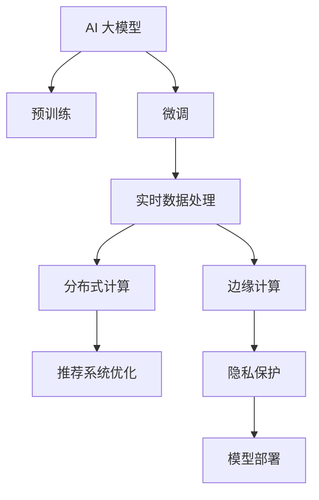

                 

# 电商平台搜索推荐系统的AI 大模型融合：应对实时数据处理的挑战

> 关键词：AI 大模型，搜索推荐系统，实时数据处理，深度学习，自然语言处理(NLP), 电商领域, 分布式计算, 边缘计算, 实时流处理, 推荐系统优化

## 1. 背景介绍

### 1.1 问题由来

在当今数字化时代，电商平台已成为人们日常购物的重要渠道。搜索引擎和推荐系统作为电商平台的核心组件，直接影响着用户的购物体验和电商平台的用户留存率。搜索推荐系统通过理解用户的查询意图和历史行为，实时提供个性化的搜索结果和推荐商品，显著提升了用户的购物效率和满意度。然而，随着电商平台的商品种类日益繁多，用户需求多样化，搜索推荐系统需要处理的海量数据和复杂性也显著增加，这对系统的实时响应能力和性能提出了更高要求。

为了应对这些挑战，AI 大模型技术应运而生。大模型技术通过预训练方式学习到丰富的知识，可以泛化到多种电商应用场景中，并具有高效的推理能力。然而，大模型在电商搜索推荐系统中的实际应用仍面临一些关键问题，如如何高效处理实时数据、提升推荐精度、保障系统稳定性等。本文将详细阐述大模型在电商搜索推荐系统中的应用现状，分析其面临的挑战，并提出解决方案。

### 1.2 问题核心关键点

大模型在电商搜索推荐系统中的应用主要包括以下几个关键点：

1. **预训练与微调**：使用大模型在大规模无标签数据上进行预训练，然后在电商数据上进行微调，以适配电商场景。
2. **实时数据处理**：电商场景中涉及大量的实时数据，如何高效地处理和存储这些数据，是大模型在实际应用中的核心挑战。
3. **推荐系统优化**：如何利用大模型提升推荐系统的精度和效率，同时保障系统稳定性，是另一个重要问题。
4. **分布式计算**：由于大模型参数量巨大，如何在大规模分布式环境中高效运行，是实现实时处理的前提。
5. **边缘计算**：将大模型部署到边缘计算设备，如智能路由器、边缘服务器等，以降低网络延迟和带宽消耗，提升用户体验。
6. **隐私保护**：在处理电商数据时，如何保护用户隐私，是大模型应用中必须考虑的因素。

以下将通过深入分析这些关键点，探讨如何通过大模型技术优化电商搜索推荐系统。

## 2. 核心概念与联系

### 2.1 核心概念概述

为更好地理解大模型在电商搜索推荐系统中的应用，我们首先介绍几个关键概念及其相互关系：

- **AI 大模型**：指在大型计算资源上训练的深度学习模型，如BERT、GPT-3、XLNet等，具有强大的语言理解能力和推理能力，适用于多种自然语言处理任务。
- **搜索推荐系统**：指通过分析用户历史行为、查询意图等数据，实时提供个性化搜索结果和推荐商品的系统，旨在提高用户购物效率和满意度。
- **实时数据处理**：指在电商场景中，对大量实时生成的事务数据进行处理和分析，以支持搜索推荐等应用。
- **分布式计算**：指将计算任务分解成多个子任务，通过多台计算机协同计算，以提升计算效率和处理能力。
- **边缘计算**：指将计算任务分布到靠近数据源的设备上执行，以降低网络延迟和带宽消耗，提升实时性。
- **隐私保护**：指在处理用户数据时，确保数据的安全性和隐私性，防止数据泄露和滥用。

这些概念之间的关系可以通过以下Mermaid流程图来展示：



该流程图展示了从AI大模型到模型部署的全过程，突出了实时数据处理和分布式计算在其中的关键作用。

## 3. 核心算法原理 & 具体操作步骤

### 3.1 算法原理概述

大模型在电商搜索推荐系统中的主要应用原理包括预训练、微调和实时处理。具体而言：

1. **预训练**：在大规模无标签数据（如维基百科、新闻、图书等）上进行预训练，学习到通用的语言知识和表示能力。
2. **微调**：在电商数据上进行微调，以适配电商场景，提升模型在特定任务上的性能。
3. **实时处理**：在电商数据流中进行实时处理，提供个性化的搜索结果和推荐商品。

预训练和微调过程构成了大模型在电商搜索推荐系统中的核心工作流程。以下将详细介绍其具体步骤和实现方法。

### 3.2 算法步骤详解

#### 3.2.1 预训练步骤

1. **数据准备**：收集大规模无标签数据，进行数据清洗和预处理，确保数据质量。
2. **模型选择**：选择合适的预训练模型，如BERT、GPT-3等。
3. **模型训练**：在大规模计算资源上训练模型，学习到通用的语言知识和表示能力。
4. **模型保存**：将训练好的模型保存下来，供后续微调和实时处理使用。

#### 3.2.2 微调步骤

1. **数据准备**：收集电商数据，包括用户查询、历史行为、商品信息等，进行数据清洗和预处理。
2. **模型选择**：选择预训练模型作为微调模型的初始化参数。
3. **模型微调**：在电商数据上对模型进行微调，以适配电商场景，提升模型在特定任务上的性能。
4. **模型评估**：在测试数据集上评估微调后的模型性能，调整模型参数，优化模型效果。
5. **模型部署**：将微调好的模型部署到生产环境中，供实时处理使用。

#### 3.2.3 实时处理步骤

1. **数据采集**：实时采集电商数据流，包括用户查询、浏览、购买等数据。
2. **数据预处理**：对实时数据进行清洗、转换和标准化，确保数据格式一致。
3. **模型推理**：在微调好的模型上进行实时推理，生成个性化的搜索结果和推荐商品。
4. **结果输出**：将推理结果输出到电商平台的前端页面，供用户查看和使用。

### 3.3 算法优缺点

#### 3.3.1 优点

1. **强大的泛化能力**：大模型通过大规模数据预训练，学习到丰富的语言知识和表示能力，能够泛化到多种电商应用场景中。
2. **高效的推理能力**：大模型具有高效的推理能力，能够实时处理大量电商数据，提供个性化搜索结果和推荐商品。
3. **可扩展性强**：大模型可以在分布式环境中高效运行，支持大规模电商平台的实时数据处理需求。
4. **灵活性强**：大模型可以根据电商数据的变化进行实时微调，适应不同的电商场景。

#### 3.3.2 缺点

1. **高资源需求**：大模型需要大量的计算资源进行训练和推理，对硬件资源要求较高。
2. **数据隐私问题**：电商数据包含大量敏感信息，如何在保证隐私的前提下进行数据处理，是大模型应用中需要解决的重要问题。
3. **高延迟问题**：大模型推理需要较长的计算时间，可能会带来较高的延迟，影响用户体验。
4. **模型鲁棒性问题**：大模型对输入数据的细微变化敏感，可能会影响模型的稳定性。

### 3.4 算法应用领域

大模型在电商搜索推荐系统中的应用已经覆盖了多个领域，包括：

1. **搜索系统**：通过理解用户查询意图，提供个性化的搜索结果，提升用户搜索体验。
2. **推荐系统**：通过分析用户历史行为，实时提供个性化推荐商品，提升用户购买率。
3. **客服系统**：通过自然语言处理技术，实时回答用户疑问，提升用户满意度。
4. **广告推荐**：通过分析用户兴趣，实时推荐相关广告，提升广告投放效果。
5. **数据分析**：通过分析电商数据，发现用户行为模式，提供商业洞察。

这些应用场景展示了大模型在电商搜索推荐系统中的广泛应用，为用户提供了更加智能和便捷的电商体验。

## 4. 数学模型和公式 & 详细讲解 & 举例说明

### 4.1 数学模型构建

大模型在电商搜索推荐系统中的数学模型主要包括以下几个部分：

1. **预训练模型**：选择预训练模型，如BERT，并在大规模数据上进行预训练，学习到通用的语言知识和表示能力。
2. **微调模型**：在电商数据上对预训练模型进行微调，以适配电商场景，提升模型在特定任务上的性能。
3. **实时处理模型**：在实时数据上使用微调后的模型进行推理，生成个性化的搜索结果和推荐商品。

### 4.2 公式推导过程

#### 4.2.1 预训练模型

假设预训练模型为BERT，其输入为文本 $x$，输出为表示向量 $h$。预训练模型的目标函数为：

$$
L_{pre-train} = \sum_{i=1}^{n} \mathcal{L}(h_i, x_i)
$$

其中 $h_i$ 为模型在输入 $x_i$ 上的输出表示向量，$\mathcal{L}$ 为损失函数，如掩码语言模型或下一句预测。

#### 4.2.2 微调模型

假设微调任务的输入为文本 $x$，输出为标签 $y$，微调模型为BERT。微调的目标函数为：

$$
L_{fine-tune} = \sum_{i=1}^{n} \mathcal{L}(h_i, y_i)
$$

其中 $h_i$ 为模型在输入 $x_i$ 上的输出表示向量，$\mathcal{L}$ 为损失函数，如交叉熵损失函数。

#### 4.2.3 实时处理模型

假设实时处理模型的输入为文本 $x$，输出为结果 $r$，模型为微调后的BERT。实时处理模型的推理过程如下：

1. 将文本 $x$ 输入模型，得到表示向量 $h$。
2. 根据任务需求，使用表示向量 $h$ 进行后续处理，如分类、生成、检索等。
3. 输出结果 $r$，供电商平台使用。

### 4.3 案例分析与讲解

#### 4.3.1 电商搜索系统

电商搜索系统的主要任务是理解用户查询意图，提供个性化的搜索结果。以下以商品搜索为例，进行详细分析。

假设用户查询为 "iPhone 11 价格"，电商搜索系统需要对查询进行处理，生成搜索结果。其步骤如下：

1. **预处理**：将查询 "iPhone 11 价格" 转换为模型可处理的格式。
2. **预训练模型推理**：使用预训练模型BERT对查询进行处理，生成表示向量 $h$。
3. **微调模型推理**：在电商数据上微调后的模型进行推理，生成搜索结果。
4. **结果输出**：将搜索结果输出到电商平台页面，供用户查看。

#### 4.3.2 电商推荐系统

电商推荐系统的主要任务是根据用户历史行为，实时提供个性化推荐商品。以下以推荐商品为例，进行详细分析。

假设用户浏览了 "iPhone 11"，电商推荐系统需要对浏览行为进行处理，生成推荐商品。其步骤如下：

1. **预处理**：将浏览行为 "iPhone 11" 转换为模型可处理的格式。
2. **预训练模型推理**：使用预训练模型BERT对浏览行为进行处理，生成表示向量 $h$。
3. **微调模型推理**：在电商数据上微调后的模型进行推理，生成推荐商品。
4. **结果输出**：将推荐商品输出到电商平台页面，供用户查看。

## 5. 项目实践：代码实例和详细解释说明

### 5.1 开发环境搭建

在进行大模型在电商搜索推荐系统中的实践前，需要准备好开发环境。以下是使用Python进行PyTorch开发的环境配置流程：

1. 安装Anaconda：从官网下载并安装Anaconda，用于创建独立的Python环境。
2. 创建并激活虚拟环境：
```bash
conda create -n pytorch-env python=3.8 
conda activate pytorch-env
```

3. 安装PyTorch：根据CUDA版本，从官网获取对应的安装命令。例如：
```bash
conda install pytorch torchvision torchaudio cudatoolkit=11.1 -c pytorch -c conda-forge
```

4. 安装Transformers库：
```bash
pip install transformers
```

5. 安装各类工具包：
```bash
pip install numpy pandas scikit-learn matplotlib tqdm jupyter notebook ipython
```

完成上述步骤后，即可在`pytorch-env`环境中开始微调实践。

### 5.2 源代码详细实现

下面我们以电商推荐系统为例，给出使用Transformers库对BERT模型进行微调的PyTorch代码实现。

首先，定义电商推荐系统的数据处理函数：

```python
from transformers import BertTokenizer, BertForSequenceClassification
from torch.utils.data import Dataset
import torch

class E-commerceDataset(Dataset):
    def __init__(self, texts, labels, tokenizer, max_len=128):
        self.texts = texts
        self.labels = labels
        self.tokenizer = tokenizer
        self.max_len = max_len
        
    def __len__(self):
        return len(self.texts)
    
    def __getitem__(self, item):
        text = self.texts[item]
        label = self.labels[item]
        
        encoding = self.tokenizer(text, return_tensors='pt', max_length=self.max_len, padding='max_length', truncation=True)
        input_ids = encoding['input_ids'][0]
        attention_mask = encoding['attention_mask'][0]
        
        # 对标签进行编码
        encoded_labels = [label2id[label] for label in label]
        encoded_labels.extend([label2id['O']] * (self.max_len - len(encoded_labels)))
        labels = torch.tensor(encoded_labels, dtype=torch.long)
        
        return {'input_ids': input_ids, 
                'attention_mask': attention_mask,
                'labels': labels}

# 标签与id的映射
label2id = {'O': 0, 'Positive': 1, 'Negative': 2}

# 创建dataset
tokenizer = BertTokenizer.from_pretrained('bert-base-cased')

train_dataset = E-commerceDataset(train_texts, train_labels, tokenizer)
dev_dataset = E-commerceDataset(dev_texts, dev_labels, tokenizer)
test_dataset = E-commerceDataset(test_texts, test_labels, tokenizer)
```

然后，定义模型和优化器：

```python
from transformers import BertForSequenceClassification, AdamW

model = BertForSequenceClassification.from_pretrained('bert-base-cased', num_labels=len(label2id))

optimizer = AdamW(model.parameters(), lr=2e-5)
```

接着，定义训练和评估函数：

```python
from torch.utils.data import DataLoader
from tqdm import tqdm
from sklearn.metrics import classification_report

device = torch.device('cuda') if torch.cuda.is_available() else torch.device('cpu')
model.to(device)

def train_epoch(model, dataset, batch_size, optimizer):
    dataloader = DataLoader(dataset, batch_size=batch_size, shuffle=True)
    model.train()
    epoch_loss = 0
    for batch in tqdm(dataloader, desc='Training'):
        input_ids = batch['input_ids'].to(device)
        attention_mask = batch['attention_mask'].to(device)
        labels = batch['labels'].to(device)
        model.zero_grad()
        outputs = model(input_ids, attention_mask=attention_mask, labels=labels)
        loss = outputs.loss
        epoch_loss += loss.item()
        loss.backward()
        optimizer.step()
    return epoch_loss / len(dataloader)

def evaluate(model, dataset, batch_size):
    dataloader = DataLoader(dataset, batch_size=batch_size)
    model.eval()
    preds, labels = [], []
    with torch.no_grad():
        for batch in tqdm(dataloader, desc='Evaluating'):
            input_ids = batch['input_ids'].to(device)
            attention_mask = batch['attention_mask'].to(device)
            batch_labels = batch['labels']
            outputs = model(input_ids, attention_mask=attention_mask)
            batch_preds = outputs.logits.argmax(dim=2).to('cpu').tolist()
            batch_labels = batch_labels.to('cpu').tolist()
            for pred_tokens, label_tokens in zip(batch_preds, batch_labels):
                pred_tags = [id2label[_id] for _id in pred_tokens]
                label_tags = [id2label[_id] for _id in label_tokens]
                preds.append(pred_tags[:len(label_tags)])
                labels.append(label_tags)
                
    print(classification_report(labels, preds))
```

最后，启动训练流程并在测试集上评估：

```python
epochs = 5
batch_size = 16

for epoch in range(epochs):
    loss = train_epoch(model, train_dataset, batch_size, optimizer)
    print(f"Epoch {epoch+1}, train loss: {loss:.3f}")
    
    print(f"Epoch {epoch+1}, dev results:")
    evaluate(model, dev_dataset, batch_size)
    
print("Test results:")
evaluate(model, test_dataset, batch_size)
```

以上就是使用PyTorch对BERT进行电商推荐系统微调的完整代码实现。可以看到，得益于Transformers库的强大封装，我们可以用相对简洁的代码完成BERT模型的加载和微调。

### 5.3 代码解读与分析

让我们再详细解读一下关键代码的实现细节：

**E-commerceDataset类**：
- `__init__`方法：初始化文本、标签、分词器等关键组件。
- `__len__`方法：返回数据集的样本数量。
- `__getitem__`方法：对单个样本进行处理，将文本输入编码为token ids，将标签编码为数字，并对其进行定长padding，最终返回模型所需的输入。

**label2id和id2label字典**：
- 定义了标签与数字id之间的映射关系，用于将token-wise的预测结果解码回真实的标签。

**训练和评估函数**：
- 使用PyTorch的DataLoader对数据集进行批次化加载，供模型训练和推理使用。
- 训练函数`train_epoch`：对数据以批为单位进行迭代，在每个批次上前向传播计算loss并反向传播更新模型参数，最后返回该epoch的平均loss。
- 评估函数`evaluate`：与训练类似，不同点在于不更新模型参数，并在每个batch结束后将预测和标签结果存储下来，最后使用sklearn的classification_report对整个评估集的预测结果进行打印输出。

**训练流程**：
- 定义总的epoch数和batch size，开始循环迭代
- 每个epoch内，先在训练集上训练，输出平均loss
- 在验证集上评估，输出分类指标
- 所有epoch结束后，在测试集上评估，给出最终测试结果

可以看到，PyTorch配合Transformers库使得BERT微调的代码实现变得简洁高效。开发者可以将更多精力放在数据处理、模型改进等高层逻辑上，而不必过多关注底层的实现细节。

当然，工业级的系统实现还需考虑更多因素，如模型的保存和部署、超参数的自动搜索、更灵活的任务适配层等。但核心的微调范式基本与此类似。

## 6. 实际应用场景

### 6.1 智能客服系统

基于大模型微调的对话技术，可以广泛应用于智能客服系统的构建。传统客服往往需要配备大量人力，高峰期响应缓慢，且一致性和专业性难以保证。而使用微调后的对话模型，可以7x24小时不间断服务，快速响应客户咨询，用自然流畅的语言解答各类常见问题。

在技术实现上，可以收集企业内部的历史客服对话记录，将问题和最佳答复构建成监督数据，在此基础上对预训练对话模型进行微调。微调后的对话模型能够自动理解用户意图，匹配最合适的答案模板进行回复。对于客户提出的新问题，还可以接入检索系统实时搜索相关内容，动态组织生成回答。如此构建的智能客服系统，能大幅提升客户咨询体验和问题解决效率。

### 6.2 金融舆情监测

金融机构需要实时监测市场舆论动向，以便及时应对负面信息传播，规避金融风险。传统的人工监测方式成本高、效率低，难以应对网络时代海量信息爆发的挑战。基于大语言模型微调的文本分类和情感分析技术，为金融舆情监测提供了新的解决方案。

具体而言，可以收集金融领域相关的新闻、报道、评论等文本数据，并对其进行主题标注和情感标注。在此基础上对预训练语言模型进行微调，使其能够自动判断文本属于何种主题，情感倾向是正面、中性还是负面。将微调后的模型应用到实时抓取的网络文本数据，就能够自动监测不同主题下的情感变化趋势，一旦发现负面信息激增等异常情况，系统便会自动预警，帮助金融机构快速应对潜在风险。

### 6.3 个性化推荐系统

当前的推荐系统往往只依赖用户的历史行为数据进行物品推荐，无法深入理解用户的真实兴趣偏好。基于大语言模型微调技术，个性化推荐系统可以更好地挖掘用户行为背后的语义信息，从而提供更精准、多样的推荐内容。

在实践中，可以收集用户浏览、点击、评论、分享等行为数据，提取和用户交互的物品标题、描述、标签等文本内容。将文本内容作为模型输入，用户的后续行为（如是否点击、购买等）作为监督信号，在此基础上微调预训练语言模型。微调后的模型能够从文本内容中准确把握用户的兴趣点。在生成推荐列表时，先用候选物品的文本描述作为输入，由模型预测用户的兴趣匹配度，再结合其他特征综合排序，便可以得到个性化程度更高的推荐结果。

### 6.4 未来应用展望

随着大语言模型和微调方法的不断发展，基于微调范式将在更多领域得到应用，为传统行业带来变革性影响。

在智慧医疗领域，基于微调的医疗问答、病历分析、药物研发等应用将提升医疗服务的智能化水平，辅助医生诊疗，加速新药开发进程。

在智能教育领域，微调技术可应用于作业批改、学情分析、知识推荐等方面，因材施教，促进教育公平，提高教学质量。

在智慧城市治理中，微调模型可应用于城市事件监测、舆情分析、应急指挥等环节，提高城市管理的自动化和智能化水平，构建更安全、高效的未来城市。

此外，在企业生产、社会治理、文娱传媒等众多领域，基于大模型微调的人工智能应用也将不断涌现，为经济社会发展注入新的动力。相信随着技术的日益成熟，微调方法将成为人工智能落地应用的重要范式，推动人工智能技术在垂直行业的规模化落地。总之，微调需要开发者根据具体任务，不断迭代和优化模型、数据和算法，方能得到理想的效果。

## 7. 工具和资源推荐
### 7.1 学习资源推荐

为了帮助开发者系统掌握大模型微调的理论基础和实践技巧，这里推荐一些优质的学习资源：

1. 《Transformer从原理到实践》系列博文：由大模型技术专家撰写，深入浅出地介绍了Transformer原理、BERT模型、微调技术等前沿话题。

2. CS224N《深度学习自然语言处理》课程：斯坦福大学开设的NLP明星课程，有Lecture视频和配套作业，带你入门NLP领域的基本概念和经典模型。

3. 《Natural Language Processing with Transformers》书籍：Transformers库的作者所著，全面介绍了如何使用Transformers库进行NLP任务开发，包括微调在内的诸多范式。

4. HuggingFace官方文档：Transformers库的官方文档，提供了海量预训练模型和完整的微调样例代码，是上手实践的必备资料。

5. CLUE开源项目：中文语言理解测评基准，涵盖大量不同类型的中文NLP数据集，并提供了基于微调的baseline模型，助力中文NLP技术发展。

通过对这些资源的学习实践，相信你一定能够快速掌握大模型微调的精髓，并用于解决实际的NLP问题。
###  7.2 开发工具推荐

高效的开发离不开优秀的工具支持。以下是几款用于大模型微调开发的常用工具：

1. PyTorch：基于Python的开源深度学习框架，灵活动态的计算图，适合快速迭代研究。大部分预训练语言模型都有PyTorch版本的实现。

2. TensorFlow：由Google主导开发的开源深度学习框架，生产部署方便，适合大规模工程应用。同样有丰富的预训练语言模型资源。

3. Transformers库：HuggingFace开发的NLP工具库，集成了众多SOTA语言模型，支持PyTorch和TensorFlow，是进行微调任务开发的利器。

4. Weights & Biases：模型训练的实验跟踪工具，可以记录和可视化模型训练过程中的各项指标，方便对比和调优。与主流深度学习框架无缝集成。

5. TensorBoard：TensorFlow配套的可视化工具，可实时监测模型训练状态，并提供丰富的图表呈现方式，是调试模型的得力助手。

6. Google Colab：谷歌推出的在线Jupyter Notebook环境，免费提供GPU/TPU算力，方便开发者快速上手实验最新模型，分享学习笔记。

合理利用这些工具，可以显著提升大模型微调任务的开发效率，加快创新迭代的步伐。

### 7.3 相关论文推荐

大语言模型和微调技术的发展源于学界的持续研究。以下是几篇奠基性的相关论文，推荐阅读：

1. Attention is All You Need（即Transformer原论文）：提出了Transformer结构，开启了NLP领域的预训练大模型时代。

2. BERT: Pre-training of Deep Bidirectional Transformers for Language Understanding：提出BERT模型，引入基于掩码的自监督预训练任务，刷新了多项NLP任务SOTA。

3. Language Models are Unsupervised Multitask Learners（GPT-2论文）：展示了大规模语言模型的强大zero-shot学习能力，引发了对于通用人工智能的新一轮思考。

4. Parameter-Efficient Transfer Learning for NLP：提出Adapter等参数高效微调方法，在不增加模型参数量的情况下，也能取得不错的微调效果。

5. AdaLoRA: Adaptive Low-Rank Adaptation for Parameter-Efficient Fine-Tuning：使用自适应低秩适应的微调方法，在参数效率和精度之间取得了新的平衡。

这些论文代表了大模型微调技术的发展脉络。通过学习这些前沿成果，可以帮助研究者把握学科前进方向，激发更多的创新灵感。

## 8. 总结：未来发展趋势与挑战

### 8.1 总结

本文对大模型在电商搜索推荐系统中的应用现状进行了全面系统的介绍。首先阐述了电商搜索推荐系统的大规模数据处理需求和实时性要求，明确了大模型技术的应用价值。其次，从原理到实践，详细讲解了大模型在电商搜索推荐系统中的预训练、微调和实时处理过程。通过代码实例，展示了电商推荐系统的完整实现过程。同时，本文还广泛探讨了微调方法在智能客服、金融舆情、个性化推荐等多个行业领域的应用前景，展示了微调范式的巨大潜力。最后，本文精选了微调技术的各类学习资源，力求为读者提供全方位的技术指引。

通过本文的系统梳理，可以看到，大模型在电商搜索推荐系统中的应用，为实现实时数据处理、提升推荐精度、保障系统稳定性等关键问题提供了有效的解决方案。大模型技术已经在多个行业领域取得了显著成效，未来将进一步拓展其应用边界，推动人工智能技术在更多垂直行业的落地应用。

### 8.2 未来发展趋势

展望未来，大模型在电商搜索推荐系统中的应用将呈现以下几个发展趋势：

1. **更高效的实时处理**：随着计算资源和算法优化技术的不断进步，大模型在实时数据处理中的效率将进一步提升，能够处理更复杂的电商场景需求。
2. **更强的个性化推荐**：通过更深入的语义理解和用户行为分析，大模型将提供更精准、个性化的推荐商品，提升用户购物体验。
3. **更广泛的应用场景**：大模型将进一步拓展到智能客服、金融舆情、智能医疗等多个领域，推动多行业数字化转型升级。
4. **更高的模型精度**：通过优化微调算法和数据处理技术，大模型的推荐精度和鲁棒性将进一步提升，为用户提供更可靠的推荐服务。
5. **更高的系统安全性**：通过引入伦理导向的评估指标和隐私保护技术，大模型将更好地保障用户数据的安全性和隐私性。
6. **更强的跨领域迁移能力**：通过更灵活的预训练和微调技术，大模型将能够更好地适应不同领域的数据分布，提升跨领域迁移能力。

以上趋势凸显了大模型在电商搜索推荐系统中的广阔前景。这些方向的探索发展，必将进一步提升大模型技术的应用范围和性能，为电商行业带来新的突破和变革。

### 8.3 面临的挑战

尽管大模型在电商搜索推荐系统中的应用已经取得了显著成效，但在迈向更加智能化、普适化应用的过程中，它仍面临一些关键挑战：

1. **高资源需求**：大模型需要大量的计算资源进行训练和推理，对硬件资源要求较高。如何在有限的计算资源下高效利用大模型，是一个亟待解决的问题。
2. **数据隐私问题**：电商数据包含大量敏感信息，如何在保障用户隐私的前提下进行数据处理，是大模型应用中需要解决的重要问题。
3. **模型鲁棒性问题**：大模型对输入数据的细微变化敏感，可能会影响模型的稳定性。如何提升模型的鲁棒性，保障模型在多变环境下的性能，是一个重要的研究方向。
4. **实时处理延迟**：大模型推理需要较长的计算时间，可能会带来较高的延迟，影响用户体验。如何优化模型推理效率，降低延迟，是实现实时处理的关键。
5. **系统复杂性问题**：大模型在电商搜索推荐系统中的应用需要与多种系统组件协同工作，系统复杂性较高。如何简化系统架构，提高系统的可靠性和可维护性，是一个重要的研究方向。
6. **数据不平衡问题**：电商数据存在长尾分布，某些商品的销量较少，可能会影响模型的推荐效果。如何处理数据不平衡问题，提升长尾商品的推荐精度，是一个重要的研究方向。

### 8.4 研究展望

面对大模型在电商搜索推荐系统中的应用挑战，未来的研究需要在以下几个方面寻求新的突破：

1. **更高效的预训练和微调方法**：开发更高效的大模型预训练和微调算法，提升模型在实时数据处理中的效率和精度。
2. **更强的隐私保护技术**：引入更先进的隐私保护技术，如联邦学习、差分隐私等，保障用户数据的安全性和隐私性。
3. **更强的模型鲁棒性**：引入更强的模型鲁棒性技术，如对抗训练、鲁棒优化等，提升模型在多变环境下的性能和稳定性。
4. **更高效的实时处理**：引入更高效的实时处理技术，如分布式计算、边缘计算等，降低模型推理延迟，提升实时性。
5. **更灵活的系统架构**：引入更灵活的系统架构设计，如微服务、无服务器架构等，提高系统的可扩展性和可靠性。
6. **更强大的数据处理能力**：引入更强大的数据处理技术，如数据增强、数据融合等，提升长尾商品的推荐精度。

这些研究方向的探索，必将引领大模型在电商搜索推荐系统中的应用走向更加智能化、普适化和高效化的方向，为用户带来更优质的电商购物体验。

## 9. 附录：常见问题与解答

**Q1：大模型在电商搜索推荐系统中的实际应用效果如何？**

A: 大模型在电商搜索推荐系统中的应用效果显著。通过预训练和微调，大模型能够学习到通用的语言知识和表示能力，提升推荐系统的精度和个性化程度。在实时数据处理中，大模型能够高效处理电商数据，快速响应用户查询和推荐需求，提升用户体验。

**Q2：大模型在电商搜索推荐系统中的性能瓶颈是什么？**

A: 大模型在电商搜索推荐系统中的性能瓶颈主要集中在以下几个方面：
1. **计算资源需求高**：大模型需要大量的计算资源进行训练和推理，对硬件资源要求较高。
2. **实时处理延迟高**：大模型推理需要较长的计算时间，可能会带来较高的延迟，影响用户体验。
3. **数据隐私问题**：电商数据包含大量敏感信息，需要在保障用户隐私的前提下进行数据处理。
4. **系统复杂度高**：大模型在电商搜索推荐系统中的应用需要与多种系统组件协同工作，系统复杂性较高。

**Q3：如何优化大模型在电商搜索推荐系统中的应用？**

A: 优化大模型在电商搜索推荐系统中的应用可以从以下几个方面入手：
1. **优化预训练和微调算法**：采用更高效的预训练和微调算法，提升模型在实时数据处理中的效率和精度。
2. **引入隐私保护技术**：引入更先进的隐私保护技术，如联邦学习、差分隐私等，保障用户数据的安全性和隐私性。
3. **优化实时处理技术**：引入更高效的实时处理技术，如分布式计算、边缘计算等，降低模型推理延迟，提升实时性。
4. **简化系统架构**：引入更灵活的系统架构设计，如微服务、无服务器架构等，提高系统的可扩展性和可靠性。
5. **增强数据处理能力**：引入更强大的数据处理技术，如数据增强、数据融合等，提升长尾商品的推荐精度。

**Q4：大模型在电商搜索推荐系统中的优势和劣势是什么？**

A: 大模型在电商搜索推荐系统中的优势包括：
1. **强大的泛化能力**：大模型通过大规模数据预训练，学习到丰富的语言知识和表示能力，能够泛化到多种电商应用场景中。
2. **高效的推理能力**：大模型具有高效的推理能力，能够实时处理大量电商数据，提供个性化搜索结果和推荐商品。
3. **可扩展性强**：大模型可以在分布式环境中高效运行，支持大规模电商平台的实时数据处理需求。
4. **灵活性强**：大模型可以根据电商数据的变化进行实时微调，适应不同的电商场景。

大模型在电商搜索推荐系统中的劣势包括：
1. **高资源需求**：大模型需要大量的计算资源进行训练和推理，对硬件资源要求较高。
2. **数据隐私问题**：电商数据包含大量敏感信息，需要在保障用户隐私的前提下进行数据处理。
3. **高延迟问题**：大模型推理需要较长的计算时间，可能会带来较高的延迟，影响用户体验。
4. **模型鲁棒性问题**：大模型对输入数据的细微变化敏感，可能会影响模型的稳定性。

**Q5：未来大模型在电商搜索推荐系统中的应用方向是什么？**

A: 未来大模型在电商搜索推荐系统中的应用方向包括：
1. **更高效的实时处理**：随着计算资源和算法优化技术的不断进步，大模型在实时数据处理中的效率将进一步提升。
2. **更强的个性化推荐**：通过更深入的语义理解和用户行为分析，大模型将提供更精准、个性化的推荐商品。
3. **更广泛的应用场景**：大模型将进一步拓展到智能客服、金融舆情、智能医疗等多个领域，推动多行业数字化转型升级。
4. **更高的模型精度**：通过优化微调算法和数据处理技术，大模型的推荐精度和鲁棒性将进一步提升。
5. **更高的系统安全性**：通过引入伦理导向的评估指标和隐私保护技术，大模型将更好地保障用户数据的安全性和隐私性。
6. **更强的跨领域迁移能力**：通过更灵活的预训练和微调技术，大模型将能够更好地适应不同领域的数据分布，提升跨领域迁移能力。

总之，未来大模型在电商搜索推荐系统中的应用将朝着更加智能化、普适化和高效化的方向发展，为用户带来更优质的电商购物体验。

---

作者：禅与计算机程序设计艺术 / Zen and the Art of Computer Programming

