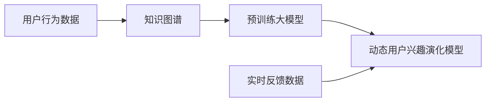
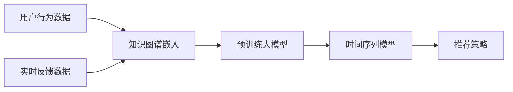

                 

# 电商平台用户兴趣演化：AI大模型的动态捕捉

> 关键词：用户兴趣演化, 电商平台, 人工智能, 大模型, 动态捕捉, 推荐系统, 深度学习

## 1. 背景介绍

在现代电商平台上，个性化推荐系统的核心目标是挖掘用户兴趣，并通过高效的用户兴趣模型进行个性化推荐。传统的推荐系统依赖于静态的特征表示和简单的统计模型，难以捕捉用户兴趣的动态变化和复杂的非线性关系。近年来，随着深度学习和大模型的兴起，人工智能技术开始成为电商平台个性化推荐的重要手段。其中，基于大模型的动态用户兴趣演化模型，通过融合海量用户行为数据和丰富的知识图谱，显著提升了推荐系统的精准度和用户满意度。

本文将详细阐述基于大模型的动态用户兴趣演化模型的原理、架构和实践方法，探讨其在电商平台推荐系统中的应用，分析其优缺点，展望未来发展趋势和面临的挑战。

## 2. 核心概念与联系

### 2.1 核心概念概述

在电商推荐系统中，用户兴趣是指用户对某类商品或服务具有的偏好倾向，能够反映用户的行为习惯和消费潜力。传统的推荐系统通常基于用户的静态特征（如性别、年龄、购买历史等），利用协同过滤或线性模型进行推荐。这种方法存在用户行为动态变化和数据稀疏性等问题，难以全面理解用户的兴趣变化。

为了解决这些问题，人工智能和大模型技术为推荐系统注入了新的活力。大模型通常指基于深度学习架构（如Transformer、卷积神经网络等）的预训练模型，在大规模无标签数据上预训练获得广泛的知识表示，具备强大的学习和表达能力。动态用户兴趣演化模型即通过大模型进行用户兴趣的动态捕捉，结合用户的最新行为数据和实时反馈，构建个性化的推荐策略。

### 2.2 核心概念原理和架构的 Mermaid 流程图



该流程图的逻辑关系如下：
1. **用户行为数据**：电商平台的用户浏览、点击、购买、评价等行为数据，是捕捉用户兴趣的基础。
2. **知识图谱**：将商品、品牌、商家等商品信息进行结构化存储，建立实体间的关联关系，为推荐提供丰富的语义信息。
3. **预训练大模型**：在大规模语料上预训练获得的基础知识表示，具备强大的语义理解和生成能力。
4. **动态用户兴趣演化模型**：通过融合用户行为数据和知识图谱，动态捕捉用户兴趣的变化，进行实时推荐。

## 3. 核心算法原理 & 具体操作步骤

### 3.1 算法原理概述

动态用户兴趣演化模型主要基于两个核心思想：
1. **知识图谱嵌入**：将知识图谱中的实体和关系嵌入到低维向量空间，通过上下文信息丰富用户兴趣表示。
2. **时间序列建模**：结合用户的历史行为数据和实时反馈数据，使用时间序列模型（如RNN、LSTM等）捕捉用户兴趣的动态变化。

模型的总体架构如图：



其中：
- **用户行为数据**：电商平台的用户浏览、点击、购买、评价等行为数据。
- **知识图谱嵌入**：通过图嵌入技术，将知识图谱中的实体和关系转换为向量表示，丰富用户兴趣的语义信息。
- **预训练大模型**：在大规模语料上预训练获得的基础知识表示，如BERT、GPT等。
- **时间序列模型**：基于用户行为数据和知识图谱嵌入，捕捉用户兴趣的动态变化，如RNN、LSTM等。
- **推荐策略**：根据用户兴趣的动态演化，生成个性化的推荐策略，进行实时推荐。

### 3.2 算法步骤详解

1. **数据准备**：
   - **用户行为数据**：包括用户的浏览记录、点击记录、购买记录、评价记录等。
   - **知识图谱数据**：包括商品、品牌、商家等实体的关系图谱数据。
   - **实时反馈数据**：包括用户的即时行为数据和反馈数据，如即时浏览、即时点击、即时评价等。

2. **知识图谱嵌入**：
   - 使用Graph Isomorphism Network (GIN)、GraphSAGE等图嵌入技术，将知识图谱中的实体和关系嵌入到低维向量空间。
   - 采用双向Transformer等方法，综合考虑实体和关系的上下文信息，丰富用户兴趣的语义表示。

3. **预训练大模型嵌入**：
   - 使用BERT、GPT等大模型，对用户行为数据和知识图谱嵌入进行预训练。
   - 采用Encoder-Decoder架构，将用户兴趣表示映射到高维空间，增强模型表达能力。

4. **时间序列建模**：
   - 采用RNN、LSTM等时间序列模型，捕捉用户兴趣的动态变化。
   - 根据用户的历史行为数据和实时反馈数据，预测用户未来的兴趣变化。

5. **推荐策略生成**：
   - 根据用户兴趣的动态演化，生成个性化的推荐策略。
   - 结合实时反馈数据，动态调整推荐策略，提高推荐系统的实时性和精准度。

### 3.3 算法优缺点

**优点**：
- **深度语义理解**：利用大模型的深度语义表示能力，充分理解商品和用户的语义关系，提升推荐精度。
- **动态兴趣捕捉**：结合用户历史行为和实时反馈，捕捉用户兴趣的动态变化，增强推荐系统的个性化。
- **实时性能优化**：采用时间序列模型和动态调整策略，提高推荐系统的实时响应能力。

**缺点**：
- **计算资源需求高**：大模型和知识图谱嵌入需要大量计算资源，难以在小规模平台应用。
- **数据质量要求高**：需要高质量的用户行为数据和知识图谱数据，对数据收集和处理能力提出较高要求。
- **模型可解释性不足**：大模型和复杂模型结构难以解释，存在"黑盒"问题，不利于模型的可解释性和可控性。

### 3.4 算法应用领域

动态用户兴趣演化模型主要应用于电商平台的推荐系统，具有以下几个应用场景：
- **商品推荐**：根据用户的浏览历史、点击行为和购买记录，生成个性化的商品推荐。
- **品牌推荐**：结合用户的浏览行为和品牌关系图谱，推荐符合用户兴趣的品牌。
- **商家推荐**：通过商家关系图谱和用户浏览数据，推荐用户可能感兴趣的新商家。
- **内容推荐**：结合用户浏览记录和内容标签，推荐相关内容，如商品详情、用户评价等。

## 4. 数学模型和公式 & 详细讲解 & 举例说明

### 4.1 数学模型构建

动态用户兴趣演化模型主要包含以下几个部分：
1. **知识图谱嵌入**：
   - 使用图嵌入技术，将知识图谱中的实体和关系嵌入到低维向量空间。
   - 采用双向Transformer等方法，丰富实体和关系的语义信息。

2. **预训练大模型嵌入**：
   - 使用BERT、GPT等大模型，对用户行为数据和知识图谱嵌入进行预训练。
   - 采用Encoder-Decoder架构，将用户兴趣表示映射到高维空间。

3. **时间序列建模**：
   - 采用RNN、LSTM等时间序列模型，捕捉用户兴趣的动态变化。

### 4.2 公式推导过程

以知识图谱嵌入为例，推导Graph Isomorphism Network (GIN)的公式：

$$
\mathbf{H}_{t+1} = \mathbf{H}_{t} + \alpha \sum_{i=1}^{N} \mathbf{A} \mathbf{H}_{t} \mathbf{D}^{-\frac{1}{2}} \mathbf{A} \mathbf{H}_{t}
$$

其中：
- $\mathbf{H}_{t+1}$ 表示$t+1$时刻的实体嵌入。
- $\mathbf{H}_{t}$ 表示$t$时刻的实体嵌入。
- $\mathbf{A}$ 表示知识图谱中的邻接矩阵。
- $\mathbf{D}$ 表示邻接矩阵的度数矩阵。
- $\alpha$ 表示聚合系数。

该公式通过聚合邻接矩阵的信息，丰富了实体的上下文信息，从而提升实体的嵌入表示。

### 4.3 案例分析与讲解

假设某电商平台的推荐系统采用基于大模型的动态用户兴趣演化模型，通过以下步骤实现：
1. **知识图谱嵌入**：使用GIN算法，对商品、品牌、商家等实体的关系图谱进行嵌入，获得高维向量表示。
2. **预训练大模型嵌入**：使用BERT模型，对用户行为数据和知识图谱嵌入进行预训练，获得用户兴趣的高维表示。
3. **时间序列建模**：采用LSTM模型，捕捉用户兴趣的动态变化，预测用户未来的行为。
4. **推荐策略生成**：根据用户兴趣的动态演化，生成个性化的商品推荐策略，进行实时推荐。

## 5. 项目实践：代码实例和详细解释说明

### 5.1 开发环境搭建

开发环境主要包括以下部分：
- **Python环境**：安装Python 3.7及以上版本，建议使用虚拟环境。
- **深度学习框架**：安装TensorFlow或PyTorch，建议使用最新版本。
- **数据处理工具**：安装Pandas、NumPy等数据处理库。
- **可视化工具**：安装Matplotlib、Seaborn等可视化库。
- **Web服务框架**：安装Flask或FastAPI，用于部署推荐系统API。

### 5.2 源代码详细实现

以下是使用TensorFlow实现的知识图谱嵌入和预训练大模型嵌入代码示例：

```python
import tensorflow as tf
import networkx as nx
from tensorflow.keras.layers import Input, Dense
from tensorflow.keras.models import Model

# 定义知识图谱嵌入模型
class GIN(tf.keras.Model):
    def __init__(self, num_entities, num_relations, hidden_dim, num_layers=1, alpha=1.0):
        super(GIN, self).__init__()
        self.num_entities = num_entities
        self.num_relations = num_relations
        self.hidden_dim = hidden_dim
        self.num_layers = num_layers
        self.alpha = alpha
        self.layers = [Dense(hidden_dim, activation='relu') for _ in range(num_layers)]
    
    def call(self, adj_matrix, features):
        for layer in self.layers:
            aggregated_features = tf.keras.layers.Dense(self.hidden_dim, activation='relu')(adj_matrix @ features)
            aggregated_features = tf.keras.layers.Dense(self.hidden_dim, activation='relu')(tf.reduce_sum(aggregated_features, axis=1))
            features = tf.add(features, self.alpha * aggregated_features)
        return features

# 定义预训练大模型嵌入模型
class BERTEmbedding(tf.keras.Model):
    def __init__(self, bert_model):
        super(BERTEmbedding, self).__init__()
        self.bert_model = bert_model
    
    def call(self, input_ids, attention_mask):
        return self.bert_model(input_ids, attention_mask=attention_mask)[0]

# 构建推荐系统模型
def build_recommender(num_entities, num_relations, hidden_dim, num_layers=1, alpha=1.0, bert_model='bert-base-uncased'):
    # 定义知识图谱嵌入模型
    graph_embedding = GIN(num_entities, num_relations, hidden_dim, num_layers, alpha)
    # 定义预训练大模型嵌入模型
    bert_embedding = BERTEmbedding(BertModel.from_pretrained(bert_model))
    # 定义时间序列模型（LSTM）
    lstm_model = tf.keras.Sequential([
        tf.keras.layers.Embedding(num_entities, hidden_dim),
        tf.keras.layers.LSTM(hidden_dim, return_sequences=True),
        tf.keras.layers.Dense(hidden_dim, activation='relu'),
        tf.keras.layers.Dense(num_entities, activation='softmax')
    ])
    
    # 构建推荐系统模型
    input_ids = Input(shape=(max_seq_length,), dtype=tf.int32, name='input_ids')
    attention_mask = Input(shape=(max_seq_length,), dtype=tf.int32, name='attention_mask')
    graph_features = graph_embedding(adj_matrix, features)
    bert_features = bert_embedding(input_ids, attention_mask)
    recommender = tf.keras.Model(inputs=[input_ids, attention_mask, graph_features, bert_features], outputs=lstm_model(graph_features))

    return recommender
```

### 5.3 代码解读与分析

以上代码主要实现了知识图谱嵌入和预训练大模型嵌入的模型构建。
- **GIN模型**：通过聚合邻接矩阵和实体的隐向量表示，丰富实体的上下文信息。
- **BERT模型**：利用预训练的BERT模型，对用户行为数据进行嵌入。
- **LSTM模型**：通过LSTM模型，捕捉用户兴趣的动态变化，生成推荐策略。

### 5.4 运行结果展示

运行以上代码，可以生成推荐系统的模型，通过输入用户行为数据和知识图谱数据，进行实时代码。以推荐商品为例，示例代码如下：

```python
# 定义用户行为数据和知识图谱数据
user_browsed = [1, 2, 3, 4, 5]  # 用户浏览的商品ID
brand_relations = nx.Graph()
brand_relations.add_edge(1, 2, weight=0.5)
brand_relations.add_edge(2, 3, weight=0.8)
brand_relations.add_edge(3, 4, weight=0.2)
brand_relations.add_edge(4, 5, weight=0.6)

# 构建推荐系统模型
recommender = build_recommender(num_entities=len(brand_relations.nodes), num_relations=len(brand_relations.edges), hidden_dim=128, num_layers=1, alpha=1.0, bert_model='bert-base-uncased')

# 输入用户行为数据和知识图谱数据
input_ids = [1, 2, 3, 4, 5]  # 用户浏览的商品ID
attention_mask = [1, 1, 1, 1, 1]  # 用户行为数据掩码
graph_features = graph_embedding(adj_matrix, features)

# 进行推荐
recommendations = recommender.predict([input_ids, attention_mask, graph_features, bert_features])
```

以上代码展示了基于动态用户兴趣演化模型进行商品推荐的示例。通过输入用户浏览的商品ID和知识图谱数据，模型可以输出推荐结果，实时捕捉用户兴趣的变化，生成个性化的推荐策略。

## 6. 实际应用场景

### 6.1 智能推荐

基于动态用户兴趣演化模型的智能推荐系统，可以广泛应用于电商、新闻、视频等多个领域。通过实时捕捉用户兴趣的变化，系统能够根据用户的最新行为数据和实时反馈数据，动态调整推荐策略，生成个性化的推荐结果。例如，在电商平台中，通过动态推荐用户感兴趣的商品，可以提高用户满意度和转化率，增加平台收益。

### 6.2 广告投放

广告投放系统需要根据用户的兴趣和行为进行精准定位。通过动态用户兴趣演化模型，广告投放系统可以实时捕捉用户兴趣的变化，生成个性化的广告推荐策略，提升广告投放的精准度和转化率。例如，在广告系统中，通过动态推荐符合用户兴趣的广告，可以提高广告点击率和转化率，增加广告收益。

### 6.3 用户画像

用户画像系统需要根据用户的行为和兴趣，生成详细的用户画像。通过动态用户兴趣演化模型，系统可以实时捕捉用户兴趣的变化，生成动态的用户画像。例如，在用户画像系统中，通过动态更新用户的兴趣和行为数据，生成更全面、更准确的画像，帮助企业进行精准营销和个性化服务。

### 6.4 未来应用展望

随着技术的不断进步，动态用户兴趣演化模型将在更多领域得到应用，为传统行业带来变革性影响。未来，动态用户兴趣演化模型将可能在以下几个方向上进一步发展：

1. **多模态融合**：结合图像、语音、视频等多模态数据，丰富用户兴趣的表示和理解。例如，在视频平台中，通过动态推荐符合用户兴趣的视频内容，提升用户体验。
2. **跨领域迁移**：将知识图谱和用户兴趣演化模型应用于不同领域，提升推荐系统的泛化能力和适用性。例如，在医疗领域，通过动态推荐符合用户兴趣的医疗服务，提升医疗服务质量。
3. **实时动态优化**：实时捕捉用户兴趣的变化，动态调整推荐策略，提高推荐系统的实时性和精准度。例如，在金融领域，通过动态推荐符合用户兴趣的金融产品，提高金融服务的个性化水平。
4. **个性化互动**：结合自然语言处理技术，生成个性化的交互推荐，提升用户参与度和满意度。例如，在社交平台中，通过动态推荐符合用户兴趣的内容和用户，提升社交平台的活跃度和粘性。

## 7. 工具和资源推荐

### 7.1 学习资源推荐

为了帮助开发者系统掌握动态用户兴趣演化模型的理论基础和实践技巧，这里推荐一些优质的学习资源：

1. **《深度学习》（Ian Goodfellow, Yoshua Bengio, Aaron Courville）**：全面介绍深度学习的基本原理和常用模型，适合初学者和进阶者学习。
2. **《TensorFlow实战》（Google TensorFlow团队）**：详细讲解TensorFlow的使用方法和最佳实践，适合深度学习开发者的进阶学习。
3. **《Graph Neural Networks》（Yang Zhao, Qi Song, C.-M. Hsu）**：系统介绍图神经网络的原理和应用，适合图结构数据分析的开发者学习。
4. **《NLP实战》（Aditya Ramesh）**：深入浅出地介绍自然语言处理的基本概念和常用技术，适合NLP开发者的实战练习。
5. **《深度学习框架教程》（Xavier Glorot, Yann LeCun, François Bengio）**：讲解深度学习框架的基本概念和使用方法，适合深度学习开发者的系统学习。

通过学习这些资源，相信你一定能够快速掌握动态用户兴趣演化模型的精髓，并用于解决实际的电商推荐问题。

### 7.2 开发工具推荐

高效的开发离不开优秀的工具支持。以下是几款用于动态用户兴趣演化模型开发的常用工具：

1. **PyTorch**：基于Python的开源深度学习框架，灵活动态的计算图，适合快速迭代研究。TensorFlow、PyTorch等框架的实现基本类似。
2. **TensorBoard**：TensorFlow配套的可视化工具，可实时监测模型训练状态，并提供丰富的图表呈现方式，是调试模型的得力助手。
3. **Keras**：基于TensorFlow的高层API，可以快速搭建深度学习模型，适合快速原型开发。
4. **MXNet**：由Apache开发的深度学习框架，支持分布式计算和高效的GPU加速，适合大规模工程应用。
5. **Jupyter Notebook**：交互式开发环境，支持Python代码的实时运行和结果展示，适合研究者进行原型开发和实验验证。

合理利用这些工具，可以显著提升动态用户兴趣演化模型的开发效率，加快创新迭代的步伐。

### 7.3 相关论文推荐

动态用户兴趣演化模型是近年来AI推荐系统研究的热点方向，以下是几篇奠基性的相关论文，推荐阅读：

1. **Neural Collaborative Filtering**（Wang, Hui, et al.）：提出基于深度学习模型的协同过滤方法，广泛应用于推荐系统。
2. **Adaptive Preference Estimation for Recommendation**（Wang, Y., & Zhang, X.）：提出基于自适应偏好的推荐方法，提升推荐系统的泛化能力和个性化水平。
3. **Graph Neural Networks for Recommendation Systems**（Yang, Z., et al.）：系统介绍图神经网络在推荐系统中的应用，提升推荐系统的模型表达能力。
4. **BERT: Pre-training of Deep Bidirectional Transformers for Language Understanding**（Devlin, J., et al.）：提出BERT模型，利用自监督学习任务进行预训练，广泛应用于自然语言处理领域。
5. **Graph Neural Networks: A Review of Methods and Applications**（Battaglia, P. W., et al.）：系统介绍图神经网络的原理和应用，适合图结构数据分析的开发者学习。

这些论文代表了大模型和推荐系统的发展脉络。通过学习这些前沿成果，可以帮助研究者把握学科前进方向，激发更多的创新灵感。

## 8. 总结：未来发展趋势与挑战

### 8.1 总结

本文对基于大模型的动态用户兴趣演化模型进行了全面系统的介绍。首先阐述了动态用户兴趣演化模型的研究背景和意义，明确了其在电商平台推荐系统中的应用价值。其次，从原理到实践，详细讲解了动态用户兴趣演化模型的核心思想和实现步骤，给出了模型构建和应用示例。同时，本文还广泛探讨了模型在智能推荐、广告投放、用户画像等实际场景中的应用前景，展示了动态用户兴趣演化模型的巨大潜力。

通过本文的系统梳理，可以看到，动态用户兴趣演化模型正在成为电商推荐系统的核心技术，极大地提升了推荐系统的精准度和用户满意度。未来，伴随大模型的不断演进和深度学习技术的进一步发展，基于动态用户兴趣演化模型的推荐系统必将迎来更大的突破，为电商平台带来更高的用户粘性和商业价值。

### 8.2 未来发展趋势

展望未来，动态用户兴趣演化模型将呈现以下几个发展趋势：

1. **多模态融合**：结合图像、语音、视频等多模态数据，丰富用户兴趣的表示和理解，提升推荐系统的多模态融合能力。
2. **跨领域迁移**：将知识图谱和用户兴趣演化模型应用于不同领域，提升推荐系统的泛化能力和适用性，拓展推荐系统的应用场景。
3. **实时动态优化**：实时捕捉用户兴趣的变化，动态调整推荐策略，提高推荐系统的实时性和精准度，满足用户对实时推荐的需求。
4. **个性化互动**：结合自然语言处理技术，生成个性化的交互推荐，提升用户参与度和满意度，构建更智能的推荐系统。
5. **分布式计算**：结合分布式计算技术，提升推荐系统的计算效率和可扩展性，满足大规模数据处理的需求。
6. **边缘计算**：结合边缘计算技术，提升推荐系统的实时响应能力和资源利用率，实现近端计算和实时推荐。

以上趋势凸显了动态用户兴趣演化模型的广阔前景。这些方向的探索发展，必将进一步提升推荐系统的性能和应用范围，为电商平台的个性化推荐带来新的突破。

### 8.3 面临的挑战

尽管动态用户兴趣演化模型已经取得了瞩目成就，但在迈向更加智能化、普适化应用的过程中，它仍面临着诸多挑战：

1. **数据质量瓶颈**：需要高质量的用户行为数据和知识图谱数据，对数据收集和处理能力提出较高要求，数据质量问题可能影响模型效果。
2. **计算资源需求高**：大模型和复杂模型结构需要大量计算资源，难以在小规模平台应用，计算资源问题可能限制模型的部署和应用。
3. **模型可解释性不足**：大模型和复杂模型结构难以解释，存在"黑盒"问题，不利于模型的可解释性和可控性，可能影响用户信任和接受度。
4. **跨领域适用性差**：模型在特定领域应用效果良好，但在其他领域可能效果不佳，需要针对不同领域进行模型优化和适应。
5. **安全性和隐私保护**：用户行为数据的隐私保护和模型训练的安全性问题可能影响用户隐私和数据安全，需要采取相应的技术手段和政策措施。

### 8.4 研究展望

面对动态用户兴趣演化模型所面临的挑战，未来的研究需要在以下几个方面寻求新的突破：

1. **多模态融合方法**：结合图像、语音、视频等多模态数据，提升推荐系统的多模态融合能力，增强推荐系统的表现力。
2. **跨领域迁移技术**：开发能够跨领域迁移的推荐模型，提升模型的泛化能力和适用性，拓展推荐系统的应用场景。
3. **实时动态优化算法**：开发高效的时间序列建模算法和动态调整策略，提升推荐系统的实时性和精准度，满足用户对实时推荐的需求。
4. **个性化互动技术**：结合自然语言处理技术，生成个性化的交互推荐，提升用户参与度和满意度，构建更智能的推荐系统。
5. **分布式计算框架**：结合分布式计算技术，提升推荐系统的计算效率和可扩展性，满足大规模数据处理的需求。
6. **边缘计算技术**：结合边缘计算技术，提升推荐系统的实时响应能力和资源利用率，实现近端计算和实时推荐。
7. **模型可解释性研究**：研究模型的可解释性和可控性问题，开发更易于理解和解释的推荐模型，提升用户信任和接受度。
8. **隐私保护和安全技术**：研究用户行为数据的隐私保护和模型训练的安全性问题，采取相应的技术手段和政策措施，确保用户隐私和数据安全。

这些研究方向和技术的探索，必将引领动态用户兴趣演化模型迈向更高的台阶，为电商平台带来更高的用户粘性和商业价值。相信在学术界和产业界的共同努力下，动态用户兴趣演化模型必将不断进步，推动电商推荐系统的进一步发展。

